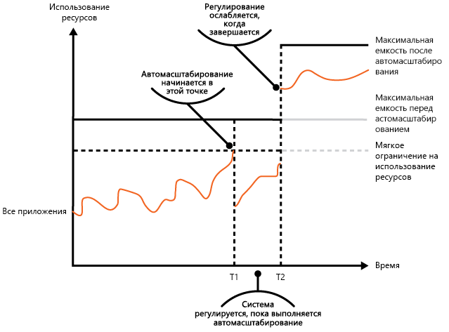

# Шаблон регулированияThrottling pattern

[!INCLUDE [header](../_includes/header.md)]

Контролируйте потребление ресурсов, используемых экземпляром приложения, отдельным клиентом или всей службой.Control the consumption of resources used by an instance of an application, an individual tenant, or an entire service. Благодаря контролю потребления ресурсов система продолжает работать и выполняет соглашение об уровне обслуживания, даже если растущие потребности приводят к чрезмерной нагрузке на ресурсы.This can allow the system to continue to function and meet service level agreements, even when an increase in demand places an extreme load on resources.

## Контекст и проблемаContext and problem

Нагрузка на облачное приложение обычно изменяется со временем в зависимости от количества активных пользователей или действий, которые они выполняют.The load on a cloud application typically varies over time based on the number of active users or the types of activities they are performing. Например, скорее всего, больше активных пользователей будет в рабочее время. Или в конце каждого месяца система будет выполнять аналитику, требующую большого количества вычислительных ресурсов.For example, more users are likely to be active during business hours, or the system might be required to perform computationally expensive analytics at the end of each month. Могут также возникать неожиданные и непредвиденные всплески активности.There might also be sudden and unanticipated bursts in activity. Если потребности системы в обработке превышают емкость доступных ресурсов, производительность системы будет очень низкой, и она даже может перестать работать.If the processing requirements of the system exceed the capacity of the resources that are available, it'll suffer from poor performance and can even fail. Если система должна соответствовать установленному уровню обслуживания, такой сбой может быть неприемлемым.If the system has to meet an agreed level of service, such failure could be unacceptable.

Изменяющуюся нагрузку в облаке можно обрабатывать разными способами. Их выбор зависит от бизнес-целей приложения.There're many strategies available for handling varying load in the cloud, depending on the business goals for the application. Одним из решений может быть автоматическое масштабирование, то есть подготовка тех ресурсов, которые нужны пользователю в конкретный момент.One strategy is to use autoscaling to match the provisioned resources to the user needs at any given time. Это создает потенциал для постоянного удовлетворения потребностей пользователей и одновременной оптимизации эксплуатационных расходов.This has the potential to consistently meet user demand, while optimizing running costs. Однако, хотя автоматическое масштабирование инициирует подготовку дополнительных ресурсов, эта операция не выполняется немедленно.However, while autoscaling can trigger the provisioning of additional resources, this provisioning isn't immediate. Если потребности в ресурсах растут быстро, может возникнуть период дефицита ресурсов.If demand grows quickly, there can be a window of time where there's a resource deficit.

## РешениеSolution

Альтернативная стратегия автоматического масштабирования заключается в том, чтобы позволить приложениям использовать определенное ограниченное количество ресурсов, а затем регулировать приложения по достижении этого ограничения.An alternative strategy to autoscaling is to allow applications to use resources only up to a limit, and then throttle them when this limit is reached. Система должна отслеживать использование ресурсов, чтобы при превышении порогового значения она могла регулировать запросы от одного или нескольких пользователей.The system should monitor how it's using resources so that, when usage exceeds the threshold, it can throttle requests from one or more users. Эта стратегия позволяет системе продолжать работу и выполнять любое соглашение об уровне обслуживания, которое применяется к системе.This will enable the system to continue functioning and meet any service level agreements (SLAs) that are in place. Дополнительные сведения о мониторинге использования ресурсов см. в [руководстве по инструментированию и телеметрии](https://msdn.microsoft.com/library/dn589775.aspx).For more information on monitoring resource usage, see the [Instrumentation and Telemetry Guidance](https://msdn.microsoft.com/library/dn589775.aspx).

В системе могут быть реализованы несколько стратегий регулирования, в том числе:The system could implement several throttling strategies, including:

- Отклонение запросов от отдельного пользователя, который уже получал доступ к API системы более n раз в секунду в течение определенного периода.Rejecting requests from an individual user who's already accessed system APIs more than n times per second over a given period of time. Для этого система должна измерять использование ресурсов для каждого клиента или пользователя, использующих приложение.This requires the system to meter the use of resources for each tenant or user running an application. Дополнительные сведения см. в [руководстве по контролю потребления служб](https://msdn.microsoft.com/library/dn589796.aspx).For more information, see the [Service Metering Guidance](https://msdn.microsoft.com/library/dn589796.aspx).

- Отключение или снижение функциональных возможностей выбранных неосновных служб, что позволяет предоставить достаточное количество ресурсов для беспрепятственной работы основных служб.Disabling or degrading the functionality of selected nonessential services so that essential services can run unimpeded with sufficient resources. Например, если приложение выполняет потоковую передачу видео, для него можно включить более низкое разрешение.For example, if the application is streaming video output, it could switch to a lower resolution.

- Выравнивание нагрузки для распределения объема операций. Этот подход подробно описан в статье о [шаблоне балансировки нагрузки на основе очередей](queue-based-load-leveling.md).Using load leveling to smooth the volume of activity (this approach is covered in more detail by the [Queue-based Load Leveling pattern](queue-based-load-leveling.md)). В среде с поддержкой нескольких клиентов такой подход приведет к снижению производительности для каждого клиента.In a multi-tenant environment, this approach will reduce the performance for every tenant. Если система должна поддерживать разные клиенты с разными соглашениями об уровне обслуживания, запросы более важных клиентов могут обрабатываться немедленно.If the system must support a mix of tenants with different SLAs, the work for high-value tenants might be performed immediately. Запросы других клиентов могут задерживаться и обрабатываться после выполнения более срочных запросов.Requests for other tenants can be held back, and handled when the backlog has eased. Для реализации такого подхода можно использовать [шаблон приоритета очередей][].The [Priority Queue pattern][] could be used to help implement this approach.

- Отсрочка операций для приложений или клиентов с более низким приоритетом.Deferring operations being performed on behalf of lower priority applications or tenants. Эти операции могут быть приостановлены или ограничены. При этом создается исключение,которое сообщает клиенту, что система занята и операцию следует повторить позже.These operations can be suspended or limited, with an exception generated to inform the tenant that the system is busy and that the operation should be retried later.

На этой диаграмме с областями показано использование ресурсов (сочетание памяти, ЦП, пропускной способности и других факторов) по времени для приложений, которые используют три функции.The figure shows an area graph for resource use (a combination of memory, CPU, bandwidth, and other factors) against time for applications that are making use of three features. Функция — это область функциональных возможностей, например компонент, который выполняет определенный набор задач, блок кода, выполняющий сложные вычисления, либо элемент, который реализует какую-то службу, например кэш в памяти.A feature is an area of functionality, such as a component that performs a specific set of tasks, a piece of code that performs a complex calculation, or an element that provides a service such as an in-memory cache. Эти функции обозначены буквами A, B и C.These features are labeled A, B, and C.

> Область под линией функции показывает ресурсы, которые используются приложениями при вызове этой функции.The area immediately below the line for a feature indicates the resources that are used by applications when they invoke this feature. Например, область под линией функции А отображает ресурсы, потребляемые приложениями, которые используют функцию А. Область между линиями функций A и B обозначает ресурсы, используемые приложениями, которые вызывают функцию B. Объединив области всех функций, можно определить совокупное использование ресурсов системы.For example, the area below the line for Feature A shows the resources used by applications that are making use of Feature A, and the area between the lines for Feature A and Feature B indicates the resources used by applications invoking Feature B. Aggregating the areas for each feature shows the total resource use of the system.

На рисунке выше показаны результаты задержки операций.The previous figure illustrates the effects of deferring operations. Непосредственно перед точкой времени T1 общее число ресурсов, выделенных для всех приложений, использующих эти функции, достигает порогового значения (ограничения на использование ресурсов).Just prior to time T1, the total resources allocated to all applications using these features reach a threshold (the limit of resource use). На этом этапе существует риск, что приложения исчерпают доступные ресурсы.At this point, the applications are in danger of exhausting the resources available. В этой системе функция B менее важна, чем функции A и C, поэтому она временно отключается и используемые ею ресурсы освобождаются.In this system, Feature B is less critical than Feature A or Feature C, so it's temporarily disabled and the resources that it was using are released. Между точками времени T1 и T2 приложения, использующие функции A и C, продолжают работать в обычном режиме.Between times T1 and T2, the applications using Feature A and Feature C continue running as normal. Со временем использование ресурсов этими двумя функциями снизится до такой степени, что в момент времени T2 высвободится достаточно ресурсов, чтобы снова включить функцию B.Eventually, the resource use of these two features diminishes to the point when, at time T2, there is sufficient capacity to enable Feature B again.

Автоматическое масштабирование и регулирование можно также совмещать, чтобы обеспечить ответ приложений на запросы и выполнение соглашений об уровне обслуживания.The autoscaling and throttling approaches can also be combined to help keep the applications responsive and within SLAs. Если ожидается, что потребности в ресурсах будут оставаться высокими, регулирование обеспечивает временное решение, пока развертывается система. На этом этапе можно восстановить полную функциональность системы.If the demand is expected to remain high, throttling provides a temporary solution while the system scales out. At this point, the full functionality of the system can be restored.

На следующей диаграмме с областями показано общее использование ресурсов всеми приложениями, работающими в системе, по времени. Также здесь показано, как регулирование можно объединить с автоматическим масштабированием.The next figure shows an area graph of the overall resource use by all applications running in a system against time, and illustrates how throttling can be combined with autoscaling.

В момент времени T1 достигнуто пороговое значение, соответствующее мягкому ограничению на использование ресурсов.At time T1, the threshold specifying the soft limit of resource use is reached. На этом этапе может начаться горизонтальное масштабирование системы. Но если новые ресурсы не станут доступны достаточно быстро, существующие ресурсы могут быть исчерпаны и произойдет сбой системы.At this point, the system can start to scale out. However, if the new resources don't become available quickly enough, then the existing resources might be exhausted and the system could fail. Чтобы предотвратить такое развитие событий, система временно регулируется, как описано выше.To prevent this from occurring, the system is temporarily throttled, as described earlier. После завершения автоматического масштабирования и появления дополнительных ресурсов регулирование можно уменьшить.When autoscaling has completed and the additional resources are available, throttling can be relaxed.

## Проблемы и рекомендацииIssues and considerations

При выборе схемы реализации этого шаблона следует учитывать следующие моменты.You should consider the following points when deciding how to implement this pattern:

- Регулирование приложения и стратегия его реализации является архитектурным решением, которое влияет на всю структуру системы.Throttling an application, and the strategy to use, is an architectural decision that impacts the entire design of a system. Регулирование следует запланировать на раннем этапе разработки приложения, так как его непросто добавить после реализации системы.Throttling should be considered early in the application design process because it isn't easy to add once a system has been implemented.

- Регулирование должно выполняться быстро.Throttling must be performed quickly. Система должна уметь обнаруживать рост активности и реагировать соответствующим образом.The system must be capable of detecting an increase in activity and react accordingly. Система также должна уметь быстро восстанавливаться до исходного состояния после уменьшения нагрузки.The system must also be able to revert to its original state quickly after the load has eased. Для этого необходимо постоянно собирать и отслеживать соответствующие данные производительности.This requires that the appropriate performance data is continually captured and monitored.

- Если службе необходимо временно отклонить запрос пользователя, она должна вернуть конкретный код ошибки, чтобы указать клиентскому приложению, что причиной отказа выполнить операцию является регулирование.If a service needs to temporarily deny a user request, it should return a specific error code so the client application understands that the reason for the refusal to perform an operation is due to throttling. Клиентское приложение может подождать какое-то время перед повторным выполнением запроса.The client application can wait for a period before retrying the request.

- Регулирование может использоваться в качестве временной меры, пока система автоматически масштабируется.Throttling can be used as a temporary measure while a system autoscales. Иногда лучше применить регулирование, чем масштабирование, если всплеск активности появился внезапно и не должен длиться долго, так как масштабирование может привести к значительному увеличению затрат.In some cases it's better to simply throttle, rather than to scale, if a burst in activity is sudden and isn't expected to be long lived because scaling can add considerably to running costs.

- Если регулирование используется в качестве временной меры во время автомасштабирования системы и если потребность в ресурсах растет очень быстро, система может работать неправильно &mdash; даже если она работает в режиме регулирования.If throttling is being used as a temporary measure while a system autoscales, and if resource demands grow very quickly, the system might not be able to continue functioning&mdash;even when operating in a throttled mode. Если это недопустимая ситуация, попробуйте поддерживать больше резервных ресурсов и настроить интенсивное автоматическое масштабирование.If this isn't acceptable, consider maintaining larger capacity reserves and configuring more aggressive autoscaling.

## Когда следует использовать этот шаблонWhen to use this pattern

Используйте этот шаблон в следующих случаях:Use this pattern:

- чтобы гарантировать постоянное соответствие системы соглашению об уровне обслуживания;To ensure that a system continues to meet service level agreements.

- чтобы предотвратить монополизацию ресурсов приложения одним клиентом;To prevent a single tenant from monopolizing the resources provided by an application.

- чтобы справляться со всплесками активности;To handle bursts in activity.

- чтобы оптимизировать затраты на систему, ограничивая максимальные уровни ресурсов, необходимые для поддержания работы системы.To help cost-optimize a system by limiting the maximum resource levels needed to keep it functioning.

## ПримерExample

На последнем рисунке показано, как можно реализовать регулирование в системе, поддерживающей несколько клиентов.The final figure illustrates how throttling can be implemented in a multi-tenant system. Пользователи в каждой клиентской организации получают доступ к размещенному в облаке приложению, в котором они заполняют и отправляют опросы.Users from each of the tenant organizations access a cloud-hosted application where they fill out and submit surveys. Инструментирование в приложении контролирует скорость, с которой пользователи отправляют запросы к приложению.The application contains instrumentation that monitors the rate at which these users are submitting requests to the application.

Чтобы пользователи из одного клиента не влияли на скорость реагирования и доступность приложения для других пользователей, ограничивается число запросов в секунду, которые могут отправить пользователи из одного клиента.In order to prevent the users from one tenant affecting the responsiveness and availability of the application for all other users, a limit is applied to the number of requests per second the users from any one tenant can submit. Приложение блокирует запросы, которые превышают это ограничение.The application blocks requests that exceed this limit.

## Связанные шаблоны и рекомендацииRelated patterns and guidance

При реализации данного шаблона можно принять во внимание следующие шаблоны и рекомендации:The following patterns and guidance may also be relevant when implementing this pattern:
- [Руководство по инструментированию и телеметрии.](https://msdn.microsoft.com/library/dn589775.aspx)[Instrumentation and Telemetry Guidance](https://msdn.microsoft.com/library/dn589775.aspx). Регулирование зависит от сбора сведений об интенсивности использования службы.Throttling depends on gathering information about how heavily a service is being used. Руководство объясняет, как создавать и записывать пользовательские данные мониторинга.Describes how to generate and capture custom monitoring information.
- [Руководство по контролю потребления служб](https://msdn.microsoft.com/library/dn589796.aspx).[Service Metering Guidance](https://msdn.microsoft.com/library/dn589796.aspx). Описывает, как контролировать потребление служб, чтобы знать, как они используются.Describes how to meter the use of services in order to gain an understanding of how they are used. С помощью этих сведений можно определить способ регулирования службы.This information can be useful in determining how to throttle a service.
- [Автоматическое масштабирование](https://msdn.microsoft.com/library/dn589774.aspx).[Autoscaling Guidance](https://msdn.microsoft.com/library/dn589774.aspx). Регулирование может использоваться в качестве временной меры, пока система автоматически масштабируется. Или его можно использовать, чтобы система вообще не выполняла автоматическое масштабирование.Throttling can be used as an interim measure while a system autoscales, or to remove the need for a system to autoscale. Статья содержит сведения о стратегиях автоматического масштабирования.Contains information on autoscaling strategies.
- [Шаблон балансировки нагрузки на основе очередей](queue-based-load-leveling.md).[Queue-based Load Leveling pattern](queue-based-load-leveling.md). Балансировка нагрузки на основе очередей часто используется для реализации регулирования.Queue-based load leveling is a commonly used mechanism for implementing throttling. Очередь может служить буфером, который помогает балансировать скорость доставки в службу запросов, отправляемых приложением.A queue can act as a buffer that helps to even out the rate at which requests sent by an application are delivered to a service.
- [шаблон приоритета очередей][].[Priority Queue pattern][]. Система может использовать очереди с приоритетом в рамках стратегии регулирования, чтобы поддерживать производительность критически важных или ценных приложений, снижая производительность менее важных приложений.A system can use priority queuing as part of its throttling strategy to maintain performance for critical or higher value applications, while reducing the performance of less important applications.

[шаблон приоритета очередей]: priority-queue.md
[Priority Queue pattern]: priority-queue.md