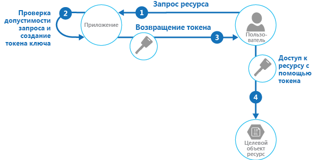

# <a name="valet-key-pattern"></a><span data-ttu-id="8c313-104">Шаблон ключа камердинера</span><span class="sxs-lookup"><span data-stu-id="8c313-104">Valet Key pattern</span></span>

[!INCLUDE [header](../_includes/header.md)]

<span data-ttu-id="8c313-105">Используйте токен, который предоставляет клиентам ограниченный прямой доступ к определенному ресурсу, чтобы разгрузить передачу данных из приложения.</span><span class="sxs-lookup"><span data-stu-id="8c313-105">Use a token that provides clients with restricted direct access to a specific resource, in order to offload data transfer from the application.</span></span> <span data-ttu-id="8c313-106">Это особенно полезно в приложениях, которые используют системы облачных хранилищ или очередей и могут снизить затраты до минимума, а также повысить масштабируемость и производительность до максимума.</span><span class="sxs-lookup"><span data-stu-id="8c313-106">This is particularly useful in applications that use cloud-hosted storage systems or queues, and can minimize cost and maximize scalability and performance.</span></span>

## <a name="context-and-problem"></a><span data-ttu-id="8c313-107">Контекст и проблема</span><span class="sxs-lookup"><span data-stu-id="8c313-107">Context and problem</span></span>

<span data-ttu-id="8c313-108">Клиентским программам и веб-браузерам часто приходится читать и записывать файлы или потоки данных в хранилище приложений и из него.</span><span class="sxs-lookup"><span data-stu-id="8c313-108">Client programs and web browsers often need to read and write files or data streams to and from an application’s storage.</span></span> <span data-ttu-id="8c313-109">Как правило, приложение будет обрабатывать перемещение данных &mdash; либо путем получения их из хранилища и потоковой передачи клиенту, либо путем считывания отправленного потока из клиента и сохранения его в хранилище данных.</span><span class="sxs-lookup"><span data-stu-id="8c313-109">Typically, the application will handle the movement of the data &mdash; either by fetching it from storage and streaming it to the client, or by reading the uploaded stream from the client and storing it in the data store.</span></span> <span data-ttu-id="8c313-110">Однако при этом подходе поглощаются ценные ресурсы, такие как вычисления, память и пропускная способность.</span><span class="sxs-lookup"><span data-stu-id="8c313-110">However, this approach absorbs valuable resources such as compute, memory, and bandwidth.</span></span>

<span data-ttu-id="8c313-111">Хранилища данных имеют возможность обрабатывать отправленные и скачанные данные напрямую, не требуя, чтобы приложение выполняло какую-либо обработку для перемещения этих данных.</span><span class="sxs-lookup"><span data-stu-id="8c313-111">Data stores have the ability to handle upload and download of data directly, without requiring that the application perform any processing to move this data.</span></span> <span data-ttu-id="8c313-112">Однако для этого обычно требуется, чтобы клиент имел доступ к учетным данным безопасности хранилища.</span><span class="sxs-lookup"><span data-stu-id="8c313-112">But, this typically requires the client to have access to the security credentials for the store.</span></span> <span data-ttu-id="8c313-113">Это может быть полезным методом, позволяющим минимизировать затраты на передачу данных и требования по масштабированию, а также повысить производительность приложения.</span><span class="sxs-lookup"><span data-stu-id="8c313-113">This can be a useful technique to minimize data transfer costs and the requirement to scale out the application, and to maximize performance.</span></span> <span data-ttu-id="8c313-114">Однако это означает, что приложение больше не будет управлять безопасностью данных.</span><span class="sxs-lookup"><span data-stu-id="8c313-114">It means, though, that the application is no longer able to manage the security of the data.</span></span> <span data-ttu-id="8c313-115">После того как у клиента появилось подключение к хранилищу данных для прямого доступа, приложение не может выступать в роли привратника.</span><span class="sxs-lookup"><span data-stu-id="8c313-115">After the client has a connection to the data store for direct access, the application can't act as the gatekeeper.</span></span> <span data-ttu-id="8c313-116">Оно больше не контролирует процесс и не может предотвратить последующие отправки или скачивания из хранилища данных.</span><span class="sxs-lookup"><span data-stu-id="8c313-116">It's no longer in control of the process and can't prevent subsequent uploads or downloads from the data store.</span></span>

<span data-ttu-id="8c313-117">Это не реалистичный подход в распределенных системах, которым необходимо обслуживать ненадежных клиентов.</span><span class="sxs-lookup"><span data-stu-id="8c313-117">This isn't a realistic approach in distributed systems that need to serve untrusted clients.</span></span> <span data-ttu-id="8c313-118">Вместо этого приложения должны иметь возможность безопасно и точно управлять доступом, но при этом уменьшать нагрузку на сервер, настраивая это подключение и позволяя клиенту напрямую связываться с хранилищем данных для выполнения необходимых операций чтения или записи.</span><span class="sxs-lookup"><span data-stu-id="8c313-118">Instead, applications must be able to securely control access to data in a granular way, but still reduce the load on the server by setting up this connection and then allowing the client to communicate directly with the data store to perform the required read or write operations.</span></span>

## <a name="solution"></a><span data-ttu-id="8c313-119">Решение</span><span class="sxs-lookup"><span data-stu-id="8c313-119">Solution</span></span>

<span data-ttu-id="8c313-120">Необходимо решить проблему управления доступом к хранилищу данных, в котором хранилище не может управлять проверкой подлинности и авторизацией клиентов.</span><span class="sxs-lookup"><span data-stu-id="8c313-120">You need to resolve the problem of controlling access to a data store where the store can't manage authentication and authorization of clients.</span></span> <span data-ttu-id="8c313-121">Одним из распространенных решений является ограничение доступа к общедоступному подключению хранилища данных и предоставление клиенту ключа или токена, которые можно проверить в хранилище данных.</span><span class="sxs-lookup"><span data-stu-id="8c313-121">One typical solution is to restrict access to the data store’s public connection and provide the client with a key or token that the data store can validate.</span></span>

<span data-ttu-id="8c313-122">Этот ключ или токен обычно называют ключом камердинера.</span><span class="sxs-lookup"><span data-stu-id="8c313-122">This key or token is usually referred to as a valet key.</span></span> <span data-ttu-id="8c313-123">Он обеспечивает ограниченный по времени доступ к определенным ресурсам и позволяет выполнять только предопределенные операции, такие как чтение и запись в хранилище или очереди, а также отправку и скачивание в веб-браузере.</span><span class="sxs-lookup"><span data-stu-id="8c313-123">It provides time-limited access to specific resources and allows only predefined operations such as reading and writing to storage or queues, or uploading and downloading in a web browser.</span></span> <span data-ttu-id="8c313-124">Приложения могут быстро и легко создавать и выдавать ключи камердинера клиентским устройствам и веб-браузерам, что позволяет клиентам выполнять требуемые операции, не требуя от приложения напрямую обрабатывать передачу данных.</span><span class="sxs-lookup"><span data-stu-id="8c313-124">Applications can create and issue valet keys to client devices and web browsers quickly and easily, allowing clients to perform the required operations without requiring the application to directly handle the data transfer.</span></span> <span data-ttu-id="8c313-125">Это убирает дополнительные нагрузки, а также влияние на производительность и масштабируемость приложения и сервера.</span><span class="sxs-lookup"><span data-stu-id="8c313-125">This removes the processing overhead, and the impact on performance and scalability, from the application and the server.</span></span>

<span data-ttu-id="8c313-126">Клиент использует этот токен для доступа к определенному ресурсу в хранилище данных только на определенный период и с конкретными ограничениями на разрешения доступа, как показано на рисунке.</span><span class="sxs-lookup"><span data-stu-id="8c313-126">The client uses this token to access a specific resource in the data store for only a specific period, and with specific restrictions on access permissions, as shown in the figure.</span></span> <span data-ttu-id="8c313-127">По истечении указанного периода ключ становится недействительным и больше не предоставляет доступ к ресурсу.</span><span class="sxs-lookup"><span data-stu-id="8c313-127">After the specified period, the key becomes invalid and won't allow access to the resource.</span></span>



<span data-ttu-id="8c313-129">Кроме того, можно настроить ключ с другими зависимостями, например область данных.</span><span class="sxs-lookup"><span data-stu-id="8c313-129">It's also possible to configure a key that has other dependencies, such as the scope of the data.</span></span> <span data-ttu-id="8c313-130">Например, в зависимости от возможностей хранилища данных ключ может указывать полную таблицу в хранилище данных или только определенные строки в таблице.</span><span class="sxs-lookup"><span data-stu-id="8c313-130">For example, depending on the data store capabilities, the key can specify a complete table in a data store, or only specific rows in a table.</span></span> <span data-ttu-id="8c313-131">В облачных системах хранения ключ может указывать контейнер или только определенный элемент в контейнере.</span><span class="sxs-lookup"><span data-stu-id="8c313-131">In cloud storage systems the key can specify a container, or just a specific item within a container.</span></span>

<span data-ttu-id="8c313-132">Ключ также может стать недействительным для приложения.</span><span class="sxs-lookup"><span data-stu-id="8c313-132">The key can also be invalidated by the application.</span></span> <span data-ttu-id="8c313-133">Это удобный подход, если клиент уведомляет сервер о завершении операции передачи данных.</span><span class="sxs-lookup"><span data-stu-id="8c313-133">This is a useful approach if the client notifies the server that the data transfer operation is complete.</span></span> <span data-ttu-id="8c313-134">Затем сервер может сделать недействительным этот ключ, чтобы предотвратить его дальнейшее использование.</span><span class="sxs-lookup"><span data-stu-id="8c313-134">The server can then invalidate that key to prevent further.</span></span>

<span data-ttu-id="8c313-135">Использование этого шаблона может упростить управление доступом к ресурсам, так как не нужно создавать пользователя и проверять его подлинность, предоставлять разрешения, а затем снова удалять пользователя.</span><span class="sxs-lookup"><span data-stu-id="8c313-135">Using this pattern can simplify managing access to resources because there's no requirement to create and authenticate a user, grant permissions, and then remove the user again.</span></span> <span data-ttu-id="8c313-136">Это также упрощает ограничение расположения, разрешения и периода действия за счет создания ключа в среде выполнения.</span><span class="sxs-lookup"><span data-stu-id="8c313-136">It also makes it easy to limit the location, the permission, and the validity period&mdash;all by simply generating a key at runtime.</span></span> <span data-ttu-id="8c313-137">Важными факторами являются максимальное ограничение срока действия и в особенности расположения ресурса, чтобы получатель мог использовать его только по назначению.</span><span class="sxs-lookup"><span data-stu-id="8c313-137">The important factors are to limit the validity period, and especially the location of the resource, as tightly as possible so that the recipient can only use it for the intended purpose.</span></span>

## <a name="issues-and-considerations"></a><span data-ttu-id="8c313-138">Проблемы и рекомендации</span><span class="sxs-lookup"><span data-stu-id="8c313-138">Issues and considerations</span></span>

<span data-ttu-id="8c313-139">При принятии решения о реализации этого шаблона необходимо учитывать следующие моменты.</span><span class="sxs-lookup"><span data-stu-id="8c313-139">Consider the following points when deciding how to implement this pattern:</span></span>

<span data-ttu-id="8c313-140">**Управляйте состоянием допустимости и периодом действия ключа.**</span><span class="sxs-lookup"><span data-stu-id="8c313-140">**Manage the validity status and period of the key**.</span></span> <span data-ttu-id="8c313-141">При утечке или нарушении безопасности ключ эффективно разблокирует целевой элемент и сделает его доступным для использования злоумышленником в течение срока действия.</span><span class="sxs-lookup"><span data-stu-id="8c313-141">If leaked or compromised, the key effectively unlocks the target item and makes it available for malicious use during the validity period.</span></span> <span data-ttu-id="8c313-142">Ключ обычно можно отозвать или отключить, в зависимости от того, как он был выдан.</span><span class="sxs-lookup"><span data-stu-id="8c313-142">A key can usually be revoked or disabled, depending on how it was issued.</span></span> <span data-ttu-id="8c313-143">Политики на стороне сервера могут быть изменены или ключ сервера, с помощью которого они были подписаны, может быть аннулирован.</span><span class="sxs-lookup"><span data-stu-id="8c313-143">Server-side policies can be changed or, the server key it was signed with can be invalidated.</span></span> <span data-ttu-id="8c313-144">Укажите короткий срок действия, чтобы свести к минимуму риск несанкционированных операций в хранилище данных.</span><span class="sxs-lookup"><span data-stu-id="8c313-144">Specify a short validity period to minimize the risk of allowing unauthorized operations to take place against the data store.</span></span> <span data-ttu-id="8c313-145">Однако, если период действия слишком короткий, клиент может не успеть завершить операцию до истечения срока действия ключа.</span><span class="sxs-lookup"><span data-stu-id="8c313-145">However, if the validity period is too short, the client might not be able to complete the operation before the key expires.</span></span> <span data-ttu-id="8c313-146">Разрешите авторизованным пользователям обновлять ключ до истечения срока действия, если требуется несколько обращений к защищенному ресурсу.</span><span class="sxs-lookup"><span data-stu-id="8c313-146">Allow authorized users to renew the key before the validity period expires if multiple accesses to the protected resource are required.</span></span>

<span data-ttu-id="8c313-147">**Управляйте уровнем доступа, который предоставляет ключ.**</span><span class="sxs-lookup"><span data-stu-id="8c313-147">**Control the level of access the key will provide**.</span></span> <span data-ttu-id="8c313-148">Как правило, ключ должен позволять пользователю выполнять только действия, необходимые для завершения операции, такие как доступ только для чтения, если клиент не должен иметь возможности отправлять данные в хранилище данных.</span><span class="sxs-lookup"><span data-stu-id="8c313-148">Typically, the key should allow the user to only perform the actions necessary to complete the operation, such as read-only access if the client shouldn't be able to upload data to the data store.</span></span> <span data-ttu-id="8c313-149">Для отправки файлов обычно указывается ключ, предоставляющий разрешение только на запись, а также расположение и срок действия.</span><span class="sxs-lookup"><span data-stu-id="8c313-149">For file uploads, it's common to specify a key that provides write-only permission, as well as the location and the validity period.</span></span> <span data-ttu-id="8c313-150">Очень важно точно указать ресурс или набор ресурсов, к которым применяется ключ.</span><span class="sxs-lookup"><span data-stu-id="8c313-150">It's critical to accurately specify the resource or the set of resources to which the key applies.</span></span>

<span data-ttu-id="8c313-151">**Выберите способ управления поведением пользователей.**</span><span class="sxs-lookup"><span data-stu-id="8c313-151">**Consider how to control users’ behavior**.</span></span> <span data-ttu-id="8c313-152">Реализация этого шаблона означает некоторую потерю контроля над ресурсами, к которым предоставляется доступ пользователям.</span><span class="sxs-lookup"><span data-stu-id="8c313-152">Implementing this pattern means some loss of control over the resources users are granted access to.</span></span> <span data-ttu-id="8c313-153">Уровень контроля, который может быть применен, ограничен возможностями политик и разрешений, доступных для службы или целевого хранилища данных.</span><span class="sxs-lookup"><span data-stu-id="8c313-153">The level of control that can be exerted is limited by the capabilities of the policies and permissions available for the service or the target data store.</span></span> <span data-ttu-id="8c313-154">Например, обычно невозможно создать ключ, ограничивающий размер данных, записываемых в хранилище, или то, сколько раз ключ может использоваться для доступа к файлу.</span><span class="sxs-lookup"><span data-stu-id="8c313-154">For example, it's usually not possible to create a key that limits the size of the data to be written to storage, or the number of times the key can be used to access a file.</span></span> <span data-ttu-id="8c313-155">Это может привести к огромным непредвиденным расходам на передачу данных даже при использовании предполагаемым клиентом и может быть вызвано ошибкой в ​​коде, вызывающей повторную отправку или скачивание.</span><span class="sxs-lookup"><span data-stu-id="8c313-155">This can result in huge unexpected costs for data transfer, even when used by the intended client, and might be caused by an error in the code that causes repeated upload or download.</span></span> <span data-ttu-id="8c313-156">Чтобы ограничить количество отправок файла, по возможности настройте клиент для принудительного уведомления приложения после завершения одной операции.</span><span class="sxs-lookup"><span data-stu-id="8c313-156">To limit the number of times a file can be uploaded, where possible, force the client to notify the application when one operation has completed.</span></span> <span data-ttu-id="8c313-157">Например, некоторые хранилища данных вызывают события, которые код приложения может использовать для мониторинга операций и управления поведением пользователя.</span><span class="sxs-lookup"><span data-stu-id="8c313-157">For example, some data stores raise events the application code can use to monitor operations and control user behavior.</span></span> <span data-ttu-id="8c313-158">Однако это затрудняет принудительное использование квот для отдельных пользователей в сценарии с несколькими клиентами, в котором один и тот же ключ используется всеми пользователями одного клиента.</span><span class="sxs-lookup"><span data-stu-id="8c313-158">However, it's hard to enforce quotas for individual users in a multi-tenant scenario where the same key is used by all the users from one tenant.</span></span>

<span data-ttu-id="8c313-159">**Проверяйте и при необходимости очищайте все отправленные данные.**</span><span class="sxs-lookup"><span data-stu-id="8c313-159">**Validate, and optionally sanitize, all uploaded data**.</span></span> <span data-ttu-id="8c313-160">Злоумышленник, который получает доступ к ключу, может отправлять данные, предназначенные для компрометации системы.</span><span class="sxs-lookup"><span data-stu-id="8c313-160">A malicious user that gains access to the key could upload data designed to compromise the system.</span></span> <span data-ttu-id="8c313-161">Кроме того, авторизованные пользователи могут отправлять недопустимые данные, которые при обработке могут привести к ошибке или сбою системы.</span><span class="sxs-lookup"><span data-stu-id="8c313-161">Alternatively, authorized users might upload data that's invalid and, when processed, could result in an error or system failure.</span></span> <span data-ttu-id="8c313-162">Чтобы избежать этого перед использованием, убедитесь, что все отправленные данные проверены на наличие вредоносного содержимого.</span><span class="sxs-lookup"><span data-stu-id="8c313-162">To protect against this, ensure that all uploaded data is validated and checked for malicious content before use.</span></span>

<span data-ttu-id="8c313-163">**Выполняйте аудит всех операций.**</span><span class="sxs-lookup"><span data-stu-id="8c313-163">**Audit all operations**.</span></span> <span data-ttu-id="8c313-164">Многие механизмы, основанные на использовании ключей, могут записывать в журналы операции, такие как отправка и скачивание, а также сбои.</span><span class="sxs-lookup"><span data-stu-id="8c313-164">Many key-based mechanisms can log operations such as uploads, downloads, and failures.</span></span> <span data-ttu-id="8c313-165">Эти журналы обычно можно включить в процесс аудита, а также использовать для выставления счетов, если плата взимается с пользователя на основе размера файлов и объема данных.</span><span class="sxs-lookup"><span data-stu-id="8c313-165">These logs can usually be incorporated into an audit process, and also used for billing if the user is charged based on file size or data volume.</span></span> <span data-ttu-id="8c313-166">Используйте журналы для обнаружения ошибок проверки подлинности, которые могут быть вызваны проблемами с поставщиком ключей или случайным удалением хранимой политики доступа.</span><span class="sxs-lookup"><span data-stu-id="8c313-166">Use the logs to detect authentication failures that might be caused by issues with the key provider, or accidental removal of a stored access policy.</span></span>

<span data-ttu-id="8c313-167">**Доставляйте ключи безопасным образом.**</span><span class="sxs-lookup"><span data-stu-id="8c313-167">**Deliver the key securely**.</span></span> <span data-ttu-id="8c313-168">Ключ может быть встроен в URL-адрес, который пользователь активирует на веб-странице, или использоваться в операции перенаправления на сервере для автоматического скачивания.</span><span class="sxs-lookup"><span data-stu-id="8c313-168">It can be embedded in a URL that the user activates in a web page, or it can be used in a server redirection operation so that the download occurs automatically.</span></span> <span data-ttu-id="8c313-169">Всегда используйте HTTPS для доставки ключа по безопасному каналу.</span><span class="sxs-lookup"><span data-stu-id="8c313-169">Always use HTTPS to deliver the key over a secure channel.</span></span>

<span data-ttu-id="8c313-170">**Защищайте конфиденциальные данные во время передачи.**</span><span class="sxs-lookup"><span data-stu-id="8c313-170">**Protect sensitive data in transit**.</span></span> <span data-ttu-id="8c313-171">Передача конфиденциальных данных через приложение обычно выполняется с помощью SSL или TLS. Этот подход должен применяться к клиентам, обращающимся непосредственно к хранилищу данных.</span><span class="sxs-lookup"><span data-stu-id="8c313-171">Sensitive data delivered through the application will usually take place using SSL or TLS, and this should be enforced for clients accessing the data store directly.</span></span>

<span data-ttu-id="8c313-172">Ниже приведены другие проблемы, которые необходимо учитывать при реализации данного шаблона:</span><span class="sxs-lookup"><span data-stu-id="8c313-172">Other issues to be aware of when implementing this pattern are:</span></span>

- <span data-ttu-id="8c313-173">Если клиент не уведомляет или не может уведомить сервер о завершении операции, а единственным ограничением является срок действия ключа, приложение не сможет выполнять операции аудита, такие как подсчет операций отправки или скачивания, или предотвращать множественные отправки или скачивания.</span><span class="sxs-lookup"><span data-stu-id="8c313-173">If the client doesn't, or can't, notify the server of completion of the operation, and the only limit is the expiration period of the key, the application won't be able to perform auditing operations such as counting the number of uploads or downloads, or preventing multiple uploads or downloads.</span></span>

- <span data-ttu-id="8c313-174">Гибкость основных политик, которые могут быть созданы, может быть ограничена.</span><span class="sxs-lookup"><span data-stu-id="8c313-174">The flexibility of key policies that can be generated might be limited.</span></span> <span data-ttu-id="8c313-175">Например, некоторые механизмы разрешают использование только временного периода истечения срока действия,</span><span class="sxs-lookup"><span data-stu-id="8c313-175">For example, some mechanisms only allow the use of a timed expiration period.</span></span> <span data-ttu-id="8c313-176">а другие не могут задать достаточную степень детализации разрешений на чтение или запись.</span><span class="sxs-lookup"><span data-stu-id="8c313-176">Others aren't able to specify a sufficient granularity of read/write permissions.</span></span>

- <span data-ttu-id="8c313-177">Если указано время начала периода действия ключа или токена, убедитесь, что оно немного предшествует текущему времени сервера, позволяя работать часам клиента, которые могут быть немного рассинхронизированы.</span><span class="sxs-lookup"><span data-stu-id="8c313-177">If the start time for the key or token validity period is specified, ensure that it's a little earlier than the current server time to allow for client clocks that might be slightly out of synchronization.</span></span> <span data-ttu-id="8c313-178">По умолчанию, если не задано, обычно это текущее время сервера.</span><span class="sxs-lookup"><span data-stu-id="8c313-178">The default, if not specified, is usually the current server time.</span></span>

- <span data-ttu-id="8c313-179">URL-адрес, содержащий ключ, записывается в файлы журналов сервера.</span><span class="sxs-lookup"><span data-stu-id="8c313-179">The URL containing the key will be recorded in server log files.</span></span> <span data-ttu-id="8c313-180">Хотя срок действия ключа, как правило, истекает, прежде чем файлы журнала будут использованы для анализа, ограничьте доступ к ним.</span><span class="sxs-lookup"><span data-stu-id="8c313-180">While the key will typically have expired before the log files are used for analysis, ensure that you limit access to them.</span></span> <span data-ttu-id="8c313-181">Если данные журнала передаются в систему мониторинга или хранятся в другом расположении, рассмотрите возможность применения задержки во избежание утечки ключей до истечения срока их действия.</span><span class="sxs-lookup"><span data-stu-id="8c313-181">If log data is transmitted to a monitoring system or stored in another location, consider implementing a delay to prevent leakage of keys until after their validity period has expired.</span></span>

- <span data-ttu-id="8c313-182">Если код клиента выполняется в веб-браузере, браузер может поддержать общий доступ к ресурсам независимо от источника (CORS), чтобы включить код, который выполняется в веб-браузере, и получить доступ к данным в другом домене из того, который обслуживал страницу.</span><span class="sxs-lookup"><span data-stu-id="8c313-182">If the client code runs in a web browser, the browser might need to support cross-origin resource sharing (CORS) to enable code that executes within the web browser to access data in a different domain from the one that served the page.</span></span> <span data-ttu-id="8c313-183">Некоторые старые браузеры и хранилища данных не поддерживают CORS, а код в этих браузерах может использовать ключ камердинера для обеспечения доступа к данным в другом домене, таком как облачная учетная запись хранения.</span><span class="sxs-lookup"><span data-stu-id="8c313-183">Some older browsers and some data stores don't support CORS, and code that runs in these browsers might be able to use a valet key to provide access to data in a different domain, such as a cloud storage account.</span></span>

## <a name="when-to-use-this-pattern"></a><span data-ttu-id="8c313-184">Когда следует использовать этот шаблон</span><span class="sxs-lookup"><span data-stu-id="8c313-184">When to use this pattern</span></span>

<span data-ttu-id="8c313-185">Этот шаблон будет полезен в следующих сценариях:</span><span class="sxs-lookup"><span data-stu-id="8c313-185">This pattern is useful for the following situations:</span></span>

- <span data-ttu-id="8c313-186">Чтобы свести к минимуму нагрузку ресурсов и обеспечить максимальную производительность и масштабируемость.</span><span class="sxs-lookup"><span data-stu-id="8c313-186">To minimize resource loading and maximize performance and scalability.</span></span> <span data-ttu-id="8c313-187">Использование ключа камердинера не требует блокировки ресурса или удаленного вызова сервера, нет ограничений на количество выдаваемых ключей камердинера. Это позволяет избежать единой точки отказа, возникающей из-за передачи данных через код приложения.</span><span class="sxs-lookup"><span data-stu-id="8c313-187">Using a valet key doesn't require the resource to be locked, no remote server call is required, there's no limit on the number of valet keys that can be issued, and it avoids a single point of failure resulting from performing the data transfer through the application code.</span></span> <span data-ttu-id="8c313-188">Создание ключа камердинера — это обычно простая криптографическая операция подписи строки с ключом.</span><span class="sxs-lookup"><span data-stu-id="8c313-188">Creating a valet key is typically a simple cryptographic operation of signing a string with a key.</span></span>

- <span data-ttu-id="8c313-189">Чтобы свести к минимуму операционные расходы.</span><span class="sxs-lookup"><span data-stu-id="8c313-189">To minimize operational cost.</span></span> <span data-ttu-id="8c313-190">Включение прямого доступа к хранилищам и очередям — выгодный в отношении ресурсов и экономически обоснованный подход, который может уменьшить количество круговых путей в сети, а также сократить количество требуемых вычислительных ресурсов.</span><span class="sxs-lookup"><span data-stu-id="8c313-190">Enabling direct access to stores and queues is resource and cost efficient, can result in fewer network round trips, and might allow for a reduction in the number of compute resources required.</span></span>

- <span data-ttu-id="8c313-191">Когда клиенты регулярно отправляют или скачивают большие объемы данных или когда в каждой операции используются большие файлы.</span><span class="sxs-lookup"><span data-stu-id="8c313-191">When clients regularly upload or download data, particularly where there's a large volume or when each operation involves large files.</span></span>

- <span data-ttu-id="8c313-192">Когда в приложении ограничены вычислительные ресурсы, либо из-за ограничений узла, либо из соображений стоимости.</span><span class="sxs-lookup"><span data-stu-id="8c313-192">When the application has limited compute resources available, either due to hosting limitations or cost considerations.</span></span> <span data-ttu-id="8c313-193">В этом сценарии шаблон будет еще более полезен, если есть много параллельных отправок или скачиваний данных, так как он освобождает приложение от обработки передачи данных.</span><span class="sxs-lookup"><span data-stu-id="8c313-193">In this scenario, the pattern is even more helpful if there are many concurrent data uploads or downloads because it relieves the application from handling the data transfer.</span></span>

- <span data-ttu-id="8c313-194">Когда данные хранятся в удаленном хранилище данных или в другом центре данных.</span><span class="sxs-lookup"><span data-stu-id="8c313-194">When the data is stored in a remote data store or a different datacenter.</span></span> <span data-ttu-id="8c313-195">Если приложение должно было выступать в качестве привратника, за передачу данных между центрами обработки данных или между общедоступными и частными сетями, между клиентом и приложением, а затем между приложением и хранилищем данных может взиматься дополнительная плата за использование пропускной способности.</span><span class="sxs-lookup"><span data-stu-id="8c313-195">If the application was required to act as a gatekeeper, there might be a charge for the additional bandwidth of transferring the data between datacenters, or across public or private networks between the client and the application, and then between the application and the data store.</span></span>

<span data-ttu-id="8c313-196">Этот шаблон неприменим в следующих случаях:</span><span class="sxs-lookup"><span data-stu-id="8c313-196">This pattern might not be useful in the following situations:</span></span>

- <span data-ttu-id="8c313-197">Если приложение должно выполнить некоторую задачу на основе данных перед ее сохранением или до ее отправки клиенту.</span><span class="sxs-lookup"><span data-stu-id="8c313-197">If the application must perform some task on the data before it's stored or before it's sent to the client.</span></span> <span data-ttu-id="8c313-198">Например, если приложение должно выполнить проверку, успешно получить доступ к журналу или выполнить преобразование данных.</span><span class="sxs-lookup"><span data-stu-id="8c313-198">For example, if the application needs to perform validation, log access success, or execute a transformation on the data.</span></span> <span data-ttu-id="8c313-199">Однако некоторые хранилища данных и клиенты могут согласовывать действия и выполнять простые преобразования, такие как сжатие и распаковка (например, веб-браузер обычно может обрабатывать форматы GZIP).</span><span class="sxs-lookup"><span data-stu-id="8c313-199">However, some data stores and clients are able to negotiate and carry out simple transformations such as compression and decompression (for example, a web browser can usually handle GZip formats).</span></span>

- <span data-ttu-id="8c313-200">Если структура имеющегося приложения затрудняет внедрение шаблона.</span><span class="sxs-lookup"><span data-stu-id="8c313-200">If the design of an existing application makes it difficult to incorporate the pattern.</span></span> <span data-ttu-id="8c313-201">Использование этого шаблона обычно требует другого архитектурного подхода к доставке и приему данных.</span><span class="sxs-lookup"><span data-stu-id="8c313-201">Using this pattern typically requires a different architectural approach for delivering and receiving data.</span></span>

- <span data-ttu-id="8c313-202">Если необходимо обслуживать журнал аудита или управлять количеством выполнений операции передачи данных, а используемый механизм ключа камердинера не поддерживает уведомления, которые сервер может использовать для управления этими операциями.</span><span class="sxs-lookup"><span data-stu-id="8c313-202">If it's necessary to maintain audit trails or control the number of times a data transfer operation is executed, and the valet key mechanism in use doesn't support notifications that the server can use to manage these operations.</span></span>

- <span data-ttu-id="8c313-203">При необходимости ограничьте объем данных, особенно во время операций отправки.</span><span class="sxs-lookup"><span data-stu-id="8c313-203">If it's necessary to limit the size of the data, especially during upload operations.</span></span> <span data-ttu-id="8c313-204">Единственным решением является проверка в приложении размера данных после завершения операции или проверка размера отправок через определенный период или по расписанию.</span><span class="sxs-lookup"><span data-stu-id="8c313-204">The only solution to this is for the application to check the data size after the operation is complete, or check the size of uploads after a specified period or on a scheduled basis.</span></span>

## <a name="example"></a><span data-ttu-id="8c313-205">Пример</span><span class="sxs-lookup"><span data-stu-id="8c313-205">Example</span></span>

<span data-ttu-id="8c313-206">Azure поддерживает подписанный URL-адрес в службе хранилища Azure для детального контроля доступа к данным в больших двоичных объектах, таблицах и очередях, а также для очередей и разделов служебной шины.</span><span class="sxs-lookup"><span data-stu-id="8c313-206">Azure supports shared access signatures on Azure Storage for granular access control to data in blobs, tables, and queues, and for Service Bus queues and topics.</span></span> <span data-ttu-id="8c313-207">Маркер подписанного URL-адреса можно настроить, чтобы предоставлять определенные права доступа, такие как чтение, запись, обновление и удаление в конкретной таблице; диапазон ключей внутри таблицы; очередь; большой двоичный объект; контейнер большого двоичного объекта.</span><span class="sxs-lookup"><span data-stu-id="8c313-207">A shared access signature token can be configured to provide specific access rights such as read, write, update, and delete to a specific table; a key range within a table; a queue; a blob; or a blob container.</span></span> <span data-ttu-id="8c313-208">Срок действия может быть указанным периодом времени или не иметь ограничения по времени.</span><span class="sxs-lookup"><span data-stu-id="8c313-208">The validity can be a specified time period or with no time limit.</span></span>

<span data-ttu-id="8c313-209">Подписанные URL-адреса Azure также поддерживают хранимые сервером политики доступа, которые могут быть связаны с определенным ресурсом, таким как таблица или большой двоичный объект.</span><span class="sxs-lookup"><span data-stu-id="8c313-209">Azure shared access signatures also support server-stored access policies that can be associated with a specific resource such as a table or blob.</span></span> <span data-ttu-id="8c313-210">Эта функция обеспечивает дополнительный контроль и гибкость по сравнению с создаваемыми приложением маркерами подписанного URL-адреса и должна по возможности использоваться.</span><span class="sxs-lookup"><span data-stu-id="8c313-210">This feature provides additional control and flexibility compared to application-generated shared access signature tokens, and should be used whenever possible.</span></span> <span data-ttu-id="8c313-211">Параметры, определенные в хранимой на сервере политике, можно изменить и отразить в токене без необходимости выпускать новый токен, но параметры, определенные в токене, нельзя изменить без выдачи нового токена.</span><span class="sxs-lookup"><span data-stu-id="8c313-211">Settings defined in a server-stored policy can be changed and are reflected in the token without requiring a new token to be issued, but settings defined in the token can't be changed without issuing a new token.</span></span> <span data-ttu-id="8c313-212">Этот подход также позволяет отменить допустимый маркер подписанного URL-адреса до истечения срока его действия.</span><span class="sxs-lookup"><span data-stu-id="8c313-212">This approach also makes it possible to revoke a valid shared access signature token before it's expired.</span></span>

> <span data-ttu-id="8c313-213">Дополнительные сведения см. в записи блога MSDN [Introducing Table SAS (Shared Access Signature), Queue SAS and update to Blob SAS](https://blogs.msdn.microsoft.com/windowsazurestorage/2012/06/12/introducing-table-sas-shared-access-signature-queue-sas-and-update-to-blob-sas/) (Знакомство с SAS таблиц, SAS очередей и изменениями SAS больших двоичных объектов) и статье [Использование подписанных URL-адресов (SAS)](https://azure.microsoft.com/documentation/articles/storage-dotnet-shared-access-signature-part-1/).</span><span class="sxs-lookup"><span data-stu-id="8c313-213">For more information see [Introducing Table SAS (Shared Access Signature), Queue SAS and update to Blob SAS](https://blogs.msdn.microsoft.com/windowsazurestorage/2012/06/12/introducing-table-sas-shared-access-signature-queue-sas-and-update-to-blob-sas/) and [Using Shared Access Signatures](https://azure.microsoft.com/documentation/articles/storage-dotnet-shared-access-signature-part-1/) on MSDN.</span></span>

<span data-ttu-id="8c313-214">В следующем коде показано, как создать маркер подписанного URL-адреса, действительного в течение пяти минут.</span><span class="sxs-lookup"><span data-stu-id="8c313-214">The following code shows how to create a shared access signature token that's valid for five minutes.</span></span> <span data-ttu-id="8c313-215">Метод `GetSharedAccessReferenceForUpload` возвращает маркер подписанного URL-адреса, который можно использовать для отправки файла в хранилище BLOB-объектов Azure.</span><span class="sxs-lookup"><span data-stu-id="8c313-215">The `GetSharedAccessReferenceForUpload` method returns a shared access signatures token that can be used to upload a file to Azure Blob Storage.</span></span>

```csharp
public class ValuesController : ApiController
{
  private readonly CloudStorageAccount account;
  private readonly string blobContainer;
  ...
  /// <summary>
  /// Return a limited access key that allows the caller to upload a file
  /// to this specific destination for a defined period of time.
  /// </summary>
  private StorageEntitySas GetSharedAccessReferenceForUpload(string blobName)
  {
    var blobClient = this.account.CreateCloudBlobClient();
    var container = blobClient.GetContainerReference(this.blobContainer);

    var blob = container.GetBlockBlobReference(blobName);

    var policy = new SharedAccessBlobPolicy
    {
      Permissions = SharedAccessBlobPermissions.Write,

      // Specify a start time five minutes earlier to allow for client clock skew.
      SharedAccessStartTime = DateTime.UtcNow.AddMinutes(-5),

      // Specify a validity period of five minutes starting from now.
      SharedAccessExpiryTime = DateTime.UtcNow.AddMinutes(5)
    };

    // Create the signature.
    var sas = blob.GetSharedAccessSignature(policy);

    return new StorageEntitySas
    {
      BlobUri = blob.Uri,
      Credentials = sas,
      Name = blobName
    };
  }

  public struct StorageEntitySas
  {
    public string Credentials;
    public Uri BlobUri;
    public string Name;
  }
}
```

> <span data-ttu-id="8c313-216">Полный пример доступен в решении ValetKey, которое доступно для скачивания с [GitHub](https://github.com/mspnp/cloud-design-patterns/tree/master/valet-key).</span><span class="sxs-lookup"><span data-stu-id="8c313-216">The complete sample is available in the ValetKey solution available for download from [GitHub](https://github.com/mspnp/cloud-design-patterns/tree/master/valet-key).</span></span> <span data-ttu-id="8c313-217">Проект ValetKey.Web в этом решении содержит веб-приложение, которое включает в себя класс `ValuesController`, показанный выше.</span><span class="sxs-lookup"><span data-stu-id="8c313-217">The ValetKey.Web project in this solution contains a web application that includes the `ValuesController` class shown above.</span></span> <span data-ttu-id="8c313-218">Пример клиентского приложения, использующего это веб-приложение для получения ключа подписанного URL-адреса и отправки файла в хранилище больших двоичных объектов, доступен в проекте ValetKey.Client.</span><span class="sxs-lookup"><span data-stu-id="8c313-218">A sample client application that uses this web application to retrieve a shared access signatures key and upload a file to blob storage is available in the ValetKey.Client project.</span></span>

## <a name="next-steps"></a><span data-ttu-id="8c313-219">Дальнейшие действия</span><span class="sxs-lookup"><span data-stu-id="8c313-219">Next steps</span></span>

<span data-ttu-id="8c313-220">При реализации этого шаблона следует принять во внимание следующие шаблоны и рекомендации.</span><span class="sxs-lookup"><span data-stu-id="8c313-220">The following patterns and guidance might also be relevant when implementing this pattern:</span></span>
- <span data-ttu-id="8c313-221">Пример, демонстрирующий этот шаблон, можно найти на сайте [GitHub](https://github.com/mspnp/cloud-design-patterns/tree/master/valet-key).</span><span class="sxs-lookup"><span data-stu-id="8c313-221">A sample that demonstrates this pattern is available on [GitHub](https://github.com/mspnp/cloud-design-patterns/tree/master/valet-key).</span></span>
- <span data-ttu-id="8c313-222">[Шаблон привратника](gatekeeper.md).</span><span class="sxs-lookup"><span data-stu-id="8c313-222">[Gatekeeper pattern](gatekeeper.md).</span></span> <span data-ttu-id="8c313-223">Этот шаблон можно использовать в сочетании с шаблоном ключа камердинера для защиты приложений и служб с помощью выделенного экземпляра узла, который выполняет роль брокера между клиентами и приложением или службой.</span><span class="sxs-lookup"><span data-stu-id="8c313-223">This pattern can be used in conjunction with the Valet Key pattern to protect applications and services by using a dedicated host instance that acts as a broker between clients and the application or service.</span></span> <span data-ttu-id="8c313-224">Привратник проверяет и очищает запросы, а также передает запросы и данные между клиентом и приложением.</span><span class="sxs-lookup"><span data-stu-id="8c313-224">The gatekeeper validates and sanitizes requests, and passes requests and data between the client and the application.</span></span> <span data-ttu-id="8c313-225">Обеспечивает дополнительный уровень защиты и уменьшает степень влияния атаки на систему.</span><span class="sxs-lookup"><span data-stu-id="8c313-225">Can provide an additional layer of security, and reduce the attack surface of the system.</span></span>
- <span data-ttu-id="8c313-226">[Шаблон размещения статического содержимого](static-content-hosting.md).</span><span class="sxs-lookup"><span data-stu-id="8c313-226">[Static Content Hosting pattern](static-content-hosting.md).</span></span> <span data-ttu-id="8c313-227">Здесь описано, как развертывать статические ресурсы в облачной службе хранения, которая может доставлять эти ресурсы непосредственно клиенту, чтобы уменьшить потребность в дорогостоящих экземплярах вычислений.</span><span class="sxs-lookup"><span data-stu-id="8c313-227">Describes how to deploy static resources to a cloud-based storage service that can deliver these resources directly to the client to reduce the requirement for expensive compute instances.</span></span> <span data-ttu-id="8c313-228">Если ресурсы не предназначены для публичного доступа, шаблон ключа камердинера можно использовать для их защиты.</span><span class="sxs-lookup"><span data-stu-id="8c313-228">Where the resources aren't intended to be publicly available, the Valet Key pattern can be used to secure them.</span></span>
- <span data-ttu-id="8c313-229">[Introducing Table SAS (Shared Access Signature), Queue SAS and update to Blob SAS](https://blogs.msdn.microsoft.com/windowsazurestorage/2012/06/12/introducing-table-sas-shared-access-signature-queue-sas-and-update-to-blob-sas/) (Знакомство с SAS таблиц, SAS очередей и изменениями SAS больших двоичных объектов).</span><span class="sxs-lookup"><span data-stu-id="8c313-229">[Introducing Table SAS (Shared Access Signature), Queue SAS and update to Blob SAS](https://blogs.msdn.microsoft.com/windowsazurestorage/2012/06/12/introducing-table-sas-shared-access-signature-queue-sas-and-update-to-blob-sas/)</span></span>
- <span data-ttu-id="8c313-230">[Использование подписанных URL-адресов (SAS)](https://azure.microsoft.com/documentation/articles/storage-dotnet-shared-access-signature-part-1/).</span><span class="sxs-lookup"><span data-stu-id="8c313-230">[Using Shared Access Signatures](https://azure.microsoft.com/documentation/articles/storage-dotnet-shared-access-signature-part-1/)</span></span>
- [<span data-ttu-id="8c313-231">Проверка подлинности подписи при общем доступе с помощью служебной шины</span><span class="sxs-lookup"><span data-stu-id="8c313-231">Shared Access Signature Authentication with Service Bus</span></span>](https://azure.microsoft.com/documentation/articles/service-bus-shared-access-signature-authentication/)
