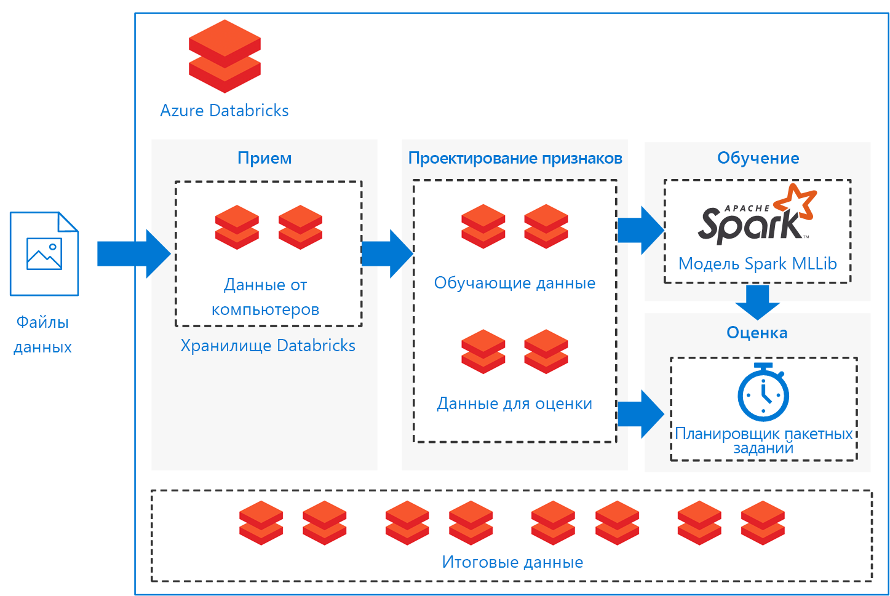

# Пакетная оценка моделей Spark в Azure DatabricksBatch scoring of Spark models on Azure Databricks

Эта эталонная архитектура позволяет создать масштабируемое решение для пакетной оценки модели классификации Apache Spark по расписанию с помощью Azure Databricks, оптимизированной для Azure аналитической платформы на основе Apache Spark.This reference architecture shows how to build a scalable solution for batch scoring an Apache Spark classification model on a schedule using Azure Databricks, an Apache Spark-based analytics platform optimized for Azure. Вы можете использовать это решение в качестве шаблона, применимого и к другим сценариям.The solution can be used as a template that can be generalized to other scenarios.

Ссылку на реализацию этой архитектуры можно найти на сайте  [GitHub][github].A reference implementation for this architecture is available on [GitHub][github].

**Сценарий**. Предприятие из отрасли, требующей интенсивного использования ресурсов, намерено сократить расходы и время простоя в связи с непредвиденными физическими сбоями.**Scenario**: A business in an asset-heavy industry wants to minimize the costs and downtime associated with unexpected mechanical failures. Используя данные Интернета, полученные со своих компьютеров, они могут создавать модели прогнозного обслуживания.Using IoT data collected from their machines, they can create a predictive maintenance model. Эта модель позволит организации обслуживать и ремонтировать компоненты до того, как они выйдут из строя.This model enables the business to maintain components proactively and repair them before they fail. Повысив эффективность использования физических компонентов, они смогут снизить расходы и сократить время простоя.By maximizing mechanical component use, they can control costs and reduce downtime.

Модель прогнозного обслуживания собирает данные с компьютеров и сохраняет зарегистрированные данные о сбоях компонентов.A predictive maintenance model collects data from the machines and retains historical examples of component failures. Эту модель затем можно применить для отслеживания текущего состояния компонентов и прогнозировать на ее основе вероятность сбоя компонентов в ближайшем будущем.The model can then be used to monitor the current state of the components and predict if a given component will fail in the near future. Распространенные варианты использования и подходы к моделированию см. в [руководстве по использованию Azure ИИ для создания решений прогнозного обслуживания][ai-guide].For common use cases and modeling approaches, see [Azure AI guide for predictive maintenance solutions][ai-guide].

Эта эталонная архитектура предназначена для рабочих нагрузок, которые активируются при получении новых данных от физических компонентов.This reference architecture is designed for workloads that are triggered by the presence of new data from the component machines. Обработка предусматривает указанные ниже действия.Processing involves the following steps:

1. Прием данных из внешнего хранилища данных в хранилище данных Azure Databricks.Ingest the data from the external data store onto an Azure Databricks data store.

2. Обучение модели машинного обучения путем преобразования данных в обучающий набор данных с последующим созданием модели Spark MLlib.Train a machine learning model by transforming the data into a training data set, then building a Spark MLlib model. MLlib содержит распространенные алгоритмы машинного обучения и служебные программы, оптимизированные для использования поддерживаемых в Spark возможностей масштабируемости данных.MLlib consists of most common machine learning algorithms and utilities optimized to take advantage of Spark data scalability capabilities.

3. Применение обученной модели для прогнозирования (классификация) сбоев компонентов путем преобразования данных в оценочный набор данных.Apply the trained model to predict (classify) component failures by transforming the data into a scoring data set. Оценка данных с помощью модели Spark MLLib.Score the data with the Spark MLLib model.

4. Сохранение результатов в хранилище данных Databricks для использования после обработки.Store results on the Databricks data store for post-processing consumption.

Для каждой из этих задач на  [GitHub][github] доступны готовые записные книжки.Notebooks are provided on [GitHub][github] to perform each of these tasks.

## АрхитектураArchitecture

Архитектура определяет поток данных, который полностью содержится в [Azure Databricks][databricks] на основе набора последовательно выполняемых [записных книжек][notebooks].The architecture defines a data flow that is entirely contained within [Azure Databricks][databricks] based on a set of sequentially executed [notebooks][notebooks]. Она содержит следующие компоненты.It consists of the following components:

**[Файлы данных][github]**.**[Data files][github]**. Эталонная реализация использует имитированный набор данных, содержащийся в пяти файлах статических данных.The reference implementation uses a simulated data set contained in five static data files.

**[Прием][notebooks]**.**[Ingestion][notebooks]**. Записная книжка для приема данных скачивает входные файлы данных в коллекцию наборов данных Databricks.The data ingestion notebook downloads the input data files into a collection of Databricks data sets. В реальном сценарии поток данных с устройств Интернета вещей будет поступать в хранилище, доступное для Databricks, например экземпляр Azure SQL Server или хранилище BLOB-объектов Azure.In a real-world scenario, data from IoT devices would stream onto Databricks-accessible storage such as Azure SQL Server or Azure Blob storage. Databricks поддерживает несколько [источников данных][data-sources].Databricks supports multiple [data sources][data-sources].

**Конвейер обучения**.**Training pipeline**. Эта записная книжка выполняет записную книжку проектирования признаков, чтобы на основе полученных данных создать набор аналитических данных.This notebook executes the feature engineering notebook to create an analysis data set from the ingested data. Затем выполняется записная книжка создания модели, которая обучает модель машинного обучения с помощью масштабируемой библиотеки машинного обучения [Apache Spark MLlib][mllib].It then executes a model building notebook that trains the machine learning model using the [Apache Spark MLlib][mllib] scalable machine learning library.

**Конвейер оценки**.**Scoring pipeline**. Эта записная книжка выполняет записную книжку проектирования признаков, чтобы на основе полученных данных создать набор оценочных данных, и записную книжку оценки.This notebook executes the feature engineering notebook to create scoring data set from the ingested data and executes the scoring notebook. Записная книжка оценки использует обученную модель [Spark MLlib][mllib-spark] для создания прогнозов для наблюдений в оценочном наборе данных.The scoring notebook uses the trained [Spark MLlib][mllib-spark] model to generate predictions for the observations in the scoring data set. Эти прогнозы сохраняются в хранилище результатов, для которого создается новый набор данных в хранилище данных Databricks.The predictions are stored in the results store, a new data set on the Databricks data store.

**Планировщик**.**Scheduler**. Запланированное [задание][job] Databricks выполняет оценку с использованием модели Spark в пакетном режиме.A scheduled Databricks [job][job] handles batch scoring with the Spark model. Это задание выполняет записную книжку конвейера оценки, передавая переменные аргументы через параметры записной книжки, а также предоставляя сведения для создания оценочного набора данных и определения расположения для хранения результирующего набора данных.The job executes the scoring pipeline notebook, passing variable arguments through notebook parameters to specify the details for constructing the scoring data set and where to store the results data set.

Этот сценарий реализован в виде последовательности конвейера.The scenario is constructed as a pipeline flow. Каждая записная книжка оптимизирована для выполнения в пакетном режиме любой из операций: прием, проектирование признаков, создание модели и оценка модели.Each notebook is optimized to perform in a batch setting for each of the operations: ingestion, feature engineering, model building, and model scorings. Для этой цели записная книжка проектирования признаков создает большой набор данных, который используется в любой из операций: обучение, калибровка, тестирование и оценка.To accomplish this, the feature engineering notebook is designed to generate a general data set for any of the training, calibration, testing, or scoring operations. В нашем примере для этих операций используется стратегия темпорального разбиения, то есть параметры записной книжки применяются для фильтрации по заданному диапазону дат.In this scenario, we use a temporal split strategy for these operations, so the notebook parameters are used to set date-range filtering.

Так как этот сценарий создает конвейер пакетного выполнения, мы предоставляем набор дополнительных записных книжек для просмотра выходных данных, возвращаемых записными книжками конвейера.Because the scenario creates a batch pipeline, we provide a set of optional examination notebooks to explore the output of the pipeline notebooks. Их можно найти в репозитории GitHub:You can find these in the GitHub repository:

- `1a_raw-data_exploring`
- `2a_feature_exploration`
- `2b_model_testing`
- `3b_model_scoring_evaluation`

## РекомендацииRecommendations

Платформа Databricks настроена так, чтобы можно было загружать и развертывать обученные модели для создания прогнозов с использованием новых данных.Databricks is set up so you can load and deploy your trained models to make predictions with new data. Мы использовали для этого примера Databricks из-за следующих дополнительных преимуществ:We used Databricks for this scenario because it provides these additional advantages:

- поддержка единого входа с использованием учетных данных Azure Active Directory;Single sign-on support using Azure Active Directory credentials.
- планировщик заданий для выполнения заданий рабочих конвейеров;Job scheduler to execute jobs for production pipelines.
- полностью интерактивная записная книжка с поддержкой совместной работы, панелей мониторинга и интерфейсов REST API;Fully interactive notebook with collaboration, dashboards, REST APIs.
- неограниченное количество кластеров с возможностью масштабирования до любого размера;Unlimited clusters that can scale to any size.
- широкий набор средств безопасности, управление доступом на основе ролей и журналы аудита.Advanced security, role-based access controls, and audit logs.

Для взаимодействия с платформой Azure Databricks откройте интерфейс [рабочей области][workspace] Databricks в браузере или [интерфейсе командной строки][cli] (CLI).To interact with the Azure Databricks service, use the Databricks [Workspace][workspace] interface in a web browser or the [command-line interface][cli] (CLI). Доступ к Databricks с помощью CLI возможен с любой платформы, которая поддерживает Python версий 2.7.9–3.6.Access the Databricks CLI from any platform that supports Python 2.7.9 to 3.6.

Эталонная реализация использует [записные книжки][notebooks] для последовательного выполнения задач.The reference implementation uses [notebooks][notebooks] to execute tasks in sequence. Каждая записная книжка сохраняет промежуточные артефакты данных (наборы данных для обучения, тестирования, оценки и итоговые результаты) в то же хранилище данных, где расположены входные данные.Each notebook stores intermediate data artifacts (training, test, scoring, or results data sets) to the same data store as the input data. Это сделано для того, чтобы вам было проще применить эти данные для вашего варианта использования.The goal is to make it easy for you to use it as needed in your particular use case. На практике вы будете подключать источник данных к экземпляру Azure Databricks, чтобы записные книжки считывали данные непосредственно из хранилища и записывали в него результаты.In practice, you would connect your data source to your Azure Databricks instance for the notebooks to read and write directly back into your storage.

При желании вы можете отслеживать выполнение заданий с помощью пользовательского интерфейса Databricks, хранилища данных или Databricks [CLI][cli].You can monitor job execution through the Databricks user interface, the data store, or the Databricks [CLI][cli] as necessary. Для мониторинга кластера доступны [журнал событий][log] и другие [метрики][metrics], предлагаемые Databricks.Monitor the cluster using the [event log][log] and other [metrics][metrics] that Databricks provides.

## Рекомендации по производительностиPerformance considerations

Кластер Azure Databricks по умолчанию применяет автоматическое масштабирование, то есть во время выполнения Databricks динамически перераспределяет рабочие роли с учетом характеристик конкретного задания.An Azure Databricks cluster enables autoscaling by default so that during runtime, Databricks dynamically reallocates workers to account for the characteristics of your job. Возможно, некоторым частям конвейера потребуется больше вычислительных ресурсов, чем другим.Certain parts of your pipeline may be more computationally demanding than others. Databricks добавляет во время этих этапов задания дополнительные рабочие роли, а затем удаляет их по мере необходимости.Databricks adds additional workers during these phases of your job (and removes them when they’re no longer needed). Автоматическое масштабирование позволяет максимизировать [использование кластера][cluster], ведь вам не придется подготавливать кластер в соответствии с рабочей нагрузкой.Autoscaling makes it easier to achieve high [cluster utilization][cluster], because you don’t need to provision the cluster to match a workload.

Кроме того, [Фабрика данных Azure][adf] с Azure Databricks позволяет разрабатывать более сложные конвейеры с выполнением по расписанию.Additionally, more complex scheduled pipelines can be developed by using [Azure Data Factory][adf] with Azure Databricks.

## Рекомендации по работе с хранилищемStorage considerations

В этой эталонной реализации данные хранятся непосредственно в хранилище Databricks, чтобы упростить систему.In this reference implementation, the data is stored directly within Databricks storage for simplicity. Для реальной работы данные можно хранить в облачном хранилище данных, например [хранилище BLOB-объектов Azure][blob].In a production setting, however, the data can be stored on cloud data storage such as [Azure Blob Storage][blob]. Также [Databricks][databricks-connect] поддерживает Azure Data Lake Store, Хранилище данных SQL Azure, Azure Cosmos DB, Apache Kafka и Hadoop.[Databricks][databricks-connect] also supports Azure Data Lake Store, Azure SQL Data Warehouse, Azure Cosmos DB, Apache Kafka, and Hadoop.

## Рекомендации по стоимостиCost considerations

Azure Databricks — это предложение Spark ценовой категории "Премиум" с соответствующими ценами.Azure Databricks is a premium Spark offering with an associated cost. Кроме того, существуют [ценовые категории][pricing] Databricks "Стандартный" и "Премиум".In addition, there are standard and premium Databricks [pricing tiers][pricing].

Для нашего примера вполне достаточно ценовой категории "Стандартный".For this scenario, the standard pricing tier is sufficient. Но если для вашего приложения требуются автоматическое масштабирование кластеров для обработки больших рабочих нагрузок или интерактивные панели мониторинга Databricks, вам потребуется уровень "Премиум" с соответствующими ценами.However, if your specific application requires automatically scaling clusters to handle larger workloads or interactive Databricks dashboards, the premium level could increase costs further.

Записные книжки этого решения можно запустить на любой платформе на базе Spark с минимальными изменениями — нужно лишь удалить специализированные пакеты для Databricks.The solution notebooks can run on any Spark-based platform with minimal edits to remove the Databricks-specific packages. Вы можете изучить аналогичные решения для других платформ Azure.See the following similar solutions for various Azure platforms:

- [Записная книжка Python для Студии машинного обучения Azure][python-aml][Python on Azure Machine Learning Studio][python-aml]
- [Службы R в SQL Server][sql-r][SQL Server R services][sql-r]
- [PySpark для Виртуальной машины для обработки и анализа данных в Azure][py-dvsm][PySpark on an Azure Data Science Virtual Machine][py-dvsm]

## Развертывание решенияDeploy the solution

Для развертывания этой эталонной архитектуры выполните действия, описанные в репозитории  [GitHub][github], чтобы создать масштабируемое решение для оценки моделей Spark в Azure Databricks в пакетном режиме.To deploy this reference architecture, follow the steps described in the [GitHub][github] repository to build a scalable solution for scoring Spark models in batch on Azure Databricks.

## Связанные архитектурыRelated architectures

Мы разработали эталонную архитектуру, которая использует Spark для создания [систем рекомендаций в режиме реального времени][recommendation] с автономными предварительно вычисленными оценками.We have also built a reference architecture that uses Spark for building [real-time recommendation systems][recommendation] with offline, pre-computed scores. Такие системы рекомендации — распространенный пример применения пакетной обработки для оценок.These recommendation systems are common scenarios where scores are batch-processed.

[adf]: https://azure.microsoft.com/blog/operationalize-azure-databricks-notebooks-using-data-factory/
[ai-guide]: /azure/machine-learning/team-data-science-process/cortana-analytics-playbook-predictive-maintenance
[blob]: https://docs.databricks.com/spark/latest/data-sources/azure/azure-storage.html
[cli]: https://docs.databricks.com/user-guide/dev-tools/databricks-cli.html
[cluster]: https://docs.azuredatabricks.net/user-guide/clusters/sizing.html
[databricks]: /azure/azure-databricks/
[databricks-connect]: /azure/azure-databricks/databricks-connect-to-data-sources
[data-sources]: https://docs.databricks.com/spark/latest/data-sources/index.html
[github]: https://github.com/Azure/BatchSparkScoringPredictiveMaintenance
[job]: https://docs.databricks.com/user-guide/jobs.html
[log]: https://docs.databricks.com/user-guide/clusters/event-log.html
[metrics]: https://docs.databricks.com/user-guide/clusters/metrics.html
[mllib]: https://docs.databricks.com/spark/latest/mllib/index.html
[mllib-spark]: https://docs.databricks.com/spark/latest/mllib/index.html#apache-spark-mllib
[notebooks]: https://docs.databricks.com/user-guide/notebooks/index.html
[pricing]: https://azure.microsoft.com/en-us/pricing/details/databricks/
[python-aml]: https://gallery.azure.ai/Notebook/Predictive-Maintenance-Modelling-Guide-Python-Notebook-1
[py-dvsm]: https://gallery.azure.ai/Tutorial/Predictive-Maintenance-using-PySpark
[recommendation]: /azure/architecture/reference-architectures/ai/real-time-recommendation
[sql-r]: https://gallery.azure.ai/Tutorial/Predictive-Maintenance-Modeling-Guide-using-SQL-R-Services-1
[workspace]: https://docs.databricks.com/user-guide/workspace.html
