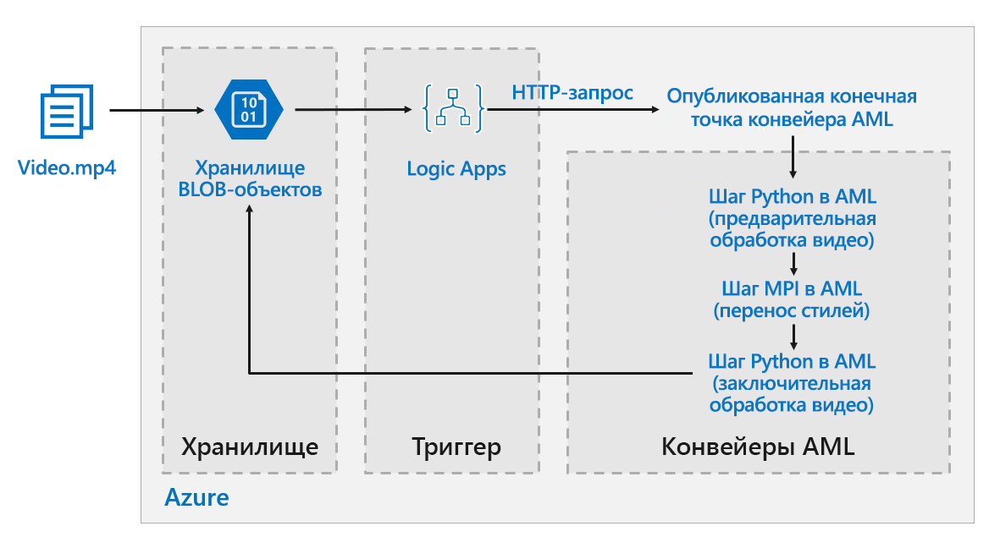

# Пакетная оценка для моделей глубокого обучения в AzureBatch scoring on Azure for deep learning models

Эта эталонная архитектура показывает, как применять нейронную передачу стиля к видео, используя Машинное обучение Azure.This reference architecture shows how to apply neural style transfer to a video, using Azure Machine Learning. *Передача стиля* —это глубокое обучения, которое объединяет существующий образ в стиле другого.*Style transfer* is a deep learning technique that composes an existing image in the style of another image. Эту архитектуру можно подготовить к использованию для любого сценария, который использует пакетную оценку с глубоким обучением.This architecture can be generalized for any scenario that uses batch scoring with deep learning. [**Разверните это решение**](#deploy-the-solution).[**Deploy this solution**](#deploy-the-solution).

**Сценарий**. Организация, занимающаяся мультимедиа, выпустила видео, стиль которого необходимо изменить с тем, чтобы оно выглядело как определенная картинка.**Scenario**: A media organization has a video whose style they want to change to look like a specific painting. Организации необходимо применить этот стиль ко всем кадрам из видео своевременно и в автоматическом режиме.The organization wants to be able to apply this style to all frames of the video in a timely manner and in an automated fashion. Дополнительные сведения об алгоритмах нейронной передачи стиля см. статью [Image Style Transfer Using Convolutional Neural Networks][image-style-transfer] (Передача стиля образа с помощью сверточных нейронных сетей) (PDF-файл).For more background about neural style transfer algorithms, see [Image Style Transfer Using Convolutional Neural Networks][image-style-transfer] (PDF).

| Стиль образа.Style image: | Входные данные и содержимое видео.Input/content video: | Выходной видеопоток.Output video: |
|--------|--------|---------|
|  |  *щелкните, чтобы просмотреть видео*. *click to view video* |  *щелкните, чтобы просмотреть видео*. *click to view video* |

Эта эталонная архитектура предназначена для рабочих нагрузок, которые активируются при наличие нового носителя в службе хранилища Azure.This reference architecture is designed for workloads that are triggered by the presence of new media in Azure storage.

Обработка предусматривает указанные ниже действия.Processing involves the following steps:

1. Видеофайл поступает в хранилище.Upload a video file to storage.
1. Он активирует приложение логики для отправки запроса к опубликованной конечной точке конвейера Машинного обучения Azure.The video file triggers a Logic App to send a request to the Azure Machine Learning pipeline published endpoint.
1. Конвейер обрабатывает видео, применяет передачу стиля с помощью MPI и выполняет постобработку видео.The pipeline processes the video, applies style transfer with MPI, and postprocesses the video.
1. Выходные данные отправляются обратно в хранилище BLOB-объектов после выполнения конвейера.The output is saved back to blob storage once the pipeline is completed.

## АрхитектураArchitecture

Архитектура состоит из следующих компонентов.This architecture consists of the following components.

### Службы вычисленийCompute

**[Служба Машинного обучения Azure][amls]** использует конвейеры Машинного обучения Azure для создания воспроизводимых и простых в управлении последовательностей вычислений.**[Azure Machine Learning Service][amls]** uses Azure Machine Learning Pipelines to create reproducible and easy-to-manage sequences of computation. Она также предоставляет управляемый целевой объект вычислений для обучения, развертывания и оценки моделей машинного обучения, который называется [Вычислительная среда Машинного обучения Azure][aml-compute].It also offers a managed compute target (on which a pipeline computation can run) called [Azure Machine Learning Compute][aml-compute] for training, deploying, and scoring machine learning models. 

### ХранилищеStorage

**[Хранилище BLOB-объектов][blob-storage]** используется для хранения всех изображений (входных, стилевых и выходных).**[Blob storage][blob-storage]** is used to store all images (input images, style images, and output images). Служба Машинного обучения Azure интегрируется с хранилищем BLOB-объектов, поэтому пользователям не нужно вручную отправлять данные на платформы вычислений и в хранилище BLOB-объектов.Azure Machine Learning Service integrates with Blob storage so that users do not have to manually move data across compute platforms and Blob storage. Хранилище BLOB-объектов также является очень экономичным для производительности, которую требует эта рабочая нагрузка.Blob storage is also very cost-effective for the performance that this workload requires.

### Активирование и планированиеTrigger / scheduling

**[Служба Azure Logic Apps][logic-apps]** используется для запуска рабочего процесса.**[Azure Logic Apps][logic-apps]** is used to trigger the workflow. Когда приложение логики обнаруживает, что большой двоичный объект был добавлен в контейнер, оно активирует конвейер Машинного обучения Azure.When the Logic App detects that a blob has been added to the container, it triggers the Azure Machine Learning Pipeline. Logic Apps хорошо подходит для этой эталонной архитектуры, так как это простой способ обнаружить изменения в хранилище BLOB-объектов и обеспечить простой процесс изменения триггера.Logic Apps is a good fit for this reference architecture because it's an easy way to detect changes to blob storage and provides an easy process for changing the trigger.

### Предобработка и постобработка данныхPreprocessing and postprocessing our data

Эта эталонная архитектура использует видеоматериалы orangutan в дереве.This reference architecture uses video footage of an orangutan in a tree. Скачать видеозапись можно [здесь][source-video].You can download the footage from [here][source-video].

1. Используйте [FFmpeg][ffmpeg], чтобы извлечь звуковой файл, чтобы позже его можно было объединить с выходным видео.Use [FFmpeg][ffmpeg] to extract the audio file from the video footage, so that the audio file can be stitched back into the output video later.
1. Используйте FFmpeg, чтобы разбить видео на отдельные кадры.Use FFmpeg to break the video into individual frames. Кадры будут обрабатываться независимо друг от друга, в параллельном режиме.The frames will be processed independently, in parallel.
1. Теперь можно применить нейронную передачу стиля к каждому кадру одновременно.At this point, we can apply neural style transfer to each individual frame in parallel.
1. По окончании обработки нам нужно объединить кадры в видеоряд с помощью FFmpeg.One each frame has been processed, we need to use FFmpeg to restitch the frames back together.
1. Наконец, необходимо добавить ранее извлеченный звуковой файл в объединенный видеоряд.Finally we reattach the audio file to the restitched footage.

## Рекомендации по производительностиPerformance considerations

### GPU и ЦПGPU vs CPU

Для нагрузок с глубоким обучением, GPU выполнит работу намного лучше чем ЦП, в той степени, в которой необходимо для объемного кластера ЦП для достижения сопоставимой производительности.For deep learning workloads, GPUs will generally out-perform CPUs by a considerable amount, to the extent that a sizeable cluster of CPUs is usually needed to get comparable performance. Хотя и существует возможность использовать в этой архитектуре только ЦП, GPU могут обеспечить намного лучший профиль затрат и производительности.While it's an option to use only CPUs in this architecture, GPUs will provide a much better cost/performance profile. Мы рекомендуем использовать последнюю [серия NCv3]vm-sizes-gpu виртуальных машин оптимизированных для GPU.We recommend using the latest [NCv3 series]vm-sizes-gpu of GPU optimized VMs.

Графические процессоры отключены по умолчанию во всех регионах.GPUs are not enabled by default in all regions. Убедитесь, что вы выбрали регион с поддержкой GPU.Make sure to select a region with GPUs enabled. Кроме того, для подписок установлена квота по умолчанию ноль ядер для виртуальных машин оптимизированных для GPU.In addition, subscriptions have a default quota of zero cores for GPU-optimized VMs. Эту квоту можно вызвать, открыв запрос в службу поддержки.You can raise this quota by opening a support request. Убедитесь, что ваша подписка имеет достаточно квот для выполнения рабочей нагрузки.Make sure that your subscription has enough quota to run your workload.

### Распараллеливание между виртуальными машинами и ядрамиParallelizing across VMs vs cores

При запуске процесса передачи стиля в качестве пакетного задания, задания, которые в основном выполняются GPU, будут выполняться параллельно на виртуальных машинах.When running a style transfer process as a batch job, the jobs that run primarily on GPUs will have to be parallelized across VMs. Возможны два подхода: можно создать кластер большего размера с помощью виртуальных машин с одним GPU или создать кластер меньшего размера с помощью виртуальных машин с несколькими GPU.Two approaches are possible: You can create a larger cluster using VMs that have a single GPU, or create a smaller cluster using VMs with many GPUs.

Для этой рабочей нагрузки этих два варианта будут использовать сравнимую производительность.For this workload, these two options will have comparable performance. С помощью меньшего числа виртуальных машин с несколькими GPU, на виртуальную машину можно сократить перемещение данных.Using fewer VMs with more GPUs per VM can help to reduce data movement. Тем не менее, объем данных для каждого задания для этой рабочей нагрузки не очень больших размеров, поэтому не будет наблюдаться регулирование количества запросов хранилищем BLOB-объектов.However, the data volume per job for this workload is not very big, so you won't observe much throttling by blob storage.

### Этап MPIMPI step 

При создании конвейера Машинного обучения Azure одним из этапов выполнения параллельных вычислений является этап MPI.When creating the pipeline in Azure Machine Learning, one of the steps used to perform parallel computation is the MPI step. Этот этап помогает равномерно распределить данные между всеми доступными узлами.The MPI step will help split the data evenly across the available nodes. Этап MPI выполняется только тогда, когда готовы все запрошенные узлы.The MPI step will not executed until all the requested nodes are ready. Если на одном из узлов произойдет сбой или задание узла будет замещено (если это низкоприоритетная виртуальная машина), этап MPI потребуется выполнять заново.Should one node fail or get pre-empted (if it is a low-priority virtual machine), the MPI step will have to be re-run. 

## Вопросы безопасностиSecurity considerations

### Ограничение доступа к хранилищу BLOB-объектов AzureRestricting access to Azure blob storage

В этой эталонной архитектуре хранилище больших двоичных объектов — компонент основного хранилища, который необходимо защитить.In this reference architecture, Azure blob storage is the main storage component that needs to be protected. Развертывание базовых показателей, показанное в репозитории GitHub использует ключи учетной записи хранения для доступа к хранилищу BLOB-объектов.The baseline deployment shown in the GitHub repo uses storage account keys to access the blob storage. Для дальнейшего управления и защиты рекомендуется использовать подписанный URL-адрес (SAS).For further control and protection, consider using a shared access signature (SAS) instead. Это предоставляет ограниченный доступ к объектам в хранилище, без необходимости жесткого кодирования ключей учетной записи или сохранения их в виде открытого текста.This grants limited access to objects in storage, without needing to hard code the account keys or save them in plaintext. Этот подход особенно полезен, так как ключи учетной записи отображаются в виде обычного текста внутри интерфейса конструктора приложения логики.This approach is especially useful because account keys are visible in plaintext inside of Logic App's designer interface. Использование SAS гарантирует, что учетная запись хранения имеет надлежащее управление, и что доступ предоставляется только пользователям, которым он необходим.Using an SAS also helps to ensure that the storage account has proper governance, and that access is granted only to the people intended to have it.

Для сценариев с более конфиденциальными данными убедитесь, что все ключи к хранилищу защищены, так как эти ключи предоставляют полный доступ всем входным и выходным данным из рабочей нагрузки.For scenarios with more sensitive data, make sure that all of your storage keys are protected, because these keys grant full access to all input and output data from the workload.

### Шифрование и перемещение данныхData encryption and data movement

Эта эталонная архитектура использует перенос стиля в качестве примера процесса пакетной оценки.This reference architecture uses style transfer as an example of a batch scoring process. Для сценариев с конфиденциальными данными, данные в хранилище необходимо шифровать в состояние покоя.For more data-sensitive scenarios, the data in storage should be encrypted at rest. Каждый раз данные перемещаются из одного расположения в другое. Используйте SSL для безопасной передачи данных.Each time data is moved from one location to the next, use SSL to secure the data transfer. Дополнительные сведения см. в [руководстве по безопасности службы хранилища Azure][storage-security].For more information, see [Azure Storage security guide][storage-security].

### Безопасность вычислений в виртуальной сетиSecuring your computation in a virtual network

Развертываемый кластер вычислений Машинного обучения можно подготовить к работе в подсети [виртуальной сети][virtual-network].When deploying your Machine Learning compute cluster, you can configure your cluster to be provisioned inside a subnet of a [virtual network][virtual-network]. Это позволит вычислительным узлам в кластере безопасно обмениваться данными с другими виртуальными машинами.This allows the compute nodes in the cluster to communicate securely with other virtual machines. 

### Защита от вредоносных действийProtecting against malicious activity

В сценариях, где имеется несколько пользователей, убедитесь, что конфиденциальные данные защищены от вредоносных действий.In scenarios where there are multiple users, make sure that sensitive data is protected against malicious activity. Если другим пользователям предоставлен доступ к этому развертыванию, чтобы настроить входные данные, обратите внимание на следующие меры предосторожности и рекомендации.If other users are given access to this deployment to customize the input data, take note of the following precautions and considerations:

- Используйте RBAC для ограничения доступа пользователей к нужным ресурсам.Use RBAC to limit users' access to only the resources they need.
- Подготовьте две отдельные учетные записи хранения.Provision two separate storage accounts. Храните входные и выходные данные в первой учетной записи.Store input and output data in the first account. Доступ к этой учетной записи можно предоставить внешним пользователям.External users can be given access to this account. Храните исполняемые сценарии и выходные файлы журналов в другой учетной записи.Store executable scripts and output log files in the other account. Внешние пользователи не должны иметь доступ к этой учетной записи.External users should not have access to this account. Это гарантирует то, что внешние пользователи не могут изменять любые исполняемые файлы (для внедрения вредоносного кода) и не имеют доступ к 	журнальным файлам, которые могут содержать конфиденциальные сведения.This will ensure that external users cannot modify any executable files (to inject malicious code), and don't have access to logfiles, which could hold sensitive information.
- Вредоносные пользователи могут использовать атаки DDOS в очереди заданий или вводить неверные сообщения в очереди заданий, заставляя систему блокировать или вызывать ошибки при запуске.Malicious users can DDOS the job queue or inject malformed poison messages in the job queue, causing the system to lock up or causing dequeuing errors.

## Мониторинг и ведение журналаMonitoring and logging

### Отслеживание пакетных заданийMonitoring Batch jobs

Во время выполнения задания, важно отслеживать ход выполнения и убедиться, что все работает должным образом.While running your job, it's important to monitor the progress and make sure that things are working as expected. Тем не менее, сложно отслеживать кластер активных узлов.However, it can be a challenge to monitor across a cluster of active nodes.

Чтобы получить представление об общем состояние кластера, перейдите к колонке Машинного обучения на портале Azure для просмотра состояния узлов в кластере.To get a sense of the overall state of the cluster, go to the Machine Learning blade of the Azure Portal to inspect the state of the nodes in the cluster. Если узел неактивен или произошел сбой задания, журналы ошибок будут сохранены в хранилище BLOB-объектов и также будут доступными на портале Azure.If a node is inactive or a job has failed, the error logs are saved to blob storage, and are also accessible in the Azure Portal.

Мониторинг можно оптимизировать, подключив журналы к Application Insights или запустив отдельные процессы для опроса состояния кластера и его заданий.Monitoring can be further enriched by connecting logs to Application Insights or by running separate processes to poll for the state of the cluster and its jobs.

### Ведение журнала средствами Машинного обучения AzureLogging with Azure Machine Learning

Машинное обучение Azure автоматически регистрирует в журнале все потоки stdout и stderr для соответствующей учетной записи хранилища BLOB-объектов.Azure Machine Learing will automatically log all stdout/stderr to the associate blob storage account. Если эта функция не отключена, рабочая область Машинного обучения Azure автоматически подготавливает учетную запись хранения и сохраняет журналы в ней.Unless otherwise specified, your Azure Machine Learning Workspace will automatically provision a storage account and dump your logs into it. С помощью средств навигации, например Обозревателя службы хранилища Azure, можно удобно работать с файлами журнала.You can also use a storage navigation tool such as Storage Explorer which will provide a much easier experience for navigating log files.

## Рекомендации по стоимостиCost considerations

По сравнению с хранением и планированием компонентов, вычислительные ресурсы используются в этой эталонной архитектуре, несомненно с точки зрения затрат.Compared to the storage and scheduling components, the compute resources used in this reference architecture by far dominate in terms of costs. Одной из основных задач является эффективное распараллеливание работы на кластере с компьютерами с поддержкой GPU.One of the main challenges is effectively parallelizing the work across a cluster of GPU-enabled machines.

Кластер Вычислительной среды Машинного обучения можно автоматически масштабировать в зависимости от заданий в очереди.The Machine Learning Compute cluster size can automatically scale up and down depending on the jobs in the queue. Вы можете включить автоматическое масштабирование программным способом, задав минимальное и максимальное количество узлов.You can enable auto-scale programmatically by setting the minimum and maximum nodes.

Для заданий, которые не требуют немедленной обработки, настройте автоматическое масштабирование так, чтобы состояние по умолчанию (минимальное) было кластером нулевых узлов.For work that doesn't require immediate processing, configure auto-scale so the default state (minimum) is a cluster of zero nodes. При использовании этой конфигурации кластер запускается с нулевых узлов и масштабируется только при обнаружении заданий в очереди.With this configuration, the cluster starts with zero nodes and only scales up when it detects jobs in the queue. Если процесс пакетной оценки происходит несколько раз в день или меньше, этот параметр позволяет значительно сократить затраты.If the batch scoring process only happens a few times a day or less, this setting enables significant cost savings.

Автоматическое масштабирование может не подойти для пакетных заданий, которые происходят слишком близко друг к другу.Auto-scaling may not be appropriate for batch jobs that happen too close to each other. Время, затрачиваемое на развертывание кластера и его отключение, также несет расходы. Поэтому, если пакет рабочей нагрузки запускается всего через несколько минут после окончания предыдущего задания, более экономично запускать кластер между заданиями.The time that it takes for a cluster to spin up and spin down also incur a cost, so if a batch workload begins only a few minutes after the previous job ends, it might be more cost effective to keep the cluster running between jobs.

Вычислительная среда Машинного обучения также поддерживает низкоприоритетные виртуальные машины.Machine Learning Compute also supports low-priority virtual machines. Это позволяет выполнять вычисления на недорогих виртуальных машинах. Главный недостаток заключается в том, что их задания в любое время могут быть замещены.This allows you to run your computation on discounted virtual machines, with the caveat that they may be pre-empted at any time. Низкоприоритетные виртуальные машины подходят для некритических рабочих нагрузок пакетной оценки.Low-priority virtual machines are ideal for non-critical batch scoring workloads.

## Развертывание решенияDeploy the solution

Для развертывания этой эталонной архитектуры, выполните действия, описанные в [репозитории GitHub][deployment].To deploy this reference architecture, follow the steps described in the [GitHub repo][deployment].

> [!NOTE]
> Вы также можете развернуть архитектуру пакетной оценки для моделей глубокого обучения с помощью Службы Azure Kubernetes.You can also deploy a batch scoring architecture for deep learning models using the Azure Kubernetes Service. Выполните действия, описанные в этом [репозитории GitHub][deployment2].Follow the steps described in this [Github repo][deployment2].

<!-- links -->

[aml-compute]: /azure/machine-learning/service/how-to-set-up-training-targets#amlcompute
[amls]: /azure/machine-learning/service/overview-what-is-azure-ml
[azcopy]: /azure/storage/common/storage-use-azcopy-linux
[blob-storage]: /azure/storage/blobs/storage-blobs-introduction
[container-instances]: /azure/container-instances/
[container-registry]: /azure/container-registry/
[deployment]: https://github.com/Azure/Batch-Scoring-Deep-Learning-Models-With-AML
[deployment2]: https://github.com/Azure/Batch-Scoring-Deep-Learning-Models-With-AKS
[ffmpeg]: https://www.ffmpeg.org/
[image-style-transfer]: https://www.cv-foundation.org/openaccess/content_cvpr_2016/papers/Gatys_Image_Style_Transfer_CVPR_2016_paper.pdf
[logic-apps]: /azure/logic-apps/
[source-video]: https://happypathspublic.blob.core.windows.net/videos/orangutan.mp4
[storage-security]: /azure/storage/common/storage-security-guide
[vm-sizes-gpu]: /azure/virtual-machines/windows/sizes-gpu
[virtual-network]: /azure/machine-learning/service/how-to-enable-virtual-network
