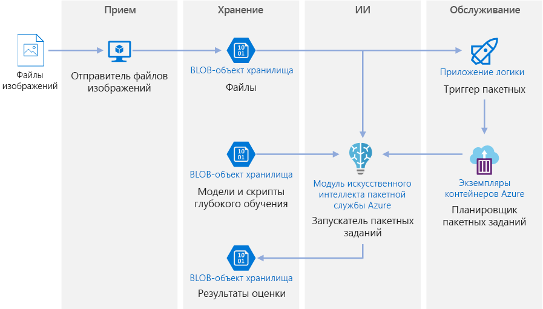
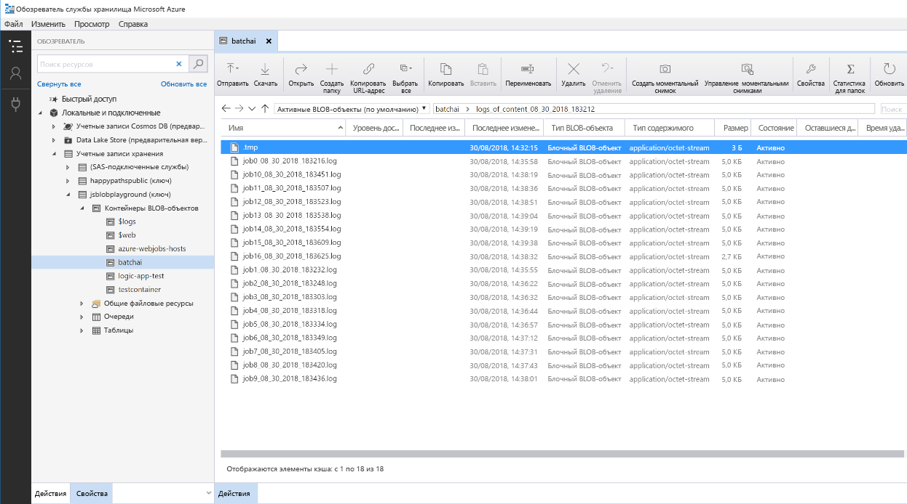

# Пакетная оценка для моделей глубокого обучения в Azure

Эта эталонная архитектура показывает, как применять передачу нейронного стиля к видео, используя Azure Batch AI. *Передача стиля* —это глубокое обучения, которое объединяет существующий образ в стиле другого. Эту архитектуру можно подготовить к использованию для любого сценария, который использует пакетную оценку с глубоким обучением. [**Разверните это решение**](#deploy-the-solution).

**Сценарий**. Организация, занимающаяся мультимедиа, выпустила видео, стиль которого необходимо изменить с тем, чтобы оно выглядело как определенная картинка. Организации необходимо применить этот стиль ко всем кадрам из видео своевременно и в автоматическом режиме. Дополнительные сведения об алгоритмах нейронной передачи стиля см. статью [Image Style Transfer Using Convolutional Neural Networks][image-style-transfer] (Передача стиля образа с помощью сверточных нейронных сетей) (PDF-файл).

| Стиль образа. | Входные данные и содержимое видео. | Выходной видеопоток. |
|--------|--------|---------|
|  |  *щелкните, чтобы просмотреть видео*. |  *щелкните, чтобы просмотреть видео*. |

Эта эталонная архитектура предназначена для рабочих нагрузок, которые активируются при наличие нового носителя в службе хранилища Azure. Обработка предусматривает указанные ниже действия.

1. Отправьте выбранный стиль образа (например, картины Ван Гога), а также сценарий стиля передачи в хранилище BLOB-объектов.
1. Создание автоматически масштабированного кластера Batch AI, который будет готов для начала выполнения работы.
1. Разделите видеофайл на отдельные кадры и отправьте их в хранилище BLOB-объектов.
1. После отправки всех кадров, передайте файл триггера в хранилище BLOB-объектов.
1. Этот файл активирует приложение логики, которое создает контейнер в Экземплярах контейнеров Azure.
1. Контейнер запускает сценарий, который создает задания Batch AI. Каждое задание применяет передачи нейронного стиля в параллельном режиме на узлах кластера Batch AI.
1. После создания образов, они отправляются обратно в хранилище BLOB-объектов.
1. Скачайте генерируемые кадры и совместите образ с видео.

## Архитектура

Архитектура состоит из следующих компонентов.

### Службы вычислений

**[Azure Batch AI][batch-ai]** используется для запуска алгоритма нейронной передачи стиля. Batch AI поддерживает рабочие нагрузки глубокого обучения, предоставляя контейнеризованные среды, которые предварительно настроены для платформы глубокого обучения на виртуальных машинах с поддержкой GPU. Вычислительный кластер можно также подключить к хранилищу BLOB-объектов с помощью Batch AI.

### Хранилище

**[Хранилище BLOB-объектов][blob-storage]** используется для хранения всех образов (входных, стилевых и выходных), как и все журналы, полученные из Batch AI. Хранилище BLOB-объектов интегрируется с Batch AI с помощью [blobfuse][blobfuse], виртуальной файловой системы с открытым исходным кодом, который поддерживается службой хранилища BLOB-объектов. Хранилище BLOB-объектов также является очень экономичным для производительности, которую требует эта рабочая нагрузка.

### Активирование и планирование

**[Служба Azure Logic Apps][logic-apps]** используется для запуска рабочего процесса. Когда приложение логики обнаруживает, что большой двоичный объект был добавлен в контейнер, он активирует процесс Batch AI. Logic Apps хорошо подходит для этой эталонной архитектуры, так как это простой способ обнаружить изменения в хранилище BLOB-объектов и обеспечить простой процесс изменения триггера.

**[Экземпляры контейнеров Azure][container-instances]** используется для выполнения сценариев Python, которые создают задания Batch AI. Выполнение этих сценариев в контейнере Docker — это удобный способ их запуска по требованию. Для этой архитектуры мы используем Экземпляры контейнеров, так как для него отсутствует предварительно созданный соединитель приложения логики, что позволяет приложению логики запускать задания Batch AI. Экземпляры контейнеров могут быстро запускать процессы без отслеживания состояния.

**[DockerHub][dockerhub]** используется для хранения образа Docker, который использует экземпляры контейнеров, чтобы выполнить процесс создания задания. DockerHub был выбран для этой архитектуры, так как он прост в использовании и по умолчанию находится в репозиторие образов для пользователей Docker. [Реестр контейнеров Azure][container-registry] также можно использовать.

### Подготовка данных

Эта эталонная архитектура использует видеоматериалы orangutan в дереве. [Здесь][source-video] вы можете скачать материал и обработать их для рабочего процесса, выполнив следующие действия.

1. Используйте [AzCopy][azcopy], чтобы загружать видео из общедоступного большого двоичного объекта.
2. Используйте [FFmpeg][ffmpeg], чтобы извлечь звуковой файл, так чтобы его можно было присоединить обратно к выходному видео.
3. Используйте FFmpeg, чтобы разбить видео на отдельные кадры. Кадры будут обрабатываться независимо друг от друга, в параллельном режиме.
4. Используйте AzCopy для копирования отдельных кадров в контейнер больших двоичных объектов.

На этом этапе видеоматериал находится в форме, которая может использоваться для передачи нейронной стиля.

## Рекомендации по производительности

### GPU и ЦП

Для нагрузок с глубоким обучением, GPU выполнит работу намного лучше чем ЦП, в той степени, в которой необходимо для объемного кластера ЦП для достижения сопоставимой производительности. Хотя и существует возможность использовать в этой архитектуре только ЦП, GPU могут обеспечить намного лучший профиль затрат и производительности. Мы рекомендуем использовать последнюю [серия NCv3]vm-sizes-gpu виртуальных машин оптимизированных для GPU.

Графические процессоры отключены по умолчанию во всех регионах. Убедитесь, что вы выбрали регион с поддержкой GPU. Кроме того, для подписок установлена квота по умолчанию ноль ядер для виртуальных машин оптимизированных для GPU. Эту квоту можно вызвать, открыв запрос в службу поддержки. Убедитесь, что ваша подписка имеет достаточно квот для выполнения рабочей нагрузки.

### Распараллеливание между виртуальными машинами и ядрами

При запуске процесса передачи стиля в качестве пакетного задания, задания, которые в основном выполняются GPU, будут выполняться параллельно на виртуальных машинах. Возможны два подхода: можно создать кластер большего размера с помощью виртуальных машин с одним GPU или создать кластер меньшего размера с помощью виртуальных машин с несколькими GPU.

Для этой рабочей нагрузки этих два варианта будут использовать сравнимую производительность. С помощью меньшего числа виртуальных машин с несколькими GPU, на виртуальную машину можно сократить перемещение данных. Тем не менее, объем данных для каждого задания для этой рабочей нагрузки не очень больших размеров, поэтому не будет наблюдаться регулирование количества запросов хранилищем BLOB-объектов.

### Размер пакета образов на задания Batch AI

Еще один параметр, который должен быть настроен — число образов для обработки одного задания Batch AI. С одной стороны необходимо убедиться, что работа распределяется широко между узлами и что при сбое задания невозможно использовать повторно слишком много образов. Это указывает на наличие большого числа заданий Batch AI и, следовательно, небольшое количество образов для обработки одного задания. С другой стороны, если на задание обрабатывается слишком мало образов, время установки или запуска непропорционально увеличивается. Можно задать количество заданий, выравнять максимальное количество узлов в кластере. Это будет наиболее производительно, при условии, что не было сбоя заданий, так как он уменьшает объем установки или запуска. Тем не менее, при сбое задания, для большого количества образов может потребоваться провести повторную обработку.

### Файловые серверы

При использовании Batch AI, можно выбрать несколько вариантов хранения, в зависимости от пропускной способности, необходимой для вашего сценария. Для рабочих нагрузок с низкой пропускной способностью использование хранилища BLOB-объектов (через blobfuse) должно быть достаточно. В качестве альтернативы Batch AI также поддерживает Файловый сервер Batch AI, управляемый одноузловой NFS, который может автоматически монтироваться на узлах кластера чтобы обеспечить для заданий централизованной доступ к хранилищу. В большинстве случаев требуется только один файловый сервер в рабочей области, и можно разделить данные для заданий обучения в разных каталогах. Если одноузловая NFS не подходит для рабочих нагрузок, Batch AI поддерживает другие варианты хранения, включая файлы Azure или пользовательские решения, например, файловые системы Gluster или Lustre.

## Вопросы безопасности

### Ограничение доступа к хранилищу BLOB-объектов Azure

В этой эталонной архитектуре хранилище больших двоичных объектов — компонент основного хранилища, который необходимо защитить. Развертывание базовых показателей, показанное в репозитории GitHub использует ключи учетной записи хранения для доступа к хранилищу BLOB-объектов. Для дальнейшего управления и защиты рекомендуется использовать подписанный URL-адрес (SAS). Это предоставляет ограниченный доступ к объектам в хранилище, без необходимости жесткого кодирования ключей учетной записи или сохранения их в виде открытого текста. Этот подход особенно полезен, так как ключи учетной записи отображаются в виде обычного текста внутри интерфейса конструктора приложения логики. Использование SAS гарантирует, что учетная запись хранения имеет надлежащее управление, и что доступ предоставляется только пользователям, которым он необходим.

Для сценариев с более конфиденциальными данными убедитесь, что все ключи к хранилищу защищены, так как эти ключи предоставляют полный доступ всем входным и выходным данным из рабочей нагрузки.

### Шифрование и перемещение данных

Эта эталонная архитектура использует перенос стиля в качестве примера процесса пакетной оценки. Для сценариев с конфиденциальными данными, данные в хранилище необходимо шифровать в состояние покоя. Каждый раз данные перемещаются из одного расположения в другое. Используйте SSL для безопасной передачи данных. Дополнительные сведения см. в [руководстве по безопасности службы хранилища Azure][storage-security].

### Защита данных в виртуальной сети

При развертывании кластера Batch AI, можно подготовить кластер к работе в подсети виртуальной сети. Это позволяет вычислительным узлам в кластере безопасно обмениваться данными с другими виртуальными машинами, или даже с локальной сетью. Можно также использовать [конечные точки службы][service-endpoints] с хранилищем BLOB-объектов, чтобы предоставить доступ из виртуальной сети или использовать NFS с одним узлом внутри виртуальной сети с Batch AI, чтобы убедиться, что данные всегда защищены.

### Защита от вредоносных действий

В сценариях, где имеется несколько пользователей, убедитесь, что конфиденциальные данные защищены от вредоносных действий. Если другим пользователям предоставлен доступ к этому развертыванию, чтобы настроить входные данные, обратите внимание на следующие меры предосторожности и рекомендации.

- Используйте RBAC для ограничения доступа пользователей к нужным ресурсам.
- Подготовьте две отдельные учетные записи хранения. Храните входные и выходные данные в первой учетной записи. Доступ к этой учетной записи можно предоставить внешним пользователям. Храните исполняемые сценарии и выходные файлы журналов в другой учетной записи. Внешние пользователи не должны иметь доступ к этой учетной записи. Это гарантирует то, что внешние пользователи не могут изменять любые исполняемые файлы (для внедрения вредоносного кода) и не имеют доступ к 	журнальным файлам, которые могут содержать конфиденциальные сведения.
- Вредоносные пользователи могут использовать атаки DDOS в очереди заданий или вводить неверные сообщения в очереди заданий, заставляя систему блокировать или вызывать ошибки при запуске.

## Мониторинг и ведение журнала

### Отслеживание заданий Batch AI

Во время выполнения задания, важно отслеживать ход выполнения и убедиться, что все работает должным образом. Тем не менее, сложно отслеживать кластер активных узлов.

Чтобы получить представление об общем состояние кластера, перейдите к колонке Batch AI на портале Azure, чтобы проанализировать состояние узлов в кластере. Если узел неактивен или произошел сбой задания, журналы ошибок сохраняются в хранилище BLOB-объектов и также доступны в колонке "Задания" на портале Azure.

Мониторинг можно дополнительно наполнить путем подключения журналов к Application Insights или путем запуска отдельных процессов для опроса о состоянии кластера и заданий Batch AI.

### Ведение журнала в Batch AI

Batch AI автоматически выводит все stdout и stderr в учетную запись хранения соединенных больших двоичных объектов. Используя средство навигации хранилища, например, Обозреватель службы хранилища Azure, предоставляет существенно облегченные возможности перемещения файлов журнала.

Этапы развертывания для этой эталонной архитектуры также показывают, как настроить более простую систему ведения журнала, таким образом, что все журналы, выполняемые различные задания, сохранятся в том же каталоге, в контейнере больших двоичных объектов, как показано ниже. Используйте эти журналы, чтобы отслеживать, сколько времени необходимо для обработки каждого задания и каждого образа. Это позволит получить более точное представление о том, как оптимизировать процесс еще больше.

## Рекомендации по стоимости

По сравнению с хранением и планированием компонентов, вычислительные ресурсы используются в этой эталонной архитектуре, несомненно с точки зрения затрат. Одной из основных задач является эффективное распараллеливание работы на кластере с компьютерами с поддержкой GPU.

Размер кластера Batch AI можно автоматически масштабировать в зависимости от заданий в очереди. Вы можете включить автоматическое масштабирование с помощью Batch AI одним из двух способов. Так можно сделать путем программирования, который можно настроить в файле `.env`, который является частью [шагов развертывания][deployment], или можно изменить формулу масштабирования на портале после создания кластера.

Для работы, которая не требует немедленной обработки, настройте формулу автоматического масштабирования, чтобы состояние по умолчанию (минимальное) было кластером нулевых узлов. При использовании этой конфигурации кластер запускается с нулевых узлов и масштабируется только при обнаружении заданий в очереди. Если процесс пакетной оценки происходит несколько раз в день или меньше, этот параметр позволяет значительно сократить затраты.

Автоматическое масштабирование может не подойти для пакетных заданий, которые происходят слишком близко друг к другу. Время, затрачиваемое на развертывание кластера и его отключение, также несет расходы. Поэтому, если пакет рабочей нагрузки запускается всего через несколько минут после окончания предыдущего задания, более экономично запускать кластер между заданиями.

## Развертывание решения

Для развертывания этой эталонной архитектуры, выполните действия, описанные в [репозитории GitHub][deployment].

<!-- links -->

[azcopy]: /azure/storage/common/storage-use-azcopy-linux
[batch-ai]: /azure/batch-ai/
[blobfuse]: https://github.com/Azure/azure-storage-fuse
[blob-storage]: /azure/storage/blobs/storage-blobs-introduction
[container-instances]: /azure/container-instances/
[container-registry]: /azure/container-registry/
[deployment]: https://github.com/Azure/batch-scoring-for-dl-models
[dockerhub]: https://hub.docker.com/
[ffmpeg]: https://www.ffmpeg.org/
[image-style-transfer]: https://www.cv-foundation.org/openaccess/content_cvpr_2016/papers/Gatys_Image_Style_Transfer_CVPR_2016_paper.pdf
[logic-apps]: /azure/logic-apps/
[service-endpoints]: /azure/storage/common/storage-network-security?toc=%2fazure%2fvirtual-network%2ftoc.json#grant-access-from-a-virtual-network
[source-video]: https://happypathspublic.blob.core.windows.net/videos/orangutan.mp4
[storage-security]: /azure/storage/common/storage-security-guide
[vm-sizes-gpu]: /azure/virtual-machines/windows/sizes-gpu