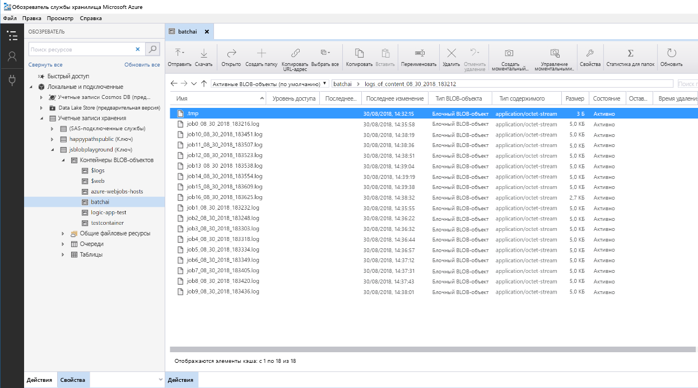

# Пакетная оценка моделей Python в Azure

В этой эталонной архитектуре показано, как создать масштабируемое решение для параллельной пакетной оценки многих моделей по расписанию, используя Azure Batch AI. Это решение можно использовать как шаблон и подготовить к использованию для различных проблем.

Ссылку на реализацию этой архитектуры можно найти на сайте  [GitHub][github].

**Сценарий**. Это решение отслеживает работу большого количества устройств в параметре Центра Интернета вещей, куда каждое устройство непрерывно отправляет показания датчиков. Предполагается, что каждое устройство имеет предварительно обученные модели обнаружения аномалий, которые необходимо использовать, чтобы спрогнозировать, соответствует ли серия измерений, которые агрегированы за предварительно определенный интервал времени, аномалии или нет. В реальных сценариях это может быть поток показаний датчика, который необходимо отфильтровать и агрегировать перед использованием в обучении или оценке в реальном времени. Для упрощения решение использует тот же файл данных при выполнении оценки заданий.

## Архитектура

Эта архитектура состоит из следующих компонентов.

[Центры событий Azure][event-hubs]. Эта служба приема сообщений может принимать миллионы сообщений о событиях в секунду. В этой архитектуре датчики передают поток данных в концентратор событий.

[Azure Stream Analytics][stream-analytics]. Подсистема обработки событий. Задание Stream Analytics считывает потоки данных из концентратора событий и обрабатывает их.

[Azure Batch AI][batch-ai]. Эта подсистема распределенных вычислений используется для обучения и тестирования машинного обучения и моделей ИИ, свернутых в Azure. Azure Batch AI по запросу создает виртуальные машины с возможностью автоматического масштабирования, где каждый узел в кластере Batch AI выполняет оценку задания для определенного датчика. Оценка  [скрипта][python-script] Python выполняется в контейнерах Docker, созданных на каждом узле кластера, в котором считываются данные соответствующих датчиков, создаются прогнозирования, а их результаты сохраняются в хранилище BLOB-объектов.

[Хранилище BLOB-объектов Azure][storage]. Контейнеры BLOB-объектов используются для хранения предварительно обученных моделей, данных и результатов прогнозирования. Модели загружаются в хранилище BLOB-объектов в записную книжку [создать\_ресурсы.ipynb][create-resources]. Эти модели [одноклассового SVM][one-class-svm] обучаются на данных, которые представляют собой значения различных датчиков для различных устройств. Это решение предполагает, что значения данных агрегируются за фиксированный интервал времени.

[Azure Logic Apps][logic-apps]. Это решение создает приложение логики, которое выполняет почасовые задания Batch AI. Logic Apps предоставляет простой способ создания среды выполнения рабочего процесса и планирования решения. Задания Batch AI отправляются с использованием [скрипта][script] Python, который также выполняется в контейнере Docker.

[Реестр контейнеров Azure][acr]. Образы Docker, которые используются как в Batch AI, так и в Logic Apps, создаются в записной книжке [создать\_резурсы.ipynb][create-resources], а затем помещаются в реестр контейнеров Azure. Это удобный способ размещения образов и создания экземпляров контейнеров через другие службы Azure – в этом решении Logic Apps и Batch AI.

## Рекомендации по производительности

Принято считать, что для обработки рабочей нагрузки стандартных моделей Python достаточно обычных ЦП. Эта архитектура использует ЦП. Однако для [нагрузок с глубоким обучением][deep] GPU выполняют работу намного лучше чем ЦП – для достижения сопоставимой производительности обычно требуется кластер ЦП изменяемого размера.

### Распараллеливание между виртуальными машинами и ядрами

При выполнении процессов оценки многих моделей в пакетном режиме задания должны быть распараллелены между виртуальными машинами. Возможны два подхода:

* Создайте большой кластер, используя недорогие виртуальные машины.

* Создайте маленький кластер, используя высокопроизводительные виртуальные машины с дополнительным количеством ядер, доступных в каждой.

В целом оценка стандартных моделей Python не так сложна, как оценка моделей глубокого обучения, и небольшой кластер должен быть способен эффективно обрабатывать большое количество моделей в очереди. Вы можете увеличить количество узлов кластера по мере увеличения размеров набора данных.

Для удобства в этом сценарии в рамках одного задания Batch AI отправляется одна оценка задачи. Однако оценка нескольких блоков данных в одном Batch AI может быть более эффективной. В этих случаях напишите пользовательский код для чтения в нескольких наборах данных и выполните для них скрипт оценки во время выполнения одного задания Batch AI.

### Файловые серверы

При использовании Batch AI, можно выбрать несколько вариантов хранения, в зависимости от пропускной способности, необходимой для вашего сценария. Для рабочих нагрузок с низкой пропускной способностью использование хранилища BLOB-объектов должно быть достаточно. В качестве альтернативы Batch AI также поддерживает [Файловый сервер Batch AI][bai-file-server], управляемый одноузловой NFS, который может автоматически монтироваться на узлах кластера, чтобы обеспечить заданиям централизованный доступ к хранилищу. В большинстве случаев требуется только один файловый сервер в рабочей области, и можно поместить данные для заданий обучения в разные каталоги.

Если одноузловая NFS не подходит для рабочих нагрузок, Batch AI поддерживает другие варианты хранения, включая [файлы Azure][azure-files] и пользовательские решения, например, файловые системы Gluster или Lustre.

## Рекомендации по управлению

### Отслеживание заданий Batch AI

Важно следить за ходом выполнения заданий, но это может быть проблемой для мониторинга в кластере активных узлов. Чтобы получить представление об общем состояние кластера, перейдите к колонке **Batch AI** на [портале Azure][portal], чтобы проанализировать состояние узлов в кластере. Если узел неактивен или произошел сбой задания, журналы ошибок сохраняются в хранилище BLOB-объектов и также доступны в колонке **Задания** на портале.

Для улучшения мониторинга подключите журналы к [Application Insights][ai] или запустите отдельные процессы для опроса о состоянии кластера и заданий Batch AI.

### Ведение журнала в Batch AI

Batch AI регистрирует все StdOut или Stderr в учетную запись службы хранилища Azure. Для упрощения навигации по файлам журналов используйте инструмент навигации хранилища, например [Обозреватель службы хранилища Azure][explorer].

При развертывании этой эталонной архитектуры у вас есть возможность настроить упрощенную систему ведения журнала. С помощью этого параметра все журналы в разных заданиях сохраняются в одном каталоге контейнера BLOB-объектов, как показано ниже. Используйте эти журналы, чтобы отслеживать, сколько времени занимает обработка каждого задания и каждого образа, чтобы вы лучше понимали, как оптимизировать процесс.

## Рекомендации по стоимости

Самые дорогие компоненты, используемые в этой эталонной архитектуре, – вычислительные ресурсы.

Размер кластера Batch AI можно масштабировать в зависимости от заданий в очереди. Вы можете включить [автоматическое масштабирование][automatic-scaling] с помощью Batch AI одним из двух способов. Так можно сделать путем программирования, который можно настроить в файле ENV, который является частью [шагов развертывания][github], или можно изменить формулу масштабирования на портале после создания кластера.

Для работы, которая не требует немедленной обработки, настройте формулу автоматического масштабирования, чтобы состояние по умолчанию (минимальное) было кластером нулевых узлов. При использовании этой конфигурации кластер запускается с нулевых узлов и масштабируется только при обнаружении заданий в очереди. Если процесс пакетной оценки происходит несколько раз в день или меньше, этот параметр позволяет значительно сократить затраты.

Автоматическое масштабирование может не подойти для пакетных заданий, которые происходят слишком близко друг к другу. Время, затрачиваемое на развертывание кластера и его отключение, также несет расходы. Поэтому, если пакет рабочей нагрузки запускается всего через несколько минут после окончания предыдущего задания, более экономично запускать кластер между заданиями. Это зависит от того, запланированы ли процессы оценки с высокой частотой (например, каждый час) или реже (например, раз в месяц).

## Развертывание решения

Эталонную реализацию для этой архитектуры можно найти на сайте [GitHub][github]. Следуйте инструкциям по установке, чтобы создать масштабируемое решение для параллельной оценки множества моделей с использованием Batch AI.

[acr]: /azure/container-registry/container-registry-intro
[ai]: /azure/application-insights/app-insights-overview
[automatic-scaling]: /azure/batch/batch-automatic-scaling
[azure-files]: /azure/storage/files/storage-files-introduction
[batch-ai]: /azure/batch-ai/
[bai-file-server]: /azure/batch-ai/resource-concepts#file-server
[create-resources]: https://github.com/Azure/BatchAIAnomalyDetection/blob/master/create_resources.ipynb
[deep]: /azure/architecture/reference-architectures/ai/batch-scoring-deep-learning
[event-hubs]: /azure/event-hubs/event-hubs-geo-dr
[explorer]: https://azure.microsoft.com/en-us/features/storage-explorer/
[github]: https://github.com/Azure/BatchAIAnomalyDetection
[logic-apps]: /azure/logic-apps/logic-apps-overview
[one-class-svm]: http://scikit-learn.org/stable/modules/generated/sklearn.svm.OneClassSVM.html
[portal]: https://portal.azure.com
[python-script]: https://github.com/Azure/BatchAIAnomalyDetection/blob/master/batchai/predict.py
[script]: https://github.com/Azure/BatchAIAnomalyDetection/blob/master/sched/submit_jobs.py
[storage]: /azure/storage/blobs/storage-blobs-overview
[stream-analytics]: /azure/stream-analytics/
