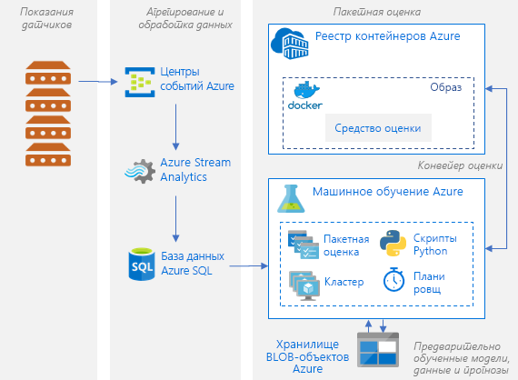

# Пакетная оценка моделей машинного обучения Python в AzureBatch scoring of Python machine learning models on Azure

В этой эталонной архитектуре показано, как создать масштабируемое решение для параллельной пакетной оценки нескольких моделей по расписанию, используя службу Машинного обучения Azure.This reference architecture shows how to build a scalable solution for batch scoring many models on a schedule in parallel using Azure Machine Learning Service. Это решение можно использовать как шаблон и подготовить к использованию для различных проблем.The solution can be used as a template and can generalize to different problems.

Эталонную реализацию для этой архитектуры можно найти на сайте [GitHub][github].A reference implementation for this architecture is available on [GitHub][github].

**Сценарий**. Это решение отслеживает работу большого количества устройств в параметре Центра Интернета вещей, куда каждое устройство непрерывно отправляет показания датчиков.**Scenario**: This solution monitors the operation of a large number of devices in an IoT setting where each device sends sensor readings continuously. Предполагается, что каждое устройство связано с предварительно обученными моделями обнаружения аномалий. Они необходимы для прогнозирования того, свидетельствует ли об аномалии серия измерений, агрегированных за предварительно заданный интервал времени.Each device is assumed to be associated with pretrained anomaly detection models that need to be used to predict whether a series of measurements, that are aggregated over a predefined time interval, correspond to an anomaly or not. В реальных сценариях это может быть поток показаний датчика, который необходимо отфильтровать и агрегировать перед использованием в обучении или оценке в реальном времени.In real-world scenarios, this could be a stream of sensor readings that need to be filtered and aggregated before being used in training or real-time scoring. Для простоты это решение использует тот же файл данных при выполнении заданий оценки.For simplicity, this solution uses the same data file when executing scoring jobs.

Эта эталонная архитектура предназначена для рабочих нагрузок, которые активируются по расписанию.This reference architecture is designed for workloads that are triggered on a schedule. Обработка предусматривает указанные ниже действия.Processing involves the following steps:
1.  Отправка показаний датчиков для приема в Центры событий Azure.Send sensor readings for ingestion to Azure Event Hubs.
2.  Потоковая обработка и сохранение необработанных данных.Perform stream processing and store the raw data.
3.  Отправка данных в кластер Машинного обучения, который подготовлен для работы.Send the data to a Machine Learning cluster that is ready to start taking work. Каждый узел в кластере выполняет задание оценки для определенного датчика.Each node in the cluster runs a scoring job for a specific sensor. 
4.  Выполнение конвейера оценки, выполняющего задания оценки в параллельном режиме, с помощью скриптов Python для Машинного обучения.Execute the scoring pipeline, which runs the scoring jobs in parallel using Machine Learning Python scripts. Конвейер создается, публикуется и планируется к выполнению в течение определенного интервала времени.The pipeline is created, published, and scheduled to run on a predefined interval of time.
5.  Создание прогнозов и их сохранение в хранилище BLOB-объектов для последующего использования.Generate predictions and store them in Blob storage for later consumption.

## АрхитектураArchitecture

Эта архитектура состоит из следующих компонентов.This architecture consists of the following components:

[Центры событий Azure][event-hubs].[Azure Event Hubs][event-hubs]. Эта служба приема сообщений может принимать миллионы сообщений о событиях в секунду.This message ingestion service can ingest millions of event messages per second. В этой архитектуре датчики передают поток данных в концентратор событий.In this architecture, sensors send a stream of data to the event hub.

[Azure Stream Analytics][stream-analytics].[Azure Stream Analytics][stream-analytics]. Подсистема обработки событий.An event-processing engine. Задание Stream Analytics считывает потоки данных из концентратора событий и обрабатывает их.A Stream Analytics job reads the data streams from the event hub and performs stream processing.

[База данных SQL Azure][sql-database].[Azure SQL Database][sql-database]. Данные показаний датчиков загружаются в Базу данных SQL.Data from the sensor readings is loaded into SQL Database. SQL — это привычный способ хранения обработанных потоковых данных (в табличном и структурированном виде), который также позволяет использовать другие хранилища данных.SQL is a familiar way to store the processed, streamed data (which is tabular and structured), but other data stores can be used.

[Служба машинного обучения Azure][amls].[Azure Machine Learning Service][amls]. Машинное обучение — это облачная служба для обучения, оценки, развертывания и администрирования моделей машинного обучения в нужном масштабе.Machine Learning is a cloud service for training, scoring, deploying, and managing machine learning models at scale. Для пакетной оценки служба Машинного обучения Azure создает кластер виртуальных машин с возможностью автоматического масштабирования, в котором каждый узел выполняет задание оценки для определенного датчика.In the context of batch scoring, Machine Learning creates a cluster of virtual machines on demand with an automatic scaling option, where each node in the cluster runs a scoring job for a specific sensor. Задания оценки выполняются в параллельном режиме в виде действий скрипта Python, которые включаются в очередь и управляются службой Машинного обучения Azure.The scoring jobs are executed in parallel as Python-script steps that are queued and managed by Machine Learning. Эти действия являются частью конвейера Машинного обучения, который создается, публикуется и планируется к выполнению в течение определенного интервала времени.These steps are part of a Machine Learning pipeline that is created, published, and scheduled to run on a predefined interval of time.

[Хранилище BLOB-объектов Azure][storage].[Azure Blob Storage][storage]. Контейнеры BLOB-объектов используются для хранения предварительно обученных моделей, данных и результатов прогнозирования.Blob containers are used to store the pretrained models, the data, and the output predictions. Модели загружаются в хранилище BLOB-объектов в записную книжку [01_create_resources.ipynb][create-resources].The models are uploaded to Blob storage in the [01_create_resources.ipynb][create-resources] notebook. Эти модели [одноклассового SVM][one-class-svm] обучаются на данных, которые представляют собой значения различных датчиков для различных устройств.These [one-class SVM][one-class-svm] models are trained on data that represents values of different sensors for different devices. Это решение предполагает, что значения данных агрегируются за фиксированный интервал времени.This solution assumes that the data values are aggregated over a fixed interval of time.

[Реестр контейнеров Azure][acr].[Azure Container Registry][acr]. [Скрипт][pyscript] оценки Python выполняется в контейнерах Docker, создаваемых на каждом узле кластера, в котором он считывает данные соответствующих датчиков, создает прогнозы и сохраняет их в хранилище BLOB-объектов.The scoring Python [script][pyscript] runs in Docker containers that are created on each node of the cluster, where it reads the relevant sensor data, generates predictions and stores them in Blob storage.

## Рекомендации по производительностиPerformance considerations

Принято считать, что для обработки рабочей нагрузки стандартных моделей Python достаточно обычных ЦП.For standard Python models, it's generally accepted that CPUs are sufficient to handle the workload. Эта архитектура использует ЦП.This architecture uses CPUs. Однако для [рабочие нагрузки глубокого обучения][deep], GPU обычно более эффективны, чем ЦП, значительное &mdash; изменяемого размера кластера ЦП обычно требуется, чтобы получить сравнимую производительность.However, for [deep learning workloads][deep], GPUs generally outperform CPUs by a considerable amount &mdash; a sizeable cluster of CPUs is usually needed to get comparable performance.

### Параллелизации между виртуальными машинами и ядерParallelizing across VMs versus cores

При выполнении процессов оценки многих моделей в пакетном режиме задания должны быть распараллелены между виртуальными машинами.When running scoring processes of many models in batch mode, the jobs need to be parallelized across VMs. Возможны два подхода:Two approaches are possible:

* Создайте большой кластер, используя недорогие виртуальные машины.Create a larger cluster using low-cost VMs.

* Создайте маленький кластер, используя высокопроизводительные виртуальные машины с дополнительным количеством ядер, доступных в каждой.Create a smaller cluster using high performing VMs with more cores available on each.

В целом оценка стандартных моделей Python не так сложна, как оценка моделей глубокого обучения, и небольшой кластер должен быть способен эффективно обрабатывать большое количество моделей в очереди.In general, scoring of standard Python models is not as demanding as scoring of deep learning models, and a small cluster should be able to handle a large number of queued models efficiently. Вы можете увеличить количество узлов кластера по мере увеличения размеров набора данных.You can increase the number of cluster nodes as the dataset sizes increase.

Для удобства в этом сценарии отправляется одно задние оценки в рамках выполнения одного этапа конвейера Машинного обучения.For convenience in this scenario, one scoring task is submitted within a single Machine Learning pipeline step. Но более целесообразной была бы оценка нескольких блоков данных в ходе одного этапа конвейера.However, it can be more efficient to score multiple data chunks within the same pipeline step. Для таких случаев необходимо написать пользовательский код для чтения нескольких наборов данных и выполнения для них скрипта оценки в ходе выполнения одного этапа конвейера.In those cases, write custom code to read in multiple datasets and execute the scoring script for those during a single-step execution.

## Рекомендации по управлениюManagement considerations

- **Мониторинг заданий**.**Monitor jobs**. Важно следить за ходом выполнения заданий, но это может быть проблемой для мониторинга в кластере активных узлов.It's important to monitor the progress of running jobs, but it can be a challenge to monitor across a cluster of active nodes. Чтобы проверить состояние узлов в кластере, используйте [портал Azure][portal] для управления [рабочей областью машинного обучения][ml-workspace].To inspect the state of the nodes in the cluster, use the [Azure Portal][portal] to manage the [machine learning workspace][ml-workspace]. Если узел неактивен или произошел сбой задания, журналы ошибок будут сохранены в хранилище BLOB-объектов и также будут доступными в разделе конвейеров.If a node is inactive or a job has failed, the error logs are saved to blob storage, and are also accessible in the Pipelines section. Для оптимизации мониторинга подключите журналы к [Application Insights][app-insights] или запустите отдельные процессы для опроса состояния кластера и его заданий.For richer monitoring, connect logs to [Application Insights][app-insights], or run separate processes to poll for the state of the cluster and its jobs.
-   **Ведение журналов.****Logging**. Служба Машинного обучения автоматически регистрирует в журнале все потоки stdout и stderr в соответствующей учетной записи службы хранилища Azure.Machine Learning Service logs all stdout/stderr to the associated Azure Storage account. С помощью средств навигации, например [Обозревателя службы хранилища Azure][explorer], можно удобно просматривать файлы журнала.To easily view the log files, use a storage navigation tool such as [Azure Storage Explorer][explorer].

## Рекомендации по стоимостиCost considerations

Самые дорогие компоненты, используемые в этой эталонной архитектуре, – вычислительные ресурсы.The most expensive components used in this reference architecture are the compute resources. Вычислительный кластер можно масштабировать в зависимости от заданий в очереди.The compute cluster size scales up and down depending on the jobs in the queue. Включите автоматическое масштабирование программным способом с помощью пакета SDK для Python, изменив конфигурацию подготовки вычислений.Enable automatic scaling programmatically through the Python SDK by modifying the compute’s provisioning configuration. Или используйте [Azure CLI][cli] для установки параметров автоматического масштабирования кластера.Or use the [Azure CLI][cli] to set the automatic scaling parameters of the cluster.

Для работы, которая не требует немедленной обработки, настройте формулу автоматического масштабирования, чтобы состояние по умолчанию (минимальное) было кластером нулевых узлов.For work that doesn't require immediate processing, configure the automatic scaling formula so the default state (minimum) is a cluster of zero nodes. При использовании этой конфигурации кластер запускается с нулевых узлов и масштабируется только при обнаружении заданий в очереди.With this configuration, the cluster starts with zero nodes and only scales up when it detects jobs in the queue. Если процесс пакетной оценки происходит несколько раз в день или реже, этот параметр позволяет значительно сократить затраты.If the batch scoring process happens only a few times a day or less, this setting enables significant cost savings.

Автоматическое масштабирование может не подойти для пакетных заданий, которые происходят слишком близко друг к другу.Automatic scaling may not be appropriate for batch jobs that happen too close to each other. За время, необходимое на развертывание кластера и его отключение, также начисляется плата. Поэтому, если пакетная рабочая нагрузка запускается через несколько минут после окончания предыдущего задания, было бы экономически целесообразно не отключать кластер между заданиями.The time that it takes for a cluster to spin up and spin down also incurs a cost, so if a batch workload begins only a few minutes after the previous job ends, it might be more cost effective to keep the cluster running between jobs. Это зависит от того, запланированы ли процессы оценки с высокой частотой (например, каждый час) или реже (например, раз в месяц).That depends on whether scoring processes are scheduled to run at a high frequency (every hour, for example), or less frequently (once a month, for example).

## РазвертываниеDeployment

Для развертывания этой эталонной архитектуры, выполните действия, описанные в [репозитории GitHub][github].To deploy this reference architecture, follow the steps described in the [GitHub repo][github].

[acr]: /azure/container-registry/container-registry-intro
[ai]: /azure/application-insights/app-insights-overview
[aml-compute]: /azure/machine-learning/service/how-to-set-up-training-targets#amlcompute
[amls]: /azure/machine-learning/service/overview-what-is-azure-ml
[automatic-scaling]: /azure/batch/batch-automatic-scaling
[azure-files]: /azure/storage/files/storage-files-introduction
[cli]: /cli/azure
[create-resources]: https://github.com/Microsoft/AMLBatchScoringPipeline/blob/master/01_create_resources.ipynb
[deep]: /azure/architecture/reference-architectures/ai/batch-scoring-deep-learning
[event-hubs]: /azure/event-hubs/event-hubs-geo-dr
[explorer]: https://azure.microsoft.com/en-us/features/storage-explorer/
[github]: https://github.com/Microsoft/AMLBatchScoringPipeline
[one-class-svm]: http://scikit-learn.org/stable/modules/generated/sklearn.svm.OneClassSVM.html
[portal]: https://portal.azure.com
[ml-workspace]: /azure/machine-learning/studio/create-workspace
[python-script]: https://github.com/Azure/BatchAIAnomalyDetection/blob/master/batchai/predict.py
[pyscript]: https://github.com/Microsoft/AMLBatchScoringPipeline/blob/master/scripts/predict.py
[storage]: /azure/storage/blobs/storage-blobs-overview
[stream-analytics]: /azure/stream-analytics/
[sql-database]: /azure/sql-database/
[app-insights]: /azure/application-insights/app-insights-overview
