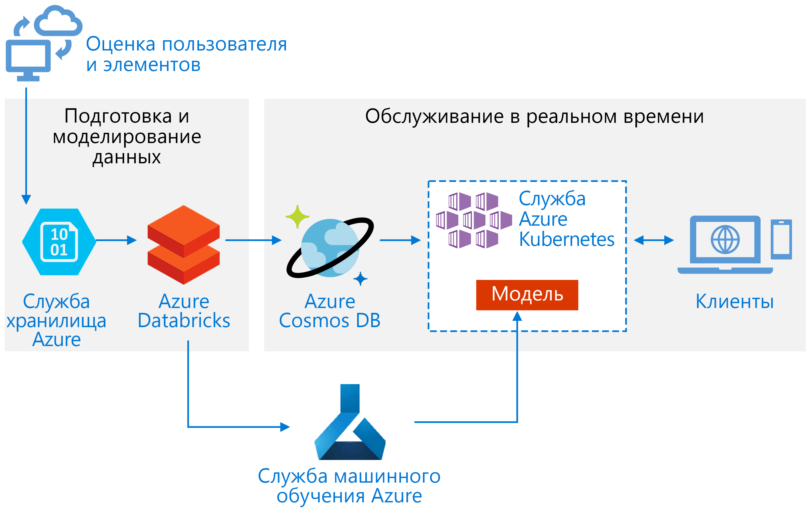
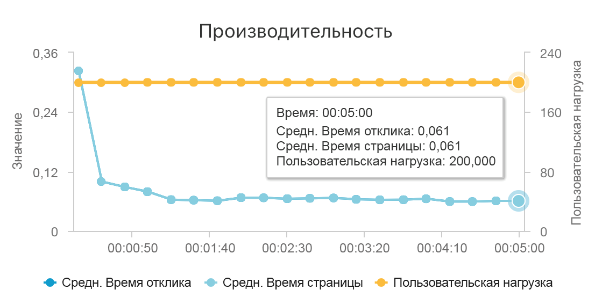
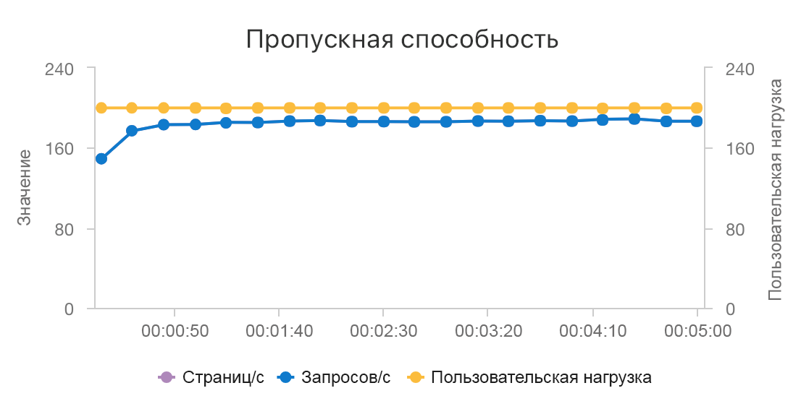

# <a name="build-a-real-time-recommendation-api-on-azure"></a>Создание API рекомендаций в режиме реального времени в Azure

В этой эталонной архитектуре показано, как обучить модель рекомендаций с помощью Azure Databricks и развернуть ее как API с помощью Azure Cosmos DB, Машинного обучения Azure и Службы Azure Kubernetes (AKS). Эту архитектуру можно подготовить к использованию для большинства сценариев механизма рекомендаций, включая рекомендации для продуктов, фильмов и новостей.

Эталонную реализацию для этой архитектуры можно найти на сайте [GitHub](https://github.com/Microsoft/Recommenders/blob/master/notebooks/04_operationalize/als_movie_o16n.ipynb).



**Сценарий**. Вещательная организация хочет предоставить своим пользователям рекомендации к фильмам или видео. Предоставляя персональные рекомендации, организация достигает несколько бизнес-целей, включая повышение коэффициента переходов, рост популярности сайта и повышение удовлетворенности пользователей.

Эта эталонная архитектура предназначена для обучения и развертывания API службы рекомендаций в режиме реального времени, которая может предоставить 10 лучших рекомендаций по фильмам для данного пользователя.

Поток данных для этой модели рекомендаций выглядит следующим образом.

1. Отслеживание поведения пользователя. Например, серверная служба может регистрировать, когда пользователь оценивает фильм, щелкает продукт или новостную статью.

2. Загрузка данных в Azure Databricks из доступного [источника данных][data-source].

3. Подготовка данных и их разделение на наборы для обучения и тестирования модели. (В [этом руководстве ][guide] описаны параметры для разделения данных).

4. Настройте модель [Spark Collaborative Filtering][als] согласно данным.

5. Оцените качество модели, используя рейтинг и метрики ранжирования. (В [этом руководстве][eval-guide] содержатся сведения о метриках, по которым вы можете оценивать рекомендации).

6. Предварительно вычислите 10 рекомендаций для каждого пользователя и сохраните их в виде кэша в Azure Cosmos DB.

7. Разверните службу API в AKS с помощью API Машинного обучения Azure для контейнеризации и развертывания API.

8. Когда серверная служба получит запрос от пользователя, вызовите API рекомендаций, размещенный в AKS, чтобы получить 10 лучших рекомендаций и отобразить их пользователю.

## <a name="architecture"></a>Архитектура

Эта архитектура состоит из следующих компонентов.

[Azure Databricks][databricks]. Databricks – это среда разработки, используемая для подготовки входных данных и обучения модели рекомендаций в кластере Spark. Azure Databricks также предоставляет интерактивную рабочую область для запуска и совместной работы над записными книжками для любых задач обработки данных или машинного обучения.

[Служба Azure Kubernetes][aks] (AKS). AKS используется для развертывания и эксплуатации API службы модели машинного обучения в кластере Kubernetes. AKS поддерживает контейнерную модель, обеспечивая масштабируемость, соответствующую вашим требованиям к пропускной способности, управлению идентификацией и доступом, а также ведению журналов и мониторингу работоспособности.

[Azure Cosmos DB][cosmosdb]. Cosmos DB – это глобально распределенная служба базы данных, используемая для хранения 10 лучших рекомендуемых фильмов для каждого пользователя. Azure Cosmos DB хорошо подходит для этого сценария, поскольку обеспечивает низкую задержку (10 мс при 99-м процентиле) для чтения 10 рекомендуемых элементов для данного пользователя.

[Служба машинного обучения Azure][mls]. Эта служба используется для отслеживания и управления моделями машинного обучения, а затем для упаковки и развертывания этих моделей в масштабируемой среде AKS.

[Microsoft Recommenders][github]. Этот репозиторий с открытым исходным кодом содержит служебный код и примеры, которые помогут пользователям начать создавать, оценивать и вводить в действие систему рекомендаций.

## <a name="performance-considerations"></a>Рекомендации по производительности

Производительность является основным фактором для рекомендаций в режиме реального времени, потому что рекомендации обычно находятся на критическом пути запроса, который пользователь делает на вашем сайте.

Сочетание AKS и Azure Cosmos DB позволяет этой архитектуре формировать хорошую отправную точку для рекомендаций для рабочей нагрузки среднего размера с минимальными издержками. При нагрузочном тесте с 200 одновременными пользователями эта архитектура предоставляет рекомендации со средней задержкой около 60 мс и пропускной способностью 180 запросов в секунду. Нагрузочный тест был выполнен с использованием конфигурации развертывания по умолчанию (кластер 3x AKS D3 v2 с 12 виртуальными ЦП, 42 ГБ памяти и 11 000 [единиц запросов (RU) в секунду][ru], выделенных для Azure Cosmos DB).





Azure Cosmos DB рекомендуется из-за ее удобства и возможности глобального распределения при удовлетворении любых требований к базе данных, которые есть у вашего приложения. Для незначительного [сокращения задержки][latency] попробуйте для обслуживания поиска использовать [кэш Redis для Azure][redis] вместо Azure Cosmos DB. Кэш Redis может повысить производительность систем, которые сильно зависят от данных в серверных хранилищах.

## <a name="scalability-considerations"></a>Вопросы масштабируемости

Если вы не планируете использовать Spark или у вас меньшая рабочая нагрузка, где не нужно распределение, рекомендуем использовать [виртуальную машину для обработки и анализа данных][dsvm] (DSVM) вместо Azure Databricks. DSVM – это виртуальная машина Azure с платформами для глубинного обучения и средствами для машинного обучения, обработки и анализа данных. Как и в случае с Azure Databricks, любую модель, созданную в DSVM, можно использовать в качестве службы в AKS с помощью Машинного обучения Azure.

Во время обучения выделите больший кластер Spark фиксированного размера в Azure Databricks или настройте [автомасштабирование][autoscaling]. Если автомасштабирование включено, Databricks отслеживает нагрузку на ваш кластер и при необходимости масштабирует его. Подготовьте или масштабируйте более крупный кластер, если у вас большой объем данных и вы хотите сократить время, необходимое для подготовки данных или моделирования задач.

Масштабируйте кластер AKS в соответствии с вашими требованиями к производительности и пропускной способности. Будьте внимательны при увеличении количества [модулей][scale], чтобы полностью использовать кластер, и при масштабировании [узлов][nodes] кластера, чтобы соответствовать требованиям вашей службы. Дополнительные сведения о том, как масштабировать кластер в соответствии с требованиями к производительности и пропускной способности службы рекомендации, см. в статье [Масштабирование кластеров службы контейнеров Azure][blog].

Чтобы управлять производительностью Azure Cosmos DB, оцените необходимое количество операций чтения в секунду и укажите количество [EЗ в секунду][ru] (пропускная способность). Следуйте рекомендациям для [секционирования и горизонтального масштабирования][partition-data].

## <a name="cost-considerations"></a>Рекомендации по стоимости

Основными аргументами стоимости в этом сценарии являются:

- размер кластера Azure Databricks, необходимый для обучения;
- размер кластера AKS, необходимый для выполнения требований к производительности;
- ЕЗ Azure Cosmos DB предоставлены в соответствии с вашими требованиями к производительности.

Управляйте стоимостью Azure Databricks, реже проходя переподготовку и отключая кластер Spark, когда он не используется. Стоимость AKS и Azure Cosmos DB привязана к пропускной способности и производительности, которые требуются вашему сайту. Она будет увеличиваться и уменьшаться в зависимости от объема трафика на вашем сайте.

## <a name="deploy-the-solution"></a>Развертывание решения

Чтобы развернуть эту архитектуру, сначала создайте среду Azure Databricks для подготовки данных и обучения модели рекомендации.

1. Создайте [рабочую область Azure Databricks][workspace].

2. Создайте новый кластер Spark в Azure Databricks. Требуются следующие значения конфигурации.

    - Режим кластера: Стандартная
    - Версия среды выполнения Databricks: 4.1 (содержит Apache Spark 2.3.0, Scala 2.11)
    - Версия Python: 3
    - Тип драйвера: Стандартный \_DS3\_версии 2
    - Тип рабочего процесса: Стандартный\_DS3\_версии 2 (min и max, при необходимости)
    - Автоматическое завершение работы: при необходимости
    - Конфигурация Spark: при необходимости
    - Переменные среды: при необходимости

3. Клонируйте репозиторий[Microsoft Recommenders][github] на локальном компьютере.

4. Заархивируйте содержимое папки "Рекомендации".

    ```console
    cd Recommenders
    zip -r Recommenders.zip
    ```

5. Подключите библиотеку "Рекомендации" к своему кластеру следующим образом.

    1. В следующем меню используйте параметр для импорта библиотеки ("Чтобы импортировать библиотеку, например, jar или egg, щелкните здесь") и **щелкните здесь**.

    2. В первом раскрывающемся меню выберите параметр **Передать пакет Python PyPI или Python egg**.

    3. Выберите команду **Перетащить сюда библиотеку egg для передачи**, а затем выберите недавно созданный файл Recommenders.zip.

    4. Выберите **Создать библиотеку**, чтобы передать ZIP-файл и сделать его доступным в рабочей области.

    5. В следующем меню подключите библиотеку к своему кластеру.

6. В своей рабочей области импортируйте [пример ALS Movie Operationalization][als-example].

7. Запустите записную книжку ALS Movie Operationalization, чтобы создать ресурсы, необходимые для создания API рекомендаций, который предоставляет 10 рекомендаций по фильмам для данного пользователя.

<!-- links -->
[aci]: /azure/container-instances/container-instances-overview
[aad]: /azure/active-directory-b2c/active-directory-b2c-overview
[aks]: /azure/aks/intro-kubernetes
[als]: https://spark.apache.org/docs/latest/ml-collaborative-filtering.html
[als-example]: https://github.com/Microsoft/Recommenders/blob/master/notebooks/04_operationalize/als_movie_o16n.ipynb
[autoscaling]: https://docs.azuredatabricks.net/user-guide/clusters/sizing.html
[autoscale]: https://docs.azuredatabricks.net/user-guide/clusters/sizing.html#autoscaling
[availability]: /azure/architecture/checklist/availability
[blob]: /azure/storage/blobs/storage-blobs-introduction
[blog]: https://blogs.technet.microsoft.com/machinelearning/2018/03/20/scaling-azure-container-service-cluster/
[clusters]: https://docs.azuredatabricks.net/user-guide/clusters/configure.html
[cosmosdb]: /azure/cosmos-db/introduction
[data-source]: https://docs.azuredatabricks.net/spark/latest/data-sources/index.html
[databricks]: /azure/azure-databricks/what-is-azure-databricks
[dsvm]: /azure/machine-learning/data-science-virtual-machine/overview
[dsvm-ubuntu]: /azure/machine-learning/data-science-virtual-machine/dsvm-ubuntu-intro
[eval-guide]: https://github.com/Microsoft/Recommenders/blob/master/notebooks/03_evaluate/evaluation.ipynb
[free]: https://azure.microsoft.com/free/?WT.mc_id=A261C142F
[github]: https://github.com/Microsoft/Recommenders
[guide]: https://github.com/Microsoft/Recommenders/blob/master/notebooks/01_prepare_data/data_split.ipynb
[latency]: https://github.com/jessebenson/azure-performance
[mls]: /azure/machine-learning/service/
[n-tier]: /azure/architecture/reference-architectures/n-tier/n-tier-cassandra
[ndcg]: https://en.wikipedia.org/wiki/Discounted_cumulative_gain
[nodes]: /azure/aks/scale-cluster
[notebook]: https://github.com/Microsoft/Recommenders/notebooks/00_quick_start/als_pyspark_movielens.ipynb
[partition-data]: /azure/cosmos-db/partition-data
[redis]: /azure/redis-cache/cache-overview
[regions]: https://azure.microsoft.com/en-us/global-infrastructure/services/?products=virtual-machines&regions=all
[resiliency]: /azure/architecture/resiliency/
[ru]: /azure/cosmos-db/request-units
[sec-docs]: /azure/security/
[setup]: https://github.com/Microsoft/Recommenders/blob/master/SETUP.md%60
[scale]: /azure/aks/tutorial-kubernetes-scale
[sla]: https://azure.microsoft.com/en-us/support/legal/sla/virtual-machines/v1_8/
[vm-size]: /azure/virtual-machines/virtual-machines-linux-change-vm-size
[workspace]: https://docs.azuredatabricks.net/getting-started/index.html
