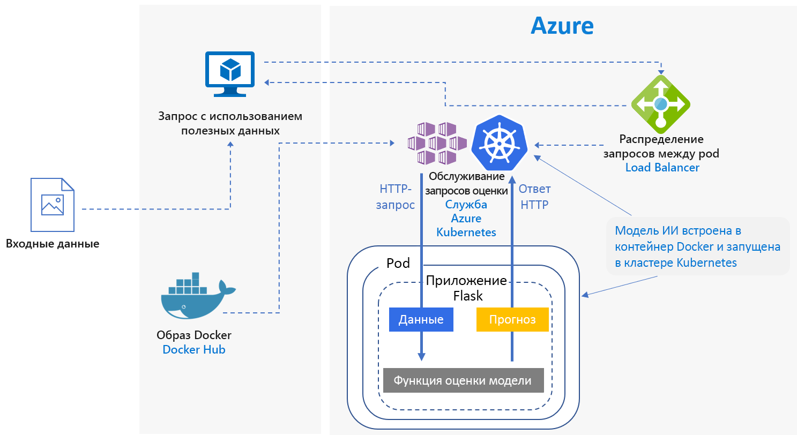
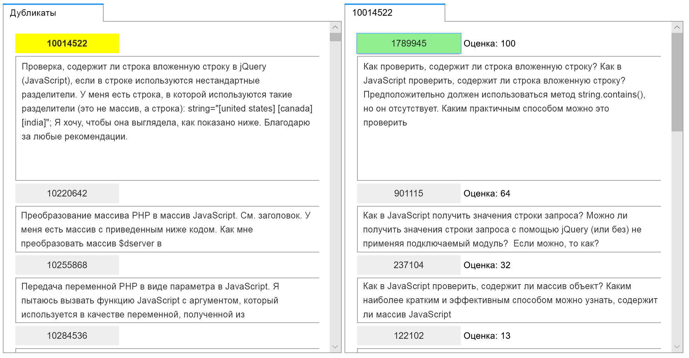
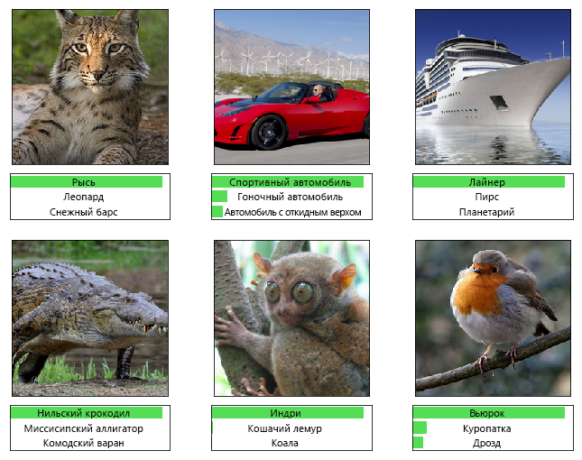

# Оценка в реальном времени моделей Python scikit-learn и глубокого обучения в AzureReal-time scoring of Python Scikit-Learn and deep learning models on Azure

Эта эталонная архитектура демонстрирует, как развернуть модель Python в качестве веб-службы в Azure для прогнозирования в реальном времени.This reference architecture shows how to deploy Python models as web services to make real-time predictions. Рассматриваются два сценария: развертывание обычных моделей Python и развертывание моделей глубокого обучения с определенными требованиями.Two scenarios are covered: deploying regular Python models, and the specific requirements of deploying deep learning models. Оба сценария используют показанную на рисунке архитектуру.Both scenarios use the architecture shown.

Два примера реализации этой архитектуры можно найти на сайте GitHub: один для [обычных моделей Python][github-python] и один для [моделей глубокого обучения][github-dl].Two reference implementations for this architecture are available on GitHub, one for [regular Python models][github-python] and one for [deep learning models][github-dl].

## СценарииScenarios

Примеры реализации демонстрируют два сценария использования этой архитектуры.The reference implementations demonstrate two scenarios using this architecture.

**Сценарий 1: сопоставление часто задаваемых вопросов**.**Scenario 1: FAQ matching**. Этот сценарий демонстрирует, как развернуть модель сопоставления часто задаваемых вопросов в качестве веб-службы для прогнозирования вопросов пользователей.This scenario shows how to deploy a frequently asked questions (FAQ) matching model as a web service to provide predictions for user questions. В этом сценарии входными данными на схеме архитектуры служат текстовые строки, содержащие вопросы пользователей, сопоставляемые со списком часто задаваемых вопросов.For this scenario, "Input Data" in the architecture diagram refers to text strings containing user questions to match with a list of FAQs. В этом сценарии используется библиотека машинного обучения [scikit-learn][scikit] для Python, но также поддерживаются любые сценарии работы с моделями Python для прогнозирования в реальном времени.This scenario is designed for the [scikit-learn][scikit] machine learning library for Python, but can be generalized to any scenario that uses Python models to make real-time predictions.

В этом сценарии используется набор данных вопросов Stack Overflow , которые содержат исходные вопросы, помеченные тегами JavaScript, дублирующиеся вопросы и ответы на них.This scenario uses a subset of Stack Overflow question data that includes original questions tagged as JavaScript, their duplicate questions, and their answers. В сценарии конвейер scikit-learn обучается прогнозировать возможность соответствия дублирующихся и исходных вопросов.It trains a scikit-learn pipeline to predict the match probability of a duplicate question with each of the original questions. Прогнозирование осуществляется в реальном времени с использованием конечной точки REST API.These predictions are made in real time using a REST API endpoint.

Архитектура предполагает такой алгоритм работы:The application flow for this architecture is as follows:

1. Клиент отправляет запрос HTTP POST с закодированными данными вопроса.The client sends an HTTP POST request with the encoded question data.

2. Приложение Flask извлекает вопрос из запроса.The Flask app extracts the question from the request.

3. Вопрос отправляется в модель конвейера scikit-learn для извлечения признаков и оценки.The question is sent to the scikit-learn pipeline model for featurization and scoring.

4. Соответствующие часто задаваемые вопросы и их оценки преобразуются в объект JSON и возвращаются клиенту.The matching FAQ questions with their scores are piped into a JSON object and returned to the client.

Ниже приведен пример приложения, использующего полученные результаты:Here is a screenshot of the example app that consumes the results:

**Сценарий 2: классификация изображений.****Scenario 2: Image classification**. Этот сценарий демонстрирует развертывание модели сверточной нейронной сети (CNN) в качестве веб-службы для прогнозной обработки изображений.This scenario shows how to deploy a Convolutional Neural Network (CNN) model as a web service to provide predictions on images. В этом сценарии входными данными на схеме архитектуры служат файлы изображений.For this scenario, "Input Data" in the architecture diagram refers to image files. Сети CNN весьма эффективны для выполнения таких задач компьютерного зрения, как классификация изображений и обнаружение объектов.CNNs are very effective in computer vision for tasks such as image classification and object detection. В этом сценарии используются платформы TensorFlow, Keras (с серверной частью TensorFlow) и PyTorch.This scenario is designed for the frameworks TensorFlow, Keras (with the TensorFlow back end), and PyTorch. Но также поддерживаются сценарии работы с моделью глубокого обучения для прогнозирования в реальном времени.However, it can be generalized to any scenario that uses deep learning models to make real-time predictions.

В этом сценарии используется модель ResNet-152, обученная с помощью набора данных ImageNet -1K (1000 классов), для прогнозирования категории изображения (см. рисунок ниже).This scenario uses a pre-trained ResNet-152 model trained on ImageNet-1K (1,000 classes) dataset to predict which category (see figure below) an image belongs to. Прогнозирование осуществляется в реальном времени с использованием конечной точки REST API.These predictions are made in real time using a REST API endpoint.

Модель глубокого обучения предполагает такой алгоритм работы:The application flow for the deep learning model is as follows:

1. Клиент отправляет запрос HTTP POST с закодированными данными изображения.The client sends an HTTP POST request with the encoded image data.

2. Приложение Flask извлекает изображение из запроса.The Flask app extracts the image from the request.

3. Изображение предварительно обрабатывается и отправляется в модель для оценки.The image is preprocessed and sent to the model for scoring.

4. Результаты оценки преобразуются в объект JSON и возвращаются клиенту.The scoring result is piped into a JSON object and returned to the client.

## АрхитектураArchitecture

Архитектура состоит из следующих компонентов.This architecture consists of the following components.

**[Виртуальная машина][vm]**.**[Virtual machine][vm]** (VM). Виртуальная машина показана в качестве примера локального или облачного устройства, способного отправлять запрос HTTP.The VM is shown as an example of a device &mdash; local or in the cloud &mdash; that can send an HTTP request.

**[Служба Azure Kubernetes][aks]** (AKS) используется для развертывания приложения в кластере Kubernetes.**[Azure Kubernetes Service][aks]** (AKS) is used to deploy the application on a Kubernetes cluster. AKS упрощает развертывание и использование Kubernetes.AKS simplifies the deployment and operations of Kubernetes. Кластер можно настроить с помощью виртуальных машин с обычным ЦП для обычных моделей Python или виртуальных машин с графическим процессором для моделей глубокого обучения.The cluster can be configured using CPU-only VMs for regular Python models or GPU-enabled VMs for deep learning models.

**[Подсистема балансировки нагрузки][lb]**.**[Load balancer][lb]**. Подсистема балансировки нагрузки, предоставляемая AKS, используется для взаимодействия с внешними приложениями.A load balancer, provisioned by AKS, is used to expose the service externally. Трафик из подсистемы балансировки нагрузки направляется в модули pod серверной части.Traffic from the load balancer is directed to the back-end pods.

**[Центр Docker][docker]** используется для хранения образа Docker, который развертывается в кластере Kubernetes.**[Docker Hub][docker]** is used to store the Docker image that is deployed on Kubernetes cluster. Центр Docker выбран для этой архитектуры, так как он прост в использовании и является репозиторием образов по умолчанию для пользователей Docker.Docker Hub was chosen for this architecture because it's easy to use and is the default image repository for Docker users. [Реестр контейнеров Azure][acr] также можно использовать в этой архитектуре.[Azure Container Registry][acr] can also be used for this architecture.

## Рекомендации по производительностиPerformance considerations

Пропускная способность является важным параметром для архитектур оценки в реальном времени.For real-time scoring architectures, throughput performance becomes a dominant consideration. Принято считать, что для рабочей нагрузки обычных моделей Python достаточно обычных ЦП.For regular Python models, it's generally accepted that CPUs are sufficient to handle the workload.

Но для рабочих нагрузок моделей глубокого обучения, когда скорость имеет решающее значение, графические процессоры обеспечивают более высокую [производительность][gpus-vs-cpus] по сравнению с обычными ЦП.However for deep learning workloads, when speed is a bottleneck, GPUs generally provide better [performance][gpus-vs-cpus] compared to CPUs. Чтобы добиться производительности графического процессора, необходим кластер с большим количеством обычных ЦП.To match GPU performance using CPUs, a cluster with large number of CPUs is usually needed.

Обычные ЦП можно использовать в любом сценарии для этой архитектуры, но для моделей глубокого обучения графические процессоры обеспечивают гораздо более высокие значения пропускной способности по сравнению с кластером с обычными ЦП в рамках одного бюджета.You can use CPUs for this architecture in either scenario, but for deep learning models, GPUs provide significantly higher throughput values compared to a CPU cluster of similar cost. Для AKS реализована поддержка GPU, что является одним из преимуществ использования этой службы в описанной архитектуре.AKS supports the use of GPUs, which is one advantage of using AKS for this architecture. Кроме того, модели глубокого обучения обычно имеют большое количество параметров.Also, deep learning deployments typically use models with a high number of parameters. Использование GPU устраняет конкуренцию за ресурсы между моделью и веб-службой, что является проблемой при развертывании с обычными ЦП.Using GPUs prevents contention for resources between the model and the web service, which is an issue in CPU-only deployments.

## Вопросы масштабируемостиScalability considerations

Для обычных моделей Python (кластер AKS содержит подготовленные виртуальные машины с обычными ЦП) особое внимание следует уделить [масштабированию количества модулей pod][manually-scale-pods].For regular Python models, where AKS cluster is provisioned with CPU-only VMs, take care when [scaling out the number of pods][manually-scale-pods]. Целью является максимальное использование возможностей кластера.The goal is to fully utilize the cluster. Масштабирование зависит от запросов ЦП, а для модулей pod устанавливаются ограничения.Scaling depends on the CPU requests and limits defined for the pods. Kubernetes также поддерживает [автомасштабирование][autoscale-pods] модулей pod, регулируя количество модулей в развертывании в зависимости от использования ЦП или других выбранных метрик.Kubernetes also supports [autoscaling][autoscale-pods] of the pods to adjust the number of pods in a deployment depending on CPU utilization or other select metrics. [Служба автомасштабирования кластеров][autoscaler] (доступна в предварительной версии) позволяет масштабировать узлы агентов на основе ожидающих модулей pod.The [cluster autoscaler][autoscaler] (in preview) can scale agent nodes based on pending pods.

Ограничения на ресурсы для сценариев глубокого обучения, в которых используются виртуальные машины с графическими процессорами, предусматривают назначение каждому модулю pod одного графического процессора.For deep learning scenarios, using GPU-enabled VMs, resource limits on pods are such that one GPU is assigned to one pod. В зависимости от типа используемой виртуальной машины, вам нужно выполнить [масштабирование узлов кластера][scale-cluster] в соответствии с требованиями службы.Depending on the type of VM used, you must [scale the nodes of the cluster][scale-cluster] to meet the demand for the service. Это делается с помощью Azure CLI и kubectl.You can do this easily using the Azure CLI and kubectl.

## Мониторинг и ведение журнала запросовMonitoring and logging considerations

### Мониторинг AKSAKS monitoring

Чтобы отслеживать производительность AKS, используйте службу [Azure Monitor для контейнеров][monitor-containers].For visibility into AKS performance, use the [Azure Monitor for containers][monitor-containers] feature. Она позволяет собирать данные метрик памяти и процессора из контроллеров, узлов и контейнеров, доступных в Kubernetes, с помощью API метрик.It collects memory and processor metrics from controllers, nodes, and containers that are available in Kubernetes through the Metrics API.

При развертывании приложения отслеживайте кластер AKS, чтобы убедиться в том, что он работает должным образом, все узлы исправны, а модули pod запущены.While deploying your application, monitor the AKS cluster to make sure it's working as expected, all the nodes are operational, and all pods are running. Хотя можно использовать средство командной строки [kubectl][kubectl] для получения сведений о состоянии модулей pod, доступная в Kubernetes веб-панель мониторинга позволяет выполнять базовый мониторинг состояния кластера и управлять им.Although you can use the [kubectl][kubectl] command-line tool to retrieve pod status, Kubernetes also includes a web dashboard for basic monitoring of the cluster status and management.

Чтобы проверить общее состояние кластера и узлов, перейдите в раздел **Узлы** панели мониторинга Kubernetes.To see the overall state of the cluster and nodes, go to the **Nodes** section of the Kubernetes dashboard. Если узел неактивен или произошел сбой, можно просмотреть журналы ошибок на этой странице.If a node is inactive or has failed, you can display the error logs from that page. В разделах **Объекты pod** и **Развертывания** содержатся сведения о количестве модулей и состоянии развертывания.Similarly, go to the **Pods** and **Deployments** sections for information about the number of pods and status of your deployment.

### Журналы AKSAKS logs

Все потоки stdout и stderr в AKS автоматически регистрируются в журналах модулей pod, содержащихся в кластере.AKS automatically logs all stdout/stderr to the logs of the pods in the cluster. Используйте kubectl, чтобы просмотреть их, а также журналы и события на уровне узла.Use kubectl to see these and also node-level events and logs. Дополнительные сведения см. в шагах по развертыванию.For details, see the deployment steps.

Используйте [Azure Monitor для контейнеров][monitor-containers] для сбора метрик и журналов с помощью контейнерной версии агента Log Analytics для Linux, который хранится в рабочей области Log Analytics.Use [Azure Monitor for containers][monitor-containers] to collect metrics and logs through a containerized version of the Log Analytics agent for Linux, which is stored in your Log Analytics workspace.

## Вопросы безопасностиSecurity considerations

Благодаря [центру безопасности Azure][security-center] можно получить полное представление о состоянии безопасности ваших ресурсов Azure.Use [Azure Security Center][security-center] to get a central view of the security state of your Azure resources. Центр безопасности отслеживает потенциальные проблемы безопасности, а также дает полное представление о работоспособности системы безопасности развертывания, хотя и не отслеживает состояние узлов агентов AKS.Security Center monitors potential security issues and provides a comprehensive picture of the security health of your deployment, although it doesn't monitor AKS agent nodes. Центр безопасности настраивается на уровне подписки Azure.Security Center is configured per Azure subscription. Включите сбор данных безопасности, как описано в кратком руководстве [Переход подписки Azure на ценовую категорию центра безопасности "Стандартный"][get-started].Enable security data collection as described in [Onboard your Azure subscription to Security Center Standard][get-started]. Когда сбор данных включен, центр безопасности автоматически проверяет все виртуальные машины, созданные для этой подписки.When data collection is enabled, Security Center automatically scans any VMs created under that subscription.

**Эксплуатация**.**Operations**. Чтобы входить в кластер AKS с помощью маркера проверки подлинности Azure Active Directory (Azure AD), настройте в AKS [проверку подлинности пользователей][aad-auth] с помощью Azure AD.To sign in to an AKS cluster using your Azure Active Directory (Azure AD) authentication token, configure AKS to use Azure AD for [user authentication][aad-auth]. Администраторы кластера также могут настроить управление доступом на основе ролей (RBAC) для Kubernetes в зависимости от членства в группе каталогов или удостоверения пользователей.Cluster administrators can also configure Kubernetes role-based access control (RBAC) based on a user's identity or directory group membership.

Контролируйте доступ к развертываемым ресурсам Azure с помощью [RBAC][rbac].Use [RBAC][rbac] to control access to the Azure resources that you deploy. RBAC позволяет назначить роли авторизации участникам команды DevOps.RBAC lets you assign authorization roles to members of your DevOps team. Пользователю можно назначить несколько ролей. Можно также создать пользовательские роли, чтобы выборочно настроить [разрешения].A user can be assigned to multiple roles, and you can create custom roles for even more fine-grained [permissions].

**HTTPS**.**HTTPS**. Из соображений безопасности следует принудительно применять в приложении протокол HTTPS, перенаправляя все HTTP-запросы.As a security best practice, the application should enforce HTTPS and redirect HTTP requests. Используйте [контроллер входящего трафика][ingress-controller], чтобы развернуть обратный прокси-сервер, который завершает SSL и перенаправляет HTTP-запросы.Use an [ingress controller][ingress-controller] to deploy a reverse proxy that terminates SSL and redirects HTTP requests. Дополнительные сведения см. в статье [Создание контроллера входящего трафика HTTPS в Службе Azure Kubernetes (AKS)][https-ingress].For more information, see [Create an HTTPS ingress controller on Azure Kubernetes Service (AKS)][https-ingress].

**Проверка подлинности**.**Authentication**. Это решение не ограничивает доступ к конечным точкам.This solution doesn't restrict access to the endpoints. Чтобы развернуть эту архитектуру в среде предприятия, защитите конечные точки с помощью ключей API и добавьте в клиентское приложение предпочитаемую процедуру аутентификации пользователей.To deploy the architecture in an enterprise setting, secure the endpoints through API keys and add some form of user authentication to the client application.

**Реестр контейнеров**.**Container registry**. Это решение использует общедоступный реестр для хранения образа Docker.This solution uses a public registry to store the Docker image. Код, от которого зависит приложение, и модель содержатся в этом образе.The code that the application depends on, and the model, are contained within this image. Корпоративные приложения должны использовать частный реестр, обеспечивающий защиту от выполнения вредоносного кода и компрометации хранящейся в контейнере информации.Enterprise applications should use a private registry to help guard against running malicious code and to help keep the information inside the container from being compromised.

**Защита от атак DDoS.****DDoS protection**. Рассмотрите возможность подключения [Защиты от атак DDoS ценовой категории "Стандартный"][ddos].Consider enabling [DDoS Protection Standard][ddos]. Хотя платформа Azure и обеспечивает базовую защиту от атак DDoS, возможности Защиты Azure от атак DDoS ценовой категории "Стандартный" по снижению рисков атак специально оптимизированы для виртуальных сетевых ресурсов Azure.Although basic DDoS protection is enabled as part of the Azure platform, DDoS Protection Standard provides mitigation capabilities that are tuned specifically to Azure virtual network resources.

**Ведение журналов.****Logging**. Следуйте рекомендациям при сохранении данных журнала, например, выполняйте очистку пользовательских паролей и других данных, которые могут использоваться в мошеннических целях.Use best practices before storing log data, such as scrubbing user passwords and other information that could be used to commit security fraud.

## РазвертываниеDeployment

Для развертывания этой эталонной архитектуры, выполните действия, описанные в репозитории GitHub:To deploy this reference architecture, follow the steps described in the GitHub repos:

- [Обычные модели Python][github-python];[Regular Python models][github-python]
- [Модели машинного обучения][github-dl].[Deep learning models][github-dl]

<!-- links -->

[aad-auth]: /azure/aks/aad-integration
[acr]: /azure/container-registry/
[something]: https://kubernetes.io/docs/reference/access-authn-authz/authentication/
[aks]: /azure/aks/intro-kubernetes
[autoscaler]: /azure/aks/autoscaler
[autoscale-pods]: /azure/aks/tutorial-kubernetes-scale#autoscale-pods
[azcopy]: /azure/storage/common/storage-use-azcopy-linux
[ddos]: /azure/virtual-network/ddos-protection-overview
[docker]: https://hub.docker.com/
[get-started]: /azure/security-center/security-center-get-started
[github-python]: https://github.com/Azure/MLAKSDeployment
[github-dl]: https://github.com/Microsoft/AKSDeploymentTutorial
[gpus-vs-cpus]: https://azure.microsoft.com/en-us/blog/gpus-vs-cpus-for-deployment-of-deep-learning-models/
[https-ingress]: /azure/aks/ingress-tls
[ingress-controller]: https://kubernetes.io/docs/concepts/services-networking/ingress/
[kubectl]: https://kubernetes.io/docs/tasks/tools/install-kubectl/
[lb]: /azure/load-balancer/load-balancer-overview
[manually-scale-pods]: /azure/aks/tutorial-kubernetes-scale#manually-scale-pods
[monitor-containers]: /azure/monitoring/monitoring-container-insights-overview
[разрешения]: /azure/aks/concepts-identity
[permissions]: /azure/aks/concepts-identity
[rbac]: /azure/active-directory/role-based-access-control-what-is
[scale-cluster]: /azure/aks/scale-cluster
[scikit]: https://pypi.org/project/scikit-learn/
[security-center]: /azure/security-center/security-center-intro
[vm]: /azure/virtual-machines/
