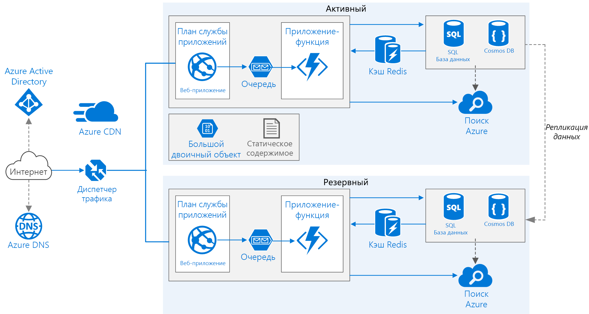

# <a name="run-a-web-application-in-multiple-regions"></a>Выполнение веб-приложения в нескольких регионах
[!INCLUDE [header](../../_includes/header.md)]

На схеме этой эталонной архитектуры представлены сведения о том, как работать с приложением службы приложений Azure в нескольких регионах для достижения высокого уровня доступности. 

 

*Скачайте [файл Visio][visio-download] этой архитектуры.*

## <a name="architecture"></a>Архитектура 

Эта архитектура создана на основе архитектуры из статьи [Improve scalability in a web application][guidance-web-apps-scalability] (Повышение масштабируемости в веб-приложении). Основные различия:

* **Основной и дополнительный регионы.** Эта архитектура использует два региона для достижения более высокого уровня доступности. Приложение развертывается в каждом регионе. При обычной работе трафик направляется в основной регион. Если основной регион становится недоступным, трафик направляется в дополнительный. 
* **Azure DNS**. [Azure DNS][azure-dns] — это служба размещения для доменов DNS, которая предоставляет разрешение имен с помощью инфраструктуры Microsoft Azure. Размещая домены в Azure, вы можете управлять своими записями DNS с помощью тех же учетных данных, API и инструментов и оплачивать использование, как и другие службы Azure.
* **Диспетчер трафика Azure.** [Диспетчер трафика][traffic-manager] направляет входящие запросы в основной регион. Если приложение, работающее в этом регионе, становится недоступным, диспетчер трафика выполняет отработку отказа в дополнительный регион.
* **Георепликация** базы данных SQL и Cosmos DB. 

Архитектура с несколькими регионами может обеспечить более высокий уровень доступности, чем развертывание в одном регионе. Если региональный сбой влияет на основной регион, можно использовать [диспетчер трафика][traffic-manager] для выполнения отработки отказа в дополнительный регион. Эта архитектура также помогает при сбое отдельной подсистемы или приложения.

Есть несколько общих подходов к достижению высокого уровня доступности в регионах: 

* Шаблон "активный — пассивный" с "горячим" резервом. Трафик отправляется в один регион, в то время как другой ожидает в режиме "горячего" резерва. "Горячий" резерв применяется, когда виртуальные машины в дополнительном регионе выделены и выполняются постоянно.
* Шаблон "активный — пассивный" с "холодным" резервом. Трафик отправляется в один регион, в то время как другой ожидает в режиме "холодного" резерва. "Холодный" резерв предполагает, что виртуальные машины в дополнительном регионе выделяются, только когда они требуются для отработки отказа. Этот подход экономичнее, однако при сбое для выхода в динамический режим требуется больше времени.
* Шаблон "активный — активный". Оба региона активны, нагрузка запросов балансируется между ними. Если один регион отключается, он изымается из ротации. 

В этой эталонной архитектуре уделяется внимание режиму "активный — пассивный" с "горячим" резервом, а также использованию диспетчера трафика для отработки отказа. 


## <a name="recommendations"></a>Рекомендации

Описанная здесь архитектура может не соответствовать вашим требованиям. Используйте рекомендации из этого раздела в качестве отправной точки.

### <a name="regional-pairing"></a>Региональные пары
Каждый регион Azure образует пару с другим регионом в пределах одной географической территории. В общем случае выбирайте регионы из одной региональной пары (например, восточная часть США 2, центральная часть США). Преимущества:

* в случае масштабного сбоя назначаются приоритеты восстановления по крайней мере одного региона из каждой пары;
* запланированные обновления системы Azure распространяются в парах регионов последовательно во избежание возможных простоев;
* во многих случаях пары находятся в пределах одной географической территории в соответствии с требованиями к местонахождению данных.

Убедитесь, что оба региона поддерживают все службы Azure, необходимые приложению. Дополнительные сведения см. на станице [Доступность продуктов по регионам][services-by-region]. Дополнительные сведения о парах регионов см. в статье [Непрерывность бизнес-процессов и аварийное восстановление в службах BizTalk: пары регионов Azure][regional-pairs].

### <a name="resource-groups"></a>Группы ресурсов
Рассмотрите возможность размещения основного и дополнительного регионов, а также диспетчера трафика в отдельных [группах ресурсов][resource groups]. Это позволяет управлять ресурсами, развернутыми в каждом регионе, как единой коллекцией.

### <a name="traffic-manager-configuration"></a>Конфигурация диспетчера трафика 

**Маршрутизация.** Диспетчер трафика поддерживает несколько [алгоритмов маршрутизации][tm-routing]. Для сценария, описанного в этой статье, используется маршрутизация по *приоритету* (ранее называлась маршрутизацией *отработки отказа*). С помощью этой функции диспетчер трафика отправляет все запросы в основной регион, если конечная точка региона не станет недоступной. В этот момент он автоматически выполняет отработку отказа в дополнительный регион. Дополнительные сведения см. в статье [Настройка метода маршрутизации трафика по приоритету в диспетчере трафика][tm-configure-failover].

**Проверка работоспособности.** Диспетчер трафика использует проверку HTTP (или HTTPS) для мониторинга доступности каждого региона. При проверке диспетчер трафика получает сведения о состоянии отработки отказа в дополнительный регион (успех или сбой). При этом отправляется запрос по указанному пути URL-адреса. Если в течение периода ожидания вернется ответ, отличный от ответа с кодом 200, проверка завершается со сбоем. После четырех неудачных запросов диспетчер трафика отмечает конечную точку как находящуюся в состоянии пониженной функциональности и выполняет отработку отказа в другую конечную точку. Дополнительные сведения см. в статье [Мониторинг конечных точек в диспетчере трафика][tm-monitoring].

Рекомендуется создать конечную точку проверки работоспособности, которая сообщает о работоспособности приложения, и использовать ее для проверки работоспособности. Конечная точка должна проверять критические зависимости, такие как приложения службы приложений, очередь хранения и базу данных SQL. В противном случае при проверке может быть сообщено о работоспособной конечной точке, тогда как критические части приложения фактически не будут работать.

С другой стороны, не используйте проверку работоспособности для проверки низкоприоритетных служб. Например, если служба электронной почты отключается, приложение может переключиться на другого поставщика или отправить сообщение электронной почты позже. Это недостаточно высокий приоритет для выполнения отработки отказа в приложении. Дополнительную информацию см. в статье [Health Endpoint Monitoring pattern][health-endpoint-monitoring-pattern] (Шаблон мониторинга конечной точки работоспособности).
 
### <a name="sql-database"></a>База данных SQL
Используйте [активную георепликацию][sql-replication], чтобы создать доступную для чтения вторичную реплику в другом регионе. У вас может быть до четырех доступных для чтения вторичных реплик. Выполните отработку отказа в базу данных-получатель, если в базе данных-источнике возникает сбой или ее необходимо перевести в автономный режим. Для любой базы данных в любом пуле эластичных баз данных можно настроить активную георепликацию.

### <a name="cosmos-db"></a>База данных Cosmos
Cosmos DB поддерживает географическую репликацию данных между регионами. Один регион обозначается как доступный для записи, а другие являются доступными только для чтения репликами.

При региональном сбое можно выполнить отработку отказа, выбрав другой доступный для записи регион. Пакет SDK клиента автоматически отправляет запросы на запись в текущий регион записи, поэтому вам не нужно обновлять конфигурацию клиента после отработки отказа. Дополнительные сведения см. в статье [Как работает глобальное распределение данных в Azure с помощью Cosmos DB][cosmosdb-geo].

> [!NOTE]
> Все реплики принадлежат к одной группе ресурсов.
>
>

### <a name="storage"></a>Хранилище
Используйте [геоизбыточное хранилище с доступом для чтения][ra-grs] для службы хранилища Azure. С геоизбыточным хранилищем с доступом на чтение данные реплицируются в дополнительный регион. У вас есть доступ только для чтения к данным во вторичном регионе через отдельную конечную точку. Если произойдет региональный сбой или авария, команда службы хранилища Azure может решить выполнить географическую отработку отказа в дополнительный регион. Для этой отработки отказа не требуется никаких действий клиента.

Создайте резервную очередь во вторичной области, чтобы создать хранилище очередей. При отработке отказа приложение может использовать резервную очередь, пока основной регион снова не станет доступен. Таким образом приложение может обрабатывать новые запросы.

## <a name="availability-considerations"></a>Вопросы доступности


### <a name="traffic-manager"></a>Диспетчер трафика

Диспетчер трафика автоматически выполняет отработку отказа, если основной регион становится недоступен. При выполнении отработки отказа диспетчера трафика в течение определенного времени клиенты не могут связаться с приложением. Этот период зависит от следующих факторов:

* При проверке работоспособности определяется, что с основным центром обработки данных невозможно связаться.
* Серверы службы доменных имен (DNS) должны обновить кэшированные записи DNS для IP-адресов, которые зависят от срока существования DNS. Срок существования по умолчанию — 300 секунд (5 минут), однако это значение можно настроить при создании профиля диспетчера трафика.

Дополнительные сведения см. в статье [Мониторинг конечных точек в диспетчере трафика][tm-monitoring].

Диспетчер трафика — это точка возможного сбоя в системе. Если происходит сбой, клиенты не смогут получить доступ к приложению во время простоя. Просмотрите [соглашение об уровне обслуживания диспетчера трафика][tm-sla] и подумайте, достаточно ли диспетчера трафика в соответствии с требованиями к высокой доступности в вашей организации. Если это не так, добавьте резервное решение для управления трафиком. Если в службе диспетчера трафика Azure произошел сбой, измените записи CNAME в службе доменных имен, чтобы они указывали на резервную службу управления трафиком. (Этот шаг нужно выполнить вручную, приложение будет отключено, пока изменения DNS не распространятся.)

### <a name="sql-database"></a>База данных SQL
Целевая точка восстановления (RPO) и расчетное время восстановления (ERT) для базы данных SQL задокументированы в разделе [Функции базы данных SQL, которые можно использовать для обеспечения непрерывности бизнес-процессов][sql-rpo]. 

### <a name="storage"></a>Хранилище
Геоизбыточное хранилище с доступом на чтение предоставляет надежное хранилище, однако важно понимать, что может произойти во время сбоя:

* При сбое хранилища в течение определенного времени у вас не будет доступа на запись данных. Вы по-прежнему может считывать данные из дополнительной конечной точки во время простоя.
* Если региональный сбой или авария затрагивают основное расположение и данные оттуда невозможно восстановить, команда службы хранилища Azure может выполнить географическую отработку отказа в дополнительный регион.
* Репликация данных в дополнительный регион выполняется асинхронно. Таким образом, если при выполнении географической отработки отказа данные невозможно восстановить из основного региона, возможна потеря некоторых данных.
* Временные сбои, такие как сбои сети, не активируют отработку отказа хранилища. Создайте устойчивое к кратковременным сбоям приложение. Возможные способы устранения:
  
  * чтение из дополнительного региона;
  * временное переключение на другую учетную запись хранения для выполнения новых операций записи (например, очереди сообщений);
  * копирование данных из дополнительного региона в другую учетную запись хранения;
  * настройка режима сниженной функциональности до восстановления размещения системы.

Дополнительные сведения см. в разделе [Что делать в случае сбоя службы хранилища Azure][storage-outage].

## <a name="manageability-considerations"></a>Вопросы управляемости

### <a name="traffic-manager"></a>Диспетчер трафика

При отработке отказа диспетчера трафика ее рекомендуется выполнять вручную, а не внедрять автоматическую отработку отказа. В противном случае могут возникнуть ситуации, в которых приложение будет переходить между регионами. Убедитесь, что все подсистемы приложения полностью работоспособны, и лишь затем выполните восстановление размещения.

Обратите внимание, что диспетчер трафика по умолчанию автоматически восстанавливает размещение. Чтобы избежать этого, вручную понизьте приоритет основного региона после отработки отказа. Например, предположим, что основной регион имеет приоритет 1, а дополнительные — приоритет 2. После отработки отказа задайте основному региону приоритет 3, чтобы избежать автоматического восстановления размещения. Когда будете готовы переключить приоритет обратно, измените приоритет до 1.

Следующие команды обновляют приоритет.

**PowerShell**

```bat
$endpoint = Get-AzureRmTrafficManagerEndpoint -Name <endpoint> -ProfileName <profile> -ResourceGroupName <resource-group> -Type AzureEndpoints
$endpoint.Priority = 3
Set-AzureRmTrafficManagerEndpoint -TrafficManagerEndpoint $endpoint
```

Дополнительные сведения см. в статье [AzureRM.TrafficManager][tm-ps].

**Интерфейс командной строки Azure (CLI)**

```bat
azure network traffic-manager endpoint set --name <endpoint> --profile-name <profile> --resource-group <resource-group> --type AzureEndpoints --priority 3
```    

### <a name="sql-database"></a>База данных SQL
При сбое базы данных-источника выполните отработку отказа вручную с переходом в базу данных-получатель. Ознакомьтесь со статьей [Восстановление базы данных SQL Azure или переход на базу данных-получатель при отказе][sql-failover]. До отработки отказа база данных-получатель остается доступной только для чтения.


<!-- links -->

[azure-sql-db]: https://azure.microsoft.com/documentation/services/sql-database/
[azure-dns]: /azure/dns/dns-overview
[cosmosdb-geo]: /azure/cosmos-db/distribute-data-globally
[guidance-web-apps-scalability]: ./scalable-web-app.md
[health-endpoint-monitoring-pattern]: https://msdn.microsoft.com/library/dn589789.aspx
[ra-grs]: /azure/storage/storage-redundancy#read-access-geo-redundant-storage
[regional-pairs]: /azure/best-practices-availability-paired-regions
[resource groups]: /azure/azure-resource-manager/resource-group-overview#resource-groups
[services-by-region]: https://azure.microsoft.com/regions/#services
[sql-failover]: /azure/sql-database/sql-database-disaster-recovery
[sql-replication]: /azure/sql-database/sql-database-geo-replication-overview
[sql-rpo]: /azure/sql-database/sql-database-business-continuity#sql-database-features-that-you-can-use-to-provide-business-continuity
[storage-outage]: /azure/storage/storage-disaster-recovery-guidance
[tm-configure-failover]: /azure/traffic-manager/traffic-manager-configure-failover-routing-method
[tm-monitoring]: /azure/traffic-manager/traffic-manager-monitoring
[tm-ps]: https://msdn.microsoft.com/library/mt125941.aspx
[tm-routing]: /azure/traffic-manager/traffic-manager-routing-methods
[tm-sla]: https://azure.microsoft.com/support/legal/sla/traffic-manager/v1_0/
[traffic-manager]: https://azure.microsoft.com/services/traffic-manager/
[visio-download]: https://archcenter.blob.core.windows.net/cdn/app-service-reference-architectures.vsdx
