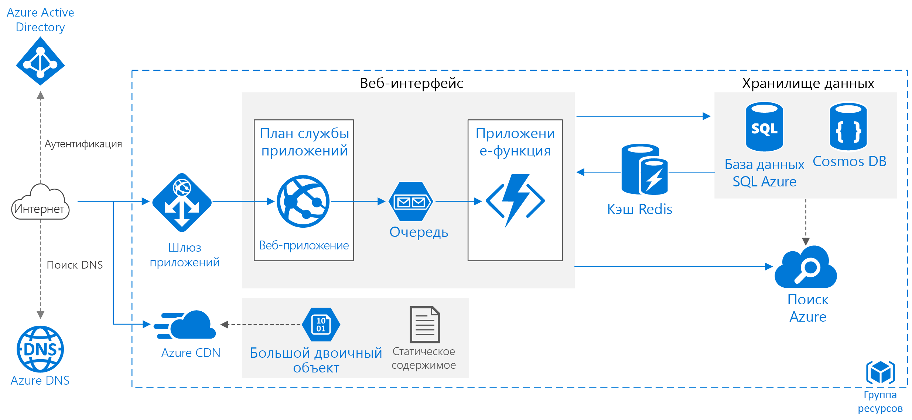

# Повышение масштабируемости в веб-приложении Azure

На схеме этой эталонной архитектуры представлены сведения о проверенных методах улучшения масштабируемости и производительности в службе приложений Azure.

*Скачайте [файл Visio][visio-download] этой архитектуры.*

## Архитектура

Эта архитектура создана на основе архитектуры, описанной в статье [Basic web application][basic-web-app] (Базовое веб-приложение). Она содержит следующие компоненты:

- **Группа ресурсов**. [Группа ресурсов][resource-group] — это логический контейнер для ресурсов Azure.
- **[Веб-приложение][app-service-web-app]**. Обычно современное приложение может включать в себя и веб-сайт, и один (или несколько) веб-API RESTful. Веб-API может использоваться клиентами браузера через технологию AJAX с помощью собственных клиентских приложений или приложений на стороне сервера. Рекомендации по разработке веб-API см. в статье [API design][api-guidance] (Проектирование API).
- **Приложение-функция**. Используйте [приложения-функции][functions] для выполнения фоновых задач. Функции вызываются триггером, таким как событие таймера или помещаемое в очередь сообщение. Для длительно выполняемых задач с отслеживанием состояния используйте [устойчивые функций][durable-functions].
- **Очередь.** В архитектуре, показанной здесь, приложение выполняет запрос фоновых заданий путем помещения сообщения в очередь [хранилища очередей Azure][queue-storage]. Сообщение активирует приложение-функцию. В качестве альтернативы можно использовать очереди служебной шины. Сравнение см. в статье [Очереди службы хранилища и очереди служебной шины: сходства и различия][queues-compared].
- **Кэш.** Храните полустатические данные в [кэше Redis для Azure][azure-redis].
- **CDN.** Используйте [сеть доставки содержимого Azure][azure-cdn] (CDN), чтобы выполнять кэширование общедоступного содержимого с меньшей задержкой и более быстрой доставкой содержимого.
- **Хранилище данных.** Используйте [базу данных SQL Azure][sql-db] для реляционных данных. Для нереляционных данных рассмотрите возможность использования [Cosmos DB][cosmosdb].
- **Поиск Azure.** Используйте [Поиск Azure][azure-search], чтобы добавлять функции поиска (такие как, например, поисковые запросы, поиск нечетких соответствий и языковой поиск). Служба "Поиск Azure" обычно используется в сочетании с другим хранилищем данных, особенно если первичное хранилище данных требует строгой согласованности. При использовании этого подхода храните достоверные данные в другом хранилище данных и используйте другой индекс поиска в службе "Поиск Azure". Служба "Поиск Azure" может также использоваться для консолидации одного индекса поиска из нескольких хранилищ данных.
- **Azure DNS**. [Azure DNS][azure-dns] — это служба размещения для доменов DNS, которая предоставляет разрешение имен с помощью инфраструктуры Microsoft Azure. Размещая домены в Azure, вы можете управлять своими записями DNS с помощью тех же учетных данных, API и инструментов и оплачивать использование, как и другие службы Azure.
- **Шлюз приложений.** [Шлюз приложений ](/azure/application-gateway/) — это балансировщик нагрузки уровня 7. В этой архитектуре шлюз перенаправляет HTTP-запросы к внешнему веб-интерфейсу. Шлюз приложений также предоставляет [брандмауэр веб-приложения](/azure/application-gateway/waf-overview) (WAF), который защищает приложения от распространенных эксплойтов и уязвимостей.

## Рекомендации

Описанная здесь архитектура может не соответствовать вашим требованиям. В качестве отправной точки используйте рекомендации в этом разделе.

### Приложения службы приложений

Рекомендуется создавать веб-приложение и веб-API как отдельные приложения службы приложений. Такой подход позволяет запускать их в отдельных планах службы приложений, поэтому они могут масштабироваться независимо друг от друга. Если изначально этот уровень масштабируемости не требуется, можно развертывать приложения в одном плане и позже переместить их в отдельные планы (при необходимости).

> [!NOTE]
> Для планов "Базовый", "Стандартный" и "Премиум" взимается плата за количество экземпляров виртуальных машин в плане, а не за отдельные приложения. Ознакомьтесь с [ценами на службу приложений][app-service-pricing]
>

### Кэш

Вы можете повысить производительность и масштабируемость с помощью [кэша Redis для Azure][azure-redis], чтобы выполнять кэширование определенных данных. Рассмотрите возможность использования кэша Redis для:

- полустатических данных транзакции;
- состояния сеанса;
- выходных данных в формате HTML. Это может быть полезно в приложениях, которые отображают сложные выходные данные в формате HTML.

Более подробные рекомендации по разработке стратегии кэширования см. в статье [Caching][caching-guidance] (Кэширование).

### CDN

Используйте [сеть доставки содержимого Azure][azure-cdn] для кэширования статического содержимого. Основным преимуществом CDN является возможность сократить задержку для пользователей, так как содержимое кэшируется на пограничном сервере, географически близком к пользователю. CDN позволяет сократить нагрузку на приложение, так как такой трафик не обрабатывается приложением.

Если приложение состоит в основном из статических страниц, рассмотрите возможность использования [сети доставки содержимого (CDN) для кэширования всего приложения][cdn-app-service]. Или же поместите статическое содержимое (например, образы, каскадные таблицы стилей и HTML-файлы) в [службу хранилища Azure и используйте CDN для кэширования этих файлов][cdn-storage-account].

> [!NOTE]
> Azure CDN не удается обработать содержимое, для которого требуется аутентификация.
>

Более подробные инструкции см. в статье [Content Delivery Network][cdn-guidance] (Сеть доставки содержимого).

### Хранилище

Современные приложения часто обрабатывают большие объемы данных. Чтобы изменить масштаб для облака, важно выбрать правильный тип хранилища. Вот несколько базовых рекомендаций.

| Что нужно сохранить | Пример | Рекомендуемое хранилище |
| --- | --- | --- |
| Файлы |Образы, документы, PDF-файлы |Хранилище больших двоичных объектов Azure |
| Пары "ключ — значение" |Данные профиля пользователя, обнаруженные по идентификатору пользователя |табличное хранилище Azure; |
| Короткие сообщения, предназначенные для активирования дальнейшей обработки |Запросы на упорядочивание |Хранилище очередей Azure, очередь или раздел служебной шины |
| Нереляционные данные с гибкой схемой, требующей базового запроса |Каталог продукции |База данных документов (например, Azure Cosmos DB, MongoDB или Apache CouchDB) |
| Реляционные данные, требующие более широкой поддержки запросов, строгой схемы и/или строгой согласованности |Список продуктов |Базы данных SQL Azure |

 См. статью [Choose the right data store][datastore] (Выбор правильного хранилища данных).

## Вопросы масштабируемости

Главным преимуществом службы приложений Azure является возможность масштабировать приложение с учетом нагрузки. Ниже приведены некоторые рекомендации, которые следует учитывать, если вы планируете масштабировать приложение.

### Приложение службы приложений

Если решение содержит несколько приложений служб приложений, рассмотрите возможность их развертывания в разных планах службы приложений. Такой подход позволяет масштабировать их независимо друг от друга, так как они выполняются на отдельных экземплярах.

Аналогичным образом рассмотрите возможность размещения приложения-функции в собственном плане так, чтобы фоновые задания не выполнялись на тех экземплярах, которые обрабатывают запросы HTTP. Если фоновые задачи выполняются периодически, рассмотрите возможность использования [плана потребления][functions-consumption-plan], в рамках которого оплата начисляется на основе количества выполнений, а не за каждый час.

### База данных SQL

Увеличьте уровень масштабируемости базы данных SQL путем *сегментирования* базы данных. Сегментирование означает горизонтальное секционирование базы данных. Сегментирование позволяет развернуть базу данных с помощью [инструментов для работы с эластичными базами данных][sql-elastic]. Потенциальные преимущества сегментирования:

- повышение пропускной способности транзакций;
- быстрое выполнение запросов к подмножеству данных.

### Поиск Azure

Служба "Поиск Azure" устраняет затраты на сложный поиск данных из первичного хранилища данных и может масштабироваться для обработки нагрузки. Дополнительные сведения см. в статье [Масштабирование уровней ресурсов для рабочих нагрузок запросов и индексирования в Поиске Azure][azure-search-scaling].

## Вопросы безопасности

В этом разделе перечислены рекомендации по безопасности, относящиеся к службам Azure, описанным в этой статье. Это не полный список рекомендаций по обеспечению безопасности. Дополнительные рекомендации см. в статье [Проверка подлинности и авторизация в службе приложений Azure][app-service-security].

### Общий доступ к ресурсам независимо от источника (CORS)

При создании веб-сайта и веб-API в качестве отдельных приложений веб-сайт не может выполнить вызовы AJAX со стороны клиента в API, пока не будет включен CORS.

> [!NOTE]
> Параметры безопасности веб-браузера предотвращают отправку запросов AJAX с веб-страницы к другому домену. Такое ограничение называется политикой одного источника. Эта политика предотвращает чтение вредоносным сайтом конфиденциальных данных с другого сайта. CORS — это стандарт консорциума W3C, позволяющий серверу смягчить ограничения политики одного источника и разрешающий выполнять некоторые запросы независимо от источника, а другие — отклонять.
>

В службах приложений реализована встроенная поддержка CORS без необходимости написания кода приложения. Дополнительные сведения см. в статье [Создание API RESTful Node.js и его развертывание в приложении API в Azure][cors]. Добавьте веб-сайт в список разрешенных источников для API-интерфейса.

### Шифрование базы данных SQL

Используйте [прозрачное шифрование данных][sql-encryption] для шифрования неактивных данных, хранящихся в базе данных. Эта функция выполняет шифрование и расшифровку всей базы данных в режиме реального времени (включая резервные копии и файлы журнала транзакций) и не требует изменений в приложении. Шифрование вызывает небольшую задержку, поэтому рекомендуется разбить данные. Они должны быть безопасными в собственной базе данных, и шифрование необходимо выполнять только для этой базы данных.

<!-- links -->

[api-guidance]: ../../best-practices/api-design.md
[app-service-security]: /azure/app-service-web/web-sites-security
[app-service-web-app]: /azure/app-service-web/app-service-web-overview
[app-service-api-app]: /azure/app-service-api/app-service-api-apps-why-best-platform
[app-service-pricing]: https://azure.microsoft.com/pricing/details/app-service/
[azure-cdn]: https://azure.microsoft.com/services/cdn/
[azure-dns]: /azure/dns/dns-overview
[azure-redis]: https://azure.microsoft.com/services/cache/
[azure-search]: https://azure.microsoft.com/documentation/services/search/
[azure-search-scaling]: /azure/search/search-capacity-planning
[basic-web-app]: basic-web-app.md
[basic-web-app-scalability]: basic-web-app.md#scalability-considerations
[caching-guidance]: ../../best-practices/caching.md
[cdn-app-service]: /azure/app-service-web/cdn-websites-with-cdn
[cdn-storage-account]: /azure/cdn/cdn-create-a-storage-account-with-cdn
[cdn-guidance]: ../../best-practices/cdn.md
[cors]: /azure/app-service-api/app-service-api-cors-consume-javascript
[cosmosdb]: /azure/cosmos-db/
[datastore]: ../..//guide/technology-choices/data-store-overview.md
[durable-functions]: /azure/azure-functions/durable-functions-overview
[functions]: /azure/azure-functions/functions-overview
[functions-consumption-plan]: /azure/azure-functions/functions-scale#consumption-plan
[queue-storage]: /azure/storage/storage-dotnet-how-to-use-queues
[queues-compared]: /azure/service-bus-messaging/service-bus-azure-and-service-bus-queues-compared-contrasted
[resource-group]: /azure/azure-resource-manager/resource-group-overview#resource-groups
[sql-db]: https://azure.microsoft.com/documentation/services/sql-database/
[sql-elastic]: /azure/sql-database/sql-database-elastic-scale-introduction
[sql-encryption]: https://msdn.microsoft.com/library/dn948096.aspx
[tm]: https://azure.microsoft.com/services/traffic-manager/
[visio-download]: https://archcenter.blob.core.windows.net/cdn/app-service-reference-architectures.vsdx
[web-app-multi-region]: ./multi-region.md
