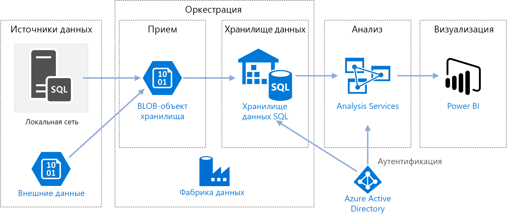
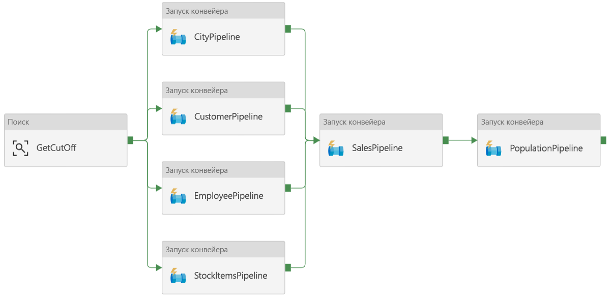
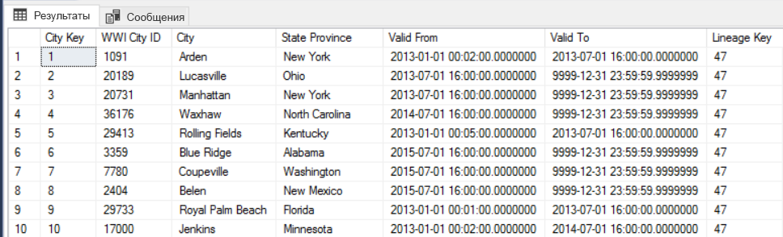
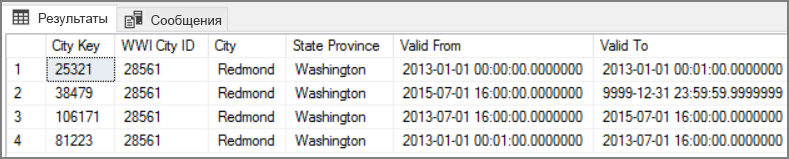

# <a name="automated-enterprise-bi-with-sql-data-warehouse-and-azure-data-factory"></a><span data-ttu-id="b8936-103">Автоматизированная корпоративная бизнес-аналитика с использованием Хранилища данных SQL и Фабрики данных Azure</span><span class="sxs-lookup"><span data-stu-id="b8936-103">Automated enterprise BI with SQL Data Warehouse and Azure Data Factory</span></span>

<span data-ttu-id="b8936-104">На примере этой эталонной архитектуры показано, как выполнять добавочную нагрузку в конвейере [извлечения, загрузки и преобразования (ELT)](../../data-guide/relational-data/etl.md#extract-load-and-transform-elt).</span><span class="sxs-lookup"><span data-stu-id="b8936-104">This reference architecture shows how to perform incremental loading in an [extract, load, and transform (ELT)](../../data-guide/relational-data/etl.md#extract-load-and-transform-elt) pipeline.</span></span> <span data-ttu-id="b8936-105">Для автоматизации этого конвейера используется Фабрика данных Azure.</span><span class="sxs-lookup"><span data-stu-id="b8936-105">It uses Azure Data Factory to automate the ELT pipeline.</span></span> <span data-ttu-id="b8936-106">Конвейер поэтапно перемещает последние данные OLTP из локальной базы данных SQL Server в Хранилище данных SQL.</span><span class="sxs-lookup"><span data-stu-id="b8936-106">The pipeline incrementally moves the latest OLTP data from an on-premises SQL Server database into SQL Data Warehouse.</span></span> <span data-ttu-id="b8936-107">Данные о транзакциях преобразуются в табличную модель для анализа.</span><span class="sxs-lookup"><span data-stu-id="b8936-107">Transactional data is transformed into a tabular model for analysis.</span></span>

> [!VIDEO https://www.microsoft.com/en-us/videoplayer/embed/RE2Gnz2]

<span data-ttu-id="b8936-108">Эталонную реализацию для этой архитектуры можно найти на сайте [GitHub][github].</span><span class="sxs-lookup"><span data-stu-id="b8936-108">A reference implementation for this architecture is available on [GitHub][github].</span></span>



<span data-ttu-id="b8936-110">Эта архитектура создана на основе архитектуры, описанной в статье [Корпоративная бизнес-аналитика с использованием хранилища данных SQL](./enterprise-bi-sqldw.md), но с некоторыми дополнительными функциями, требуемыми для хранения корпоративных данных.</span><span class="sxs-lookup"><span data-stu-id="b8936-110">This architecture builds on the one shown in [Enterprise BI with SQL Data Warehouse](./enterprise-bi-sqldw.md), but adds some features that are important for enterprise data warehousing scenarios.</span></span>

- <span data-ttu-id="b8936-111">Автоматизация конвейера с помощью Фабрики данных.</span><span class="sxs-lookup"><span data-stu-id="b8936-111">Automation of the pipeline using Data Factory.</span></span>
- <span data-ttu-id="b8936-112">Добавочная загрузка.</span><span class="sxs-lookup"><span data-stu-id="b8936-112">Incremental loading.</span></span>
- <span data-ttu-id="b8936-113">Интеграция нескольких источников данных.</span><span class="sxs-lookup"><span data-stu-id="b8936-113">Integrating multiple data sources.</span></span>
- <span data-ttu-id="b8936-114">Загрузка таких двоичных данных, как геопространственные данные и изображения.</span><span class="sxs-lookup"><span data-stu-id="b8936-114">Loading binary data such as geospatial data and images.</span></span>

## <a name="architecture"></a><span data-ttu-id="b8936-115">Архитектура</span><span class="sxs-lookup"><span data-stu-id="b8936-115">Architecture</span></span>

<span data-ttu-id="b8936-116">Архитектура состоит из следующих компонентов:</span><span class="sxs-lookup"><span data-stu-id="b8936-116">The architecture consists of the following components.</span></span>

### <a name="data-sources"></a><span data-ttu-id="b8936-117">Источники данных</span><span class="sxs-lookup"><span data-stu-id="b8936-117">Data sources</span></span>

<span data-ttu-id="b8936-118">**Локальный сервер SQL Server**.</span><span class="sxs-lookup"><span data-stu-id="b8936-118">**On-premises SQL Server**.</span></span> <span data-ttu-id="b8936-119">Исходные данные размещаются локально в базе данных SQL Server.</span><span class="sxs-lookup"><span data-stu-id="b8936-119">The source data is located in a SQL Server database on premises.</span></span> <span data-ttu-id="b8936-120">Чтобы имитировать локальную среду, сценарии развертывания для этой архитектуры предоставляют виртуальную машину в Azure с установленным SQL Server.</span><span class="sxs-lookup"><span data-stu-id="b8936-120">To simulate the on-premises environment, the deployment scripts for this architecture provision a virtual machine in Azure with SQL Server installed.</span></span> <span data-ttu-id="b8936-121">В качестве базы данных-источника используется [пример базы данных OLTP Wide World Importers][wwi].</span><span class="sxs-lookup"><span data-stu-id="b8936-121">The [Wide World Importers OLTP sample database][wwi] is used as the source database.</span></span>

<span data-ttu-id="b8936-122">**Внешние данные**.</span><span class="sxs-lookup"><span data-stu-id="b8936-122">**External data**.</span></span> <span data-ttu-id="b8936-123">Распространенный сценарий для хранилищ данных — выполнение интеграции нескольких источников данных.</span><span class="sxs-lookup"><span data-stu-id="b8936-123">A common scenario for data warehouses is to integrate multiple data sources.</span></span> <span data-ttu-id="b8936-124">Для этой эталонной архитектуры загружается набор внешних данных о численности населения города по годам, интегрируемый с данными из базы данных OLTP.</span><span class="sxs-lookup"><span data-stu-id="b8936-124">This reference architecture loads an external data set that contains city populations by year, and integrates it with the data from the OLTP database.</span></span> <span data-ttu-id="b8936-125">Эта данные можно использовать для получения полезных сведений. Например, чтобы узнать, соответствуют ли показатели роста продаж в каждом регионе показателям роста населения или превышают их.</span><span class="sxs-lookup"><span data-stu-id="b8936-125">You can use this data for insights such as: "Does sales growth in each region match or exceed population growth?"</span></span>

### <a name="ingestion-and-data-storage"></a><span data-ttu-id="b8936-126">Прием и хранение данных</span><span class="sxs-lookup"><span data-stu-id="b8936-126">Ingestion and data storage</span></span>

<span data-ttu-id="b8936-127">**Хранилище больших двоичных объектов**.</span><span class="sxs-lookup"><span data-stu-id="b8936-127">**Blob Storage**.</span></span> <span data-ttu-id="b8936-128">Хранилище больших двоичных объектов используется в качестве промежуточной области для исходных данных перед их загрузкой в Хранилище данных SQL.</span><span class="sxs-lookup"><span data-stu-id="b8936-128">Blob storage is used as a staging area for the source data before loading it into SQL Data Warehouse.</span></span>

<span data-ttu-id="b8936-129">**Хранилище данных Azure SQL.**</span><span class="sxs-lookup"><span data-stu-id="b8936-129">**Azure SQL Data Warehouse**.</span></span> <span data-ttu-id="b8936-130">[Хранилище данных SQL](/azure/sql-data-warehouse/) — распределенная система, предназначенная для анализа больших объемов данных.</span><span class="sxs-lookup"><span data-stu-id="b8936-130">[SQL Data Warehouse](/azure/sql-data-warehouse/) is a distributed system designed to perform analytics on large data.</span></span> <span data-ttu-id="b8936-131">Она поддерживает массовую параллельную обработку (MPP), что делает ее пригодной для запуска высокопроизводительной аналитики.</span><span class="sxs-lookup"><span data-stu-id="b8936-131">It supports massive parallel processing (MPP), which makes it suitable for running high-performance analytics.</span></span>

<span data-ttu-id="b8936-132">**Фабрика данных Azure**.</span><span class="sxs-lookup"><span data-stu-id="b8936-132">**Azure Data Factory**.</span></span> <span data-ttu-id="b8936-133">[Фабрика данных][adf] — это управляемая служба, которая координирует и автоматизирует перемещение и преобразование данных.</span><span class="sxs-lookup"><span data-stu-id="b8936-133">[Data Factory][adf] is a managed service that orchestrates and automates data movement and data transformation.</span></span> <span data-ttu-id="b8936-134">В этой архитектуре она координирует разные этапы процесса ELT.</span><span class="sxs-lookup"><span data-stu-id="b8936-134">In this architecture, it coordinates the various stages of the ELT process.</span></span>

### <a name="analysis-and-reporting"></a><span data-ttu-id="b8936-135">Анализ и создание отчетов</span><span class="sxs-lookup"><span data-stu-id="b8936-135">Analysis and reporting</span></span>

<span data-ttu-id="b8936-136">**Службы Azure Analysis Services**.</span><span class="sxs-lookup"><span data-stu-id="b8936-136">**Azure Analysis Services**.</span></span> <span data-ttu-id="b8936-137">[Analysis Services](/azure/analysis-services/) — полностью управляемая служба, которая предоставляет возможности моделирования данных.</span><span class="sxs-lookup"><span data-stu-id="b8936-137">[Analysis Services](/azure/analysis-services/) is a fully managed service that provides data modeling capabilities.</span></span> <span data-ttu-id="b8936-138">Семантическая модель загружается в службы Analysis Services.</span><span class="sxs-lookup"><span data-stu-id="b8936-138">The semantic model is loaded into Analysis Services.</span></span>

<span data-ttu-id="b8936-139">**Power BI**.</span><span class="sxs-lookup"><span data-stu-id="b8936-139">**Power BI**.</span></span> <span data-ttu-id="b8936-140">Power BI — набор средств бизнес-аналитики для анализа информации о бизнесе.</span><span class="sxs-lookup"><span data-stu-id="b8936-140">Power BI is a suite of business analytics tools to analyze data for business insights.</span></span> <span data-ttu-id="b8936-141">В этой архитектуре он запрашивает семантическую модель, хранящуюся в службе Analysis Services.</span><span class="sxs-lookup"><span data-stu-id="b8936-141">In this architecture, it queries the semantic model stored in Analysis Services.</span></span>

### <a name="authentication"></a><span data-ttu-id="b8936-142">Authentication</span><span class="sxs-lookup"><span data-stu-id="b8936-142">Authentication</span></span>

<span data-ttu-id="b8936-143">**Azure Active Directory** (Azure AD) аутентифицирует пользователей, которые подключаются к серверу Analysis Services через Power BI.</span><span class="sxs-lookup"><span data-stu-id="b8936-143">**Azure Active Directory** (Azure AD) authenticates users who connect to the Analysis Services server through Power BI.</span></span>

<span data-ttu-id="b8936-144">В Фабрике данных также можно использовать Azure AD для аутентификации в хранилище данных SQL с использованием субъекта-службы или Управляемого удостоверения службы (MSI).</span><span class="sxs-lookup"><span data-stu-id="b8936-144">Data Factory can use also use Azure AD to authenticate to SQL Data Warehouse, by using a service principal or Managed Service Identity (MSI).</span></span> <span data-ttu-id="b8936-145">Для простоты в примере развертывания используется аутентификация SQL Server.</span><span class="sxs-lookup"><span data-stu-id="b8936-145">For simplicity, the example deployment uses SQL Server authentication.</span></span>

## <a name="data-pipeline"></a><span data-ttu-id="b8936-146">Конвейер данных</span><span class="sxs-lookup"><span data-stu-id="b8936-146">Data pipeline</span></span>

<span data-ttu-id="b8936-147">Конвейер в [Фабрике данных Azure][adf] — это логическая группа действий, используемых для координации задачи (в нашем примере это загрузка и преобразование данных в Хранилище данных SQL).</span><span class="sxs-lookup"><span data-stu-id="b8936-147">In [Azure Data Factory][adf], a pipeline is a logical grouping of activities used to coordinate a task &mdash; in this case, loading and transforming data into SQL Data Warehouse.</span></span>

<span data-ttu-id="b8936-148">В этой эталонной архитектуре определяется основной конвейер, который запускает последовательность дочерних конвейеров.</span><span class="sxs-lookup"><span data-stu-id="b8936-148">This reference architecture defines a master pipeline that runs a sequence of child pipelines.</span></span> <span data-ttu-id="b8936-149">Каждый дочерний конвейер загружает данные в одну или несколько таблиц в хранилище данных.</span><span class="sxs-lookup"><span data-stu-id="b8936-149">Each child pipeline loads data into one or more data warehouse tables.</span></span>



## <a name="incremental-loading"></a><span data-ttu-id="b8936-151">Добавочная загрузка</span><span class="sxs-lookup"><span data-stu-id="b8936-151">Incremental loading</span></span>

<span data-ttu-id="b8936-152">При выполнении автоматизированного процесса ETL или ELT гораздо эффективнее загружать только те данные, которые изменились с момента предыдущего выполнения.</span><span class="sxs-lookup"><span data-stu-id="b8936-152">When you run an automated ETL or ELT process, it's most efficient to load only the data that changed since the previous run.</span></span> <span data-ttu-id="b8936-153">Это называется *добавочной загрузкой*. Этот процесс отличается от полной загрузки, при которой загружаются все данные.</span><span class="sxs-lookup"><span data-stu-id="b8936-153">This is called an *incremental load*, as opposed to a full load that loads all of the data.</span></span> <span data-ttu-id="b8936-154">Чтобы выполнить добавочную загрузку, нужно выбрать метод определения измененных данных.</span><span class="sxs-lookup"><span data-stu-id="b8936-154">To perform an incremental load, you need a way to identify which data has changed.</span></span> <span data-ttu-id="b8936-155">Для этого чаще всего используется значение *верхнего предела*. То есть отслеживается последнее значение в некотором столбце исходной таблицы, например по столбцу даты и времени или по столбцу уникальных целых чисел.</span><span class="sxs-lookup"><span data-stu-id="b8936-155">The most common approach is to use a *high water mark* value, which means tracking the latest value of some column in the source table, either a datetime column or a unique integer column.</span></span>

<span data-ttu-id="b8936-156">Начиная с версии SQL Server 2016, вы можете использовать [темпоральные таблицы](/sql/relational-databases/tables/temporal-tables).</span><span class="sxs-lookup"><span data-stu-id="b8936-156">Starting with SQL Server 2016, you can use [temporal tables](/sql/relational-databases/tables/temporal-tables).</span></span> <span data-ttu-id="b8936-157">Это таблицы с системным управлением версиями, в которых хранится полный журнал изменения данных.</span><span class="sxs-lookup"><span data-stu-id="b8936-157">These are system-versioned tables that keep a full history of data changes.</span></span> <span data-ttu-id="b8936-158">Ядро СУБД автоматически записывает каждое изменение в отдельную таблицу журнала.</span><span class="sxs-lookup"><span data-stu-id="b8936-158">The database engine automatically records the history of every change in a separate history table.</span></span> <span data-ttu-id="b8936-159">Чтобы запросить данные журнала, добавьте в запрос предложение FOR SYSTEM_TIME.</span><span class="sxs-lookup"><span data-stu-id="b8936-159">You can query the historical data by adding a FOR SYSTEM_TIME clause to a query.</span></span> <span data-ttu-id="b8936-160">На внутреннем уровне ядро СУБД отправляет запрос к таблице журнала, но это происходит незаметно для приложения.</span><span class="sxs-lookup"><span data-stu-id="b8936-160">Internally, the database engine queries the history table, but this is transparent to the application.</span></span>

> [!NOTE]
> <span data-ttu-id="b8936-161">Для более ранних версий SQL Server можно использовать функцию [отслеживания измененных данных](/sql/relational-databases/track-changes/about-change-data-capture-sql-server) (CDC).</span><span class="sxs-lookup"><span data-stu-id="b8936-161">For earlier versions of SQL Server, you can use [Change Data Capture](/sql/relational-databases/track-changes/about-change-data-capture-sql-server) (CDC).</span></span> <span data-ttu-id="b8936-162">Этот метод не такой удобный, как темпоральные таблицы, так как вам нужно запросить отдельную таблицу изменений, и изменения отслеживаются по регистрационному номеру транзакции (LSN) в журнале, а не по метке времени.</span><span class="sxs-lookup"><span data-stu-id="b8936-162">This approach is less convenient than temporal tables, because you have to query a separate change table, and changes are tracked by a log sequence number, rather than a timestamp.</span></span>
>

<span data-ttu-id="b8936-163">Темпоральные таблицы удобно использовать для данных измерений, которые могут изменяться со временем.</span><span class="sxs-lookup"><span data-stu-id="b8936-163">Temporal tables are useful for dimension data, which can change over time.</span></span> <span data-ttu-id="b8936-164">В таблице фактов обычно представлены неизменяемые транзакции, например при продаже. В этом случае ведение журнала версий системы не имеет смысла.</span><span class="sxs-lookup"><span data-stu-id="b8936-164">Fact tables usually represent an immutable transaction such as a sale, in which case keeping the system version history doesn't make sense.</span></span> <span data-ttu-id="b8936-165">Вместо этого для транзакций обычно присутствует столбец, в котором представлена дата транзакции, что может использоваться в качестве значения верхнего предела.</span><span class="sxs-lookup"><span data-stu-id="b8936-165">Instead, transactions usually have a column that represents the transaction date, which can be used as the watermark value.</span></span> <span data-ttu-id="b8936-166">Например, в базе данных OLTP Wide World Importers таблицы Sales.Invoices и Sales.InvoiceLines имеют поле `LastEditedWhen` со значением по умолчанию `sysdatetime()`.</span><span class="sxs-lookup"><span data-stu-id="b8936-166">For example, in the Wide World Importers OLTP database, the Sales.Invoices and Sales.InvoiceLines tables have a `LastEditedWhen` field that defaults to `sysdatetime()`.</span></span>

<span data-ttu-id="b8936-167">Ниже приведена стандартная последовательность действий для конвейера ELT:</span><span class="sxs-lookup"><span data-stu-id="b8936-167">Here is the general flow for the ELT pipeline:</span></span>

1. <span data-ttu-id="b8936-168">Для каждой таблицы базы данных-источника отслеживается пороговое значение времени, когда запускается последнее задание ELT.</span><span class="sxs-lookup"><span data-stu-id="b8936-168">For each table in the source database, track the cutoff time when the last ELT job ran.</span></span> <span data-ttu-id="b8936-169">Сохраните эту информацию в хранилище данных.</span><span class="sxs-lookup"><span data-stu-id="b8936-169">Store this information in the data warehouse.</span></span> <span data-ttu-id="b8936-170">(При начальной настройке для всех значений времени указано 1-1-1900.)</span><span class="sxs-lookup"><span data-stu-id="b8936-170">(On initial setup, all times are set to '1-1-1900'.)</span></span>

2. <span data-ttu-id="b8936-171">На этапе экспорта данных пороговое значение времени передается в качестве параметра в набор хранимых процедур в базе данных-источника.</span><span class="sxs-lookup"><span data-stu-id="b8936-171">During the data export step, the cutoff time is passed as a parameter to a set of stored procedures in the source database.</span></span> <span data-ttu-id="b8936-172">Эти хранимые процедуры запрашивают любые записи, которые были изменены или созданы после этого значения времени.</span><span class="sxs-lookup"><span data-stu-id="b8936-172">These stored procedures query for any records that were changed or created after the cutoff time.</span></span> <span data-ttu-id="b8936-173">Для таблицы фактов Sales используется столбец `LastEditedWhen`.</span><span class="sxs-lookup"><span data-stu-id="b8936-173">For the Sales fact table, the `LastEditedWhen` column is used.</span></span> <span data-ttu-id="b8936-174">Для данных измерения используются темпоральные таблицы с системным управлением версиями.</span><span class="sxs-lookup"><span data-stu-id="b8936-174">For the dimension data, system-versioned temporal tables are used.</span></span>

3. <span data-ttu-id="b8936-175">Когда перенос данных завершится, обновите таблицу, в которой хранятся пороговые значения времени.</span><span class="sxs-lookup"><span data-stu-id="b8936-175">When the data migration is complete, update the table that stores the cutoff times.</span></span>

<span data-ttu-id="b8936-176">Также полезно вести *журнал преобразований* для каждого выполнения ELT.</span><span class="sxs-lookup"><span data-stu-id="b8936-176">It's also useful to record a *lineage* for each ELT run.</span></span> <span data-ttu-id="b8936-177">В таком журнале определенная запись связывается с выполнением ELT, при котором создаются данные.</span><span class="sxs-lookup"><span data-stu-id="b8936-177">For a given record, the lineage associates that record with the ELT run that produced the data.</span></span> <span data-ttu-id="b8936-178">При каждом выполнении ETL создается запись журнала преобразований для каждой таблицы. В этой записи указано время начала и завершения загрузки.</span><span class="sxs-lookup"><span data-stu-id="b8936-178">For each ETL run, a new lineage record is created for every table, showing the starting and ending load times.</span></span> <span data-ttu-id="b8936-179">Ключи для каждой записи журнала преобразований хранятся в таблицах фактов и измерений.</span><span class="sxs-lookup"><span data-stu-id="b8936-179">The lineage keys for each record are stored in the dimension and fact tables.</span></span>



<span data-ttu-id="b8936-181">Когда новый пакет данных загрузится в хранилище, обновите табличную модель служб Analysis Services.</span><span class="sxs-lookup"><span data-stu-id="b8936-181">After a new batch of data is loaded into the warehouse, refresh the Analysis Services tabular model.</span></span> <span data-ttu-id="b8936-182">Дополнительные сведения см. в статье [Асинхронное обновление с помощью REST API](/azure/analysis-services/analysis-services-async-refresh).</span><span class="sxs-lookup"><span data-stu-id="b8936-182">See [Asynchronous refresh with the REST API](/azure/analysis-services/analysis-services-async-refresh).</span></span>

## <a name="data-cleansing"></a><span data-ttu-id="b8936-183">Очистка данных</span><span class="sxs-lookup"><span data-stu-id="b8936-183">Data cleansing</span></span>

<span data-ttu-id="b8936-184">Очистка данных должна выполняться в рамках процесса ELT.</span><span class="sxs-lookup"><span data-stu-id="b8936-184">Data cleansing should be part of the ELT process.</span></span> <span data-ttu-id="b8936-185">В этой эталонной архитектуре есть один источник с поврежденными данными — таблица численности населения по городам, где некоторые города имеют нулевое значение, возможно, из-за недоступности данных.</span><span class="sxs-lookup"><span data-stu-id="b8936-185">In this reference architecture, one source of bad data is the city population table, where some cities have zero population, perhaps because no data was available.</span></span> <span data-ttu-id="b8936-186">Во время обработки в конвейере ELT такие города удаляются из таблицы численности населения по городам.</span><span class="sxs-lookup"><span data-stu-id="b8936-186">During processing, the ELT pipeline removes those cities from the city population table.</span></span> <span data-ttu-id="b8936-187">Очистку данных следует выполнять с промежуточными таблицами, а не внешними.</span><span class="sxs-lookup"><span data-stu-id="b8936-187">Perform data cleansing on staging tables, rather than external tables.</span></span>

<span data-ttu-id="b8936-188">Ниже приводится хранимая процедура, которая удаляет города с нулевым значением численности населения из соответствующей таблицы.</span><span class="sxs-lookup"><span data-stu-id="b8936-188">Here is the stored procedure that removes the cities with zero population from the City Population table.</span></span> <span data-ttu-id="b8936-189">(Исходный файл можно найти [здесь](https://github.com/mspnp/reference-architectures/blob/master/data/enterprise_bi_sqldw_advanced/azure/sqldw_scripts/citypopulation/%5BIntegration%5D.%5BMigrateExternalCityPopulationData%5D.sql).)</span><span class="sxs-lookup"><span data-stu-id="b8936-189">(You can find the source file [here](https://github.com/mspnp/reference-architectures/blob/master/data/enterprise_bi_sqldw_advanced/azure/sqldw_scripts/citypopulation/%5BIntegration%5D.%5BMigrateExternalCityPopulationData%5D.sql).)</span></span>

```sql
DELETE FROM [Integration].[CityPopulation_Staging]
WHERE RowNumber in (SELECT DISTINCT RowNumber
FROM [Integration].[CityPopulation_Staging]
WHERE POPULATION = 0
GROUP BY RowNumber
HAVING COUNT(RowNumber) = 4)
```

## <a name="external-data-sources"></a><span data-ttu-id="b8936-190">Внешние источники данных</span><span class="sxs-lookup"><span data-stu-id="b8936-190">External data sources</span></span>

<span data-ttu-id="b8936-191">В хранилищах часто объединяются данные из нескольких источников.</span><span class="sxs-lookup"><span data-stu-id="b8936-191">Data warehouses often consolidate data from multiple sources.</span></span> <span data-ttu-id="b8936-192">Эта эталонная архитектура позволяет загрузить внешний источник данных, содержащий демографические данные.</span><span class="sxs-lookup"><span data-stu-id="b8936-192">This reference architecture loads an external data source that contains demographics data.</span></span> <span data-ttu-id="b8936-193">Этот набор данных доступен в хранилище BLOB-объектов Azure как часть примера [WorldWideImportersDW](https://github.com/Microsoft/sql-server-samples/tree/master/samples/databases/wide-world-importers/sample-scripts/polybase).</span><span class="sxs-lookup"><span data-stu-id="b8936-193">This dataset is available in Azure blob storage as part of the [WorldWideImportersDW](https://github.com/Microsoft/sql-server-samples/tree/master/samples/databases/wide-world-importers/sample-scripts/polybase) sample.</span></span>

<span data-ttu-id="b8936-194">В Фабрике данных Azure можно копировать данные прямо из хранилища BLOB-объектов с помощью [соответствующего соединителя](/azure/data-factory/connector-azure-blob-storage).</span><span class="sxs-lookup"><span data-stu-id="b8936-194">Azure Data Factory can copy directly from blob storage, using the [blob storage connector](/azure/data-factory/connector-azure-blob-storage).</span></span> <span data-ttu-id="b8936-195">Но соединителю требуется строка подключения или подписанный URL-адрес, поэтому вы не сможете использовать соединитель для копирования BLOB-объекта с общим доступом на чтение.</span><span class="sxs-lookup"><span data-stu-id="b8936-195">However, the connector requires a connection string or a shared access signature, so it can't be used to copy a blob with public read access.</span></span> <span data-ttu-id="b8936-196">В качестве решения с помощью PolyBase создайте внешнюю таблицу в хранилище BLOB-объектов и скопируйте внешние таблицы в Хранилище данных SQL.</span><span class="sxs-lookup"><span data-stu-id="b8936-196">As a workaround, you can use PolyBase to create an external table over Blob storage and then copy the external tables into SQL Data Warehouse.</span></span>

## <a name="handling-large-binary-data"></a><span data-ttu-id="b8936-197">Обработка больших двоичных данных</span><span class="sxs-lookup"><span data-stu-id="b8936-197">Handling large binary data</span></span>

<span data-ttu-id="b8936-198">В базе данных-источника таблица Cities содержит столбец Location, в котором представлены данные пространственного типа — [geography](/sql/t-sql/spatial-geography/spatial-types-geography).</span><span class="sxs-lookup"><span data-stu-id="b8936-198">In the source database, the Cities table has a Location column that holds a [geography](/sql/t-sql/spatial-geography/spatial-types-geography) spatial data type.</span></span> <span data-ttu-id="b8936-199">Хранилище данных SQL изначально не поддерживает тип данных **geography**, поэтому при загрузке такие поля преобразуются в тип **varbinary**.</span><span class="sxs-lookup"><span data-stu-id="b8936-199">SQL Data Warehouse doesn't support the **geography** type natively, so this field is converted to a **varbinary** type during loading.</span></span> <span data-ttu-id="b8936-200">Дополнительные сведения см. в разделе [Обходные решения для неподдерживаемых типов данных](/azure/sql-data-warehouse/sql-data-warehouse-tables-data-types#unsupported-data-types).</span><span class="sxs-lookup"><span data-stu-id="b8936-200">(See [Workarounds for unsupported data types](/azure/sql-data-warehouse/sql-data-warehouse-tables-data-types#unsupported-data-types).)</span></span>

<span data-ttu-id="b8936-201">Но в PolyBase размер столбца не должен превышать значение `varbinary(8000)`. Это означает, что некоторые данные могут быть усечены.</span><span class="sxs-lookup"><span data-stu-id="b8936-201">However, PolyBase supports a maximum column size of `varbinary(8000)`, which means some data could be truncated.</span></span> <span data-ttu-id="b8936-202">Чтобы решить эту проблему, вы можете разбить данные на блоки во время экспорта, а затем воссоединить их, как описано ниже:</span><span class="sxs-lookup"><span data-stu-id="b8936-202">A workaround for this problem is to break the data up into chunks during export, and then reassemble the chunks, as follows:</span></span>

1. <span data-ttu-id="b8936-203">Создайте временную промежуточную таблицу для столбца Location.</span><span class="sxs-lookup"><span data-stu-id="b8936-203">Create a temporary staging table for the Location column.</span></span>

2. <span data-ttu-id="b8936-204">Для каждого города разбейте данные расположения на блоки объемом 8000 байт. В результате для каждого города будет создано 1 &ndash; N строк.</span><span class="sxs-lookup"><span data-stu-id="b8936-204">For each city, split the location data into 8000-byte chunks, resulting in 1 &ndash; N rows for each city.</span></span>

3. <span data-ttu-id="b8936-205">Чтобы воссоединить эти блоки, с помощью оператора T-SQL [PIVOT](/sql/t-sql/queries/from-using-pivot-and-unpivot) преобразуйте строки в столбцы, а затем сцепите значения столбцов для каждого города.</span><span class="sxs-lookup"><span data-stu-id="b8936-205">To reassemble the chunks, use the T-SQL [PIVOT](/sql/t-sql/queries/from-using-pivot-and-unpivot) operator to convert rows into columns and then concatenate the column values for each city.</span></span>

<span data-ttu-id="b8936-206">Сложность состоит в том, что для каждого города будет разное количество строк, в зависимости от размера географических данных.</span><span class="sxs-lookup"><span data-stu-id="b8936-206">The challenge is that each city will be split into a different number of rows, depending on the size of geography data.</span></span> <span data-ttu-id="b8936-207">Для использования оператора PIVOT необходимо, чтобы у каждого города было одинаковое количество строк.</span><span class="sxs-lookup"><span data-stu-id="b8936-207">For the PIVOT operator to work, every city must have the same number of rows.</span></span> <span data-ttu-id="b8936-208">Для этого запрос T-SQL (сведения о нем см. [здесь][MergeLocation]) выполняет некоторые приемы, чтобы включить строки с пустыми значениями, обеспечивая одинаковое количество столбцов для каждого города после сведения.</span><span class="sxs-lookup"><span data-stu-id="b8936-208">To make this work, the T-SQL query (which you can view [here][MergeLocation]) does some tricks to pad out the rows with blank values, so that every city has the same number of columns after the pivot.</span></span> <span data-ttu-id="b8936-209">Результирующий запрос выполняется намного быстрее, чем последовательный циклический перебор каждой строки.</span><span class="sxs-lookup"><span data-stu-id="b8936-209">The resulting query turns out to be much faster than looping through the rows one at a time.</span></span>

<span data-ttu-id="b8936-210">Такой же подход используется для данных изображений.</span><span class="sxs-lookup"><span data-stu-id="b8936-210">The same approach is used for image data.</span></span>

## <a name="slowly-changing-dimensions"></a><span data-ttu-id="b8936-211">Медленно изменяющиеся измерения</span><span class="sxs-lookup"><span data-stu-id="b8936-211">Slowly changing dimensions</span></span>

<span data-ttu-id="b8936-212">Данные измерений являются относительно статичными, но могут изменяться.</span><span class="sxs-lookup"><span data-stu-id="b8936-212">Dimension data is relatively static, but it can change.</span></span> <span data-ttu-id="b8936-213">Например, продукт может быть переназначен другой категории продуктов.</span><span class="sxs-lookup"><span data-stu-id="b8936-213">For example, a product might get reassigned to a different product category.</span></span> <span data-ttu-id="b8936-214">Медленно изменяющиеся измерения можно обрабатывать несколькими способами.</span><span class="sxs-lookup"><span data-stu-id="b8936-214">There are several approaches to handling slowly changing dimensions.</span></span> <span data-ttu-id="b8936-215">Для этого чаще всего используется [тип 2](https://wikipedia.org/wiki/Slowly_changing_dimension#Type_2:_add_new_row), который позволяет добавлять новую запись при каждом изменении измерения.</span><span class="sxs-lookup"><span data-stu-id="b8936-215">A common technique, called [Type 2](https://wikipedia.org/wiki/Slowly_changing_dimension#Type_2:_add_new_row), is to add a new record whenever a dimension changes.</span></span>

<span data-ttu-id="b8936-216">Чтобы реализовать такой метод, в таблицу измерений нужно добавить столбцы, которые определяют фактический диапазон дат для определенной записи.</span><span class="sxs-lookup"><span data-stu-id="b8936-216">In order to implement the Type 2 approach, dimension tables need additional columns that specify the effective date range for a given record.</span></span> <span data-ttu-id="b8936-217">Кроме того, нужно продублировать первичные ключи из базы данных-источника, чтобы таблица измерений содержала смоделированные первичные ключи.</span><span class="sxs-lookup"><span data-stu-id="b8936-217">Also, primary keys from the source database will be duplicated, so the dimension table must have an artificial primary key.</span></span>

<span data-ttu-id="b8936-218">На изображении ниже показана таблица Dimension.City.</span><span class="sxs-lookup"><span data-stu-id="b8936-218">The following image shows the Dimension.City table.</span></span> <span data-ttu-id="b8936-219">В столбце `WWI City ID` представлены первичные ключи из базы данных-источника.</span><span class="sxs-lookup"><span data-stu-id="b8936-219">The `WWI City ID` column is the primary key from the source database.</span></span> <span data-ttu-id="b8936-220">А в столбце `City Key` содержатся смоделированные ключи, созданные при выполнении конвейера ETL.</span><span class="sxs-lookup"><span data-stu-id="b8936-220">The `City Key` column is an artificial key generated during the ETL pipeline.</span></span> <span data-ttu-id="b8936-221">Также обратите внимание, что в таблице есть столбцы `Valid From` и `Valid To`, которые определяют период, в который строка была актуальна.</span><span class="sxs-lookup"><span data-stu-id="b8936-221">Also notice that the table has `Valid From` and `Valid To` columns, which define the range when each row was valid.</span></span> <span data-ttu-id="b8936-222">Текущие значения в столбце `Valid To` равны 9999-12-31.</span><span class="sxs-lookup"><span data-stu-id="b8936-222">Current values have a `Valid To` equal to '9999-12-31'.</span></span>


<span data-ttu-id="b8936-224">Преимущество такого подхода заключается в том, что он позволяет хранить данные журнала, которые могут пригодиться для анализа.</span><span class="sxs-lookup"><span data-stu-id="b8936-224">The advantage of this approach is that it preserves historical data, which can be valuable for analysis.</span></span> <span data-ttu-id="b8936-225">Но это также означает, что у одной сущности будет несколько строк.</span><span class="sxs-lookup"><span data-stu-id="b8936-225">However, it also means there will be multiple rows for the same entity.</span></span> <span data-ttu-id="b8936-226">Например, ниже показаны записи, для которых в столбце `WWI City ID` указано значение 28561:</span><span class="sxs-lookup"><span data-stu-id="b8936-226">For example, here are the records that match `WWI City ID` = 28561:</span></span>



<span data-ttu-id="b8936-228">Каждый факт Sales необходимо связать с одной строкой в таблице измерения City, соответствующей дате выставления счета.</span><span class="sxs-lookup"><span data-stu-id="b8936-228">For each Sales fact, you want to associate that fact with a single row in City dimension table, corresponding to the invoice date.</span></span> <span data-ttu-id="b8936-229">В рамках процесса ETL создайте дополнительный столбец.</span><span class="sxs-lookup"><span data-stu-id="b8936-229">As part of the ETL process, create an additional column that</span></span> 

<span data-ttu-id="b8936-230">Следующий запрос T-SQL создает временную таблицу, связывающую каждый счет с правильным ключом в столбце City Key таблицы измерений City.</span><span class="sxs-lookup"><span data-stu-id="b8936-230">The following T-SQL query creates a temporary table that associates each invoice with the correct City Key from the City dimension table.</span></span>

```sql
CREATE TABLE CityHolder
WITH (HEAP , DISTRIBUTION = HASH([WWI Invoice ID]))
AS
SELECT DISTINCT s1.[WWI Invoice ID] AS [WWI Invoice ID],
                c.[City Key] AS [City Key]
    FROM [Integration].[Sale_Staging] s1
    CROSS APPLY (
                SELECT TOP 1 [City Key]
                    FROM [Dimension].[City]
                WHERE [WWI City ID] = s1.[WWI City ID]
                    AND s1.[Last Modified When] > [Valid From]
                    AND s1.[Last Modified When] <= [Valid To]
                ORDER BY [Valid From], [City Key] DESC
                ) c

```

<span data-ttu-id="b8936-231">Эта таблица используется для заполнения столбца в таблице фактов Sales:</span><span class="sxs-lookup"><span data-stu-id="b8936-231">This table is used to populate a column in the Sales fact table:</span></span>

```sql
UPDATE [Integration].[Sale_Staging]
SET [Integration].[Sale_Staging].[WWI Customer ID] =  CustomerHolder.[WWI Customer ID]
```

<span data-ttu-id="b8936-232">Этот столбец позволяет с помощью запроса Power BI найти нужную запись в таблице City для заданного счета на продажу.</span><span class="sxs-lookup"><span data-stu-id="b8936-232">This column enables a Power BI query to find the correct City record for a given sales invoice.</span></span>

## <a name="security-considerations"></a><span data-ttu-id="b8936-233">Вопросы безопасности</span><span class="sxs-lookup"><span data-stu-id="b8936-233">Security considerations</span></span>

<span data-ttu-id="b8936-234">Чтобы обеспечить дополнительную защиту ресурсов служб Azure только в своей виртуальной сети, используйте [конечные точки виртуальной сети](/azure/virtual-network/virtual-network-service-endpoints-overview).</span><span class="sxs-lookup"><span data-stu-id="b8936-234">For additional security, you can use [Virtual Network service endpoints](/azure/virtual-network/virtual-network-service-endpoints-overview) to secure Azure service resources to only your virtual network.</span></span> <span data-ttu-id="b8936-235">Это позволит полностью исключить открытый доступ из Интернета к этим ресурсам и разрешить трафик только из виртуальной сети.</span><span class="sxs-lookup"><span data-stu-id="b8936-235">This fully removes public Internet access to those resources, allowing traffic only from your virtual network.</span></span>

<span data-ttu-id="b8936-236">В этом случае вам нужно создать виртуальную сеть в Azure и частные конечные точки для служб Azure.</span><span class="sxs-lookup"><span data-stu-id="b8936-236">With this approach, you create a VNet in Azure and then create private service endpoints for Azure services.</span></span> <span data-ttu-id="b8936-237">В такие службы трафик будет поступать только из виртуальной сети.</span><span class="sxs-lookup"><span data-stu-id="b8936-237">Those services are then restricted to traffic from that virtual network.</span></span> <span data-ttu-id="b8936-238">Доступ к таким службам можно также получить в локальной сети через шлюз.</span><span class="sxs-lookup"><span data-stu-id="b8936-238">You can also reach them from your on-premises network through a gateway.</span></span>

<span data-ttu-id="b8936-239">Следует учитывать следующие ограничения.</span><span class="sxs-lookup"><span data-stu-id="b8936-239">Be aware of the following limitations:</span></span>

- <span data-ttu-id="b8936-240">На момент создания этой эталонной архитектуры конечные точки службы поддерживались для службы хранилища Azure и Хранилища данных SQL Azure, но не для служб Azure Analysis Services.</span><span class="sxs-lookup"><span data-stu-id="b8936-240">At the time this reference architecture was created, VNet service endpoints are supported for Azure Storage and Azure SQL Data Warehouse, but not for Azure Analysis Service.</span></span> <span data-ttu-id="b8936-241">Последние сведения о состоянии поддержки см. [здесь](https://azure.microsoft.com/updates/?product=virtual-network).</span><span class="sxs-lookup"><span data-stu-id="b8936-241">Check the latest status [here](https://azure.microsoft.com/updates/?product=virtual-network).</span></span>

- <span data-ttu-id="b8936-242">Если для службы хранилища Azure включены конечные точки службы, PolyBase не сможет скопировать данные из службы хранилища в хранилище данных SQL.</span><span class="sxs-lookup"><span data-stu-id="b8936-242">If service endpoints are enabled for Azure Storage, PolyBase cannot copy data from Storage into SQL Data Warehouse.</span></span> <span data-ttu-id="b8936-243">Эту проблему можно устранить.</span><span class="sxs-lookup"><span data-stu-id="b8936-243">There is a mitigation for this issue.</span></span> <span data-ttu-id="b8936-244">Дополнительные сведения см. в разделе [Влияние использования конечных точек службы виртуальной сети со службой хранилища Azure](/azure/sql-database/sql-database-vnet-service-endpoint-rule-overview?toc=%2fazure%2fvirtual-network%2ftoc.json#impact-of-using-vnet-service-endpoints-with-azure-storage).</span><span class="sxs-lookup"><span data-stu-id="b8936-244">For more information, see [Impact of using VNet Service Endpoints with Azure storage](/azure/sql-database/sql-database-vnet-service-endpoint-rule-overview?toc=%2fazure%2fvirtual-network%2ftoc.json#impact-of-using-vnet-service-endpoints-with-azure-storage).</span></span>

- <span data-ttu-id="b8936-245">Чтобы переместить данные из локального расположения в службу хранилища Azure, нужно добавить в список разрешений общедоступные IP-адреса из локальной среды или ExpressRoute.</span><span class="sxs-lookup"><span data-stu-id="b8936-245">To move data from on-premises into Azure Storage, you will need to whitelist public IP addresses from your on-premises or ExpressRoute.</span></span> <span data-ttu-id="b8936-246">Дополнительные сведения см. в разделе [Защита служб Azure в виртуальных сетях](/azure/virtual-network/virtual-network-service-endpoints-overview#securing-azure-services-to-virtual-networks).</span><span class="sxs-lookup"><span data-stu-id="b8936-246">For details, see [Securing Azure services to virtual networks](/azure/virtual-network/virtual-network-service-endpoints-overview#securing-azure-services-to-virtual-networks).</span></span>

- <span data-ttu-id="b8936-247">Чтобы службы Analysis Services могли считывать данные из хранилища данных SQL, разверните виртуальные машины Windows в виртуальной сети, которая содержит конечную точку службы "Хранилище данных SQL".</span><span class="sxs-lookup"><span data-stu-id="b8936-247">To enable Analysis Services to read data from SQL Data Warehouse, deploy a Windows VM to the virtual network that contains the SQL Data Warehouse service endpoint.</span></span> <span data-ttu-id="b8936-248">Установите в этой виртуальной машине [локальный шлюз данных Azure](/azure/analysis-services/analysis-services-gateway).</span><span class="sxs-lookup"><span data-stu-id="b8936-248">Install [Azure On-premises Data Gateway](/azure/analysis-services/analysis-services-gateway) on this VM.</span></span> <span data-ttu-id="b8936-249">Затем подключите службы Azure Analysis Services к этому шлюзу данных.</span><span class="sxs-lookup"><span data-stu-id="b8936-249">Then connect your Azure Analysis service to the data gateway.</span></span>

## <a name="deploy-the-solution"></a><span data-ttu-id="b8936-250">Развертывание решения</span><span class="sxs-lookup"><span data-stu-id="b8936-250">Deploy the solution</span></span>

<span data-ttu-id="b8936-251">Чтобы выполнить развертывание и запуск эталонной реализации, выполните действия, описанные в [файле сведений на GitHub][github].</span><span class="sxs-lookup"><span data-stu-id="b8936-251">To the deploy and run the reference implementation, follow the steps in the [GitHub readme][github].</span></span> <span data-ttu-id="b8936-252">Он позволяет развернуть следующее:</span><span class="sxs-lookup"><span data-stu-id="b8936-252">It deploys the following:</span></span>

- <span data-ttu-id="b8936-253">Виртуальную машину Windows для имитации локального сервера базы данных.</span><span class="sxs-lookup"><span data-stu-id="b8936-253">A Windows VM to simulate an on-premises database server.</span></span> <span data-ttu-id="b8936-254">Она включает SQL Server 2017 и связанные с ним инструменты, а также Power BI Desktop.</span><span class="sxs-lookup"><span data-stu-id="b8936-254">It includes SQL Server 2017 and related tools, along with Power BI Desktop.</span></span>
- <span data-ttu-id="b8936-255">Учетная запись хранения Azure, которая обеспечивает хранилище больших двоичных объектов для хранения данных, экспортированных из базы данных SQL Server.</span><span class="sxs-lookup"><span data-stu-id="b8936-255">An Azure storage account that provides Blob storage to hold data exported from the SQL Server database.</span></span>
- <span data-ttu-id="b8936-256">Экземпляр хранилища данных SQL Azure.</span><span class="sxs-lookup"><span data-stu-id="b8936-256">An Azure SQL Data Warehouse instance.</span></span>
- <span data-ttu-id="b8936-257">Экземпляр службы Azure Analysis Services.</span><span class="sxs-lookup"><span data-stu-id="b8936-257">An Azure Analysis Services instance.</span></span>
- <span data-ttu-id="b8936-258">Фабрику данных Azure и конвейер фабрики данных для задания ELT.</span><span class="sxs-lookup"><span data-stu-id="b8936-258">Azure Data Factory and the Data Factory pipeline for the ELT job.</span></span>

## <a name="related-resources"></a><span data-ttu-id="b8936-259">Связанные ресурсы</span><span class="sxs-lookup"><span data-stu-id="b8936-259">Related resources</span></span>

<span data-ttu-id="b8936-260">Вы можете просмотреть следующий [пример сценария Azure](/azure/architecture/example-scenario), в котором описываются конкретные решения, использующие некоторые из этих технологий:</span><span class="sxs-lookup"><span data-stu-id="b8936-260">You may want to review the following [Azure example scenarios](/azure/architecture/example-scenario) that demonstrate specific solutions using some of the same technologies:</span></span>

- [<span data-ttu-id="b8936-261">Решения по хранению и анализу данных для продаж и маркетинга</span><span class="sxs-lookup"><span data-stu-id="b8936-261">Data warehousing and analytics for sales and marketing</span></span>](/azure/architecture/example-scenario/data/data-warehouse)
- [<span data-ttu-id="b8936-262">Гибридное извлечение, преобразование и загрузка данных с помощью существующих локальных служб SSIS и Фабрики данных Azure</span><span class="sxs-lookup"><span data-stu-id="b8936-262">Hybrid ETL with existing on-premises SSIS and Azure Data Factory</span></span>](/azure/architecture/example-scenario/data/hybrid-etl-with-adf)

<!-- links -->

[adf]: /azure/data-factory
[github]: https://github.com/mspnp/azure-data-factory-sqldw-elt-pipeline
[MergeLocation]: https://github.com/mspnp/reference-architectures/blob/master/data/enterprise_bi_sqldw_advanced/azure/sqldw_scripts/city/%5BIntegration%5D.%5BMergeLocation%5D.sql
[wwi]: /sql/sample/world-wide-importers/wide-world-importers-oltp-database
