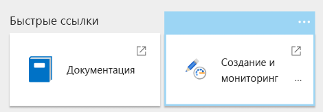
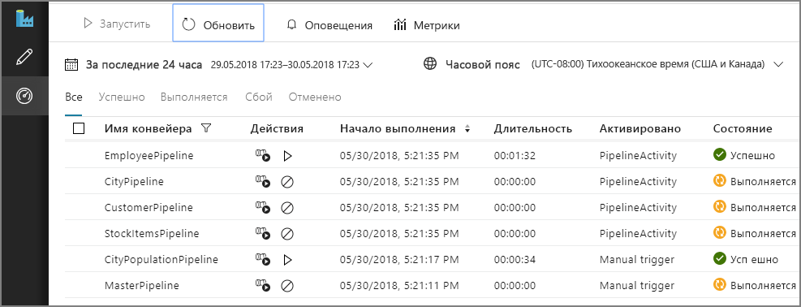
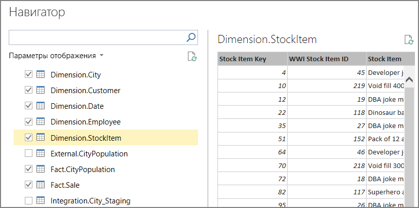
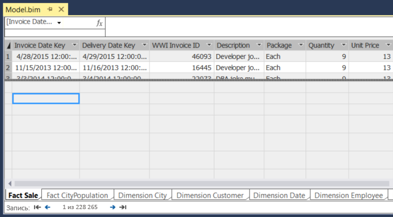
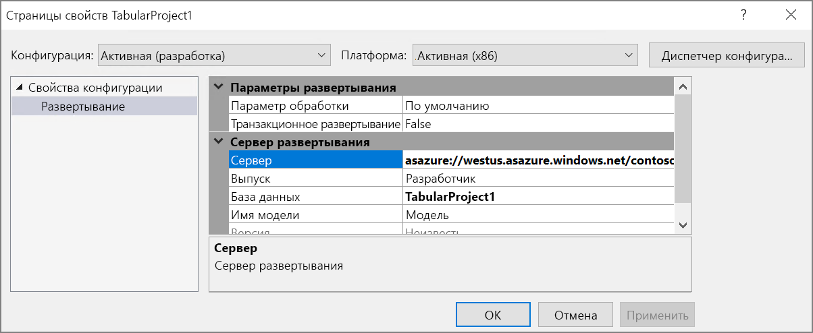
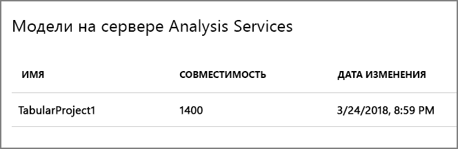
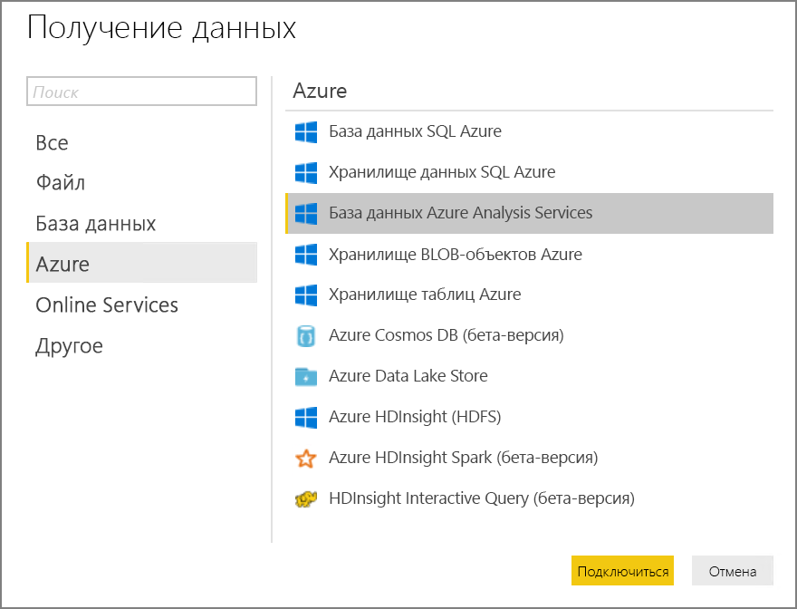
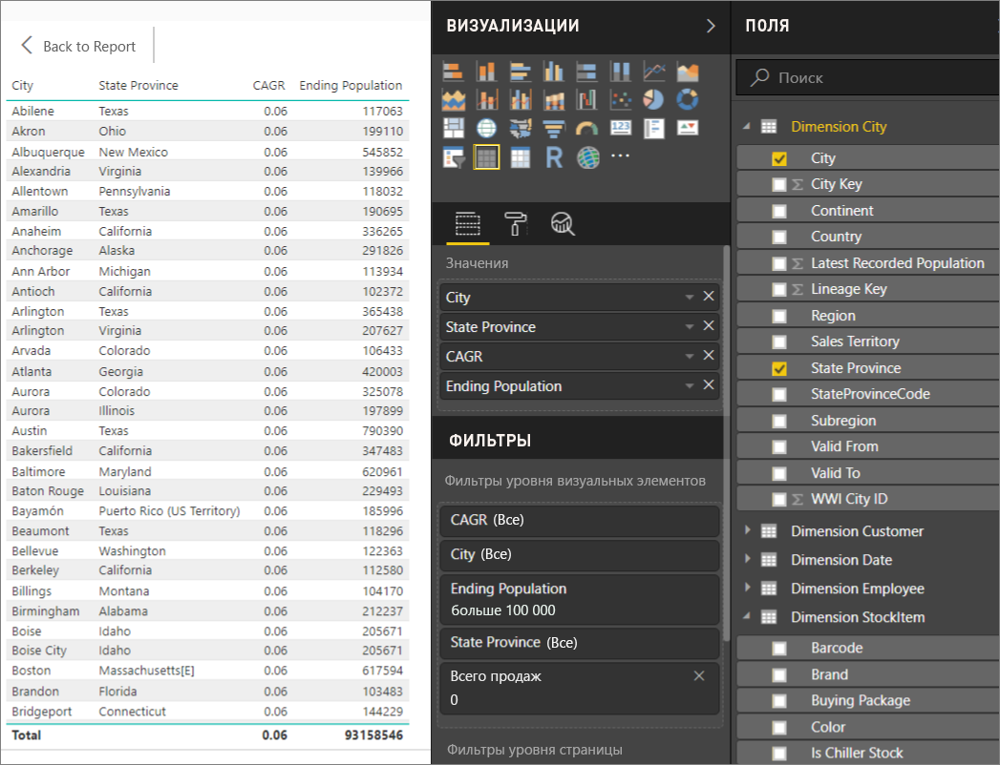

# <a name="automated-enterprise-bi-with-sql-data-warehouse-and-azure-data-factory"></a>Автоматизированная корпоративная бизнес-аналитика с использованием Хранилища данных SQL и Фабрики данных Azure

На примере этой эталонной архитектуры показано, как выполнять добавочную нагрузку в конвейере [ELT](../../data-guide/relational-data/etl.md#extract-load-and-transform-elt) (извлечение, загрузка и преобразование). Для автоматизации этого конвейера используется Фабрика данных Azure. Конвейер поэтапно перемещает последние данные OLTP из локальной базы данных SQL Server в Хранилище данных SQL. Данные о транзакциях преобразуются в табличную модель для анализа. [**Разверните это решение**.](#deploy-the-solution)


Эта архитектура создана на основе архитектуры, описанной в статье [Корпоративная бизнес-аналитика с использованием хранилища данных SQL](./enterprise-bi-sqldw.md), но с некоторыми дополнительными функциями, требуемыми для хранения корпоративных данных.

-   Автоматизация конвейера с помощью Фабрики данных.
-   Добавочная загрузка.
-   Интеграция нескольких источников данных.
-   Загрузка таких двоичных данных, как геопространственные данные и изображения.

## <a name="architecture"></a>Архитектура

Архитектура состоит из следующих компонентов:

### <a name="data-sources"></a>Источники данных

**Локальный сервер SQL Server**. Исходные данные размещаются локально в базе данных SQL Server. Чтобы имитировать локальную среду, сценарии развертывания для этой архитектуры предоставляют виртуальную машину в Azure с установленным SQL Server. В качестве базы данных-источника используется [пример базы данных OLTP Wide World Importers][WWI].

**Внешние данные**. Распространенный сценарий для хранилищ данных — выполнение интеграции нескольких источников данных. Для этой эталонной архитектуры загружается набор внешних данных о численности населения города по годам, интегрируемый с данными из базы данных OLTP. Эта данные можно использовать для получения полезных сведений. Например, чтобы узнать, соответствуют ли показатели роста продаж в каждом регионе показателям роста населения или превышают их.

### <a name="ingestion-and-data-storage"></a>Прием и хранение данных

**Хранилище больших двоичных объектов**. Хранилище больших двоичных объектов используется в качестве промежуточной области для исходных данных перед их загрузкой в Хранилище данных SQL.

**Хранилище данных Azure SQL.** [Хранилище данных SQL](/azure/sql-data-warehouse/) — распределенная система, предназначенная для анализа больших объемов данных. Она поддерживает массовую параллельную обработку (MPP), что делает ее пригодной для запуска высокопроизводительной аналитики. 

**Фабрика данных Azure**. [Фабрика данных][ADF] — это управляемая служба, которая координирует и автоматизирует перемещение и преобразование данных. В этой архитектуре она координирует разные этапы процесса ELT.

### <a name="analysis-and-reporting"></a>Анализ и создание отчетов

**Службы Azure Analysis Services**. [Analysis Services](/azure/analysis-services/) — полностью управляемая служба, которая предоставляет возможности моделирования данных. Семантическая модель загружается в службы Analysis Services.

**Power BI**. Power BI — набор средств бизнес-аналитики для анализа информации о бизнесе. В этой архитектуре он запрашивает семантическую модель, хранящуюся в службе Analysis Services.

### <a name="authentication"></a>Authentication

**Azure Active Directory** (Azure AD) аутентифицирует пользователей, которые подключаются к серверу Analysis Services через Power BI.

В Фабрике данных также можно использовать Azure AD для аутентификации в хранилище данных SQL с использованием субъекта-службы или Управляемого удостоверения службы (MSI). Для простоты в примере развертывания используется аутентификация SQL Server.

## <a name="data-pipeline"></a>Конвейер данных

Конвейер в [Фабрике данных Azure][ADF] — это логическая группа действий, используемых для координации задачи &mdash; в нашем примере с загрузкой и преобразованием данных в Хранилище данных SQL. 

В этой эталонной архитектуре определяется основной конвейер, который запускает последовательность дочерних конвейеров. Каждый дочерний конвейер загружает данные в одну или несколько таблиц в хранилище данных.


## <a name="incremental-loading"></a>Добавочная загрузка

При выполнении автоматизированного процесса ETL или ELT гораздо эффективнее загружать только те данные, которые изменились с момента предыдущего выполнения. Это называется *добавочной загрузкой*. Этот процесс отличается от полной загрузки, при которой загружаются все данные. Чтобы выполнить добавочную загрузку, нужно выбрать метод определения измененных данных. Для этого чаще всего используется значение *верхнего предела*. То есть отслеживается последнее значение в некотором столбце исходной таблицы, например по столбцу даты и времени или по столбцу уникальных целых чисел. 

Начиная с версии SQL Server 2016, вы можете использовать [темпоральные таблицы](/sql/relational-databases/tables/temporal-tables). Это таблицы с системным управлением версиями, в которых хранится полный журнал изменения данных. Ядро СУБД автоматически записывает каждое изменение в отдельную таблицу журнала. Чтобы запросить данные журнала, добавьте в запрос предложение FOR SYSTEM_TIME. На внутреннем уровне ядро СУБД отправляет запрос к таблице журнала, но это происходит незаметно для приложения. 

> [!NOTE]
> Для более ранних версий SQL Server можно использовать функцию [отслеживания измененных данных](/sql/relational-databases/track-changes/about-change-data-capture-sql-server) (CDC). Этот метод не такой удобный, как темпоральные таблицы, так как вам нужно запросить отдельную таблицу изменений, и изменения отслеживаются по регистрационному номеру транзакции (LSN) в журнале, а не по метке времени. 

Темпоральные таблицы удобно использовать для данных измерений, которые могут изменяться со временем. В таблице фактов обычно представлены неизменяемые транзакции, например при продаже. В этом случае ведение журнала версий системы не имеет смысла. Вместо этого для транзакций обычно присутствует столбец, в котором представлена дата транзакции, что может использоваться в качестве значения верхнего предела. Например, в базе данных OLTP Wide World Importers таблицы Sales.Invoices и Sales.InvoiceLines имеют поле `LastEditedWhen` со значением по умолчанию `sysdatetime()`. 

Ниже приведена стандартная последовательность действий для конвейера ELT:

1. Для каждой таблицы базы данных-источника отслеживается пороговое значение времени, когда запускается последнее задание ELT. Сохраните эту информацию в хранилище данных. (При начальной настройке для всех значений времени указано 1-1-1900.)

2. На этапе экспорта данных пороговое значение времени передается в качестве параметра в набор хранимых процедур в базе данных-источника. Эти хранимые процедуры запрашивают любые записи, которые были изменены или созданы после этого значения времени. Для таблицы фактов Sales используется столбец `LastEditedWhen`. Для данных измерения используются темпоральные таблицы с системным управлением версиями.

3. Когда перенос данных завершится, обновите таблицу, в которой хранятся пороговые значения времени.

Также полезно вести *журнал преобразований* для каждого выполнения ELT. В таком журнале определенная запись связывается с выполнением ELT, при котором создаются данные. При каждом выполнении ETL создается запись журнала преобразований для каждой таблицы. В этой записи указано время начала и завершения загрузки. Ключи для каждой записи журнала преобразований хранятся в таблицах фактов и измерений.


Когда новый пакет данных загрузится в хранилище, обновите табличную модель служб Analysis Services. Дополнительные сведения см. в статье [Асинхронное обновление с помощью REST API](/azure/analysis-services/analysis-services-async-refresh).

## <a name="data-cleansing"></a>Очистка данных

Очистка данных должна выполняться в рамках процесса ELT. В этой эталонной архитектуре есть один источник с поврежденными данными — таблица численности населения по городам, где некоторые города имеют нулевое значение, возможно, из-за недоступности данных. Во время обработки в конвейере ELT такие города удаляются из таблицы численности населения по городам. Очистку данных следует выполнять с промежуточными таблицами, а не внешними.

Ниже приводится хранимая процедура, которая удаляет города с нулевым значением численности населения из соответствующей таблицы. (Исходный файл можно найти [здесь](https://github.com/mspnp/reference-architectures/blob/master/data/enterprise_bi_sqldw_advanced/azure/sqldw_scripts/citypopulation/%5BIntegration%5D.%5BMigrateExternalCityPopulationData%5D.sql).) 

```sql
DELETE FROM [Integration].[CityPopulation_Staging]
WHERE RowNumber in (SELECT DISTINCT RowNumber
FROM [Integration].[CityPopulation_Staging]
WHERE POPULATION = 0
GROUP BY RowNumber
HAVING COUNT(RowNumber) = 4)
```

## <a name="external-data-sources"></a>Внешние источники данных

В хранилищах часто объединяются данные из нескольких источников. Эта эталонная архитектура позволяет загрузить внешний источник данных, содержащий демографические данные. Этот набор данных доступен в хранилище BLOB-объектов Azure как часть примера [WorldWideImportersDW](https://github.com/Microsoft/sql-server-samples/tree/master/samples/databases/wide-world-importers/sample-scripts/polybase).

В Фабрике данных Azure можно копировать данные прямо из хранилища BLOB-объектов с помощью [соответствующего соединителя](/azure/data-factory/connector-azure-blob-storage). Но соединителю требуется строка подключения или подписанный URL-адрес, поэтому вы не сможете использовать соединитель для копирования BLOB-объекта с общим доступом на чтение. В качестве решения с помощью PolyBase создайте внешнюю таблицу в хранилище BLOB-объектов и скопируйте внешние таблицы в Хранилище данных SQL. 

## <a name="handling-large-binary-data"></a>Обработка больших двоичных данных 

В базе данных-источника таблица Cities содержит столбец Location, в котором представлены данные пространственного типа — [geography](/sql/t-sql/spatial-geography/spatial-types-geography). Хранилище данных SQL изначально не поддерживает тип данных **geography**, поэтому при загрузке такие поля преобразуются в тип **varbinary**. Дополнительные сведения см. в разделе [Обходные решения для неподдерживаемых типов данных](/azure/sql-data-warehouse/sql-data-warehouse-tables-data-types#unsupported-data-types).

Но в PolyBase размер столбца не должен превышать значение `varbinary(8000)`. Это означает, что некоторые данные могут быть усечены. Чтобы решить эту проблему, вы можете разбить данные на блоки во время экспорта, а затем воссоединить их, как описано ниже:

1. Создайте временную промежуточную таблицу для столбца Location.

2. Для каждого города разбейте данные расположения на блоки объемом 8000 байт. В результате для каждого города будет создано 1 &ndash; N строк.

3. Чтобы воссоединить эти блоки, с помощью оператора T-SQL [PIVOT](/sql/t-sql/queries/from-using-pivot-and-unpivot) преобразуйте строки в столбцы, а затем сцепите значения столбцов для каждого города.

Сложность состоит в том, что для каждого города будет разное количество строк, в зависимости от размера географических данных. Для использования оператора PIVOT необходимо, чтобы у каждого города было одинаковое количество строк. Для этого запрос T-SQL (сведения о нем см. [здесь][MergeLocation]) выполняет некоторые приемы, чтобы включить строки с пустыми значениями, обеспечивая одинаковое количество столбцов для каждого города после сведения. Результирующий запрос выполняется намного быстрее, чем последовательный циклический перебор каждой строки.

Такой же подход используется для данных изображений.

## <a name="slowly-changing-dimensions"></a>Медленно изменяющиеся измерения

Данные измерений являются относительно статичными, но могут изменяться. Например, продукт может быть переназначен другой категории продуктов. Медленно изменяющиеся измерения можно обрабатывать несколькими способами. Для этого чаще всего используется [тип 2](https://wikipedia.org/wiki/Slowly_changing_dimension#Type_2:_add_new_row), который позволяет добавлять новую запись при каждом изменении измерения. 

Чтобы реализовать такой метод, в таблицу измерений нужно добавить столбцы, которые определяют фактический диапазон дат для определенной записи. Кроме того, нужно продублировать первичные ключи из базы данных-источника, чтобы таблица измерений содержала смоделированные первичные ключи.

На изображении ниже показана таблица Dimension.City. В столбце `WWI City ID` представлены первичные ключи из базы данных-источника. А в столбце `City Key` содержатся смоделированные ключи, созданные при выполнении конвейера ETL. Также обратите внимание, что в таблице есть столбцы `Valid From` и `Valid To`, которые определяют период, в который строка была актуальна. Текущие значения в столбце `Valid To` равны 9999-12-31.


Преимущество такого подхода заключается в том, что он позволяет хранить данные журнала, которые могут пригодиться для анализа. Но это также означает, что у одной сущности будет несколько строк. Например, ниже показаны записи, для которых в столбце `WWI City ID` указано значение 28561:


Каждый факт Sales необходимо связать с одной строкой в таблице измерения City, соответствующей дате выставления счета. В рамках процесса ETL создайте дополнительный столбец. 

Следующий запрос T-SQL создает временную таблицу, связывающую каждый счет с правильным ключом в столбце City Key таблицы измерений City.

```sql
CREATE TABLE CityHolder
WITH (HEAP , DISTRIBUTION = HASH([WWI Invoice ID]))
AS
SELECT DISTINCT s1.[WWI Invoice ID] AS [WWI Invoice ID],
                c.[City Key] AS [City Key]
    FROM [Integration].[Sale_Staging] s1
    CROSS APPLY (
                SELECT TOP 1 [City Key]
                    FROM [Dimension].[City]
                WHERE [WWI City ID] = s1.[WWI City ID]
                    AND s1.[Last Modified When] > [Valid From]
                    AND s1.[Last Modified When] <= [Valid To]
                ORDER BY [Valid From], [City Key] DESC
                ) c

```

Эта таблица используется для заполнения столбца в таблице фактов Sales:

```sql
UPDATE [Integration].[Sale_Staging]
SET [Integration].[Sale_Staging].[WWI Customer ID] =  CustomerHolder.[WWI Customer ID]
```

Этот столбец позволяет с помощью запроса Power BI найти нужную запись в таблице City для заданного счета на продажу.

## <a name="security-considerations"></a>Вопросы безопасности

Чтобы обеспечить дополнительную защиту ресурсов служб Azure только в своей виртуальной сети, используйте [конечные точки виртуальной сети](/azure/virtual-network/virtual-network-service-endpoints-overview). Это позволит полностью исключить открытый доступ из Интернета к этим ресурсам и разрешить трафик только из виртуальной сети.

В этом случае вам нужно создать виртуальную сеть в Azure и частные конечные точки для служб Azure. В такие службы трафик будет поступать только из виртуальной сети. Доступ к таким службам можно также получить в локальной сети через шлюз.

Следует учитывать следующие ограничения.

- На момент создания этой эталонной архитектуры конечные точки службы поддерживались для службы хранилища Azure и Хранилища данных SQL Azure, но не для служб Azure Analysis Services. Последние сведения о состоянии поддержки см. [здесь](https://azure.microsoft.com/updates/?product=virtual-network). 

- Если для службы хранилища Azure включены конечные точки службы, PolyBase не сможет скопировать данные из службы хранилища в хранилище данных SQL. Эту проблему можно устранить. Дополнительные сведения см. в разделе [Влияние использования конечных точек службы виртуальной сети со службой хранилища Azure](/azure/sql-database/sql-database-vnet-service-endpoint-rule-overview?toc=%2fazure%2fvirtual-network%2ftoc.json#impact-of-using-vnet-service-endpoints-with-azure-storage). 

- Чтобы переместить данные из локального расположения в службу хранилища Azure, нужно добавить в список разрешений общедоступные IP-адреса из локальной среды или ExpressRoute. Дополнительные сведения см. в разделе [Защита служб Azure в виртуальных сетях](/azure/virtual-network/virtual-network-service-endpoints-overview#securing-azure-services-to-virtual-networks).

- Чтобы службы Analysis Services могли считывать данные из хранилища данных SQL, разверните виртуальные машины Windows в виртуальной сети, которая содержит конечную точку службы "Хранилище данных SQL". Установите в этой виртуальной машине [локальный шлюз данных Azure](/azure/analysis-services/analysis-services-gateway). Затем подключите службы Azure Analysis Services к этому шлюзу данных.

## <a name="deploy-the-solution"></a>Развертывание решения

Пример развертывания для этой архитектуры можно найти на портале [GitHub][ref-arch-repo-folder]. Он позволяет развернуть следующее:

  * Виртуальную машину Windows для имитации локального сервера базы данных. Она включает SQL Server 2017 и связанные с ним инструменты, а также Power BI Desktop.
  * Учетная запись хранения Azure, которая обеспечивает хранилище больших двоичных объектов для хранения данных, экспортированных из базы данных SQL Server.
  * Экземпляр хранилища данных SQL Azure.
  * Экземпляр службы Azure Analysis Services.
  * Фабрику данных Azure и конвейер фабрики данных для задания ELT.

### <a name="prerequisites"></a>Предварительные требования

[!INCLUDE [ref-arch-prerequisites.md](../../../includes/ref-arch-prerequisites.md)]

### <a name="variables"></a>Переменные

В следующих шагах используются некоторые определяемые пользователем переменные. Вам нужно заменить их значения собственными значениями.

- `<data_factory_name>`. Имя фабрики данных.
- `<analysis_server_name>`. Имя сервера служб Analysis Services.
- `<active_directory_upn>`. Имя участника-пользователя Azure Active Directory (UPN). Например, `user@contoso.com`.
- `<data_warehouse_server_name>`. Имя сервера Хранилища данных SQL.
- `<data_warehouse_password>`. Пароль администратора Хранилища данных SQL.
- `<resource_group_name>`. Имя группы ресурсов.
- `<region>`. Регион Azure, в котором будут развертываться ресурсы.
- `<storage_account_name>`. имя учетной записи хранения; которое должно соответствовать [правилам именования](../../best-practices/naming-conventions.md#naming-rules-and-restrictions) для учетных записей хранения.
- `<sql-db-password>`. Пароль для входа на сервер SQL Server.

### <a name="deploy-azure-data-factory"></a>Развертывание Фабрики данных Azure

1. Перейдите в папку `data\enterprise_bi_sqldw_advanced\azure\templates` в [репозитории GitHub][ref-arch-repo].

2. Выполните следующую команду в Azure CLI, чтобы создать группу ресурсов.  

    ```bash
    az group create --name <resource_group_name> --location <region>  
    ```

    Укажите регион, в котором поддерживается Хранилище данных SQL Azure, Azure Analysis Services и Фабрика данных версии 2. Ознакомьтесь со статьей [Доступность продуктов по регионам](https://azure.microsoft.com/global-infrastructure/services/).

3. Выполните следующую команду

    ```
    az group deployment create --resource-group <resource_group_name> \
        --template-file adf-create-deploy.json \
        --parameters factoryName=<data_factory_name> location=<location>
    ```

Затем на портале Azure получите ключ аутентификации для [среды выполнения интеграции](/azure/data-factory/concepts-integration-runtime) Фабрики данных Azure, как показано ниже:

1. На [портале Azure](https://portal.azure.com/) перейдите к экземпляру Фабрики данных.

2. В колонке "Фабрика данных" щелкните **Создание и мониторинг**. После этого в другом окне браузера откроется портал Фабрики данных Azure.

    

3. На портале Фабрики данных Azure щелкните значок карандаша ("Создать"). 

4. Выберите **Подключения** и **Среды выполнения интеграции**.

5. Рядом с **sourceIntegrationRuntime** щелкните значок карандаша ("Изменить").

    > [!NOTE]
    > На портале отобразится состояние "Недоступно". Это ожидаемое поведение, так как вы еще не развернули сервер в локальной среде.

6. Найдите поле **Key1** и скопируйте значение ключа аутентификации.

Этот ключ аутентификации понадобится вам на следующем шаге.

### <a name="deploy-the-simulated-on-premises-server"></a>Развертывание имитации локального сервера

На этом шаге вы развернете виртуальную машину в качестве имитируемого локального сервера, который включает SQL Server 2017 и связанные инструменты. Также вы загрузите [базу данных OLTP Wide World Importers][WWI] в SQL Server.

1. Перейдите в папку `data\enterprise_bi_sqldw_advanced\onprem\templates` в репозитории.

2. В файле `onprem.parameters.json` найдите `adminPassword`. Это пароль для входа в виртуальную машину SQL Server. Замените это значение другим паролем.

3. В этом же файле найдите `SqlUserCredentials`. Это свойство определяет учетные данные SQL Server. Замените пароль другим значением.

4. В том же файле вставьте в параметр `IntegrationRuntimeGatewayKey` ключ аутентификации для среды выполнения интеграции, как показано ниже:

    ```json
    "protectedSettings": {
        "configurationArguments": {
            "SqlUserCredentials": {
                "userName": ".\\adminUser",
                "password": "<sql-db-password>"
            },
            "IntegrationRuntimeGatewayKey": "<authentication key>"
        }
    ```

5. Выполните следующую команду:

    ```bash
    azbb -s <subscription_id> -g <resource_group_name> -l <region> -p onprem.parameters.json --deploy
    ```

Выполнение этого шага может занять 20 или 30 минут. В ходе этого процесса выполняется скрипт [DSC](/powershell/dsc/overview), чтобы установить средства и восстановить базу данных. 

### <a name="deploy-azure-resources"></a>Развертывание ресурсов Azure

На этом этапе вы подготовите Хранилище данных SQL Azure, Azure Analysis Services и Фабрику данных.

1. Перейдите в папку `data\enterprise_bi_sqldw_advanced\azure\templates` в [репозитории GitHub][ref-arch-repo].

2. Выполните следующую команду CLI Azure. Замените значения параметров, отображаемые в угловых скобках.

    ```bash
    az group deployment create --resource-group <resource_group_name> \
     --template-file azure-resources-deploy.json \
     --parameters "dwServerName"="<data_warehouse_server_name>" \
     "dwAdminLogin"="adminuser" "dwAdminPassword"="<data_warehouse_password>" \ 
     "storageAccountName"="<storage_account_name>" \
     "analysisServerName"="<analysis_server_name>" \
     "analysisServerAdmin"="<user@contoso.com>"
    ```

    - Параметр `storageAccountName` должен следовать [правилам именования](../../best-practices/naming-conventions.md#naming-rules-and-restrictions) для учетных записей хранения. 
    - Для параметра `analysisServerAdmin` используйте имя участника-пользователя Azure Active Directory (UPN).

3. Чтобы получить ключ доступа для учетной записи хранения, выполните следующую команду Azure CLI. Этот ключ понадобится вам на следующем шаге.

    ```bash
    az storage account keys list -n <storage_account_name> -g <resource_group_name> --query [0].value
    ```

4. Выполните следующую команду CLI Azure. Замените значения параметров, отображаемые в угловых скобках. 

    ```bash
    az group deployment create --resource-group <resource_group_name> \
    --template-file adf-pipeline-deploy.json \
    --parameters "factoryName"="<data_factory_name>" \
    "sinkDWConnectionString"="Server=tcp:<data_warehouse_server_name>.database.windows.net,1433;Initial Catalog=wwi;Persist Security Info=False;User ID=adminuser;Password=<data_warehouse_password>;MultipleActiveResultSets=False;Encrypt=True;TrustServerCertificate=False;Connection Timeout=30;" \
    "blobConnectionString"="DefaultEndpointsProtocol=https;AccountName=<storage_account_name>;AccountKey=<storage_account_key>;EndpointSuffix=core.windows.net" \
    "sourceDBConnectionString"="Server=sql1;Database=WideWorldImporters;User Id=adminuser;Password=<sql-db-password>;Trusted_Connection=True;"
    ```

    В строках подключения есть вложенные строки, указанные в угловых скобках. Вам нужно заменить эти вложенные строки. Для `<storage_account_key>` укажите ключ, полученный на предыдущем шаге. Для `<sql-db-password>` задайте пароль учетной записи SQL Server, который вы указали в файле `onprem.parameters.json` ранее.

### <a name="run-the-data-warehouse-scripts"></a>Выполнение скриптов хранилища данных

1. На [портале Azure](https://portal.azure.com/) найдите локальную виртуальную машину с именем `sql-vm1`. Имя пользователя и пароль для виртуальной машины указаны в файле `onprem.parameters.json`.

2. Нажмите кнопку **Подключиться** и используйте удаленный рабочий стол, чтобы подключиться к виртуальной машине.

3. В сеансе удаленного рабочего стола откройте окно командной строки и перейдите к следующей папке на виртуальной машине:

    ```
    cd C:\SampleDataFiles\reference-architectures\data\enterprise_bi_sqldw_advanced\azure\sqldw_scripts
    ```

4. Выполните следующую команду:

    ```
    deploy_database.cmd -S <data_warehouse_server_name>.database.windows.net -d wwi -U adminuser -P <data_warehouse_password> -N -I
    ```

    Для `<data_warehouse_server_name>` и `<data_warehouse_password>` укажите имя сервера хранилища данных и пароль, которые вы задали ранее.

Для проверки подключитесь к базе данных Хранилища данных SQL с помощью SQL Server Management Studio (SSMS). Вы должны увидеть схемы таблиц базы данных.

### <a name="run-the-data-factory-pipeline"></a>Запуск конвейера Фабрики данных

1. В том же сеансе удаленного рабочего стола откройте окно PowerShell.

2. Выполните следующую команду PowerShell. Выберите **Да** при появлении запроса.

    ```powershell
    Install-Module -Name AzureRM -AllowClobber
    ```

3. Выполните следующую команду PowerShell. При появлении запроса введите свои учетные данные Azure.

    ```powershell
    Connect-AzureRmAccount 
    ```

4. Выполните приведенные ниже команды PowerShell. Замените значения в угловых скобках.

    ```powershell
    Set-AzureRmContext -SubscriptionId <subscription id>

    Invoke-AzureRmDataFactoryV2Pipeline -DataFactory <data-factory-name> -PipelineName "MasterPipeline" -ResourceGroupName <resource_group_name>

5. In the Azure Portal, navigate to the Data Factory instance that was created earlier.

6. In the Data Factory blade, click **Author & Monitor**. This opens the Azure Data Factory portal in another browser window.

    

7. In the Azure Data Factory portal, click the **Monitor** icon. 

8. Verify that the pipeline completes successfully. It can take a few minutes.

    


## Build the Analysis Services model

In this step, you will create a tabular model that imports data from the data warehouse. Then you will deploy the model to Azure Analysis Services.

**Create a new tabular project**

1. From your Remote Desktop session, launch SQL Server Data Tools 2015.

2. Select **File** > **New** > **Project**.

3. In the **New Project** dialog, under **Templates**, select  **Business Intelligence** > **Analysis Services** > **Analysis Services Tabular Project**. 

4. Name the project and click **OK**.

5. In the **Tabular model designer** dialog, select **Integrated workspace**  and set **Compatibility level** to `SQL Server 2017 / Azure Analysis Services (1400)`. 

6. Click **OK**.


**Import data**

1. In the **Tabular Model Explorer** window, right-click the project and select **Import from Data Source**.

2. Select **Azure SQL Data Warehouse** and click **Connect**.

3. For **Server**, enter the fully qualified name of your Azure SQL Data Warehouse server. You can get this value from the Azure Portal. For **Database**, enter `wwi`. Click **OK**.

4. In the next dialog, choose **Database** authentication and enter your Azure SQL Data Warehouse user name and password, and click **OK**.

5. In the **Navigator** dialog, select the checkboxes for the **Fact.\*** and **Dimension.\*** tables.

    

6. Click **Load**. When processing is complete, click **Close**. You should now see a tabular view of the data.

**Create measures**

1. In the model designer, select the **Fact Sale** table.

2. Click a cell in the the measure grid. By default, the measure grid is displayed below the table. 

    

3. In the formula bar, enter the following and press ENTER:

    ```
    Total Sales:=SUM('Fact Sale'[Total Including Tax])
    ```

4. Repeat these steps to create the following measures:

    ```
    Number of Years:=(MAX('Fact CityPopulation'[YearNumber])-MIN('Fact CityPopulation'[YearNumber]))+1
    
    Beginning Population:=CALCULATE(SUM('Fact CityPopulation'[Population]),FILTER('Fact CityPopulation','Fact CityPopulation'[YearNumber]=MIN('Fact CityPopulation'[YearNumber])))
    
    Ending Population:=CALCULATE(SUM('Fact CityPopulation'[Population]),FILTER('Fact CityPopulation','Fact CityPopulation'[YearNumber]=MAX('Fact CityPopulation'[YearNumber])))
    
    CAGR:=IFERROR((([Ending Population]/[Beginning Population])^(1/[Number of Years]))-1,0)
    ```

    

For more information about creating measures in SQL Server Data Tools, see [Measures](/sql/analysis-services/tabular-models/measures-ssas-tabular).

**Create relationships**

1. In the **Tabular Model Explorer** window, right-click the project and select **Model View** > **Diagram View**.

2. Drag the **[Fact Sale].[City Key]** field to the **[Dimension City].[City Key]** field to create a relationship.  

3. Drag the **[Face CityPopulation].[City Key]** field to the **[Dimension City].[City Key]** field.  

    

**Deploy the model**

1. From the **File** menu, choose **Save All**.

2. In **Solution Explorer**, right-click the project and select **Properties**. 

3. Under **Server**, enter the URL of your Azure Analysis Services instance. You can get this value from the Azure Portal. In the portal, select the Analysis Services resource, click the Overview pane, and look for the **Server Name** property. It will be similar to `asazure://westus.asazure.windows.net/contoso`. Click **OK**.

    

4. In **Solution Explorer**, right-click the project and select **Deploy**. Sign into Azure if prompted. When processing is complete, click **Close**.

5. In the Azure portal, view the details for your Azure Analysis Services instance. Verify that your model appears in the list of models.

    

## Analyze the data in Power BI Desktop

In this step, you will use Power BI to create a report from the data in Analysis Services.

1. From your Remote Desktop session, launch Power BI Desktop.

2. In the Welcome Scren, click **Get Data**.

3. Select **Azure** > **Azure Analysis Services database**. Click **Connect**

    

4. Enter the URL of your Analysis Services instance, then click **OK**. Sign into Azure if prompted.

5. In the **Navigator** dialog, expand the tabular project, select the model, and click **OK**.

2. In the **Visualizations** pane, select the **Table** icon. In the Report view, resize the visualization to make it larger.

6. In the **Fields** pane, expand **Dimension City**.

7. From **Dimension City**, drag **City** and **State Province** to the **Values** well.

9. In the **Fields** pane, expand **Fact Sale**.

10. From **Fact Sale**, drag **CAGR**, **Ending Population**,  and **Total Sales** to the **Value** well.

11. Under **Visual Level Filters**, select **Ending Population**. Set the filter to "is greater than 100000" and click **Apply filter**.

12. Under **Visual Level Filters**, select **Total Sales**. Set the filter to "is 0" and click **Apply filter**.



The table now shows cities with population greater than 100,000 and zero sales. CAGR  stands for Compounded Annual Growth Rate and measures the rate of population growth per city. You could use this value to find cities with high growth rates, for example. However, note that the values for CAGR in the model aren't accurate, because they are derived from sample data.

To learn more about Power BI Desktop, see [Getting started with Power BI Desktop](/power-bi/desktop-getting-started).


[adf]: //azure/data-factory
[azure-cli-2]: //azure/install-azure-cli
[azbb-repo]: https://github.com/mspnp/template-building-blocks
[azbb-wiki]: https://github.com/mspnp/template-building-blocks/wiki/Install-Azure-Building-Blocks
[MergeLocation]: https://github.com/mspnp/reference-architectures/blob/master/data/enterprise_bi_sqldw_advanced/azure/sqldw_scripts/city/%5BIntegration%5D.%5BMergeLocation%5D.sql
[ref-arch-repo]: https://github.com/mspnp/reference-architectures
[ref-arch-repo-folder]: https://github.com/mspnp/reference-architectures/tree/master/data/enterprise_bi_sqldw_advanced
[wwi]: //sql/sample/world-wide-importers/wide-world-importers-oltp-database
