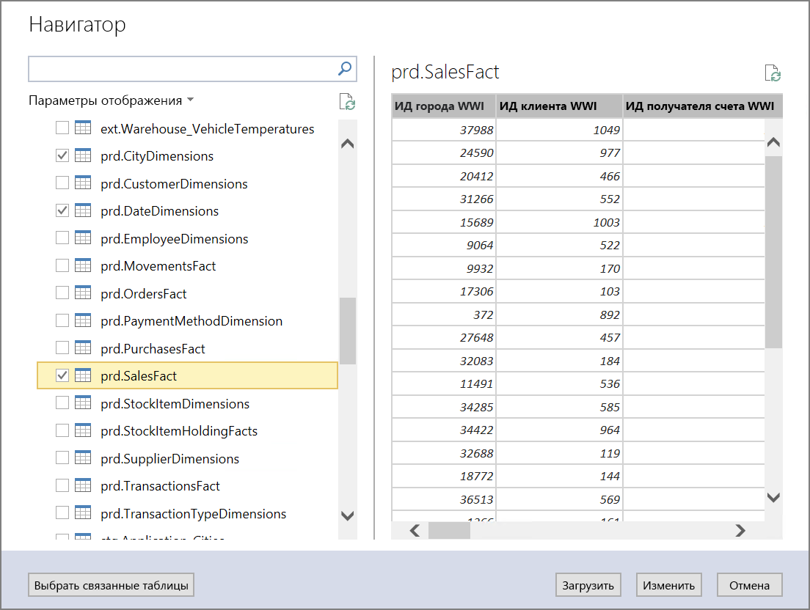
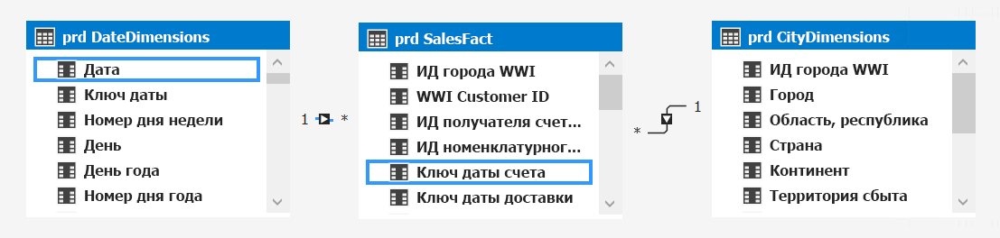
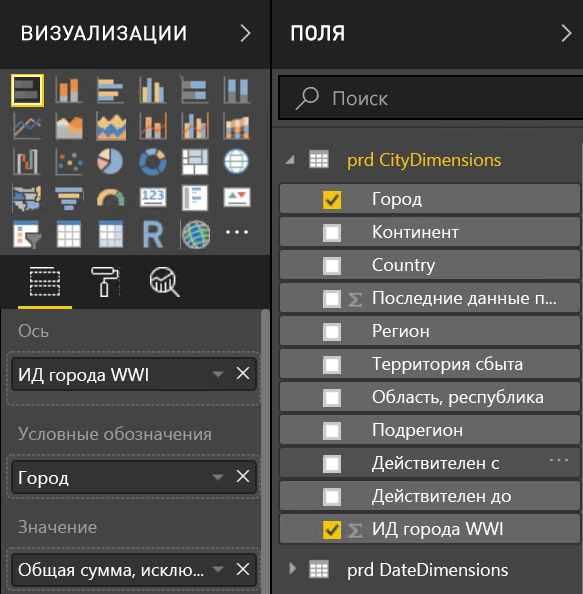
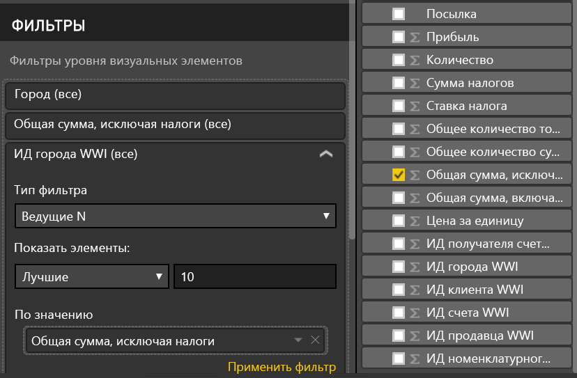
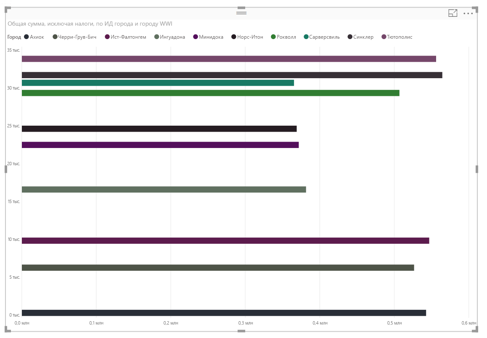

# <a name="enterprise-bi-with-sql-data-warehouse"></a><span data-ttu-id="ea733-103">Корпоративная бизнес-аналитика с использованием хранилища данных SQL</span><span class="sxs-lookup"><span data-stu-id="ea733-103">Enterprise BI with SQL Data Warehouse</span></span>
 
<span data-ttu-id="ea733-104">Эта эталонная архитектура реализует конвейер [ELT](../../data-guide/relational-data/etl.md#extract-load-and-transform-elt) (извлечение-загрузка-преобразование), который перемещает данные из локальной базы данных SQL Server в хранилище данных SQL и преобразует данные для анализа.</span><span class="sxs-lookup"><span data-stu-id="ea733-104">This reference architecture implements an [ELT](../../data-guide/relational-data/etl.md#extract-load-and-transform-elt) (extract-load-transform) pipeline that moves data from an on-premises SQL Server database into SQL Data Warehouse and transforms the data for analysis.</span></span> [<span data-ttu-id="ea733-105">**Разверните это решение**.</span><span class="sxs-lookup"><span data-stu-id="ea733-105">**Deploy this solution**.</span></span>](#deploy-the-solution)


<span data-ttu-id="ea733-106">**Сценарий**. Организация имеет большой набор данных OLTP, хранящийся локально в базе данных SQL Server.</span><span class="sxs-lookup"><span data-stu-id="ea733-106">**Scenario**: An organization has a large OLTP data set stored in a SQL Server database on premises.</span></span> <span data-ttu-id="ea733-107">Организация хочет использовать хранилище данных SQL для проведения анализа с использованием Power BI.</span><span class="sxs-lookup"><span data-stu-id="ea733-107">The organization wants to use SQL Data Warehouse to perform analysis using Power BI.</span></span> 

<span data-ttu-id="ea733-108">Эта эталонная архитектура предназначена для однократных заданий или заданий по требованию.</span><span class="sxs-lookup"><span data-stu-id="ea733-108">This reference architecture is designed for one-time or on-demand jobs.</span></span> <span data-ttu-id="ea733-109">Если необходимо регулярно перемещать данные (ежечасно или ежедневно), рекомендуется использовать фабрику данных Azure для автоматизации рабочего процесса.</span><span class="sxs-lookup"><span data-stu-id="ea733-109">If you need to move data on a continuing basis (hourly or daily), we recommend using Azure Data Factory to define an automated workflow.</span></span>

## <a name="architecture"></a><span data-ttu-id="ea733-110">Архитектура</span><span class="sxs-lookup"><span data-stu-id="ea733-110">Architecture</span></span>

<span data-ttu-id="ea733-111">Архитектура состоит из следующих компонентов:</span><span class="sxs-lookup"><span data-stu-id="ea733-111">The architecture consists of the following components.</span></span>

<span data-ttu-id="ea733-112">**SQL Server.**</span><span class="sxs-lookup"><span data-stu-id="ea733-112">**SQL Server**.</span></span> <span data-ttu-id="ea733-113">Исходные данные размещаются локально в базе данных SQL Server.</span><span class="sxs-lookup"><span data-stu-id="ea733-113">The source data is located in a SQL Server database on premises.</span></span> <span data-ttu-id="ea733-114">Чтобы имитировать локальную среду, сценарии развертывания для этой архитектуры предоставляют виртуальную машину в Azure с установленным SQL Server.</span><span class="sxs-lookup"><span data-stu-id="ea733-114">To simulate the on-premises environment, the deployment scripts for this architecture provision a virtual machine in Azure with SQL Server installed.</span></span> 

<span data-ttu-id="ea733-115">**Хранилище больших двоичных объектов**.</span><span class="sxs-lookup"><span data-stu-id="ea733-115">**Blob Storage**.</span></span> <span data-ttu-id="ea733-116">Хранилище больших двоичных объектов используется в качестве промежуточной области для копирования данных перед загрузкой в хранилище данных SQL.</span><span class="sxs-lookup"><span data-stu-id="ea733-116">Blob storage is used as a staging area to copy the data before loading it into SQL Data Warehouse.</span></span>

<span data-ttu-id="ea733-117">**Хранилище данных Azure SQL.**</span><span class="sxs-lookup"><span data-stu-id="ea733-117">**Azure SQL Data Warehouse**.</span></span> <span data-ttu-id="ea733-118">[Хранилище данных SQL](/azure/sql-data-warehouse/) — распределенная система, предназначенная для анализа больших объемов данных.</span><span class="sxs-lookup"><span data-stu-id="ea733-118">[SQL Data Warehouse](/azure/sql-data-warehouse/) is a distributed system designed to perform analytics on large data.</span></span> <span data-ttu-id="ea733-119">Она поддерживает массовую параллельную обработку (MPP), что делает ее пригодной для запуска высокопроизводительной аналитики.</span><span class="sxs-lookup"><span data-stu-id="ea733-119">It supports massive parallel processing (MPP), which makes it suitable for running high-performance analytics.</span></span> 

<span data-ttu-id="ea733-120">**Службы Azure Analysis Services**.</span><span class="sxs-lookup"><span data-stu-id="ea733-120">**Azure Analysis Services**.</span></span> <span data-ttu-id="ea733-121">[Analysis Services](/azure/analysis-services/) — полностью управляемая служба, которая предоставляет возможности моделирования данных.</span><span class="sxs-lookup"><span data-stu-id="ea733-121">[Analysis Services](/azure/analysis-services/) is a fully managed service that provides data modeling capabilities.</span></span> <span data-ttu-id="ea733-122">Используйте службу Analysis Services для создания семантической модели, которую могут запрашивать пользователи.</span><span class="sxs-lookup"><span data-stu-id="ea733-122">Use Analysis Services to create a semantic model that users can query.</span></span> <span data-ttu-id="ea733-123">Служба Analysis Services особенно полезна в сценарии информационной панели бизнес-аналитики.</span><span class="sxs-lookup"><span data-stu-id="ea733-123">Analysis Services is especially useful in a BI dashboard scenario.</span></span> <span data-ttu-id="ea733-124">В этой архитектуре служба Analysis Services считывает данные из хранилища данных для обработки семантической модели и эффективно обслуживает запросы информационной панели.</span><span class="sxs-lookup"><span data-stu-id="ea733-124">In this architecture, Analysis Services reads data from the data warehouse to process the semantic model, and efficiently serves dashboard queries.</span></span> <span data-ttu-id="ea733-125">Она также поддерживает гибкий параллелизм путем масштабирования реплик, чтобы быстрее обрабатывать запросы.</span><span class="sxs-lookup"><span data-stu-id="ea733-125">It also supports elastic concurrency, by scaling out replicas for faster query processing.</span></span>

<span data-ttu-id="ea733-126">В настоящее время Azure Analysis Services поддерживает табличные модели, но не поддерживает многомерные.</span><span class="sxs-lookup"><span data-stu-id="ea733-126">Currently, Azure Analysis Services supports tabular models but not multidimensional models.</span></span> <span data-ttu-id="ea733-127">В табличных моделях используются конструкции реляционного моделирования (таблицы и столбцы), тогда как в многомерных моделях используются моделирующие конструкции OLAP (кубы, размеры и меры).</span><span class="sxs-lookup"><span data-stu-id="ea733-127">Tabular models use relational modeling constructs (tables and columns), whereas multidimensional models use OLAP modeling constructs (cubes, dimensions, and measures).</span></span> <span data-ttu-id="ea733-128">Если требуются многомерные модели, используйте SQL Server Analysis Services (SSAS).</span><span class="sxs-lookup"><span data-stu-id="ea733-128">If you require multidimensional models, use SQL Server Analysis Services (SSAS).</span></span> <span data-ttu-id="ea733-129">Дополнительные сведения см. в разделе [Сравнение табличных и многомерных решений](/sql/analysis-services/comparing-tabular-and-multidimensional-solutions-ssas).</span><span class="sxs-lookup"><span data-stu-id="ea733-129">For more information, see [Comparing tabular and multidimensional solutions](/sql/analysis-services/comparing-tabular-and-multidimensional-solutions-ssas).</span></span>

<span data-ttu-id="ea733-130">**Power BI**.</span><span class="sxs-lookup"><span data-stu-id="ea733-130">**Power BI**.</span></span> <span data-ttu-id="ea733-131">Power BI — набор средств бизнес-аналитики для анализа информации о бизнесе.</span><span class="sxs-lookup"><span data-stu-id="ea733-131">Power BI is a suite of business analytics tools to analyze data for business insights.</span></span> <span data-ttu-id="ea733-132">В этой архитектуре он запрашивает семантическую модель, хранящуюся в службе Analysis Services.</span><span class="sxs-lookup"><span data-stu-id="ea733-132">In this architecture, it queries the semantic model stored in Analysis Services.</span></span>

<span data-ttu-id="ea733-133">**Azure Active Directory** (Azure AD) аутентифицирует пользователей, которые подключаются к серверу Analysis Services через Power BI.</span><span class="sxs-lookup"><span data-stu-id="ea733-133">**Azure Active Directory** (Azure AD) authenticates users who connect to the Analysis Services server through Power BI.</span></span>

## <a name="data-pipeline"></a><span data-ttu-id="ea733-134">Data Pipeline</span><span class="sxs-lookup"><span data-stu-id="ea733-134">Data Pipeline</span></span>
 
<span data-ttu-id="ea733-135">Эта эталонная архитектура в качестве источника данных использует базу данных [WorldWideImporters](/sql/sample/world-wide-importers/wide-world-importers-oltp-database).</span><span class="sxs-lookup"><span data-stu-id="ea733-135">This reference architecture uses the [WorldWideImporters](/sql/sample/world-wide-importers/wide-world-importers-oltp-database) sample database as data source.</span></span> <span data-ttu-id="ea733-136">Конвейер данных состоит из перечисленных ниже этапов.</span><span class="sxs-lookup"><span data-stu-id="ea733-136">The data pipeline has the following stages:</span></span>

1. <span data-ttu-id="ea733-137">Экспортирование данных из SQL Server в неструктурированные файлы (утилита bcp).</span><span class="sxs-lookup"><span data-stu-id="ea733-137">Export the data from SQL Server to flat files (bcp utility).</span></span>
2. <span data-ttu-id="ea733-138">Копирование неструктурированных файлов в хранилище больших двоичных объектов Azure (AzCopy)</span><span class="sxs-lookup"><span data-stu-id="ea733-138">Copy the flat files to Azure Blob Storage (AzCopy).</span></span>
3. <span data-ttu-id="ea733-139">Загрузка данных в хранилище данных SQL (PolyBase).</span><span class="sxs-lookup"><span data-stu-id="ea733-139">Load the data into SQL Data Warehouse (PolyBase).</span></span>
4. <span data-ttu-id="ea733-140">Преобразование данных в схему типа "звезда" (T-SQL).</span><span class="sxs-lookup"><span data-stu-id="ea733-140">Transform the data into a star schema (T-SQL).</span></span>
5. <span data-ttu-id="ea733-141">Загрузка семантической модели в службу Analysis Services (средства SQL Server Data Tools).</span><span class="sxs-lookup"><span data-stu-id="ea733-141">Load a semantic model into Analysis Services (SQL Server Data Tools).</span></span>


 
> [!NOTE]
> <span data-ttu-id="ea733-142">Для шагов 1 &ndash; 3 рассмотрите использование Redgate Data Platform Studio.</span><span class="sxs-lookup"><span data-stu-id="ea733-142">For steps 1 &ndash; 3, consider using Redgate Data Platform Studio.</span></span> <span data-ttu-id="ea733-143">Так как к Data Platform Studio применены наиболее подходящие оптимизации и исправления совместимости, это самый быстрый способ начать работу с хранилищем данных SQL.</span><span class="sxs-lookup"><span data-stu-id="ea733-143">Data Platform Studio applies the most appropriate compatibility fixes and optimizations, so it's the quickest way to get started with SQL Data Warehouse.</span></span> <span data-ttu-id="ea733-144">Дополнительную информацию см. в разделе [Загрузка данных с помощью Redgate Data Platform Studio](/azure/sql-data-warehouse/sql-data-warehouse-load-with-redgate).</span><span class="sxs-lookup"><span data-stu-id="ea733-144">For more information, see [Load data with Redgate Data Platform Studio](/azure/sql-data-warehouse/sql-data-warehouse-load-with-redgate).</span></span> 

<span data-ttu-id="ea733-145">Следующие разделы описывают эти этапы более подробно.</span><span class="sxs-lookup"><span data-stu-id="ea733-145">The next sections describe these stages in more detail.</span></span>

### <a name="export-data-from-sql-server"></a><span data-ttu-id="ea733-146">Экспорт данных из SQL Server</span><span class="sxs-lookup"><span data-stu-id="ea733-146">Export data from SQL Server</span></span>

<span data-ttu-id="ea733-147">Программа массового копирования [bcp](/sql/tools/bcp-utility) — это быстрый способ создания неструктурированных текстовых файлов из таблиц SQL.</span><span class="sxs-lookup"><span data-stu-id="ea733-147">The [bcp](/sql/tools/bcp-utility) (bulk copy program) utility is a fast way to create flat text files from SQL tables.</span></span> <span data-ttu-id="ea733-148">На этом шаге выбираются столбцы, которые нужно экспортировать, но данные не надо преобразовывать.</span><span class="sxs-lookup"><span data-stu-id="ea733-148">In this step, you select the columns that you want to export, but don't transform the data.</span></span> <span data-ttu-id="ea733-149">Любые преобразования данных должны происходить в хранилище данных SQL.</span><span class="sxs-lookup"><span data-stu-id="ea733-149">Any data transformations should happen in SQL Data Warehouse.</span></span>

<span data-ttu-id="ea733-150">**рекомендации**;</span><span class="sxs-lookup"><span data-stu-id="ea733-150">**Recommendations**</span></span>

<span data-ttu-id="ea733-151">Если возможно, планируйте извлечение данных в часы с наименьшей загрузкой, чтобы свести к минимуму конфликт ресурсов в рабочей среде.</span><span class="sxs-lookup"><span data-stu-id="ea733-151">If possible, schedule data extraction during off-peak hours, to minimize resource contention in the production environment.</span></span> 

<span data-ttu-id="ea733-152">Избегайте запуска bcp на сервере базы данных.</span><span class="sxs-lookup"><span data-stu-id="ea733-152">Avoid running bcp on the database server.</span></span> <span data-ttu-id="ea733-153">Вместо этого запустите его с другого компьютера.</span><span class="sxs-lookup"><span data-stu-id="ea733-153">Instead, run it from another machine.</span></span> <span data-ttu-id="ea733-154">Записывайте файлы на локальный диск.</span><span class="sxs-lookup"><span data-stu-id="ea733-154">Write the files to a local drive.</span></span> <span data-ttu-id="ea733-155">Убедитесь, что имеется достаточно ресурсов ввода-вывода для обработки параллельных операций записи.</span><span class="sxs-lookup"><span data-stu-id="ea733-155">Ensure that you have sufficient I/O resources to handle the concurrent writes.</span></span> <span data-ttu-id="ea733-156">Для обеспечения максимальной производительности экспортируйте файлы в специализированные высокоскоростные хранилища.</span><span class="sxs-lookup"><span data-stu-id="ea733-156">For best performance, export the files to dedicated fast storage drives.</span></span>

<span data-ttu-id="ea733-157">Вы можете ускорить сетевой перенос, сохранив экспортированные данные в сжатом формате Gzip.</span><span class="sxs-lookup"><span data-stu-id="ea733-157">You can speed up the network transfer by saving the exported data in Gzip compressed format.</span></span> <span data-ttu-id="ea733-158">Однако загрузка сжатых файлов в хранилище происходит медленнее, чем загрузка несжатых файлов, поэтому существует компромисс между более быстрой передачей сети и более быстрой загрузкой.</span><span class="sxs-lookup"><span data-stu-id="ea733-158">However, loading compressed files into the warehouse is slower than loading uncompressed files, so there is a tradeoff between faster network transfer versus faster loading.</span></span> <span data-ttu-id="ea733-159">Если решено использовать сжатие Gzip, не создавайте отдельные файлы Gzip.</span><span class="sxs-lookup"><span data-stu-id="ea733-159">If you decide to use Gzip compression, don't create a single Gzip file.</span></span> <span data-ttu-id="ea733-160">Вместо этого разделите данные на несколько сжатых файлов.</span><span class="sxs-lookup"><span data-stu-id="ea733-160">Instead, split the data into multiple compressed files.</span></span>

### <a name="copy-flat-files-into-blob-storage"></a><span data-ttu-id="ea733-161">Копирование неструктурированных файлов в хранилище больших двоичных объектов</span><span class="sxs-lookup"><span data-stu-id="ea733-161">Copy flat files into blob storage</span></span>

<span data-ttu-id="ea733-162">Утилита [AzCopy](/azure/storage/common/storage-use-azcopy) предназначена для высокопроизводительного копирования данных в хранилище больших двоичных объектов Azure.</span><span class="sxs-lookup"><span data-stu-id="ea733-162">The [AzCopy](/azure/storage/common/storage-use-azcopy) utility is designed for high-performance copying of data into Azure blob storage.</span></span>

<span data-ttu-id="ea733-163">**рекомендации**;</span><span class="sxs-lookup"><span data-stu-id="ea733-163">**Recommendations**</span></span>

<span data-ttu-id="ea733-164">Создайте учетную запись хранения в регионе, расположенном рядом с исходными данными.</span><span class="sxs-lookup"><span data-stu-id="ea733-164">Create the storage account in a region near the location of the source data.</span></span> <span data-ttu-id="ea733-165">Разверните учетную запись хранения и экземпляр хранилища данных SQL в том же регионе.</span><span class="sxs-lookup"><span data-stu-id="ea733-165">Deploy the storage account and the SQL Data Warehouse instance in the same region.</span></span> 

<span data-ttu-id="ea733-166">Не запускайте AzCopy на том же компьютере, на котором выполняются производственные рабочие нагрузки, поскольку потребление процессора и ввода-вывода может влиять на рабочую нагрузку.</span><span class="sxs-lookup"><span data-stu-id="ea733-166">Don't run AzCopy on the same machine that runs your production workloads, because the CPU and I/O consumption can interfere with the production workload.</span></span> 

<span data-ttu-id="ea733-167">Сначала проверьте загрузку, чтобы изучить скорость загрузки.</span><span class="sxs-lookup"><span data-stu-id="ea733-167">Test the upload first to see what the upload speed is like.</span></span> <span data-ttu-id="ea733-168">Чтобы указать количество параллельных операций копирования, в AzCopy можно использовать параметр /NC.</span><span class="sxs-lookup"><span data-stu-id="ea733-168">You can use the /NC option in AzCopy to specify the number of concurrent copy operations.</span></span> <span data-ttu-id="ea733-169">Чтобы настроить производительность, начните со значения по умолчанию и затем поэкспериментируйте с этим параметром.</span><span class="sxs-lookup"><span data-stu-id="ea733-169">Start with the default value, then experiment with this setting to tune the performance.</span></span> <span data-ttu-id="ea733-170">В среде с низкой пропускной способностью слишком много параллельных операций могут привести к сбою сетевого соединения и не допустить успешного завершения операций.</span><span class="sxs-lookup"><span data-stu-id="ea733-170">In a low-bandwidth environment, too many concurrent operations can overwhelm the network connection and prevent the operations from completing successfully.</span></span>  

<span data-ttu-id="ea733-171">AzCopy перемещает данные в хранилище через общий доступ в Интернет.</span><span class="sxs-lookup"><span data-stu-id="ea733-171">AzCopy moves data to storage over the public internet.</span></span> <span data-ttu-id="ea733-172">Если это недостаточно быстро, рассмотрите создание схемы [ExpressRoute](/azure/expressroute/).</span><span class="sxs-lookup"><span data-stu-id="ea733-172">If this isn't fast enough, consider setting up an [ExpressRoute](/azure/expressroute/) circuit.</span></span> <span data-ttu-id="ea733-173">ExpressRoute — это служба, которая направляет данные с помощью выделенного частного подключения в Azure.</span><span class="sxs-lookup"><span data-stu-id="ea733-173">ExpressRoute is a service that routes your data through a dedicated private connection to Azure.</span></span> <span data-ttu-id="ea733-174">Если ваше сетевое соединение слишком медленное, то другой вариант заключается в физической отправке данных на диск в центр данных Azure.</span><span class="sxs-lookup"><span data-stu-id="ea733-174">Another option, if your network connection is too slow, is to physically ship the data on disk to an Azure datacenter.</span></span> <span data-ttu-id="ea733-175">Дополнительные сведения см. в разделе [Передача данных в Azure и обратно](/azure/architecture/data-guide/scenarios/data-transfer).</span><span class="sxs-lookup"><span data-stu-id="ea733-175">For more information, see [Transferring data to and from Azure](/azure/architecture/data-guide/scenarios/data-transfer).</span></span>

<span data-ttu-id="ea733-176">Во время операции копирования AzCopy создает временный файл журнала, который позволяет AzCopy перезапустить операцию, если она прервется (например, из-за сетевой ошибки).</span><span class="sxs-lookup"><span data-stu-id="ea733-176">During a copy operation, AzCopy creates a temporary journal file, which enables AzCopy to restart the operation if it gets interrupted (for example, due to a network error).</span></span> <span data-ttu-id="ea733-177">Убедитесь, что для хранения файлов журнала на диске достаточно свободного места.</span><span class="sxs-lookup"><span data-stu-id="ea733-177">Make sure there is enough disk space to store the journal files.</span></span> <span data-ttu-id="ea733-178">Чтобы указать, где записываются файлы журнала, можно использовать параметр /Z.</span><span class="sxs-lookup"><span data-stu-id="ea733-178">You can use the /Z option to specify where the journal files are written.</span></span>

### <a name="load-data-into-sql-data-warehouse"></a><span data-ttu-id="ea733-179">Загрузка данных в хранилище данных SQL</span><span class="sxs-lookup"><span data-stu-id="ea733-179">Load data into SQL Data Warehouse</span></span>

<span data-ttu-id="ea733-180">Используйте [PolyBase](/sql/relational-databases/polybase/polybase-guide), чтобы загрузить файлы из хранилища больших двоичных объектов в хранилище данных.</span><span class="sxs-lookup"><span data-stu-id="ea733-180">Use [PolyBase](/sql/relational-databases/polybase/polybase-guide) to load the files from blob storage into the data warehouse.</span></span> <span data-ttu-id="ea733-181">PolyBase предназначен для использования архитектуры MPP (массовой параллельной обработки) хранилища данных SQL, которая делает ее самым быстрым способом загрузки данных в хранилище данных SQL.</span><span class="sxs-lookup"><span data-stu-id="ea733-181">PolyBase is designed to leverage the MPP (Massively Parallel Processing) architecture of SQL Data Warehouse, which makes it the fastest way to load data into SQL Data Warehouse.</span></span> 

<span data-ttu-id="ea733-182">Загрузка данных — это двухэтапный процесс:</span><span class="sxs-lookup"><span data-stu-id="ea733-182">Loading the data is a two-step process:</span></span>

1. <span data-ttu-id="ea733-183">Создание набора внешних таблиц для данных.</span><span class="sxs-lookup"><span data-stu-id="ea733-183">Create a set of external tables for the data.</span></span> <span data-ttu-id="ea733-184">Внешняя таблица — это определение таблицы, которое указывает на данные, хранящиеся вне хранилища &mdash; в этом случае, неструктурированные файлы в хранилище памяти.</span><span class="sxs-lookup"><span data-stu-id="ea733-184">An external table is a table definition that points to data stored outside of the warehouse &mdash; in this case, the flat files in blob storage.</span></span> <span data-ttu-id="ea733-185">Этот этап не перемещает никаких данных в хранилище.</span><span class="sxs-lookup"><span data-stu-id="ea733-185">This step does not move any data into the warehouse.</span></span>
2. <span data-ttu-id="ea733-186">Создание промежуточных таблиц и загрузка данных в промежуточные таблицы.</span><span class="sxs-lookup"><span data-stu-id="ea733-186">Create staging tables, and load the data into the staging tables.</span></span> <span data-ttu-id="ea733-187">Этот этап копирует данные в хранилище.</span><span class="sxs-lookup"><span data-stu-id="ea733-187">This step copies the data into the warehouse.</span></span>

<span data-ttu-id="ea733-188">**рекомендации**;</span><span class="sxs-lookup"><span data-stu-id="ea733-188">**Recommendations**</span></span>

<span data-ttu-id="ea733-189">Если имеется большой объем данных (более 1 ТБ) и используется рабочая нагрузка аналитики, которая выиграет от параллелизма, то рассмотрите возможности хранилища данных SQL.</span><span class="sxs-lookup"><span data-stu-id="ea733-189">Consider SQL Data Warehouse when you have large amounts of data (more than 1 TB) and are running an analytics workload that will benefit from parallelism.</span></span> <span data-ttu-id="ea733-190">Хранилище данных SQL не подходит для рабочих нагрузок OLTP или малых наборов данных (<250 ГБ).</span><span class="sxs-lookup"><span data-stu-id="ea733-190">SQL Data Warehouse is not a good fit for OLTP workloads or smaller data sets (< 250GB).</span></span> <span data-ttu-id="ea733-191">Для наборов данных менее 250 ГБ рассмотрите базу данных Azure SQL или SQL Server.</span><span class="sxs-lookup"><span data-stu-id="ea733-191">For data sets less than 250GB, consider Azure SQL Database or SQL Server.</span></span> <span data-ttu-id="ea733-192">Дополнительные сведения см. в разделе [Хранение данных](../../data-guide/relational-data/data-warehousing.md).</span><span class="sxs-lookup"><span data-stu-id="ea733-192">For more information, see [Data warehousing](../../data-guide/relational-data/data-warehousing.md).</span></span>

<span data-ttu-id="ea733-193">Создайте промежуточные таблицы в виде таблиц без кластеризованных индексов, которые не индексируются.</span><span class="sxs-lookup"><span data-stu-id="ea733-193">Create the staging tables as heap tables, which are not indexed.</span></span> <span data-ttu-id="ea733-194">Запросы, которые создают производственные таблицы, приведут к полному сканированию таблицы, поэтому нет причин индексировать промежуточные таблицы.</span><span class="sxs-lookup"><span data-stu-id="ea733-194">The queries that create the production tables will result in a full table scan, so there is no reason to index the staging tables.</span></span>

<span data-ttu-id="ea733-195">PolyBase автоматически использует преимущества параллелизма в хранилище.</span><span class="sxs-lookup"><span data-stu-id="ea733-195">PolyBase automatically takes advantage of parallelism in the warehouse.</span></span> <span data-ttu-id="ea733-196">Производительность нагрузки масштабируется при увеличении DWU.</span><span class="sxs-lookup"><span data-stu-id="ea733-196">The load performance scales as you increase DWUs.</span></span> <span data-ttu-id="ea733-197">Для достижения оптимальной производительности используйте операции одинарной загрузки.</span><span class="sxs-lookup"><span data-stu-id="ea733-197">For best performance, use a single load operation.</span></span> <span data-ttu-id="ea733-198">Разбивка входных данных на фрагменты и выполнение нескольких одновременных нагрузок не повышает производительность.</span><span class="sxs-lookup"><span data-stu-id="ea733-198">There is no performance benefit to breaking the input data into chunks and running multiple concurrent loads.</span></span>

<span data-ttu-id="ea733-199">PolyBase может читать данные, сжатые с помощью GZip.</span><span class="sxs-lookup"><span data-stu-id="ea733-199">PolyBase can read Gzip compressed files.</span></span> <span data-ttu-id="ea733-200">Тем не менее для сжатого файла используется только один модуль чтения, потому что распаковка файла является однопоточной операцией.</span><span class="sxs-lookup"><span data-stu-id="ea733-200">However, only a single reader is used per compressed file, because uncompressing the file is a single-threaded operation.</span></span> <span data-ttu-id="ea733-201">Поэтому следует избегать загрузки одного большого сжатого файла.</span><span class="sxs-lookup"><span data-stu-id="ea733-201">Therefore, avoid loading a single large compressed file.</span></span> <span data-ttu-id="ea733-202">Вместо этого разбейте данные на несколько сжатых файлов, чтобы воспользоваться преимуществами параллелизма.</span><span class="sxs-lookup"><span data-stu-id="ea733-202">Instead, split the data into multiple compressed files, in order to take advantage of parallelism.</span></span> 

<span data-ttu-id="ea733-203">Следует учитывать следующие ограничения.</span><span class="sxs-lookup"><span data-stu-id="ea733-203">Be aware of the following limitations:</span></span>

- <span data-ttu-id="ea733-204">PolyBase поддерживает максимальный размер столбца из `varchar(8000)`, `nvarchar(4000)` или `varbinary(8000)`.</span><span class="sxs-lookup"><span data-stu-id="ea733-204">PolyBase supports a maximum column size of `varchar(8000)`, `nvarchar(4000)`, or `varbinary(8000)`.</span></span> <span data-ttu-id="ea733-205">Если имеются данные, превышающие эти лимиты, то при экспорте следует разбить данные на блоки, а затем собрать эти блоки после импорта.</span><span class="sxs-lookup"><span data-stu-id="ea733-205">If you have data that exceeds these limits, one option is to break the data up into chunks when you export it, and then reassemble the chunks after import.</span></span> 

- <span data-ttu-id="ea733-206">PolyBase использует фиксированный признак конца строки \n или новой строки.</span><span class="sxs-lookup"><span data-stu-id="ea733-206">PolyBase uses a fixed row terminator of \n or newline.</span></span> <span data-ttu-id="ea733-207">Если в исходных данных появляются символы новой строки, это может вызвать проблемы.</span><span class="sxs-lookup"><span data-stu-id="ea733-207">This can cause problems if newline characters appear in the source data.</span></span>

- <span data-ttu-id="ea733-208">Схема исходных данных может содержать типы данных, которые не поддерживаются в хранилище данных SQL.</span><span class="sxs-lookup"><span data-stu-id="ea733-208">Your source data schema might contain data types that are not supported in SQL Data Warehouse.</span></span>

<span data-ttu-id="ea733-209">Чтобы обойти эти ограничения, можно создать хранимую процедуру, которая выполнит необходимые преобразования.</span><span class="sxs-lookup"><span data-stu-id="ea733-209">To work around these limitations, you can create a stored procedure that performs the necessary conversions.</span></span> <span data-ttu-id="ea733-210">При запуске bcp найдите по ссылке эту хранимую процедуру.</span><span class="sxs-lookup"><span data-stu-id="ea733-210">Reference this stored procedure when you run bcp.</span></span> <span data-ttu-id="ea733-211">Как альтернатива [Redgate Data Platform Studio](/azure/sql-data-warehouse/sql-data-warehouse-load-with-redgate) автоматически преобразует типы данных, которые не поддерживаются в хранилище данных SQL.</span><span class="sxs-lookup"><span data-stu-id="ea733-211">Alternatively, [Redgate Data Platform Studio](/azure/sql-data-warehouse/sql-data-warehouse-load-with-redgate) automatically converts data types that aren’t supported in SQL Data Warehouse.</span></span>

<span data-ttu-id="ea733-212">Дополнительные сведения см. в следующих статьях:</span><span class="sxs-lookup"><span data-stu-id="ea733-212">For more information, see the following articles:</span></span>

- <span data-ttu-id="ea733-213">[Рекомендации по загрузке данных в хранилище данных SQL Azure](/azure/sql-data-warehouse/guidance-for-loading-data).</span><span class="sxs-lookup"><span data-stu-id="ea733-213">[Best practices for loading data into Azure SQL Data Warehouse](/azure/sql-data-warehouse/guidance-for-loading-data).</span></span>
- <span data-ttu-id="ea733-214">[Перенос схем в хранилище данных SQL](/azure/sql-data-warehouse/sql-data-warehouse-migrate-schema).</span><span class="sxs-lookup"><span data-stu-id="ea733-214">[Migrate your schemas to SQL Data Warehouse](/azure/sql-data-warehouse/sql-data-warehouse-migrate-schema)</span></span>
- <span data-ttu-id="ea733-215">[Руководство по определению типов данных для таблиц в хранилище данных SQL](/azure/sql-data-warehouse/sql-data-warehouse-tables-data-types).</span><span class="sxs-lookup"><span data-stu-id="ea733-215">[Guidance for defining data types for tables in SQL Data Warehouse](/azure/sql-data-warehouse/sql-data-warehouse-tables-data-types)</span></span>

### <a name="transform-the-data"></a><span data-ttu-id="ea733-216">Преобразование данных</span><span class="sxs-lookup"><span data-stu-id="ea733-216">Transform the data</span></span>

<span data-ttu-id="ea733-217">Преобразование данных и перемещение их в производственные таблицы.</span><span class="sxs-lookup"><span data-stu-id="ea733-217">Transform the data and move it into production tables.</span></span> <span data-ttu-id="ea733-218">На этом этапе данные преобразуются в схему типа "звезда" с таблицами измерений и таблицами фактов, подходящими для семантического моделирования.</span><span class="sxs-lookup"><span data-stu-id="ea733-218">In this step, the data is transformed into a star schema with dimension tables and fact tables, suitable for semantic modeling.</span></span>

<span data-ttu-id="ea733-219">Создайте рабочие таблицы с кластерными индексами columnstore, которые обеспечивают наилучшую общую производительность запросов.</span><span class="sxs-lookup"><span data-stu-id="ea733-219">Create the production tables with clustered columnstore indexes, which offer the best overall query performance.</span></span> <span data-ttu-id="ea733-220">Индексы columnstore оптимизированы для запросов, которые сканируют большое количество записей.</span><span class="sxs-lookup"><span data-stu-id="ea733-220">Columnstore indexes are optimized for queries that scan many records.</span></span> <span data-ttu-id="ea733-221">Индексы columnstore также не работают для отдельных поисковых запросов (которые просматривают одну строку).</span><span class="sxs-lookup"><span data-stu-id="ea733-221">Columnstore indexes don't perform as well for singleton lookups (that is, looking up a single row).</span></span> <span data-ttu-id="ea733-222">Если необходимо выполнять частые отдельные запросы, можно добавить некластеризованный индекс в таблицу.</span><span class="sxs-lookup"><span data-stu-id="ea733-222">If you need to perform frequent singleton lookups, you can add a non-clustered index to a table.</span></span> <span data-ttu-id="ea733-223">Выполнение отдельных запросов происходит значительно быстрее с помощью некластеризованного индекса.</span><span class="sxs-lookup"><span data-stu-id="ea733-223">Singleton lookups can run significantly faster using a non-clustered index.</span></span> <span data-ttu-id="ea733-224">Однако отдельный поиск обычно менее распространен в сценариях хранилища данных, чем рабочие нагрузки OLTP.</span><span class="sxs-lookup"><span data-stu-id="ea733-224">However, singleton lookups are typically less common in data warehouse scenarios than OLTP workloads.</span></span> <span data-ttu-id="ea733-225">Дополнительные сведения см. в разделе [Индексирование таблиц в хранилище данных SQL](/azure/sql-data-warehouse/sql-data-warehouse-tables-index).</span><span class="sxs-lookup"><span data-stu-id="ea733-225">For more information, see [Indexing tables in SQL Data Warehouse](/azure/sql-data-warehouse/sql-data-warehouse-tables-index).</span></span>

> [!NOTE]
> <span data-ttu-id="ea733-226">Кластерные таблицы columnstore не поддерживают типы данных `varchar(max)`, `nvarchar(max)` или `varbinary(max)`.</span><span class="sxs-lookup"><span data-stu-id="ea733-226">Clustered columnstore tables do not support `varchar(max)`, `nvarchar(max)`, or `varbinary(max)` data types.</span></span> <span data-ttu-id="ea733-227">В этом случае рассмотрим кучу или кластеризованный индекс.</span><span class="sxs-lookup"><span data-stu-id="ea733-227">In that case, consider a heap or clustered index.</span></span> <span data-ttu-id="ea733-228">Эти столбцы можно поместить в отдельную таблицу.</span><span class="sxs-lookup"><span data-stu-id="ea733-228">You might put those columns into a separate table.</span></span>

<span data-ttu-id="ea733-229">Поскольку база данных примеров не очень велика, были созданы реплицированные таблицы без разделов.</span><span class="sxs-lookup"><span data-stu-id="ea733-229">Because the sample database is not very large, we created replicated tables with no partitions.</span></span> <span data-ttu-id="ea733-230">Для производственных нагрузок использование распределенных таблиц, вероятно, улучшит производительность запросов.</span><span class="sxs-lookup"><span data-stu-id="ea733-230">For production workloads, using distributed tables is likely to improve query performance.</span></span> <span data-ttu-id="ea733-231">См. [Руководство по проектированию распределенных таблиц в хранилище данных SQL Azure](/azure/sql-data-warehouse/sql-data-warehouse-tables-distribute).</span><span class="sxs-lookup"><span data-stu-id="ea733-231">See [Guidance for designing distributed tables in Azure SQL Data Warehouse](/azure/sql-data-warehouse/sql-data-warehouse-tables-distribute).</span></span> <span data-ttu-id="ea733-232">В примерах скрипты запускают запросы, используя статический [класс ресурсов](/azure/sql-data-warehouse/resource-classes-for-workload-management).</span><span class="sxs-lookup"><span data-stu-id="ea733-232">Our example scripts run the queries using a static [resource class](/azure/sql-data-warehouse/resource-classes-for-workload-management).</span></span>

### <a name="load-the-semantic-model"></a><span data-ttu-id="ea733-233">Загрузка семантической модели</span><span class="sxs-lookup"><span data-stu-id="ea733-233">Load the semantic model</span></span>

<span data-ttu-id="ea733-234">Загрузка данных в табличную модель в Azure Analysis Services.</span><span class="sxs-lookup"><span data-stu-id="ea733-234">Load the data into a tabular model in Azure Analysis Services.</span></span> <span data-ttu-id="ea733-235">На этом этапе создается семантическая модель данных с помощью средства SQL Server Data Tools (SSDT).</span><span class="sxs-lookup"><span data-stu-id="ea733-235">In this step, you create a semantic data model by using SQL Server Data Tools (SSDT).</span></span> <span data-ttu-id="ea733-236">Можно также создать модель путем импорта из файла Power BI Desktop.</span><span class="sxs-lookup"><span data-stu-id="ea733-236">You can also create a model by importing it from a Power BI Desktop file.</span></span> <span data-ttu-id="ea733-237">Поскольку хранилище данных SQL не поддерживает внешние ключи, необходимо добавить связи для семантической модели, чтобы можно было присоединиться к таблицам.</span><span class="sxs-lookup"><span data-stu-id="ea733-237">Because SQL Data Warehouse does not support foreign keys, you must add the relationships to the semantic model, so that you can join across tables.</span></span>

### <a name="use-power-bi-to-visualize-the-data"></a><span data-ttu-id="ea733-238">Использование Power BI для визуализации данных</span><span class="sxs-lookup"><span data-stu-id="ea733-238">Use Power BI to visualize the data</span></span>

<span data-ttu-id="ea733-239">Существует два варианта подключения Power BI к Azure Analysis Services:</span><span class="sxs-lookup"><span data-stu-id="ea733-239">Power BI supports two options for connecting to Azure Analysis Services:</span></span>

- <span data-ttu-id="ea733-240">Импорт.</span><span class="sxs-lookup"><span data-stu-id="ea733-240">Import.</span></span> <span data-ttu-id="ea733-241">Данные импортируются в модель Power BI.</span><span class="sxs-lookup"><span data-stu-id="ea733-241">The data is imported into the Power BI model.</span></span>
- <span data-ttu-id="ea733-242">Активное подключение.</span><span class="sxs-lookup"><span data-stu-id="ea733-242">Live Connection.</span></span> <span data-ttu-id="ea733-243">Данные извлекаются непосредственно из Analysis Services.</span><span class="sxs-lookup"><span data-stu-id="ea733-243">Data is pulled directly from Analysis Services.</span></span>

<span data-ttu-id="ea733-244">Корпорация Майкрософт рекомендует активное подключение, так как оно не требует копирования данных в модели Power BI.</span><span class="sxs-lookup"><span data-stu-id="ea733-244">We recommend Live Connection because it doesn't require copying data into the Power BI model.</span></span> <span data-ttu-id="ea733-245">Кроме того, использование DirectQuery гарантирует, что результаты всегда соответствуют последним исходным данным.</span><span class="sxs-lookup"><span data-stu-id="ea733-245">Also, using DirectQuery ensures that results are always consistent with the latest source data.</span></span> <span data-ttu-id="ea733-246">Дополнительные сведения см. в разделе [Подключение с помощью Power BI](/azure/analysis-services/analysis-services-connect-pbi).</span><span class="sxs-lookup"><span data-stu-id="ea733-246">For more information, see [Connect with Power BI](/azure/analysis-services/analysis-services-connect-pbi).</span></span>

<span data-ttu-id="ea733-247">**рекомендации**;</span><span class="sxs-lookup"><span data-stu-id="ea733-247">**Recommendations**</span></span>

<span data-ttu-id="ea733-248">Избегайте запуска запросов панели управления бизнес-аналитики непосредственно к хранилищу данных.</span><span class="sxs-lookup"><span data-stu-id="ea733-248">Avoid running BI dashboard queries directly against the data warehouse.</span></span> <span data-ttu-id="ea733-249">Информационные панели бизнес-аналитики требуют очень малого времени отклика, которого может не хватить на прямые запросы к хранилищу.</span><span class="sxs-lookup"><span data-stu-id="ea733-249">BI dashboards require very low response times, which direct queries against the warehouse may be unable to satisfy.</span></span> <span data-ttu-id="ea733-250">Кроме того, при обновлении информационной панели будет учитываться количество одновременных запросов, что может повлиять на производительность.</span><span class="sxs-lookup"><span data-stu-id="ea733-250">Also, refreshing the dashboard will count against the number of concurrent queries, which could impact performance.</span></span> 

<span data-ttu-id="ea733-251">Azure Analysis Services предназначена для обработки требований к запросу информационной панели бизнес-аналитики, поэтому рекомендуемая практика заключается в том, чтобы запрашивать Analysis Services из Power BI.</span><span class="sxs-lookup"><span data-stu-id="ea733-251">Azure Analysis Services is designed to handle the query requirements of a BI dashboard, so the recommended practice is to query Analysis Services from Power BI.</span></span>

## <a name="scalability-considerations"></a><span data-ttu-id="ea733-252">Вопросы масштабируемости</span><span class="sxs-lookup"><span data-stu-id="ea733-252">Scalability Considerations</span></span>

### <a name="sql-data-warehouse"></a><span data-ttu-id="ea733-253">Хранилище данных SQL.</span><span class="sxs-lookup"><span data-stu-id="ea733-253">SQL Data Warehouse</span></span>

<span data-ttu-id="ea733-254">С хранилищем данных SQL можно по требованию масштабировать вычислительные ресурсы.</span><span class="sxs-lookup"><span data-stu-id="ea733-254">With SQL Data Warehouse, you can scale out your compute resources on demand.</span></span> <span data-ttu-id="ea733-255">Механизм запросов оптимизирует запросы для параллельной обработки на основе количества вычислительных узлов и перемещает данные между узлами по мере необходимости.</span><span class="sxs-lookup"><span data-stu-id="ea733-255">The query engine optimizes queries for parallel processing based on the number of compute nodes, and moves data between nodes as necessary.</span></span> <span data-ttu-id="ea733-256">Дополнительные сведения см. в разделе [Управление вычислительными ресурсами в хранилище данных SQL Azure](/azure/sql-data-warehouse/sql-data-warehouse-manage-compute-overview).</span><span class="sxs-lookup"><span data-stu-id="ea733-256">For more information, see [Manage compute in Azure SQL Data Warehouse](/azure/sql-data-warehouse/sql-data-warehouse-manage-compute-overview).</span></span>

### <a name="analysis-services"></a><span data-ttu-id="ea733-257">службы Analysis Services</span><span class="sxs-lookup"><span data-stu-id="ea733-257">Analysis Services</span></span>

<span data-ttu-id="ea733-258">Для рабочих нагрузок рекомендуется уровень "Стандартный" для служб Azure Analysis Services, так как он поддерживает секционирование и DirectQuery.</span><span class="sxs-lookup"><span data-stu-id="ea733-258">For production workloads, we recommend the Standard Tier for Azure Analysis Services, because it supports partitioning and DirectQuery.</span></span> <span data-ttu-id="ea733-259">В пределах уровня размер экземпляра определяет память и мощность обработки.</span><span class="sxs-lookup"><span data-stu-id="ea733-259">Within a tier, the instance size determines the memory and processing power.</span></span> <span data-ttu-id="ea733-260">Вычислительная мощность измеряется в единицах обработки запроса (QPUs).</span><span class="sxs-lookup"><span data-stu-id="ea733-260">Processing power is measured in Query Processing Units (QPUs).</span></span> <span data-ttu-id="ea733-261">Контролируйте использование QPU, чтобы выбрать необходимый размер.</span><span class="sxs-lookup"><span data-stu-id="ea733-261">Monitor your QPU usage to select the appropriate size.</span></span> <span data-ttu-id="ea733-262">Дополнительные сведения см. в разделе [Мониторинг производительности сервера](/azure/analysis-services/analysis-services-monitor).</span><span class="sxs-lookup"><span data-stu-id="ea733-262">For more information, see [Monitor server metrics](/azure/analysis-services/analysis-services-monitor).</span></span>

<span data-ttu-id="ea733-263">При высокой нагрузке производительность запросов может ухудшиться из-за параллелизма запросов.</span><span class="sxs-lookup"><span data-stu-id="ea733-263">Under high load, query performance can become degraded due to query concurrency.</span></span> <span data-ttu-id="ea733-264">Чтобы одновременно выполнять больше запросов, можно масштабировать службы Analysis Services, создавая пул реплик для обработки запросов.</span><span class="sxs-lookup"><span data-stu-id="ea733-264">You can scale out Analysis Services by creating a pool of replicas to process queries, so that more queries can be performed concurrently.</span></span> <span data-ttu-id="ea733-265">Работа по обработке модели данных всегда происходит на основном сервере.</span><span class="sxs-lookup"><span data-stu-id="ea733-265">The work of processing the data model always happens on the primary server.</span></span> <span data-ttu-id="ea733-266">Основной сервер по умолчанию также обрабатывает запросы.</span><span class="sxs-lookup"><span data-stu-id="ea733-266">By default, the primary server also handles queries.</span></span> <span data-ttu-id="ea733-267">При необходимости можно назначить сервер-источник исключительно для обработки, чтобы пул запросов обрабатывал все запросы.</span><span class="sxs-lookup"><span data-stu-id="ea733-267">Optionally, you can designate the primary server to run processing exclusively, so that the query pool handles all queries.</span></span> <span data-ttu-id="ea733-268">В случае высоких требований к обработке нужно отделить обработку от пула запросов.</span><span class="sxs-lookup"><span data-stu-id="ea733-268">If you have high processing requirements, you should separate the processing from the query pool.</span></span> <span data-ttu-id="ea733-269">В случае высокой нагрузки запросов и относительно несложной обработки можно включить сервер-источник в пул запросов.</span><span class="sxs-lookup"><span data-stu-id="ea733-269">If you have high query loads, and relatively light processing, you can include the primary server in the query pool.</span></span> <span data-ttu-id="ea733-270">Дополнительные сведения см. в разделе [Горизонтальное масштабирование служб Azure Analysis Services](/azure/analysis-services/analysis-services-scale-out).</span><span class="sxs-lookup"><span data-stu-id="ea733-270">For more information, see [Azure Analysis Services scale-out](/azure/analysis-services/analysis-services-scale-out).</span></span> 

<span data-ttu-id="ea733-271">Чтобы уменьшить объем ненужной обработки, рассмотрите возможность использования секций для разделения табличной модели на логические части.</span><span class="sxs-lookup"><span data-stu-id="ea733-271">To reduce the amount of unnecessary processing, consider using partitions to divide the tabular model into logical parts.</span></span> <span data-ttu-id="ea733-272">Каждая секция может обрабатываться отдельно.</span><span class="sxs-lookup"><span data-stu-id="ea733-272">Each partition can be processed separately.</span></span> <span data-ttu-id="ea733-273">Дополнительные сведения см. в разделе [Секция](/sql/analysis-services/tabular-models/partitions-ssas-tabular).</span><span class="sxs-lookup"><span data-stu-id="ea733-273">For more information, see [Partitions](/sql/analysis-services/tabular-models/partitions-ssas-tabular).</span></span>

## <a name="security-considerations"></a><span data-ttu-id="ea733-274">Вопросы безопасности</span><span class="sxs-lookup"><span data-stu-id="ea733-274">Security Considerations</span></span>

### <a name="ip-whitelisting-of-analysis-services-clients"></a><span data-ttu-id="ea733-275">Список разрешенных IP-адресов клиентов службы Analysis Services</span><span class="sxs-lookup"><span data-stu-id="ea733-275">IP whitelisting of Analysis Services clients</span></span>

<span data-ttu-id="ea733-276">Рассмотрите возможность использования функции брандмауэра службы Analysis Services белого списка клиентских IP-адресов.</span><span class="sxs-lookup"><span data-stu-id="ea733-276">Consider using the Analysis Services firewall feature to whitelist client IP addresses.</span></span> <span data-ttu-id="ea733-277">Если параметр включен, брандмауэр блокирует все клиентские соединения, которые отличаются от указанных в правилах брандмауэра.</span><span class="sxs-lookup"><span data-stu-id="ea733-277">If enabled, the firewall blocks all client connections other than those specified in the firewall rules.</span></span> <span data-ttu-id="ea733-278">Стандартные правила присваивают белый список службе Power BI, но при необходимости можно отключить это правило.</span><span class="sxs-lookup"><span data-stu-id="ea733-278">The default rules whitelist the Power BI service, but you can disable this rule if desired.</span></span> <span data-ttu-id="ea733-279">Дополнительные сведения см. в разделе [Усиление защиты Azure Analysis Services благодаря новым возможностям брандмауэра](https://azure.microsoft.com/blog/hardening-azure-analysis-services-with-the-new-firewall-capability/).</span><span class="sxs-lookup"><span data-stu-id="ea733-279">For more information, see [Hardening Azure Analysis Services with the new firewall capability](https://azure.microsoft.com/blog/hardening-azure-analysis-services-with-the-new-firewall-capability/).</span></span>

### <a name="authorization"></a><span data-ttu-id="ea733-280">Авторизация</span><span class="sxs-lookup"><span data-stu-id="ea733-280">Authorization</span></span>

<span data-ttu-id="ea733-281">Azure Analysis Services использует Azure Active Directory (Azure AD) для аутентификации пользователей, подключающихся к серверу служб Analysis Services.</span><span class="sxs-lookup"><span data-stu-id="ea733-281">Azure Analysis Services uses Azure Active Directory (Azure AD) to authenticate users who connect to an Analysis Services server.</span></span> <span data-ttu-id="ea733-282">Создавая роли и затем назначая их пользователям или группам Azure AD, можно ограничить данные, которые может просматривать конкретный пользователь.</span><span class="sxs-lookup"><span data-stu-id="ea733-282">You can restrict what data a particular user is able to view, by creating roles and then assigning Azure AD users or groups to those roles.</span></span> <span data-ttu-id="ea733-283">Для каждой роли можно сделать следующее.</span><span class="sxs-lookup"><span data-stu-id="ea733-283">For each role, you can:</span></span> 

- <span data-ttu-id="ea733-284">Защитить таблицы или отдельные столбцы.</span><span class="sxs-lookup"><span data-stu-id="ea733-284">Protect tables or individual columns.</span></span> 
- <span data-ttu-id="ea733-285">Защитить отдельные строки на основе выражения фильтра.</span><span class="sxs-lookup"><span data-stu-id="ea733-285">Protect individual rows based on filter expressions.</span></span> 

<span data-ttu-id="ea733-286">Дополнительные сведения см. в разделе [Управление ролями и пользователями базы данных](/azure/analysis-services/analysis-services-database-users).</span><span class="sxs-lookup"><span data-stu-id="ea733-286">For more information, see [Manage database roles and users](/azure/analysis-services/analysis-services-database-users).</span></span>

## <a name="deploy-the-solution"></a><span data-ttu-id="ea733-287">Развертывание решения</span><span class="sxs-lookup"><span data-stu-id="ea733-287">Deploy the solution</span></span>

<span data-ttu-id="ea733-288">Пример развертывания для этой архитектуры можно найти на портале [GitHub][ref-arch-repo-folder].</span><span class="sxs-lookup"><span data-stu-id="ea733-288">A deployment for this reference architecture is available on [GitHub][ref-arch-repo-folder].</span></span> <span data-ttu-id="ea733-289">Он позволяет развернуть следующее:</span><span class="sxs-lookup"><span data-stu-id="ea733-289">It deploys the following:</span></span>

  * <span data-ttu-id="ea733-290">Виртуальную машину Windows для имитации локального сервера базы данных.</span><span class="sxs-lookup"><span data-stu-id="ea733-290">A Windows VM to simulate an on-premises database server.</span></span> <span data-ttu-id="ea733-291">Она включает SQL Server 2017 и связанные с ним инструменты, а также Power BI Desktop.</span><span class="sxs-lookup"><span data-stu-id="ea733-291">It includes SQL Server 2017 and related tools, along with Power BI Desktop.</span></span>
  * <span data-ttu-id="ea733-292">Учетная запись хранения Azure, которая обеспечивает хранилище больших двоичных объектов для хранения данных, экспортированных из базы данных SQL Server.</span><span class="sxs-lookup"><span data-stu-id="ea733-292">An Azure storage account that provides Blob storage to hold data exported from the SQL Server database.</span></span>
  * <span data-ttu-id="ea733-293">Экземпляр хранилища данных SQL Azure.</span><span class="sxs-lookup"><span data-stu-id="ea733-293">An Azure SQL Data Warehouse instance.</span></span>
  * <span data-ttu-id="ea733-294">Экземпляр службы Azure Analysis Services.</span><span class="sxs-lookup"><span data-stu-id="ea733-294">An Azure Analysis Services instance.</span></span>

### <a name="prerequisites"></a><span data-ttu-id="ea733-295">предварительным требованиям</span><span class="sxs-lookup"><span data-stu-id="ea733-295">Prerequisites</span></span>

1. <span data-ttu-id="ea733-296">Клонируйте и загрузите ZIP-файл [с эталонными архитектурами Azure][ref-arch-repo] в репозитории GitHub, а также выполните его разветвление.</span><span class="sxs-lookup"><span data-stu-id="ea733-296">Clone, fork, or download the zip file for the [Azure reference architectures][ref-arch-repo] GitHub repository.</span></span>

2. <span data-ttu-id="ea733-297">Установите пакет [стандартных блоков Azure][azbb-wiki] (azbb).</span><span class="sxs-lookup"><span data-stu-id="ea733-297">Install the [Azure Building Blocks][azbb-wiki] (azbb).</span></span>

3. <span data-ttu-id="ea733-298">Из командной строки, оболочки bash или PowerShell войдите в свою учетную запись Azure с помощью приведенной ниже команды и следуйте инструкциям.</span><span class="sxs-lookup"><span data-stu-id="ea733-298">From a command prompt, bash prompt, or PowerShell prompt, login to your Azure account by using the command below and following the instructions.</span></span>

  ```bash
  az login  
  ```

### <a name="deploy-the-simulated-on-premises-server"></a><span data-ttu-id="ea733-299">Развертывание имитации локального сервера</span><span class="sxs-lookup"><span data-stu-id="ea733-299">Deploy the simulated on-premises server</span></span>

<span data-ttu-id="ea733-300">Сначала надо развернуть виртуальную машину в качестве имитируемого локального сервера, который включает SQL Server 2017 и связанные с ним инструменты.</span><span class="sxs-lookup"><span data-stu-id="ea733-300">First you'll deploy a VM as a simulated on-premises server, which includes SQL Server 2017 and related tools.</span></span> <span data-ttu-id="ea733-301">Этот этап также загружает образец [базы данных OLTP Wide World Importers](/sql/sample/world-wide-importers/wide-world-importers-oltp-database) в SQL Server.</span><span class="sxs-lookup"><span data-stu-id="ea733-301">This step also loads the sample [Wide World Importers OLTP database](/sql/sample/world-wide-importers/wide-world-importers-oltp-database) into SQL Server.</span></span>

1. <span data-ttu-id="ea733-302">Перейдите в папку `data\enterprise-bi-sqldw\onprem\templates` репозитория, загруженную на предыдущем этапе.</span><span class="sxs-lookup"><span data-stu-id="ea733-302">Navigate to the `data\enterprise-bi-sqldw\onprem\templates` folder of the repository you downloaded in the prerequisites above.</span></span>

2. <span data-ttu-id="ea733-303">В файле `onprem.parameters.json` замените значения для `adminUsername` и `adminPassword`.</span><span class="sxs-lookup"><span data-stu-id="ea733-303">In the `onprem.parameters.json` file, replace the values for `adminUsername` and `adminPassword`.</span></span> <span data-ttu-id="ea733-304">Измените также значения в разделе `SqlUserCredentials` в соответствии с именем пользователя и паролем.</span><span class="sxs-lookup"><span data-stu-id="ea733-304">Also change the values in the `SqlUserCredentials` section to match the user name and password.</span></span> <span data-ttu-id="ea733-305">Обратите внимание на префикс `.\\` в свойстве userName.</span><span class="sxs-lookup"><span data-stu-id="ea733-305">Note the `.\\` prefix in the userName property.</span></span>
    
    ```bash
    "SqlUserCredentials": {
      "userName": ".\\username",
      "password": "password"
    }
    ```

3. <span data-ttu-id="ea733-306">Для развертывания локального сервера выполните `azbb`, как показано ниже.</span><span class="sxs-lookup"><span data-stu-id="ea733-306">Run `azbb` as shown below to deploy the on-premises server.</span></span>

    ```bash
    azbb -s <subscription_id> -g <resource_group_name> -l <location> -p onprem.parameters.json --deploy
    ```

4. <span data-ttu-id="ea733-307">Для завершения развертывания потребуется от 20 до 30 минут, включая запуск сценария [DSC](/powershell/dsc/overview) для установки инструментов и восстановления базы данных.</span><span class="sxs-lookup"><span data-stu-id="ea733-307">The deployment may take 20 to 30 minutes to complete, which includes running the [DSC](/powershell/dsc/overview) script to install the tools and restore the database.</span></span> <span data-ttu-id="ea733-308">Проверьте развертывание на портале Azure, просмотрев ресурсы в группе ресурсов.</span><span class="sxs-lookup"><span data-stu-id="ea733-308">Verify the deployment in the Azure portal by reviewing the resources in the resource group.</span></span> <span data-ttu-id="ea733-309">Вы должны увидеть виртуальную машину `sql-vm1` и связанные с ней ресурсы.</span><span class="sxs-lookup"><span data-stu-id="ea733-309">You should see the `sql-vm1` virtual machine and its associated resources.</span></span>

### <a name="deploy-the-azure-resources"></a><span data-ttu-id="ea733-310">Развертывание ресурсов Azure</span><span class="sxs-lookup"><span data-stu-id="ea733-310">Deploy the Azure resources</span></span>

<span data-ttu-id="ea733-311">Этот шаг предусматривает использование хранилища данных SQL Azure и службы Azure Analysis Services вместе с учетной записью хранения.</span><span class="sxs-lookup"><span data-stu-id="ea733-311">This step provisions Azure SQL Data Warehouse and Azure Analysis Services, along with a Storage account.</span></span> <span data-ttu-id="ea733-312">Если требуется, можно выполнить этот шаг параллельно с предыдущим шагом.</span><span class="sxs-lookup"><span data-stu-id="ea733-312">If you want, you can run this step in parallel with the previous step.</span></span>

1. <span data-ttu-id="ea733-313">Перейдите в папку `data\enterprise-bi-sqldw\azure\templates` репозитория, загруженную на предыдущем этапе.</span><span class="sxs-lookup"><span data-stu-id="ea733-313">Navigate to the `data\enterprise-bi-sqldw\azure\templates` folder of the repository you downloaded in the prerequisites above.</span></span>

2. <span data-ttu-id="ea733-314">Выполните следующую команду Azure CLI, чтобы создать группу ресурсов, заменив указанные в скобках параметры.</span><span class="sxs-lookup"><span data-stu-id="ea733-314">Run the following Azure CLI command to create a resource group, replacing the bracketed parameters specified.</span></span> <span data-ttu-id="ea733-315">Обратите внимание, что можно развернуть другую группу ресурсов, а не ту, что использовалась для локального сервера на предыдущем шаге.</span><span class="sxs-lookup"><span data-stu-id="ea733-315">Note that you can deploy to a different resource group than you used for the on-premises server in the previous step.</span></span> 

    ```bash
    az group create --name <resource_group_name> --location <location>  
    ```

3. <span data-ttu-id="ea733-316">Запустите следующую команду Azure CLI для развертывания ресурсов Azure, заменив указанные в скобках параметры.</span><span class="sxs-lookup"><span data-stu-id="ea733-316">Run the following Azure CLI command to deploy the Azure resources, replacing the bracketed parameters specified.</span></span> <span data-ttu-id="ea733-317">Параметр `storageAccountName` должен следовать [правилам именования](../../best-practices/naming-conventions.md#naming-rules-and-restrictions) для учетных записей хранения.</span><span class="sxs-lookup"><span data-stu-id="ea733-317">The `storageAccountName` parameter must follow the [naming rules](../../best-practices/naming-conventions.md#naming-rules-and-restrictions) for Storage accounts.</span></span> <span data-ttu-id="ea733-318">Для параметра `analysisServerAdmin` используйте имя участника-пользователя Azure Active Directory (UPN).</span><span class="sxs-lookup"><span data-stu-id="ea733-318">For the `analysisServerAdmin` parameter, use your Azure Active Directory user principal name (UPN).</span></span>

    ```bash
    az group deployment create --resource-group <resource_group_name> --template-file azure-resources-deploy.json --parameters "dwServerName"="<server_name>" "dwAdminLogin"="<admin_username>" "dwAdminPassword"="<password>" "storageAccountName"="<storage_account_name>" "analysisServerName"="<analysis_server_name>" "analysisServerAdmin"="user@contoso.com"
    ```

4. <span data-ttu-id="ea733-319">Проверьте развертывание на портале Azure, просмотрев ресурсы в группе ресурсов.</span><span class="sxs-lookup"><span data-stu-id="ea733-319">Verify the deployment in the Azure portal by reviewing the resources in the resource group.</span></span> <span data-ttu-id="ea733-320">Вы должны увидеть учетную запись хранения, экземпляр хранилища данных Azure SQL и экземпляр службы Analysis Services.</span><span class="sxs-lookup"><span data-stu-id="ea733-320">You should see a storage account, Azure SQL Data Warehouse instance, and Analysis Services instance.</span></span>

5. <span data-ttu-id="ea733-321">Используйте портал Azure, чтобы получить ключ доступа для учетной записи хранения.</span><span class="sxs-lookup"><span data-stu-id="ea733-321">Use the Azure portal to get the access key for the storage account.</span></span> <span data-ttu-id="ea733-322">Выберите учетную запись хранения, чтобы открыть ее.</span><span class="sxs-lookup"><span data-stu-id="ea733-322">Select the storage account to open it.</span></span> <span data-ttu-id="ea733-323">В разделе **Параметры** выберите **Ключи доступа**.</span><span class="sxs-lookup"><span data-stu-id="ea733-323">Under **Settings**, select **Access keys**.</span></span> <span data-ttu-id="ea733-324">Скопируйте значение первичного ключа.</span><span class="sxs-lookup"><span data-stu-id="ea733-324">Copy the primary key value.</span></span> <span data-ttu-id="ea733-325">Он понадобится на следующем шаге.</span><span class="sxs-lookup"><span data-stu-id="ea733-325">You will use it in the next step.</span></span>

### <a name="export-the-source-data-to-azure-blob-storage"></a><span data-ttu-id="ea733-326">Экспорт исходных данных в хранилище больших двоичных объектов Azure</span><span class="sxs-lookup"><span data-stu-id="ea733-326">Export the source data to Azure Blob storage</span></span> 

<span data-ttu-id="ea733-327">На этом этапе вы запустите сценарий PowerShell, который использует bcp для экспорта базы данных SQL в неструктурированные файлы на виртуальной машине, а затем использует AzCopy для копирования этих файлов в хранилище больших двоичных объектов Azure.</span><span class="sxs-lookup"><span data-stu-id="ea733-327">In this step, you will run a PowerShell script that uses bcp to export the SQL database to flat files on the VM, and then uses AzCopy to copy those files into Azure Blob Storage.</span></span>

1. <span data-ttu-id="ea733-328">Используйте удаленный рабочий стол для подключения к моделируемой виртуальной машине.</span><span class="sxs-lookup"><span data-stu-id="ea733-328">Use Remote Desktop to connect to the simulated on-premises VM.</span></span>

2. <span data-ttu-id="ea733-329">При входе в виртуальную машину запустите следующие команды из окна PowerShell.</span><span class="sxs-lookup"><span data-stu-id="ea733-329">While logged into the VM, run the following commands from a PowerShell window.</span></span>  

    ```powershell
    cd 'C:\SampleDataFiles\reference-architectures\data\enterprise_bi_sqldw\onprem'

    .\Load_SourceData_To_Blob.ps1 -File .\sql_scripts\db_objects.txt -Destination 'https://<storage_account_name>.blob.core.windows.net/wwi' -StorageAccountKey '<storage_account_key>'
    ```

    <span data-ttu-id="ea733-330">Для параметра `Destination` замените `<storage_account_name>` на имя созданной ранее учетной записи хранения.</span><span class="sxs-lookup"><span data-stu-id="ea733-330">For the `Destination` parameter, replace `<storage_account_name>` with the name the Storage account that you created previously.</span></span> <span data-ttu-id="ea733-331">Для параметра `StorageAccountKey` используйте ключ доступа для этой учетной записи хранения.</span><span class="sxs-lookup"><span data-stu-id="ea733-331">For the `StorageAccountKey` parameter, use the access key for that Storage account.</span></span>

3. <span data-ttu-id="ea733-332">Перейдя к учетной записи хранения, выбрав службу BLOB-объектов и открыв контейнер `wwi` на портале Azure, убедитесь, что исходные данные были скопированы в хранилище больших двоичных объектов.</span><span class="sxs-lookup"><span data-stu-id="ea733-332">In the Azure portal, verify that the source data was copied to Blob storage by navigating to the storage account, selecting the Blob service, and opening the `wwi` container.</span></span> <span data-ttu-id="ea733-333">Вы должны увидеть список таблиц, которые начинаются с `WorldWideImporters_Application_*`.</span><span class="sxs-lookup"><span data-stu-id="ea733-333">You should see a list of tables prefaced with `WorldWideImporters_Application_*`.</span></span>

### <a name="execute-the-data-warehouse-scripts"></a><span data-ttu-id="ea733-334">Выполнение сценариев хранилища данных</span><span class="sxs-lookup"><span data-stu-id="ea733-334">Execute the data warehouse scripts</span></span>

1. <span data-ttu-id="ea733-335">Во время сеанса удаленного рабочего стола запустите SQL Server Management Studio (SSMS).</span><span class="sxs-lookup"><span data-stu-id="ea733-335">From your Remote Desktop session, launch SQL Server Management Studio (SSMS).</span></span> 

2. <span data-ttu-id="ea733-336">Подключение к хранилищу данных SQL</span><span class="sxs-lookup"><span data-stu-id="ea733-336">Connect to SQL Data Warehouse</span></span>

    - <span data-ttu-id="ea733-337">Тип сервера: ядро СУБД</span><span class="sxs-lookup"><span data-stu-id="ea733-337">Server type: Database Engine</span></span>
    
    - <span data-ttu-id="ea733-338">Имя сервера: `<dwServerName>.database.windows.net`, где `<dwServerName>` — имя, указанное при развертывании ресурсов Azure.</span><span class="sxs-lookup"><span data-stu-id="ea733-338">Server name: `<dwServerName>.database.windows.net`, where `<dwServerName>` is the name that you specified when you deployed the Azure resources.</span></span> <span data-ttu-id="ea733-339">Его можно получить на портале Azure.</span><span class="sxs-lookup"><span data-stu-id="ea733-339">You can get this name from the Azure portal.</span></span>
    
    - <span data-ttu-id="ea733-340">Аутентификация: проверка подлинности SQL Server.</span><span class="sxs-lookup"><span data-stu-id="ea733-340">Authentication: SQL Server Authentication.</span></span> <span data-ttu-id="ea733-341">Используйте учетные данные, указанные при развертывании ресурсов Azure, в параметрах `dwAdminLogin` и `dwAdminPassword`.</span><span class="sxs-lookup"><span data-stu-id="ea733-341">Use the credentials that you specified when you deployed the Azure resources, in the `dwAdminLogin` and `dwAdminPassword` parameters.</span></span>

2. <span data-ttu-id="ea733-342">Перейдите к папке `C:\SampleDataFiles\reference-architectures\data\enterprise_bi_sqldw\azure\sqldw_scripts` на виртуальной машине.</span><span class="sxs-lookup"><span data-stu-id="ea733-342">Navigate to the `C:\SampleDataFiles\reference-architectures\data\enterprise_bi_sqldw\azure\sqldw_scripts` folder on the VM.</span></span> <span data-ttu-id="ea733-343">Вы будете исполнять скрипты в этой папке в порядке от `STEP_1` до `STEP_7`.</span><span class="sxs-lookup"><span data-stu-id="ea733-343">You will execute the scripts in this folder in numerical order, `STEP_1` through `STEP_7`.</span></span>

3. <span data-ttu-id="ea733-344">Выберите в SSMS базу данных `master` и откройте скрипт `STEP_1`.</span><span class="sxs-lookup"><span data-stu-id="ea733-344">Select the `master` database in SSMS and open the `STEP_1` script.</span></span> <span data-ttu-id="ea733-345">Измените значение пароля в следующей строке, а затем выполните сценарий.</span><span class="sxs-lookup"><span data-stu-id="ea733-345">Change the value of the password in the following line, then execute the script.</span></span>

    ```sql
    CREATE LOGIN LoaderRC20 WITH PASSWORD = '<change this value>';
    ```

4. <span data-ttu-id="ea733-346">Выберите в SSMS базу данных `wwi`.</span><span class="sxs-lookup"><span data-stu-id="ea733-346">Select the `wwi` database in SSMS.</span></span> <span data-ttu-id="ea733-347">Откройте сценарий `STEP_2` и выполните его.</span><span class="sxs-lookup"><span data-stu-id="ea733-347">Open the `STEP_2` script and execute the script.</span></span> <span data-ttu-id="ea733-348">Если возникает сообщение об ошибке, убедитесь, что выполняется сценарий базы данных `wwi`, а не `master`.</span><span class="sxs-lookup"><span data-stu-id="ea733-348">If you get an error, make sure you are running the script against the `wwi` database and not `master`.</span></span>

5. <span data-ttu-id="ea733-349">Откройте новое соединение с хранилищем данных SQL, используя пользователя `LoaderRC20` и пароль, указанный в сценарии `STEP_1`.</span><span class="sxs-lookup"><span data-stu-id="ea733-349">Open a new connection to SQL Data Warehouse, using the `LoaderRC20` user and the password indicated in the `STEP_1` script.</span></span>

6. <span data-ttu-id="ea733-350">С помощью этого подключения откройте сценарий `STEP_3`.</span><span class="sxs-lookup"><span data-stu-id="ea733-350">Using this connection, open the `STEP_3` script.</span></span> <span data-ttu-id="ea733-351">Установите в сценарии следующие значения:</span><span class="sxs-lookup"><span data-stu-id="ea733-351">Set the following values in the script:</span></span>

    - <span data-ttu-id="ea733-352">SECRET: введите ключ доступа к учетной записи хранения.</span><span class="sxs-lookup"><span data-stu-id="ea733-352">SECRET: Use the access key for your storage account.</span></span>
    - <span data-ttu-id="ea733-353">LOCATION: используйте имя учетной записи хранения следующим образом: `wasbs://wwi@<storage_account_name>.blob.core.windows.net`.</span><span class="sxs-lookup"><span data-stu-id="ea733-353">LOCATION: Use the name of the storage account as follows: `wasbs://wwi@<storage_account_name>.blob.core.windows.net`.</span></span>

7. <span data-ttu-id="ea733-354">Используя это же подключение, последовательно выполняйте сценарии от `STEP_4` до `STEP_7`.</span><span class="sxs-lookup"><span data-stu-id="ea733-354">Using the same connection, execute scripts `STEP_4` through `STEP_7` sequentially.</span></span> <span data-ttu-id="ea733-355">Перед запуском следующего сценария убедитесь, что каждый сценарий выполняется успешно.</span><span class="sxs-lookup"><span data-stu-id="ea733-355">Verify that each script completes successfully before running the next.</span></span>

<span data-ttu-id="ea733-356">В SMSS вы должны увидеть набор таблиц `prd.*` в базе данных `wwi`.</span><span class="sxs-lookup"><span data-stu-id="ea733-356">In SMSS, you should see a set of `prd.*` tables in the `wwi` database.</span></span> <span data-ttu-id="ea733-357">Чтобы убедиться, что данные были созданы, выполните следующий запрос:</span><span class="sxs-lookup"><span data-stu-id="ea733-357">To verify that the data was generated, run the following query:</span></span> 

```sql
SELECT TOP 10 * FROM prd.CityDimensions
```

### <a name="build-the-azure-analysis-services-model"></a><span data-ttu-id="ea733-358">Построение модели Azure Analysis Services</span><span class="sxs-lookup"><span data-stu-id="ea733-358">Build the Azure Analysis Services model</span></span>

<span data-ttu-id="ea733-359">На этом этапе вы создадите табличную модель, которая импортирует данные из хранилища данных.</span><span class="sxs-lookup"><span data-stu-id="ea733-359">In this step, you will create a tabular model that imports data from the data warehouse.</span></span> <span data-ttu-id="ea733-360">Затем вы развернете модель в Azure Analysis Services.</span><span class="sxs-lookup"><span data-stu-id="ea733-360">Then you will deploy the model to Azure Analysis Services.</span></span>

1. <span data-ttu-id="ea733-361">Во время сеанса удаленного рабочего стола запустите средства SQL Server Data Tools 2015.</span><span class="sxs-lookup"><span data-stu-id="ea733-361">From your Remote Desktop session, launch SQL Server Data Tools 2015.</span></span>

2. <span data-ttu-id="ea733-362">Выберите **Файл** > **Создать** > **Проект**.</span><span class="sxs-lookup"><span data-stu-id="ea733-362">Select **File** > **New** > **Project**.</span></span>

3. <span data-ttu-id="ea733-363">В диалоговом окне **Создать проект** в разделе **Шаблоны** выберите **Бизнес-аналитика** > **Analysis Services** > **Табличный проект служб Analysis Services**.</span><span class="sxs-lookup"><span data-stu-id="ea733-363">In the **New Project** dialog, under **Templates**, select  **Business Intelligence** > **Analysis Services** > **Analysis Services Tabular Project**.</span></span> 

4. <span data-ttu-id="ea733-364">Назовите проект и нажмите кнопку **ОК**.</span><span class="sxs-lookup"><span data-stu-id="ea733-364">Name the project and click **OK**.</span></span>

5. <span data-ttu-id="ea733-365">В диалоговом окне **Конструктор табличных моделей** выберите **Интегрированная рабочая область** и установите **Уровень совместимости** на `SQL Server 2017 / Azure Analysis Services (1400)`.</span><span class="sxs-lookup"><span data-stu-id="ea733-365">In the **Tabular model designer** dialog, select **Integrated workspace**  and set **Compatibility level** to `SQL Server 2017 / Azure Analysis Services (1400)`.</span></span> <span data-ttu-id="ea733-366">Последовательно выберите **ОК**.</span><span class="sxs-lookup"><span data-stu-id="ea733-366">Click **OK**.</span></span>

6. <span data-ttu-id="ea733-367">В окне **Обозреватель табличных моделей** щелкните правой кнопкой мыши проект и выберите **Импорт из источника данных**.</span><span class="sxs-lookup"><span data-stu-id="ea733-367">In the **Tabular Model Explorer** window, right-click the project and select **Import from Data Source**.</span></span>

7. <span data-ttu-id="ea733-368">Выберите **Хранилище данных SQL Azure** и нажмите **Подключить**.</span><span class="sxs-lookup"><span data-stu-id="ea733-368">Select **Azure SQL Data Warehouse** and click **Connect**.</span></span>

8. <span data-ttu-id="ea733-369">Для **Server** введите полное имя сервера хранилища данных SQL Azure.</span><span class="sxs-lookup"><span data-stu-id="ea733-369">For **Server**, enter the fully qualified name of your Azure SQL Data Warehouse server.</span></span> <span data-ttu-id="ea733-370">Для **Database** введите `wwi`.</span><span class="sxs-lookup"><span data-stu-id="ea733-370">For **Database**, enter `wwi`.</span></span> <span data-ttu-id="ea733-371">Последовательно выберите **ОК**.</span><span class="sxs-lookup"><span data-stu-id="ea733-371">Click **OK**.</span></span>

9. <span data-ttu-id="ea733-372">В следующем диалоговом окне выберите аутентификацию **базы данных**, введите имя пользователя и пароль хранилища данных SQL Azure и нажмите **ОК**.</span><span class="sxs-lookup"><span data-stu-id="ea733-372">In the next dialog, choose **Database** authentication and enter your Azure SQL Data Warehouse user name and password, and click **OK**.</span></span>

10. <span data-ttu-id="ea733-373">В диалоговом окне **Навигатор** установите флажки для **prd.CityDimensions**, **prd.DateDimensions** и **prd.SalesFact**.</span><span class="sxs-lookup"><span data-stu-id="ea733-373">In the **Navigator** dialog, select the checkboxes for **prd.CityDimensions**, **prd.DateDimensions**, and **prd.SalesFact**.</span></span> 

    

11. <span data-ttu-id="ea733-374">Нажмите кнопку **Загрузить**.</span><span class="sxs-lookup"><span data-stu-id="ea733-374">Click **Load**.</span></span> <span data-ttu-id="ea733-375">После завершения обработки нажмите кнопку **Закрыть**.</span><span class="sxs-lookup"><span data-stu-id="ea733-375">When processing is complete, click **Close**.</span></span> <span data-ttu-id="ea733-376">Теперь вы должны увидеть табличное представление данных.</span><span class="sxs-lookup"><span data-stu-id="ea733-376">You should now see a tabular view of the data.</span></span>

12. <span data-ttu-id="ea733-377">В окне **Обозреватель табличных моделей** нажмите правой кнопкой мыши проект и выберите **Представление модели** > **Представление диаграммы**.</span><span class="sxs-lookup"><span data-stu-id="ea733-377">In the **Tabular Model Explorer** window, right-click the project and select **Model View** > **Diagram View**.</span></span>

13. <span data-ttu-id="ea733-378">Чтобы создать связь, перетащите поле **[prd.SalesFact].[WWI City ID]** в поле **[prd.CityDimensions].[WWI City ID]**.</span><span class="sxs-lookup"><span data-stu-id="ea733-378">Drag the **[prd.SalesFact].[WWI City ID]** field to the **[prd.CityDimensions].[WWI City ID]** field to create a relationship.</span></span>  

14. <span data-ttu-id="ea733-379">Перетащите поле **[prd.SalesFact].[Invoice Date Key]** в поле **[prd.DateDimensions].[Date]**.</span><span class="sxs-lookup"><span data-stu-id="ea733-379">Drag the **[prd.SalesFact].[Invoice Date Key]** field to the **[prd.DateDimensions].[Date]** field.</span></span>  
    

15. <span data-ttu-id="ea733-380">В меню **Файл** выберите **Сохранить все**.</span><span class="sxs-lookup"><span data-stu-id="ea733-380">From the **File** menu, choose **Save All**.</span></span>  

16. <span data-ttu-id="ea733-381">В **обозревателе решений** щелкните правой кнопкой мыши проект и выберите **Свойства**.</span><span class="sxs-lookup"><span data-stu-id="ea733-381">In **Solution Explorer**, right-click the project and select **Properties**.</span></span> 

17. <span data-ttu-id="ea733-382">В разделе **Сервер** введите URL-адрес своего экземпляра службы Azure Analysis Services.</span><span class="sxs-lookup"><span data-stu-id="ea733-382">Under **Server**, enter the URL of your Azure Analysis Services instance.</span></span> <span data-ttu-id="ea733-383">Его можно получить на портале Azure.</span><span class="sxs-lookup"><span data-stu-id="ea733-383">You can get this value from the Azure Portal.</span></span> <span data-ttu-id="ea733-384">На портале выберите ресурс службы Analysis Services, нажмите панель "Обзор" и найдите свойство **Server Name**.</span><span class="sxs-lookup"><span data-stu-id="ea733-384">In the portal, select the Analysis Services resource, click the Overview pane, and look for the **Server Name** property.</span></span> <span data-ttu-id="ea733-385">Он будет выглядеть аналогично `asazure://westus.asazure.windows.net/contoso`.</span><span class="sxs-lookup"><span data-stu-id="ea733-385">It will be similar to `asazure://westus.asazure.windows.net/contoso`.</span></span> <span data-ttu-id="ea733-386">Последовательно выберите **ОК**.</span><span class="sxs-lookup"><span data-stu-id="ea733-386">Click **OK**.</span></span>

    

18. <span data-ttu-id="ea733-387">В **обозревателе решений** щелкните правой кнопкой мыши проект и выберите пункт **Развернуть**.</span><span class="sxs-lookup"><span data-stu-id="ea733-387">In **Solution Explorer**, right-click the project and select **Deploy**.</span></span> <span data-ttu-id="ea733-388">При появлении запроса войдите в Azure.</span><span class="sxs-lookup"><span data-stu-id="ea733-388">Sign into Azure if prompted.</span></span> <span data-ttu-id="ea733-389">После завершения обработки нажмите кнопку **Закрыть**.</span><span class="sxs-lookup"><span data-stu-id="ea733-389">When processing is complete, click **Close**.</span></span>

19. <span data-ttu-id="ea733-390">На портале Azure просмотрите сведения о вашем экземпляре Azure Analysis Services.</span><span class="sxs-lookup"><span data-stu-id="ea733-390">In the Azure portal, view the details for your Azure Analysis Services instance.</span></span> <span data-ttu-id="ea733-391">Убедитесь, что ваша модель отображается в списке моделей.</span><span class="sxs-lookup"><span data-stu-id="ea733-391">Verify that your model appears in the list of models.</span></span>

    

### <a name="analyze-the-data-in-power-bi-desktop"></a><span data-ttu-id="ea733-392">Анализ данных в Power BI Desktop</span><span class="sxs-lookup"><span data-stu-id="ea733-392">Analyze the data in Power BI Desktop</span></span>

<span data-ttu-id="ea733-393">На этом этапе вы будете использовать Power BI для создания отчета из данных в Analysis Services.</span><span class="sxs-lookup"><span data-stu-id="ea733-393">In this step, you will use Power BI to create a report from the data in Analysis Services.</span></span>

1. <span data-ttu-id="ea733-394">Во время сеанса удаленного рабочего стола запустите Power BI Desktop.</span><span class="sxs-lookup"><span data-stu-id="ea733-394">From your Remote Desktop session, launch Power BI Desktop.</span></span>

2. <span data-ttu-id="ea733-395">На экране приветствия нажмите **Получение данных**.</span><span class="sxs-lookup"><span data-stu-id="ea733-395">In the Welcome Scren, click **Get Data**.</span></span>

3. <span data-ttu-id="ea733-396">Выберите **Azure** > **База данных Azure Analysis Services**.</span><span class="sxs-lookup"><span data-stu-id="ea733-396">Select **Azure** > **Azure Analysis Services database**.</span></span> <span data-ttu-id="ea733-397">Добавьте новый отчет, щелкнув **Подключить**</span><span class="sxs-lookup"><span data-stu-id="ea733-397">Click **Connect**</span></span>

    

4. <span data-ttu-id="ea733-398">Введите URL-адрес экземпляра службы Analysis Services, а затем нажмите кнопку **ОК**.</span><span class="sxs-lookup"><span data-stu-id="ea733-398">Enter the URL of your Analysis Services instance, then click **OK**.</span></span> <span data-ttu-id="ea733-399">При появлении запроса войдите в Azure.</span><span class="sxs-lookup"><span data-stu-id="ea733-399">Sign into Azure if prompted.</span></span>

5. <span data-ttu-id="ea733-400">В диалоговом окне **Навигатор** разверните проект таблицы, который вы развертывали, выберите созданную модель и нажмите кнопку **ОК**.</span><span class="sxs-lookup"><span data-stu-id="ea733-400">In the **Navigator** dialog, expand the tabular project that you deployed, select the model that you created, and click **OK**.</span></span>

2. <span data-ttu-id="ea733-401">На панели **визуализации** выберите значок **Линейчатая диаграмма с накоплением**.</span><span class="sxs-lookup"><span data-stu-id="ea733-401">In the **Visualizations** pane, select the **Stacked Bar Chart** icon.</span></span> <span data-ttu-id="ea733-402">В представлении "Отчет" измените размер визуализации, чтобы ее увеличить.</span><span class="sxs-lookup"><span data-stu-id="ea733-402">In the Report view, resize the visualization to make it larger.</span></span>

6. <span data-ttu-id="ea733-403">В области **Поля** разверните **prd.CityDimensions**.</span><span class="sxs-lookup"><span data-stu-id="ea733-403">In the **Fields** pane, expand **prd.CityDimensions**.</span></span>

7. <span data-ttu-id="ea733-404">Перетащите **prd.CityDimensions** > **Идентификатор города WWI** на **Ось**.</span><span class="sxs-lookup"><span data-stu-id="ea733-404">Drag **prd.CityDimensions** > **WWI City ID** to the **Axis well**.</span></span>

8. <span data-ttu-id="ea733-405">Перетащите **prd.CityDimensions** > **Город** в **Условные обозначения**.</span><span class="sxs-lookup"><span data-stu-id="ea733-405">Drag **prd.CityDimensions** > **City** to the **Legend** well.</span></span>

9. <span data-ttu-id="ea733-406">В области "Поля" разверните **prd.SalesFact**.</span><span class="sxs-lookup"><span data-stu-id="ea733-406">In the Fields pane, expand **prd.SalesFact**.</span></span>

10. <span data-ttu-id="ea733-407">Перетащите **prd.SalesFact** > **Общая сумма без учета налогов** в **Значение**.</span><span class="sxs-lookup"><span data-stu-id="ea733-407">Drag **prd.SalesFact** > **Total Excluding Tax** to the **Value** well.</span></span>

    

11. <span data-ttu-id="ea733-408">В **фильтрах уровня визуальных элементов** выберите **идентификатор города WWI**.</span><span class="sxs-lookup"><span data-stu-id="ea733-408">Under **Visual Level Filters**, select **WWI City ID**.</span></span>

12. <span data-ttu-id="ea733-409">Задайте **Тип фильтра** как `Top N` и установите **Показать элементы** как `Top 10`.</span><span class="sxs-lookup"><span data-stu-id="ea733-409">Set the **Filter Type** to `Top N`, and set **Show Items** to `Top 10`.</span></span>

13. <span data-ttu-id="ea733-410">Перетащите **prd.SalesFact** > **Общая сумма без учета налога** в **По значению**.</span><span class="sxs-lookup"><span data-stu-id="ea733-410">Drag **prd.SalesFact** > **Total Excluding Tax** to the **By Value** well</span></span>

    

14. <span data-ttu-id="ea733-411">Нажмите кнопку **Применить фильтр**.</span><span class="sxs-lookup"><span data-stu-id="ea733-411">Click **Apply Filter**.</span></span> <span data-ttu-id="ea733-412">Визуализация показывает 10 лучших объемов продаж по городу.</span><span class="sxs-lookup"><span data-stu-id="ea733-412">The visualization shows the top 10 total sales by city.</span></span>

    

<span data-ttu-id="ea733-413">Дополнительные сведения о Power BI Desktop см. в статье [Начало работы с Power BI Desktop](/power-bi/desktop-getting-started).</span><span class="sxs-lookup"><span data-stu-id="ea733-413">To learn more about Power BI Desktop, see [Getting started with Power BI Desktop](/power-bi/desktop-getting-started).</span></span>

## <a name="next-steps"></a><span data-ttu-id="ea733-414">Дополнительная информация</span><span class="sxs-lookup"><span data-stu-id="ea733-414">Next steps</span></span>

- <span data-ttu-id="ea733-415">Для получения дополнительных сведений об этой эталонной архитектуре посетите наш [репозиторий GitHub][ref-arch-repo-folder].</span><span class="sxs-lookup"><span data-stu-id="ea733-415">For more information about this reference architecture, visit our [GitHub repository][ref-arch-repo-folder].</span></span>
- <span data-ttu-id="ea733-416">Узнать больше о [стандартных блоках Azure][azbb-repo].</span><span class="sxs-lookup"><span data-stu-id="ea733-416">Learn about the [Azure Building Blocks][azbb-repo].</span></span>

<!-- links -->

[azure-cli-2]: /azure/install-azure-cli
[azbb-repo]: https://github.com/mspnp/template-building-blocks
[azbb-wiki]: https://github.com/mspnp/template-building-blocks/wiki/Install-Azure-Building-Blocks
[github-folder]: https://github.com/mspnp/reference-architectures/tree/master/data/enterprise_bi_sqldw
[ref-arch-repo]: https://github.com/mspnp/reference-architectures
[ref-arch-repo-folder]: https://github.com/mspnp/reference-architectures/tree/master/data/enterprise_bi_sqldw

