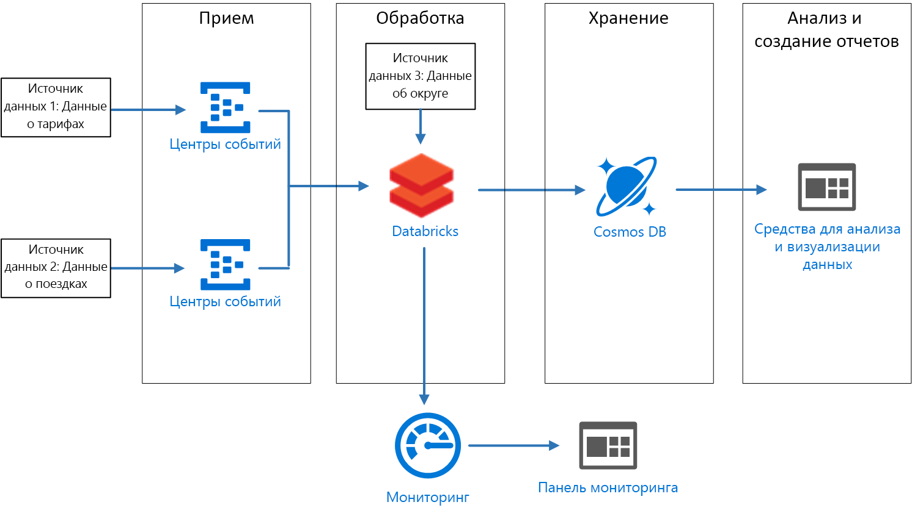
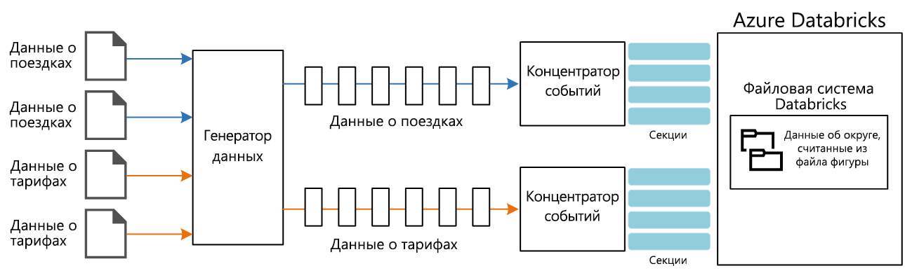

# <a name="create-a-stream-processing-pipeline-with-azure-databricks"></a><span data-ttu-id="a50e6-103">Создание конвейера обработки потоков данных с помощью Azure Databricks</span><span class="sxs-lookup"><span data-stu-id="a50e6-103">Create a stream processing pipeline with Azure Databricks</span></span>

<span data-ttu-id="a50e6-104">На схеме эталонной архитектуры представлен сквозной конвейер [обработки потоков данных](/azure/architecture/data-guide/big-data/real-time-processing).</span><span class="sxs-lookup"><span data-stu-id="a50e6-104">This reference architecture shows an end-to-end [stream processing](/azure/architecture/data-guide/big-data/real-time-processing) pipeline.</span></span> <span data-ttu-id="a50e6-105">Конвейер такого типа состоит из четырех этапов: прием, обработка, сохранение, анализ и создание отчета.</span><span class="sxs-lookup"><span data-stu-id="a50e6-105">This type of pipeline has four stages: ingest, process, store, and analysis and reporting.</span></span> <span data-ttu-id="a50e6-106">В этой эталонной архитектуре конвейер принимает данные из двух источников, объединяет связанные записи из каждого потока, дополняет результат и вычисляет среднее значение в реальном времени.</span><span class="sxs-lookup"><span data-stu-id="a50e6-106">For this reference architecture, the pipeline ingests data from two sources, performs a join on related records from each stream, enriches the result, and calculates an average in real time.</span></span> <span data-ttu-id="a50e6-107">Результаты сохраняются для дальнейшего анализа.</span><span class="sxs-lookup"><span data-stu-id="a50e6-107">The results are stored for further analysis.</span></span> <span data-ttu-id="a50e6-108">[**Разверните это решение**](#deploy-the-solution).</span><span class="sxs-lookup"><span data-stu-id="a50e6-108">[**Deploy this solution**](#deploy-the-solution).</span></span>



<span data-ttu-id="a50e6-110">**Сценарий.** Компания, предоставляющая услуги такси, собирает данные о каждой поездке.</span><span class="sxs-lookup"><span data-stu-id="a50e6-110">**Scenario**: A taxi company collects data about each taxi trip.</span></span> <span data-ttu-id="a50e6-111">В этом сценарии предполагается, что данные отправляются с двух отдельных устройств.</span><span class="sxs-lookup"><span data-stu-id="a50e6-111">For this scenario, we assume there are two separate devices sending data.</span></span> <span data-ttu-id="a50e6-112">В такси установлен счетчик, который отправляет данные о каждой поездке, включая сведения о продолжительности, расстоянии, а также местах посадки и высадки.</span><span class="sxs-lookup"><span data-stu-id="a50e6-112">The taxi has a meter that sends information about each ride &mdash; the duration, distance, and pickup and dropoff locations.</span></span> <span data-ttu-id="a50e6-113">Отдельное устройство принимает платежи от клиентов и отправляет данные о тарифах.</span><span class="sxs-lookup"><span data-stu-id="a50e6-113">A separate device accepts payments from customers and sends data about fares.</span></span> <span data-ttu-id="a50e6-114">Чтобы определить тенденции роста пассажиропотока, компании нужно для каждого округа вычислить среднюю сумму чаевых на милю в реальном времени.</span><span class="sxs-lookup"><span data-stu-id="a50e6-114">To spot ridership trends, the taxi company wants to calculate the average tip per mile driven, in real time, for each neighborhood.</span></span>

## <a name="architecture"></a><span data-ttu-id="a50e6-115">Архитектура</span><span class="sxs-lookup"><span data-stu-id="a50e6-115">Architecture</span></span>

<span data-ttu-id="a50e6-116">Архитектура состоит из следующих компонентов:</span><span class="sxs-lookup"><span data-stu-id="a50e6-116">The architecture consists of the following components.</span></span>

<span data-ttu-id="a50e6-117">**Источники данных.**</span><span class="sxs-lookup"><span data-stu-id="a50e6-117">**Data sources**.</span></span> <span data-ttu-id="a50e6-118">В этой архитектуре существует два источника данных, которые создают потоки данных в реальном времени.</span><span class="sxs-lookup"><span data-stu-id="a50e6-118">In this architecture, there are two data sources that generate data streams in real time.</span></span> <span data-ttu-id="a50e6-119">Первый поток содержит сведения о поездке, а второй — о тарифах.</span><span class="sxs-lookup"><span data-stu-id="a50e6-119">The first stream contains ride information, and the second contains fare information.</span></span> <span data-ttu-id="a50e6-120">В эталонной архитектуре есть имитированный генератор данных, который считывает данные из набора статических файлов и отправляет данные в Центры событий.</span><span class="sxs-lookup"><span data-stu-id="a50e6-120">The reference architecture includes a simulated data generator that reads from a set of static files and pushes the data to Event Hubs.</span></span> <span data-ttu-id="a50e6-121">В реальном приложении источниками данных будут устройства, установленные в такси.</span><span class="sxs-lookup"><span data-stu-id="a50e6-121">The data sources in a real application would be devices installed in the taxi cabs.</span></span>

<span data-ttu-id="a50e6-122">**Центры событий Azure**.</span><span class="sxs-lookup"><span data-stu-id="a50e6-122">**Azure Event Hubs**.</span></span> <span data-ttu-id="a50e6-123">[Центры событий](/azure/event-hubs/) — это служба приема событий.</span><span class="sxs-lookup"><span data-stu-id="a50e6-123">[Event Hubs](/azure/event-hubs/) is an event ingestion service.</span></span> <span data-ttu-id="a50e6-124">В этой архитектуре используется два экземпляра службы — по одной на каждый источник данных.</span><span class="sxs-lookup"><span data-stu-id="a50e6-124">This architecture uses two event hub instances, one for each data source.</span></span> <span data-ttu-id="a50e6-125">Каждый источник данных отправляет поток данных в соответствующую службу.</span><span class="sxs-lookup"><span data-stu-id="a50e6-125">Each data source sends a stream of data to the associated event hub.</span></span>

<span data-ttu-id="a50e6-126">**Azure Databricks**.</span><span class="sxs-lookup"><span data-stu-id="a50e6-126">**Azure Databricks**.</span></span> <span data-ttu-id="a50e6-127">[Databricks](/azure/azure-databricks/) — это платформа аналитики на основе Apache Spark, оптимизированная для платформы облачных служб Microsoft Azure.</span><span class="sxs-lookup"><span data-stu-id="a50e6-127">[Databricks](/azure/azure-databricks/) is an Apache Spark-based analytics platform optimized for the Microsoft Azure cloud services platform.</span></span> <span data-ttu-id="a50e6-128">Databricks используется для корреляции данных о поездке на такси и тарифах, а также для дополнения коррелированных данных сведениями об округе, хранящимися в файловой системе Databricks.</span><span class="sxs-lookup"><span data-stu-id="a50e6-128">Databricks is used to correlate of the taxi ride and fare data, and also to enrich the correlated data with neighborhood data stored in the Databricks file system.</span></span>

<span data-ttu-id="a50e6-129">**Cosmos DB**.</span><span class="sxs-lookup"><span data-stu-id="a50e6-129">**Cosmos DB**.</span></span> <span data-ttu-id="a50e6-130">Выходные данные задания Azure Databricks будут представлять собой последовательность записей, которые вносятся в [Cosmos DB](/azure/cosmos-db/) с помощью API Cassandra.</span><span class="sxs-lookup"><span data-stu-id="a50e6-130">The output from Azure Databricks job is a series of records, which are written to [Cosmos DB](/azure/cosmos-db/) using the Cassandra API.</span></span> <span data-ttu-id="a50e6-131">Мы используем API Cassandra, потому что этот интерфейс поддерживает моделирование данных временных рядов.</span><span class="sxs-lookup"><span data-stu-id="a50e6-131">The Cassandra API is used because it supports time series data modeling.</span></span>

<span data-ttu-id="a50e6-132">**Azure Log Analytics**.</span><span class="sxs-lookup"><span data-stu-id="a50e6-132">**Azure Log Analytics**.</span></span> <span data-ttu-id="a50e6-133">Данные журнала приложений, собранные [Azure Monitor](/azure/monitoring-and-diagnostics/), хранятся в [рабочей области Log Analytics](/azure/log-analytics).</span><span class="sxs-lookup"><span data-stu-id="a50e6-133">Application log data collected by [Azure Monitor](/azure/monitoring-and-diagnostics/) is stored in a [Log Analytics workspace](/azure/log-analytics).</span></span> <span data-ttu-id="a50e6-134">Вы можете использовать запросы Log Analytics для анализа и визуализации метрик, а также просмотра сообщений журнала, чтобы выявить проблемы в приложении.</span><span class="sxs-lookup"><span data-stu-id="a50e6-134">Log Analytics queries can be used to analyze and visualize metrics and inspect log messages to identify issues within the application.</span></span>

## <a name="data-ingestion"></a><span data-ttu-id="a50e6-135">Прием данных</span><span class="sxs-lookup"><span data-stu-id="a50e6-135">Data ingestion</span></span>

<span data-ttu-id="a50e6-136">Для имитации источника данных в этой эталонной архитектуре используется набор данных<sup>[[1]](#note1)</sup> [New York City Taxi Data](https://uofi.app.box.com/v/NYCtaxidata/folder/2332218797) (Данные о поездках в такси в Нью-Йорке).</span><span class="sxs-lookup"><span data-stu-id="a50e6-136">To simulate a data source, this reference architecture uses the [New York City Taxi Data](https://uofi.app.box.com/v/NYCtaxidata/folder/2332218797) dataset<sup>[[1]](#note1)</sup>.</span></span> <span data-ttu-id="a50e6-137">Этот набор содержит данные о поездках в такси в Нью-Йорке за 4 года (2010&ndash;2013).</span><span class="sxs-lookup"><span data-stu-id="a50e6-137">This dataset contains data about taxi trips in New York City over a four-year period (2010 &ndash; 2013).</span></span> <span data-ttu-id="a50e6-138">Он содержит два типа записей: данные о поездке и данные о тарифе.</span><span class="sxs-lookup"><span data-stu-id="a50e6-138">It contains two types of record: Ride data and fare data.</span></span> <span data-ttu-id="a50e6-139">Данные о поездках включают сведения о продолжительности поездки, расстоянии, а также местах посадки и высадки.</span><span class="sxs-lookup"><span data-stu-id="a50e6-139">Ride data includes trip duration, trip distance, and pickup and dropoff location.</span></span> <span data-ttu-id="a50e6-140">Данные о тарифах включают сведения о тарифе, налоге и сумме чаевых.</span><span class="sxs-lookup"><span data-stu-id="a50e6-140">Fare data includes fare, tax, and tip amounts.</span></span> <span data-ttu-id="a50e6-141">В обоих типах записей есть стандартные поля: номер медальона, лицензия на право вождения и код организации.</span><span class="sxs-lookup"><span data-stu-id="a50e6-141">Common fields in both record types include medallion number, hack license, and vendor ID.</span></span> <span data-ttu-id="a50e6-142">Вместе эти три поля позволяют уникально идентифицировать такси и водителя.</span><span class="sxs-lookup"><span data-stu-id="a50e6-142">Together these three fields uniquely identify a taxi plus a driver.</span></span> <span data-ttu-id="a50e6-143">Данные хранятся в формате CSV.</span><span class="sxs-lookup"><span data-stu-id="a50e6-143">The data is stored in CSV format.</span></span>

> <span data-ttu-id="a50e6-144">[1] <span id="note1">Donovan, Brian; Work, Dan (2016): New York City Taxi Trip Data (2010-2013) (Брайан Донован, Дэн Уорк, 2016. Данные о поездках в такси по Нью-Йорку за 2010–2013 гг.).</span><span class="sxs-lookup"><span data-stu-id="a50e6-144">[1] <span id="note1">Donovan, Brian; Work, Dan (2016): New York City Taxi Trip Data (2010-2013).</span></span> <span data-ttu-id="a50e6-145">Иллинойсский университет в Урбане-Шампейне.</span><span class="sxs-lookup"><span data-stu-id="a50e6-145">University of Illinois at Urbana-Champaign.</span></span> <span data-ttu-id="a50e6-146">https://doi.org/10.13012/J8PN93H8</span><span class="sxs-lookup"><span data-stu-id="a50e6-146">https://doi.org/10.13012/J8PN93H8</span></span>

<span data-ttu-id="a50e6-147">Генератор данных — это приложение .NET Core, которое считывает записи и отправляет их в Центры событий Azure.</span><span class="sxs-lookup"><span data-stu-id="a50e6-147">The data generator is a .NET Core application that reads the records and sends them to Azure Event Hubs.</span></span> <span data-ttu-id="a50e6-148">Генератор отправляет данные о поездке в формате JSON, а данные о тарифах — в формате CSV.</span><span class="sxs-lookup"><span data-stu-id="a50e6-148">The generator sends ride data in JSON format and fare data in CSV format.</span></span>

<span data-ttu-id="a50e6-149">Для сегментации данных Центры событий используют [секции](/azure/event-hubs/event-hubs-features#partitions).</span><span class="sxs-lookup"><span data-stu-id="a50e6-149">Event Hubs uses [partitions](/azure/event-hubs/event-hubs-features#partitions) to segment the data.</span></span> <span data-ttu-id="a50e6-150">Они позволяют объекту-получателю считывать данные каждой секции параллельно.</span><span class="sxs-lookup"><span data-stu-id="a50e6-150">Partitions allow a consumer to read each partition in parallel.</span></span> <span data-ttu-id="a50e6-151">При отправке данных в Центры событий можно явно указать ключ секции.</span><span class="sxs-lookup"><span data-stu-id="a50e6-151">When you send data to Event Hubs, you can specify the partition key explicitly.</span></span> <span data-ttu-id="a50e6-152">В противном случае записи назначаются секциям методом циклического перебора.</span><span class="sxs-lookup"><span data-stu-id="a50e6-152">Otherwise, records are assigned to partitions in round-robin fashion.</span></span>

<span data-ttu-id="a50e6-153">В этом примере данные о поездках и тарифах должны в итоге иметь одинаковый идентификатор секции для определенного такси.</span><span class="sxs-lookup"><span data-stu-id="a50e6-153">In this scenario, ride data and fare data should end up with the same partition ID for a given taxi cab.</span></span> <span data-ttu-id="a50e6-154">Это позволит Databricks применить определенную степень параллелизма при корреляции двух потоков.</span><span class="sxs-lookup"><span data-stu-id="a50e6-154">This enables Databricks to apply a degree of parallelism when it correlates the two streams.</span></span> <span data-ttu-id="a50e6-155">Запись в секции *n* с данными о поездке будет соответствовать записи в секции *n* с данными о тарифах.</span><span class="sxs-lookup"><span data-stu-id="a50e6-155">A record in partition *n* of the ride data will match a record in partition *n* of the fare data.</span></span>



<span data-ttu-id="a50e6-157">В генераторе данных общая модель данных для обоих типов записей имеет свойство `PartitionKey`, в котором объединены `Medallion`, `HackLicense` и `VendorId`.</span><span class="sxs-lookup"><span data-stu-id="a50e6-157">In the data generator, the common data model for both record types has a `PartitionKey` property that is the concatenation of `Medallion`, `HackLicense`, and `VendorId`.</span></span>

```csharp
public abstract class TaxiData
{
    public TaxiData()
    {
    }

    [JsonProperty]
    public long Medallion { get; set; }

    [JsonProperty]
    public long HackLicense { get; set; }

    [JsonProperty]
    public string VendorId { get; set; }

    [JsonProperty]
    public DateTimeOffset PickupTime { get; set; }

    [JsonIgnore]
    public string PartitionKey
    {
        get => $"{Medallion}_{HackLicense}_{VendorId}";
    }
```

<span data-ttu-id="a50e6-158">Это свойство используется для явного предоставления ключа секции при отправке в Центры событий:</span><span class="sxs-lookup"><span data-stu-id="a50e6-158">This property is used to provide an explicit partition key when sending to Event Hubs:</span></span>

```csharp
using (var client = pool.GetObject())
{
    return client.Value.SendAsync(new EventData(Encoding.UTF8.GetBytes(
        t.GetData(dataFormat))), t.PartitionKey);
}
```

### <a name="event-hubs"></a><span data-ttu-id="a50e6-159">Центры событий;</span><span class="sxs-lookup"><span data-stu-id="a50e6-159">Event Hubs</span></span>

<span data-ttu-id="a50e6-160">Пропускная способность Центров событий вычисляется в [единицах пропускной способности](/azure/event-hubs/event-hubs-features#throughput-units).</span><span class="sxs-lookup"><span data-stu-id="a50e6-160">The throughput capacity of Event Hubs is measured in [throughput units](/azure/event-hubs/event-hubs-features#throughput-units).</span></span> <span data-ttu-id="a50e6-161">Вы можете автоматически масштабировать концентратор событий, включив [автоматическое расширение](/azure/event-hubs/event-hubs-auto-inflate). Это позволит автоматически масштабировать единицы пропускной способности в зависимости от трафика вплоть до заданного максимума.</span><span class="sxs-lookup"><span data-stu-id="a50e6-161">You can autoscale an event hub by enabling [auto-inflate](/azure/event-hubs/event-hubs-auto-inflate), which automatically scales the throughput units based on traffic, up to a configured maximum.</span></span>

## <a name="stream-processing"></a><span data-ttu-id="a50e6-162">Потоковая обработка</span><span class="sxs-lookup"><span data-stu-id="a50e6-162">Stream processing</span></span>

<span data-ttu-id="a50e6-163">В Azure Databricks обработка данных осуществляется с помощью задания.</span><span class="sxs-lookup"><span data-stu-id="a50e6-163">In Azure Databricks, data processing is performed by a job.</span></span> <span data-ttu-id="a50e6-164">Задание назначается определенному кластеру и выполняется в нем.</span><span class="sxs-lookup"><span data-stu-id="a50e6-164">The job is assigned to and runs on a cluster.</span></span> <span data-ttu-id="a50e6-165">Задание может представлять собой пользовательский код на Java или [записную книжку](https://docs.databricks.com/user-guide/notebooks/index.html) Spark.</span><span class="sxs-lookup"><span data-stu-id="a50e6-165">The job can either be custom code written in Java, or a Spark [notebook](https://docs.databricks.com/user-guide/notebooks/index.html).</span></span>

<span data-ttu-id="a50e6-166">В этой эталонной архитектуре задание представляет собой архив Java с классами, написанными на Java и Scala.</span><span class="sxs-lookup"><span data-stu-id="a50e6-166">In this reference architecture, the job is a Java archive with classes written in both Java and Scala.</span></span> <span data-ttu-id="a50e6-167">Указывая архив Java для задания Databricks, нужно выбрать класс для выполнения в кластере Databricks.</span><span class="sxs-lookup"><span data-stu-id="a50e6-167">When specifying the Java archive for a Databricks job, the class is specified for execution by the Databricks cluster.</span></span> <span data-ttu-id="a50e6-168">В этом примере метод **main** класса **com.microsoft.pnp.TaxiCabReader** содержит логику обработки данных.</span><span class="sxs-lookup"><span data-stu-id="a50e6-168">Here, the **main** method of the **com.microsoft.pnp.TaxiCabReader** class contains the data processing logic.</span></span>

### <a name="reading-the-stream-from-the-two-event-hub-instances"></a><span data-ttu-id="a50e6-169">Считывание потоков данных из двух экземпляров концентратора событий</span><span class="sxs-lookup"><span data-stu-id="a50e6-169">Reading the stream from the two event hub instances</span></span>

<span data-ttu-id="a50e6-170">Для считывания данных из двух экземпляров концентратора событий Azure в логике обработки данных используется [Spark Structured Streaming](https://spark.apache.org/docs/2.1.2/structured-streaming-programming-guide.html).</span><span class="sxs-lookup"><span data-stu-id="a50e6-170">The data processing logic uses [Spark structured streaming](https://spark.apache.org/docs/2.1.2/structured-streaming-programming-guide.html) to read from the two Azure event hub instances:</span></span>

```scala
val rideEventHubOptions = EventHubsConf(rideEventHubConnectionString)
      .setConsumerGroup(conf.taxiRideConsumerGroup())
      .setStartingPosition(EventPosition.fromStartOfStream)
    val rideEvents = spark.readStream
      .format("eventhubs")
      .options(rideEventHubOptions.toMap)
      .load

    val fareEventHubOptions = EventHubsConf(fareEventHubConnectionString)
      .setConsumerGroup(conf.taxiFareConsumerGroup())
      .setStartingPosition(EventPosition.fromStartOfStream)
    val fareEvents = spark.readStream
      .format("eventhubs")
      .options(fareEventHubOptions.toMap)
      .load
```

### <a name="enriching-the-data-with-the-neighborhood-information"></a><span data-ttu-id="a50e6-171">Дополнение данных сведениями об округе</span><span class="sxs-lookup"><span data-stu-id="a50e6-171">Enriching the data with the neighborhood information</span></span>

<span data-ttu-id="a50e6-172">Данные о поездке включают координаты широты и долготы и сведения о местах посадки и высадки.</span><span class="sxs-lookup"><span data-stu-id="a50e6-172">The ride data includes the latitude and longitude coordinates of the pick up and drop off locations.</span></span> <span data-ttu-id="a50e6-173">Хотя эти координаты и полезны, их неудобно использовать для анализа.</span><span class="sxs-lookup"><span data-stu-id="a50e6-173">While these coordinates are useful, they are not easily consumed for analysis.</span></span> <span data-ttu-id="a50e6-174">Таким образом, эти данные дополняются сведениями об округе, считанными из [файла фигуры](https://en.wikipedia.org/wiki/Shapefile).</span><span class="sxs-lookup"><span data-stu-id="a50e6-174">Therefore, this data is enriched with neighborhood data that is read from a [shapefile](https://en.wikipedia.org/wiki/Shapefile).</span></span>

<span data-ttu-id="a50e6-175">Файл фигуры имеет двоичный формат, что усложняет анализ. Но в библиотеке [GeoTools](http://geotools.org/) представлены средства для работы с геопространственными данными в формате файла фигуры.</span><span class="sxs-lookup"><span data-stu-id="a50e6-175">The shapefile format is binary and not easily parsed, but the [GeoTools](http://geotools.org/) library provides tools for geospatial data that use the shapefile format.</span></span> <span data-ttu-id="a50e6-176">Эта библиотека используется в классе **com.microsoft.pnp.GeoFinder**, чтобы определить название округа на основе координат мест посадки и высадки.</span><span class="sxs-lookup"><span data-stu-id="a50e6-176">This library is used in the **com.microsoft.pnp.GeoFinder** class to determine the neighborhood name based on the pick up and drop off coordinates.</span></span>

```scala
val neighborhoodFinder = (lon: Double, lat: Double) => {
      NeighborhoodFinder.getNeighborhood(lon, lat).get()
    }
```

### <a name="joining-the-ride-and-fare-data"></a><span data-ttu-id="a50e6-177">Объединение данных о поездках и тарифах</span><span class="sxs-lookup"><span data-stu-id="a50e6-177">Joining the ride and fare data</span></span>

<span data-ttu-id="a50e6-178">Сначала выполняется преобразование данных о поездках и тарифах:</span><span class="sxs-lookup"><span data-stu-id="a50e6-178">First the ride and fare data is transformed:</span></span>

```scala
    val rides = transformedRides
      .filter(r => {
        if (r.isNullAt(r.fieldIndex("errorMessage"))) {
          true
        }
        else {
          malformedRides.add(1)
          false
        }
      })
      .select(
        $"ride.*",
        to_neighborhood($"ride.pickupLon", $"ride.pickupLat")
          .as("pickupNeighborhood"),
        to_neighborhood($"ride.dropoffLon", $"ride.dropoffLat")
          .as("dropoffNeighborhood")
      )
      .withWatermark("pickupTime", conf.taxiRideWatermarkInterval())

    val fares = transformedFares
      .filter(r => {
        if (r.isNullAt(r.fieldIndex("errorMessage"))) {
          true
        }
        else {
          malformedFares.add(1)
          false
        }
      })
      .select(
        $"fare.*",
        $"pickupTime"
      )
      .withWatermark("pickupTime", conf.taxiFareWatermarkInterval())
```

<span data-ttu-id="a50e6-179">После этого происходит объединение данных о поездке с данными о тарифах:</span><span class="sxs-lookup"><span data-stu-id="a50e6-179">And then the ride data is joined with the fare data:</span></span>

```scala
val mergedTaxiTrip = rides.join(fares, Seq("medallion", "hackLicense", "vendorId", "pickupTime"))
```

### <a name="processing-the-data-and-inserting-into-cosmos-db"></a><span data-ttu-id="a50e6-180">Обработка и вставка данных в Cosmos DB</span><span class="sxs-lookup"><span data-stu-id="a50e6-180">Processing the data and inserting into Cosmos DB</span></span>

<span data-ttu-id="a50e6-181">Вычисляется средний тариф для каждого округа за определенный интервал времени:</span><span class="sxs-lookup"><span data-stu-id="a50e6-181">The average fare amount for each neighborhood is calculated for a given time interval:</span></span>

```scala
val maxAvgFarePerNeighborhood = mergedTaxiTrip.selectExpr("medallion", "hackLicense", "vendorId", "pickupTime", "rateCode", "storeAndForwardFlag", "dropoffTime", "passengerCount", "tripTimeInSeconds", "tripDistanceInMiles", "pickupLon", "pickupLat", "dropoffLon", "dropoffLat", "paymentType", "fareAmount", "surcharge", "mtaTax", "tipAmount", "tollsAmount", "totalAmount", "pickupNeighborhood", "dropoffNeighborhood")
      .groupBy(window($"pickupTime", conf.windowInterval()), $"pickupNeighborhood")
      .agg(
        count("*").as("rideCount"),
        sum($"fareAmount").as("totalFareAmount"),
        sum($"tipAmount").as("totalTipAmount")
      )
      .select($"window.start", $"window.end", $"pickupNeighborhood", $"rideCount", $"totalFareAmount", $"totalTipAmount")
```

<span data-ttu-id="a50e6-182">Затем результат вставляется в Cosmos DB:</span><span class="sxs-lookup"><span data-stu-id="a50e6-182">Which is then inserted into Cosmos DB:</span></span>

```scala
maxAvgFarePerNeighborhood
      .writeStream
      .queryName("maxAvgFarePerNeighborhood_cassandra_insert")
      .outputMode(OutputMode.Append())
      .foreach(new CassandraSinkForeach(connector))
      .start()
      .awaitTermination()
```

## <a name="security-considerations"></a><span data-ttu-id="a50e6-183">Вопросы безопасности</span><span class="sxs-lookup"><span data-stu-id="a50e6-183">Security considerations</span></span>

<span data-ttu-id="a50e6-184">Управление доступом к рабочей области базы данных Azure осуществляется с помощью [консоли администрирования](https://docs.databricks.com/administration-guide/admin-settings/index.html).</span><span class="sxs-lookup"><span data-stu-id="a50e6-184">Access to the Azure Database workspace is controlled using the [administrator console](https://docs.databricks.com/administration-guide/admin-settings/index.html).</span></span> <span data-ttu-id="a50e6-185">В консоли администрирования предусмотрены функции для добавления пользователей, управления их разрешениями и настройки единого входа.</span><span class="sxs-lookup"><span data-stu-id="a50e6-185">The administrator console includes functionality to add users, manage user permissions, and set up single sign-on.</span></span> <span data-ttu-id="a50e6-186">Также в ней можно настроить управление доступом для рабочих областей, кластеров, заданий и таблиц.</span><span class="sxs-lookup"><span data-stu-id="a50e6-186">Access control for workspaces, clusters, jobs, and tables can also be set through the administrator console.</span></span>

### <a name="managing-secrets"></a><span data-ttu-id="a50e6-187">управление секретами;</span><span class="sxs-lookup"><span data-stu-id="a50e6-187">Managing secrets</span></span>

<span data-ttu-id="a50e6-188">В Azure Databricks предусмотрено [хранилище секретов](https://docs.azuredatabricks.net/user-guide/secrets/index.html), которое используется для хранения не только секретов, но и строк подключения, ключей доступа, имен пользователей и паролей.</span><span class="sxs-lookup"><span data-stu-id="a50e6-188">Azure Databricks includes a [secret store](https://docs.azuredatabricks.net/user-guide/secrets/index.html) that is used to store secrets, including connection strings, access keys, user names, and passwords.</span></span> <span data-ttu-id="a50e6-189">Секреты в хранилище секретов Azure Databricks секционируются по **областям**:</span><span class="sxs-lookup"><span data-stu-id="a50e6-189">Secrets within the Azure Databricks secret store are partitioned by **scopes**:</span></span>

```bash
databricks secrets create-scope --scope "azure-databricks-job"
```

<span data-ttu-id="a50e6-190">Секреты добавляются на уровне области:</span><span class="sxs-lookup"><span data-stu-id="a50e6-190">Secrets are added at the scope level:</span></span>

```bash
databricks secrets put --scope "azure-databricks-job" --key "taxi-ride"
```

> [!NOTE]
> <span data-ttu-id="a50e6-191">Вы можете использовать области, поддерживаемые Azure Key Vault, вместо стандартных областей Azure Databricks.</span><span class="sxs-lookup"><span data-stu-id="a50e6-191">An Azure Key Vault-backed scope can be used instead of the native Azure Databricks scope.</span></span> <span data-ttu-id="a50e6-192">Дополнительные сведения см. в документации по [областям, поддерживаемым Azure Key Vault](https://docs.azuredatabricks.net/user-guide/secrets/secret-scopes.html#azure-key-vault-backed-scopes).</span><span class="sxs-lookup"><span data-stu-id="a50e6-192">To learn more, see [Azure Key Vault-backed scopes](https://docs.azuredatabricks.net/user-guide/secrets/secret-scopes.html#azure-key-vault-backed-scopes).</span></span>

<span data-ttu-id="a50e6-193">В коде для получения доступа к секретам используются [соответствующие служебные программы](https://docs.databricks.com/user-guide/dev-tools/dbutils.html#secrets-utilities) Azure Databricks.</span><span class="sxs-lookup"><span data-stu-id="a50e6-193">In code, secrets are accessed via the Azure Databricks [secrets utilities](https://docs.databricks.com/user-guide/dev-tools/dbutils.html#secrets-utilities).</span></span>

## <a name="monitoring-considerations"></a><span data-ttu-id="a50e6-194">Рекомендации по мониторингу</span><span class="sxs-lookup"><span data-stu-id="a50e6-194">Monitoring considerations</span></span>

<span data-ttu-id="a50e6-195">Платформа Azure Databricks создана на основе Apache Spark и тоже использует [log4j](https://logging.apache.org/log4j/2.x/) в качестве стандартной библиотеки для ведения журналов.</span><span class="sxs-lookup"><span data-stu-id="a50e6-195">Azure Databricks is based on Apache Spark, and both use [log4j](https://logging.apache.org/log4j/2.x/) as the standard library for logging.</span></span> <span data-ttu-id="a50e6-196">Кроме использования стандартных возможностей ведения журнала, предоставляемых Apache Spark, в этой эталонной архитектуре предусматривается отправка журналов и метрик в [Azure Log Analytics](/azure/log-analytics/).</span><span class="sxs-lookup"><span data-stu-id="a50e6-196">In addition to the default logging provided by Apache Spark, this reference architecture sends logs and metrics to [Azure Log Analytics](/azure/log-analytics/).</span></span>

<span data-ttu-id="a50e6-197">Используя класс **com.microsoft.pnp.TaxiCabReader** и значения в файле **log4j.properties** вы можете настроить систему ведения журналов Apache Spark для отправки журналов в Azure Log Analytics.</span><span class="sxs-lookup"><span data-stu-id="a50e6-197">The **com.microsoft.pnp.TaxiCabReader** class configures the Apache Spark logging system to send its logs to Azure Log Analytics using the values in the **log4j.properties** file.</span></span> <span data-ttu-id="a50e6-198">Хотя сообщения средства ведения журнала Apache Spark представлены в строковом формате, для Azure Log Analytics требуется, чтобы эти сообщения были в формате JSON.</span><span class="sxs-lookup"><span data-stu-id="a50e6-198">While the Apache Spark logger messages are strings, Azure Log Analytics requires log messages to be formatted as JSON.</span></span> <span data-ttu-id="a50e6-199">Класс **com.microsoft.pnp.log4j.LogAnalyticsAppender** позволяет преобразовать такие сообщения в формат JSON:</span><span class="sxs-lookup"><span data-stu-id="a50e6-199">The **com.microsoft.pnp.log4j.LogAnalyticsAppender** class transforms these messages to JSON:</span></span>

```scala

    @Override
    protected void append(LoggingEvent loggingEvent) {
        if (this.layout == null) {
            this.setLayout(new JSONLayout());
        }

        String json = this.getLayout().format(loggingEvent);
        try {
            this.client.send(json, this.logType);
        } catch(IOException ioe) {
            LogLog.warn("Error sending LoggingEvent to Log Analytics", ioe);
        }
    }

```

<span data-ttu-id="a50e6-200">В результате обработки сообщений о поездках и тарифах с помощью класса **com.microsoft.pnp.TaxiCabReader** некоторые сообщения могу иметь неправильный формат и поэтому быть недопустимыми.</span><span class="sxs-lookup"><span data-stu-id="a50e6-200">As the **com.microsoft.pnp.TaxiCabReader** class processes ride and fare messages, it's possible that either one may be malformed and therefore not valid.</span></span> <span data-ttu-id="a50e6-201">В рабочей среде нужно проанализировать такие сообщения, чтобы выявить проблему с источниками данных и быстро решить ее для предотвращения потери данных.</span><span class="sxs-lookup"><span data-stu-id="a50e6-201">In a production environment, it's important to analyze these malformed messages to identify a problem with the data sources so it can be fixed quickly to prevent data loss.</span></span> <span data-ttu-id="a50e6-202">Класс **com.microsoft.pnp.TaxiCabReader** позволяет зарегистрировать накопитель Apache Spark, который отслеживает количество записей о поездках и тарифах в неправильном формате.</span><span class="sxs-lookup"><span data-stu-id="a50e6-202">The **com.microsoft.pnp.TaxiCabReader** class registers an Apache Spark Accumulator that keeps track of the number of malformed fare and ride records:</span></span>

```scala
    @transient val appMetrics = new AppMetrics(spark.sparkContext)
    appMetrics.registerGauge("metrics.malformedrides", AppAccumulators.getRideInstance(spark.sparkContext))
    appMetrics.registerGauge("metrics.malformedfares", AppAccumulators.getFareInstance(spark.sparkContext))
    SparkEnv.get.metricsSystem.registerSource(appMetrics)
```

<span data-ttu-id="a50e6-203">Для отправки метрик Apache Spark использует библиотеку Dropwizard. Но некоторые стандартные поля метрик Dropwizard несовместимы с Azure Log Analytics.</span><span class="sxs-lookup"><span data-stu-id="a50e6-203">Apache Spark uses the Dropwizard library to send metrics, and some of the native Dropwizard metrics fields are incompatible with Azure Log Analytics.</span></span> <span data-ttu-id="a50e6-204">Поэтому в эталонной архитектуре предусмотрены пользовательские приемник и средство формирования отчетов Dropwizard.</span><span class="sxs-lookup"><span data-stu-id="a50e6-204">Therefore, this reference architecture includes a custom Dropwizard sink and reporter.</span></span> <span data-ttu-id="a50e6-205">Это позволяет преобразовать метрики в формат, требуемый для Azure Log Analytics.</span><span class="sxs-lookup"><span data-stu-id="a50e6-205">It formats the metrics in the format expected by Azure Log Analytics.</span></span> <span data-ttu-id="a50e6-206">Apache Spark передает метрики вместе с пользовательскими метриками для данных о поездках и тарифах неправильного формата.</span><span class="sxs-lookup"><span data-stu-id="a50e6-206">When Apache Spark reports metrics, the custom metrics for the malformed ride and fare data are also sent.</span></span>

<span data-ttu-id="a50e6-207">Запись последней метрики в журнал рабочей области Azure Log Analytics состоит из нескольких процессов в рамках выполняемого задания Spark Structured Streaming.</span><span class="sxs-lookup"><span data-stu-id="a50e6-207">The last metric to be logged to the Azure Log Analytics workspace is the cumulative progress of the Spark Structured Streaming job progress.</span></span> <span data-ttu-id="a50e6-208">Эта задача выполняется с помощью прослушивателя, реализованного в виде класса **com.microsoft.pnp.StreamingMetricsListener**.</span><span class="sxs-lookup"><span data-stu-id="a50e6-208">This is done using a custom StreamingQuery listener implemented in the **com.microsoft.pnp.StreamingMetricsListener** class.</span></span> <span data-ttu-id="a50e6-209">Этот класс регистрируется в сеансе Apache Spark при запуске задания:</span><span class="sxs-lookup"><span data-stu-id="a50e6-209">This class is registered to the Apache Spark Session when the job runs:</span></span>

```scala
spark.streams.addListener(new StreamingMetricsListener())
```

<span data-ttu-id="a50e6-210">В среде выполнения Apache Spark методы в StreamingMetricsListener вызываются при каждом событии структурированной потоковой передачи. При этом также отправляются сообщения и метрики журнала в рабочую область Azure Log Analytics.</span><span class="sxs-lookup"><span data-stu-id="a50e6-210">The methods in the StreamingMetricsListener are called by the Apache Spark runtime whenever a structured steaming event occurs, sending log messages and metrics to the Azure Log Analytics workspace.</span></span> <span data-ttu-id="a50e6-211">Для мониторинга приложения вы можете использовать следующие запросы в своей рабочей области:</span><span class="sxs-lookup"><span data-stu-id="a50e6-211">You can use the following queries in your workspace to monitor the application:</span></span>

### <a name="latency-and-throughput-for-streaming-queries"></a><span data-ttu-id="a50e6-212">Задержка и пропускная способность для запросов потоковой передачи</span><span class="sxs-lookup"><span data-stu-id="a50e6-212">Latency and throughput for streaming queries</span></span>

```shell
taxijob_CL
| where TimeGenerated > startofday(datetime(<date>)) and TimeGenerated < endofday(datetime(<date>))
| project  mdc_inputRowsPerSecond_d, mdc_durationms_triggerExecution_d
| render timechart
```

### <a name="exceptions-logged-during-stream-query-execution"></a><span data-ttu-id="a50e6-213">Исключения, зарегистрированные при выполнении запроса потоковой передачи</span><span class="sxs-lookup"><span data-stu-id="a50e6-213">Exceptions logged during stream query execution</span></span>

```shell
taxijob_CL
| where TimeGenerated > startofday(datetime(<date>)) and TimeGenerated < endofday(datetime(<date>))
| where Level contains "Error"
```

### <a name="accumulation-of-malformed-fare-and-ride-data"></a><span data-ttu-id="a50e6-214">Сбор данных неправильного формата о поездках и тарифах</span><span class="sxs-lookup"><span data-stu-id="a50e6-214">Accumulation of malformed fare and ride data</span></span>

```shell
SparkMetric_CL
| where TimeGenerated > startofday(datetime(<date>)) and TimeGenerated < endofday(datetime(<date>))
| render timechart
| where name_s contains "metrics.malformedrides"

SparkMetric_CL
| where TimeGenerated > startofday(datetime(<date>)) and TimeGenerated < endofday(datetime(<date>))
| render timechart
| where name_s contains "metrics.malformedfares"
```

### <a name="job-execution-to-trace-resiliency"></a><span data-ttu-id="a50e6-215">Данные о выполнении задания для трассировки устойчивости</span><span class="sxs-lookup"><span data-stu-id="a50e6-215">Job execution to trace resiliency</span></span>

```shell
SparkMetric_CL
| where TimeGenerated > startofday(datetime(<date>)) and TimeGenerated < endofday(datetime(<date>))
| render timechart
| where name_s contains "driver.DAGScheduler.job.allJobs"
```

## <a name="deploy-the-solution"></a><span data-ttu-id="a50e6-216">Развертывание решения</span><span class="sxs-lookup"><span data-stu-id="a50e6-216">Deploy the solution</span></span>

<span data-ttu-id="a50e6-217">Чтобы выполнить развертывание и запуск эталонной реализации, выполните действия, описанные в [файле сведений на GitHub](https://github.com/mspnp/azure-databricks-streaming-analytics).</span><span class="sxs-lookup"><span data-stu-id="a50e6-217">To the deploy and run the reference implementation, follow the steps in the [GitHub readme](https://github.com/mspnp/azure-databricks-streaming-analytics).</span></span>

