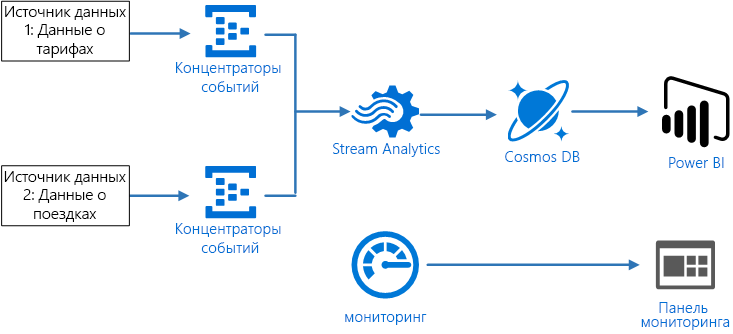
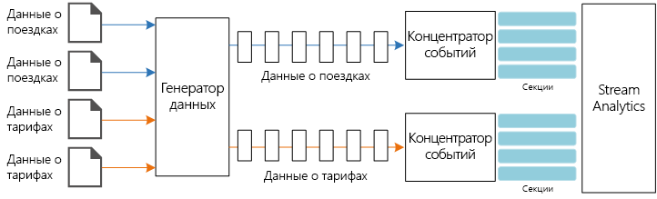
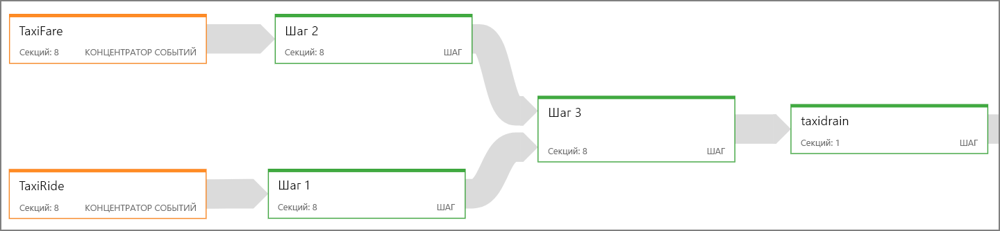
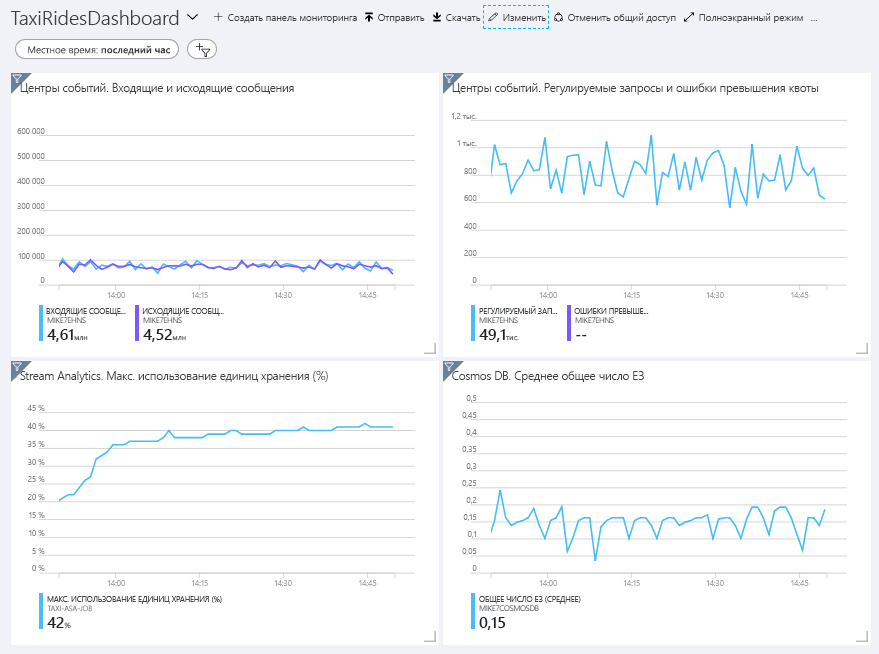
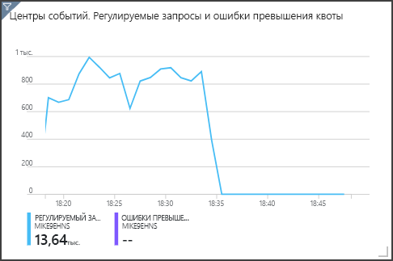

# <a name="create-a-stream-processing-pipeline-with-azure-stream-analytics"></a>Создание конвейера обработки потоков данных с помощью Azure Stream Analytics

На схеме эталонной архитектуры представлен сквозной конвейер [обработки потоков данных](/azure/architecture/data-guide/big-data/real-time-processing). Конвейер принимает данные из двух источников, сопоставляет записи в двух потоках и вычисляет скользящее среднее за определенный промежуток времени. Результаты сохраняются для дальнейшего анализа.

Эталонную реализацию для этой архитектуры можно найти на сайте [GitHub][github].



**Сценарий.** Компания, предоставляющая услуги такси, собирает данные о каждой поездке. В этом сценарии предполагается, что данные отправляются с двух отдельных устройств. В такси установлен счетчик, который отправляет данные о каждой поездке, включая сведения о продолжительности, расстоянии, а также местах посадки и высадки. Отдельное устройство принимает платежи от клиентов и отправляет данные о тарифах. Компании необходимо вычислить среднюю сумму чаевых на милю в реальном времени, чтобы определить тенденции.

## <a name="architecture"></a>Архитектура

Архитектура состоит из следующих компонентов:

**Источники данных.** В этой архитектуре существует два источника данных, которые создают потоки данных в реальном времени. Первый поток содержит сведения о поездке, а второй — о тарифах. В эталонной архитектуре есть имитированный генератор данных, который считывает данные из набора статических файлов и отправляет данные в Центры событий. В реальном приложении источниками данных будут устройства, установленные в такси.

**Центры событий Azure**. [Центры событий](/azure/event-hubs/) — это служба приема событий. В этой архитектуре используется два экземпляра службы — по одной на каждый источник данных. Каждый источник данных отправляет поток данных в соответствующую службу.

**Azure Stream Analytics**. [Stream Analytics](/azure/stream-analytics/) — это модуль обработки событий. Задание Stream Analytics считывает потоки данных из двух экземпляров и обрабатывает эти потоки.

**Cosmos DB**. Выходные данные задания Stream Analytics — это набор записей, которые регистрируются в виде документов JSON в базе данных документов Cosmos DB.

**Microsoft Power BI**. Power BI — набор средств бизнес-аналитики для анализа информации о бизнесе. В нашей архитектуре данные загружаются из Cosmos DB. Благодаря этому пользователи могут выполнять анализ полного набора собранных исторических данных. Также результаты можно передать в виде потока прямо из Stream Analytics в Power BI, чтобы просмотреть данные в реальном времени. Дополнительные сведения см. в статье [Потоковая передача в реальном времени в Power BI](/power-bi/service-real-time-streaming).

**Azure Monitor**. [Azure Monitor](/azure/monitoring-and-diagnostics/) собирает метрики производительности о службах Azure, развернутых в решении. Отобразив эти данные в визуализации на панели мониторинга, можно получить полезные сведения о работоспособности решения.

## <a name="data-ingestion"></a>Прием данных

<!-- markdownlint-disable MD033 MD034 -->

Для имитации источника данных в этой эталонной архитектуре используется набор данных<sup>[[1]](#note1)</sup> [New York City Taxi Data](https://uofi.app.box.com/v/NYCtaxidata/folder/2332218797) (Данные о поездках в такси в Нью-Йорке). Этот набор содержит данные о поездках в такси в Нью-Йорке за 4 года (2010&ndash;2013). Он содержит два типа записей: данные о поездке и данные о тарифе. Данные о поездках включают сведения о продолжительности поездки, расстоянии, а также местах посадки и высадки. Данные о тарифах включают сведения о тарифе, налоге и сумме чаевых. В обоих типах записей есть стандартные поля: номер медальона, лицензия на право вождения и код организации. Вместе эти три поля позволяют уникально идентифицировать такси и водителя. Данные хранятся в формате CSV.

[1] <span id="note1">Donovan, Brian; Work, Dan (2016): New York City Taxi Trip Data (2010-2013) (Брайан Донован, Дэн Уорк, 2016. Данные о поездках в такси по Нью-Йорку за 2010–2013 гг.). Иллинойсский университет в Урбане-Шампейне. https://doi.org/10.13012/J8PN93H8

<!-- markdownlint-enable MD033 MD034 -->

Генератор данных — это приложение .NET Core, которое считывает записи и отправляет их в Центры событий Azure. Генератор отправляет данные о поездке в формате JSON, а данные о тарифах — в формате CSV.

Для сегментации данных Центры событий используют [секции](/azure/event-hubs/event-hubs-features#partitions). Они позволяют объекту-получателю считывать данные каждой секции параллельно. При отправке данных в Центры событий можно явно указать ключ секции. В противном случае записи назначаются секциям методом циклического перебора.

В нашем примере данные о поездках и тарифах должны в итоге иметь одинаковый идентификатор секции для определенного такси. Это позволит Stream Analytics применить определенную степень параллелизма при сопоставлении двух потоков. Запись в секции *n* с данными о поездке будет соответствовать записи в секции *n* с данными о тарифах.



В генераторе данных общая модель данных для обоих типов записей имеет свойство `PartitionKey`, в котором объединены `Medallion`, `HackLicense` и `VendorId`.

```csharp
public abstract class TaxiData
{
    public TaxiData()
    {
    }

    [JsonProperty]
    public long Medallion { get; set; }

    [JsonProperty]
    public long HackLicense { get; set; }

    [JsonProperty]
    public string VendorId { get; set; }

    [JsonProperty]
    public DateTimeOffset PickupTime { get; set; }

    [JsonIgnore]
    public string PartitionKey
    {
        get => $"{Medallion}_{HackLicense}_{VendorId}";
    }
```

Это свойство используется для явного предоставления ключа секции при отправке в Центры событий:

```csharp
using (var client = pool.GetObject())
{
    return client.Value.SendAsync(new EventData(Encoding.UTF8.GetBytes(
        t.GetData(dataFormat))), t.PartitionKey);
}
```

## <a name="stream-processing"></a>Потоковая обработка

Задание обработки потока определяется с помощью SQL-запроса в несколько отдельных шагов. На первых двух шагах просто выбираются записи из двух входных потоков.

```sql
WITH
Step1 AS (
    SELECT PartitionId,
           TRY_CAST(Medallion AS nvarchar(max)) AS Medallion,
           TRY_CAST(HackLicense AS nvarchar(max)) AS HackLicense,
           VendorId,
           TRY_CAST(PickupTime AS datetime) AS PickupTime,
           TripDistanceInMiles
    FROM [TaxiRide] PARTITION BY PartitionId
),
Step2 AS (
    SELECT PartitionId,
           medallion AS Medallion,
           hack_license AS HackLicense,
           vendor_id AS VendorId,
           TRY_CAST(pickup_datetime AS datetime) AS PickupTime,
           tip_amount AS TipAmount
    FROM [TaxiFare] PARTITION BY PartitionId
),
```

На следующем шаге эти два входных потока объединяются для выбора совпадающих записей из каждого потока.

```sql
Step3 AS (
  SELECT
         tr.Medallion,
         tr.HackLicense,
         tr.VendorId,
         tr.PickupTime,
         tr.TripDistanceInMiles,
         tf.TipAmount
    FROM [Step1] tr
    PARTITION BY PartitionId
    JOIN [Step2] tf PARTITION BY PartitionId
      ON tr.Medallion = tf.Medallion
     AND tr.HackLicense = tf.HackLicense
     AND tr.VendorId = tf.VendorId
     AND tr.PickupTime = tf.PickupTime
     AND tr.PartitionId = tf.PartitionId
     AND DATEDIFF(minute, tr, tf) BETWEEN 0 AND 15
)
```

Этот запрос объединяет записи в набор полей, которые уникально идентифицируют совпадающие записи (Medallion, HackLicense, VendorId и PickupTime). Инструкция `JOIN` также содержит идентификатор секции. Как уже упоминалось, преимущество состоит в том, что совпадающие записи всегда имеют одинаковый идентификатор секции в этом сценарии.

В Stream Analytics объединения являются *темпоральными*, то есть записи объединяются в пределах определенного временного окна. В противном случае задание может бесконечно ожидать сопоставления. Функция [DATEDIFF](https://msdn.microsoft.com/azure/stream-analytics/reference/join-azure-stream-analytics) указывает, насколько две совпадающих записи могут быть разделены по времени для сопоставления.

На последнем шаге задания вычисляется средняя сумма чаевых на милю, сгруппированных по "прыгающему" окну в 5 минут.

```sql
SELECT System.Timestamp AS WindowTime,
       SUM(tr.TipAmount) / SUM(tr.TripDistanceInMiles) AS AverageTipPerMile
  INTO [TaxiDrain]
  FROM [Step3] tr
  GROUP BY HoppingWindow(Duration(minute, 5), Hop(minute, 1))
```

Stream Analytics предоставляет несколько [функций обработки методом окна](/azure/stream-analytics/stream-analytics-window-functions). "Прыгающее" окно перемещается вперед во времени в рамках фиксированного периода, в нашем примере — на 1 минуту за прыжок. Результатом будет вычисление скользящего среднего за последние 5 минут.

В показанной здесь архитектуре в Cosmos DB сохраняются только результаты задания Stream Analytics. Для сценария с большими данными используйте также функцию [Сбор](/azure/event-hubs/event-hubs-capture-overview) в Центрах событий, чтобы сохранять необработанные данные о событиях в хранилище BLOB-объектов Azure. Сохранение необработанных данных позволит вам в дальнейшем выполнять пакетные запросы к данным журнала, чтобы получить новые полезные сведения из этих данных.

## <a name="scalability-considerations"></a>Вопросы масштабируемости

### <a name="event-hubs"></a>Центры событий;

Пропускная способность Центров событий вычисляется в [единицах пропускной способности](/azure/event-hubs/event-hubs-features#throughput-units). Вы можете автоматически масштабировать концентратор событий, включив [автоматическое расширение](/azure/event-hubs/event-hubs-auto-inflate). Это позволит автоматически масштабировать единицы пропускной способности в зависимости от трафика вплоть до заданного максимума.

### <a name="stream-analytics"></a>Stream Analytics

В Stream Analytics вычислительные ресурсы, выделенные для задания, измеряются в единицах потоковой передачи. Задания Stream Analytics лучше всего масштабировать, если оно может выполняться параллельно. Таким образом, Stream Analytics сможет распределять задания между несколькими вычислительными узлами.

Для входных данных Центров событий используйте ключевое слово `PARTITION BY`, чтобы секционировать задание Stream Analytics. Данные будут разделены на подмножества на основе секций Центров событий.

Для функций обработки методом окна и временных объединений требуются дополнительные единицы потоковой передачи. По возможности используйте `PARTITION BY` так, чтобы каждая секция обрабатывалась отдельно. Дополнительные сведения см. в статье [Обзор и настройка единиц потоковой передачи](/azure/stream-analytics/stream-analytics-streaming-unit-consumption#windowed-aggregates).

Если невозможно параллелизовать все задание Stream Analytics, попробуйте разбить его на несколько шагов, начиная с одного или нескольких параллельных шагов. Так первые шаги можно будет выполнить параллельно. Например, как в этой эталонной архитектуре:

- Шаги 1 и 2 — это простые инструкции `SELECT`, которые выбирают записи из одной секции.
- На шаге 3 выполняется секционированное объединение двух входных потоков. На этом шаге используется преимущество, заключающееся в том, что совпадающие записи имеют один и тот же ключ секции. Поэтому у них всегда будет одинаковый идентификатор секции в каждом входном потоке.
- На шаге 4 выполняется статистическое вычисление для всех секций. Этот шаг нельзя выполнить параллельно.

Используйте [схему заданий](/azure/stream-analytics/stream-analytics-job-diagram-with-metrics) в Stream Analytics, чтобы просмотреть, сколько секций назначено каждому шагу в задании. Ниже показана схема заданий для этой эталонной архитектуры:



### <a name="cosmos-db"></a>База данных Cosmos

Пропускная способность для Cosmos DB измеряется в [единицах запроса](/azure/cosmos-db/request-units) (RU). Чтобы масштабировать контейнер Cosmos DB на более чем 10 000 единиц запросов, необходимо указать [ключ секции](/azure/cosmos-db/partition-data) при создании контейнера и добавить этот ключ в каждый документ.

В этой эталонной архитектуре новые документы создаются только раз в минуту (интервал "прыгающего" окна), поэтому требования к пропускной способности довольно низкие. По этой причине нет необходимости назначать ключ секции в этом сценарии.

## <a name="monitoring-considerations"></a>Рекомендации по мониторингу

Для любого решения обработки потоков данных очень важно отслеживать производительность и работоспособность системы. [Azure Monitor](/azure/monitoring-and-diagnostics/) собирает журналы метрик и диагностики для служб Azure, используемых в этой архитектуре. Служба Azure Monitor встроена в платформу Azure и не требует написания дополнительного кода в приложении.

Любой из следующих сигналов предупреждения указывает на то, что нужно масштабировать соответствующий ресурс Azure:

- Служба "Центры событий" регулирует запросы или указывает на то, что показатели близки к превышению дневной квоты сообщений.
- Задание Stream Analytics постоянно использует более 80 % выделенных единиц потоковой передачи.
- Cosmos DB начинает регулировать запросы.

Эталонная архитектура включает пользовательскую панель мониторинга, которая развертывается на портале Azure. Когда архитектура будет развернута, вы сможете просмотреть панель мониторинга, открыв [портал Azure](https://portal.azure.com) и выбрав `TaxiRidesDashboard` в списке панелей мониторинга. Дополнительные сведения о создании и развертывании пользовательских панелей мониторинга см. в статье [Создание панелей мониторинга Azure программными средствами](/azure/azure-portal/azure-portal-dashboards-create-programmatically).

На следующем изображении показана панель мониторинга приблизительно через час после запуска задания Stream Analytics.



На внизу слева показано, что использование единиц потоковой передачи для задания Stream Analytics повышается в течение первых 15 минут и затем снижается. Это стандартное развитие событий, так как задание достигает устойчивого состояния.

Обратите внимание на то, что служба "Центры событий" регулирует запросы, как показано вверху справа. Случайно отрегулированный запрос не является проблемой, так как клиентский пакет SDK службы "Центры событий" автоматически осуществляет новую попытку при получении ошибки регулирования. Но если ошибки регулирования повторяются, значит службе требуются дополнительные единицы пропускной способности. На следующей диаграмме показан тестовый запуск с использованием функции автоматического расширения в службе "Центры событий", которая автоматически масштабирует единицы пропускной способности при необходимости.



Функция автоматического расширения включена приблизительно в 06:35. Вы можете заметить снижение числа пакетов в регулируемых запросах, так как служба "Центры событий" автоматически масштабируется до трех единиц пропускной способности.

Интересно, что это побочный эффект на увеличение использования единиц SU в задании Stream Analytics. При регулировании в службе "Центры событий" искусственно снизилась скорость приема данных для задания Stream Analytics. Довольно часто бывает так, что при устранении одной проблемы с производительностью возникает другая. В таком случае проблему можно решить, выделив дополнительные единицы потоковой передачи для задания Stream Analytics.

## <a name="deploy-the-solution"></a>Развертывание решения

Чтобы выполнить развертывание и запуск эталонной реализации, выполните действия, описанные в [файле сведений на GitHub][github].

[github]: https://github.com/mspnp/reference-architectures/tree/master/data/streaming_asa
