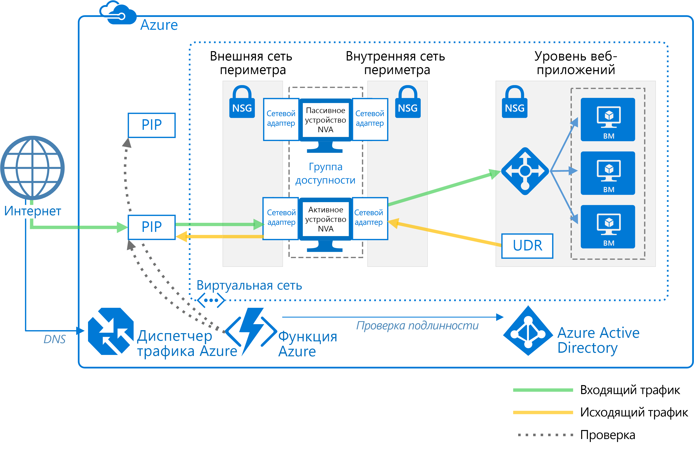

# Развертывание высокодоступных виртуальных сетевых модулейDeploy highly available network virtual appliances

В этой статье показано, как развернуть набор виртуальных сетевых модулей (NVA) для обеспечения высокой доступности в Azure.This article shows how to deploy a set of network virtual appliances (NVAs) for high availability in Azure. Виртуальный сетевой модуль обычно используется для управления передачей сетевого трафика из сети периметра к другим сетям и подсетям.An NVA is typically used to control the flow of network traffic from a perimeter network, also known as a DMZ, to other networks or subnets. Дополнительные сведения о реализации сети периметра в Azure см. в статье [Облачные службы Microsoft Cloud и сетевая безопасность][cloud-security].To learn about implementing a DMZ in Azure, see [Microsoft cloud services and network security][cloud-security]. Статья включает примеры архитектуры для передачи входящего и исходящего трафика по отдельности и вместе.The article includes example architectures for ingress only, egress only, and both ingress and egress.

**Предварительные требования:** В этой статье предполагается, что у вас есть базовое представление о сети Azure, [подсистемах балансировки нагрузки Azure][lb-overview] и [определяемых пользователем маршрутах][udr-overview].**Prerequisites:** This article assumes a basic understanding of Azure networking, [Azure load balancers][lb-overview], and [user-defined routes][udr-overview] (UDRs).

## Схемы архитектурыArchitecture diagrams

Виртуальные сетевые модули можно развернуть в сеть периметра с разными архитектурами.An NVA can be deployed to a DMZ in many different architectures. На следующем рисунке показан пример использования [одного виртуального сетевого модуля][nva-scenario] для входящего трафика.For example, the following figure illustrates the use of a [single NVA][nva-scenario] for ingress.

![[0]][0]![[0]][0]

В этой архитектуре виртуальный сетевой модуль позволяет установить границу в виде безопасной сети путем проверки всего входящего и исходящего сетевого трафика и передачи трафика, соответствующего правилам безопасности сети.In this architecture, the NVA provides a secure network boundary by checking all inbound and outbound network traffic and passing only the traffic that meets network security rules. Тем не менее тот факт, что весь сетевой трафик проходит через NVA, означает, что NVA является единой точкой отказа в сети.However, the fact that all network traffic must pass through the NVA means that the NVA is a single point of failure in the network. При сбое в работе NVA путь для сетевого трафика и все внутренние подсети недоступны.If the NVA fails, there is no other path for network traffic and all the back-end subnets are unavailable.

Для обеспечения высокой доступности для NVA разверните несколько модулей в группе доступности.To make an NVA highly available, deploy more than one NVA into an availability set.

В следующих примерах архитектур описаны ресурсы и конфигурации, необходимые для обеспечения высокой доступности для NVA:The following architectures describe the resources and configuration necessary for highly available NVAs:

<!-- markdownlint-disable MD033 -->

| РешениеSolution | ПреимуществаBenefits | РекомендацииConsiderations |
| --- | --- | --- |
| [Входящий трафик с NVA уровня 7][ingress-with-layer-7][Ingress with layer 7 NVAs][ingress-with-layer-7] |Все узлы NVA активныAll NVA nodes are active |Требуется NVA, который может завершать соединения и использовать SNATRequires an NVA that can terminate connections and use SNAT  Требуется отдельный набор NVA для трафика, поступающего из Интернета и AzureRequires a separate set of NVAs for traffic coming from the Internet and from Azure   Может использоваться только для трафика, внешнего по отношению к среде AzureCan only be used for traffic originating outside Azure |
| [Исходящий трафик с NVA уровня 7][egress-with-layer-7][Egress with layer 7 NVAs][egress-with-layer-7] |Все узлы NVA активныAll NVA nodes are active | Требуется NVA, который может завершить соединения и реализует преобразование адресов исходной сети (SNAT)Requires an NVA that can terminate connections and implements source network address translation (SNAT)
| [Входящий и исходящий трафик с NVA уровня 7][ingress-egress-with-layer-7][Ingress-Egress with layer 7 NVAs][ingress-egress-with-layer-7] |Все узлы активныAll nodes are active Возможность обработки трафика, созданного в AzureAble to handle traffic originated in Azure |Требуется NVA, который может завершать соединения и использовать SNATRequires an NVA that can terminate connections and use SNAT Требуется отдельный набор NVA для трафика, поступающего из Интернета и AzureRequires a separate set of NVAs for traffic coming from the Internet and from Azure |
| [Переключение PIP и определяемого пользователем маршрута][pip-udr-switch][PIP-UDR switch][pip-udr-switch] |Один набор NVA для всего трафикаSingle set of NVAs for all traffic Может обработать весь трафик (без ограничений на правила для портов)Can handle all traffic (no limit on port rules) |Шаблон "активный — пассивный"Active-passive Требуется процесс отработки отказаRequires a failover process |
| [PIP и определяемый пользователем маршрут без SNATPIP-UDR without SNAT](#pip-udr-nvas-without-snat) | Один набор NVA для всего трафикаSingle set of NVAs for all traffic Может обработать весь трафик (без ограничений на правила для портов)Can handle all traffic (no limit on port rules) Не требует настройки SNAT для входящих запросовDoes not require configuring SNAT for inbound requests |Шаблон "активный — пассивный"Active-passive Требуется процесс отработки отказаRequires a failover process Проверка и логика отработки отказа выполняются за пределами виртуальной сетиProbing and failover logic run outside the virtual network |

<!-- markdown-enable MD033 -->

## Входящий трафик с NVA уровня 7Ingress with layer 7 NVAs

На следующем рисунке показана высокодоступная архитектура, реализующая входящий трафик сети периметра за пределами балансировщика нагрузки, доступного в Интернете.The following figure shows a high availability architecture that implements an ingress DMZ behind an internet-facing load balancer. Эта архитектура предназначена для подключения к рабочим нагрузкам Azure для трафика уровня 7, например HTTP или HTTPS:This architecture is designed to provide connectivity to Azure workloads for layer 7 traffic, such as HTTP or HTTPS:

![[1]][1]![[1]][1]

Преимущество этой архитектуры состоит в том, что NVA активны и в случае сбоя одного подсистема балансировки нагрузки направляет сетевой трафик на другой.The benefit of this architecture is that all NVAs are active, and if one fails the load balancer directs network traffic to the other NVA. Оба NVA направляют трафик на внутреннюю подсистему балансировки нагрузки, и пока один из них активен, трафик по-прежнему передается.Both NVAs route traffic to the internal load balancer so as long as one NVA is active, traffic continues to flow. Виртуальные сетевые модули необходимы для завершения передачи SSL-трафика, предназначенного для виртуальных машин веб-уровня.The NVAs are required to terminate SSL traffic intended for the web tier VMs. Их невозможно расширить для обработки локального трафика, так как для этого требуется другой набор модулей с собственными сетевыми маршрутами.These NVAs cannot be extended to handle on-premises traffic because on-premises traffic requires another dedicated set of NVAs with their own network routes.

> [!NOTE]
> Эта архитектура используется в эталонных архитектурах [сети периметра между Azure и локальным центром обработки данных][dmz-on-prem] и [сети периметра между Azure и Интернетом][dmz-internet].This architecture is used in the [DMZ between Azure and your on-premises datacenter][dmz-on-prem] reference architecture and the [DMZ between Azure and the Internet][dmz-internet] reference architecture. Каждая из этих архитектур включает решение развертывания, которое вы можете использовать.Each of these reference architectures includes a deployment solution that you can use. Дополнительные сведения см. по ссылкам.Follow the links for more information.

## Исходящий трафик с NVA уровня 7Egress with layer 7 NVAs

Чтобы предоставить исходящий трафик сети периметра для исходящих запросов рабочей нагрузки Azure, можно развернуть предыдущую архитектуру.The previous architecture can be expanded to provide an egress DMZ for requests originating in the Azure workload. Следующая архитектура предназначена для обеспечения высокого уровня доступности NVA в сети периметра для трафика уровня 7, например HTTP или HTTPS:The following architecture is designed to provide high availability of the NVAs in the DMZ for layer 7 traffic, such as HTTP or HTTPS:

![[2]][2]![[2]][2]

В этой архитектуре весь исходящий трафик в Azure направляется во внутреннюю подсистему балансировки нагрузки.In this architecture, all traffic originating in Azure is routed to an internal load balancer. Подсистема балансировки нагрузки распределяет исходящие запросы между набором виртуальных сетевых модулей.The load balancer distributes outgoing requests between a set of NVAs. Эти модули направляют трафик в Интернет по отдельным общедоступным IP-адресам.These NVAs direct traffic to the Internet using their individual public IP addresses.

> [!NOTE]
> Эта архитектура используется в эталонных архитектурах [сети периметра между Azure и локальным центром обработки данных][dmz-on-prem] и [сети периметра между Azure и Интернетом][dmz-internet].This architecture is used in the [DMZ between Azure and your on-premises datacenter][dmz-on-prem] reference architecture and the [DMZ between Azure and the Internet][dmz-internet] reference architecture. Каждая из этих архитектур включает решение развертывания, которое вы можете использовать.Each of these reference architectures includes a deployment solution that you can use. Дополнительные сведения см. по ссылкам.Follow the links for more information.

## Входящий и исходящий трафик с NVA уровня 7Ingress-egress with layer 7 NVAs

В двух предыдущих архитектурах были предусмотрены отдельные сети периметра для входящего и исходящего трафика.In the two previous architectures, there was a separate DMZ for ingress and egress. На схеме следующей архитектуры представлены сведения о том, как создать сеть периметра, которая может использоваться для входящего и исходящего трафика уровня 7, например HTTP или HTTPS:The following architecture demonstrates how to create a DMZ that can be used for both ingress and egress for layer 7 traffic, such as HTTP or HTTPS:

![[4]][4]

В этой архитектуре виртуальные сетевые модули обрабатывают входящие запросы из шлюза приложений.In this architecture, the NVAs process incoming requests from the application gateway. Кроме того, они обрабатывают исходящие запросы из рабочей нагрузки виртуальных машин в пуле внутренней подсистемы балансировки нагрузки.The NVAs also process outgoing requests from the workload VMs in the back-end pool of the load balancer. Так как входящий трафик направляется шлюзом приложений, а исходящий — подсистемой балансировки нагрузки, NVA отвечают за обеспечение сходства сеансов.Because incoming traffic is routed with an application gateway and outgoing traffic is routed with a load balancer, the NVAs are responsible for maintaining session affinity. То есть шлюз приложения поддерживает сопоставление входящих и исходящих запросов. Благодаря этому он может перенаправлять правильный ответ запросившей стороне.That is, the application gateway maintains a mapping of inbound and outbound requests so it can forward the correct response to the original requestor. Однако внутренняя подсистема балансировки нагрузки не имеет доступа к сопоставлениям шлюза приложения и использует собственную логику для отправки ответов на NVA.However, the internal load balancer does not have access to the application gateway mappings, and uses its own logic to send responses to the NVAs. Подсистема балансировки нагрузки может отправить ответ на NVA, который изначально не получил запрос из шлюза приложения.It's possible the load balancer could send a response to an NVA that did not initially receive the request from the application gateway. В этом случае модули должны взаимодействовать и передавать ответ между собой, чтобы правильный модуль переслал ответ шлюзу приложений.In this case, the NVAs must communicate and transfer the response between them so the correct NVA can forward the response to the application gateway.

> [!NOTE]
> Вы также можете решить проблему асимметричной маршрутизации, настроив виртуальные системные модули таким образом, чтобы они выполняли преобразование адресов исходной сети (SNAT).You can also solve the asymmetric routing issue by ensuring the NVAs perform inbound source network address translation (SNAT). При этом исходный IP-адрес источника запросившей стороны заменяется на один из IP-адресов входящего потока NVA.This would replace the original source IP of the requestor to one of the IP addresses of the NVA used on the inbound flow. Теперь вы можете использовать несколько виртуальных системных модулей одновременно, сохраняя симметрию маршрута.This ensures that you can use multiple NVAs at a time, while preserving the route symmetry.

## Переключение PIP и определяемого пользователем маршрута с NVA уровня 4PIP-UDR switch with layer 4 NVAs

В следующем примере показана архитектура с активным и пассивным модулем,The following architecture demonstrates an architecture with one active and one passive NVA. обрабатывающая входящий и исходящий трафик для уровня 4:This architecture handles both ingress and egress for layer 4 traffic:

![[3]][3]![[3]][3]

> [!TIP]
> Полное решение для этой архитектуры доступно на сайте [GitHub][pnp-ha-nva].A complete solution for this architecture is available on [GitHub][pnp-ha-nva].

Эта архитектура подобна первой, описанной в этой статье.This architecture is similar to the first architecture discussed in this article. Она включает один NVA, принимающий и фильтрующий входящие запросы уровня 4.That architecture included a single NVA accepting and filtering incoming layer 4 requests. Кроме того, в ней добавлен второй пассивный виртуальный сетевой модуль для обеспечения высокой доступности.This architecture adds a second passive NVA to provide high availability. Если происходит сбой работы активного NVA, пассивный NVA стает активным и определяемый пользователем маршрут и PIP изменяются таким образом, чтобы указывать на сетевые адаптеры на активном NVA.If the active NVA fails, the passive NVA is made active and the UDR and PIP are changed to point to the NICs on the now active NVA. Эти изменения определяемого пользователем маршрута и PIP могут выполняться вручную или автоматически.These changes to the UDR and PIP can either be done manually or using an automated process. Автоматизированный процесс обычно является управляющей программой или другой службой мониторинга, работающей в Azure.The automated process is typically daemon or other monitoring service running in Azure. Он запрашивает проверку работоспособности активного NVA и выполняет переключение определяемого пользователем маршрута и PIP при обнаружении сбоя в работе модуля.It queries a health probe on the active NVA and performs the UDR and PIP switch when it detects a failure of the NVA.

На предыдущем рисунке показан пример кластера [ZooKeeper][zookeeper], предоставляющего высокодоступную управляющую программу.The preceding figure shows an example [ZooKeeper][zookeeper] cluster providing a high availability daemon. В пределах кластера ZooKeeper кворум узлов выбирает лидера.Within the ZooKeeper cluster, a quorum of nodes elects a leader. Если в работе лидера происходит сбой, новый выбирается среди оставшихся узлов.If the leader fails, the remaining nodes hold an election to elect a new leader. Узел-лидер выполняет роль управляющей программы, которая запрашивает проверку работоспособности конечной точки для NVA.For this architecture, the leader node executes the daemon that queries the health endpoint on the NVA. Если при проверке работоспособности NVA не отвечает, управляющая программа активирует пассивный модуль.If the NVA fails to respond to the health probe, the daemon activates the passive NVA. После этого она вызывает API REST Azure для удаления PIP из виртуального сетевого модуля, в котором произошел сбой, и привязывает его к новому активированному модулю.The daemon then calls the Azure REST API to remove the PIP from the failed NVA and attaches it to newly activated NVA. Затем она настраивает определяемый пользователем маршрут таким образом, чтобы он указывал на внутренний IP-адрес активированного модуля.The daemon then modifies the UDR to point to the newly activated NVA's internal IP address.

Не включайте узлы ZooKeeper в подсеть, доступ к которой можно получить только по маршруту, включающему NVA.Do not include the ZooKeeper nodes in a subnet that is only accessible using a route that includes the NVA. В противном случае при сбое работы модуля узлы ZooKeeper будут недоступны.Otherwise, the ZooKeeper nodes are inaccessible if the NVA fails. Если по какой-либо причине в работе управляющей программы возникнет сбой, у вас не будет доступа к узлам ZooKeeper для диагностики проблемы.Should the daemon fail for any reason, you won't be able to access any of the ZooKeeper nodes to diagnose the problem.

Чтобы ознакомиться с полным решением, включая примеры кода, просмотрите файлы в [репозитории GitHub][pnp-ha-nva].To see the complete solution including sample code, see the files in the [GitHub repository][pnp-ha-nva].

## Виртуальные сетевые модули с PIP и определяемыми пользователем маршрутами без SNATPIP-UDR NVAs without SNAT

Эта архитектура использует две виртуальные машины Azure, чтобы разместить брандмауэр NVA в активно-пассивной конфигурации, которая поддерживает автоматическую отработку отказа, но не требует преобразования исходных сетевых адресов (SNAT).This architecture uses two Azure virtual machines to host the NVA firewall in an active-passive configuration that supports automated failover but does not require Source Network Address Translation (SNAT).

> [!TIP]
> Полное решение для этой архитектуры доступно на сайте [GitHub][ha-nva-fo].A complete solution for this architecture is available on [GitHub][ha-nva-fo].

Данное решение разработано для клиентов Azure, которые не могут настроить SNAT для входящих запросов на своих брандмауэрах NVA.This solution is designed for Azure customers who cannot configure SNAT for inbound requests on their NVA firewalls. SNAT скрывает исходный IP-адрес клиента-источника.SNAT hides the original source client IP address. Если нужно внести в журнал исходные IP-адреса или использовать их в других многоуровневых компонентах безопасности, размещенных за вашими NVA, это решение предлагает базовый подход.If you need to log the original IPs or used them within other layered security components behind your NVAs, this solution offers a basic approach.

Отработка отказа записей таблицы UDR выполняется автоматически с использованием адреса для следующего перехода, для которого задан IP-адрес интерфейса на активной виртуальной машине брандмауэра NVA.The failover of UDR table entries is automated by a next-hop address set to the IP address of an interface on the active NVA firewall virtual machine. Логика автоматической отработки отказа размещена в приложении-функции, которое создается при помощи [Функций Azure](/azure/azure-functions/).The automated failover logic is hosted in a function app that you create using [Azure Functions](/azure/azure-functions/). Код отработки отказа выполняется как бессерверная функция внутри Функций Azure.The failover code runs as a serverless function inside Azure Functions. Развертывание удобное, экономически эффективное, а также легкое в обслуживании и настройке.Deployment is convenient, cost-effective, and easy to maintain and customize. Кроме того, приложение-функция размещается в Функциях Azure, поэтому оно не имеет зависимостей в виртуальной сети.In addition, the function app is hosted within Azure Functions, so it has no dependencies on the virtual network. Если изменения виртуальной сети воздействуют на брандмауэры NVA, приложение-функция продолжает выполняться независимо.If changes to the virtual network impact the NVA firewalls, the function app continues to run independently. Тестирование также является более точным, так как оно происходит за пределами виртуальной сети и использует тот же маршрут, что и входящие клиентские запросы.Testing is more accurate as well, because it takes place outside the virtual network using the same route as the inbound client requests.

Чтобы проверить доступность брандмауэра NVA, код приложения-функции выполняет тестирование одним из двух способов:To check the availability of the NVA firewall, the function app code probes it in one of two ways:

- проводит мониторинг состояния виртуальных машин, на которых размещен брандмауэр NVA;By monitoring the state of the Azure virtual machines hosting the NVA firewall.

- тестирует наличие открытых портов от брандмауэра к тыловому веб-серверу.By testing whether there is an open port through the firewall to the back-end web server. В этой конфигурации NVA должен предоставлять сокет через PIP, чтобы код приложения-функции мог выполнить тестирование.For this option, the NVA must expose a socket via PIP for the function app code to test.

Вы выбираете нужный тип пробы во время настройки приложения-функции.You choose the type of probe you want to use when you configure the function app. Чтобы ознакомиться с полным решением, включая примеры кода, просмотрите файлы в [репозитории GitHub][ha-nva-fo].To see the complete solution including sample code, see the files in the [GitHub repository][ha-nva-fo].

## Дополнительная информацияNext steps

- Узнайте, как [внедрить сеть периметра между Azure и локальным центром данных][dmz-on-prem] с помощью NVA уровня 7.Learn how to [implement a DMZ between Azure and your on-premises datacenter][dmz-on-prem] using layer-7 NVAs.
- Узнайте, как [внедрить сеть периметра между Azure и Интернетом][dmz-internet] с помощью NVA уровня 7.Learn how to [implement a DMZ between Azure and the Internet][dmz-internet] using layer-7 NVAs.
- [Устранение неполадок с сетевым виртуальным модулем в AzureTroubleshoot network virtual appliance issues in Azure](/azure/virtual-network/virtual-network-troubleshoot-nva)

<!-- links -->

[cloud-security]: /azure/best-practices-network-security
[dmz-on-prem]: ./secure-vnet-hybrid.md
[dmz-internet]: ./secure-vnet-dmz.md
[egress-with-layer-7]: #egress-with-layer-7-nvas
[ingress-with-layer-7]: #ingress-with-layer-7-nvas
[ingress-egress-with-layer-7]: #ingress-egress-with-layer-7-nvas
[lb-overview]: /azure/load-balancer/load-balancer-overview/
[nva-scenario]: /azure/virtual-network/virtual-network-scenario-udr-gw-nva/
[pip-udr-switch]: #pip-udr-switch-with-layer-4-nvas
[udr-overview]: /azure/virtual-network/virtual-networks-udr-overview/
[zookeeper]: https://zookeeper.apache.org/
[pnp-ha-nva]: https://github.com/mspnp/ha-nva
[ha-nva-fo]: https://aka.ms/ha-nva-fo

<!-- images -->

[0]: ./images/nva-ha/single-nva.png "Архитектура одного NVA"
[1]: ./images/nva-ha/l7-ingress.png "Входящий трафик уровня 7"
[2]: ./images/nva-ha/l7-ingress-egress.png "Исходящий трафик уровня 7"
[3]: ./images/nva-ha/active-passive.png "Кластер типа активный — пассивный"
[4]: ./images/nva-ha/l7-ingress-egress-ag.png
