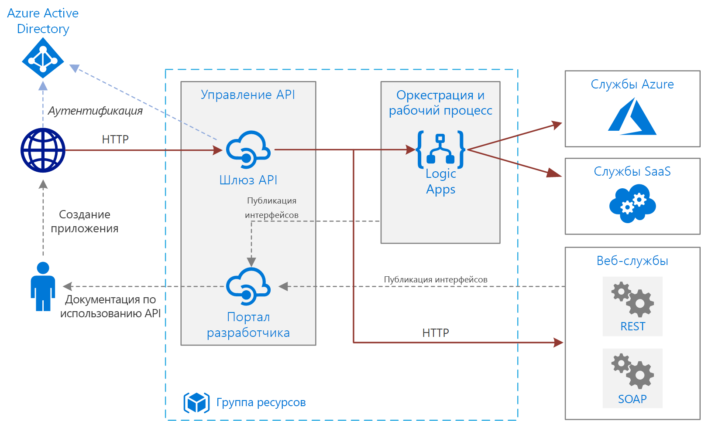

# Базовые сценарии корпоративной интеграции в Azure

Эта эталонная архитектура использует [Azure Integration Services][integration-services] для оркестрации вызовов к корпоративным серверным системам. Серверные системы могут включать в себя системы "программное обеспечение как услуга" (SaaS), службы Azure и существующие веб-службы предприятия.

Azure Integration Services — это набор служб для интеграции приложений и данных. Описываемая архитектура использует две из этих служб — [Logic Apps][logic-apps] (для оркестрации рабочих процессов) и [управление API][apim] (для создания каталогов API). Этой архитектуры достаточно для базовых сценариев интеграции, в которых рабочий процесс запускается с помощью синхронных вызовов к внутренним службам. Более сложная архитектура с использованием [очередей и событий](./queues-events.md) основывается на этой базовой архитектуре. 

## Архитектура

Архитектура состоит из следующих компонентов.

- **Серверные системы**. Справа на схеме показаны различные внутренние системы, развернутые или используемые предприятием. Сюда могут входить системы SaaS, другие службы Azure или другие веб-службы, которые предоставляют конечные точки REST или SOAP.

- **Azure Logic Apps**. [Logic Apps][logic-apps] — это бессерверная платформа для создания рабочих процессов на предприятии, которая объединяет приложения, данные и службы. В этой архитектуре приложения логики активируются с помощью HTTP-запросов. Вы также можете создавать вложенные рабочие процессы для более сложной оркестрации. Служба Logic Apps использует [соединители][logic-apps-connectors] для интеграции с часто используемыми службами. Logic Apps предлагает сотни соединителей. Также можно создавать собственные соединители.

- **Служба управления Azure API.** [Управление API][apim] — это управляемая служба, которая позволяет публиковать каталоги API HTTP, чтобы упростить их обнаружение и повторное использование. Служба управления API состоит из двух взаимосвязанных компонентов:

    - **Шлюз API**. Шлюз API принимает вызовы по протоколу HTTP и маршрутизирует их к серверным службам. 

    - **Портал разработчика**. Каждый экземпляр службы управления API Azure предоставляет доступ к [порталу разработчика][apim-dev-portal]. Этот портал позволяет разработчикам ознакомиться с документацией и примерами кода для вызова API. На портале разработчика также можно тестировать API.

    В этой архитектуре сложные API создаются путем [импорта приложений логики][apim-logic-app] в качестве API. Также можно импортировать существующие веб-службы путем [импорта спецификаций OpenAPI][apim-openapi] (Swagger) или [импорта API SOAP][apim-soap] из спецификаций языка WSDL. 

    Шлюз API помогает отделить клиентские приложения от серверной части. Например, он может изменять URL-адреса или преобразовывать запросы перед их передачей в серверную часть. Шлюз также решает многие вопросы взаимодействия, например проверку подлинности, предоставление общего доступа к ресурсам из разных источников (CORS) и кэширование ответов.

- **Azure DNS**. [Azure DNS][dns] — это служба размещения для доменов DNS. Azure DNS осуществляет разрешение имен на базе инфраструктуры Microsoft Azure. Размещая домены в Azure, вы можете управлять своими записями DNS с помощью тех же учетных данных, интерфейсов API и инструментов и оплачивать использование, как и другие службы Azure. Чтобы использовать имя личного домена, например contoso.com, создайте записи DNS, которые позволяют сопоставить это доменное имя с IP-адресом. Дополнительные сведения см. в статье о [настройке личного доменного имени в службе управления API][apim-domain].

- **Azure Active Directory (Azure AD).** Для проверки подлинности клиентов, выполняющих вызовы к шлюзу API, можно использовать службу [Azure AD][aad]. Azure AD поддерживает протокол OpenID Connect (OIDC). Клиенты получают маркер доступа от Azure AD, а шлюз API [проверяет маркер][apim-jwt] для авторизации запроса. При наличии подписки на службу управления API ценовой категории "Стандартный" или "Премиум" Azure AD также можно использовать для защиты доступа к порталу разработчика.

## Рекомендации

Ваши конкретные требования могут отличаться от показанной здесь общей архитектуры. Используйте рекомендации из этого раздела в качестве отправной точки.

### Управление API

Используйте следующие уровни управления API: "Базовый", "Стандартный", "Премиум". Эти ценовые категории предлагают соглашение об уровне обслуживания для рабочей среды и поддерживают развертывание в пределах региона Azure. Пропускная способность службы управления API измеряется в *единицах*. Каждая ценовая категория имеет предел горизонтального масштабирования. Ценовая категория "Премиум" также поддерживает развертывание в нескольких регионах Azure. Выберите уровень на основе набора функций и требуемой пропускной способности. Дополнительные сведения см. в разделах о [ценах на службу управления API][apim-pricing] и о [емкости экземпляра службы управления API Azure][apim-capacity].

Каждому экземпляру службы управления API Azure присвоено доменное имя по умолчанию, которое является поддоменом `azure-api.net` (например, `contoso.azure-api.net`). Стоит рассмотреть использование [личного домена][apim-domain] для своей организации.

### Logic Apps 

Logic Apps лучше всего работает в сценариях, не требующих малой задержки для отклика, например при выполнении асинхронных вызовов API или вызовов API средней продолжительности. Если требуется малая задержка (например, при вызове, блокирующем пользовательский интерфейс), используйте другую технологию. Например, используйте службу "Функции Azure" или веб-API, развернутый в Службе приложений Azure. Используйте службу управления API, чтобы предоставить пользователям этот API в качестве интерфейсного.

### Регион

Чтобы свести к минимуму задержки в сети, разместите службы управления API и Logic Apps в одном регионе. В общем случае следует выбирать регион, расположенный как можно ближе к пользователям (или к серверным службам).

Группа ресурсов также привязана к региону. Регион определяет, где хранить метаданные развертывания и где выполнить шаблон развертывания. Чтобы увеличить доступность во время развертывания, поместите группу ресурсов и ее ресурсы в один регион.

## Вопросы масштабируемости

Чтобы увеличить масштабируемость службы "Управление API", добавьте [политики кэширования][apim-caching] там, где это необходимо. Кэширование также помогает уменьшить нагрузку на внутренние службы.

Уровни службы управления API "Базовый", "Стандартный" и "Премиум" позволяют масштабирование в рамках региона Azure для увеличения доступной емкости. Чтобы проанализировать использование службы, в меню **метрик** выберите параметр **Capacity Metric** (Метрики емкости), а затем при необходимости увеличьте или уменьшите масштаб. Процесс обновления или масштабирования может занять от 15 до 45 минут.

Рекомендации по масштабированию службы "Управление API":

- Изучите шаблоны трафика при масштабировании. Клиентам с более изменчивыми шаблонами трафика требуется большая емкость.

- Если использование емкости постоянно превышает 66 %, это может указывать на необходимость увеличения масштаба.

- Если использование емкости постоянно не превышает 20 %, это может указывать на то, что масштаб можно уменьшить.

- Всегда выполняйте тестирование нагрузки службы управления API с использованием репрезентативной нагрузки перед включением в рабочую среду.

Ценовая категория "Премиум" позволяет развернуть экземпляр службы управления API в нескольких регионах Azure. Это позволяет применять к службе управления API соглашения о более высоких уровнях обслуживания и развертывать службы для пользователей в нескольких регионах.

Бессерверная модель Logic Apps означает, что администраторам не требуется планирование масштабируемости служб. Служба автоматически масштабируется в соответствии с потребностями.

## Вопросы доступности

См. соглашение об уровне обслуживания для каждой службы:

- [Соглашение об уровне обслуживания для службы управления API][apim-sla].
- [Соглашение об уровне обслуживания для Logic Apps][logic-apps-sla].

Если служба управления API развертывается в двух или более регионах в рамках ценовой категории "Премиум", к ней может применяться соглашение о более высоком уровне обслуживания. См. [цены на службу управления API][apim-pricing].

### Резервные копии

Регулярно выполняйте [резервное копирование][apim-backup] конфигурации службы управления API. Резервные копии необходимо хранить в расположении или регионе Azure, который отличается от региона, где развернута служба. В зависимости от [целевого времени восстановления][rto] выберите стратегию аварийного восстановления:

* При аварийном восстановлении подготовьте новый экземпляр службы управления API, восстановите в него резервную копию и перенаправьте записи DNS.

* Поддерживайте пассивный экземпляр службы управления API в другом регионе Azure. Регулярно восстанавливайте резервные копии в этот экземпляр, чтобы поддерживать его синхронизацию с активной службой. Чтобы восстановить службу во время события аварийного восстановления, вам нужно только повторно указать записи DNS. Этот подход требует дополнительных затрат (так как вы платите за пассивный экземпляр), но сокращает время восстановления. 

В приложениях логики для резервного копирования и восстановления мы рекомендуем использовать подход "конфигурация в виде кода". Поскольку приложения логики являются бессерверными, их можно быстро воссоздать из шаблонов Azure Resource Manager. Сохраните шаблоны в системе управления версиями и интегрируйте их со своим процессом непрерывной интеграции и непрерывного развертывания (CI/CD). При необходимости аварийного восстановления разверните шаблон в новом регионе.

При развертывании приложения логики в другом регионе обновите конфигурацию службы управления API. Можно обновить свойство API **Backend** (Сервер) с помощью простого скрипта PowerShell.

## Вопросы управляемости

Создайте отдельные группы ресурсов для рабочей среды, сред разработки и тестирования. Так будет проще управлять развертываниями, удалять тестовые развертывания и назначать права доступа.

При назначении ресурсов группам ресурсов учитывайте следующие факторы.

* **Жизненный цикл**. Обычно в группу ресурсов лучше объединять ресурсы с одинаковым жизненным циклом.

* **Доступ**. С помощью [управления доступом на основе ролей][rbac] (RBAC) вы можете применить политики доступа к ресурсам в группе.

* **Выставление счетов**. Вы сможете просматривать сведенные затраты для группы ресурсов.

* **Ценовая категория для службы управления API**. Для сред разработки и тестирования используйте ценовую категорию для разработчиков. Чтобы свести к минимуму затраты во время предварительной подготовки, разверните реплику рабочей среды, запустите тесты, а затем завершите работу.

### Развертывание

Для развертывания ресурсов Azure используйте [шаблоны Azure Resource Manager][arm]. Шаблоны упрощают автоматизацию развертывания с помощью PowerShell или Azure CLI.

Разместите службу управления API и любые отдельные приложения логики в собственных шаблонах Resource Manager. При использовании отдельных шаблонов можно сохранять ресурсы в системе управления версиями. Можно развернуть шаблоны вместе или по отдельности в процессе непрерывной интеграции и непрерывного развертывания.

### Версии

Каждый раз, когда вы изменяете конфигурацию приложения логики или развертываете обновление с помощью шаблона Resource Manager, Azure сохраняет копию этой версии, а также все версии, у которых есть журнал выполнения. Эти версии можно использовать для отслеживания изменений или повысить уровень версии до текущей конфигурации приложения логики. Например, можно откатить приложение логики до предыдущей версии.

Служба управления API поддерживает две различные концепции присвоения версий, которые дополняют друг друга:

* *Версии* позволяют объектам-получателям выбрать версию API в зависимости от потребностей, например версию 1, 2, бета-версию или рабочую версию.

* *Редакции* позволяют администраторам API вносить в API обратно совместимые изменения и развертывать их вместе с журналом изменений, который содержит сведения об изменениях для объектов-получателей.

Редакцию можно создать в среде разработки и развернуть в других средах с помощью шаблонов Resource Manager. Дополнительные сведения см. в статье [Публикация нескольких версий API][apim-versions].

Редакции также можно использовать для тестирования API, прежде чем изменения будут применены и станут доступными для пользователей. Однако этот метод не рекомендуется для нагрузочного или интеграционного тестирования. Вместо этого используйте отдельную тестовую или подготовительную среду.

## Диагностика и мониторинг

Вы можете использовать [Azure Monitor][monitor] для оперативного мониторинга в службе управления API и Logic Apps. Azure Monitor предоставляет сведения на основе метрик, настроенных для каждой службы и включенных по умолчанию. Дополнительные сведения можно найти в разделе 

- [Мониторинг опубликованных API][apim-monitor].
- [Мониторинг состояния, настройка ведения журнала диагностики и включение предупреждений для Azure Logic Apps.][logic-apps-monitor]

Каждая служба также содержит следующие параметры:

* Журналы Logic Apps можно передавать в [Azure Log Analytics][logic-apps-log-analytics] для более глубокого анализа и отображения на панелях мониторинга.

* Служба управления API поддерживает настройку Azure Application Insights для мониторинга DevOps.

* Служба управления API поддерживает [шаблон решения Power BI для пользовательской аналитики API][apim-pbi]. Вы можете использовать этот шаблон решения для создания собственного решения аналитики. Отчеты доступны в Power BI для бизнес-пользователей.

## Вопросы безопасности

Хотя этот список рекомендаций по безопасности не является полным, в нем можно найти некоторые соображения относительно безопасности, которые применимы именно к этой архитектуре:

* Служба управления API Azure имеет постоянный общедоступный IP-адрес. Доступ к конечным точкам Logic Apps следует разрешить только с IP-адреса службы управления API. См. дополнительные сведения об [ограничении входящих IP-адресов][logic-apps-restrict-ip].

* Используйте управление доступом на основе ролей, чтобы у пользователей были соответствующие уровни доступа.

* Обеспечьте безопасность общедоступных конечных точек API в службе управления API с помощью OAuth или OpenID Connect. Чтобы защитить общедоступные конечные точки API, настройте поставщик удостоверений и добавьте политику проверки JSON Web Token (JWT). Дополнительные сведения см. в статье [Защита API с помощью протокола OAuth 2.0 и службы управления API в Azure Active Directory][apim-oauth].

* Подключитесь ко внутренним службам из службы управления API с помощью взаимных сертификатов.

* Активируйте принудительное использование протокола HTTPS для службы управления API.

### Хранение секретов

Ни в коем случае не помещайте пароли, ключи доступа или строки подключения в систему управления версиями. Если они необходимы, используйте соответствующие методы для развертывания и защиты этих значений. 

Если для приложения логики требуются какие-либо конфиденциальные значения, которые невозможно создать с помощью соединителя, сохраните эти значения в Azure Key Vault и получите к ним доступ из шаблона Resource Manager. Используйте параметры шаблона развертывания вместе с файлами параметров для каждой среды. Дополнительные сведения см. в разделе о [параметрах безопасности и входных данных в рабочем процессе][logic-apps-secure].

В службе управления API управление секретами осуществляется с помощью объектов, которые называются *именованными значениями* или *свойствами*. Они надежно сохраняют значения, к которым можно получить доступ с помощью политик управления API. Дополнительные сведения см. в статье [Использование именованных значений в политиках управления API Azure][apim-properties].

## Рекомендации по стоимости

При выполнении вы платите за все экземпляры службы "Управление API". Если вы увеличили масштаб, но вам не нужен такой уровень производительности все время, можно уменьшить масштаб вручную или настроить [автомасштабирование][apim-autoscale].

Logic Apps использует [бессерверную](/azure/logic-apps/logic-apps-serverless-overview) модель. Cчета выставляются на основе действий и выполнения соединителей. Дополнительные сведения см. на странице с [ценами на Logic Apps](https://azure.microsoft.com/pricing/details/logic-apps/). В настоящее время нет каких-либо рекомендаций по уровню для Logic Apps.

## Дополнительная информация

Чтобы повысить надежность и масштабируемость, используйте очереди сообщений и событий для разделения серверных систем. Этот подход реализован в эталонной архитектуре, описываемой в следующей статье этой серии — [Enterprise integration using message queues and events](./queues-events.md) (Корпоративная интеграция с использованием очередей сообщений и событий).

<!-- links -->

[aad]: /azure/active-directory
[apim]: /azure/api-management
[apim-autoscale]: /azure/api-management/api-management-howto-autoscale
[apim-backup]: /azure/api-management/api-management-howto-disaster-recovery-backup-restore
[apim-caching]: /azure/api-management/api-management-howto-cache
[apim-capacity]: /azure/api-management/api-management-capacity
[apim-dev-portal]: /azure/api-management/api-management-key-concepts#a-namedeveloper-portal-a-developer-portal
[apim-domain]: /azure/api-management/configure-custom-domain
[apim-jwt]: /azure/api-management/policies/authorize-request-based-on-jwt-claims
[apim-logic-app]: /azure/api-management/import-logic-app-as-api
[apim-monitor]: /azure/api-management/api-management-howto-use-azure-monitor
[apim-oauth]: /azure/api-management/api-management-howto-protect-backend-with-aad
[apim-openapi]: /azure/api-management/import-api-from-oas
[apim-pbi]: http://aka.ms/apimpbi
[apim-pricing]: https://azure.microsoft.com/pricing/details/api-management/
[apim-properties]: /azure/api-management/api-management-howto-properties
[apim-sla]: https://azure.microsoft.com/support/legal/sla/api-management/
[apim-soap]: /azure/api-management/import-soap-api
[apim-versions]: /azure/api-management/api-management-get-started-publish-versions
[arm]: /azure/azure-resource-manager/resource-group-authoring-templates
[dns]: /azure/dns/
[integration-services]: https://azure.microsoft.com/product-categories/integration/
[logic-apps]: /azure/logic-apps/logic-apps-overview
[logic-apps-connectors]: /azure/connectors/apis-list
[logic-apps-log-analytics]: /azure/logic-apps/logic-apps-monitor-your-logic-apps-oms
[logic-apps-monitor]: /azure/logic-apps/logic-apps-monitor-your-logic-apps
[logic-apps-restrict-ip]: /azure/logic-apps/logic-apps-securing-a-logic-app#restrict-incoming-ip-addresses
[logic-apps-secure]: /azure/logic-apps/logic-apps-securing-a-logic-app#secure-parameters-and-inputs-within-a-workflow
[logic-apps-sla]: https://azure.microsoft.com/support/legal/sla/logic-apps
[monitor]: /azure/azure-monitor/overview
[rbac]: /azure/role-based-access-control/overview
[rto]: ../../resiliency/index.md#rto-and-rpo