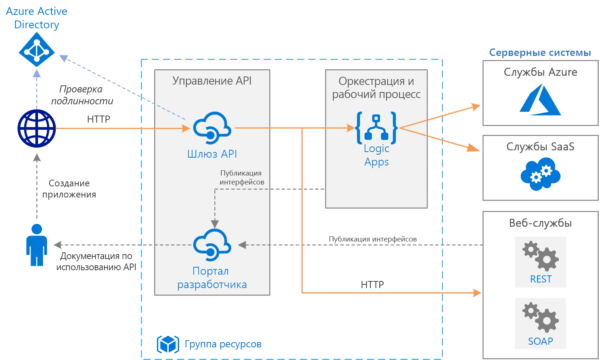

# Простая корпоративная интеграцияSimple enterprise integration

Эта эталонная архитектура использует [Azure Integration Services][integration-services] для оркестрации вызовов к корпоративным серверным системам.This reference architecture uses [Azure Integration Services][integration-services] to orchestrate calls to enterprise backend systems. Серверные системы могут включать в себя системы "программное обеспечение как услуга" (SaaS), службы Azure и существующие веб-службы предприятия.The backend systems may include software as a service (SaaS) systems, Azure services, and existing web services in your enterprise.

Azure Integration Services — это набор служб для интеграции приложений и данных.Azure Integration Services is a collection of services for integrating applications and data. Описываемая архитектура использует две из этих служб — [Logic Apps][logic-apps] (для оркестрации рабочих процессов) и [управление API][apim] (для создания каталогов API).This architecture uses two of those services: [Logic Apps][logic-apps] to orchestrate workflows, and [API Management][apim] to create catalogs of APIs.

## АрхитектураArchitecture

Архитектура состоит из следующих компонентов.The architecture has the following components:

- **Серверные системы**.**Backend systems**. Справа на схеме показаны различные внутренние системы, развернутые или используемые предприятием.On the right-hand side of the diagram are the various backend systems that the enterprise has deployed or relies on. Сюда могут входить системы SaaS, другие службы Azure или другие веб-службы, которые предоставляют конечные точки REST или SOAP.These might include SaaS systems, other Azure services, or web services that expose REST or SOAP endpoints.

- **Azure Logic Apps**.**Azure Logic Apps**. [Logic Apps][logic-apps] — это бессерверная платформа для создания рабочих процессов на предприятии, которая объединяет приложения, данные и службы.[Logic Apps][logic-apps] is a serverless platform for building enterprise workflows that integrate applications, data, and services. В этой архитектуре приложения логики активируются с помощью HTTP-запросов.In this architecture, the logic apps are triggered by HTTP requests. Вы также можете создавать вложенные рабочие процессы для более сложной оркестрации.You can also nest workflows for more complex orchestration. Служба Logic Apps использует [соединители][logic-apps-connectors] для интеграции с часто используемыми службами.Logic Apps uses [connectors][logic-apps-connectors] to integrate with commonly used services. Logic Apps предлагает сотни соединителей. Также можно создавать собственные соединители.Logic Apps offers hundreds of connectors, and you can create custom connectors.

- **Служба управления Azure API.****Azure API Management**. [Управление API][apim] — это управляемая служба для публикации каталогов API HTTP с целью упрощения их обнаружения и повторного использования.[API Management][apim] is a managed service for publishing catalogs of HTTP APIs, to promote re-use and discoverability. Служба управления API состоит из двух взаимосвязанных компонентов:API Management consists of two related components:

    - **Шлюз API**.**API gateway**. Шлюз API принимает вызовы по протоколу HTTP и маршрутизирует их к серверным службам.The API gateway accepts HTTP calls and routes them to the backend. 

    - **Портал разработчика**.**Developer portal**. Каждый экземпляр службы управления API Azure предоставляет доступ к [порталу разработчика][apim-dev-portal].Each instance of Azure API Management provides access to a [developer portal][apim-dev-portal]. Этот портал позволяет разработчикам ознакомиться с документацией и примерами кода для вызова API.This portal gives your developers access to documentation and code samples for calling the APIs. На портале разработчика также можно тестировать API.You can also test APIs in the developer portal.

    В этой архитектуре сложные API создаются путем [импорта приложений логики][apim-logic-app] в качестве API.In this architecture, composite APIs are built by [importing logic apps][apim-logic-app] as APIs. Также можно импортировать существующие веб-службы путем [импорта спецификаций OpenAPI][apim-openapi] (Swagger) или [импорта API SOAP][apim-soap] из спецификаций языка WSDL.You can also import existing web services by [importing OpenAPI][apim-openapi] (Swagger) specifications or [importing SOAP APIs][apim-soap] from WSDL specifications. 

    Шлюз API помогает отделить клиентские приложения от серверной части.The API gateway helps to decouple front-end clients from the back end. Например, он может изменять URL-адреса или преобразовывать запросы перед их передачей в серверную часть.For example, it can rewrite URLs, or transform requests before they reach the backend. Шлюз также решает многие вопросы взаимодействия, например проверку подлинности, предоставление общего доступа к ресурсам из разных источников (CORS) и кэширование ответов.It also handles many cross-cutting concerns such as authentication, cross-origin resource sharing (CORS) support, and response caching.

- **Azure DNS**.**Azure DNS**. [Azure DNS][dns] — это служба размещения для доменов DNS.[Azure DNS][dns] is a hosting service for DNS domains. Azure DNS осуществляет разрешение имен на базе инфраструктуры Microsoft Azure.Azure DNS provides name resolution by using the Microsoft Azure infrastructure. Размещая домены в Azure, вы можете управлять своими записями DNS с помощью тех же учетных данных, интерфейсов API и инструментов и оплачивать использование, как и другие службы Azure.By hosting your domains in Azure, you can manage your DNS records by using the same credentials, APIs, tools, and billing that you use for your other Azure services. Чтобы использовать имя личного домена, например contoso.com, создайте записи DNS, которые позволяют сопоставить это доменное имя с IP-адресом.To use a custom domain name, such as contoso.com, create DNS records that map the custom domain name to the IP address. Дополнительные сведения см. в статье о [настройке личного доменного имени в службе управления API][apim-domain].For more information, see [Configure a custom domain name in API Management][apim-domain].

- **Azure Active Directory (Azure AD).****Azure Active Directory (Azure AD)**. Для проверки подлинности клиентов, выполняющих вызовы к шлюзу API, можно использовать службу [Azure AD][aad].Use [Azure AD][aad] to authenticate clients that call the API gateway. Azure AD поддерживает протокол OpenID Connect (OIDC).Azure AD supports the OpenID Connect (OIDC) protocol. Клиенты получают маркер доступа от Azure AD, а шлюз API [проверяет маркер][apim-jwt] для авторизации запроса.Clients obtain an access token from Azure AD, and API Gateway [validates the token][apim-jwt] to authorize the request. При наличии подписки на службу управления API ценовой категории "Стандартный" или "Премиум" Azure AD также можно использовать для защиты доступа к порталу разработчика.When using the Standard or Premium tier of API Management, Azure AD can also secure access to the developer portal.

## РекомендацииRecommendations

Ваши конкретные требования могут отличаться от показанной здесь общей архитектуры.Your specific requirements might differ from the generic architecture shown here. Используйте рекомендации из этого раздела в качестве отправной точки.Use the recommendations in this section as a starting point.

### Управление APIAPI Management

Используйте следующие уровни управления API: "Базовый", "Стандартный", "Премиум".Use the API Management Basic, Standard, or Premium tiers. Эти ценовые категории предлагают соглашение об уровне обслуживания для рабочей среды и поддерживают развертывание в пределах региона Azure.These tiers offer a production service level agreement (SLA) and support scale out within the Azure region. Пропускная способность службы управления API измеряется в *единицах*.Throughput capacity for API Management is measured in *units*. Каждая ценовая категория имеет максимальный уровень развертывания. Ценовая категория "Премиум" также поддерживает развертывание в нескольких регионах Azure.Each pricing tier has a maximum scale out. The Premium tier also supports scale out across multiple Azure regions. Выберите уровень на основе набора функций и требуемой пропускной способности.Choose your tier based on your feature set and the level of required throughput. Дополнительные сведения см. в разделах о [ценах на службу управления API][apim-pricing] и о [емкости экземпляра службы управления API Azure][apim-capacity].For more information, see [API Management pricing][apim-pricing] and [Capacity of an Azure API Management instance][apim-capacity].

Каждому экземпляру службы управления API Azure присвоено доменное имя по умолчанию, которое является поддоменом `azure-api.net`, например `contoso.azure-api.net`.Each Azure API Management instance has a default domain name, which is a subdomain of `azure-api.net` &mdash for example, `contoso.azure-api.net`. Стоит рассмотреть использование [личного домена][apim-domain] для своей организации.Consider configuring a [custom domain][apim-domain] for your organization.

### Logic AppsLogic Apps 

Служба Logic Apps лучше всего работает в сценариях, не требующих низкой задержки.Logic Apps works best in scenarios that don't require low latency. Например, она лучше всего работает для асинхронных и полусинхронных длительных вызовов API.For example, Logic Apps works best for asynchronous or semi long-running API calls. Если требуется низкая задержка (например, вызов, который блокирует пользовательский интерфейс), реализуйте этот API или операцию с использованием другой технологии.If low latency is required, for example, a call that blocks a user interface, implement your API or operation by using a different technology. Например, используйте службу "Функции Azure" или веб-API, развернутый с помощью Службы приложений Azure.For example, use Azure Functions or a Web API that you deploy by using Azure App Service. Используйте службу управления API, чтобы предоставить пользователям этот API в качестве интерфейсного.Use API Management to front the API to your API consumers.

### РегионRegion

Чтобы свести к минимуму задержки в сети, разместите службы управления API и Logic Apps в одном регионе.To minimize network latency, put API Management and Logic Apps in the same region. В общем случае следует выбирать регион, расположенный как можно ближе к пользователям (или к серверным службам).In general, choose the region that's closest to your users (or closest to your backend services).

Группа ресурсов также привязана к региону.The resource group also has a region. Регион определяет, где хранить метаданные развертывания и где выполнить шаблон развертывания.This region specifies where to store deployment metadata and where to execute the deployment template. Чтобы увеличить доступность во время развертывания, поместите группу ресурсов и ее ресурсы в один регион.To improve availability during deployment, put the resource group and resources in the same region.

## Вопросы масштабируемостиScalability considerations

Чтобы увеличить масштабируемость службы "Управление API", добавьте [политики кэширования][apim-caching] там, где это необходимо.To increase the scalability of API Management, add [caching policies][apim-caching] where appropriate. Кэширование также помогает уменьшить нагрузку на внутренние службы.Caching also helps reduce the load on back-end services.

Уровни службы управления API "Базовый", "Стандартный" и "Премиум" позволяют масштабирование в рамках региона Azure для увеличения доступной емкости.To offer greater capacity, you can scale out Azure API Management Basic, Standard, and Premium tiers in an Azure region. Чтобы проанализировать использование службы, в меню **метрик** выберите параметр **Capacity Metric** (Метрики емкости), а затем при необходимости увеличьте или уменьшите масштаб.To analyze the usage for your service, on the **Metrics** menu, select the **Capacity Metric** option and then scale up or scale down as appropriate. Процесс обновления или масштабирования может занять от 15 до 45 минут.The upgrade or scale process can take from 15 to 45 minutes to apply.

Рекомендации по масштабированию службы "Управление API":Recommendations for scaling an API Management service:

- Изучите шаблоны трафика при масштабировании.Consider traffic patterns when scaling. Клиентам с более изменчивыми шаблонами трафика требуется большая емкость.Customers with more volatile traffic patterns need more capacity.

- Если использование емкости постоянно превышает 66 %, это может указывать на необходимость увеличения масштаба.Consistent capacity that's greater than 66% might indicate a need to scale up.

- Если использование емкости постоянно не превышает 20 %, это может указывать на то, что масштаб можно уменьшить.Consistent capacity that's under 20% might indicate an opportunity to scale down.

- Всегда выполняйте тестирование нагрузки службы управления API с использованием репрезентативной нагрузки перед включением в рабочую среду.Before you enable the load in production, always load-test your API Management service with a representative load.

Ценовая категория "Премиум" позволяет развернуть экземпляр службы управления API в нескольких регионах Azure.With the Premium tier, you can scale an API Management instance across multiple Azure regions. Это позволяет применять к службе управления API соглашения о более высоких уровнях обслуживания и развертывать службы для пользователей в нескольких регионах.This makes API Management eligible for a higher SLA, and lets you provision services near users in multiple regions.

Бессерверная модель Logic Apps означает, что администраторам не требуется планирование масштабируемости служб.The Logic Apps serverless model means administrators don't have to plan for service scalability. Служба автоматически масштабируется в соответствии с потребностями.The service automatically scales to meet demand.

## Вопросы доступностиAvailability considerations

См. соглашение об уровне обслуживания для каждой службы:Review the SLA for each service:

- [Соглашение об уровне обслуживания для службы управления API][apim-sla].[API Management SLA][apim-sla]
- [Соглашение об уровне обслуживания для Logic Apps][logic-apps-sla].[Logic Apps SLA][logic-apps-sla]

Если служба управления API развертывается в двух или более регионах в рамках ценовой категории "Премиум", к ней может применяться соглашение о более высоком уровне обслуживания.If deploy API Management across two or more regions with Premium tier, it is eligible for a higher SLA. См. [цены на службу управления API][apim-pricing].See [API Management pricing][apim-pricing].

### Резервные копииBackups

Регулярно выполняйте [резервное копирование][apim-backup] конфигурации службы управления API.Regularly [back up][apim-backup] your API Management configuration. Резервные копии необходимо хранить в расположении или регионе Azure, который отличается от региона, где развернута служба.Store your backup files in a location or Azure region that differs from the region where the service is deployed. В зависимости от [целевого времени восстановления][rto] выберите стратегию аварийного восстановления:Based on your [RTO][rto], choose a disaster recovery strategy:

* При аварийном восстановлении подготовьте новый экземпляр службы управления API, восстановите в него резервную копию и перенаправьте записи DNS.In a disaster recovery event, provision a new API Management instance, restore the backup to the new instance, and repoint the DNS records.

* Поддерживайте пассивный экземпляр службы управления API в другом регионе Azure.Keep a passive instance of the API Management service in another Azure region. Регулярно восстанавливайте резервные копии в этот экземпляр, чтобы поддерживать его синхронизацию с активной службой.Regularly restore backups to that instance, to keep it in sync with the active service. Чтобы восстановить службу во время события аварийного восстановления, вам нужно только повторно указать записи DNS.To restore the service during a disaster recovery event, you need only repoint the DNS records. Этот подход требует дополнительных затрат (так как вы платите за пассивный экземпляр), но сокращает время восстановления.This approach incurs additional cost because you are paying for the passive instance, but reduces the time to recover. 

В приложениях логики для резервного копирования и восстановления мы рекомендуем использовать подход "конфигурация в виде кода".For logic apps, we recommend a configuration-as-code approach to backup and restoring. Поскольку приложения логики являются бессерверными, их можно быстро воссоздать из шаблонов Azure Resource Manager.Because logic apps are serverless, you can quickly recreate them from Azure Resource Manager templates. Сохраните шаблоны в системе управления версиями и интегрируйте их со своим процессом непрерывной интеграции и непрерывного развертывания (CI/CD).Save the templates in source control, integrate the templates with your continuous integration/continuous deployment (CI/CD) process. При необходимости аварийного восстановления разверните шаблон в новом регионе.In a disaster recovery event, deploy the template to a new region.

При развертывании приложения логики в другом регионе обновите конфигурацию службы управления API.If you deploy a logic app to a different region, update the configuration in API Management. Можно обновить свойство API **Backend** (Сервер) с помощью простого скрипта PowerShell.You can update the API's **Backend** property by using a basic PowerShell script.

## Вопросы управляемостиManageability considerations

Создайте отдельные группы ресурсов для рабочей среды, сред разработки и тестирования.Create separate resource groups for production, development, and test environments. Так будет проще управлять развертываниями, удалять тестовые развертывания и назначать права доступа.Separate resource groups make it easier to manage deployments, delete test deployments, and assign access rights.

При назначении ресурсов группам ресурсов учитывайте следующие факторы.When you assign resources to resource groups, consider these factors:

* **Жизненный цикл**.**Lifecycle**. Обычно в группу ресурсов лучше объединять ресурсы с одинаковым жизненным циклом.In general, put resources that have the same lifecycle in the same resource group.

* **Доступ**.**Access**. С помощью [управления доступом на основе ролей][rbac] (RBAC) вы можете применить политики доступа к ресурсам в группе.To apply access policies to the resources in a group, you can use [role-based access control][rbac] (RBAC).

* **Выставление счетов**.**Billing**. Вы сможете просматривать сведенные затраты для группы ресурсов.You can view rollup costs for the resource group.

* **Ценовая категория для службы управления API**.**Pricing tier for API Management**. Для сред разработки и тестирования используйте ценовую категорию для разработчиков.Use the Developer tier for development and test environments. Чтобы свести к минимуму затраты во время предварительной подготовки, разверните реплику рабочей среды, запустите тесты, а затем завершите работу.To minimize costs during preproduction, deploy a replica of your production environment, run your tests, and then shut down.

### РазвертываниеDeployment

Для развертывания ресурсов Azure используйте [шаблоны Azure Resource Manager][arm].Use [Azure Resource Manager templates][arm] to deploy the Azure resources. Шаблоны упрощают автоматизацию развертывания с помощью PowerShell или Azure CLI.Templates make it easier to automate deployments using PowerShell or the Azure CLI.

Разместите службу управления API и любые отдельные приложения логики в собственных шаблонах Resource Manager.Put API Management and any individual logic apps in their own separate Resource Manager templates. При использовании отдельных шаблонов можно сохранять ресурсы в системе управления версиями.By using separate templates, you can store the resources in source control systems. Затем эти шаблоны можно развернуть вместе или по отдельности в рамках непрерывной интеграции и непрерывного развертывания (CI/CD).You can then deploy these templates together or individually as part of a continuous integration/continuous deployment (CI/CD) process.

### ВерсииVersions

Каждый раз, когда вы изменяете конфигурацию приложения логики или развертываете обновление с помощью шаблона Resource Manager, Azure сохраняет копию этой версии, а также все версии, у которых есть журнал выполнения.Each time you change a logic app's configuration or deploy an update through a Resource Manager template, Azure keeps a copy of that version and keeps all versions that have a run history. Эти версии можно использовать для отслеживания изменений или повысить уровень версии до текущей конфигурации приложения логики.You can use these versions to track historical changes or promote a version as the logic app's current configuration. Например, можно откатить приложение логики до предыдущей версии.For example, you can roll back a logic app to a previous version.

Служба управления API поддерживает две различные концепции присвоения версий, которые дополняют друг друга:API Management supports two distinct but complementary versioning concepts:

* *Версии* позволяют объектам-получателям выбрать версию API в зависимости от потребностей, например версию 1, 2, бета-версию или рабочую версию.*Versions* allow API consumers to choose an API version based on their needs, for example, v1, v2, beta, or production.

* *Редакции* позволяют администраторам API вносить в API обратно совместимые изменения и развертывать их вместе с журналом изменений, который содержит сведения об изменениях для объектов-получателей.*Revisions* allow API administrators to make non-breaking changes in an API and deploy those changes, along with a change log to inform API consumers about the changes.

Редакцию можно создать в среде разработки и развернуть в других средах с помощью шаблонов Resource Manager.You can make a revision in a development environment and deploy that change in other environments by using Resource Manager templates. Дополнительные сведения см. в статье [Публикация нескольких версий API][apim-versions].For more information, see [Publish multiple versions of your API][apim-versions]

Редакции также можно использовать для тестирования API, прежде чем изменения будут применены и станут доступными для пользователей.You can also use revisions to test an API before making the changes current and accessible to users. Однако этот метод не рекомендуется для нагрузочного или интеграционного тестирования.However, this method isn't recommended for load testing or integration testing. Вместо этого используйте отдельную тестовую или подготовительную среду.Instead, use separate test or preproduction environments.

## Диагностика и мониторингDiagnostics and monitoring

Вы можете использовать [Azure Monitor][monitor] для оперативного мониторинга в службе управления API и Logic Apps.Use [Azure Monitor][monitor] for operational monitoring in both API Management and Logic Apps. Azure Monitor предоставляет сведения на основе метрик, настроенных для каждой службы и включенных по умолчанию.Azure Monitor provides information based on the metrics configured for each service and is enabled by default. Дополнительные сведения можно найти в разделе For more information, see:

- [Мониторинг опубликованных API][apim-monitor].[Monitor published APIs][apim-monitor]
- [Мониторинг состояния, настройка ведения журнала диагностики и включение предупреждений для Azure Logic Apps.][logic-apps-monitor][Monitor status, set up diagnostics logging, and turn on alerts for Azure Logic Apps][logic-apps-monitor]

Каждая служба также содержит следующие параметры:Each service also has these options:

* Журналы Logic Apps можно передавать в [Azure Log Analytics][logic-apps-log-analytics] для более глубокого анализа и отображения на панелях мониторинга.For deeper analysis and dashboarding, send Logic Apps logs to [Azure Log Analytics][logic-apps-log-analytics].

* Служба управления API поддерживает настройку Azure Application Insights для мониторинга DevOps.For DevOps monitoring, configure Azure Application Insights for API Management.

* Служба управления API поддерживает [шаблон решения Power BI для пользовательской аналитики API][apim-pbi].API Management supports the [Power BI solution template for custom API analytics][apim-pbi]. Вы можете использовать этот шаблон решения для создания собственного решения аналитики.You can use this solution template for creating your own analytics solution. Отчеты доступны в Power BI для бизнес-пользователей.For business users, Power BI makes reports available.

## Вопросы безопасностиSecurity considerations

Хотя этот список рекомендаций по безопасности не является полным, в нем можно найти некоторые соображения относительно безопасности, которые применимы именно к этой архитектуре:Although this list doesn't completely describe all security best practices, here are some security considerations that apply specifically to this architecture:

* Служба управления API Azure имеет постоянный общедоступный IP-адрес.The Azure API Management service has a fixed public IP address. Доступ к конечным точкам Logic Apps следует разрешить только с IP-адреса службы управления API.Restrict access for calling Logic Apps endpoints to only the IP address of API Management. См. дополнительные сведения об [ограничении входящих IP-адресов][logic-apps-restrict-ip].For more information, see [Restrict incoming IP addresses][logic-apps-restrict-ip].

* Используйте управление доступом на основе ролей, чтобы у пользователей были соответствующие уровни доступа.To make sure users have appropriate access levels, use role-based access control (RBAC).

* Обеспечьте безопасность общедоступных конечных точек API в службе управления API с помощью OAuth или OpenID Connect.Secure public API endpoints in API Management by using OAuth or OpenID Connect. Чтобы защитить общедоступные конечные точки API, настройте поставщик удостоверений и добавьте политику проверки JSON Web Token (JWT).To secure public API endpoints, configure an identity provider, and add a JSON Web Token (JWT) validation policy. Дополнительные сведения см. в статье [Защита API с помощью протокола OAuth 2.0 и службы управления API в Azure Active Directory][apim-oauth].For more information, see [Protect an API by using OAuth 2.0 with Azure Active Directory and API Management][apim-oauth].

* Подключитесь ко внутренним службам из службы управления API с помощью взаимных сертификатов.Connect to back-end services from API Management by using mutual certificates.

* Активируйте принудительное использование протокола HTTPS для службы управления API.Enforce HTTPS on the API Management APIs.

### Хранение секретовStoring secrets

Ни в коем случае не помещайте пароли, ключи доступа или строки подключения в систему управления версиями.Never check passwords, access keys, or connection strings into source control. Если они необходимы, используйте соответствующие методы для развертывания и защиты этих значений.If these values are required, secure and deploy these values by using the appropriate techniques. 

Если для приложения логики требуются какие-либо конфиденциальные значения, которые невозможно создать с помощью соединителя, сохраните эти значения в Azure Key Vault и получите к ним доступ из шаблона Resource Manager.If a logic app requires any sensitive values that you can't create within a connector, store those values in Azure Key Vault and reference them from a Resource Manager template. Используйте параметры шаблона развертывания вместе с файлами параметров для каждой среды.Use deployment template parameters and parameter files for each environment. Дополнительные сведения см. в разделе о [параметрах безопасности и входных данных в рабочем процессе][logic-apps-secure].For more information, see [Secure parameters and inputs within a workflow][logic-apps-secure].

В службе управления API управление секретами осуществляется с помощью объектов, которые называются *именованными значениями* или *свойствами*.API Management manages secrets by using objects called *named values* or *properties*. Они надежно сохраняют значения, к которым можно получить доступ с помощью политик управления API.These objects securely store values that you can access through API Management policies. Дополнительные сведения см. в статье [Использование именованных значений в политиках управления API Azure][apim-properties].For more information, see [How to use Named Values in Azure API Management policies][apim-properties].

## Рекомендации по стоимостиCost considerations

При выполнении вы платите за все экземпляры службы "Управление API".You are charged for all API Management instances when they are running. Если вы увеличили масштаб, но вам не нужен такой уровень производительности все время, можно уменьшить масштаб вручную или настроить [автомасштабирование][apim-autoscale].If you have scaled up and don't need that level of performance all the time, manually scale down or configure [autoscaling][apim-autoscale].

Logic Apps использует [бессерверную](/azure/logic-apps/logic-apps-serverless-overview) модель.Logic Apps uses a [serverless](/azure/logic-apps/logic-apps-serverless-overview) model. Cчета выставляются на основе действий и выполнения соединителей.Billing is calculated based on action and connector execution. Дополнительные сведения см. на странице с [ценами на Logic Apps](https://azure.microsoft.com/pricing/details/logic-apps/).For more information, see [Logic Apps pricing](https://azure.microsoft.com/pricing/details/logic-apps/). В настоящее время нет каких-либо рекомендаций по уровню для Logic Apps.Currently, there are no tier considerations for Logic Apps.

## Дополнительная информацияNext steps

* Узнайте об [эталонной архитектуре корпоративной интеграции с использованием очередей и событий](/azure/logic-apps/logic-apps-architectures-enterprise-integration-with-queues-events).Learn about [enterprise integration with queues and events](/azure/logic-apps/logic-apps-architectures-enterprise-integration-with-queues-events)

<!-- links -->

[aad]: /azure/active-directory
[apim]: /azure/api-management
[apim-autoscale]: /azure/api-management/api-management-howto-autoscale
[apim-backup]: /azure/api-management/api-management-howto-disaster-recovery-backup-restore
[apim-caching]: /azure/api-management/api-management-howto-cache
[apim-capacity]: /azure/api-management/api-management-capacity
[apim-dev-portal]: /azure/api-management/api-management-key-concepts#a-namedeveloper-portal-a-developer-portal
[apim-domain]: /azure/api-management/configure-custom-domain
[apim-jwt]: /azure/api-management/policies/authorize-request-based-on-jwt-claims
[apim-logic-app]: /azure/api-management/import-logic-app-as-api
[apim-monitor]: /azure/api-management/api-management-howto-use-azure-monitor
[apim-oauth]: /azure/api-management/api-management-howto-protect-backend-with-aad
[apim-openapi]: /azure/api-management/import-api-from-oas
[apim-pbi]: http://aka.ms/apimpbi
[apim-pricing]: https://azure.microsoft.com/pricing/details/api-management/
[apim-properties]: /azure/api-management/api-management-howto-properties
[apim-sla]: https://azure.microsoft.com/support/legal/sla/api-management/
[apim-soap]: /azure/api-management/import-soap-api
[apim-versions]: /azure/api-management/api-management-get-started-publish-versions
[arm]: /azure/azure-resource-manager/resource-group-authoring-templates
[dns]: /azure/dns/
[integration-services]: https://azure.microsoft.com/product-categories/integration/
[logic-apps]: /azure/logic-apps/logic-apps-overview
[logic-apps-connectors]: /azure/connectors/apis-list
[logic-apps-log-analytics]: /azure/logic-apps/logic-apps-monitor-your-logic-apps-oms
[logic-apps-monitor]: /azure/logic-apps/logic-apps-monitor-your-logic-apps
[logic-apps-restrict-ip]: /azure/logic-apps/logic-apps-securing-a-logic-app#restrict-incoming-ip-addresses
[logic-apps-secure]: /azure/logic-apps/logic-apps-securing-a-logic-app#secure-parameters-and-inputs-within-a-workflow
[logic-apps-sla]: https://azure.microsoft.com/support/legal/sla/logic-apps
[monitor]: /azure/azure-monitor/overview
[rbac]: /azure/role-based-access-control/overview
[rto]: ../../resiliency/index.md#rto-and-rpo