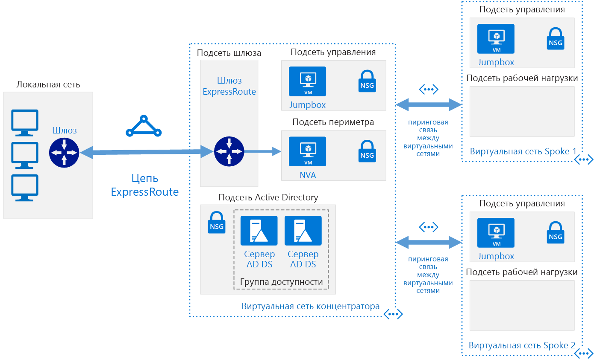

# <a name="implement-a-hub-spoke-network-topology-with-shared-services-in-azure"></a><span data-ttu-id="77631-103">Реализация звездообразной топологии сети с помощью общих служб в Azure</span><span class="sxs-lookup"><span data-stu-id="77631-103">Implement a hub-spoke network topology with shared services in Azure</span></span>

<span data-ttu-id="77631-104">Эта эталонная архитектура создана на основе [звездообразной][guidance-hub-spoke] эталонной архитектуры. Это позволяет включить в концентраторе общие службы, которые можно использовать во всех периферийных зонах.</span><span class="sxs-lookup"><span data-stu-id="77631-104">This reference architecture builds on the [hub-spoke][guidance-hub-spoke] reference architecture to include shared services in the hub that can be consumed by all spokes.</span></span> <span data-ttu-id="77631-105">Чтобы приступить к перемещению центра обработки данных в облако и создать [виртуальный центр обработки данных], необходимо предоставить общий доступ к службам удостоверений и безопасности.</span><span class="sxs-lookup"><span data-stu-id="77631-105">As a first step toward migrating a datacenter to the cloud, and building a [virtual datacenter], the first services you need to share are identity and security.</span></span> <span data-ttu-id="77631-106">Эта эталонная архитектура содержит сведения о том, как расширить службы Active Directory из локального центра обработки данных в Azure и как добавить виртуальные сетевые модули (NVA), которые могут действовать как брандмауэры, в звездообразную топологию.</span><span class="sxs-lookup"><span data-stu-id="77631-106">This reference architecture shows you how to extend your Active Directory services from your on-premises datacenter to Azure, and how to add a network virtual appliance (NVA) that can act as a firewall, in a hub-spoke topology.</span></span>  <span data-ttu-id="77631-107">[**Разверните это решение**](#deploy-the-solution).</span><span class="sxs-lookup"><span data-stu-id="77631-107">[**Deploy this solution**](#deploy-the-solution).</span></span>



<span data-ttu-id="77631-109">*Скачайте [файл Visio][visio-download] этой архитектуры*</span><span class="sxs-lookup"><span data-stu-id="77631-109">*Download a [Visio file][visio-download] of this architecture*</span></span>

<span data-ttu-id="77631-110">До преимуществ этой топологии можно отнести:</span><span class="sxs-lookup"><span data-stu-id="77631-110">The benefits of this topology include:</span></span>

- <span data-ttu-id="77631-111">**Сокращение затрат** путем централизации служб, которые могут совместно использоваться несколькими рабочими нагрузками, такими как сетевые виртуальные устройства (NVA) и DNS-серверы в одном расположении.</span><span class="sxs-lookup"><span data-stu-id="77631-111">**Cost savings** by centralizing services that can be shared by multiple workloads, such as network virtual appliances (NVAs) and DNS servers, in a single location.</span></span>
- <span data-ttu-id="77631-112">**Превышение лимитов подписки** путем пиринга виртуальных сетей из разных подписок к центральному концентратору.</span><span class="sxs-lookup"><span data-stu-id="77631-112">**Overcome subscriptions limits** by peering VNets from different subscriptions to the central hub.</span></span>
- <span data-ttu-id="77631-113">**Разделение областей ответственности** между центральным ИТ-отделом (SecOps, InfraOps) и рабочими нагрузками (DevOps).</span><span class="sxs-lookup"><span data-stu-id="77631-113">**Separation of concerns** between central IT (SecOps, InfraOps) and workloads (DevOps).</span></span>

<span data-ttu-id="77631-114">Типичные способы использования этой архитектуры:</span><span class="sxs-lookup"><span data-stu-id="77631-114">Typical uses for this architecture include:</span></span>

- <span data-ttu-id="77631-115">Рабочая нагрузка, развернутая в разных средах, например в среде для разработки, тестирования и в рабочей среде, для которых требуются общие службы, например DNS, IDS, NTP или AD DS.</span><span class="sxs-lookup"><span data-stu-id="77631-115">Workloads deployed in different environments, such as development, testing, and production, that require shared services such as DNS, IDS, NTP, or AD DS.</span></span> <span data-ttu-id="77631-116">Общие службы размещаются в виртуальной сети концентратора, в то время как каждая среда развертывается в периферийной зоне для обеспечения изоляции.</span><span class="sxs-lookup"><span data-stu-id="77631-116">Shared services are placed in the hub VNet, while each environment is deployed to a spoke to maintain isolation.</span></span>
- <span data-ttu-id="77631-117">Рабочие нагрузки, которые не требуют подключения друг к другу, но требуют доступа к общим службам.</span><span class="sxs-lookup"><span data-stu-id="77631-117">Workloads that do not require connectivity to each other, but require access to shared services.</span></span>
- <span data-ttu-id="77631-118">Предприятия, которые требуют централизованного контроля над аспектами безопасности, такими как брандмауэр в концентраторе, таком как сеть периметра, и отдельного управления для рабочих нагрузок в каждой периферийной зоне.</span><span class="sxs-lookup"><span data-stu-id="77631-118">Enterprises that require central control over security aspects, such as a firewall in the hub as a DMZ, and segregated management for the workloads in each spoke.</span></span>

## <a name="architecture"></a><span data-ttu-id="77631-119">Архитектура</span><span class="sxs-lookup"><span data-stu-id="77631-119">Architecture</span></span>

<span data-ttu-id="77631-120">Архитектура состоит из следующих компонентов:</span><span class="sxs-lookup"><span data-stu-id="77631-120">The architecture consists of the following components.</span></span>

- <span data-ttu-id="77631-121">**Локальная сеть.**</span><span class="sxs-lookup"><span data-stu-id="77631-121">**On-premises network**.</span></span> <span data-ttu-id="77631-122">Частная локальная сеть, работающая внутри организации.</span><span class="sxs-lookup"><span data-stu-id="77631-122">A private local-area network running within an organization.</span></span>

- <span data-ttu-id="77631-123">**VPN-устройство**.</span><span class="sxs-lookup"><span data-stu-id="77631-123">**VPN device**.</span></span> <span data-ttu-id="77631-124">Устройство или служба, предоставляющая возможность внешнего подключения к локальной сети.</span><span class="sxs-lookup"><span data-stu-id="77631-124">A device or service that provides external connectivity to the on-premises network.</span></span> <span data-ttu-id="77631-125">VPN-устройство может быть аппаратным устройством или программным решением, таким как служба маршрутизации и удаленного доступа (RRAS) в Windows Server 2012.</span><span class="sxs-lookup"><span data-stu-id="77631-125">The VPN device may be a hardware device, or a software solution such as the Routing and Remote Access Service (RRAS) in Windows Server 2012.</span></span> <span data-ttu-id="77631-126">Список поддерживаемых VPN-устройств и информацию о настройке выбранных VPN-устройств для подключения к Azure см. в статье [VPN-устройства и параметры IPsec/IKE для подключений типа "сеть — сеть" через VPN-шлюз][vpn-appliance].</span><span class="sxs-lookup"><span data-stu-id="77631-126">For a list of supported VPN appliances and information on configuring selected VPN appliances for connecting to Azure, see [About VPN devices for Site-to-Site VPN Gateway connections][vpn-appliance].</span></span>

- <span data-ttu-id="77631-127">**Сетевой шлюз виртуальной сети VPN или шлюз ExpressRoute**.</span><span class="sxs-lookup"><span data-stu-id="77631-127">**VPN virtual network gateway or ExpressRoute gateway**.</span></span> <span data-ttu-id="77631-128">Шлюз виртуальной сети позволяет виртуальной сети подключаться к VPN-устройству или к каналу ExpressRoute, которые используются для подключения к вашей локальной сети.</span><span class="sxs-lookup"><span data-stu-id="77631-128">The virtual network gateway enables the VNet to connect to the VPN device, or ExpressRoute circuit, used for connectivity with your on-premises network.</span></span> <span data-ttu-id="77631-129">Дополнительные сведения см. в статье [Подключение локальной сети к виртуальной сети Microsoft Azure][connect-to-an-Azure-vnet].</span><span class="sxs-lookup"><span data-stu-id="77631-129">For more information, see [Connect an on-premises network to a Microsoft Azure virtual network][connect-to-an-Azure-vnet].</span></span>

> [!NOTE]
> <span data-ttu-id="77631-130">В сценариях развертывания для этой эталонной архитектуры используется VPN-шлюз для подключения, а виртуальная сеть в Azure используется для имитации вашей локальной сети.</span><span class="sxs-lookup"><span data-stu-id="77631-130">The deployment scripts for this reference architecture use a VPN gateway for connectivity, and a VNet in Azure to simulate your on-premises network.</span></span>

- <span data-ttu-id="77631-131">**Виртуальная сеть концентратора**.</span><span class="sxs-lookup"><span data-stu-id="77631-131">**Hub VNet**.</span></span> <span data-ttu-id="77631-132">Виртуальная сеть Azure используется в качестве концентратора в звездообразной топологии.</span><span class="sxs-lookup"><span data-stu-id="77631-132">Azure VNet used as the hub in the hub-spoke topology.</span></span> <span data-ttu-id="77631-133">Концентратор является центральной точкой подключения к вашей локальной сети и местом для размещения служб, которые могут использоваться различными рабочими нагрузками, размещенными в виртуальных сетях.</span><span class="sxs-lookup"><span data-stu-id="77631-133">The hub is the central point of connectivity to your on-premises network, and a place to host services that can be consumed by the different workloads hosted in the spoke VNets.</span></span>

- <span data-ttu-id="77631-134">**Подсеть шлюза**.</span><span class="sxs-lookup"><span data-stu-id="77631-134">**Gateway subnet**.</span></span> <span data-ttu-id="77631-135">Шлюзы виртуальных сетей хранятся в одной подсети.</span><span class="sxs-lookup"><span data-stu-id="77631-135">The virtual network gateways are held in the same subnet.</span></span>

- <span data-ttu-id="77631-136">**Подсеть общих служб**.</span><span class="sxs-lookup"><span data-stu-id="77631-136">**Shared services subnet**.</span></span> <span data-ttu-id="77631-137">Подсеть в концентраторе виртуальной сети используется для размещения служб, которые могут использоваться совместно во всех периферийных зонах, например DNS или AD DS.</span><span class="sxs-lookup"><span data-stu-id="77631-137">A subnet in the hub VNet used to host services that can be shared among all spokes, such as DNS or AD DS.</span></span>

- <span data-ttu-id="77631-138">**Подсеть сети периметра.**</span><span class="sxs-lookup"><span data-stu-id="77631-138">**DMZ subnet**.</span></span> <span data-ttu-id="77631-139">Подсеть в виртуальной сети концентратора, используемая для размещения виртуальных сетевых модулей, которые могут действовать как устройства безопасности, например как брандмауэры.</span><span class="sxs-lookup"><span data-stu-id="77631-139">A subnet in the hub VNet used to host NVAs that can act as security appliances, such as firewalls.</span></span>

- <span data-ttu-id="77631-140">**Виртуальные сети периферийных зон**.</span><span class="sxs-lookup"><span data-stu-id="77631-140">**Spoke VNets**.</span></span> <span data-ttu-id="77631-141">Одна или несколько виртуальных сетей Azure, которые используются в качестве периферийных зон в звездообразной топологии.</span><span class="sxs-lookup"><span data-stu-id="77631-141">One or more Azure VNets that are used as spokes in the hub-spoke topology.</span></span> <span data-ttu-id="77631-142">Периферийные зоны можно использовать для изоляции рабочих нагрузок в их виртуальных сетях, управляемых отдельно от других периферийных зон.</span><span class="sxs-lookup"><span data-stu-id="77631-142">Spokes can be used to isolate workloads in their own VNets, managed separately from other spokes.</span></span> <span data-ttu-id="77631-143">Каждая рабочая нагрузка может содержать несколько уровней с несколькими подсетями, подключенными через подсистемы балансировки нагрузки Azure.</span><span class="sxs-lookup"><span data-stu-id="77631-143">Each workload might include multiple tiers, with multiple subnets connected through Azure load balancers.</span></span> <span data-ttu-id="77631-144">Дополнительные сведения об инфраструктуре приложений см. в статьях [Запуск рабочих нагрузок на виртуальных машинах Windows][windows-vm-ra] и [Запуск рабочих нагрузок на виртуальной машине Linux][linux-vm-ra].</span><span class="sxs-lookup"><span data-stu-id="77631-144">For more information about the application infrastructure, see [Running Windows VM workloads][windows-vm-ra] and [Running Linux VM workloads][linux-vm-ra].</span></span>

- <span data-ttu-id="77631-145">**Пиринговая связь между виртуальными сетями**.</span><span class="sxs-lookup"><span data-stu-id="77631-145">**VNet peering**.</span></span> <span data-ttu-id="77631-146">Две виртуальные сети в одном регионе Azure можно подключить с помощью [пиринга][vnet-peering].</span><span class="sxs-lookup"><span data-stu-id="77631-146">Two VNets in the same Azure region can be connected using a [peering connection][vnet-peering].</span></span> <span data-ttu-id="77631-147">Пиринговые подключения представляют собой нетранзитивные подключения между виртуальными подсетями с низкой задержкой.</span><span class="sxs-lookup"><span data-stu-id="77631-147">Peering connections are non-transitive, low latency connections between VNets.</span></span> <span data-ttu-id="77631-148">После установки пирингового подключения виртуальные сети обмениваются трафиком по магистрали Azure без необходимости использования маршрутизатора.</span><span class="sxs-lookup"><span data-stu-id="77631-148">Once peered, the VNets exchange traffic by using the Azure backbone, without the need for a router.</span></span> <span data-ttu-id="77631-149">В звездообразной топологии сети пиринг виртуальной сети используется для подключения концентратора к каждой периферийной зоне.</span><span class="sxs-lookup"><span data-stu-id="77631-149">In a hub-spoke network topology, you use VNet peering to connect the hub to each spoke.</span></span>

> [!NOTE]
> <span data-ttu-id="77631-150">В этой статье рассматриваются только [развертывания Resource Manager](/azure/azure-resource-manager/resource-group-overview), но вы также можете подключить классическую виртуальную сеть к виртуальной сети Resource Manager в той же подписке.</span><span class="sxs-lookup"><span data-stu-id="77631-150">This article only covers [Resource Manager](/azure/azure-resource-manager/resource-group-overview) deployments, but you can also connect a classic VNet to a Resource Manager VNet in the same subscription.</span></span> <span data-ttu-id="77631-151">Таким образом, ваши периферийные зоны могут размещать классические развертывания и по-прежнему пользоваться преимуществами общих служб в концентраторе.</span><span class="sxs-lookup"><span data-stu-id="77631-151">That way, your spokes can host classic deployments and still benefit from services shared in the hub.</span></span>

## <a name="recommendations"></a><span data-ttu-id="77631-152">Рекомендации</span><span class="sxs-lookup"><span data-stu-id="77631-152">Recommendations</span></span>

<span data-ttu-id="77631-153">Все рекомендации для [звездообразной][guidance-hub-spoke] эталонной архитектуры также можно применить к эталонной архитектуре общих служб.</span><span class="sxs-lookup"><span data-stu-id="77631-153">All the recommendations for the [hub-spoke][guidance-hub-spoke] reference architecture also apply to the shared services reference architecture.</span></span>

<span data-ttu-id="77631-154">Кроме того, следующие рекомендации применимы для большинства сценариев с общими службами.</span><span class="sxs-lookup"><span data-stu-id="77631-154">Also, the following recommendations apply for most scenarios under shared services.</span></span> <span data-ttu-id="77631-155">Следуйте этим рекомендациям, если они не противоречат особым требованиям для вашего случая.</span><span class="sxs-lookup"><span data-stu-id="77631-155">Follow these recommendations unless you have a specific requirement that overrides them.</span></span>

### <a name="identity"></a><span data-ttu-id="77631-156">Удостоверение</span><span class="sxs-lookup"><span data-stu-id="77631-156">Identity</span></span>

<span data-ttu-id="77631-157">В локальном центре обработки данных большинства коммерческих организаций есть среда Active Directory Services (ADDS).</span><span class="sxs-lookup"><span data-stu-id="77631-157">Most enterprise organizations have an Active Directory Directory Services (ADDS) environment in their on-premises datacenter.</span></span> <span data-ttu-id="77631-158">Чтобы упростить управление ресурсами, перемещенными в Azure из локальной сети, которая зависит от ADDS, рекомендуется разместить контроллеры домена ADDS в Azure.</span><span class="sxs-lookup"><span data-stu-id="77631-158">To facilitate management of assets moved to Azure from your on-premises network that depend on ADDS, it is recommended to host ADDS domain controllers in Azure.</span></span>

<span data-ttu-id="77631-159">Если вы используете объекты групповой политики, которыми вы хотите управлять отдельно для Azure и локальной среды, для каждого региона Azure необходимо использовать разные сайты AD.</span><span class="sxs-lookup"><span data-stu-id="77631-159">If you make use of Group Policy Objects, that you want to control separately for Azure and your on-premises environment, use a different AD site for each Azure region.</span></span> <span data-ttu-id="77631-160">Разместите контроллеры домена в центральной виртуальной сети (концентраторе), доступ к которой могут получить зависимые рабочие нагрузки.</span><span class="sxs-lookup"><span data-stu-id="77631-160">Place your domain controllers in a central VNet (hub) that dependent workloads can access.</span></span>

### <a name="security"></a><span data-ttu-id="77631-161">Безопасность</span><span class="sxs-lookup"><span data-stu-id="77631-161">Security</span></span>

<span data-ttu-id="77631-162">При перемещении рабочих нагрузок из локальной среды в Azure некоторые из них потребуется разместить на виртуальных машинах.</span><span class="sxs-lookup"><span data-stu-id="77631-162">As you move workloads from your on-premises environment to Azure, some of these workloads will require to be hosted in VMs.</span></span> <span data-ttu-id="77631-163">В целях обеспечения соответствия может потребоваться наложить ограничения на передачу трафика этих рабочих нагрузок.</span><span class="sxs-lookup"><span data-stu-id="77631-163">For compliance reasons, you may need to enforce restrictions on traffic traversing those workloads.</span></span>

<span data-ttu-id="77631-164">Вы можете использовать виртуальные сетевые модули в Azure для размещения разных типов служб безопасности и производительности.</span><span class="sxs-lookup"><span data-stu-id="77631-164">You can use network virtual appliances (NVAs) in Azure to host different types of security and performance services.</span></span> <span data-ttu-id="77631-165">Если вы знакомы с заданным набором устройств в локальной среде, рекомендуется использовать те же виртуальные модули в Azure, где это применимо.</span><span class="sxs-lookup"><span data-stu-id="77631-165">If you are familiar with a given set of appliances on-premises today, it is recommended to use the same virtualized appliances in Azure, where applicable.</span></span>

> [!NOTE]
> <span data-ttu-id="77631-166">В скриптах развертывания этой эталонной архитектуры используется виртуальная машина Ubuntu с IP-пересылкой, которая позволяет сымитировать виртуальный сетевой модуль.</span><span class="sxs-lookup"><span data-stu-id="77631-166">The deployment scripts for this reference architecture use an Ubuntu VM with IP forwarding enabled to mimic a network virtual appliance.</span></span>

## <a name="considerations"></a><span data-ttu-id="77631-167">Рекомендации</span><span class="sxs-lookup"><span data-stu-id="77631-167">Considerations</span></span>

### <a name="overcoming-vnet-peering-limits"></a><span data-ttu-id="77631-168">Преодоление ограничения пиринговых подключений виртуальной сети</span><span class="sxs-lookup"><span data-stu-id="77631-168">Overcoming VNet peering limits</span></span>

<span data-ttu-id="77631-169">Убедитесь, что вы учли [ограничение числа пиринговых подключений виртуальных сетей на одну виртуальную сеть][vnet-peering-limit] в Azure.</span><span class="sxs-lookup"><span data-stu-id="77631-169">Make sure you consider the [limitation on number of VNets peerings per VNet][vnet-peering-limit] in Azure.</span></span> <span data-ttu-id="77631-170">Если вам нужно превысить лимит по периферийным зонам, подумайте о создании вложенной звездообразной топологии, где первый уровень периферийных зон также выступает в качестве концентраторов.</span><span class="sxs-lookup"><span data-stu-id="77631-170">If you decide you need more spokes than the limit will allow, consider creating a hub-spoke-hub-spoke topology, where the first level of spokes also act as hubs.</span></span> <span data-ttu-id="77631-171">Этот подход показан на схеме ниже.</span><span class="sxs-lookup"><span data-stu-id="77631-171">The following diagram shows this approach.</span></span>


<span data-ttu-id="77631-173">Кроме того, следует учитывать, какие службы используются совместно в концентраторе, чтобы убедиться, что концентратор масштабируется в соответствии с большим количеством периферийных зон.</span><span class="sxs-lookup"><span data-stu-id="77631-173">Also consider what services are shared in the hub, to ensure the hub scales for a larger number of spokes.</span></span> <span data-ttu-id="77631-174">Например, если ваш концентратор предоставляет службы брандмауэра, рассмотрите возможность ограничения пропускной способности решения брандмауэра при добавлении нескольких периферийных зон.</span><span class="sxs-lookup"><span data-stu-id="77631-174">For instance, if your hub provides firewall services, consider the bandwidth limits of your firewall solution when adding multiple spokes.</span></span> <span data-ttu-id="77631-175">Возможно, вам захочется перенести некоторые из этих общих служб на второй уровень концентраторов.</span><span class="sxs-lookup"><span data-stu-id="77631-175">You might want to move some of these shared services to a second level of hubs.</span></span>

## <a name="deploy-the-solution"></a><span data-ttu-id="77631-176">Развертывание решения</span><span class="sxs-lookup"><span data-stu-id="77631-176">Deploy the solution</span></span>

<span data-ttu-id="77631-177">Пример развертывания для этой архитектуры можно найти на портале [GitHub][ref-arch-repo].</span><span class="sxs-lookup"><span data-stu-id="77631-177">A deployment for this architecture is available on [GitHub][ref-arch-repo].</span></span> <span data-ttu-id="77631-178">Развертывание создает в вашей подписке следующие группы ресурсов:</span><span class="sxs-lookup"><span data-stu-id="77631-178">The deployment creates the following resource groups in your subscription:</span></span>

- <span data-ttu-id="77631-179">hub-adds-rg</span><span class="sxs-lookup"><span data-stu-id="77631-179">hub-adds-rg</span></span>
- <span data-ttu-id="77631-180">hub-nva-rg</span><span class="sxs-lookup"><span data-stu-id="77631-180">hub-nva-rg</span></span>
- <span data-ttu-id="77631-181">hub-vnet-rg</span><span class="sxs-lookup"><span data-stu-id="77631-181">hub-vnet-rg</span></span>
- <span data-ttu-id="77631-182">onprem-vnet-rg</span><span class="sxs-lookup"><span data-stu-id="77631-182">onprem-vnet-rg</span></span>
- <span data-ttu-id="77631-183">spoke1-vnet-rg</span><span class="sxs-lookup"><span data-stu-id="77631-183">spoke1-vnet-rg</span></span>
- <span data-ttu-id="77631-184">spoke2-vent-rg</span><span class="sxs-lookup"><span data-stu-id="77631-184">spoke2-vent-rg</span></span>

<span data-ttu-id="77631-185">Файлы параметров шаблона ссылаются на эти имена, поэтому, если вы их изменяете, соответствующим образом обновите файлы параметров.</span><span class="sxs-lookup"><span data-stu-id="77631-185">The template parameter files refer to these names, so if you change them, update the parameter files to match.</span></span>

### <a name="prerequisites"></a><span data-ttu-id="77631-186">Предварительные требования</span><span class="sxs-lookup"><span data-stu-id="77631-186">Prerequisites</span></span>

[!INCLUDE [ref-arch-prerequisites.md](../../../includes/ref-arch-prerequisites.md)]

### <a name="deploy-the-simulated-on-premises-datacenter-using-azbb"></a><span data-ttu-id="77631-187">Развертывание имитации локального центра обработки данных с помощью azbb</span><span class="sxs-lookup"><span data-stu-id="77631-187">Deploy the simulated on-premises datacenter using azbb</span></span>

<span data-ttu-id="77631-188">Чтобы развернуть имитацию локального центра обработки данных в виртуальной сети Azure, сделайте следующее:</span><span class="sxs-lookup"><span data-stu-id="77631-188">This step deploys the simulated on-premises datacenter as an Azure VNet.</span></span>

1. <span data-ttu-id="77631-189">Перейдите в папку `hybrid-networking\shared-services-stack\` в репозитории GitHub.</span><span class="sxs-lookup"><span data-stu-id="77631-189">Navigate to the `hybrid-networking\shared-services-stack\` folder of the GitHub repository.</span></span>

2. <span data-ttu-id="77631-190">Откройте файл `onprem.json` .</span><span class="sxs-lookup"><span data-stu-id="77631-190">Open the `onprem.json` file.</span></span>

3. <span data-ttu-id="77631-191">Найдите все экземпляры `UserName`, `adminUserName`,`Password` и `adminPassword`.</span><span class="sxs-lookup"><span data-stu-id="77631-191">Search for all instances of `UserName`, `adminUserName`,`Password`, and `adminPassword`.</span></span> <span data-ttu-id="77631-192">Введите значения для имени пользователя и пароля в параметрах и сохраните файл.</span><span class="sxs-lookup"><span data-stu-id="77631-192">Enter values for the user name and password in the parameters and save the file.</span></span>

4. <span data-ttu-id="77631-193">Выполните следующую команду:</span><span class="sxs-lookup"><span data-stu-id="77631-193">Run the following command:</span></span>

   ```bash
   azbb -s <subscription_id> -g onprem-vnet-rg -l <location> -p onprem.json --deploy
   ```

5. <span data-ttu-id="77631-194">Дождитесь завершения развертывания.</span><span class="sxs-lookup"><span data-stu-id="77631-194">Wait for the deployment to finish.</span></span> <span data-ttu-id="77631-195">При развертывании создается виртуальная сеть, виртуальная машина под управлением Windows и VPN-шлюз.</span><span class="sxs-lookup"><span data-stu-id="77631-195">This deployment creates a virtual network, a virtual machine running Windows, and a VPN gateway.</span></span> <span data-ttu-id="77631-196">Создание VPN-шлюза может занять более 40 минут.</span><span class="sxs-lookup"><span data-stu-id="77631-196">The VPN gateway creation can take more than 40 minutes to complete.</span></span>

### <a name="deploy-the-hub-vnet"></a><span data-ttu-id="77631-197">Развертывание концентратора виртуальной сети</span><span class="sxs-lookup"><span data-stu-id="77631-197">Deploy the hub VNet</span></span>

<span data-ttu-id="77631-198">Чтобы развернуть концентратор виртуальной сети и подключить его к имитации локальной виртуальной сети, сделайте следующее:</span><span class="sxs-lookup"><span data-stu-id="77631-198">This step deploys the hub VNet and connects it to the simulated on-premises VNet.</span></span>

1. <span data-ttu-id="77631-199">Откройте файл `hub-vnet.json` .</span><span class="sxs-lookup"><span data-stu-id="77631-199">Open the `hub-vnet.json` file.</span></span>

2. <span data-ttu-id="77631-200">Найдите `adminPassword` и введите имя пользователя и пароль в параметрах.</span><span class="sxs-lookup"><span data-stu-id="77631-200">Search for `adminPassword` and enter a user name and password in the parameters.</span></span>

3. <span data-ttu-id="77631-201">Найдите все экземпляры `sharedKey` и введите значение для общего ключа.</span><span class="sxs-lookup"><span data-stu-id="77631-201">Search for all instances of `sharedKey` and enter a value for a shared key.</span></span> <span data-ttu-id="77631-202">Сохраните файл.</span><span class="sxs-lookup"><span data-stu-id="77631-202">Save the file.</span></span>

   ```json
   "sharedKey": "abc123",
   ```

4. <span data-ttu-id="77631-203">Выполните следующую команду:</span><span class="sxs-lookup"><span data-stu-id="77631-203">Run the following command:</span></span>

   ```bash
   azbb -s <subscription_id> -g hub-vnet-rg -l <location> -p hub-vnet.json --deploy
   ```

5. <span data-ttu-id="77631-204">Дождитесь завершения развертывания.</span><span class="sxs-lookup"><span data-stu-id="77631-204">Wait for the deployment to finish.</span></span> <span data-ttu-id="77631-205">В ходе этого развертывания создается виртуальная сеть, виртуальная машина, VPN-шлюз и подключение к шлюзу, созданному в предыдущем разделе.</span><span class="sxs-lookup"><span data-stu-id="77631-205">This deployment creates a virtual network, a virtual machine, a VPN gateway, and a connection to the gateway created in the previous section.</span></span> <span data-ttu-id="77631-206">Создание VPN-шлюза может занять более 40 минут.</span><span class="sxs-lookup"><span data-stu-id="77631-206">The VPN gateway can take more than 40 minutes to complete.</span></span>

### <a name="deploy-ad-ds-in-azure"></a><span data-ttu-id="77631-207">Развертывание AD DS в Azure</span><span class="sxs-lookup"><span data-stu-id="77631-207">Deploy AD DS in Azure</span></span>

<span data-ttu-id="77631-208">Чтобы развернуть контроллеры AD DS в Azure, сделайте следующее:</span><span class="sxs-lookup"><span data-stu-id="77631-208">This step deploys AD DS domain controllers in Azure.</span></span>

1. <span data-ttu-id="77631-209">Откройте файл `hub-adds.json` .</span><span class="sxs-lookup"><span data-stu-id="77631-209">Open the `hub-adds.json` file.</span></span>

2. <span data-ttu-id="77631-210">Найдите все экземпляры `Password` и `adminPassword`.</span><span class="sxs-lookup"><span data-stu-id="77631-210">Search for all instances of `Password` and `adminPassword`.</span></span> <span data-ttu-id="77631-211">Введите значения для имени пользователя и пароля в параметрах и сохраните файл.</span><span class="sxs-lookup"><span data-stu-id="77631-211">Enter values for the user name and password in the parameters and save the file.</span></span>

3. <span data-ttu-id="77631-212">Выполните следующую команду:</span><span class="sxs-lookup"><span data-stu-id="77631-212">Run the following command:</span></span>

   ```bash
   azbb -s <subscription_id> -g hub-adds-rg -l <location> -p hub-adds.json --deploy
   ```

<span data-ttu-id="77631-213">Этот этап развертывания может занять несколько минут, так как для него требуется присоединение двух виртуальных машин к домену, размещенному в имитации локального центра обработки данных, с последующей установкой на них AD DS.</span><span class="sxs-lookup"><span data-stu-id="77631-213">This deployment step may take several minutes, because it joins the two VMs to the domain hosted in the simulated on-premises datacenter, and installs AD DS on them.</span></span>

### <a name="deploy-the-spoke-vnets"></a><span data-ttu-id="77631-214">Развертывание виртуальных сетей периферийных зон</span><span class="sxs-lookup"><span data-stu-id="77631-214">Deploy the spoke VNets</span></span>

<span data-ttu-id="77631-215">На этом этапе выполняется развертывание виртуальных сетей периферийных зон.</span><span class="sxs-lookup"><span data-stu-id="77631-215">This step deploys the spoke VNets.</span></span>

1. <span data-ttu-id="77631-216">Откройте файл `spoke1.json` .</span><span class="sxs-lookup"><span data-stu-id="77631-216">Open the `spoke1.json` file.</span></span>

2. <span data-ttu-id="77631-217">Найдите `adminPassword` и введите имя пользователя и пароль в параметрах.</span><span class="sxs-lookup"><span data-stu-id="77631-217">Search for `adminPassword` and enter a user name and password in the parameters.</span></span>

3. <span data-ttu-id="77631-218">Выполните следующую команду:</span><span class="sxs-lookup"><span data-stu-id="77631-218">Run the following command:</span></span>

   ```bash
   azbb -s <subscription_id> -g spoke1-vnet-rg -l <location> -p spoke1.json --deploy
   ```

4. <span data-ttu-id="77631-219">Повторите шаги 1–2 для файла `spoke2.json`.</span><span class="sxs-lookup"><span data-stu-id="77631-219">Repeat steps 1 and 2 for the file `spoke2.json`.</span></span>

5. <span data-ttu-id="77631-220">Выполните следующую команду:</span><span class="sxs-lookup"><span data-stu-id="77631-220">Run the following command:</span></span>

   ```bash
   azbb -s <subscription_id> -g spoke2-vnet-rg -l <location> -p spoke2.json --deploy
   ```

### <a name="peer-the-hub-vnet-to-the-spoke-vnets"></a><span data-ttu-id="77631-221">Пиринговое подключение виртуальной сети концентратора к виртуальным сетям периферийных зон</span><span class="sxs-lookup"><span data-stu-id="77631-221">Peer the hub VNet to the spoke VNets</span></span>

<span data-ttu-id="77631-222">Чтобы создать пиринговое подключение между виртуальной сетью концентратора и виртуальными сетями периферийных зон, выполните следующую команду:</span><span class="sxs-lookup"><span data-stu-id="77631-222">To create a peering connection from the hub VNet to the spoke VNets, run the following command:</span></span>

```bash
azbb -s <subscription_id> -g hub-vnet-rg -l <location> -p hub-vnet-peering.json --deploy
```

### <a name="deploy-the-nva"></a><span data-ttu-id="77631-223">Развертывание виртуального сетевого модуля</span><span class="sxs-lookup"><span data-stu-id="77631-223">Deploy the NVA</span></span>

<span data-ttu-id="77631-224">На этом этапе выполняется развертывание виртуального сетевого модуля в подсети `dmz`.</span><span class="sxs-lookup"><span data-stu-id="77631-224">This step deploys an NVA in the `dmz` subnet.</span></span>

1. <span data-ttu-id="77631-225">Откройте файл `hub-nva.json` .</span><span class="sxs-lookup"><span data-stu-id="77631-225">Open the `hub-nva.json` file.</span></span>

2. <span data-ttu-id="77631-226">Найдите `adminPassword` и введите имя пользователя и пароль в параметрах.</span><span class="sxs-lookup"><span data-stu-id="77631-226">Search for `adminPassword` and enter a user name and password in the parameters.</span></span>

3. <span data-ttu-id="77631-227">Выполните следующую команду:</span><span class="sxs-lookup"><span data-stu-id="77631-227">Run the following command:</span></span>

   ```bash
   azbb -s <subscription_id> -g hub-nva-rg -l <location> -p hub-nva.json --deploy
   ```

### <a name="test-connectivity"></a><span data-ttu-id="77631-228">Проверка подключения</span><span class="sxs-lookup"><span data-stu-id="77631-228">Test connectivity</span></span>

<span data-ttu-id="77631-229">Протестируйте подключение от моделируемой локальной среды к концентратору виртуальной сети.</span><span class="sxs-lookup"><span data-stu-id="77631-229">Test conectivity from the simulated on-premises environment to the hub VNet.</span></span>

1. <span data-ttu-id="77631-230">Используйте портал Azure для поиска в группе ресурсов `onprem-jb-rg` виртуальной машины с именем `jb-vm1`.</span><span class="sxs-lookup"><span data-stu-id="77631-230">Use the Azure portal to find the VM named `jb-vm1` in the `onprem-jb-rg` resource group.</span></span>

2. <span data-ttu-id="77631-231">Нажмите `Connect`, чтобы открыть сеанс удаленного рабочего стола для виртуальной машины.</span><span class="sxs-lookup"><span data-stu-id="77631-231">Click `Connect` to open a remote desktop session to the VM.</span></span> <span data-ttu-id="77631-232">Используйте пароль, указанный в файле параметров `onprem.json`.</span><span class="sxs-lookup"><span data-stu-id="77631-232">Use the password that you specified in the `onprem.json` parameter file.</span></span>

3. <span data-ttu-id="77631-233">Откройте консоль PowerShell в виртуальной машине и используйте командлет `Test-NetConnection`, чтобы убедиться, что вы можете подключиться к виртуальной машине Jumpbox в виртуальной сети концентратора.</span><span class="sxs-lookup"><span data-stu-id="77631-233">Open a PowerShell console in the VM, and use the `Test-NetConnection` cmdlet to verify that you can connect to the jumpbox VM in the hub VNet.</span></span>

   ```powershell
   Test-NetConnection 10.0.0.68 -CommonTCPPort RDP
   ```

<span data-ttu-id="77631-234">Результат должен выглядеть следующим образом.</span><span class="sxs-lookup"><span data-stu-id="77631-234">The output should look similar to the following:</span></span>

```powershell
ComputerName     : 10.0.0.68
RemoteAddress    : 10.0.0.68
RemotePort       : 3389
InterfaceAlias   : Ethernet 2
SourceAddress    : 192.168.1.000
TcpTestSucceeded : True
```

> [!NOTE]
> <span data-ttu-id="77631-235">По умолчанию виртуальные машины Windows Server не разрешают трафик ICMP в Azure.</span><span class="sxs-lookup"><span data-stu-id="77631-235">By default, Windows Server VMs do not allow ICMP responses in Azure.</span></span> <span data-ttu-id="77631-236">Если вы хотите использовать команду `ping` для проверки возможности подключения, включите трафик ICMP в расширенном брандмауэре Windows для каждой виртуальной машины.</span><span class="sxs-lookup"><span data-stu-id="77631-236">If you want to use `ping` to test connectivity, you need to enable ICMP traffic in the Windows Advanced Firewall for each VM.</span></span>

<span data-ttu-id="77631-237">Повторите эти же шаги, чтобы проверить возможность подключения к виртуальным сетям периферийных зон:</span><span class="sxs-lookup"><span data-stu-id="77631-237">Repeat the sames steps to test connectivity to the spoke VNets:</span></span>

```powershell
Test-NetConnection 10.1.0.68 -CommonTCPPort RDP
Test-NetConnection 10.2.0.68 -CommonTCPPort RDP
```

<!-- links -->

[azure-cli-2]: /azure/install-azure-cli
[azbb]: https://github.com/mspnp/template-building-blocks/wiki/Install-Azure-Building-Blocks
[guidance-hub-spoke]: ./hub-spoke.md
[azure-vpn-gateway]: /azure/vpn-gateway/vpn-gateway-about-vpngateways
[best-practices-security]: /azure/best-practices-network-securit
[connect-to-an-Azure-vnet]: https://technet.microsoft.com/library/dn786406.aspx
[guidance-expressroute]: ./expressroute.md
[guidance-vpn]: ./vpn.md
[linux-vm-ra]: ../virtual-machines-linux/index.md
[hybrid-ha]: ./expressroute-vpn-failover.md
[naming conventions]: /azure/guidance/guidance-naming-conventions
[resource-manager-overview]: /azure/azure-resource-manager/resource-group-overview
[Виртуальный центр обработки данных]: https://aka.ms/vdc
[virtual datacenter]: https://aka.ms/vdc
[vnet-peering]: /azure/virtual-network/virtual-network-peering-overview
[vnet-peering-limit]: /azure/azure-subscription-service-limits#networking-limits
[vpn-appliance]: /azure/vpn-gateway/vpn-gateway-about-vpn-devices
[windows-vm-ra]: ../virtual-machines-windows/index.md

[visio-download]: https://archcenter.blob.core.windows.net/cdn/hybrid-network-hub-spoke.vsdx
[ref-arch-repo]: https://github.com/mspnp/reference-architectures
[ARM-Templates]: https://azure.microsoft.com/documentation/articles/resource-group-authoring-templates/
