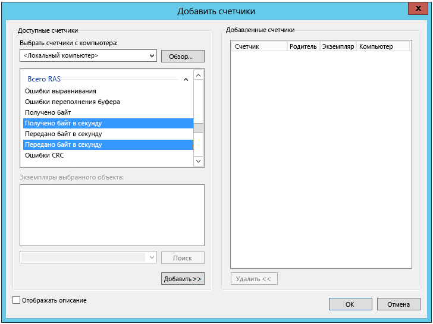
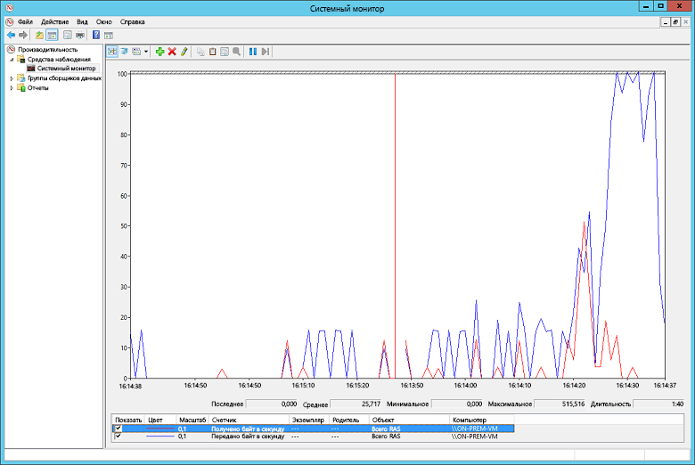

# <a name="troubleshoot-a-hybrid-vpn-connection"></a><span data-ttu-id="aa2d8-103">Устранение неполадок при гибридном VPN-подключении</span><span class="sxs-lookup"><span data-stu-id="aa2d8-103">Troubleshoot a hybrid VPN connection</span></span>

<span data-ttu-id="aa2d8-104">В этой статье приводится ряд советов по устранению неполадок при подключение между локальной сетью и Azure с использованием VPN-шлюза.</span><span class="sxs-lookup"><span data-stu-id="aa2d8-104">This article gives some tips for troubleshooting a VPN gateway connection between an on-premises network and Azure.</span></span> <span data-ttu-id="aa2d8-105">Общие сведения об устранении неполадок, связанных с VPN, см. [здесь][troubleshooting-vpn-errors].</span><span class="sxs-lookup"><span data-stu-id="aa2d8-105">For general information on troubleshooting common VPN-related errors, see [Troubleshooting common VPN related errors][troubleshooting-vpn-errors].</span></span>

## <a name="verify-the-vpn-appliance-is-functioning-correctly"></a><span data-ttu-id="aa2d8-106">Проверка работы VPN-устройства</span><span class="sxs-lookup"><span data-stu-id="aa2d8-106">Verify the VPN appliance is functioning correctly</span></span>

<span data-ttu-id="aa2d8-107">Следующие рекомендации помогут определить, правильно ли работает ваше локальное VPN-устройство.</span><span class="sxs-lookup"><span data-stu-id="aa2d8-107">The following recommendations are useful for determining if your on-premises VPN appliance is functioning correctly.</span></span>

<span data-ttu-id="aa2d8-108">**Проверьте все файлы журнала, созданные VPN-устройством, на наличие ошибок или сбоев.**</span><span class="sxs-lookup"><span data-stu-id="aa2d8-108">**Check any log files generated by the VPN appliance for errors or failures.**</span></span> <span data-ttu-id="aa2d8-109">Так вы сможете определить, правильно ли функционирует VPN-устройство.</span><span class="sxs-lookup"><span data-stu-id="aa2d8-109">This will help you determine if the VPN appliance is functioning correctly.</span></span> <span data-ttu-id="aa2d8-110">Расположение этих сведений будет различаться в зависимости от устройства.</span><span class="sxs-lookup"><span data-stu-id="aa2d8-110">The location of this information will vary according to your appliance.</span></span> <span data-ttu-id="aa2d8-111">Например, при использовании RRAS на базе Windows Server 2012 для отображения сведений об ошибке события для службы RRAS можно использовать следующую команду PowerShell:</span><span class="sxs-lookup"><span data-stu-id="aa2d8-111">For example, if you are using RRAS on Windows Server 2012, you can use the following PowerShell command to display error event information for the RRAS service:</span></span>

```PowerShell
Get-EventLog -LogName System -EntryType Error -Source RemoteAccess | Format-List -Property *
```

<span data-ttu-id="aa2d8-112">В свойстве *Message* каждой записи содержится описание ошибки.</span><span class="sxs-lookup"><span data-stu-id="aa2d8-112">The *Message* property of each entry provides a description of the error.</span></span> <span data-ttu-id="aa2d8-113">Несколько распространенных примеров:</span><span class="sxs-lookup"><span data-stu-id="aa2d8-113">Some common examples are:</span></span>

- <span data-ttu-id="aa2d8-114">Отсутствие подключения, возможной причиной которого является неправильный IP-адрес для шлюза Azure VPN в конфигурации сетевого интерфейса VPN RRAS.</span><span class="sxs-lookup"><span data-stu-id="aa2d8-114">Inability to connect, possibly due to an incorrect IP address specified for the Azure VPN gateway in the RRAS VPN network interface configuration.</span></span>

  ```console
  EventID            : 20111
  MachineName        : on-prem-vm
  Data               : {41, 3, 0, 0}
  Index              : 14231
  Category           : (0)
  CategoryNumber     : 0
  EntryType          : Error
  Message            : RoutingDomainID- {00000000-0000-0000-0000-000000000000}: A demand dial connection to the remote
                          interface AzureGateway on port VPN2-4 was successfully initiated but failed to complete
                          successfully because of the  following error: The network connection between your computer and
                          the VPN server could not be established because the remote server is not responding. This could
                          be because one of the network devices (for example, firewalls, NAT, routers, and so on) between your computer
                          and the remote server is not configured to allow VPN connections. Please contact your
                          Administrator or your service provider to determine which device may be causing the problem.
  Source             : RemoteAccess
  ReplacementStrings : {{00000000-0000-0000-0000-000000000000}, AzureGateway, VPN2-4, The network connection between
                          your computer and the VPN server could not be established because the remote server is not
                          responding. This could be because one of the network devices (for example, firewalls, NAT, routers, and so on)
                          between your computer and the remote server is not configured to allow VPN connections. Please
                          contact your Administrator or your service provider to determine which device may be causing the
                          problem.}
  InstanceId         : 20111
  TimeGenerated      : 3/18/2016 1:26:02 PM
  TimeWritten        : 3/18/2016 1:26:02 PM
  UserName           :
  Site               :
  Container          :
  ```

- <span data-ttu-id="aa2d8-115">Неправильный общий ключ, заданный в конфигурации сетевого интерфейса VPN RRAS.</span><span class="sxs-lookup"><span data-stu-id="aa2d8-115">The wrong shared key being specified in the RRAS VPN network interface configuration.</span></span>

  ```console
  EventID            : 20111
  MachineName        : on-prem-vm
  Data               : {233, 53, 0, 0}
  Index              : 14245
  Category           : (0)
  CategoryNumber     : 0
  EntryType          : Error
  Message            : RoutingDomainID- {00000000-0000-0000-0000-000000000000}: A demand dial connection to the remote
                          interface AzureGateway on port VPN2-4 was successfully initiated but failed to complete
                          successfully because of the  following error: Internet key exchange (IKE) authentication credentials are unacceptable.

  Source             : RemoteAccess
  ReplacementStrings : {{00000000-0000-0000-0000-000000000000}, AzureGateway, VPN2-4, IKE authentication credentials are
                          unacceptable.
                          }
  InstanceId         : 20111
  TimeGenerated      : 3/18/2016 1:34:22 PM
  TimeWritten        : 3/18/2016 1:34:22 PM
  UserName           :
  Site               :
  Container          :
  ```

<span data-ttu-id="aa2d8-116">Вы также можете получить сведения из журнала событий о попытках установить подключение через службу RRAS с помощью следующей команды PowerShell:</span><span class="sxs-lookup"><span data-stu-id="aa2d8-116">You can also obtain event log information about attempts to connect through the RRAS service using the following PowerShell command:</span></span>

```powershell
Get-EventLog -LogName Application -Source RasClient | Format-List -Property *
```

<span data-ttu-id="aa2d8-117">В случае сбоя подключения этот журнал будет содержать ошибки, которые выглядят следующим образом:</span><span class="sxs-lookup"><span data-stu-id="aa2d8-117">In the event of a failure to connect, this log will contain errors that look similar to the following:</span></span>

```console
EventID            : 20227
MachineName        : on-prem-vm
Data               : {}
Index              : 4203
Category           : (0)
CategoryNumber     : 0
EntryType          : Error
Message            : CoId={B4000371-A67F-452F-AA4C-3125AA9CFC78}: The user SYSTEM dialed a connection named
                        AzureGateway that has failed. The error code returned on failure is 809.
Source             : RasClient
ReplacementStrings : {{B4000371-A67F-452F-AA4C-3125AA9CFC78}, SYSTEM, AzureGateway, 809}
InstanceId         : 20227
TimeGenerated      : 3/18/2016 1:29:21 PM
TimeWritten        : 3/18/2016 1:29:21 PM
UserName           :
Site               :
Container          :
```

## <a name="verify-connectivity"></a><span data-ttu-id="aa2d8-118">Проверка подключения</span><span class="sxs-lookup"><span data-stu-id="aa2d8-118">Verify connectivity</span></span>

<span data-ttu-id="aa2d8-119">**Проверьте подключение и маршрутизацию через VPN-шлюз.**</span><span class="sxs-lookup"><span data-stu-id="aa2d8-119">**Verify connectivity and routing across the VPN gateway.**</span></span> <span data-ttu-id="aa2d8-120">VPN-устройство может неправильно осуществлять маршрутизацию трафика через VPN-шлюз Azure.</span><span class="sxs-lookup"><span data-stu-id="aa2d8-120">The VPN appliance may not be correctly routing traffic through the Azure VPN Gateway.</span></span> <span data-ttu-id="aa2d8-121">Используйте [PsPing][psping] для проверки подключения и маршрутизации через VPN-шлюз.</span><span class="sxs-lookup"><span data-stu-id="aa2d8-121">Use a tool such as [PsPing][psping] to verify connectivity and routing across the VPN gateway.</span></span> <span data-ttu-id="aa2d8-122">Например, чтобы проверить соединение с локального компьютера на веб-сервер, расположенный в виртуальной сети, выполните следующую команду (заменив `<<web-server-address>>` адресом веб-сервера):</span><span class="sxs-lookup"><span data-stu-id="aa2d8-122">For example, to test connectivity from an on-premises machine to a web server located on the VNet, run the following command (replacing `<<web-server-address>>` with the address of the web server):</span></span>

```console
PsPing -t <<web-server-address>>:80
```

<span data-ttu-id="aa2d8-123">Если локальный компьютер может осуществлять маршрутизацию трафика на веб-сервер, отобразится результат, аналогичный приведенному ниже:</span><span class="sxs-lookup"><span data-stu-id="aa2d8-123">If the on-premises machine can route traffic to the web server, you should see output similar to the following:</span></span>

```console
D:\PSTools>psping -t 10.20.0.5:80

PsPing v2.01 - PsPing - ping, latency, bandwidth measurement utility
Copyright (C) 2012-2014 Mark Russinovich
Sysinternals - www.sysinternals.com

TCP connect to 10.20.0.5:80:
Infinite iterations (warmup 1) connecting test:
Connecting to 10.20.0.5:80 (warmup): 6.21ms
Connecting to 10.20.0.5:80: 3.79ms
Connecting to 10.20.0.5:80: 3.44ms
Connecting to 10.20.0.5:80: 4.81ms

    Sent = 3, Received = 3, Lost = 0 (0% loss),
    Minimum = 3.44ms, Maximum = 4.81ms, Average = 4.01ms
```

<span data-ttu-id="aa2d8-124">Если локальный компьютер не может связаться с указанным адресом назначения, появятся такие сообщения:</span><span class="sxs-lookup"><span data-stu-id="aa2d8-124">If the on-premises machine cannot communicate with the specified destination, you will see messages like this:</span></span>

```console
D:\PSTools>psping -t 10.20.1.6:80

PsPing v2.01 - PsPing - ping, latency, bandwidth measurement utility
Copyright (C) 2012-2014 Mark Russinovich
Sysinternals - www.sysinternals.com

TCP connect to 10.20.1.6:80:
Infinite iterations (warmup 1) connecting test:
Connecting to 10.20.1.6:80 (warmup): This operation returned because the timeout period expired.
Connecting to 10.20.1.6:80: This operation returned because the timeout period expired.
Connecting to 10.20.1.6:80: This operation returned because the timeout period expired.
Connecting to 10.20.1.6:80: This operation returned because the timeout period expired.
Connecting to 10.20.1.6:80:
    Sent = 3, Received = 0, Lost = 3 (100% loss),
    Minimum = 0.00ms, Maximum = 0.00ms, Average = 0.00ms
```

<span data-ttu-id="aa2d8-125">**Убедитесь, что локальный брандмауэр разрешает передачу VPN-трафика и что открыты соответствующие порты.**</span><span class="sxs-lookup"><span data-stu-id="aa2d8-125">**Verify that the on-premises firewall allows VPN traffic to pass and that the correct ports are opened.**</span></span>

<span data-ttu-id="aa2d8-126">**Убедитесь, что локальное VPN-устройство использует метод шифрования, совместимый с VPN-шлюзом Azure.**</span><span class="sxs-lookup"><span data-stu-id="aa2d8-126">**Verify that the on-premises VPN appliance uses an encryption method that is compatible with the Azure VPN gateway.**</span></span> <span data-ttu-id="aa2d8-127">Для маршрутизации на основе политик VPN-шлюз Azure поддерживает алгоритмы шифрования AES256, AES128 и 3DES.</span><span class="sxs-lookup"><span data-stu-id="aa2d8-127">For policy-based routing, the Azure VPN gateway supports the AES256, AES128, and 3DES encryption algorithms.</span></span> <span data-ttu-id="aa2d8-128">Шлюзы на основе маршрута поддерживают AES256 и 3DES.</span><span class="sxs-lookup"><span data-stu-id="aa2d8-128">Route-based gateways support AES256 and 3DES.</span></span> <span data-ttu-id="aa2d8-129">См. дополнительные сведения о [VPN-устройствах и параметрах IPsec/IKE для подключений "сеть — сеть" через VPN-шлюз][vpn-appliance].</span><span class="sxs-lookup"><span data-stu-id="aa2d8-129">For more information, see [About VPN devices and IPsec/IKE parameters for Site-to-Site VPN Gateway connections][vpn-appliance].</span></span>

## <a name="check-for-problems-with-the-azure-vpn-gateway"></a><span data-ttu-id="aa2d8-130">Проверка на наличие проблем с VPN-шлюзом Azure</span><span class="sxs-lookup"><span data-stu-id="aa2d8-130">Check for problems with the Azure VPN gateway</span></span>

<span data-ttu-id="aa2d8-131">Для определения проблемы с VPN-шлюзом Azure полезны следующие рекомендации:</span><span class="sxs-lookup"><span data-stu-id="aa2d8-131">The following recommendations are useful for determining if there is a problem with the Azure VPN gateway:</span></span>

<span data-ttu-id="aa2d8-132">**Изучите журналы диагностики VPN-шлюза Azure на предмет потенциальных проблем.**</span><span class="sxs-lookup"><span data-stu-id="aa2d8-132">**Examine Azure VPN gateway diagnostic logs for potential issues.**</span></span> <span data-ttu-id="aa2d8-133">См. [пошаговое руководство по сбору журналов диагностики шлюза виртуальной сети Azure Resource Manager][gateway-diagnostic-logs].</span><span class="sxs-lookup"><span data-stu-id="aa2d8-133">See [Step-by-Step: Capturing Azure Resource Manager VNET Gateway Diagnostic Logs][gateway-diagnostic-logs].</span></span>

<span data-ttu-id="aa2d8-134">**Убедитесь, что VPN-шлюз Azure и локальное VPN-устройство настроены с использованием одного и того же общего ключа проверки подлинности.**</span><span class="sxs-lookup"><span data-stu-id="aa2d8-134">**Verify that the Azure VPN gateway and on-premises VPN appliance are configured with the same shared authentication key.**</span></span> <span data-ttu-id="aa2d8-135">Вы можете просмотреть общий ключ, сохраненный VPN-шлюзом Azure, используя следующую команду Azure CLI:</span><span class="sxs-lookup"><span data-stu-id="aa2d8-135">You can view the shared key stored by the Azure VPN gateway using the following Azure CLI command:</span></span>

```azurecli
azure network vpn-connection shared-key show <<resource-group>> <<vpn-connection-name>>
```

<span data-ttu-id="aa2d8-136">Для просмотра общего ключа, настроенного для этого устройства, используйте команду, подходящую для вашего локального VPN-устройства.</span><span class="sxs-lookup"><span data-stu-id="aa2d8-136">Use the command appropriate for your on-premises VPN appliance to show the shared key configured for that appliance.</span></span>

<span data-ttu-id="aa2d8-137">Убедитесь, что подсеть *GatewaySubnet*, в которой размещен VPN-шлюз Azure, не связана с NSG.</span><span class="sxs-lookup"><span data-stu-id="aa2d8-137">Verify that the *GatewaySubnet* subnet holding the Azure VPN gateway is not associated with an NSG.</span></span>

<span data-ttu-id="aa2d8-138">Сведения о подсети можно просмотреть, используя следующую команду Azure CLI:</span><span class="sxs-lookup"><span data-stu-id="aa2d8-138">You can view the subnet details using the following Azure CLI command:</span></span>

```azurecli
azure network vnet subnet show -g <<resource-group>> -e <<vnet-name>> -n GatewaySubnet
```

<span data-ttu-id="aa2d8-139">Убедитесь в отсутствии поля данных с именем *Идентификатор группы безопасности сети*.</span><span class="sxs-lookup"><span data-stu-id="aa2d8-139">Ensure there is no data field named *Network Security Group ID*.</span></span> <span data-ttu-id="aa2d8-140">В следующем примере показаны результаты для экземпляра подсети *GatewaySubnet* с назначенной NSG (*VPN-Gateway-Group*).</span><span class="sxs-lookup"><span data-stu-id="aa2d8-140">The following example shows the results for an instance of the *GatewaySubnet* that has an assigned NSG (*VPN-Gateway-Group*).</span></span> <span data-ttu-id="aa2d8-141">Если для этой NSG определены какие-либо правила, шлюз может неправильно работать.</span><span class="sxs-lookup"><span data-stu-id="aa2d8-141">This can prevent the gateway from working correctly if there are any rules defined for this NSG.</span></span>

```console
C:\>azure network vnet subnet show -g profx-prod-rg -e profx-vnet -n GatewaySubnet
    info:    Executing command network vnet subnet show
    + Looking up virtual network "profx-vnet"
    + Looking up the subnet "GatewaySubnet"
    data:    Id                              : /subscriptions/########-####-####-####-############/resourceGroups/profx-prod-rg/providers/Microsoft.Network/virtualNetworks/profx-vnet/subnets/GatewaySubnet
    data:    Name                            : GatewaySubnet
    data:    Provisioning state              : Succeeded
    data:    Address prefix                  : 10.20.3.0/27
    data:    Network Security Group id       : /subscriptions/########-####-####-####-############/resourceGroups/profx-prod-rg/providers/Microsoft.Network/networkSecurityGroups/VPN-Gateway-Group
    info:    network vnet subnet show command OK
```

<span data-ttu-id="aa2d8-142">**Убедитесь, что виртуальные машины в виртуальной сети Azure настроены для разрешения передачи трафика, поступающего из виртуальной сети.**</span><span class="sxs-lookup"><span data-stu-id="aa2d8-142">**Verify that the virtual machines in the Azure VNet are configured to permit traffic coming in from outside the VNet.**</span></span> <span data-ttu-id="aa2d8-143">Проверьте все правила NSG, связанные с подсетями, содержащими эти виртуальные машины.</span><span class="sxs-lookup"><span data-stu-id="aa2d8-143">Check any NSG rules associated with subnets containing these virtual machines.</span></span> <span data-ttu-id="aa2d8-144">Все правила NSG можно просмотреть, используя следующую команду Azure CLI:</span><span class="sxs-lookup"><span data-stu-id="aa2d8-144">You can view all NSG rules using the following Azure CLI command:</span></span>

```azurecli
azure network nsg show -g <<resource-group>> -n <<nsg-name>>
```

<span data-ttu-id="aa2d8-145">**Убедитесь, что подключен VPN-шлюз Azure.**</span><span class="sxs-lookup"><span data-stu-id="aa2d8-145">**Verify that the Azure VPN gateway is connected.**</span></span> <span data-ttu-id="aa2d8-146">Чтобы проверить текущее состояние VPN-подключения Azure, можно использовать следующую команду Azure PowerShell.</span><span class="sxs-lookup"><span data-stu-id="aa2d8-146">You can use the following Azure PowerShell command to check the current status of the Azure VPN connection.</span></span> <span data-ttu-id="aa2d8-147">Параметр `<<connection-name>>` представляет собой имя VPN-подключения Azure, которое связывает шлюз виртуальной сети с локальным.</span><span class="sxs-lookup"><span data-stu-id="aa2d8-147">The `<<connection-name>>` parameter is the name of the Azure VPN connection that links the virtual network gateway and the local gateway.</span></span>

```powershell
Get-AzureRmVirtualNetworkGatewayConnection -Name <<connection-name>> - ResourceGroupName <<resource-group>>
```

<span data-ttu-id="aa2d8-148">В следующем фрагменте кода показаны результаты для подключенного (первый пример) и отключенного шлюза (второй пример):</span><span class="sxs-lookup"><span data-stu-id="aa2d8-148">The following snippets highlight the output generated if the gateway is connected (the first example), and disconnected (the second example):</span></span>

```powershell
PS C:\> Get-AzureRmVirtualNetworkGatewayConnection -Name profx-gateway-connection -ResourceGroupName profx-prod-rg

AuthorizationKey           :
VirtualNetworkGateway1     : Microsoft.Azure.Commands.Network.Models.PSVirtualNetworkGateway
VirtualNetworkGateway2     :
LocalNetworkGateway2       : Microsoft.Azure.Commands.Network.Models.PSLocalNetworkGateway
Peer                       :
ConnectionType             : IPsec
RoutingWeight              : 0
SharedKey                  : ####################################
ConnectionStatus           : Connected
EgressBytesTransferred     : 55254803
IngressBytesTransferred    : 32227221
ProvisioningState          : Succeeded
...
```

```powershell
PS C:\> Get-AzureRmVirtualNetworkGatewayConnection -Name profx-gateway-connection2 -ResourceGroupName profx-prod-rg

AuthorizationKey           :
VirtualNetworkGateway1     : Microsoft.Azure.Commands.Network.Models.PSVirtualNetworkGateway
VirtualNetworkGateway2     :
LocalNetworkGateway2       : Microsoft.Azure.Commands.Network.Models.PSLocalNetworkGateway
Peer                       :
ConnectionType             : IPsec
RoutingWeight              : 0
SharedKey                  : ####################################
ConnectionStatus           : NotConnected
EgressBytesTransferred     : 0
IngressBytesTransferred    : 0
ProvisioningState          : Succeeded
...
```

## <a name="miscellaneous-issues"></a><span data-ttu-id="aa2d8-149">Прочие проблемы</span><span class="sxs-lookup"><span data-stu-id="aa2d8-149">Miscellaneous issues</span></span>

<span data-ttu-id="aa2d8-150">Следующие рекомендации помогут определить, имеются ли проблемы с конфигурацией виртуальной машины узла, использованием пропускной способности сети или производительностью приложения:</span><span class="sxs-lookup"><span data-stu-id="aa2d8-150">The following recommendations are useful for determining if there is an issue with Host VM configuration, network bandwidth utilization, or application performance:</span></span>

<span data-ttu-id="aa2d8-151">**Проверьте конфигурацию брандмауэра.**</span><span class="sxs-lookup"><span data-stu-id="aa2d8-151">**Verify firewall configuration.**</span></span> <span data-ttu-id="aa2d8-152">Проверьте правильность настройки брандмауэра в гостевой ОС на виртуальных машинах Azure в подсети, чтобы разрешить передачу трафика из локальных диапазонов IP-адресов.</span><span class="sxs-lookup"><span data-stu-id="aa2d8-152">Verify that the firewall in the guest operating system running on the Azure VMs in the subnet is configured correctly to allow permitted traffic from the on-premises IP ranges.</span></span>

<span data-ttu-id="aa2d8-153">**Убедитесь, что объем трафика не приближается к лимиту пропускной способности VPN-шлюза Azure.**</span><span class="sxs-lookup"><span data-stu-id="aa2d8-153">**Verify that the volume of traffic is not close to the limit of the bandwidth available to the Azure VPN gateway.**</span></span> <span data-ttu-id="aa2d8-154">Это можно проверить по локальному запущенному VPN-устройству.</span><span class="sxs-lookup"><span data-stu-id="aa2d8-154">How to verify this depends on the VPN appliance running on-premises.</span></span> <span data-ttu-id="aa2d8-155">Например, при использовании RRAS на базе Windows Server 2012 можно использовать системный монитор для отслеживания объема данных, полученных и переданных по VPN-подключению.</span><span class="sxs-lookup"><span data-stu-id="aa2d8-155">For example, if you are using RRAS on Windows Server 2012, you can use Performance Monitor to track the volume of data being received and transmitted over the VPN connection.</span></span> <span data-ttu-id="aa2d8-156">С помощью объекта *Всего RAS* выберите счетчики *Получено байт/сек* и *Передано байт/сек*:</span><span class="sxs-lookup"><span data-stu-id="aa2d8-156">Using the *RAS Total* object, select the *Bytes Received/Sec* and *Bytes Transmitted/Sec* counters:</span></span>



<span data-ttu-id="aa2d8-158">Следует сравнить результаты с пропускной способностью VPN-шлюза (от 100 Мбит/с для SKU "Базовый" или "Стандартный" до 1,25 Гбит/с для SKU VpnGw3):</span><span class="sxs-lookup"><span data-stu-id="aa2d8-158">You should compare the results with the bandwidth available to the VPN gateway (from 100 Mbps for the Basic SKU to 1.25 Gbps for VpnGw3 SKU):</span></span>



<span data-ttu-id="aa2d8-160">**Убедитесь, что вы развернули правильное количество виртуальных машин нужного размера в соответствии с загруженностью приложения.**</span><span class="sxs-lookup"><span data-stu-id="aa2d8-160">**Verify that you have deployed the right number and size of VMs for your application load.**</span></span> <span data-ttu-id="aa2d8-161">Определите, работает ли какая-либо из виртуальных машин в виртуальной сети Azure медленно.</span><span class="sxs-lookup"><span data-stu-id="aa2d8-161">Determine if any of the virtual machines in the Azure VNet are running slowly.</span></span> <span data-ttu-id="aa2d8-162">Если это так, то они могут быть перегружены, возможно, их слишком мало для такой загрузки или подсистемы балансировки нагрузки настроены неправильно.</span><span class="sxs-lookup"><span data-stu-id="aa2d8-162">If so, they may be overloaded, there may be too few to handle the load, or the load-balancers may not be configured correctly.</span></span> <span data-ttu-id="aa2d8-163">Чтобы определить это, [соберите и проанализируйте диагностические сведения][azure-vm-diagnostics].</span><span class="sxs-lookup"><span data-stu-id="aa2d8-163">To determine this, [capture and analyze diagnostic information][azure-vm-diagnostics].</span></span> <span data-ttu-id="aa2d8-164">Вы можете проверить результаты, используя портал Azure. Кроме того, вы можете воспользоваться различными сторонними средствами, чтобы получить подробное представление о производительности.</span><span class="sxs-lookup"><span data-stu-id="aa2d8-164">You can examine the results using the Azure portal, but many third-party tools are also available that can provide detailed insights into the performance data.</span></span>

<span data-ttu-id="aa2d8-165">**Убедитесь, что приложение эффективно использует облачные ресурсы.**</span><span class="sxs-lookup"><span data-stu-id="aa2d8-165">**Verify that the application is making efficient use of cloud resources.**</span></span> <span data-ttu-id="aa2d8-166">Выполните инструментирование кода приложений, выполняемых на каждой виртуальной машине, чтобы определить, используют ли приложения ресурсы максимально эффективно.</span><span class="sxs-lookup"><span data-stu-id="aa2d8-166">Instrument application code running on each VM to determine whether applications are making the best use of resources.</span></span> <span data-ttu-id="aa2d8-167">Используйте такое средство, как [Application Insights][application-insights].</span><span class="sxs-lookup"><span data-stu-id="aa2d8-167">You can use tools such as [Application Insights][application-insights].</span></span>

<!-- links -->

[application-insights]: /azure/application-insights/app-insights-overview-usage
[azure-vm-diagnostics]: https://azure.microsoft.com/blog/windows-azure-virtual-machine-monitoring-with-wad-extension/
[gateway-diagnostic-logs]: https://blogs.technet.microsoft.com/keithmayer/2016/10/12/step-by-step-capturing-azure-resource-manager-arm-vnet-gateway-diagnostic-logs/
[psping]: https://technet.microsoft.com/sysinternals/jj729731.aspx
[troubleshooting-vpn-errors]: https://blogs.technet.microsoft.com/rrasblog/2009/08/12/troubleshooting-common-vpn-related-errors/
[vpn-appliance]: /azure/vpn-gateway/vpn-gateway-about-vpn-devices
