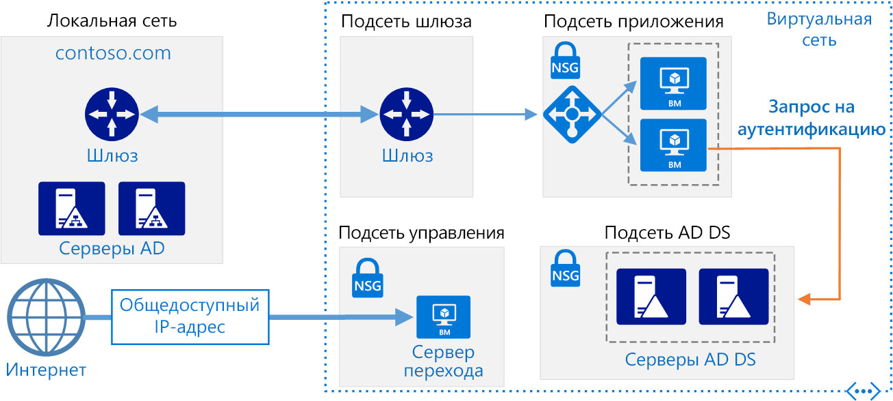
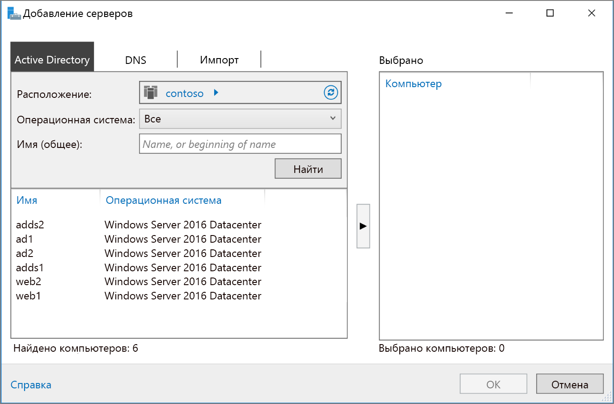

# <a name="extend-active-directory-domain-services-ad-ds-to-azure"></a><span data-ttu-id="be0cf-103">Расширение доменных служб Active Directory в Azure</span><span class="sxs-lookup"><span data-stu-id="be0cf-103">Extend Active Directory Domain Services (AD DS) to Azure</span></span>

<span data-ttu-id="be0cf-104">На схеме эталонной архитектуры представлены способы расширения среды Active Directory в Azure для предоставления распределенных служб аутентификации с помощью доменных служб Active Directory (AD DS).</span><span class="sxs-lookup"><span data-stu-id="be0cf-104">This reference architecture shows how to extend your Active Directory environment to Azure to provide distributed authentication services using Active Directory Domain Services (AD DS).</span></span> <span data-ttu-id="be0cf-105">[**Разверните это решение**](#deploy-the-solution).</span><span class="sxs-lookup"><span data-stu-id="be0cf-105">[**Deploy this solution**](#deploy-the-solution).</span></span>



<span data-ttu-id="be0cf-107">*Скачайте [файл Visio][visio-download] этой архитектуры.*</span><span class="sxs-lookup"><span data-stu-id="be0cf-107">*Download a [Visio file][visio-download] of this architecture.*</span></span>

<span data-ttu-id="be0cf-108">С помощью доменных служб Active Directory вы можете выполнить аутентификацию пользователя, компьютера, приложения или других идентификаторов, которые включены в домен безопасности.</span><span class="sxs-lookup"><span data-stu-id="be0cf-108">AD DS is used to authenticate user, computer, application, or other identities that are included in a security domain.</span></span> <span data-ttu-id="be0cf-109">Они могут быть размещены локально. Если же приложение размещено частично локально и частично в Azure, эффективней выполнить репликацию этой функциональности в Azure.</span><span class="sxs-lookup"><span data-stu-id="be0cf-109">It can be hosted on-premises, but if your application is hosted partly on-premises and partly in Azure, it may be more efficient to replicate this functionality in Azure.</span></span> <span data-ttu-id="be0cf-110">Это позволяет сократить задержки, вызванные отправкой запросов на аутентификацию и локальную авторизацию из облака обратно в доменные службы Active Directory, запущенные в локальной среде.</span><span class="sxs-lookup"><span data-stu-id="be0cf-110">This can reduce the latency caused by sending authentication and local authorization requests from the cloud back to AD DS running on-premises.</span></span>

<span data-ttu-id="be0cf-111">Эта архитектура чаще всего используется при подключении к локальной и виртуальной сети Azure по VPN или ExpressRoute.</span><span class="sxs-lookup"><span data-stu-id="be0cf-111">This architecture is commonly used when the on-premises network and the Azure virtual network are connected by a VPN or ExpressRoute connection.</span></span> <span data-ttu-id="be0cf-112">Она также поддерживает двунаправленную репликацию. Это означает, что изменения могут быть выполнены локально или в облаке и оба источника будут согласованы.</span><span class="sxs-lookup"><span data-stu-id="be0cf-112">This architecture also supports bidirectional replication, meaning changes can be made either on-premises or in the cloud, and both sources will be kept consistent.</span></span> <span data-ttu-id="be0cf-113">Типичные способы применения этой архитектуры включают гибридные приложения, в которых функции распределяются между локальными приложениями и Azure, а также приложения и службы, которые выполняют аутентификацию с помощью Active Directory.</span><span class="sxs-lookup"><span data-stu-id="be0cf-113">Typical uses for this architecture include hybrid applications in which functionality is distributed between on-premises and Azure, and applications and services that perform authentication using Active Directory.</span></span>

<span data-ttu-id="be0cf-114">Дополнительные рекомендации см. в статье [Выбор решения для интеграции локальной среды Active Directory с Azure][considerations].</span><span class="sxs-lookup"><span data-stu-id="be0cf-114">For additional considerations, see [Choose a solution for integrating on-premises Active Directory with Azure][considerations].</span></span>

## <a name="architecture"></a><span data-ttu-id="be0cf-115">Архитектура</span><span class="sxs-lookup"><span data-stu-id="be0cf-115">Architecture</span></span>

<span data-ttu-id="be0cf-116">Эта архитектура расширяет архитектуру, описанную в статье [DMZ between Azure and the Internet][implementing-a-secure-hybrid-network-architecture-with-internet-access] (Сеть периметра между Azure и Интернетом).</span><span class="sxs-lookup"><span data-stu-id="be0cf-116">This architecture extends the architecture shown in [DMZ between Azure and the Internet][implementing-a-secure-hybrid-network-architecture-with-internet-access].</span></span> <span data-ttu-id="be0cf-117">Она содержит следующие компоненты.</span><span class="sxs-lookup"><span data-stu-id="be0cf-117">It has the following components.</span></span>

- <span data-ttu-id="be0cf-118">**Локальная сеть.**</span><span class="sxs-lookup"><span data-stu-id="be0cf-118">**On-premises network**.</span></span> <span data-ttu-id="be0cf-119">Локальная сеть включает локальные серверы Active Directory, которые могут выполнять аутентификацию и авторизацию для компонентов, установленных локально.</span><span class="sxs-lookup"><span data-stu-id="be0cf-119">The on-premises network includes local Active Directory servers that can perform authentication and authorization for components located on-premises.</span></span>
- <span data-ttu-id="be0cf-120">**Серверы Active Directory**.</span><span class="sxs-lookup"><span data-stu-id="be0cf-120">**Active Directory servers**.</span></span> <span data-ttu-id="be0cf-121">Они являются контроллерами домена, которые реализуют службы каталогов (AD DS), работающие в облаке в качестве виртуальных машин.</span><span class="sxs-lookup"><span data-stu-id="be0cf-121">These are domain controllers implementing directory services (AD DS) running as VMs in the cloud.</span></span> <span data-ttu-id="be0cf-122">Эти серверы могут выполнить аутентификацию компонентов, работающих в виртуальной сети Azure.</span><span class="sxs-lookup"><span data-stu-id="be0cf-122">These servers can provide authentication of components running in your Azure virtual network.</span></span>
- <span data-ttu-id="be0cf-123">**Подсеть Active Directory**.</span><span class="sxs-lookup"><span data-stu-id="be0cf-123">**Active Directory subnet**.</span></span> <span data-ttu-id="be0cf-124">Серверы доменных служб Active Directory находятся в отдельной подсети.</span><span class="sxs-lookup"><span data-stu-id="be0cf-124">The AD DS servers are hosted in a separate subnet.</span></span> <span data-ttu-id="be0cf-125">Правила группы безопасности сети (NSG) защищают серверы доменных служб Active Directory и предоставляют брандмауэр для трафика из неизвестных источников.</span><span class="sxs-lookup"><span data-stu-id="be0cf-125">Network security group (NSG) rules protect the AD DS servers and provide a firewall against traffic from unexpected sources.</span></span>
- <span data-ttu-id="be0cf-126">**Синхронизация шлюза Azure и Active Directory**.</span><span class="sxs-lookup"><span data-stu-id="be0cf-126">**Azure Gateway and Active Directory synchronization**.</span></span> <span data-ttu-id="be0cf-127">Шлюз Azure обеспечивает соединение между локальной и виртуальной сетями Azure.</span><span class="sxs-lookup"><span data-stu-id="be0cf-127">The Azure gateway provides a connection between the on-premises network and the Azure VNet.</span></span> <span data-ttu-id="be0cf-128">Это может быть [VPN-подключение][azure-vpn-gateway] или [Azure ExpressRoute][azure-expressroute].</span><span class="sxs-lookup"><span data-stu-id="be0cf-128">This can be a [VPN connection][azure-vpn-gateway] or [Azure ExpressRoute][azure-expressroute].</span></span> <span data-ttu-id="be0cf-129">Все запросы на синхронизацию между серверами Active Directory локально и в облаке передаются через шлюз.</span><span class="sxs-lookup"><span data-stu-id="be0cf-129">All synchronization requests between the Active Directory servers in the cloud and on-premises pass through the gateway.</span></span> <span data-ttu-id="be0cf-130">Определенные пользователем маршруты отвечают за маршрутизацию локального трафика, передаваемого в Azure.</span><span class="sxs-lookup"><span data-stu-id="be0cf-130">User-defined routes (UDRs) handle routing for on-premises traffic that passes to Azure.</span></span> <span data-ttu-id="be0cf-131">Трафик от серверов Active Directory не проходит через виртуальный модуль сети (NVAs), используемый в этом сценарии.</span><span class="sxs-lookup"><span data-stu-id="be0cf-131">Traffic to and from the Active Directory servers does not pass through the network virtual appliances (NVAs) used in this scenario.</span></span>

<span data-ttu-id="be0cf-132">Дополнительные сведения см. в статье [DMZ between Azure and your on-premises datacenter][implementing-a-secure-hybrid-network-architecture] (Сеть периметра между Azure и локальным центром обработки данных).</span><span class="sxs-lookup"><span data-stu-id="be0cf-132">For more information about configuring UDRs and the NVAs, see [Implementing a secure hybrid network architecture in Azure][implementing-a-secure-hybrid-network-architecture].</span></span>

## <a name="recommendations"></a><span data-ttu-id="be0cf-133">Рекомендации</span><span class="sxs-lookup"><span data-stu-id="be0cf-133">Recommendations</span></span>

<span data-ttu-id="be0cf-134">Следующие рекомендации применимы для большинства ситуаций.</span><span class="sxs-lookup"><span data-stu-id="be0cf-134">The following recommendations apply for most scenarios.</span></span> <span data-ttu-id="be0cf-135">Следуйте этим рекомендациям, если они не противоречат особым требованиям для вашего случая.</span><span class="sxs-lookup"><span data-stu-id="be0cf-135">Follow these recommendations unless you have a specific requirement that overrides them.</span></span>

### <a name="vm-recommendations"></a><span data-ttu-id="be0cf-136">Рекомендации по виртуальным машинам</span><span class="sxs-lookup"><span data-stu-id="be0cf-136">VM recommendations</span></span>

<span data-ttu-id="be0cf-137">Определите требования к [размеру виртуальной машины][vm-windows-sizes] на основе ожидаемого объема запросов на аутентификацию.</span><span class="sxs-lookup"><span data-stu-id="be0cf-137">Determine your [VM size][vm-windows-sizes] requirements based on the expected volume of authentication requests.</span></span> <span data-ttu-id="be0cf-138">В качестве отправной точки используйте спецификации компьютеров, на которых локально размещены AD DS, и сопоставьте их с размерами виртуальных машин Azure.</span><span class="sxs-lookup"><span data-stu-id="be0cf-138">Use the specifications of the machines hosting AD DS on premises as a starting point, and match them with the Azure VM sizes.</span></span> <span data-ttu-id="be0cf-139">После развертывания отслеживайте использование и регулируйте масштаб на основе фактической нагрузки на виртуальных машинах.</span><span class="sxs-lookup"><span data-stu-id="be0cf-139">Once deployed, monitor utilization and scale up or down based on the actual load on the VMs.</span></span> <span data-ttu-id="be0cf-140">Дополнительные сведения об изменении размера контроллеров домена AD DS см. в статье [Capacity Planning for Active Directory Domain Services][capacity-planning-for-adds] (Планирование ресурсов для доменных служб Active Directory).</span><span class="sxs-lookup"><span data-stu-id="be0cf-140">For more information about sizing AD DS domain controllers, see [Capacity Planning for Active Directory Domain Services][capacity-planning-for-adds].</span></span>

<span data-ttu-id="be0cf-141">Создайте отдельный виртуальный диск данных для хранения базы данных, журналов и SYSVOL для Active Directory.</span><span class="sxs-lookup"><span data-stu-id="be0cf-141">Create a separate virtual data disk for storing the database, logs, and SYSVOL for Active Directory.</span></span> <span data-ttu-id="be0cf-142">Не храните эти элементы на одном диске с операционной системой.</span><span class="sxs-lookup"><span data-stu-id="be0cf-142">Do not store these items on the same disk as the operating system.</span></span> <span data-ttu-id="be0cf-143">Обратите внимание, что диски данных, подключенные к виртуальной машине, используют кэширование со сквозной записью.</span><span class="sxs-lookup"><span data-stu-id="be0cf-143">Note that by default, data disks that are attached to a VM use write-through caching.</span></span> <span data-ttu-id="be0cf-144">Однако эта форма кэширования может нарушать требования доменных служб Active Directory.</span><span class="sxs-lookup"><span data-stu-id="be0cf-144">However, this form of caching can conflict with the requirements of AD DS.</span></span> <span data-ttu-id="be0cf-145">Поэтому для параметра *настройки кэша узла* на диске данных задайте значение *Нет*.</span><span class="sxs-lookup"><span data-stu-id="be0cf-145">For this reason, set the *Host Cache Preference* setting on the data disk to *None*.</span></span> <span data-ttu-id="be0cf-146">См. [рекомендации по развертыванию Windows Server Active Directory на виртуальных машинах Azure][adds-data-disks].</span><span class="sxs-lookup"><span data-stu-id="be0cf-146">For more information, see [Guidelines for Deploying Windows Server Active Directory on Azure Virtual Machines][adds-data-disks].</span></span>

<span data-ttu-id="be0cf-147">Разверните по крайней мере две виртуальные машины доменных служб Active Directory в качестве контроллеров домена и добавьте их в [группу доступности][availability-set].</span><span class="sxs-lookup"><span data-stu-id="be0cf-147">Deploy at least two VMs running AD DS as domain controllers and add them to an [availability set][availability-set].</span></span>

### <a name="networking-recommendations"></a><span data-ttu-id="be0cf-148">Рекомендации по сети</span><span class="sxs-lookup"><span data-stu-id="be0cf-148">Networking recommendations</span></span>

<span data-ttu-id="be0cf-149">Настройте сетевой интерфейс виртуальной машины для каждого сервера доменных служб Active Directory с помощью статического частного IP-адреса для поддержки службы доменных имен (DNS).</span><span class="sxs-lookup"><span data-stu-id="be0cf-149">Configure the VM network interface (NIC) for each AD DS server with a static private IP address for full domain name service (DNS) support.</span></span> <span data-ttu-id="be0cf-150">Дополнительные сведения см. в статье [Настройка частных IP-адресов для виртуальной машины с помощью портала Azure][set-a-static-ip-address].</span><span class="sxs-lookup"><span data-stu-id="be0cf-150">For more information, see [How to set a static private IP address in the Azure portal][set-a-static-ip-address].</span></span>

> [!NOTE]
> <span data-ttu-id="be0cf-151">Не настраивайте сетевой интерфейс виртуальной машины для доменных служб Active Directory с общедоступными IP-адресами.</span><span class="sxs-lookup"><span data-stu-id="be0cf-151">Do not configure the VM NIC for any AD DS with a public IP address.</span></span> <span data-ttu-id="be0cf-152">Дополнительные сведения см. в разделе [Вопросы безопасности][security-considerations] этой статьи.</span><span class="sxs-lookup"><span data-stu-id="be0cf-152">See [Security considerations][security-considerations] for more details.</span></span>
>

<span data-ttu-id="be0cf-153">Чтобы разрешить входящий трафик из локальной среды, для подсети NSG Active Directory необходимы правила.</span><span class="sxs-lookup"><span data-stu-id="be0cf-153">The Active Directory subnet NSG requires rules to permit incoming traffic from on-premises.</span></span> <span data-ttu-id="be0cf-154">Подробные сведения о портах, используемых доменными службами Active Directory, см. в статье [Active Directory and Active Directory Domain Services Port Requirements][ad-ds-ports] (Требования доменных служб Active Directory и порта доменных служб Active Directory).</span><span class="sxs-lookup"><span data-stu-id="be0cf-154">For detailed information on the ports used by AD DS, see [Active Directory and Active Directory Domain Services Port Requirements][ad-ds-ports].</span></span> <span data-ttu-id="be0cf-155">Кроме того, убедитесь, что таблицы UDR не направляют трафик доменных служб Active Directory через виртуальные сетевые устройства, используемые в этой архитектуре.</span><span class="sxs-lookup"><span data-stu-id="be0cf-155">Also, ensure the UDR tables do not route AD DS traffic through the NVAs used in this architecture.</span></span>

### <a name="active-directory-site"></a><span data-ttu-id="be0cf-156">Веб-сайт Active Directory</span><span class="sxs-lookup"><span data-stu-id="be0cf-156">Active Directory site</span></span>

<span data-ttu-id="be0cf-157">В доменных службах Active Directory веб-сайт представляет собой физическое расположение, сеть или коллекцию устройств.</span><span class="sxs-lookup"><span data-stu-id="be0cf-157">In AD DS, a site represents a physical location, network, or collection of devices.</span></span> <span data-ttu-id="be0cf-158">Сайты доменных служб Active Directory используются для управления репликацией базы данных AD DS путем группирования объектов, которые расположены рядом друг с другом и соединены высокоскоростной сетью.</span><span class="sxs-lookup"><span data-stu-id="be0cf-158">AD DS sites are used to manage AD DS database replication by grouping together AD DS objects that are located close to one another and are connected by a high speed network.</span></span> <span data-ttu-id="be0cf-159">Доменные службы Active Directory включают логику, чтобы выбрать оптимальную стратегию для разделения базы данных между сайтами.</span><span class="sxs-lookup"><span data-stu-id="be0cf-159">AD DS includes logic to select the best strategy for replacating the AD DS database between sites.</span></span>

<span data-ttu-id="be0cf-160">Мы рекомендуем создать сайт доменных служб Active Directory, включая определенные подсети для вашего приложения в Azure.</span><span class="sxs-lookup"><span data-stu-id="be0cf-160">We recommend that you create an AD DS site including the subnets defined for your application in Azure.</span></span> <span data-ttu-id="be0cf-161">Затем настройте связь между локальными сайтами доменных служб Active Directory, которые автоматически выполнят наиболее эффективную репликацию базы данных.</span><span class="sxs-lookup"><span data-stu-id="be0cf-161">Then, configure a site link between your on-premises AD DS sites, and AD DS will automatically perform the most efficient database replication possible.</span></span> <span data-ttu-id="be0cf-162">Обратите внимание, что такая репликация требует дополнительных настроек.</span><span class="sxs-lookup"><span data-stu-id="be0cf-162">Note that this database replication requires little beyond the initial configuration.</span></span>

### <a name="active-directory-operations-masters"></a><span data-ttu-id="be0cf-163">Хозяева операций Active Directory</span><span class="sxs-lookup"><span data-stu-id="be0cf-163">Active Directory operations masters</span></span>

<span data-ttu-id="be0cf-164">Роль хозяина операции может быть назначена контроллерам домена AD DS для поддержки проверки целостности между экземплярами реплицируемых баз данных AD DS.</span><span class="sxs-lookup"><span data-stu-id="be0cf-164">The operations masters role can be assigned to AD DS domain controllers to support consistency checking between instances of replicated AD DS databases.</span></span> <span data-ttu-id="be0cf-165">Существует пять видов ролей: хозяин схемы, хозяин именования доменов, хозяин относительных идентификаторов, эмулятор хозяина основного контроллера домена и хозяин инфраструктуры.</span><span class="sxs-lookup"><span data-stu-id="be0cf-165">There are five operations master roles: schema master, domain naming master, relative identifier master, primary domain controller master emulator, and infrastructure master.</span></span> <span data-ttu-id="be0cf-166">Дополнительные сведения об этих ролях см. в статье [What are Operations Masters?][ad-ds-operations-masters] (Что собой представляет хозяин операции?).</span><span class="sxs-lookup"><span data-stu-id="be0cf-166">For more information about these roles, see [What are Operations Masters?][ad-ds-operations-masters].</span></span>

<span data-ttu-id="be0cf-167">Мы рекомендуем не присваивать роли хозяина операций контроллерам домена, развертываемым в Azure.</span><span class="sxs-lookup"><span data-stu-id="be0cf-167">We recommend you do not assign operations masters roles to the domain controllers deployed in Azure.</span></span>

### <a name="monitoring"></a><span data-ttu-id="be0cf-168">Мониторинг</span><span class="sxs-lookup"><span data-stu-id="be0cf-168">Monitoring</span></span>

<span data-ttu-id="be0cf-169">Отследите ресурсы контроллера домена виртуальных машин, а также службы AD DS и создайте план для быстрого устранения неполадок.</span><span class="sxs-lookup"><span data-stu-id="be0cf-169">Monitor the resources of the domain controller VMs as well as the AD DS Services and create a plan to quickly correct any problems.</span></span> <span data-ttu-id="be0cf-170">Дополнительные сведения см. в документе [Monitoring Active Directory][monitoring_ad] (Мониторинг Active Directory).</span><span class="sxs-lookup"><span data-stu-id="be0cf-170">For more information, see [Monitoring Active Directory][monitoring_ad].</span></span> <span data-ttu-id="be0cf-171">Вы также можете установить инструменты (например, [Microsoft Systems Center][microsoft_systems_center]) на сервере мониторинга (см. диаграмму архитектуры) для выполнения этих задач.</span><span class="sxs-lookup"><span data-stu-id="be0cf-171">You can also install tools such as [Microsoft Systems Center][microsoft_systems_center] on the monitoring server (see the architecture diagram) to help perform these tasks.</span></span>

## <a name="scalability-considerations"></a><span data-ttu-id="be0cf-172">Вопросы масштабируемости</span><span class="sxs-lookup"><span data-stu-id="be0cf-172">Scalability considerations</span></span>

<span data-ttu-id="be0cf-173">Доменные службы Active Directory предназначены для масштабируемости.</span><span class="sxs-lookup"><span data-stu-id="be0cf-173">AD DS is designed for scalability.</span></span> <span data-ttu-id="be0cf-174">Вам не нужно настраивать подсистему балансировки нагрузки или контроллер трафика, чтобы направлять запросы к контроллерам домена AD DS.</span><span class="sxs-lookup"><span data-stu-id="be0cf-174">You don't need to configure a load balancer or traffic controller to direct requests to AD DS domain controllers.</span></span> <span data-ttu-id="be0cf-175">Единственное, что следует учитывать для масштабируемости, — это настройка виртуальных машин, запущенных AD DS, с оптимальным размером соответственно требованиям нагрузки сети, мониторинг нагрузки на виртуальных машинах и масштабирование при необходимости.</span><span class="sxs-lookup"><span data-stu-id="be0cf-175">The only scalability consideration is to configure the VMs running AD DS with the correct size for your network load requirements, monitor the load on the VMs, and scale up or down as necessary.</span></span>

## <a name="availability-considerations"></a><span data-ttu-id="be0cf-176">Вопросы доступности</span><span class="sxs-lookup"><span data-stu-id="be0cf-176">Availability considerations</span></span>

<span data-ttu-id="be0cf-177">Разверните виртуальные машины, запущенные в доменных службах Active Directory, в [группу доступности][availability-set].</span><span class="sxs-lookup"><span data-stu-id="be0cf-177">Deploy the VMs running AD DS into an [availability set][availability-set].</span></span> <span data-ttu-id="be0cf-178">Кроме того, стоит рассмотреть возможность назначения роли [резервного хозяина операций][standby-operations-masters] для по крайней мере одного сервера, а может и для нескольких (в зависимости от требований).</span><span class="sxs-lookup"><span data-stu-id="be0cf-178">Also, consider assigning the role of [standby operations master][standby-operations-masters] to at least one server, and possibly more depending on your requirements.</span></span> <span data-ttu-id="be0cf-179">Резервный хозяин операций — это активная копия хозяина операций, которая может использоваться вместо основного во время отработки отказа.</span><span class="sxs-lookup"><span data-stu-id="be0cf-179">A standby operations master is an active copy of the operations master that can be used in place of the primary operations masters server during fail over.</span></span>

## <a name="manageability-considerations"></a><span data-ttu-id="be0cf-180">Вопросы управляемости</span><span class="sxs-lookup"><span data-stu-id="be0cf-180">Manageability considerations</span></span>

<span data-ttu-id="be0cf-181">Выполняйте обычное резервное копирование доменных служб Active Directory.</span><span class="sxs-lookup"><span data-stu-id="be0cf-181">Perform regular AD DS backups.</span></span> <span data-ttu-id="be0cf-182">Не копируйте VHD-файлы контроллеров домена вместо выполнения обычного резервного копирования, так как файл базы данных AD DS на виртуальном диске может быть не согласован при копировании, запрещая перезапустить базу данных.</span><span class="sxs-lookup"><span data-stu-id="be0cf-182">Don't simply copy the VHD files of domain controllers instead of performing regular backups, because the AD DS database file on the VHD may not be in a consistent state when it's copied, making it impossible to restart the database.</span></span>

<span data-ttu-id="be0cf-183">Не выключайте контроллер домена виртуальной машины с помощью портала Azure.</span><span class="sxs-lookup"><span data-stu-id="be0cf-183">Do not shut down a domain controller VM using Azure portal.</span></span> <span data-ttu-id="be0cf-184">Выключайте и перезапускайте его из гостевой операционной системы.</span><span class="sxs-lookup"><span data-stu-id="be0cf-184">Instead, shut down and restart from the guest operating system.</span></span> <span data-ttu-id="be0cf-185">Выключение на портале приводит к отмене распределения виртуальной машины, а это сбрасывает `VM-GenerationID` и `invocationID` репозитория Active Directory.</span><span class="sxs-lookup"><span data-stu-id="be0cf-185">Shutting down through the portal causes the VM to be deallocated, which resets both the `VM-GenerationID` and the `invocationID` of the Active Directory repository.</span></span> <span data-ttu-id="be0cf-186">Пул относительного идентификатора (RID) доменных служб Active Directory удаляется и SYSVOL помечает как не заслуживающий доверия. Кроме того, может потребоваться перенастройка контроллера домена.</span><span class="sxs-lookup"><span data-stu-id="be0cf-186">This discards the AD DS relative identifier (RID) pool and marks SYSVOL as nonauthoritative, and may require reconfiguration of the domain controller.</span></span>

## <a name="security-considerations"></a><span data-ttu-id="be0cf-187">Вопросы безопасности</span><span class="sxs-lookup"><span data-stu-id="be0cf-187">Security considerations</span></span>

<span data-ttu-id="be0cf-188">Серверы доменных служб Active Directory предоставляют службы аутентификации и часто подвергаются атакам.</span><span class="sxs-lookup"><span data-stu-id="be0cf-188">AD DS servers provide authentication services and are an attractive target for attacks.</span></span> <span data-ttu-id="be0cf-189">Чтобы защитить их, предотвратите прямое подключение к Интернету, поместив серверы AD DS в отдельной подсети с группой безопасности сети в качестве брандмауэра.</span><span class="sxs-lookup"><span data-stu-id="be0cf-189">To secure them, prevent direct Internet connectivity by placing the AD DS servers in a separate subnet with an NSG acting as a firewall.</span></span> <span data-ttu-id="be0cf-190">Закройте все порты на серверах AD DS, за исключением тех, которые необходимы для аутентификации, авторизации и синхронизации с сервером.</span><span class="sxs-lookup"><span data-stu-id="be0cf-190">Close all ports on the AD DS servers except those necessary for authentication, authorization, and server synchronization.</span></span> <span data-ttu-id="be0cf-191">Дополнительные сведения см. в разделе [Active Directory and Active Directory Domain Services Port Requirements][ad-ds-ports] (Требования доменных служб Active Directory и порта доменных служб Active Directory).</span><span class="sxs-lookup"><span data-stu-id="be0cf-191">For more information, see [Active Directory and Active Directory Domain Services Port Requirements][ad-ds-ports].</span></span>

<span data-ttu-id="be0cf-192">Рассмотрите возможность реализации дополнительного периметра безопасности серверов с помощью двух подсетей и виртуальных сетевых устройств, как описано в статье [DMZ between Azure and your on-premises datacenter][implementing-a-secure-hybrid-network-architecture-with-internet-access] (Сеть периметра между Azure и локальным центром обработки данных).</span><span class="sxs-lookup"><span data-stu-id="be0cf-192">Consider implementing an additional security perimeter around servers with a pair of subnets and NVAs, as described in [Implementing a secure hybrid network architecture with Internet access in Azure][implementing-a-secure-hybrid-network-architecture-with-internet-access].</span></span>

<span data-ttu-id="be0cf-193">Зашифруйте диск, содержащий базу данных AD DS, с помощью BitLocker или шифрования диска Azure.</span><span class="sxs-lookup"><span data-stu-id="be0cf-193">Use either BitLocker or Azure disk encryption to encrypt the disk hosting the AD DS database.</span></span>

## <a name="deploy-the-solution"></a><span data-ttu-id="be0cf-194">Развертывание решения</span><span class="sxs-lookup"><span data-stu-id="be0cf-194">Deploy the solution</span></span>

<span data-ttu-id="be0cf-195">Пример развертывания для этой архитектуры можно найти на портале [GitHub][github].</span><span class="sxs-lookup"><span data-stu-id="be0cf-195">A deployment for this architecture is available on [GitHub][github].</span></span> <span data-ttu-id="be0cf-196">Обратите внимание, что для полного развертывания может потребоваться до двух часов, включая создание VPN-шлюза и запуск скриптов, которые настраивают доменные службы Active Directory.</span><span class="sxs-lookup"><span data-stu-id="be0cf-196">Note that the entire deployment can take up to two hours, which includes creating the VPN gateway and running the scripts that configure AD DS.</span></span>

### <a name="prerequisites"></a><span data-ttu-id="be0cf-197">Предварительные требования</span><span class="sxs-lookup"><span data-stu-id="be0cf-197">Prerequisites</span></span>

1. <span data-ttu-id="be0cf-198">Клонируйте или скачайте ZIP-файл в [репозитории GitHub](https://github.com/mspnp/identity-reference-architectures) либо создайте для него вилку.</span><span class="sxs-lookup"><span data-stu-id="be0cf-198">Clone, fork, or download the zip file for the [GitHub repository](https://github.com/mspnp/identity-reference-architectures).</span></span>

2. <span data-ttu-id="be0cf-199">Установите [Azure CLI 2.0](/cli/azure/install-azure-cli?view=azure-cli-latest).</span><span class="sxs-lookup"><span data-stu-id="be0cf-199">Install [Azure CLI 2.0](/cli/azure/install-azure-cli?view=azure-cli-latest).</span></span>

3. <span data-ttu-id="be0cf-200">Установите пакет npm [стандартных блоков Azure](https://github.com/mspnp/template-building-blocks/wiki/Install-Azure-Building-Blocks).</span><span class="sxs-lookup"><span data-stu-id="be0cf-200">Install the [Azure building blocks](https://github.com/mspnp/template-building-blocks/wiki/Install-Azure-Building-Blocks) npm package.</span></span>

   ```bash
   npm install -g @mspnp/azure-building-blocks
   ```

4. <span data-ttu-id="be0cf-201">Из командной строки, строки bash или строки PowerShell войдите в свою учетную запись Azure, как показано ниже:</span><span class="sxs-lookup"><span data-stu-id="be0cf-201">From a command prompt, bash prompt, or PowerShell prompt, sign into your Azure account as follows:</span></span>

   ```bash
   az login
   ```

### <a name="deploy-the-simulated-on-premises-datacenter"></a><span data-ttu-id="be0cf-202">Развертывание имитации локального центра обработки данных</span><span class="sxs-lookup"><span data-stu-id="be0cf-202">Deploy the simulated on-premises datacenter</span></span>

1. <span data-ttu-id="be0cf-203">Перейдите в папку `identity/adds-extend-domain` в репозитории GitHub.</span><span class="sxs-lookup"><span data-stu-id="be0cf-203">Navigate to the `identity/adds-extend-domain` folder of the GitHub repository.</span></span>

2. <span data-ttu-id="be0cf-204">Откройте файл `onprem.json` .</span><span class="sxs-lookup"><span data-stu-id="be0cf-204">Open the `onprem.json` file.</span></span> <span data-ttu-id="be0cf-205">Найдите экземпляры `adminPassword` и `Password` и добавьте значения для паролей.</span><span class="sxs-lookup"><span data-stu-id="be0cf-205">Search for instances of `adminPassword` and `Password` and add values for the passwords.</span></span>

3. <span data-ttu-id="be0cf-206">Выполните следующую команду и дождитесь завершения развертывания:</span><span class="sxs-lookup"><span data-stu-id="be0cf-206">Run the following command and wait for the deployment to finish:</span></span>

    ```bash
    azbb -s <subscription_id> -g <resource group> -l <location> -p onprem.json --deploy
    ```

### <a name="deploy-the-azure-vnet"></a><span data-ttu-id="be0cf-207">Развертывание виртуальной сети Azure</span><span class="sxs-lookup"><span data-stu-id="be0cf-207">Deploy the Azure VNet</span></span>

1. <span data-ttu-id="be0cf-208">Откройте файл `azure.json` .</span><span class="sxs-lookup"><span data-stu-id="be0cf-208">Open the `azure.json` file.</span></span>  <span data-ttu-id="be0cf-209">Найдите экземпляры `adminPassword` и `Password` и добавьте значения для паролей.</span><span class="sxs-lookup"><span data-stu-id="be0cf-209">Search for instances of `adminPassword` and `Password` and add values for the passwords.</span></span>

2. <span data-ttu-id="be0cf-210">В том же файле найдите экземпляры `sharedKey` и введите общие ключи для VPN-подключения.</span><span class="sxs-lookup"><span data-stu-id="be0cf-210">In the same file, search for instances of `sharedKey` and enter shared keys for the VPN connection.</span></span>

    ```json
    "sharedKey": "",
    ```

3. <span data-ttu-id="be0cf-211">Выполните следующую команду и дождитесь завершения развертывания.</span><span class="sxs-lookup"><span data-stu-id="be0cf-211">Run the following command and wait for the deployment to finish.</span></span>

    ```bash
    azbb -s <subscription_id> -g <resource group> -l <location> -p onoprem.json --deploy
    ```

   <span data-ttu-id="be0cf-212">Разверните ту же группу ресурсов, что и локальная виртуальная сеть.</span><span class="sxs-lookup"><span data-stu-id="be0cf-212">Deploy to the same resource group as the on-premises VNet.</span></span>

### <a name="test-connectivity-with-the-azure-vnet"></a><span data-ttu-id="be0cf-213">Проверка подключения виртуальной сети Azure</span><span class="sxs-lookup"><span data-stu-id="be0cf-213">Test connectivity with the Azure VNet</span></span>

<span data-ttu-id="be0cf-214">По завершении развертывания можно протестировать подключение к виртуальной сети Azure из моделируемой локальной среды.</span><span class="sxs-lookup"><span data-stu-id="be0cf-214">After deployment completes, you can test conectivity from the simulated on-premises environment to the Azure VNet.</span></span>

1. <span data-ttu-id="be0cf-215">На портале Azure перейдите к созданной группе ресурсов.</span><span class="sxs-lookup"><span data-stu-id="be0cf-215">Use the Azure portal, navigate to the resource group that you created.</span></span>

2. <span data-ttu-id="be0cf-216">Найдите виртуальную машину с именем `ra-onpremise-mgmt-vm1`.</span><span class="sxs-lookup"><span data-stu-id="be0cf-216">Find the VM named `ra-onpremise-mgmt-vm1`.</span></span>

3. <span data-ttu-id="be0cf-217">Нажмите `Connect`, чтобы открыть сеанс удаленного рабочего стола для виртуальной машины.</span><span class="sxs-lookup"><span data-stu-id="be0cf-217">Click `Connect` to open a remote desktop session to the VM.</span></span> <span data-ttu-id="be0cf-218">Имя пользователя — `contoso\testuser`, а пароль — тот, который указан в файле параметров `onprem.json`.</span><span class="sxs-lookup"><span data-stu-id="be0cf-218">The username is `contoso\testuser`, and the password is the one that you specified in the `onprem.json` parameter file.</span></span>

4. <span data-ttu-id="be0cf-219">Вовремя сеанса удаленного рабочего стола откройте еще один сеанс удаленного рабочего стола к виртуальной машине `adds-vm1` с IP-адресом 10.0.4.4.</span><span class="sxs-lookup"><span data-stu-id="be0cf-219">From inside your remote desktop session, open another remote desktop session to 10.0.4.4, which is the IP address of the VM named `adds-vm1`.</span></span> <span data-ttu-id="be0cf-220">Имя пользователя — `contoso\testuser`, а пароль — тот, который указан в файле параметров `azure.json`.</span><span class="sxs-lookup"><span data-stu-id="be0cf-220">The username is `contoso\testuser`, and the password is the one that you specified in the `azure.json` parameter file.</span></span>

5. <span data-ttu-id="be0cf-221">Во время сеанса подключения к удаленному рабочему столу для `adds-vm1` перейдите к **диспетчеру сервера** и выберите команду **Добавить другие серверы для управления**.</span><span class="sxs-lookup"><span data-stu-id="be0cf-221">From inside the remote desktop session for `adds-vm1`, go to **Server Manager** and click **Add other servers to manage**.</span></span>

6. <span data-ttu-id="be0cf-222">На вкладке **Active Directory** нажмите **Найти сейчас**.</span><span class="sxs-lookup"><span data-stu-id="be0cf-222">In the **Active Directory** tab, click **Find now**.</span></span> <span data-ttu-id="be0cf-223">Вы должны увидеть список AD, доменных служб Active Directory и виртуальных машин с веб-подключением.</span><span class="sxs-lookup"><span data-stu-id="be0cf-223">You should see a list of the AD, AD DS, and Web VMs.</span></span>

   

## <a name="next-steps"></a><span data-ttu-id="be0cf-225">Дополнительная информация</span><span class="sxs-lookup"><span data-stu-id="be0cf-225">Next steps</span></span>

- <span data-ttu-id="be0cf-226">Изучите рекомендации по [созданию леса ресурсов доменных служб Active Directory][adds-resource-forest] в Azure.</span><span class="sxs-lookup"><span data-stu-id="be0cf-226">Learn the best practices for [creating an AD DS resource forest][adds-resource-forest] in Azure.</span></span>
- <span data-ttu-id="be0cf-227">Изучите рекомендации по [созданию инфраструктуры службы федерации Active Directory (AD FS)][adfs] в Azure.</span><span class="sxs-lookup"><span data-stu-id="be0cf-227">Learn the best practices for [creating an Active Directory Federation Services (AD FS) infrastructure][adfs] in Azure.</span></span>

<!-- links -->

[adds-resource-forest]: adds-forest.md
[adfs]: adfs.md
[azure-cli-2]: /azure/install-azure-cli
[azbb]: https://github.com/mspnp/template-building-blocks/wiki/Install-Azure-Building-Blocks
[implementing-a-secure-hybrid-network-architecture]: ../dmz/secure-vnet-hybrid.md
[implementing-a-secure-hybrid-network-architecture-with-internet-access]: ../dmz/secure-vnet-dmz.md

[adds-data-disks]: https://msdn.microsoft.com/en-us/library/mt674703.aspx
[ad-ds-operations-masters]: https://technet.microsoft.com/library/cc779716(v=ws.10).aspx
[ad-ds-ports]: https://technet.microsoft.com/library/dd772723(v=ws.11).aspx
[availability-set]: /azure/virtual-machines/virtual-machines-windows-create-availability-set
[azure-expressroute]: /azure/expressroute/expressroute-introduction
[azure-vpn-gateway]: /azure/vpn-gateway/vpn-gateway-about-vpngateways
[capacity-planning-for-adds]: https://social.technet.microsoft.com/wiki/contents/articles/14355.capacity-planning-for-active-directory-domain-services.aspx
[considerations]: ./considerations.md
[GitHub]: https://github.com/mspnp/identity-reference-architectures/tree/master/adds-extend-domain
[microsoft_systems_center]: https://www.microsoft.com/download/details.aspx?id=50013
[monitoring_ad]: https://msdn.microsoft.com/library/bb727046.aspx
[security-considerations]: #security-considerations
[set-a-static-ip-address]: /azure/virtual-network/virtual-networks-static-private-ip-arm-pportal
[standby-operations-masters]: https://technet.microsoft.com/library/cc794737(v=ws.10).aspx
[visio-download]: https://archcenter.blob.core.windows.net/cdn/identity-architectures.vsdx
[vm-windows-sizes]: /azure/virtual-machines/virtual-machines-windows-sizes

[0]: ./images/adds-extend-domain.png "Защищенная гибридная сетевая архитектура с Active Directory"
