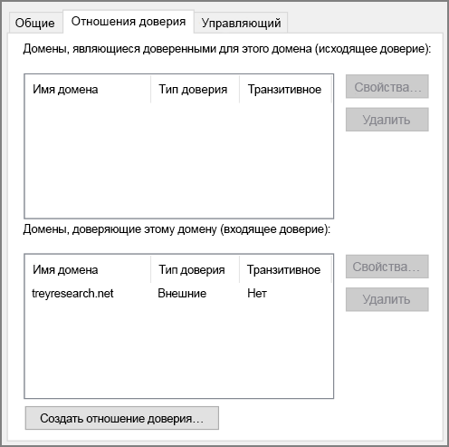

# <a name="create-an-active-directory-domain-services-ad-ds-resource-forest-in-azure"></a>Создание леса ресурсов доменных служб Active Directory (AD DS) в Azure

На схеме эталонной архитектуры представлены данные о создании отдельного домена Active Directory в Azure, который является доверенным для доменов в локальном лесу AD. [**Разверните это решение**](#deploy-the-solution).


*Скачайте [файл Visio][visio-download] этой архитектуры.*

Доменные службы Active Directory (AD DS) хранят сведения об удостоверении в виде иерархической структуры. Верхний узел в иерархической структуре называется лесом. Лес содержит домены, которые, в свою очередь, содержат объекты других типов. Эталонная архитектура создает лес AD DS в Azure с односторонним исходящим отношением доверия с локальным доменом. Лес в Azure содержит домен, отсутствующий в локальной среде. Благодаря отношению доверия операции входа в локальные домены могут быть доверенными и получать доступ к ресурсам в отдельном домене Azure.

Типичные способы применения этой архитектуры включают поддержку разделения по безопасности для облачных объектов и удостоверений, а также перенос отдельных доменов из локальной среды в облако.

Дополнительные рекомендации см. в статье [Выбор решения для интеграции локальной среды Active Directory с Azure][considerations]. 

## <a name="architecture"></a>Архитектура

Архитектура состоит из следующих компонентов.

- **Локальная сеть**. Локальная сеть содержит собственные лес и домены Active Directory.
- **Серверы Active Directory**. Они являются контроллерами домена, которые реализуют службы домена, работающие в облаке в качестве виртуальных машин. На этих серверах размещается лес с одним или несколькими доменами, отдельными от локальных.
- **Одностороннее отношение доверия**. В примере на этой диаграмме показано одностороннее отношение доверия между доменом в Azure и локальным доменом. Это отношение позволяет локальным пользователям получать доступ к ресурсам в домене в Azure, но не наоборот. Если пользователям облака также требуется доступ к локальным ресурсам, можно создать двустороннее отношение доверия.
- **Подсеть Active Directory**. Серверы доменных служб Active Directory находятся в отдельной подсети. Правила группы безопасности сети (NSG) защищают серверы доменных служб Active Directory и предоставляют брандмауэр для трафика из неизвестных источников.
- **Шлюз Azure**. Шлюз Azure обеспечивает соединение между локальной и виртуальной сетями Azure. Это может быть [VPN-подключение][azure-vpn-gateway] или [Azure ExpressRoute][azure-expressroute]. Дополнительные сведения см. в статье [DMZ between Azure and your on-premises datacenter] (Сеть периметра между Azure и локальным центром обработки данных) [implementing-a-secure-hybrid-network-architecture].

## <a name="recommendations"></a>Рекомендации

Конкретные рекомендации по реализации Active Directory в Azure см. в следующих статьях:

- [Расширение доменных служб Active Directory в Azure][adds-extend-domain].
- [Руководства по развертыванию Windows Server Active Directory на виртуальных машинах Azure][ad-azure-guidelines].

### <a name="trust"></a>Доверие

Локальные домены находятся в другом лесу, отличном от леса с доменами в облаке. Чтобы включить аутентификацию локальных пользователей в облаке, домены в Azure должны доверять домену входа в систему в локальном лесу. Аналогично, если облако предоставляет домен входа в систему для внешних пользователей, возможно, понадобится настроить отношение доверия между локальным лесом и облачным доменом.

Вы можете установить доверие на уровне леса, [создав отношения доверия лесов][creating-forest-trusts], или на уровне домена, [создав отношения внешнего доверия][creating-external-trusts]. Уровень доверия леса создает связь между всеми доменами в двух лесах. Доверительные отношения на уровне внешнего домена создают связь только между двумя указанными доменами. Вам необходимо только создать доверительные отношения на уровне внешнего домена между доменами в разных лесах.

Отношения доверия могут быть однонаправленными (односторонними) или двунаправленными (двусторонними):

- Одностороннее отношение доверия позволяет пользователям из одного домена или леса (известного как *входящий* домен или лес) получать доступ к ресурсам, которые содержатся в другом (*исходящем* домене или лесу).
- Двустороннее отношение доверия позволяет пользователям в домене или лесу получать доступ к ресурсам, которые содержатся в другом домене или лесу.

В следующей таблице перечислены конфигурации доверия для некоторых простых сценариев:

| Сценарий | Локальное отношение доверия | Отношение доверия облака |
| --- | --- | --- |
| Локальным пользователям требуется доступ к ресурсам в облаке, но не наоборот |Односторонний, входящий трафик |Односторонний, исходящий трафик |
| Пользователям в облаке требуется доступ к локальным ресурсам, но не наоборот |Односторонний, исходящий трафик |Односторонний, входящий трафик |
| Пользователям в облаке и локальной среде требуется доступ к ресурсам, хранящимся в облаке и в локальной среде |Двусторонний, входящий и исходящий трафик |Двусторонний, входящий и исходящий трафик |

## <a name="scalability-considerations"></a>Вопросы масштабируемости

Active Directory автоматически масштабируется для контроллеров, которые являются частью одного домена. Запросы распространяются на все контроллеры в домене. Вы можете добавить еще один контроллер домена, и он автоматически синхронизируется с доменом. Не настраивайте отдельную подсистему балансировки нагрузки для направления трафика в контроллерах в домене. Убедитесь, что все контроллеры домена имеют достаточно ресурсов памяти и хранилища для обработки базы данных домена. Сделайте все виртуальные машины контроллера домена одного размера.

## <a name="availability-considerations"></a>Вопросы доступности

Подготовьте по крайней мере два контроллера домена для каждого домена. Это позволяет выполнять репликацию между серверами автоматически. Создайте группу доступности для виртуальных машин, действующих в качестве серверов Active Directory, обрабатывающих каждый домен. Поместите по крайней мере два сервера в эту группу доступности.

Кроме того, рассмотрите вопрос о назначении одного или нескольких серверов в каждом домене в качестве [владельцев резервных операций][standby-operations-masters] в случае сбоя подключения к серверу, который выступает в качестве владельца роли FSMO.

## <a name="manageability-considerations"></a>Вопросы управляемости

Дополнительные сведения и рекомендации по управлению и мониторингу см. в статье [Расширение доменных служб Active Directory в Azure][adds-extend-domain].

Дополнительные сведения см. в документе [Monitoring Active Directory][monitoring_ad] (Мониторинг Active Directory). Вы можете установить инструменты (например, [Microsoft Systems Center][microsoft_systems_center]) на сервере мониторинга в подсети управления для выполнения этих задач.

## <a name="security-considerations"></a>Вопросы безопасности

Отношения доверия на уровне леса являются транзитивными. Если установить отношение доверия на уровне леса между локальным и облачным лесами, оно распространяется на другие новые домены в любом лесу. Если вы используете домены для обеспечения разделения в целях безопасности, рекомендуется создать доверительные отношения только на уровне домена. Отношения доверия на уровне домена являются нетранзитивными.

Рекомендации по безопасности, связанные с Active Directory, см. в разделе "Вопросы безопасности" в статье [Расширение доменных служб Active Directory в Azure][adds-extend-domain].

## <a name="deploy-the-solution"></a>Развертывание решения

Пример развертывания для этой архитектуры можно найти на портале [GitHub][github]. Обратите внимание, что для полного развертывания может потребоваться до двух часов, включая создание VPN-шлюза и запуск скриптов, которые настраивают доменные службы Active Directory.

### <a name="prerequisites"></a>Предварительные требования

[!INCLUDE [ref-arch-prerequisites.md](../../../includes/ref-arch-prerequisites.md)]

### <a name="deploy-the-simulated-on-premises-datacenter"></a>Развертывание имитации локального центра обработки данных

1. Перейдите в папку `identity/adds-forest` в репозитории GitHub.

2. Откройте файл `onprem.json` . Найдите экземпляры `adminPassword` и `Password` и добавьте значения для паролей.

3. Выполните следующую команду и дождитесь завершения развертывания:

    ```bash
    azbb -s <subscription_id> -g <resource group> -l <location> -p onprem.json --deploy
    ```

### <a name="deploy-the-azure-vnet"></a>Развертывание виртуальной сети Azure

1. Откройте файл `azure.json` . Найдите экземпляры `adminPassword` и `Password` и добавьте значения для паролей.

2. В том же файле найдите экземпляры `sharedKey` и введите общие ключи для VPN-подключения.

    ```json
    "sharedKey": "",
    ```

3. Выполните следующую команду и дождитесь завершения развертывания.

    ```bash
    azbb -s <subscription_id> -g <resource group> -l <location> -p onoprem.json --deploy
    ```

   Разверните ту же группу ресурсов, что и локальная виртуальная сеть.

### <a name="test-the-ad-trust-relation"></a>Проверка отношения доверия AD

1. На портале Azure перейдите к созданной группе ресурсов.

2. Используйте портал Azure для поиска виртуальной машины с именем `ra-adt-mgmt-vm1`.

3. Нажмите `Connect`, чтобы открыть сеанс удаленного рабочего стола для виртуальной машины. Имя пользователя — `contoso\testuser`, а пароль — тот, который указан в файле параметров `onprem.json`.

4. Вовремя сеанса удаленного рабочего стола откройте еще один такой сеанс к виртуальной машине `ra-adtrust-onpremise-ad-vm1` с IP-адресом 192.168.0.4. Имя пользователя — `contoso\testuser`, а пароль — тот, который указан в файле параметров `azure.json`.

5. Во время сеанса подключения к удаленному рабочему столу для `ra-adtrust-onpremise-ad-vm1` перейдите к **диспетчеру сервера** и выберите **Средства** > **Active Directory —домены и доверие**.

6. На панели слева щелкните правой кнопкой мыши contoso.com и выберите **Свойства**.

7. Щелкните вкладку **Доверие**. В списке должно появиться входящее отношение доверия treyresearch.net.



## <a name="next-steps"></a>Дополнительная информация

- Изучите рекомендации по [расширению локальных доменов доменных служб Active Directory в Azure][adds-extend-domain]
- Изучите рекомендации по [созданию инфраструктуры служб федерации Active Directory (AD FS)][adfs] в Azure.

<!-- links -->
[adds-extend-domain]: adds-extend-domain.md
[adfs]: adfs.md
[azure-cli-2]: /azure/install-azure-cli
[azbb]: https://github.com/mspnp/template-building-blocks/wiki/Install-Azure-Building-Blocks

[implementing-a-secure-hybrid-network-architecture]: ../dmz/secure-vnet-hybrid.md
[implementing-a-secure-hybrid-network-architecture-with-internet-access]: ../dmz/secure-vnet-dmz.md

[running-VMs-for-an-N-tier-architecture-on-Azure]: ../virtual-machines-windows/n-tier.md

[ad-azure-guidelines]: https://msdn.microsoft.com/library/azure/jj156090.aspx
[azure-expressroute]: https://azure.microsoft.com/documentation/articles/expressroute-introduction/
[azure-vpn-gateway]: https://azure.microsoft.com/documentation/articles/vpn-gateway-about-vpngateways/
[considerations]: ./considerations.md
[creating-external-trusts]: https://technet.microsoft.com/library/cc816837(v=ws.10).aspx
[creating-forest-trusts]: https://technet.microsoft.com/library/cc816810(v=ws.10).aspx
[github]: https://github.com/mspnp/identity-reference-architectures/tree/master/adds-forest
[incoming-trust]: https://raw.githubusercontent.com/mspnp/identity-reference-architectures/master/adds-forest/extensions/incoming-trust.ps1
[microsoft_systems_center]: https://microsoft.com/cloud-platform/system-center
[monitoring_ad]: https://msdn.microsoft.com/library/bb727046.aspx
[resource-manager-overview]: /azure/azure-resource-manager/resource-group-overview
[solution-script]: https://raw.githubusercontent.com/mspnp/identity-reference-architectures/master/adds-forest/Deploy-ReferenceArchitecture.ps1
[standby-operations-masters]: https://technet.microsoft.com/library/cc794737(v=ws.10).aspx
[outgoing-trust]: https://raw.githubusercontent.com/mspnp/identity-reference-architectures/master/adds-forest/extensions/outgoing-trust.ps1
[verify-a-trust]: https://technet.microsoft.com/library/cc753821.aspx
[visio-download]: https://archcenter.blob.core.windows.net/cdn/identity-architectures.vsdx
