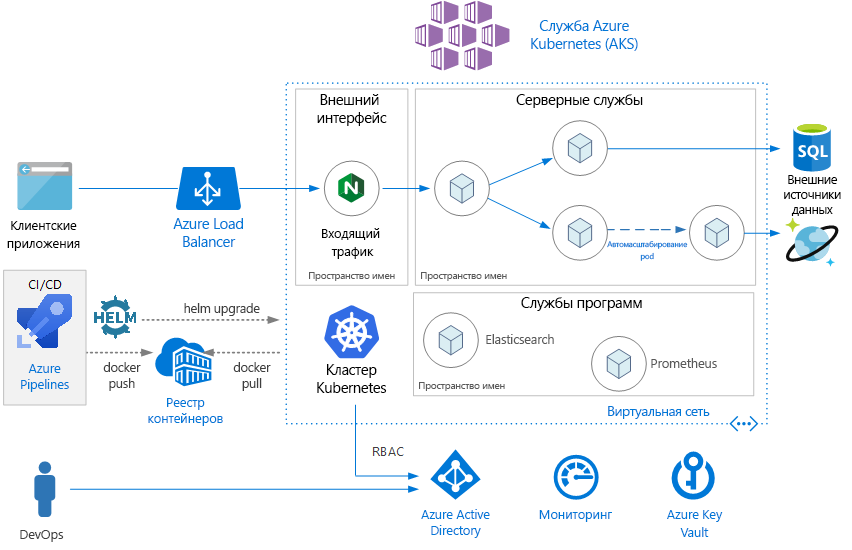
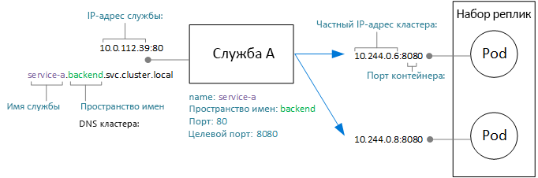
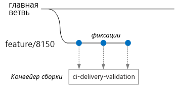
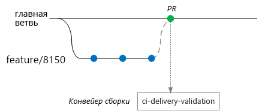
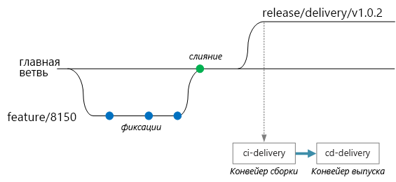

# <a name="microservices-architecture-on-azure-kubernetes-service-aks"></a>Архитектура микрослужб в Службе Azure Kubernetes (AKS)

В этой эталонной архитектуре показано приложение микрослужб, развернутое в Службе Azure Kubernetes (AKS). Она демонстрирует основную конфигурацию AKS, которая может быть отправной точкой для большинства развертываний. Дополнительные расширенные параметры, включая расширенные сетевые параметры, будут рассмотрены в отдельной эталонной архитектуре.

В этой статье предполагается, что вы владеете базовыми знаниями о Kubernetes. Статья посвящена главным образом инфраструктуре и вопросам DevOps по запуску архитектуры микрослужб в AKS. Инструкции по проектированию микрослужб с использованием предметно-ориентированного проектирования см. в статье [Проектирование, создание и использование микрослужб в Azure](/azure/architecture/microservices).

> [!NOTE]
> Мы работаем над эталонной реализацией, чтобы дополнить эту статью. Мы планируем опубликовать эту реализацию в начале 2019 года. В эту статью будут добавлены дополнительные рекомендации из этой эталонной реализации.



## <a name="architecture"></a>Архитектура

Архитектура состоит из следующих компонентов:

**Служба Azure Kubernetes** (AKS). AKS — это служба Azure, которая развертывает управляемый кластер Kubernetes. 

**Кластер Kubernetes**. AKS отвечает за развертывание кластера Kubernetes и за управление главными узлами Kubernetes. Вы только управляете узлами агентов.

**Виртуальная сеть**. По умолчанию AKS создает виртуальную сеть для развертывания узлов агентов. Для более сложных сценариев можно сначала создать виртуальную сеть, которая позволяет управлять такими настройками, как конфигурация подсетей, локальное подключение и IP-адресация. Дополнительные сведения см. в статье [Настройка расширенных параметров сети в Службе Azure Kubernetes (AKS)](/azure/aks/configure-advanced-networking).

**Входящий трафик**. Входящий трафик обеспечивает доступ маршрутов HTTP(S) к службам внутри кластера. Дополнительные сведения см. в разделе [Шлюз API](#api-gateway), приведенном ниже.

**Внешние хранилища данных**. Состояние микрослужб, как правило, не отслеживается и записывается во внешние хранилища данных, такие как База данных SQL Azure или Cosmos DB.

**Azure Active Directory**. АКS использует удостоверение Azure Active Directory (Azure AD) для создания других ресурсов Azure, таких как подсистемы балансировки нагрузки Azure, и управления ими. Azure AD также рекомендуется применять для проверки подлинности пользователей в клиентских приложениях.

**Реестр контейнеров Azure**. В Реестре контейнеров можно хранить закрытые образы Docker, которые развертываются в кластере. АКS может выполнять аутентификацию в Реестре контейнеров с помощью удостоверения Azure AD. Обратите внимание, что для АКS не требуется Реестр контейнеров Azure. Можно использовать другие реестры контейнеров, такие как Центр Docker.

**Azure Pipelines**. Конвейеры являются частью Azure DevOps Services и выполняют автоматизированные сборки, тесты и развертывания. Вы также можете использовать сторонние решения для CI/CD, такие как Jenkins. 

**Helm**. Helm &mdash; это диспетчер пакетов для Kubernetes, который предоставляет способ упаковки объектов Kubernetes в единый элемент, который можно публиковать, развертывать, обновлять и изменять.

**Azure Monitor**. Azure Monitor собирает и хранит метрики и журналы, включая метрики платформы, для служб Azure в решении и телеметрии приложений. С помощью этих данных можно отслеживать приложения, настраивать оповещения и панели мониторинга, а также анализировать первопричины сбоев. Azure Monitor интегрируется с AKS для сбора метрик контроллеров, узлов и контейнеров, а также журналов контейнеров и журналов главных узлов.

## <a name="design-considerations"></a>Рекомендации по проектированию

Эта эталонная архитектура ориентирована на архитектуры микрослужб, хотя многие из рекомендуемых методов будут применяться к другим рабочим нагрузкам, выполняемым в AKS.

### <a name="microservices"></a>Микрослужбы

Объект Службы Kubernetes предоставляет естественный способ моделирования микрослужб в Kubernetes. Микрослужба — это слабо связанная, независимо развертываемая единица кода. Микрослужбы обычно взаимодействуют через четко определенные интерфейсы API и могут быть обнаружены с помощью некоторых форм обнаружения служб. Объект Службы Kubernetes предоставляет набор возможностей, соответствующих следующим требованиям.

- IP-адрес. Объект Службы предоставляет статический внутренний IP-адрес для всех групп модулей pod (набор реплик). Когда модули pod создаются или перемещаются, служба всегда доступна по этому внутреннему IP-адресу.

- Балансировка нагрузки. Трафик, отправляемый на IP-адрес службы, равномерно распределяется между модулями pod. 

- Обнаружение служб. Служба DNS Kubernetes назначает службам внутренние записи DNS. Это означает, что шлюз API может вызывать внутреннюю службу по DNS-имени. Один и тот же механизм может использоваться для связи между службами. Записи DNS упорядочены по пространству имен, поэтому если пространства имен соответствуют ограниченным контекстам, то DNS-имя службы будет естественным образом сопоставлено с доменом приложения.

На следующей схеме показаны концептуальные связи между службами и модулями. Фактическое сопоставление с IP-адресами и портами конечных точек осуществляется с помощью kube-proxy, сетевого прокси-сервера Kubernetes.



### <a name="api-gateway"></a>API Gateway

*Шлюз API* — это шлюз, который находится между внешними клиентами и микрослужбами. Он выполняет роль обратного прокси-сервера, который перенаправляет запросы от клиентов к микрослужбам. Он также может выполнять такие специализированные задачи, как аутентификация, завершение SSL-запросов и ограничение частоты. 

Функциональные возможности, предоставляемые шлюзом, можно группировать следующим образом:

- [Маршрутизация шлюза.](../../patterns/gateway-routing.md) Маршрутизация клиентских запросов к правильным серверным службам. Шлюз предоставляет одну конечную точку для клиентов и позволяет разделить клиенты и службы.

- [Агрегация шлюза.](../../patterns/gateway-aggregation.md) Объединение нескольких запросов в один, чтобы сократить число вызовов между клиентом и серверной частью.

- [Разгрузка шлюза.](../../patterns/gateway-offloading.md) Шлюз может разгрузить функциональность серверных служб, например завершение подключений SSL, проверка подлинности, помещение IP-адресов в белый список или ограничение частоты клиента (регулирование количества запросов).

Шлюзы API представляют собой [общий конструктивный шаблон микрослужб](https://microservices.io/patterns/apigateway.html). Они могут быть реализованы с использованием ряда различных технологий. Вероятно, наиболее распространенной реализацией является развертывание пограничного маршрутизатора или обратного прокси-сервера, например Nginx, HAProxy или Traefik, внутри кластера. 

Другие доступные варианты:

- Шлюз приложений Azure или служба управления API Azure, которые являются управляемыми службами, расположенными за пределами кластера. Контроллер входящего трафика Шлюза приложений в настоящее время предоставляется в бета-версии.

- Прокси-серверы Функций Azure. Прокси-серверы могут изменять запросы и ответы, а также направлять запросы на основе URL-адреса.

Тип ресурса Kubernetes **Входящий трафик** абстрагирует параметры конфигурации для прокси-сервера. Он работает совместно с контроллером входящего трафика, который обеспечивает базовую реализацию этого трафика. Среди прочего предоставляются контроллеры входящего трафика для Nginx, HAProxy, Traefik и Шлюза приложений (предварительная версия).

Контроллер входящего трафика обрабатывает настройку прокси-сервера. Часто это требует сложных файлов конфигурации, которые трудно настроить, если вы не эксперт, так что входной контроллер является хорошей абстракцией. Кроме того, контроллер входящего трафика имеет доступ к API Kubernetes, поэтому он может принимать интеллектуальные решения о маршрутизации и балансировке нагрузки. Например, контроллер входящего трафика Nginx обходит прокси-сервер сети kube-proxy.

С другой стороны, если вам нужен полный контроль над параметрами, вы можете обойти эту абстракцию и настроить прокси-сервер вручную. 

Обратный прокси-сервер является потенциально проблемным местом или единой точкой сбоя, поэтому всегда следует развертывать как минимум две реплики для обеспечения высокого уровня доступности.

### <a name="data-storage"></a>Хранилище данных

В архитектуре микрослужб службы не должны совместно использовать хранилище данных. Каждая служба должна владеть собственными личными данными в отдельном логическом хранилище, чтобы избежать скрытых зависимостей между службами. Это позволяет устранить непреднамеренную взаимозависимость между службами, которая может возникнуть, когда службы совместно используют одни и те же базовые схемы данных. Кроме того, когда службы управляют собственными хранилищами данных, они могут использовать правильное хранилище данных для своих конкретных требований. Дополнительные сведения см. в статье [Проектирование микрослужб: рекомендации по работе с данными](/azure/architecture/microservices/data-considerations).

Избегайте хранения постоянных данных в локальном хранилище кластера, так как это связывает данные с узлом. Вот как следует поступить вместо этого: 

- Используйте внешнюю службу, такую как База данных SQL Azure или Cosmos DB, *или*

- подключите постоянный том с применением Дисков или Файлов Azure. Используйте Файлы Azure, если один и тот же том должен быть общим для нескольких модулей.

### <a name="namespaces"></a>Пространства имен

Пространства имен используются для организации служб в кластере. Каждый объект в кластере Kubernetes принадлежит пространству имен. Когда создается новый объект, он по умолчанию назначается пространству имен `default`. Тем не менее рекомендуется создавать пространства имен, которые являются более описательными. Это позволяет упорядочить ресурсы в кластере.

Во-первых, пространства имен помогают предотвратить конфликты имен. Когда несколько команд развертывают микрослужбы в одном кластере, содержащем сотни микрослужб, ими становится трудно управлять, если все они принадлежат одному пространству имен. Кроме того, пространства имен позволяют:

- Применять ограничения ресурсов к пространству имен, чтобы общий набор модулей, назначенных этому пространству имен, не превышал квоту ресурсов пространства.

- Примените политики на уровне пространства имен, включая RBAC и политики безопасности.

Для архитектуры микрослужб организуйте микрослужбы в ограниченных контекстах и создайте пространства имен для каждого контекста. Например, все микрослужбы, связанные с ограниченным контекстом "выполнение заказа", можно поместить в одно и то же пространство имен. Кроме того, можно создать пространство имен для каждой группы разработчиков.

Поместите службы программ в отдельное пространство имен. Например, вы можете развернуть Elasticsearch или Prometheus для мониторинга кластера или Tiller для Helm.

## <a name="scalability-considerations"></a>Вопросы масштабируемости

Kubernetes поддерживает горизонтальное масштабирование на двух уровнях:

- Масштабирование количества модулей, выделенных для развертывания.
- Масштабирование узлов в кластере для увеличения общего объема вычислительных ресурсов, доступных в кластере.

Хотя можно масштабировать модули и узлы вручную, рекомендуется использовать автомасштабирование, чтобы свести к минимуму вероятность того, что службы будут испытывать нехватку ресурсов при высокой нагрузке. Стратегия автомасштабирования должна учитывать как модули, так и узлы. Если вы просто масштабируете модули, в конечном итоге вы достигнете предела ресурсов на узлах. 

### <a name="pod-autoscaling"></a>Автомасштабирование модулей

Средство горизонтального автомасштабирования pod (HPA) масштабирует модули на основе наблюдаемых метрик ЦП, памяти или пользовательских метрик. Чтобы настроить горизонтальное масштабирование модулей, необходимо указать целевую метрику (например, 70 % потребления ЦП), а также минимальное и максимальное число реплик. Для получения этих чисел необходимо выполнить нагрузочное тестирование служб.

Побочным эффектом автомасштабирования является то, что модули могут создаваться или исключаться чаще, так как происходят события увеличения и уменьшения масштаба. Чтобы уменьшить это влияние:

- Используйте пробы готовности, чтобы сообщить Kubernetes, когда новый модуль будет готов принять трафик.
- Используйте бюджеты неработоспособности, чтобы ограничить количество модулей, которые могут быть исключены из службы за раз.

### <a name="cluster-autoscaling"></a>Автоматическое масштабирование кластера

Средство автомасштабирования кластера масштабирует количество узлов. Если модули не могут быть запланированы из-за ограничений ресурсов, это средство будет подготавливать больше узлов.  (Примечание. Интеграция между AKS и средством автомасштабирования кластера в настоящее время предоставляется в предварительной версии.)

В то время как HPA отслеживает фактически потребляемые ресурсы или другие метрики из запущенных модулей, средство автомасштабирования кластера подготавливает узлы для модулей, которые еще не запланированы. Поэтому оно рассматривает запрошенные ресурсы, как указано в спецификации развертывания модулей pod Kubernetes. Используйте нагрузочное тестирование для точной настройки этих значений.

После создания кластера нельзя изменить размер виртуальной машины, поэтому необходимо выполнить начальное планирование емкости, чтобы выбрать подходящий размер виртуальной машины для узлов агентов во время создания кластера. 

## <a name="availability-considerations"></a>Вопросы доступности

### <a name="health-probes"></a>Пробы работоспособности.

Kubernetes определяет два типа проб работоспособности, доступных для модуля:

- Проба готовности: сообщает Kubernetes, готов ли модуль к приему запросов.

- Проба активности: сообщает Kubernetes, следует ли удалить модуль и запустить новый экземпляр.

При рассмотрении проб нужно помнить о принципах работы службы в Kubernetes. Служба имеет селектор метки, который соответствует набору модулей (ноль или больше). Kubernetes распределяет нагрузку трафика между модулями, которые совпадают с селектором. Только модули, которые запущены успешно и являются работоспособными, получают трафик. Если контейнер аварийно завершает работу, Kubernetes завершает работу модуля и планирует замену.

Иногда модуль может быть не готов к получению трафика, даже если он был запущен успешно. Например, могут быть задачи инициализации, когда приложение, работающее в контейнере, загружает данные в память или считывает данные конфигурации. Чтобы указать, что модуль исправен, но не готов к получению трафика, определите пробу готовности. 

Пробы активности обрабатывают случай, когда модуль все еще работает, но не работоспособен и должен быть перезапущен. Например, предположим, что контейнер обслуживает HTTP-запросы, но по какой-то причине зависает. Контейнер не завершит работу аварийно, но он перестанет обрабатывать любые запросы. Если вы определите пробу активности HTTP, проба перестанет отвечать на запросы, что укажет Kubernetes на необходимость перезагрузки модуля.

Вот некоторые соображения при проектировании проб:

- Если код имеет длительное время запуска, существует опасность, что проба активности сообщит об ошибке до завершения запуска. Чтобы избежать этого, используйте параметр initialDelaySeconds, который задерживает запуск пробы.

- Проба активности не помогает, если только перезапуск модуля не восстановит его работоспособное состояние. Пробу активности можно использовать для предотвращения утечек памяти или неожиданных взаимоблокировок, но нет смысла перезапускать модуль, который немедленно завершится сбоем.

- Иногда пробы готовности используются для проверки зависимых служб. Например, если модуль имеет зависимость от базы данных, проба активности может проверить подключение к базе данных. Однако такой подход может вызывать неожиданные проблемы. Внешняя служба может быть временно недоступна по какой-либо причине. В результате проба готовности завершится сбоем для всех модулей в службе, что приведет к их удалению из подсистемы балансировки нагрузки и, таким образом, к созданию каскадных сбоев вышестоящих ресурсов. Лучшим подходом является реализация обработки повторных попыток в службе, чтобы служба могла корректно восстанавливаться после временных сбоев.

### <a name="resource-constraints"></a>Ограничения ресурсов

Состязание ресурсов может повлиять на доступность службы. Определите ограничения ресурсов для контейнеров, чтобы один контейнер не мог перегружать ресурсы кластера (память и ЦП). Для ресурсов, не являющихся контейнерами, таких как потоки или сетевые подключения, рассмотрите возможность использования [шаблона отсеков](/azure/architecture/patterns/bulkhead), чтобы изолировать ресурсы.

Используйте квоты ресурсов, чтобы ограничить общий объем ресурсов, разрешенных для пространства имен. Таким образом, внешний интерфейс не может ограничивать ресурсы для серверных служб или наоборот.

## <a name="security-considerations"></a>Вопросы безопасности

### <a name="role-based-access-control-rbac"></a>управление доступом на основе ролей (RBAC).

Kubernetes и Azure имеют механизмы управления доступом на основе ролей (RBAC).

- Azure RBAC контролирует доступ к ресурсам в Azure, включая возможность создания новых ресурсов. Разрешения могут назначаться пользователям, группам или субъектам-службам. (Субъект-служба является удостоверением безопасности, используемым приложениями.)

- Kubernetes RBAC контролирует разрешения для API Kubernetes. Например, создание и перечисление модулей — это действия, которые могут быть авторизованы (или запрещены) для пользователя с помощью RBAC. Чтобы назначить пользователям разрешения Kubernetes, создайте *роли* и *привязки ролей*:

  - Роль — это набор разрешений, применяемых в пространстве имен. Разрешения определяются как команды (получение, обновление, создание, удаление), относящиеся к ресурсам (модули, развертывания и т. д.).

  - RoleBinding назначает пользователям или группам роль.

  - Существует также объект ClusterRole, который похож на роль, но применяется ко всему кластеру во всех пространствах имен. Чтобы назначить ClusterRole пользователям или группам, создайте ClusterRoleBinding.

AKS интегрирует оба этих механизма RBAC. При создании кластера AKS можно настроить его на проверку подлинности пользователя с помощью Azure AD. Дополнительные сведения о том, как выполнить такую настройку, см. в статье [Интеграция Azure Active Directory со Службой Azure Kubernetes](/azure/aks/aad-integration).

Когда это будет настроено, пользователь, который хочет получить доступ к API Kubernetes (например, через kubectl), должен войти, используя учетные данные Azure AD.

По умолчанию пользователь Azure AD не имеет доступа к кластеру. Чтобы предоставить доступ, администратор кластера создает RoleBindings, которые ссылаются на пользователей или группы Azure AD. Если у пользователя нет разрешений для конкретной операции, она завершится сбоем.

Если у пользователей нет доступа по умолчанию, как администратор кластера получает разрешение на создание привязки ролей? На самом деле кластер AKS имеет два типа учетных данных для вызова сервера API Kubernetes: пользователь кластера и администратор кластера. Учетные данные администратора кластера предоставляют полный доступ к кластеру. Команда Azure CLI `az aks get-credentials --admin` загружает учетные данные администратора кластера и сохраняет их в файле kubeconfig. Администратор кластера может использовать этот файл для создания ролей и привязок ролей.

Так как учетные данные администратора кластера имеют такие разрешения, используйте Azure RBAC для ограничения доступа к ним:

- "Роль администратора кластера службы Azure Kubernetes" имеет разрешение на скачивание учетных данных администратора кластера. Эта роль должна быть назначена только администраторам кластера.

- "Роль пользователя кластера службы Azure Kubernetes" имеет разрешение на скачивание учетных данных пользователя кластера. Пользователям, не являющимся администраторами, может быть назначена эта роль. Эта роль не дает никаких особых разрешений на использование ресурсов Kubernetes в кластере &mdash; она просто позволяет пользователю подключаться к серверу API. 

При определении политик RBAC (как Kubernetes, так и Azure) следует учитывать роли в организации:

- Кто может создавать или удалять кластер AKS и загружать учетные данные администратора?
- Кто может администрировать кластер?
- Кто может создавать или обновлять ресурсы в пространстве имен?

Рекомендуется назначать разрешения Kubernetes RBAC по пространству имен, используя роли и RoleBindings, а не ClusterRoles и ClusterRoleBindings.

Наконец, возникает вопрос о том, какие разрешения необходимы кластеру AKS для создания и администрирования ресурсов Azure, таких как подсистемы балансировки нагрузки, сеть или хранилище. Для проверки подлинности в интерфейсах API Azure в кластере используется субъект-служба Azure AD. Если субъект-служба не указан при создании кластера, он создается автоматически. Однако рекомендуется сначала создать субъект-службу и назначить ему минимальные разрешения RBAC. Дополнительные сведения см. в статье [Субъекты-службы со службой Azure Kubernetes](/azure/aks/kubernetes-service-principal).

### <a name="secrets-management-and-application-credentials"></a>Управление секретами и учетные данные приложения

Приложениям и службам часто требуются учетные данные, позволяющие им подключаться к внешним службам, таким как служба хранилища Azure или База данных SQL. Задача состоит в том, чтобы сохранить эти учетные данные безопасными и предотвратить их утечку. 

Для ресурсов Azure следует использовать управляемые удостоверения. Идея управляемого удостоверения заключается в том, что приложение или служба имеет удостоверение, хранящееся в Azure AD, и использует его для проверки подлинности в службе Azure. Приложение или служба имеет субъект-службу, созданный для него в Azure AD, и выполняет проверку подлинности с помощью токенов OAuth 2.0. Выполняющийся процесс вызывает адрес localhost для получения токена. Таким образом, вам не нужно хранить пароли или строки подключения. Управляемые удостоверения можно использовать в AKS путем присвоения их отдельным модулям с помощью проекта [aad-pod-identity](https://github.com/Azure/aad-pod-identity).

В настоящее время не все службы Azure поддерживают проверку подлинности с помощью управляемых удостоверений. Список см. в статье [Службы с поддержкой управляемых удостоверений для ресурсов Azure](/azure/active-directory/managed-identities-azure-resources/services-support-msi).

Даже при использовании управляемых удостоверений, вероятно, потребуется хранить некоторые учетные данные или другие секреты приложений для служб Azure, которые не поддерживают управляемые удостоверения, сторонние службы, ключи API и т. д. Ниже приведены несколько вариантов безопасного хранения секретов:

- Azure Key Vault. В AKS можно подключить один или несколько секретов из Key Vault в качестве тома. Том считывает секреты из хранилища ключей. Модуль может считывать секреты так же, как обычный том. Дополнительные сведения см. в проекте [Kubernetes-KeyVault-FlexVolume](https://github.com/Azure/kubernetes-keyvault-flexvol) на GitHub.

    Модуль проходит проверку подлинности с помощью удостоверения модуля (описанного выше) или с помощью субъекта-службы Azure AD вместе с секретом клиента. Рекомендуется использовать удостоверения модулей, потому что в этом случае секрет клиента не требуется. 

- Хранилище HashiCorp. Приложения Kubernetes могут проходить аутентификацию в хранилище HashiCorp с помощью управляемых удостоверений Azure AD. Дополнительные сведения см. в статье [HashiCorp Vault speaks Azure Active Directory](https://open.microsoft.com/2018/04/10/scaling-tips-hashicorp-vault-azure-active-directory/) (Использование хранилища HashiCorp в Azure Active Directory). Можно развернуть хранилище в Kubernetes, но рекомендуется запускать его в отдельном выделенном кластере из кластера приложений. 

- Секреты Kubernetes. Можно также просто использовать секреты Kubernetes. Этот вариант настроить проще всего, но он имеет некоторые проблемы. Секреты хранятся в хранилище etcd, которое является распределенным хранилищем "ключ — значение". AKS [шифрует неактивные данные etcd](https://github.com/Azure/kubernetes-kms#azure-kubernetes-service-aks). Ключами шифрования управляет корпорация Майкрософт.

Использование таких хранилищ, как HashiCorp или Azure Key Vault, предоставляет ряд преимуществ:

- централизованное управление секретами;
- все секреты шифруются в неактивном состоянии;
- централизованное управление ключами;
- управление доступом к секретам;
- Аудит

### <a name="pod-and-container-security"></a>Безопасность контейнеров и модулей

Ниже приведены некоторые рекомендации по обеспечению безопасности ваших модулей и контейнеров (этот список не является исчерпывающим). 

Не запускайте контейнеры в привилегированном режиме. Привилегированный режим предоставляет контейнерам доступ ко всем устройствам на узле. Можно задать политику безопасности модулей, чтобы запретить выполнение контейнеров в привилегированном режиме. 

По возможности избегайте запуска процессов с правами привилегированного пользователя внутри контейнеров. Контейнеры не обеспечивают полную изоляцию с точки зрения безопасности, поэтому лучше запускать контейнерный процесс с правами непривилегированного пользователя. 

Храните образы в доверенном частном реестре, например в Реестре контейнеров Azure или в доверенном реестре Docker. Используйте проверяющий веб-перехватчик допуска в Kubernetes, чтобы модули могли извлекать образы только из доверенного реестра.

Сканируйте образы на наличие известных уязвимостей с помощью таких решений, как Twistlock и Aqua, которые доступны в Azure Marketplace.

Автоматизируйте исправления образов с помощью Задач ACR, компонента Реестра контейнеров Azure. Образ контейнера строится из уровней. Базовые уровни включают образ ОС и образы платформы приложений, такие как ASP.NET Core или Node.js. Базовые образы обычно создаются на уровень выше от разработчиков приложений и поддерживаются другими администраторами проектов. Если эти образы исправляются на вышестоящем уровне, важно обновлять, тестировать и повторно развертывать собственные образы, чтобы не осталось известных уязвимостей безопасности. Задачи ACR могут помочь автоматизировать этот процесс.

## <a name="deployment-cicd-considerations"></a>Рекомендации по развертыванию (CI/CD)

Ниже приведены некоторые цели надежного процесса CI/CD для архитектуры микрослужб:

- Каждая команда может создавать и развертывать службы, которыми она владеет независимо, не влияя на другие команды и не нарушая их работу.

- Перед развертыванием новой версии службы в рабочей среде она развертывается в средах разработки, тестирования и контроля качества для проверки. Шлюзы качества применяются на каждом этапе.

- Новая версия службы может развертываться параллельно с предыдущей версией.

- Заданы достаточные политики контроля доступа.

- Образам контейнеров, развернутым в рабочей среде, можно доверять.

### <a name="isolation-of-environments"></a>Изоляция сред

У вас будет несколько сред, в которых вы развертываете службы, включая среды для разработки, тестирования проверки сборки, интеграционного и нагрузочного тестирования и, наконец, рабочую среду. Эти среды нуждаются в некоторой степени изоляции. В Kubernetes у вас есть выбор между физической и логической изоляцией. Физическая изоляция означает развертывание в отдельных кластерах. При логической изоляции используются пространства имен и политики, как описано выше.

Рекомендуется создать выделенный рабочий кластер вместе с отдельным кластером для сред разработки и тестирования. Используйте логическую изоляцию для разделения сред в кластере разработки и тестирования. У служб, развернутых в кластере разработки и тестирования, никогда не должно быть доступа к хранилищам данных, в которых хранятся бизнес-данные. 

### <a name="helm"></a>Helm

С помощью Helm можно управлять созданием и развертыванием служб. Некоторые возможности Helm, которые помогают с CI/CD:

- Упорядочение всех объектов Kubernetes для определенной микрослужбы в одну диаграмму Helm.
- Развертывание диаграммы с помощью одной команды Helm, а не ряда команд kubectl.
- Отслеживание обновлений и исправлений с использованием семантических версий, а также возможность отката к предыдущей версии.
- Использование шаблонов во избежание дублирования данных, таких как метки и селекторы, в нескольких файлах.
- Управление зависимостями между диаграммами.
- Публикация диаграмм в репозитории Helm, например в Реестре контейнеров Azure, и их интеграция с конвейером сборки.

Дополнительные сведения об использовании Реестра контейнеров Helm см. в статье [Использование Реестра контейнеров Azure в качестве репозитория Helm для диаграмм приложения](/azure/container-registry/container-registry-helm-repos).

### <a name="cicd-workflow"></a>Рабочий процесс CI/CD

Прежде чем создавать рабочий процесс CI/CD, необходимо знать, как будет структурирована база кода и как ею управлять.

- Работает команда в отдельном или в едином репозитории?
- Что такое стратегия создания ветви?
- Кто может отправлять код в рабочую среду? Существует ли роль менеджера выпуска?

Подход единого репозитория получил приоритет, но есть определенные преимущества и недостатки.

| &nbsp; | Единый репозиторий | Несколько репозиториев |
|--------|----------|----------------|
| **Преимущества** | Общий доступ к коду<br/>Простой способ стандартизировать код и средства<br/>Простой рефакторинг кода<br/>Обнаруживаемость – единое представление кода<br/> | Очистка владельца в команде<br/>Потенциально меньше конфликтов слияния<br/>Помогает применить разделение микрослужб |
| **Сложности** | Изменение совместного использования кода может повлиять на несколько микрослужб<br/>Большая вероятность конфликтов слияния<br/>Инструментарий необходимо масштабировать в большую базу кода<br/>управление доступом;<br/>Более сложный процесс развертывания | Труднее совместно использовать код<br/>Труднее применять стандарты кодирования<br/>Управление зависимостями<br/>Диффузная база кода, низкая обнаруживаемость<br/>Отсутствие общей инфраструктуры

В этом разделе рассматриваются возможные рабочие процессы CI/CD, исходя из следующих предположений.

- Репозиторий кода – единый репозиторий с упорядоченными папками микрослужб.
- Стратегия создания ветви команды основывается на [разработке на основе магистрали](https://trunkbaseddevelopment.com/).
- Команды используют [Azure Pipelines](/azure/devops/pipelines) для запуска процесса CI/CD.
- В Реестре контейнеров Azure команды используют [пространства имен](/azure/container-registry/container-registry-best-practices#repository-namespaces) для изоляции образов, утвержденных для рабочей среды на основе по-прежнему тестируемых образов.

В этом примере разработчик работает над микрослужбой, которая называется "Служба доставки". (Имя из эталонной реализации, описанной [здесь](../../microservices/index.md#the-drone-delivery-application).) При разработке новых компонентов разработчик проверяет код в ветви компонентов.



Отправка, зафиксированная в этой ветви, активирует сборку CI для микрослужбы. По соглашению компоненты ветвей носят имя `feature/*`. [Файл определения сборки](/azure/devops/pipelines/yaml-schema) включает триггер, который фильтруется по имени ветви и пути источника. Благодаря этому подходу каждая команда может иметь свой собственный конвейер сборки.

```yaml
trigger:
  batch: true
  branches:
    include:
    - master
    - feature/*

    exclude:
    - feature/experimental/*

  paths:
     include:
     - /src/shipping/delivery/
```

На этом этапе в рабочем процессе сборка CI выполняет некоторые минимальные проверки кода.

1. Компиляция кода
1. Выполнение модульных тестов

Здесь идея состоит в том, чтобы сборка занимала немного времени и разработчик смог получить отзывы быстрее. Разработчик открывает PR, когда компонент готов к объединению с главной ветвью. Этим активируется другая сборка CI, которая выполняет некоторые дополнительные проверки.

1. Компиляция кода
1. Выполнение модульных тестов
1. Создание образа контейнера среды выполнения
1. Запуск сканирований уязвимостей в образе



> [!NOTE]
> В Azure Repos можно определить [политики](/azure/devops/repos/git/branch-policies) для защиты ветвей. Например, для слияния в главную ветвь политика может требовать успешную сборку CI, а также утверждение от утверждающего.

На некотором этапе группа готова к развертыванию новой версии службы доставки. Чтобы сделать это, менеджер по выпускам создает ветвь с главной ветви с таким именем шаблона: `release/<microservice name>/<semver>`. Например, `release/delivery/v1.0.2`.
Этим активируется полная сборка CI, которая выполняет все предыдущие действия, а также:

1. Передает образ Docker в Реестр контейнеров Azure. Образ отмечен номером версии, взятым из имени ветви.
2. Запускает `helm package`, чтобы упаковать диаграмму Helm.
3. Передает пакет Helm в реестр контейнеров, запустив `az acr helm push`.

При условии, что эта сборка завершается успешно, она запускает процесс развертывания с помощью [конвейера выпуска](/azure/devops/pipelines/release/what-is-release-management) Azure Pipelines. Конвейер данных выполняет приведенные ниже действия.

1. Запускает `helm upgrade` для развертывания диаграммы Helm в среду контроля качества.
1. Утверждающий утверждает, прежде чем пакет переместится в рабочую среду. Дополнительные сведения см. в статье [Release deployment control using approvals](/azure/devops/pipelines/release/approvals/approvals) (Управление развертыванием выпуска с помощью утверждений).
1. Повторно маркирует образ Docker для пространства имен рабочей среды в Реестре контейнеров Azure. Например, если текущий маркер – `myrepo.azurecr.io/delivery:v1.0.2`, рабочим маркером будет `reponame.azurecr.io/prod/delivery:v1.0.2`.
1. Запускает `helm upgrade` для развертывания диаграммы Helm в рабочую среду.



Важно помнить, что даже в едином репозитории эти задачи могут распространяться на отдельные микрослужбы таким образом, чтобы команды могли с высокой скоростью совершать развертывание. Требуется выполнение некоторых действий вручную: утверждение PR, создание ветви выпуска и утверждение развертывания в рабочем кластере. Эти действия выполняются вручную политикой &mdash; и могут быть полностью автоматизированы в соответствии с предпочтениями организации.
