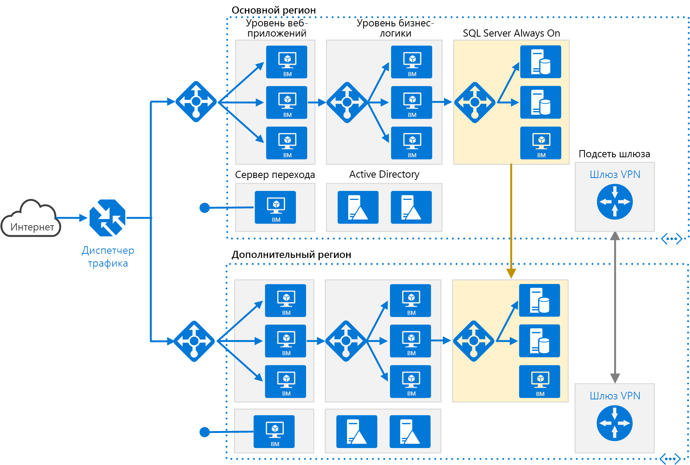

# <a name="run-an-n-tier-application-in-multiple-azure-regions-for-high-availability"></a><span data-ttu-id="f2c42-103">Запуск n-уровневого приложения в нескольких регионах Azure для обеспечения высокой доступности</span><span class="sxs-lookup"><span data-stu-id="f2c42-103">Run an N-tier application in multiple Azure regions for high availability</span></span>

<span data-ttu-id="f2c42-104">Эта эталонная архитектура демонстрирует набор проверенных рекомендаций по работе с n-уровневыми приложениями в нескольких регионах Azure, благодаря которым можно достигнуть высокой доступности и получить надежную архитектуру аварийного восстановления.</span><span class="sxs-lookup"><span data-stu-id="f2c42-104">This reference architecture shows a set of proven practices for running an N-tier application in multiple Azure regions, in order to achieve availability and a robust disaster recovery infrastructure.</span></span>



<span data-ttu-id="f2c42-106">*Скачайте [файл Visio][visio-download] этой архитектуры.*</span><span class="sxs-lookup"><span data-stu-id="f2c42-106">*Download a [Visio file][visio-download] of this architecture.*</span></span>

## <a name="architecture"></a><span data-ttu-id="f2c42-107">Архитектура</span><span class="sxs-lookup"><span data-stu-id="f2c42-107">Architecture</span></span>

<span data-ttu-id="f2c42-108">Эта архитектура создана на основе архитектуры, описанной в статье [N-уровневое приложение с SQL Server](n-tier-sql-server.md).</span><span class="sxs-lookup"><span data-stu-id="f2c42-108">This architecture builds on the one shown in [N-tier application with SQL Server](n-tier-sql-server.md).</span></span>

- <span data-ttu-id="f2c42-109">**Основной и дополнительный регионы.**</span><span class="sxs-lookup"><span data-stu-id="f2c42-109">**Primary and secondary regions**.</span></span> <span data-ttu-id="f2c42-110">Чтобы достичь более высокого уровня доступности, используйте два региона Azure,</span><span class="sxs-lookup"><span data-stu-id="f2c42-110">Use two regions to achieve higher availability.</span></span> <span data-ttu-id="f2c42-111">один из которых является основным,</span><span class="sxs-lookup"><span data-stu-id="f2c42-111">One is the primary region.</span></span> <span data-ttu-id="f2c42-112">а второй предназначен для отработки отказа.</span><span class="sxs-lookup"><span data-stu-id="f2c42-112">The other region is for failover.</span></span>

- <span data-ttu-id="f2c42-113">**Диспетчер трафика Azure.**</span><span class="sxs-lookup"><span data-stu-id="f2c42-113">**Azure Traffic Manager**.</span></span> <span data-ttu-id="f2c42-114">[Диспетчер трафика][traffic-manager] направляет входящие запросы к одному из регионов.</span><span class="sxs-lookup"><span data-stu-id="f2c42-114">[Traffic Manager][traffic-manager] routes incoming requests to one of the regions.</span></span> <span data-ttu-id="f2c42-115">При обычной работе он направляет запросы в основной регион.</span><span class="sxs-lookup"><span data-stu-id="f2c42-115">During normal operations, it routes requests to the primary region.</span></span> <span data-ttu-id="f2c42-116">Если этот регион становится недоступным, диспетчер трафика выполняет отработку отказа в дополнительный регион.</span><span class="sxs-lookup"><span data-stu-id="f2c42-116">If that region becomes unavailable, Traffic Manager fails over to the secondary region.</span></span> <span data-ttu-id="f2c42-117">Дополнительные сведения см. в разделе [Конфигурация диспетчера трафика](#traffic-manager-configuration).</span><span class="sxs-lookup"><span data-stu-id="f2c42-117">For more information, see the section [Traffic Manager configuration](#traffic-manager-configuration).</span></span>

- <span data-ttu-id="f2c42-118">**Группы ресурсов.**</span><span class="sxs-lookup"><span data-stu-id="f2c42-118">**Resource groups**.</span></span> <span data-ttu-id="f2c42-119">Создайте отдельные [группы ресурсов][resource groups] для основного и вторичного регионов, а также для диспетчера трафика.</span><span class="sxs-lookup"><span data-stu-id="f2c42-119">Create separate [resource groups][resource groups] for the primary region, the secondary region, and for Traffic Manager.</span></span> <span data-ttu-id="f2c42-120">Так вы получите возможность управлять каждым регионом как одной коллекцией ресурсов.</span><span class="sxs-lookup"><span data-stu-id="f2c42-120">This gives you the flexibility to manage each region as a single collection of resources.</span></span> <span data-ttu-id="f2c42-121">Например, можно повторно развернуть один регион, не отключая другой.</span><span class="sxs-lookup"><span data-stu-id="f2c42-121">For example, you could redeploy one region, without taking down the other one.</span></span> <span data-ttu-id="f2c42-122">[Свяжите группы ресурсов][resource-group-links], чтобы запустить запрос на перечисление всех ресурсов приложения.</span><span class="sxs-lookup"><span data-stu-id="f2c42-122">[Link the resource groups][resource-group-links], so that you can run a query to list all the resources for the application.</span></span>

- <span data-ttu-id="f2c42-123">**Виртуальные сети.**</span><span class="sxs-lookup"><span data-stu-id="f2c42-123">**VNets**.</span></span> <span data-ttu-id="f2c42-124">Создайте отдельные виртуальные сети для каждого региона.</span><span class="sxs-lookup"><span data-stu-id="f2c42-124">Create a separate VNet for each region.</span></span> <span data-ttu-id="f2c42-125">Убедитесь, что указанные пространства адресов не перекрываются.</span><span class="sxs-lookup"><span data-stu-id="f2c42-125">Make sure the address spaces do not overlap.</span></span>

- <span data-ttu-id="f2c42-126">**Группа доступности AlwaysOn SQL Server.**</span><span class="sxs-lookup"><span data-stu-id="f2c42-126">**SQL Server Always On Availability Group**.</span></span> <span data-ttu-id="f2c42-127">При использовании SQL Server рекомендуется использовать [группы доступности SQL Always On][sql-always-on] для обеспечения высокого уровня доступности.</span><span class="sxs-lookup"><span data-stu-id="f2c42-127">If you are using SQL Server, we recommend [SQL Always On Availability Groups][sql-always-on] for high availability.</span></span> <span data-ttu-id="f2c42-128">Создайте одну группу доступности, которая включает экземпляры SQL Server в обоих регионах.</span><span class="sxs-lookup"><span data-stu-id="f2c42-128">Create a single availability group that includes the SQL Server instances in both regions.</span></span>

    > [!NOTE]
    > <span data-ttu-id="f2c42-129">Кроме того, учитывайте [базу данных SQL Azure][azure-sql-db], которая предоставляет реляционную базу данных в качестве облачной службы.</span><span class="sxs-lookup"><span data-stu-id="f2c42-129">Also consider [Azure SQL Database][azure-sql-db], which provides a relational database as a cloud service.</span></span> <span data-ttu-id="f2c42-130">В базе данных SQL не нужно настраивать группу доступности или управлять отработкой отказа.</span><span class="sxs-lookup"><span data-stu-id="f2c42-130">With SQL Database, you don't need to configure an availability group or manage failover.</span></span>
    >

- <span data-ttu-id="f2c42-131">**VPN-шлюзы.**</span><span class="sxs-lookup"><span data-stu-id="f2c42-131">**VPN Gateways**.</span></span> <span data-ttu-id="f2c42-132">Создайте [VPN-шлюз][vpn-gateway] в каждой виртуальной сети и настройте [подключение "виртуальная сеть — виртуальная сеть"][vnet-to-vnet], чтобы разрешить трафик между двумя виртуальными сетями.</span><span class="sxs-lookup"><span data-stu-id="f2c42-132">Create a [VPN gateway][vpn-gateway] in each VNet, and configure a [VNet-to-VNet connection][vnet-to-vnet], to enable network traffic between the two VNets.</span></span> <span data-ttu-id="f2c42-133">Это необходимо для группы доступности AlwaysOn SQL.</span><span class="sxs-lookup"><span data-stu-id="f2c42-133">This is required for the SQL Always On Availability Group.</span></span>

## <a name="recommendations"></a><span data-ttu-id="f2c42-134">Рекомендации</span><span class="sxs-lookup"><span data-stu-id="f2c42-134">Recommendations</span></span>

<span data-ttu-id="f2c42-135">Архитектура с несколькими регионами может обеспечить более высокий уровень доступности, чем развертывание в одном регионе.</span><span class="sxs-lookup"><span data-stu-id="f2c42-135">A multi-region architecture can provide higher availability than deploying to a single region.</span></span> <span data-ttu-id="f2c42-136">Если региональный сбой влияет на основной регион, можно использовать [диспетчер трафика][traffic-manager] для выполнения отработки отказа в дополнительный регион.</span><span class="sxs-lookup"><span data-stu-id="f2c42-136">If a regional outage affects the primary region, you can use [Traffic Manager][traffic-manager] to fail over to the secondary region.</span></span> <span data-ttu-id="f2c42-137">Эта архитектура также помогает при сбое отдельной подсистемы или приложения.</span><span class="sxs-lookup"><span data-stu-id="f2c42-137">This architecture can also help if an individual subsystem of the application fails.</span></span>

<span data-ttu-id="f2c42-138">Есть несколько общих подходов к достижению высокого уровня доступности в регионах:</span><span class="sxs-lookup"><span data-stu-id="f2c42-138">There are several general approaches to achieving high availability across regions:</span></span>

- <span data-ttu-id="f2c42-139">Шаблон "активный — пассивный" с "горячим" резервом.</span><span class="sxs-lookup"><span data-stu-id="f2c42-139">Active/passive with hot standby.</span></span> <span data-ttu-id="f2c42-140">Трафик отправляется в один регион, в то время как другой ожидает в режиме "горячего" резерва.</span><span class="sxs-lookup"><span data-stu-id="f2c42-140">Traffic goes to one region, while the other waits on hot standby.</span></span> <span data-ttu-id="f2c42-141">"Горячий" резерв применяется, когда виртуальные машины в дополнительном регионе выделены и выполняются постоянно.</span><span class="sxs-lookup"><span data-stu-id="f2c42-141">Hot standby means the VMs in the secondary region are allocated and running at all times.</span></span>
- <span data-ttu-id="f2c42-142">Шаблон "активный — пассивный" с "холодным" резервом.</span><span class="sxs-lookup"><span data-stu-id="f2c42-142">Active/passive with cold standby.</span></span> <span data-ttu-id="f2c42-143">Трафик отправляется в один регион, в то время как другой ожидает в режиме "холодного" резерва.</span><span class="sxs-lookup"><span data-stu-id="f2c42-143">Traffic goes to one region, while the other waits on cold standby.</span></span> <span data-ttu-id="f2c42-144">"Холодный" резерв предполагает, что виртуальные машины в дополнительном регионе выделяются, только когда они требуются для отработки отказа.</span><span class="sxs-lookup"><span data-stu-id="f2c42-144">Cold standby means the VMs in the secondary region are not allocated until needed for failover.</span></span> <span data-ttu-id="f2c42-145">Этот подход экономичнее, однако при сбое для выхода в динамический режим требуется больше времени.</span><span class="sxs-lookup"><span data-stu-id="f2c42-145">This approach costs less to run, but will generally take longer to come online during a failure.</span></span>
- <span data-ttu-id="f2c42-146">Шаблон "активный — активный".</span><span class="sxs-lookup"><span data-stu-id="f2c42-146">Active/active.</span></span> <span data-ttu-id="f2c42-147">Оба региона активны, нагрузка запросов балансируется между ними.</span><span class="sxs-lookup"><span data-stu-id="f2c42-147">Both regions are active, and requests are load balanced between them.</span></span> <span data-ttu-id="f2c42-148">Если один регион отключается, он изымается из ротации.</span><span class="sxs-lookup"><span data-stu-id="f2c42-148">If one region becomes unavailable, it is taken out of rotation.</span></span>

<span data-ttu-id="f2c42-149">В этой эталонной архитектуре уделяется внимание режиму "активный — пассивный" с "горячим" резервом, а также использованию диспетчера трафика для отработки отказа.</span><span class="sxs-lookup"><span data-stu-id="f2c42-149">This reference architecture focuses on active/passive with hot standby, using Traffic Manager for failover.</span></span> <span data-ttu-id="f2c42-150">Обратите внимание, что можно развернуть несколько виртуальных машин в качестве "горячего" резерва, а затем масштабировать их при необходимости.</span><span class="sxs-lookup"><span data-stu-id="f2c42-150">Note that you could deploy a small number of VMs for hot standby and then scale out as needed.</span></span>

### <a name="regional-pairing"></a><span data-ttu-id="f2c42-151">Региональные пары</span><span class="sxs-lookup"><span data-stu-id="f2c42-151">Regional pairing</span></span>

<span data-ttu-id="f2c42-152">Каждый регион Azure образует пару с другим регионом в пределах одной географической территории.</span><span class="sxs-lookup"><span data-stu-id="f2c42-152">Each Azure region is paired with another region within the same geography.</span></span> <span data-ttu-id="f2c42-153">В общем случае выбирайте регионы из одной региональной пары (например, восточная часть США 2, центральная часть США).</span><span class="sxs-lookup"><span data-stu-id="f2c42-153">In general, choose regions from the same regional pair (for example, East US 2 and US Central).</span></span> <span data-ttu-id="f2c42-154">Преимущества:</span><span class="sxs-lookup"><span data-stu-id="f2c42-154">Benefits of doing so include:</span></span>

- <span data-ttu-id="f2c42-155">в случае масштабного сбоя назначаются приоритеты восстановления по крайней мере одного региона из каждой пары;</span><span class="sxs-lookup"><span data-stu-id="f2c42-155">If there is a broad outage, recovery of at least one region out of every pair is prioritized.</span></span>
- <span data-ttu-id="f2c42-156">запланированные обновления системы Azure распространяются в парах регионов последовательно во избежание возможных простоев;</span><span class="sxs-lookup"><span data-stu-id="f2c42-156">Planned Azure system updates are rolled out to paired regions sequentially, to minimize possible downtime.</span></span>
- <span data-ttu-id="f2c42-157">пары находятся в пределах одной географической территории в соответствии с требованиями к местонахождению данных.</span><span class="sxs-lookup"><span data-stu-id="f2c42-157">Pairs reside within the same geography, to meet data residency requirements.</span></span>

<span data-ttu-id="f2c42-158">Убедитесь, что оба региона поддерживают все службы Azure, необходимые приложению (см. статью [Доступность продуктов по регионам][services-by-region]).</span><span class="sxs-lookup"><span data-stu-id="f2c42-158">However, make sure that both regions support all of the Azure services needed for your application (see [Services by region][services-by-region]).</span></span> <span data-ttu-id="f2c42-159">Дополнительные сведения о парах регионов см. в статье [Непрерывность бизнес-процессов и аварийное восстановление в службах BizTalk: пары регионов Azure][regional-pairs].</span><span class="sxs-lookup"><span data-stu-id="f2c42-159">For more information about regional pairs, see [Business continuity and disaster recovery (BCDR): Azure Paired Regions][regional-pairs].</span></span>

### <a name="traffic-manager-configuration"></a><span data-ttu-id="f2c42-160">Конфигурация диспетчера трафика</span><span class="sxs-lookup"><span data-stu-id="f2c42-160">Traffic Manager configuration</span></span>

<span data-ttu-id="f2c42-161">При настройке диспетчера трафика необходимо учитывать следующее:</span><span class="sxs-lookup"><span data-stu-id="f2c42-161">Consider the following points when configuring Traffic Manager:</span></span>

- <span data-ttu-id="f2c42-162">**Маршрутизация.**</span><span class="sxs-lookup"><span data-stu-id="f2c42-162">**Routing**.</span></span> <span data-ttu-id="f2c42-163">Диспетчер трафика поддерживает несколько [алгоритмов маршрутизации][tm-routing].</span><span class="sxs-lookup"><span data-stu-id="f2c42-163">Traffic Manager supports several [routing algorithms][tm-routing].</span></span> <span data-ttu-id="f2c42-164">Для сценария, описанного в этой статье, используется маршрутизация по *приоритету* (ранее называлась маршрутизацией *отработки отказа*).</span><span class="sxs-lookup"><span data-stu-id="f2c42-164">For the scenario described in this article, use *priority* routing (formerly called *failover* routing).</span></span> <span data-ttu-id="f2c42-165">С помощью этой функции диспетчер трафика отправляет все запросы в основной регион, если дополнительный регион не станет недоступным.</span><span class="sxs-lookup"><span data-stu-id="f2c42-165">With this setting, Traffic Manager sends all requests to the primary region, unless the primary region becomes unreachable.</span></span> <span data-ttu-id="f2c42-166">В этот момент он автоматически выполняет отработку отказа в дополнительный регион.</span><span class="sxs-lookup"><span data-stu-id="f2c42-166">At that point, it automatically fails over to the secondary region.</span></span> <span data-ttu-id="f2c42-167">Дополнительные сведения см. в статье [Настройка метода маршрутизации трафика по приоритету в диспетчере трафика][tm-configure-failover].</span><span class="sxs-lookup"><span data-stu-id="f2c42-167">See [Configure Failover routing method][tm-configure-failover].</span></span>
- <span data-ttu-id="f2c42-168">**Проверка работоспособности.**</span><span class="sxs-lookup"><span data-stu-id="f2c42-168">**Health probe**.</span></span> <span data-ttu-id="f2c42-169">Диспетчер трафика использует [проверку][tm-monitoring] HTTP (или HTTPS) для мониторинга доступности каждого региона.</span><span class="sxs-lookup"><span data-stu-id="f2c42-169">Traffic Manager uses an HTTP (or HTTPS) [probe][tm-monitoring] to monitor the availability of each region.</span></span> <span data-ttu-id="f2c42-170">При этом проверяется код ответа HTTP 200 в заданном пути URL-адреса.</span><span class="sxs-lookup"><span data-stu-id="f2c42-170">The probe checks for an HTTP 200 response for a specified URL path.</span></span> <span data-ttu-id="f2c42-171">Рекомендуется создать конечную точку, которая сообщает о работоспособности приложения, и использовать ее для проверки работоспособности.</span><span class="sxs-lookup"><span data-stu-id="f2c42-171">As a best practice, create an endpoint that reports the overall health of the application, and use this endpoint for the health probe.</span></span> <span data-ttu-id="f2c42-172">В противном случае при проверке может быть сообщено о работоспособной конечной точке, тогда как критические части приложения фактически не будут работать.</span><span class="sxs-lookup"><span data-stu-id="f2c42-172">Otherwise, the probe might report a healthy endpoint when critical parts of the application are actually failing.</span></span> <span data-ttu-id="f2c42-173">Дополнительную информацию см. в статье [Health Endpoint Monitoring pattern][health-endpoint-monitoring-pattern] (Шаблон мониторинга конечной точки работоспособности).</span><span class="sxs-lookup"><span data-stu-id="f2c42-173">For more information, see [Health Endpoint Monitoring Pattern][health-endpoint-monitoring-pattern].</span></span>

<span data-ttu-id="f2c42-174">При выполнении отработки отказа диспетчера трафика в течение определенного времени клиенты не могут связаться с приложением.</span><span class="sxs-lookup"><span data-stu-id="f2c42-174">When Traffic Manager fails over there is a period of time when clients cannot reach the application.</span></span> <span data-ttu-id="f2c42-175">Этот период зависит от следующих факторов:</span><span class="sxs-lookup"><span data-stu-id="f2c42-175">The duration is affected by the following factors:</span></span>

- <span data-ttu-id="f2c42-176">При проверке работоспособности определяется, что с основным регионом невозможно связаться.</span><span class="sxs-lookup"><span data-stu-id="f2c42-176">The health probe must detect that the primary region has become unreachable.</span></span>
- <span data-ttu-id="f2c42-177">DNS-серверы должны обновить кэшированные записи DNS для IP-адресов, которые зависят от срока существования DNS.</span><span class="sxs-lookup"><span data-stu-id="f2c42-177">DNS servers must update the cached DNS records for the IP address, which depends on the DNS time-to-live (TTL).</span></span> <span data-ttu-id="f2c42-178">Срок существования по умолчанию — 300 секунд (5 минут), однако это значение можно настроить при создании профиля диспетчера трафика.</span><span class="sxs-lookup"><span data-stu-id="f2c42-178">The default TTL is 300 seconds (5 minutes), but you can configure this value when you create the Traffic Manager profile.</span></span>

<span data-ttu-id="f2c42-179">Дополнительные сведения см. в статье [Мониторинг конечных точек в диспетчере трафика][tm-monitoring].</span><span class="sxs-lookup"><span data-stu-id="f2c42-179">For details, see [About Traffic Manager Monitoring][tm-monitoring].</span></span>

<span data-ttu-id="f2c42-180">При отработке отказа диспетчера трафика ее рекомендуется выполнять вручную, а не внедрять автоматическую отработку отказа.</span><span class="sxs-lookup"><span data-stu-id="f2c42-180">If Traffic Manager fails over, we recommend performing a manual failback rather than implementing an automatic failback.</span></span> <span data-ttu-id="f2c42-181">В противном случае могут возникнуть ситуации, в которых приложение будет переходить между регионами.</span><span class="sxs-lookup"><span data-stu-id="f2c42-181">Otherwise, you can create a situation where the application flips back and forth between regions.</span></span> <span data-ttu-id="f2c42-182">Убедитесь, что все подсистемы приложения полностью работоспособны, и лишь затем выполните восстановление размещения.</span><span class="sxs-lookup"><span data-stu-id="f2c42-182">Verify that all application subsystems are healthy before failing back.</span></span>

<span data-ttu-id="f2c42-183">Обратите внимание, что диспетчер трафика по умолчанию автоматически восстанавливает размещение.</span><span class="sxs-lookup"><span data-stu-id="f2c42-183">Note that Traffic Manager automatically fails back by default.</span></span> <span data-ttu-id="f2c42-184">Чтобы избежать этого, вручную понизьте приоритет основного региона после отработки отказа.</span><span class="sxs-lookup"><span data-stu-id="f2c42-184">To prevent this, manually lower the priority of the primary region after a failover event.</span></span> <span data-ttu-id="f2c42-185">Например, предположим, что основной регион имеет приоритет 1, а дополнительные — приоритет 2.</span><span class="sxs-lookup"><span data-stu-id="f2c42-185">For example, suppose the primary region is priority 1 and the secondary is priority 2.</span></span> <span data-ttu-id="f2c42-186">После отработки отказа задайте основному региону приоритет 3, чтобы избежать автоматического восстановления размещения.</span><span class="sxs-lookup"><span data-stu-id="f2c42-186">After a failover, set the primary region to priority 3, to prevent automatic failback.</span></span> <span data-ttu-id="f2c42-187">Когда будете готовы переключить приоритет обратно, измените приоритет до 1.</span><span class="sxs-lookup"><span data-stu-id="f2c42-187">When you are ready to switch back, update the priority to 1.</span></span>

<span data-ttu-id="f2c42-188">Следующая команда [Azure CLI][azure-cli] обновляет приоритет:</span><span class="sxs-lookup"><span data-stu-id="f2c42-188">The following [Azure CLI][azure-cli] command updates the priority:</span></span>

```azurecli
az network traffic-manager endpoint update --resource-group <resource-group> --profile-name <profile>
    --name <endpoint-name> --type azureEndpoints --priority 3
```

<span data-ttu-id="f2c42-189">Другой подход заключается во временном отключении конечной точки, пока не появится возможность восстановить размещение:</span><span class="sxs-lookup"><span data-stu-id="f2c42-189">Another approach is to temporarily disable the endpoint until you are ready to fail back:</span></span>

```azurecli
az network traffic-manager endpoint update --resource-group <resource-group> --profile-name <profile>
    --name <endpoint-name> --type azureEndpoints --endpoint-status Disabled
```

<span data-ttu-id="f2c42-190">В зависимости от причины отработки отказа может потребоваться повторное развертывание ресурсов в пределах региона.</span><span class="sxs-lookup"><span data-stu-id="f2c42-190">Depending on the cause of a failover, you might need to redeploy the resources within a region.</span></span> <span data-ttu-id="f2c42-191">До восстановления размещения выполните тест готовности к работе.</span><span class="sxs-lookup"><span data-stu-id="f2c42-191">Before failing back, perform an operational readiness test.</span></span> <span data-ttu-id="f2c42-192">При этом проверяется следующее:</span><span class="sxs-lookup"><span data-stu-id="f2c42-192">The test should verify things like:</span></span>

- <span data-ttu-id="f2c42-193">правильная настройка виртуальных машин</span><span class="sxs-lookup"><span data-stu-id="f2c42-193">VMs are configured correctly.</span></span> <span data-ttu-id="f2c42-194">(все необходимое программное обеспечение установлено, IIS выполняются и т. д.);</span><span class="sxs-lookup"><span data-stu-id="f2c42-194">(All required software is installed, IIS is running, and so on.)</span></span>
- <span data-ttu-id="f2c42-195">работоспособность подсистем приложения;</span><span class="sxs-lookup"><span data-stu-id="f2c42-195">Application subsystems are healthy.</span></span>
- <span data-ttu-id="f2c42-196">функциональное тестирование</span><span class="sxs-lookup"><span data-stu-id="f2c42-196">Functional testing.</span></span> <span data-ttu-id="f2c42-197">(например, доступен ли уровень базы данных с веб-уровня).</span><span class="sxs-lookup"><span data-stu-id="f2c42-197">(For example, the database tier is reachable from the web tier.)</span></span>

### <a name="configure-sql-server-always-on-availability-groups"></a><span data-ttu-id="f2c42-198">Настройка группы доступности AlwaysOn SQL Server</span><span class="sxs-lookup"><span data-stu-id="f2c42-198">Configure SQL Server Always On Availability Groups</span></span>

<span data-ttu-id="f2c42-199">До Windows Server 2016 для групп доступности SQL Server Always On требовался контроллер домена, а все узлы в группе доступности должны были находиться в одном домене Active Directory (AD).</span><span class="sxs-lookup"><span data-stu-id="f2c42-199">Prior to Windows Server 2016, SQL Server Always On Availability Groups require a domain controller, and all nodes in the availability group must be in the same Active Directory (AD) domain.</span></span>

<span data-ttu-id="f2c42-200">Чтобы настроить группу доступности, сделайте следующее:</span><span class="sxs-lookup"><span data-stu-id="f2c42-200">To configure the availability group:</span></span>

- <span data-ttu-id="f2c42-201">Поместите как минимум два контроллера домена в каждом регионе.</span><span class="sxs-lookup"><span data-stu-id="f2c42-201">At a minimum, place two domain controllers in each region.</span></span>
- <span data-ttu-id="f2c42-202">Предоставьте каждому контроллеру домена статический IP-адрес.</span><span class="sxs-lookup"><span data-stu-id="f2c42-202">Give each domain controller a static IP address.</span></span>
- <span data-ttu-id="f2c42-203">Создайте подключение "виртуальная сеть — виртуальная сеть", чтобы включить обмен данными между виртуальными сетями.</span><span class="sxs-lookup"><span data-stu-id="f2c42-203">Create a VNet-to-VNet connection to enable communication between the VNets.</span></span>
- <span data-ttu-id="f2c42-204">Для каждой виртуальной сети добавьте IP-адреса контроллеров доменов (из обоих регионов) в список DNS-серверов.</span><span class="sxs-lookup"><span data-stu-id="f2c42-204">For each VNet, add the IP addresses of the domain controllers (from both regions) to the DNS server list.</span></span> <span data-ttu-id="f2c42-205">Вы можете использовать следующую команду интерфейса командной строки.</span><span class="sxs-lookup"><span data-stu-id="f2c42-205">You can use the following CLI command.</span></span> <span data-ttu-id="f2c42-206">Дополнительные сведения см. в разделе [Изменение DNS-серверов][vnet-dns].</span><span class="sxs-lookup"><span data-stu-id="f2c42-206">For more information, see [Change DNS servers][vnet-dns].</span></span>

    ```azurecli
    az network vnet update --resource-group <resource-group> --name <vnet-name> --dns-servers "10.0.0.4,10.0.0.6,172.16.0.4,172.16.0.6"
    ```

- <span data-ttu-id="f2c42-207">Создайте [отказоустойчивый кластер Windows Server][wsfc] (WSFC), включающий экземпляры SQL Server в обоих регионах.</span><span class="sxs-lookup"><span data-stu-id="f2c42-207">Create a [Windows Server Failover Clustering][wsfc] (WSFC) cluster that includes the SQL Server instances in both regions.</span></span>
- <span data-ttu-id="f2c42-208">Создайте группу доступности Always On SQL Server, в которую включены экземпляры SQL Server в основном и дополнительном регионах.</span><span class="sxs-lookup"><span data-stu-id="f2c42-208">Create a SQL Server Always On Availability Group that includes the SQL Server instances in both the primary and secondary regions.</span></span> <span data-ttu-id="f2c42-209">Дополнительные сведения о шагах см. в статье [Extending AlwaysOn Availability Group to Remote Azure Datacenter (PowerShell)](https://blogs.msdn.microsoft.com/sqlcat/2014/09/22/extending-alwayson-availability-group-to-remote-azure-datacenter-powershell/) (Расширение групп доступности Always On на удаленный центр обработки данных Azure (PowerShell)).</span><span class="sxs-lookup"><span data-stu-id="f2c42-209">See [Extending Always On Availability Group to Remote Azure Datacenter (PowerShell)](https://blogs.msdn.microsoft.com/sqlcat/2014/09/22/extending-alwayson-availability-group-to-remote-azure-datacenter-powershell/) for the steps.</span></span>

  - <span data-ttu-id="f2c42-210">Поместите первичную реплику в основной регион.</span><span class="sxs-lookup"><span data-stu-id="f2c42-210">Put the primary replica in the primary region.</span></span>
  - <span data-ttu-id="f2c42-211">Поместите одну или несколько вторичных реплик в основной регион.</span><span class="sxs-lookup"><span data-stu-id="f2c42-211">Put one or more secondary replicas in the primary region.</span></span> <span data-ttu-id="f2c42-212">Настройте для них использование синхронного фиксирования с автоматическим переходом на другой ресурс.</span><span class="sxs-lookup"><span data-stu-id="f2c42-212">Configure these to use synchronous commit with automatic failover.</span></span>
  - <span data-ttu-id="f2c42-213">Поместите одну или несколько вторичных реплик в дополнительный регион.</span><span class="sxs-lookup"><span data-stu-id="f2c42-213">Put one or more secondary replicas in the secondary region.</span></span> <span data-ttu-id="f2c42-214">Настройте для них использование *асинхронного* фиксирования для повышения производительности</span><span class="sxs-lookup"><span data-stu-id="f2c42-214">Configure these to use *asynchronous* commit, for performance reasons.</span></span> <span data-ttu-id="f2c42-215">(иначе все транзакции T-SQL должны ожидать кругового перехода по сети до дополнительного региона).</span><span class="sxs-lookup"><span data-stu-id="f2c42-215">(Otherwise, all T-SQL transactions have to wait on a round trip over the network to the secondary region.)</span></span>

    > [!NOTE]
    > <span data-ttu-id="f2c42-216">Асинхронные реплики фиксирования не поддерживают автоматический переход на другой ресурс.</span><span class="sxs-lookup"><span data-stu-id="f2c42-216">Asynchronous commit replicas do not support automatic failover.</span></span>

## <a name="availability-considerations"></a><span data-ttu-id="f2c42-217">Вопросы доступности</span><span class="sxs-lookup"><span data-stu-id="f2c42-217">Availability considerations</span></span>

<span data-ttu-id="f2c42-218">С помощью сложного n-уровневого приложения можно не реплицировать все приложение в дополнительном регионе.</span><span class="sxs-lookup"><span data-stu-id="f2c42-218">With a complex N-tier app, you may not need to replicate the entire application in the secondary region.</span></span> <span data-ttu-id="f2c42-219">Вместо этого вы можете просто реплицировать критическую подсистему, необходимую для обеспечения непрерывной работы бизнеса.</span><span class="sxs-lookup"><span data-stu-id="f2c42-219">Instead, you might just replicate a critical subsystem that is needed to support business continuity.</span></span>

<span data-ttu-id="f2c42-220">Диспетчер трафика — это точка возможного сбоя в системе.</span><span class="sxs-lookup"><span data-stu-id="f2c42-220">Traffic Manager is a possible failure point in the system.</span></span> <span data-ttu-id="f2c42-221">Если происходит сбой диспетчера трафика, клиенты не смогут получить доступ к приложению во время простоя.</span><span class="sxs-lookup"><span data-stu-id="f2c42-221">If the Traffic Manager service fails, clients cannot access your application during the downtime.</span></span> <span data-ttu-id="f2c42-222">Просмотрите [соглашение об уровне обслуживания диспетчера трафика][tm-sla] и подумайте, достаточно ли диспетчера трафика в соответствии с требованиями к высокой доступности в вашей организации.</span><span class="sxs-lookup"><span data-stu-id="f2c42-222">Review the [Traffic Manager SLA][tm-sla], and determine whether using Traffic Manager alone meets your business requirements for high availability.</span></span> <span data-ttu-id="f2c42-223">Если это не так, добавьте резервное решение для управления трафиком.</span><span class="sxs-lookup"><span data-stu-id="f2c42-223">If not, consider adding another traffic management solution as a failback.</span></span> <span data-ttu-id="f2c42-224">Если в службе диспетчера трафика Azure произошел сбой, измените записи CNAME в службе доменных имен, чтобы они указывали на резервную службу управления трафиком.</span><span class="sxs-lookup"><span data-stu-id="f2c42-224">If the Azure Traffic Manager service fails, change your CNAME records in DNS to point to the other traffic management service.</span></span> <span data-ttu-id="f2c42-225">(Этот шаг нужно выполнить вручную, приложение будет отключено, пока изменения DNS не распространятся.)</span><span class="sxs-lookup"><span data-stu-id="f2c42-225">(This step must be performed manually, and your application will be unavailable until the DNS changes are propagated.)</span></span>

<span data-ttu-id="f2c42-226">В кластере SQL Server необходимо учитывать два сценария отработки отказа:</span><span class="sxs-lookup"><span data-stu-id="f2c42-226">For the SQL Server cluster, there are two failover scenarios to consider:</span></span>

- <span data-ttu-id="f2c42-227">Происходит сбой всех реплик базы данных SQL Server в основном регионе.</span><span class="sxs-lookup"><span data-stu-id="f2c42-227">All of the SQL Server database replicas in the primary region fail.</span></span> <span data-ttu-id="f2c42-228">Например, это может произойти при региональном сбое.</span><span class="sxs-lookup"><span data-stu-id="f2c42-228">For example, this could happen during a regional outage.</span></span> <span data-ttu-id="f2c42-229">В этом случае необходимо вручную переключить группу доступности, несмотря на то, что диспетчер трафика автоматически переключается на внешнем интерфейсе.</span><span class="sxs-lookup"><span data-stu-id="f2c42-229">In that case, you must manually fail over the availability group, even though Traffic Manager automatically fails over on the front end.</span></span> <span data-ttu-id="f2c42-230">Выполните шаги в статье [Perform a Forced Manual Failover of a SQL Server Availability Group](https://msdn.microsoft.com/library/ff877957.aspx) (Выполнение принудительного перехода на другой ресурс вручную для группы доступности (SQL Server)), в которой описано, как выполнять принудительный переход на другой ресурс с помощью SQL Server Management Studio, Transact-SQL или PowerShell в SQL Server 2016.</span><span class="sxs-lookup"><span data-stu-id="f2c42-230">Follow the steps in [Perform a Forced Manual Failover of a SQL Server Availability Group](https://msdn.microsoft.com/library/ff877957.aspx), which describes how to perform a forced failover by using SQL Server Management Studio, Transact-SQL, or PowerShell in SQL Server 2016.</span></span>

   > [!WARNING]
   > <span data-ttu-id="f2c42-231">При принудительном переходе на другой ресурс есть риск потери данных.</span><span class="sxs-lookup"><span data-stu-id="f2c42-231">With forced failover, there is a risk of data loss.</span></span> <span data-ttu-id="f2c42-232">Когда основной регион будет восстановлен, сделайте моментальный снимок базы данных и используйте [tablediff], чтобы найти отличия.</span><span class="sxs-lookup"><span data-stu-id="f2c42-232">Once the primary region is back online, take a snapshot of the database and use [tablediff] to find the differences.</span></span>

- <span data-ttu-id="f2c42-233">Диспетчер трафика выполняет отработку отказа в дополнительный регион, однако основная реплика базы данных SQL Server все еще доступна.</span><span class="sxs-lookup"><span data-stu-id="f2c42-233">Traffic Manager fails over to the secondary region, but the primary SQL Server database replica is still available.</span></span> <span data-ttu-id="f2c42-234">Например, сбой внешнего уровня может не затронуть виртуальные машины SQL Server.</span><span class="sxs-lookup"><span data-stu-id="f2c42-234">For example, the front-end tier might fail, without affecting the SQL Server VMs.</span></span> <span data-ttu-id="f2c42-235">В этом случае интернет-трафик направляется в дополнительный регион, а этот регион может все еще подключиться к основной реплике.</span><span class="sxs-lookup"><span data-stu-id="f2c42-235">In that case, Internet traffic is routed to the secondary region, and that region can still connect to the primary replica.</span></span> <span data-ttu-id="f2c42-236">Тем не менее будет увеличена задержка, так как подключения SQL Server пересекают регионы.</span><span class="sxs-lookup"><span data-stu-id="f2c42-236">However, there will be increased latency, because the SQL Server connections are going across regions.</span></span> <span data-ttu-id="f2c42-237">В этом случае следует выполнить отработку отказа вручную следующим образом:</span><span class="sxs-lookup"><span data-stu-id="f2c42-237">In this situation, you should perform a manual failover as follows:</span></span>

   1. <span data-ttu-id="f2c42-238">Временно переключите базу данных SQL Server в дополнительный регион для *синхронной* фиксации.</span><span class="sxs-lookup"><span data-stu-id="f2c42-238">Temporarily switch a SQL Server database replica in the secondary region to *synchronous* commit.</span></span> <span data-ttu-id="f2c42-239">Это гарантирует, что при отработке отказа не будет потери данных.</span><span class="sxs-lookup"><span data-stu-id="f2c42-239">This ensures there won't be data loss during the failover.</span></span>
   2. <span data-ttu-id="f2c42-240">Выполните отработку отказа с переходом к этой реплике.</span><span class="sxs-lookup"><span data-stu-id="f2c42-240">Fail over to that replica.</span></span>
   3. <span data-ttu-id="f2c42-241">При восстановлении размещения в основном регионе восстановите параметр асинхронной фиксации.</span><span class="sxs-lookup"><span data-stu-id="f2c42-241">When you fail back to the primary region, restore the asynchronous commit setting.</span></span>

## <a name="manageability-considerations"></a><span data-ttu-id="f2c42-242">Вопросы управляемости</span><span class="sxs-lookup"><span data-stu-id="f2c42-242">Manageability considerations</span></span>

<span data-ttu-id="f2c42-243">При обновлении развертывания обновляйте один регион за раз, чтобы уменьшить вероятность глобального сбоя из-за неправильной конфигурации или ошибки в приложении.</span><span class="sxs-lookup"><span data-stu-id="f2c42-243">When you update your deployment, update one region at a time to reduce the chance of a global failure from an incorrect configuration or an error in the application.</span></span>

<span data-ttu-id="f2c42-244">Проверьте устойчивость системы к сбоям.</span><span class="sxs-lookup"><span data-stu-id="f2c42-244">Test the resiliency of the system to failures.</span></span> <span data-ttu-id="f2c42-245">Ниже приведены некоторые распространенные сценарии сбоев для тестирования:</span><span class="sxs-lookup"><span data-stu-id="f2c42-245">Here are some common failure scenarios to test:</span></span>

- <span data-ttu-id="f2c42-246">завершение работы экземпляров виртуальной машины;</span><span class="sxs-lookup"><span data-stu-id="f2c42-246">Shut down VM instances.</span></span>
- <span data-ttu-id="f2c42-247">нехватка ресурсов, таких как ЦП и память;</span><span class="sxs-lookup"><span data-stu-id="f2c42-247">Pressure resources such as CPU and memory.</span></span>
- <span data-ttu-id="f2c42-248">отключение или задержка сети;</span><span class="sxs-lookup"><span data-stu-id="f2c42-248">Disconnect/delay network.</span></span>
- <span data-ttu-id="f2c42-249">прекращение работы процессов;</span><span class="sxs-lookup"><span data-stu-id="f2c42-249">Crash processes.</span></span>
- <span data-ttu-id="f2c42-250">завершение срока действия сертификатов;</span><span class="sxs-lookup"><span data-stu-id="f2c42-250">Expire certificates.</span></span>
- <span data-ttu-id="f2c42-251">моделирование сбоев оборудования;</span><span class="sxs-lookup"><span data-stu-id="f2c42-251">Simulate hardware faults.</span></span>
- <span data-ttu-id="f2c42-252">завершение работы службы DNS на контроллерах домена.</span><span class="sxs-lookup"><span data-stu-id="f2c42-252">Shut down the DNS service on the domain controllers.</span></span>

<span data-ttu-id="f2c42-253">Измерьте время восстановления и убедитесь, что оно соответствует вашим бизнес-требованиям.</span><span class="sxs-lookup"><span data-stu-id="f2c42-253">Measure the recovery times and verify they meet your business requirements.</span></span> <span data-ttu-id="f2c42-254">Следует также протестировать комбинации режимов отказа.</span><span class="sxs-lookup"><span data-stu-id="f2c42-254">Test combinations of failure modes, as well.</span></span>

## <a name="related-resources"></a><span data-ttu-id="f2c42-255">Связанные ресурсы</span><span class="sxs-lookup"><span data-stu-id="f2c42-255">Related resources</span></span>

<span data-ttu-id="f2c42-256">Вы можете просмотреть следующий [пример сценария Azure](/azure/architecture/example-scenario), в котором описываются конкретные решения, использующие некоторые из этих технологий:</span><span class="sxs-lookup"><span data-stu-id="f2c42-256">You may wish to review the following [Azure example scenarios](/azure/architecture/example-scenario) that demonstrate specific solutions using some of the same technologies:</span></span>

- [<span data-ttu-id="f2c42-257">Создание многоуровневых веб-приложений для обеспечения высокой доступности и аварийного восстановления в Azure</span><span class="sxs-lookup"><span data-stu-id="f2c42-257">Multitier web application built for high availability and disaster recovery on Azure</span></span>](/azure/architecture/example-scenario/infrastructure/multi-tier-app-disaster-recovery)
- [<span data-ttu-id="f2c42-258">Создание безопасных веб-приложений с помощью виртуальных машин Windows в Azure</span><span class="sxs-lookup"><span data-stu-id="f2c42-258">Building secure web applications with Windows virtual machines on Azure</span></span>](/azure/architecture/example-scenario/infrastructure/regulated-multitier-app)

<!-- links -->

[hybrid-vpn]: ../hybrid-networking/vpn.md
[azure-dns]: /azure/dns/dns-overview
[azure-sla]: https://azure.microsoft.com/support/legal/sla/
[azure-sql-db]: https://azure.microsoft.com/documentation/services/sql-database/
[health-endpoint-monitoring-pattern]: https://msdn.microsoft.com/library/dn589789.aspx
[azure-cli]: /cli/azure/
[regional-pairs]: /azure/best-practices-availability-paired-regions
[resource groups]: /azure/azure-resource-manager/resource-group-overview
[resource-group-links]: /azure/resource-group-link-resources
[resource-manager-overview]: /azure/azure-resource-manager/resource-group-overview
[services-by-region]: https://azure.microsoft.com/regions/#services
[sql-always-on]: https://msdn.microsoft.com/library/hh510230.aspx
[tablediff]: https://msdn.microsoft.com/library/ms162843.aspx
[tm-configure-failover]: /azure/traffic-manager/traffic-manager-configure-failover-routing-method
[tm-monitoring]: /azure/traffic-manager/traffic-manager-monitoring
[tm-routing]: /azure/traffic-manager/traffic-manager-routing-methods
[tm-sla]: https://azure.microsoft.com/support/legal/sla/traffic-manager
[traffic-manager]: https://azure.microsoft.com/services/traffic-manager
[visio-download]: https://archcenter.blob.core.windows.net/cdn/vm-reference-architectures.vsdx
[vnet-dns]: /azure/virtual-network/manage-virtual-network#change-dns-servers
[vnet-to-vnet]: /azure/vpn-gateway/vpn-gateway-vnet-vnet-rm-ps
[vpn-gateway]: /azure/vpn-gateway/vpn-gateway-about-vpngateways
[wsfc]: https://msdn.microsoft.com/library/hh270278.aspx
