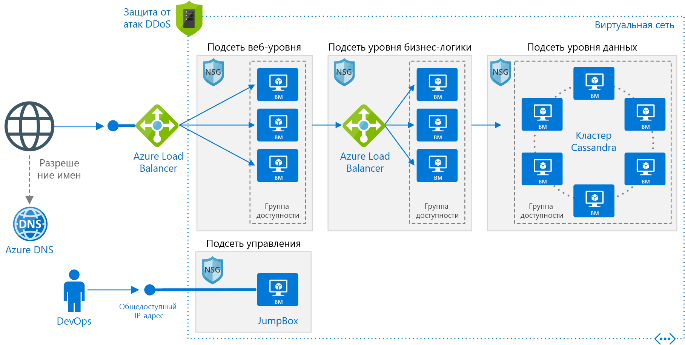

# <a name="linux-n-tier-application-in-azure-with-apache-cassandra"></a><span data-ttu-id="c8a2d-103">Использование n-уровневого приложения Linux с Apache Cassandra в Azure</span><span class="sxs-lookup"><span data-stu-id="c8a2d-103">Linux N-tier application in Azure with Apache Cassandra</span></span>

<span data-ttu-id="c8a2d-104">На примере этой эталонной архитектуры показано, как развернуть виртуальные машины и виртуальную сеть, настроенные для n-уровневого приложения с помощью Apache Cassandra на платформе Linux для уровня данных.</span><span class="sxs-lookup"><span data-stu-id="c8a2d-104">This reference architecture shows how to deploy virtual machines (VMs) and a virtual network configured for an N-tier application, using Apache Cassandra on Linux for the data tier.</span></span> <span data-ttu-id="c8a2d-105">[**Разверните это решение**](#deploy-the-solution).</span><span class="sxs-lookup"><span data-stu-id="c8a2d-105">[**Deploy this solution**](#deploy-the-solution).</span></span>



<span data-ttu-id="c8a2d-107">*Скачайте [файл Visio][visio-download] этой архитектуры.*</span><span class="sxs-lookup"><span data-stu-id="c8a2d-107">*Download a [Visio file][visio-download] of this architecture.*</span></span>

## <a name="architecture"></a><span data-ttu-id="c8a2d-108">Архитектура</span><span class="sxs-lookup"><span data-stu-id="c8a2d-108">Architecture</span></span>

<span data-ttu-id="c8a2d-109">Архитектура состоит из следующих компонентов.</span><span class="sxs-lookup"><span data-stu-id="c8a2d-109">The architecture has the following components:</span></span>

- <span data-ttu-id="c8a2d-110">**Группа ресурсов**.</span><span class="sxs-lookup"><span data-stu-id="c8a2d-110">**Resource group**.</span></span> <span data-ttu-id="c8a2d-111">[Группы ресурсов][resource-manager-overview] используются для группирования ресурсов по времени существования, владельцу и другим критериям для управления.</span><span class="sxs-lookup"><span data-stu-id="c8a2d-111">[Resource groups][resource-manager-overview] are used to group resources so they can be managed by lifetime, owner, or other criteria.</span></span>

- <span data-ttu-id="c8a2d-112">**Виртуальная сеть и подсети**.</span><span class="sxs-lookup"><span data-stu-id="c8a2d-112">**Virtual network (VNet) and subnets**.</span></span> <span data-ttu-id="c8a2d-113">Каждая виртуальная машина Azure развертывается в виртуальной сети, которую можно сегментировать на несколько подсетей.</span><span class="sxs-lookup"><span data-stu-id="c8a2d-113">Every Azure VM is deployed into a VNet that can be segmented into subnets.</span></span> <span data-ttu-id="c8a2d-114">Создайте отдельные подсети для каждого уровня.</span><span class="sxs-lookup"><span data-stu-id="c8a2d-114">Create a separate subnet for each tier.</span></span>

- <span data-ttu-id="c8a2d-115">**Группы безопасности сети.**</span><span class="sxs-lookup"><span data-stu-id="c8a2d-115">**NSGs**.</span></span> <span data-ttu-id="c8a2d-116">[Группы безопасности сети][nsg] (NSG) позволяют ограничить сетевой трафик в виртуальной сети.</span><span class="sxs-lookup"><span data-stu-id="c8a2d-116">Use [network security groups][nsg] (NSGs) to restrict network traffic within the VNet.</span></span> <span data-ttu-id="c8a2d-117">Например, в приведенной здесь трехуровневой архитектуре уровень базы данных принимает трафик из бизнес-уровня и подсети управления, но не из веб-интерфейса.</span><span class="sxs-lookup"><span data-stu-id="c8a2d-117">For example, in the three-tier architecture shown here, the database tier accepts traffic from the business tier and the management subnet, but not the web front end.</span></span>

- <span data-ttu-id="c8a2d-118">**Защита от атак DDoS**.</span><span class="sxs-lookup"><span data-stu-id="c8a2d-118">**DDoS Protection**.</span></span> <span data-ttu-id="c8a2d-119">Хотя платформа Azure и обеспечивает основную защиту от распределенных атак отказа в обслуживании (DDoS), рекомендуется использовать [Защиту Azure от атак DDoS ценовой категории "Стандартный"][ddos] с расширенными функциями защиты от атак DDoS.</span><span class="sxs-lookup"><span data-stu-id="c8a2d-119">Although the Azure platform provides basic protection against distributed denial of service (DDoS) attacks, we recommend using [DDoS Protection Standard][ddos], which has enhanced DDoS mitigation features.</span></span> <span data-ttu-id="c8a2d-120">См. раздел [Вопросы безопасности](#security-considerations) ниже.</span><span class="sxs-lookup"><span data-stu-id="c8a2d-120">See [Security considerations](#security-considerations).</span></span>

- <span data-ttu-id="c8a2d-121">**Виртуальные машины**.</span><span class="sxs-lookup"><span data-stu-id="c8a2d-121">**Virtual machines**.</span></span> <span data-ttu-id="c8a2d-122">Рекомендации по настройке виртуальных машин см. в руководствах по запуску виртуальных машин [Windows](./windows-vm.md) и [Linux](./linux-vm.md) в Azure.</span><span class="sxs-lookup"><span data-stu-id="c8a2d-122">For recommendations on configuring VMs, see [Run a Windows VM on Azure](./windows-vm.md) and [Run a Linux VM on Azure](./linux-vm.md).</span></span>

- <span data-ttu-id="c8a2d-123">**Группы доступности**.</span><span class="sxs-lookup"><span data-stu-id="c8a2d-123">**Availability sets**.</span></span> <span data-ttu-id="c8a2d-124">Создайте [группу доступности][azure-availability-sets] для каждого уровня и по крайней мере две виртуальные машины на каждом из уровней, что позволит применить к этим виртуальным машинам [Соглашение об уровне обслуживания (SLA)][vm-sla] более высокого уровня.</span><span class="sxs-lookup"><span data-stu-id="c8a2d-124">Create an [availability set][azure-availability-sets] for each tier, and provision at least two VMs in each tier, which makes the VMs eligible for a higher [service level agreement (SLA)][vm-sla].</span></span>

- <span data-ttu-id="c8a2d-125">**Подсистемы балансировки нагрузки Azure**.</span><span class="sxs-lookup"><span data-stu-id="c8a2d-125">**Azure load balancers**.</span></span> <span data-ttu-id="c8a2d-126">[Подсистемы балансировки нагрузки][load-balancer] распределяют входящие запросы из Интернета между экземплярами виртуальных машин.</span><span class="sxs-lookup"><span data-stu-id="c8a2d-126">The [load balancers][load-balancer] distribute incoming Internet requests to the VM instances.</span></span> <span data-ttu-id="c8a2d-127">[Общедоступная подсистема балансировки нагрузки][load-balancer-external] передает входящий интернет-трафик на веб-уровень, а [внутренняя подсистема балансировки нагрузки][load-balancer-internal] передает сетевой трафик с веб-уровня на бизнес-уровень.</span><span class="sxs-lookup"><span data-stu-id="c8a2d-127">Use a [public load balancer][load-balancer-external] to distribute incoming Internet traffic to the web tier, and an [internal load balancer][load-balancer-internal] to distribute network traffic from the web tier to the business tier.</span></span>

- <span data-ttu-id="c8a2d-128">**Общедоступный IP-адрес.**</span><span class="sxs-lookup"><span data-stu-id="c8a2d-128">**Public IP address**.</span></span> <span data-ttu-id="c8a2d-129">Для приема интернет-трафика общедоступной подсистеме балансировки нагрузки требуется общедоступный IP-адрес.</span><span class="sxs-lookup"><span data-stu-id="c8a2d-129">A public IP address is needed for the public load balancer to receive Internet traffic.</span></span>

- <span data-ttu-id="c8a2d-130">**Jumpbox**.</span><span class="sxs-lookup"><span data-stu-id="c8a2d-130">**Jumpbox**.</span></span> <span data-ttu-id="c8a2d-131">Он также называется [узлом-бастионом].</span><span class="sxs-lookup"><span data-stu-id="c8a2d-131">Also called a [bastion host].</span></span> <span data-ttu-id="c8a2d-132">Безопасная виртуальная машина в сети, которую администраторы используют для подключения к другим виртуальным машинам.</span><span class="sxs-lookup"><span data-stu-id="c8a2d-132">A secure VM on the network that administrators use to connect to the other VMs.</span></span> <span data-ttu-id="c8a2d-133">В jumpbox есть группа безопасности сети, обеспечивающая удаленный трафик только из общедоступных IP-адресов из списка надежных отправителей.</span><span class="sxs-lookup"><span data-stu-id="c8a2d-133">The jumpbox has an NSG that allows remote traffic only from public IP addresses on a safe list.</span></span> <span data-ttu-id="c8a2d-134">NSG должна пропускать трафик SSH.</span><span class="sxs-lookup"><span data-stu-id="c8a2d-134">The NSG should allow ssh traffic.</span></span>

- <span data-ttu-id="c8a2d-135">**База данных Apache Cassandra.**</span><span class="sxs-lookup"><span data-stu-id="c8a2d-135">**Apache Cassandra database**.</span></span> <span data-ttu-id="c8a2d-136">Обеспечивает высокий уровень доступности на уровне данных, включив репликацию и отработку отказа.</span><span class="sxs-lookup"><span data-stu-id="c8a2d-136">Provides high availability at the data tier, by enabling replication and failover.</span></span>

- <span data-ttu-id="c8a2d-137">**Azure DNS**.</span><span class="sxs-lookup"><span data-stu-id="c8a2d-137">**Azure DNS**.</span></span> <span data-ttu-id="c8a2d-138">[Azure DNS][azure-dns] — это служба размещения для доменов DNS.</span><span class="sxs-lookup"><span data-stu-id="c8a2d-138">[Azure DNS][azure-dns] is a hosting service for DNS domains.</span></span> <span data-ttu-id="c8a2d-139">Она осуществляет разрешение имен на базе инфраструктуры Microsoft Azure.</span><span class="sxs-lookup"><span data-stu-id="c8a2d-139">It provides name resolution using Microsoft Azure infrastructure.</span></span> <span data-ttu-id="c8a2d-140">Размещая домены в Azure, вы можете управлять своими записями DNS с помощью тех же учетных данных, API и инструментов и оплачивать использование, как и другие службы Azure.</span><span class="sxs-lookup"><span data-stu-id="c8a2d-140">By hosting your domains in Azure, you can manage your DNS records using the same credentials, APIs, tools, and billing as your other Azure services.</span></span>

## <a name="recommendations"></a><span data-ttu-id="c8a2d-141">Рекомендации</span><span class="sxs-lookup"><span data-stu-id="c8a2d-141">Recommendations</span></span>

<span data-ttu-id="c8a2d-142">Описанная здесь архитектура может не соответствовать вашим требованиям.</span><span class="sxs-lookup"><span data-stu-id="c8a2d-142">Your requirements might differ from the architecture described here.</span></span> <span data-ttu-id="c8a2d-143">Воспользуйтесь этими рекомендациями в качестве отправной точки.</span><span class="sxs-lookup"><span data-stu-id="c8a2d-143">Use these recommendations as a starting point.</span></span>

### <a name="vnet--subnets"></a><span data-ttu-id="c8a2d-144">Виртуальная сеть и подсети</span><span class="sxs-lookup"><span data-stu-id="c8a2d-144">VNet / Subnets</span></span>

<span data-ttu-id="c8a2d-145">При создании виртуальной сети определите, сколько IP-адресов требуется для ресурсов в каждой подсети.</span><span class="sxs-lookup"><span data-stu-id="c8a2d-145">When you create the VNet, determine how many IP addresses your resources in each subnet require.</span></span> <span data-ttu-id="c8a2d-146">Укажите маску подсети и достаточно большой диапазон адресов виртуальной сети для требуемых IP-адресов с помощью нотации [CIDR].</span><span class="sxs-lookup"><span data-stu-id="c8a2d-146">Specify a subnet mask and a VNet address range large enough for the required IP addresses, using [CIDR] notation.</span></span> <span data-ttu-id="c8a2d-147">Используйте адресное пространство, которое входит в диапазон стандартных [блоков частных IP-адресов][private-ip-space], например 10.0.0.0/8, 172.16.0.0/12 и 192.168.0.0/16.</span><span class="sxs-lookup"><span data-stu-id="c8a2d-147">Use an address space that falls within the standard [private IP address blocks][private-ip-space], which are 10.0.0.0/8, 172.16.0.0/12, and 192.168.0.0/16.</span></span>

<span data-ttu-id="c8a2d-148">Выберите диапазон адресов, который не перекрывает локальную сеть, если вам нужно позже настроить шлюз между виртуальной и локальной сетями.</span><span class="sxs-lookup"><span data-stu-id="c8a2d-148">Choose an address range that doesn't overlap with your on-premises network, in case you need to set up a gateway between the VNet and your on-premise network later.</span></span> <span data-ttu-id="c8a2d-149">Создав виртуальную сеть, изменить диапазон адресов нельзя.</span><span class="sxs-lookup"><span data-stu-id="c8a2d-149">Once you create the VNet, you can't change the address range.</span></span>

<span data-ttu-id="c8a2d-150">Проектируйте подсети с учетом требований к функциональности и безопасности.</span><span class="sxs-lookup"><span data-stu-id="c8a2d-150">Design subnets with functionality and security requirements in mind.</span></span> <span data-ttu-id="c8a2d-151">Все виртуальные машины в пределах одного уровня или одной роли должны входить в одну и ту же подсеть, которая может быть надежным периметром безопасности.</span><span class="sxs-lookup"><span data-stu-id="c8a2d-151">All VMs within the same tier or role should go into the same subnet, which can be a security boundary.</span></span> <span data-ttu-id="c8a2d-152">Дополнительные сведения о проектировании виртуальных сетей и подсетей см. в статье [Планирование и проектирование виртуальных сетей Azure][plan-network].</span><span class="sxs-lookup"><span data-stu-id="c8a2d-152">For more information about designing VNets and subnets, see [Plan and design Azure Virtual Networks][plan-network].</span></span>

### <a name="load-balancers"></a><span data-ttu-id="c8a2d-153">Балансировщики нагрузки</span><span class="sxs-lookup"><span data-stu-id="c8a2d-153">Load balancers</span></span>

<span data-ttu-id="c8a2d-154">Не предоставляйте виртуальным машинам непосредственный доступ в Интернет.</span><span class="sxs-lookup"><span data-stu-id="c8a2d-154">Do not expose the VMs directly to the Internet.</span></span> <span data-ttu-id="c8a2d-155">Вместо этого назначьте каждой виртуальной машине частный IP-адрес.</span><span class="sxs-lookup"><span data-stu-id="c8a2d-155">Instead, give each VM a private IP address.</span></span> <span data-ttu-id="c8a2d-156">Клиенты подключаются с помощью IP-адреса общедоступной подсистемы балансировки нагрузки.</span><span class="sxs-lookup"><span data-stu-id="c8a2d-156">Clients connect using the IP address of the public load balancer.</span></span>

<span data-ttu-id="c8a2d-157">Определите правила подсистемы балансировки нагрузки для направления трафика к виртуальным машинам.</span><span class="sxs-lookup"><span data-stu-id="c8a2d-157">Define load balancer rules to direct network traffic to the VMs.</span></span> <span data-ttu-id="c8a2d-158">Например, чтобы включить трафик HTTP, создайте правило, которое сопоставляет порт 80 интерфейсной конфигурации с портом 80 серверного пула адресов.</span><span class="sxs-lookup"><span data-stu-id="c8a2d-158">For example, to enable HTTP traffic, create a rule that maps port 80 from the front-end configuration to port 80 on the back-end address pool.</span></span> <span data-ttu-id="c8a2d-159">Когда клиент отправляет HTTP-запрос на порт 80, подсистема балансировки нагрузки выбирает IP-адрес серверной части с помощью [хэш-алгоритма][load-balancer-hashing], который включает исходный IP-адрес.</span><span class="sxs-lookup"><span data-stu-id="c8a2d-159">When a client sends an HTTP request to port 80, the load balancer selects a back-end IP address by using a [hashing algorithm][load-balancer-hashing] that includes the source IP address.</span></span> <span data-ttu-id="c8a2d-160">Клиентские запросы распределяются между всеми виртуальными машинами.</span><span class="sxs-lookup"><span data-stu-id="c8a2d-160">Client requests are distributed across all the VMs.</span></span>

### <a name="network-security-groups"></a><span data-ttu-id="c8a2d-161">Группы безопасности сети</span><span class="sxs-lookup"><span data-stu-id="c8a2d-161">Network security groups</span></span>

<span data-ttu-id="c8a2d-162">С помощью правил NSG можно ограничить трафик между уровнями.</span><span class="sxs-lookup"><span data-stu-id="c8a2d-162">Use NSG rules to restrict traffic between tiers.</span></span> <span data-ttu-id="c8a2d-163">Например, в показанной выше трехуровневой архитектуре веб-уровень не взаимодействует напрямую с уровнем базы данных.</span><span class="sxs-lookup"><span data-stu-id="c8a2d-163">For example, in the three-tier architecture shown above, the web tier does not communicate directly with the database tier.</span></span> <span data-ttu-id="c8a2d-164">Чтобы обеспечить эту возможность, уровень базы данных должен блокировать входящий трафик из подсети веб-уровня.</span><span class="sxs-lookup"><span data-stu-id="c8a2d-164">To enforce this, the database tier should block incoming traffic from the web tier subnet.</span></span>

1. <span data-ttu-id="c8a2d-165">Запретите весь входящий трафик от виртуальной сети.</span><span class="sxs-lookup"><span data-stu-id="c8a2d-165">Deny all inbound traffic from the VNet.</span></span> <span data-ttu-id="c8a2d-166">(В правиле используйте тег `VIRTUAL_NETWORK`.)</span><span class="sxs-lookup"><span data-stu-id="c8a2d-166">(Use the `VIRTUAL_NETWORK` tag in the rule.)</span></span>
2. <span data-ttu-id="c8a2d-167">Разрешите входящий трафик из подсети бизнес-уровня.</span><span class="sxs-lookup"><span data-stu-id="c8a2d-167">Allow inbound traffic from the business tier subnet.</span></span>
3. <span data-ttu-id="c8a2d-168">Разрешите входящий трафик из самой подсети уровня базы данных.</span><span class="sxs-lookup"><span data-stu-id="c8a2d-168">Allow inbound traffic from the database tier subnet itself.</span></span> <span data-ttu-id="c8a2d-169">Это правило обеспечивает взаимодействие между виртуальными машинами баз данных, которое необходимо для репликации и отработки отказа базы данных.</span><span class="sxs-lookup"><span data-stu-id="c8a2d-169">This rule allows communication between the database VMs, which is needed for database replication and failover.</span></span>
4. <span data-ttu-id="c8a2d-170">Разрешите трафик SSH (порт 22) из подсети jumpbox.</span><span class="sxs-lookup"><span data-stu-id="c8a2d-170">Allow ssh traffic (port 22) from the jumpbox subnet.</span></span> <span data-ttu-id="c8a2d-171">Это правило позволяет администраторам подключаться к уровню базы данных из jumpbox.</span><span class="sxs-lookup"><span data-stu-id="c8a2d-171">This rule lets administrators connect to the database tier from the jumpbox.</span></span>

<span data-ttu-id="c8a2d-172">Создайте правила 2 и 4 с более высоким приоритетом, чем у правила 1, чтобы они переопределяли его.</span><span class="sxs-lookup"><span data-stu-id="c8a2d-172">Create rules 2 &ndash; 4 with higher priority than the first rule, so they override it.</span></span>

### <a name="cassandra"></a><span data-ttu-id="c8a2d-173">Cassandra</span><span class="sxs-lookup"><span data-stu-id="c8a2d-173">Cassandra</span></span>

<span data-ttu-id="c8a2d-174">Для производственных целей мы рекомендуем использовать [DataStax Enterprise][datastax]. Эти рекомендации применимы для каждого выпуска Cassandra.</span><span class="sxs-lookup"><span data-stu-id="c8a2d-174">We recommend [DataStax Enterprise][datastax] for production use, but these recommendations apply to any Cassandra edition.</span></span> <span data-ttu-id="c8a2d-175">Дополнительные сведения о запуске DataStax в Azure см. в [руководстве по развертыванию DataStax Enterprise для Azure][cassandra-in-azure].</span><span class="sxs-lookup"><span data-stu-id="c8a2d-175">For more information on running DataStax in Azure, see [DataStax Enterprise Deployment Guide for Azure][cassandra-in-azure].</span></span>

<span data-ttu-id="c8a2d-176">Поместите виртуальные машины для кластера Cassandra в группе доступности, чтобы обеспечить распределение реплик между несколькими доменами сбоя и обновления.</span><span class="sxs-lookup"><span data-stu-id="c8a2d-176">Put the VMs for a Cassandra cluster in an availability set to ensure that the Cassandra replicas are distributed across multiple fault domains and upgrade domains.</span></span> <span data-ttu-id="c8a2d-177">Дополнительные сведения о доменах сбоя и обновления см. в статье [Управление доступностью виртуальных машин Linux][azure-availability-sets].</span><span class="sxs-lookup"><span data-stu-id="c8a2d-177">For more information about fault domains and upgrade domains, see [Manage the availability of virtual machines][azure-availability-sets].</span></span>

<span data-ttu-id="c8a2d-178">Для одной группы доступности настройте эти три домена сбоя (максимальное количество) и 18 доменов обновления.</span><span class="sxs-lookup"><span data-stu-id="c8a2d-178">Configure three fault domains (the maximum) per availability set and 18 upgrade domains per availability set.</span></span> <span data-ttu-id="c8a2d-179">Это обеспечивает максимальное количество доменов обновления, которые можно равномерно распределить между доменами сбоя.</span><span class="sxs-lookup"><span data-stu-id="c8a2d-179">This provides the maximum number of upgrade domains that can still be distributed evenly across the fault domains.</span></span>

<span data-ttu-id="c8a2d-180">Настройте узлы в режиме с поддержкой стоек.</span><span class="sxs-lookup"><span data-stu-id="c8a2d-180">Configure nodes in rack-aware mode.</span></span> <span data-ttu-id="c8a2d-181">Сопоставьте домены сбоя со стойками в файле `cassandra-rackdc.properties`.</span><span class="sxs-lookup"><span data-stu-id="c8a2d-181">Map fault domains to racks in the `cassandra-rackdc.properties` file.</span></span>

<span data-ttu-id="c8a2d-182">Вам не потребуется подсистема балансировки нагрузки для кластера.</span><span class="sxs-lookup"><span data-stu-id="c8a2d-182">You don't need a load balancer in front of the cluster.</span></span> <span data-ttu-id="c8a2d-183">Клиент подключается напрямую к узлу в кластере.</span><span class="sxs-lookup"><span data-stu-id="c8a2d-183">The client connects directly to a node in the cluster.</span></span>

<span data-ttu-id="c8a2d-184">Чтобы обеспечить высокий уровень доступности, разверните Cassandra в нескольких регионах Azure.</span><span class="sxs-lookup"><span data-stu-id="c8a2d-184">For high availability, deploy Cassandra in more than one Azure region.</span></span> <span data-ttu-id="c8a2d-185">В каждом регионе узлы настраиваются в режиме с поддержкой стоек с доменами сбоя и обновления для обеспечения устойчивости в пределах региона.</span><span class="sxs-lookup"><span data-stu-id="c8a2d-185">Nodes within each region are configured in rack-aware mode with fault and upgrade domains, for resiliency inside the region.</span></span>

### <a name="jumpbox"></a><span data-ttu-id="c8a2d-186">Jumpbox</span><span class="sxs-lookup"><span data-stu-id="c8a2d-186">Jumpbox</span></span>

<span data-ttu-id="c8a2d-187">Запретите доступ по протоколу SSH из общедоступного Интернета к виртуальным машинам, которые выполняют рабочую нагрузку приложения.</span><span class="sxs-lookup"><span data-stu-id="c8a2d-187">Don't allow ssh access from the public Internet to the VMs that run the application workload.</span></span> <span data-ttu-id="c8a2d-188">Вместо этого все доступы по протоколу SSH к этим виртуальным машинам должны проходить через jumpbox.</span><span class="sxs-lookup"><span data-stu-id="c8a2d-188">Instead, all ssh access to these VMs must come through the jumpbox.</span></span> <span data-ttu-id="c8a2d-189">Администратор выполняет вход в jumpbox, а затем вход в другую виртуальную машину из jumpbox.</span><span class="sxs-lookup"><span data-stu-id="c8a2d-189">An administrator logs into the jumpbox, and then logs into the other VM from the jumpbox.</span></span> <span data-ttu-id="c8a2d-190">Jumpbox разрешает трафик SSH из Интернета, но только из известных и безопасных IP-адресов.</span><span class="sxs-lookup"><span data-stu-id="c8a2d-190">The jumpbox allows ssh traffic from the Internet, but only from known, safe IP addresses.</span></span>

<span data-ttu-id="c8a2d-191">Jumpbox имеет минимальные требования к производительности, поэтому выберите небольшой размер виртуальной машины.</span><span class="sxs-lookup"><span data-stu-id="c8a2d-191">The jumpbox has minimal performance requirements, so select a small VM size.</span></span> <span data-ttu-id="c8a2d-192">Создайте [общедоступный IP-адрес] для jumpbox.</span><span class="sxs-lookup"><span data-stu-id="c8a2d-192">Create a [public IP address] for the jumpbox.</span></span> <span data-ttu-id="c8a2d-193">Поместите jumpbox в виртуальную сеть вместе с другими виртуальными машинами, однако в отдельную подсеть управления.</span><span class="sxs-lookup"><span data-stu-id="c8a2d-193">Place the jumpbox in the same VNet as the other VMs, but in a separate management subnet.</span></span>

<span data-ttu-id="c8a2d-194">Чтобы защитить jumpbox, добавьте правило NSG, разрешающее подключения по протоколу SSH только из безопасного набора общедоступных IP-адресов.</span><span class="sxs-lookup"><span data-stu-id="c8a2d-194">To secure the jumpbox, add an NSG rule that allows ssh connections only from a safe set of public IP addresses.</span></span> <span data-ttu-id="c8a2d-195">Настройте NSG для других подсетей, чтобы разрешить трафик SSH из подсети управления.</span><span class="sxs-lookup"><span data-stu-id="c8a2d-195">Configure the NSGs for the other subnets to allow ssh traffic from the management subnet.</span></span>

## <a name="scalability-considerations"></a><span data-ttu-id="c8a2d-196">Вопросы масштабируемости</span><span class="sxs-lookup"><span data-stu-id="c8a2d-196">Scalability considerations</span></span>

<span data-ttu-id="c8a2d-197">Рассмотрите возможность использования [масштабируемых наборов виртуальных машин][vmss] для веб-уровня и бизнес-уровня, вместо развертывания отдельных виртуальных машин в группе доступности.</span><span class="sxs-lookup"><span data-stu-id="c8a2d-197">For the web and business tiers, consider using [virtual machine scale sets][vmss], instead of deploying separate VMs into an availability set.</span></span> <span data-ttu-id="c8a2d-198">Масштабируемый набор упрощает процессы развертывания и администрирования набора идентичных виртуальных машин, а также автоматического масштабирования виртуальных машин на основе метрик производительности.</span><span class="sxs-lookup"><span data-stu-id="c8a2d-198">A scale set makes it easy to deploy and manage a set of identical VMs, and autoscale the VMs based on performance metrics.</span></span> <span data-ttu-id="c8a2d-199">По мере увеличения нагрузки на виртуальные машины в подсистему балансировки нагрузки автоматически добавляются дополнительные виртуальные машины.</span><span class="sxs-lookup"><span data-stu-id="c8a2d-199">As the load on the VMs increases, additional VMs are automatically added to the load balancer.</span></span> <span data-ttu-id="c8a2d-200">Подумайте об использовании масштабируемых наборов, если необходимо быстро развернуть виртуальные машины или выполнить автомасштабирование.</span><span class="sxs-lookup"><span data-stu-id="c8a2d-200">Consider scale sets if you need to quickly scale out VMs, or need to autoscale.</span></span>

<span data-ttu-id="c8a2d-201">Настройку виртуальных машин, развернутых в масштабируемый набор, можно выполнить двумя основными способами:</span><span class="sxs-lookup"><span data-stu-id="c8a2d-201">There are two basic ways to configure VMs deployed in a scale set:</span></span>

- <span data-ttu-id="c8a2d-202">Используйте расширения для настройки виртуальной машины после ее развертывания.</span><span class="sxs-lookup"><span data-stu-id="c8a2d-202">Use extensions to configure the VM after it's deployed.</span></span> <span data-ttu-id="c8a2d-203">В этом случае новые экземпляры виртуальной машины могут дольше запускаться, чем виртуальные машины без расширений.</span><span class="sxs-lookup"><span data-stu-id="c8a2d-203">With this approach, new VM instances may take longer to start up than a VM with no extensions.</span></span>

- <span data-ttu-id="c8a2d-204">Развернуть [управляемый диск](/azure/storage/storage-managed-disks-overview) с помощью пользовательского образа диска.</span><span class="sxs-lookup"><span data-stu-id="c8a2d-204">Deploy a [managed disk](/azure/storage/storage-managed-disks-overview) with a custom disk image.</span></span> <span data-ttu-id="c8a2d-205">При этом развертывание выполняется быстрее.</span><span class="sxs-lookup"><span data-stu-id="c8a2d-205">This option may be quicker to deploy.</span></span> <span data-ttu-id="c8a2d-206">Но образ необходимо обновлять.</span><span class="sxs-lookup"><span data-stu-id="c8a2d-206">However, it requires you to keep the image up-to-date.</span></span>

<span data-ttu-id="c8a2d-207">Дополнительные сведения см. в статье [Рекомендации по проектированию масштабируемых наборов][vmss-design].</span><span class="sxs-lookup"><span data-stu-id="c8a2d-207">For more information, see [Design considerations for scale sets][vmss-design].</span></span>

> [!TIP]
> <span data-ttu-id="c8a2d-208">При использовании любого решения автоматического масштабирования заблаговременно протестируйте его с рабочими нагрузками производственного уровня.</span><span class="sxs-lookup"><span data-stu-id="c8a2d-208">When using any autoscale solution, test it with production-level workloads well in advance.</span></span>

<span data-ttu-id="c8a2d-209">В каждой подписке Azure настроены ограничения по умолчанию, включая максимальное количество виртуальных машин в каждом регионе.</span><span class="sxs-lookup"><span data-stu-id="c8a2d-209">Each Azure subscription has default limits in place, including a maximum number of VMs per region.</span></span> <span data-ttu-id="c8a2d-210">Их лимит можно увеличить, создав запрос на поддержку.</span><span class="sxs-lookup"><span data-stu-id="c8a2d-210">You can increase the limit by filing a support request.</span></span> <span data-ttu-id="c8a2d-211">Дополнительные сведения см. в статье [Подписка Azure, границы, квоты и ограничения службы][subscription-limits].</span><span class="sxs-lookup"><span data-stu-id="c8a2d-211">For more information, see [Azure subscription and service limits, quotas, and constraints][subscription-limits].</span></span>

## <a name="availability-considerations"></a><span data-ttu-id="c8a2d-212">Вопросы доступности</span><span class="sxs-lookup"><span data-stu-id="c8a2d-212">Availability considerations</span></span>

<span data-ttu-id="c8a2d-213">Если вы не используете масштабируемые наборы виртуальных машин, разместите виртуальные машины для одного уровня в группе доступности.</span><span class="sxs-lookup"><span data-stu-id="c8a2d-213">If you don't use virtual machine scale sets, put VMs for the same tier into an availability set.</span></span> <span data-ttu-id="c8a2d-214">Создайте по крайней мере две виртуальные машины в группе доступности для реализации [соглашения об уровне обслуживания, гарантирующем доступность виртуальных машин Azure][vm-sla].</span><span class="sxs-lookup"><span data-stu-id="c8a2d-214">Create at least two VMs in the availability set to support the [availability SLA for Azure VMs][vm-sla].</span></span> <span data-ttu-id="c8a2d-215">Дополнительные сведения см. в статье [Управление доступностью виртуальных машин Windows в Azure][availability-set].</span><span class="sxs-lookup"><span data-stu-id="c8a2d-215">For more information, see [Manage the availability of virtual machines][availability-set].</span></span> <span data-ttu-id="c8a2d-216">Масштабируемые наборы автоматически используют *группы размещения*, которые функционируют как неявная группа доступности.</span><span class="sxs-lookup"><span data-stu-id="c8a2d-216">Scale sets automatically use *placement groups*, which act as an implicit availability set.</span></span>

<span data-ttu-id="c8a2d-217">Подсистема балансировки нагрузки выполняет [проверку работоспособности][health-probes], чтобы отслеживать доступность экземпляров виртуальных машин.</span><span class="sxs-lookup"><span data-stu-id="c8a2d-217">The load balancer uses [health probes][health-probes] to monitor the availability of VM instances.</span></span> <span data-ttu-id="c8a2d-218">Если пробу не удается выполнить в экземпляре в течение определенного времени, подсистема балансировки нагрузки останавливает отправку трафика на эту виртуальную машину.</span><span class="sxs-lookup"><span data-stu-id="c8a2d-218">If a probe can't reach an instance within a timeout period, the load balancer stops sending traffic to that VM.</span></span> <span data-ttu-id="c8a2d-219">Подсистема балансировки нагрузки продолжит выполнять пробу и, если виртуальная машина станет снова доступна, отправка трафика к этой виртуальной машине будет возобновлена.</span><span class="sxs-lookup"><span data-stu-id="c8a2d-219">The load balancer will continue to probe, and if the VM becomes available again, the load balancer resumes sending traffic to that VM.</span></span>

<span data-ttu-id="c8a2d-220">Вот несколько рекомендаций по проверке работоспособности подсистемы балансировки нагрузки:</span><span class="sxs-lookup"><span data-stu-id="c8a2d-220">Here are some recommendations on load balancer health probes:</span></span>

- <span data-ttu-id="c8a2d-221">При проверке может тестироваться HTTP или TCP.</span><span class="sxs-lookup"><span data-stu-id="c8a2d-221">Probes can test either HTTP or TCP.</span></span> <span data-ttu-id="c8a2d-222">Если на виртуальных машинах запущен HTTP-сервер, создайте проверку HTTP.</span><span class="sxs-lookup"><span data-stu-id="c8a2d-222">If your VMs run an HTTP server, create an HTTP probe.</span></span> <span data-ttu-id="c8a2d-223">В противном случае создайте проверку TCP.</span><span class="sxs-lookup"><span data-stu-id="c8a2d-223">Otherwise create a TCP probe.</span></span>
- <span data-ttu-id="c8a2d-224">В проверке HTTP укажите путь к конечной точке HTTP.</span><span class="sxs-lookup"><span data-stu-id="c8a2d-224">For an HTTP probe, specify the path to an HTTP endpoint.</span></span> <span data-ttu-id="c8a2d-225">При этом проверяется код ответа HTTP 200 с этого пути.</span><span class="sxs-lookup"><span data-stu-id="c8a2d-225">The probe checks for an HTTP 200 response from this path.</span></span> <span data-ttu-id="c8a2d-226">Это может быть путь к корневому каталогу ("/") или конечная точка мониторинга работоспособности, которая реализует определенную пользовательскую логику для проверки работоспособности приложения.</span><span class="sxs-lookup"><span data-stu-id="c8a2d-226">This can be the root path ("/"), or a health-monitoring endpoint that implements some custom logic to check the health of the application.</span></span> <span data-ttu-id="c8a2d-227">Конечная точка должна разрешать анонимные HTTP-запросы.</span><span class="sxs-lookup"><span data-stu-id="c8a2d-227">The endpoint must allow anonymous HTTP requests.</span></span>
- <span data-ttu-id="c8a2d-228">Проверка отправляется с [известного][health-probe-ip] IP-адреса — 168.63.129.16.</span><span class="sxs-lookup"><span data-stu-id="c8a2d-228">The probe is sent from a [known IP address][health-probe-ip], 168.63.129.16.</span></span> <span data-ttu-id="c8a2d-229">Не блокируйте входящий и исходящий трафик для этого IP-адреса в политиках брандмауэра или правилах группы безопасности сети.</span><span class="sxs-lookup"><span data-stu-id="c8a2d-229">Make sure you don't block traffic to or from this IP address in any firewall policies or NSG rules.</span></span>
- <span data-ttu-id="c8a2d-230">Используйте [журналы проверки работоспособности][health-probe-log] для просмотра состояния проверки работоспособности.</span><span class="sxs-lookup"><span data-stu-id="c8a2d-230">Use [health probe logs][health-probe-log] to view the status of the health probes.</span></span> <span data-ttu-id="c8a2d-231">Включите ведение журнала на портале Azure для каждой подсистемы балансировки нагрузки.</span><span class="sxs-lookup"><span data-stu-id="c8a2d-231">Enable logging in the Azure portal for each load balancer.</span></span> <span data-ttu-id="c8a2d-232">Журналы записываются в хранилище BLOB-объектов Azure.</span><span class="sxs-lookup"><span data-stu-id="c8a2d-232">Logs are written to Azure Blob storage.</span></span> <span data-ttu-id="c8a2d-233">В журналах показано, сколько виртуальных машин не получают сетевой трафик из-за ответов о неудачной попытке пробы.</span><span class="sxs-lookup"><span data-stu-id="c8a2d-233">The logs show how many VMs aren't getting network traffic because of failed probe responses.</span></span>

<span data-ttu-id="c8a2d-234">Для кластера Cassandra сценарии отработки отказа зависят от уровней согласованности, используемых приложением, а также от количества используемых реплик.</span><span class="sxs-lookup"><span data-stu-id="c8a2d-234">For the Cassandra cluster, the failover scenarios depend on the consistency levels used by the application and the number of replicas.</span></span> <span data-ttu-id="c8a2d-235">Сведения об уровнях согласованности и потреблении в Cassandra см. в руководстве по [обеспечению согласованности данных][cassandra-consistency] и [описании узлов, которые обмениваются данными с кворумом (Cassandra)][cassandra-consistency-usage].</span><span class="sxs-lookup"><span data-stu-id="c8a2d-235">For consistency levels and usage in Cassandra, see [Configuring data consistency][cassandra-consistency] and [Cassandra: How many nodes are talked to with Quorum?][cassandra-consistency-usage]</span></span> <span data-ttu-id="c8a2d-236">Доступность данных в Cassandra определяется уровнем согласованности, используемым приложением, и механизмом репликации.</span><span class="sxs-lookup"><span data-stu-id="c8a2d-236">Data availability in Cassandra is determined by the consistency level used by the application and the replication mechanism.</span></span> <span data-ttu-id="c8a2d-237">Сведения о репликации в Cassandra см. в статье [Data Replication in NoSQL Databases Explained][cassandra-replication] (Описание репликации данных в базах данных NoSQL).</span><span class="sxs-lookup"><span data-stu-id="c8a2d-237">For replication in Cassandra, see [Data Replication in NoSQL Databases Explained][cassandra-replication].</span></span>

## <a name="security-considerations"></a><span data-ttu-id="c8a2d-238">Вопросы безопасности</span><span class="sxs-lookup"><span data-stu-id="c8a2d-238">Security considerations</span></span>

<span data-ttu-id="c8a2d-239">Виртуальные сети являются границей, изолирующей трафик в Azure.</span><span class="sxs-lookup"><span data-stu-id="c8a2d-239">Virtual networks are a traffic isolation boundary in Azure.</span></span> <span data-ttu-id="c8a2d-240">Виртуальные машины из разных виртуальных сетей не могут напрямую обмениваться данными.</span><span class="sxs-lookup"><span data-stu-id="c8a2d-240">VMs in one VNet can't communicate directly with VMs in a different VNet.</span></span> <span data-ttu-id="c8a2d-241">Виртуальные машины в одной виртуальной сети могут обмениваться данными, если только не созданы [группы безопасности сети][nsg], ограничивающие этот трафик.</span><span class="sxs-lookup"><span data-stu-id="c8a2d-241">VMs within the same VNet can communicate, unless you create [network security groups][nsg] (NSGs) to restrict traffic.</span></span> <span data-ttu-id="c8a2d-242">Дополнительные сведения см. в статье [Облачные службы Microsoft Cloud и сетевая безопасность][network-security].</span><span class="sxs-lookup"><span data-stu-id="c8a2d-242">For more information, see [Microsoft cloud services and network security][network-security].</span></span>

<span data-ttu-id="c8a2d-243">Для входящего интернет-трафика правила подсистемы балансировки нагрузки определяют, какой трафик может достичь серверной части.</span><span class="sxs-lookup"><span data-stu-id="c8a2d-243">For incoming Internet traffic, the load balancer rules define which traffic can reach the back end.</span></span> <span data-ttu-id="c8a2d-244">Однако правила подсистемы балансировки нагрузки не поддерживают списки безопасных IP-адресов, поэтому если вы хотите добавить некоторые общедоступные IP-адреса в список надежных, добавьте группу безопасности сети в подсеть.</span><span class="sxs-lookup"><span data-stu-id="c8a2d-244">However, load balancer rules don't support IP safe lists, so if you want to add certain public IP addresses to a safe list, add an NSG to the subnet.</span></span>

<span data-ttu-id="c8a2d-245">**DMZ**.</span><span class="sxs-lookup"><span data-stu-id="c8a2d-245">**DMZ**.</span></span> <span data-ttu-id="c8a2d-246">Попробуйте добавить сетевой виртуальный модуль (NVA), чтобы создать сеть периметра между Интернетом и виртуальною сетью Azure.</span><span class="sxs-lookup"><span data-stu-id="c8a2d-246">Consider adding a network virtual appliance (NVA) to create a DMZ between the Internet and the Azure virtual network.</span></span> <span data-ttu-id="c8a2d-247">Сетевой виртуальный модуль — это универсальный термин для виртуального модуля, который может выполнять сетевые задачи, например брандмауэра, проверки пакетов, аудита и пользовательской маршрутизации.</span><span class="sxs-lookup"><span data-stu-id="c8a2d-247">NVA is a generic term for a virtual appliance that can perform network-related tasks, such as firewall, packet inspection, auditing, and custom routing.</span></span> <span data-ttu-id="c8a2d-248">Дополнительные сведения см. в статье [Сеть периметра между Azure и Интернетом][dmz].</span><span class="sxs-lookup"><span data-stu-id="c8a2d-248">For more information, see [Implementing a DMZ between Azure and the Internet][dmz].</span></span>

<span data-ttu-id="c8a2d-249">**Шифрование**.</span><span class="sxs-lookup"><span data-stu-id="c8a2d-249">**Encryption**.</span></span> <span data-ttu-id="c8a2d-250">Выполните шифрование конфиденциальных неактивных данных и используйте [Azure Key Vault][azure-key-vault] для управления ключами шифрования базы данных.</span><span class="sxs-lookup"><span data-stu-id="c8a2d-250">Encrypt sensitive data at rest and use [Azure Key Vault][azure-key-vault] to manage the database encryption keys.</span></span> <span data-ttu-id="c8a2d-251">Key Vault может хранить ключи шифрования в аппаратных модулях безопасности.</span><span class="sxs-lookup"><span data-stu-id="c8a2d-251">Key Vault can store encryption keys in hardware security modules (HSMs).</span></span> <span data-ttu-id="c8a2d-252">В Key Vault также рекомендуется хранить секреты приложения, например строки подключения к базе данных.</span><span class="sxs-lookup"><span data-stu-id="c8a2d-252">It's also recommended to store application secrets, such as database connection strings, in Key Vault.</span></span>

<span data-ttu-id="c8a2d-253">**Защита от атак DDoS.**</span><span class="sxs-lookup"><span data-stu-id="c8a2d-253">**DDoS protection**.</span></span> <span data-ttu-id="c8a2d-254">Платформа Azure по умолчанию предоставляет основные средства защиты от атак DDoS.</span><span class="sxs-lookup"><span data-stu-id="c8a2d-254">The Azure platform provides basic DDoS protection by default.</span></span> <span data-ttu-id="c8a2d-255">Эти основные средства защиты предназначены для защиты всей инфраструктуры Azure.</span><span class="sxs-lookup"><span data-stu-id="c8a2d-255">This basic protection is targeted at protecting the Azure infrastructure as a whole.</span></span> <span data-ttu-id="c8a2d-256">Хотя базовая защита от атак DDoS включается автоматически, рекомендуется использовать [Защиту Azure от атак DDoS ценовой категории "Стандартный"][ddos].</span><span class="sxs-lookup"><span data-stu-id="c8a2d-256">Although basic DDoS protection is automatically enabled, we recommend using [DDoS Protection Standard][ddos].</span></span> <span data-ttu-id="c8a2d-257">Для ценовой категории "Стандартный" предусмотрена адаптивная настройка для обнаружения угроз на основе моделей сетевого трафика вашего приложения.</span><span class="sxs-lookup"><span data-stu-id="c8a2d-257">Standard protection uses adaptive tuning, based on your application's network traffic patterns, to detect threats.</span></span> <span data-ttu-id="c8a2d-258">Это позволяет устранять риски атак DDoS, которые могут остаться незамеченными для соответствующих политик уровня инфраструктуры.</span><span class="sxs-lookup"><span data-stu-id="c8a2d-258">This allows it to apply mitigations against DDoS attacks that might go unnoticed by the infrastructure-wide DDoS policies.</span></span> <span data-ttu-id="c8a2d-259">Для этой ценовой категории также включена поддержка оповещений, телеметрии и аналитики на основе Azure Monitor.</span><span class="sxs-lookup"><span data-stu-id="c8a2d-259">Standard protection also provides alerting, telemetry, and analytics through Azure Monitor.</span></span> <span data-ttu-id="c8a2d-260">Дополнительные сведения см. в руководстве по [использованию Защиты от атак DDoS Azure с рекомендациями и эталонной архитектурой][ddos-best-practices].</span><span class="sxs-lookup"><span data-stu-id="c8a2d-260">For more information, see [Azure DDoS Protection: Best practices and reference architectures][ddos-best-practices].</span></span>

## <a name="deploy-the-solution"></a><span data-ttu-id="c8a2d-261">Развертывание решения</span><span class="sxs-lookup"><span data-stu-id="c8a2d-261">Deploy the solution</span></span>

<span data-ttu-id="c8a2d-262">Пример развертывания для этой архитектуры можно найти на портале [GitHub][github-folder].</span><span class="sxs-lookup"><span data-stu-id="c8a2d-262">A deployment for this reference architecture is available on [GitHub][github-folder].</span></span>

### <a name="prerequisites"></a><span data-ttu-id="c8a2d-263">Предварительные требования</span><span class="sxs-lookup"><span data-stu-id="c8a2d-263">Prerequisites</span></span>

[!INCLUDE [ref-arch-prerequisites.md](../../../includes/ref-arch-prerequisites.md)]

### <a name="deploy-the-solution-using-azbb"></a><span data-ttu-id="c8a2d-264">Развертывание решения с помощью azbb</span><span class="sxs-lookup"><span data-stu-id="c8a2d-264">Deploy the solution using azbb</span></span>

<span data-ttu-id="c8a2d-265">Чтобы развернуть виртуальные машины Linux для эталонной архитектуры n-уровневого приложения, сделайте следующее:</span><span class="sxs-lookup"><span data-stu-id="c8a2d-265">To deploy the Linux VMs for an N-tier application reference architecture, follow these steps:</span></span>

1. <span data-ttu-id="c8a2d-266">Перейдите в папку `virtual-machines\n-tier-linux` репозитория, клонированного на шаге 1 (см. список необходимых компонентов).</span><span class="sxs-lookup"><span data-stu-id="c8a2d-266">Navigate to the `virtual-machines\n-tier-linux` folder for the repository you cloned in step 1 of the pre-requisites above.</span></span>

2. <span data-ttu-id="c8a2d-267">Файл параметров присваивает стандартные имя пользователя и пароль для администратора каждой виртуальной машине в развертывании.</span><span class="sxs-lookup"><span data-stu-id="c8a2d-267">The parameter file specifies a default administrator user name and password for each VM in the deployment.</span></span> <span data-ttu-id="c8a2d-268">Измените эти значения перед развертыванием эталонной архитектуры.</span><span class="sxs-lookup"><span data-stu-id="c8a2d-268">Change these before you deploy the reference architecture.</span></span> <span data-ttu-id="c8a2d-269">Откройте файл `n-tier-linux.json` и замените все поля **adminUsername** и **adminPassword** новыми значениями.</span><span class="sxs-lookup"><span data-stu-id="c8a2d-269">Open the `n-tier-linux.json` file and replace each **adminUsername** and **adminPassword** field with your new settings.</span></span>   <span data-ttu-id="c8a2d-270">Сохраните файл.</span><span class="sxs-lookup"><span data-stu-id="c8a2d-270">Save the file.</span></span>

3. <span data-ttu-id="c8a2d-271">Разверните эталонную архитектуру, используя средство **azbb**, как показано ниже.</span><span class="sxs-lookup"><span data-stu-id="c8a2d-271">Deploy the reference architecture using the **azbb** tool as shown below.</span></span>

   ```azurecli
   azbb -s <your subscription_id> -g <your resource_group_name> -l <azure region> -p n-tier-linux.json --deploy
   ```

<span data-ttu-id="c8a2d-272">Дополнительные сведения о развертывании этого примера эталонной архитектуры с использованием стандартных блоков Azure см. в [нашем репозитории GitHub][git].</span><span class="sxs-lookup"><span data-stu-id="c8a2d-272">For more information on deploying this sample reference architecture using Azure Building Blocks, visit the [GitHub repository][git].</span></span>

<!-- links -->

[dmz]: ../dmz/secure-vnet-dmz.md
[multi-vm]: ./multi-vm.md
[naming conventions]: /azure/guidance/guidance-naming-conventions
[azure-availability-sets]: /azure/virtual-machines/virtual-machines-linux-manage-availability
[azure-dns]: /azure/dns/dns-overview
[azure-key-vault]: https://azure.microsoft.com/services/key-vault

[узлом-бастионом]: https://en.wikipedia.org/wiki/Bastion_host
[bastion host]: https://en.wikipedia.org/wiki/Bastion_host
[cassandra-in-azure]: https://academy.datastax.com/resources/deployment-guide-azure
[cassandra-consistency]: https://docs.datastax.com/en/cassandra/2.0/cassandra/dml/dml_config_consistency_c.html
[cassandra-replication]: https://academy.datastax.com/planet-cassandra/data-replication-in-nosql-databases-explained
[cassandra-consistency-usage]: https://medium.com/@foundev/cassandra-how-many-nodes-are-talked-to-with-quorum-also-should-i-use-it-98074e75d7d5#.b4pb4alb2

[CIDR]: https://en.wikipedia.org/wiki/Classless_Inter-Domain_Routing
[cidr]: https://en.wikipedia.org/wiki/Classless_Inter-Domain_Routing
[datastax]: https://www.datastax.com/products/datastax-enterprise
[ddos]: /azure/virtual-network/ddos-protection-overview
[ddos-best-practices]: /azure/security/azure-ddos-best-practices
[git]: https://github.com/mspnp/template-building-blocks
[github-folder]: https://github.com/mspnp/reference-architectures/tree/master/virtual-machines/n-tier-linux
[load-balancer-external]: /azure/load-balancer/load-balancer-internet-overview
[load-balancer-internal]: /azure/load-balancer/load-balancer-internal-overview
[nsg]: /azure/virtual-network/virtual-networks-nsg
[nsg-rules]: /azure/azure-resource-manager/best-practices-resource-manager-security#network-security-groups
[plan-network]: /azure/virtual-network/virtual-network-vnet-plan-design-arm
[private-ip-space]: https://en.wikipedia.org/wiki/Private_network#Private_IPv4_address_spaces
[Общедоступный IP-адрес]: /azure/virtual-network/virtual-network-ip-addresses-overview-arm
[public IP address]: /azure/virtual-network/virtual-network-ip-addresses-overview-arm
[vm-sla]: https://azure.microsoft.com/support/legal/sla/virtual-machines
[visio-download]: https://archcenter.blob.core.windows.net/cdn/vm-reference-architectures.vsdx

[resource-manager-overview]: /azure/azure-resource-manager/resource-group-overview
[vmss]: /azure/virtual-machine-scale-sets/virtual-machine-scale-sets-overview
[load-balancer]: /azure/load-balancer/load-balancer-get-started-internet-arm-cli
[load-balancer-hashing]: /azure/load-balancer/load-balancer-overview#load-balancer-features
[vmss-design]: /azure/virtual-machine-scale-sets/virtual-machine-scale-sets-design-overview
[subscription-limits]: /azure/azure-subscription-service-limits
[availability-set]: /azure/virtual-machines/virtual-machines-windows-manage-availability
[health-probes]: /azure/load-balancer/load-balancer-overview#load-balancer-features
[health-probe-log]: /azure/load-balancer/load-balancer-monitor-log
[health-probe-ip]: /azure/virtual-network/virtual-networks-nsg#special-rules
[network-security]: /azure/best-practices-network-security
