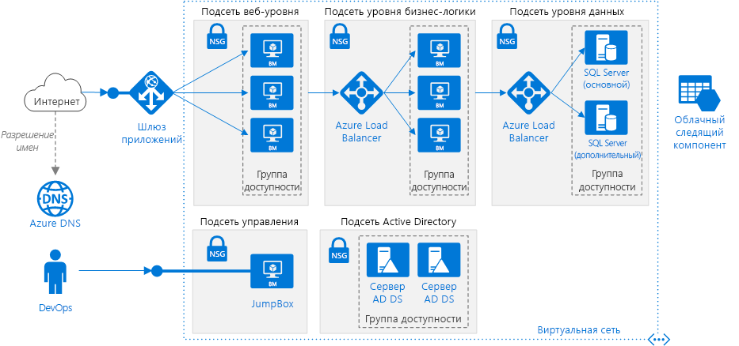

# <a name="windows-n-tier-application-on-azure-with-sql-server"></a>Использование n-уровневого приложения с SQL Server в Azure

На примере этой эталонной архитектуры показано, как развернуть виртуальные машины и виртуальную сеть, настроенные для n-уровневого приложения с помощью SQL Server на платформе Windows для уровня данных. [**Разверните это решение**](#deploy-the-solution).



*Скачайте [файл Visio][visio-download] этой архитектуры.*

## <a name="architecture"></a>Архитектура

Архитектура состоит из следующих компонентов.

- **Группа ресурсов**. [Группы ресурсов][resource-manager-overview] используются для группирования ресурсов по времени существования, владельцу и другим критериям для управления.

- **Виртуальная сеть и подсети**. Каждая виртуальная машина Azure развертывается в виртуальной сети, которую можно сегментировать на несколько подсетей. Создайте отдельные подсети для каждого уровня.

- **Шлюз приложений.** [Шлюз приложений](/azure/application-gateway/)— это подсистема балансировки нагрузки уровня 7. В этой архитектуре шлюз перенаправляет HTTP-запросы к внешнему веб-интерфейсу. Шлюз приложений также предоставляет [брандмауэр веб-приложения](/azure/application-gateway/waf-overview) (WAF), который защищает приложения от распространенных эксплойтов и уязвимостей.

- **Группы безопасности сети.** [Группы безопасности сети][nsg] (NSG) позволяют ограничить сетевой трафик в виртуальной сети. Например, в приведенной здесь трехуровневой архитектуре уровень базы данных не принимает трафик из веб-интерфейса, а только с бизнес-уровня и из подсети управления.

- **Защита от атак DDoS**. Хотя платформа Azure и обеспечивает основную защиту от распределенных атак отказа в обслуживании (DDoS), рекомендуется использовать [Защиту Azure от атак DDoS ценовой категории "Стандартный"][ddos] с расширенными функциями защиты от атак DDoS. См. раздел [Вопросы безопасности](#security-considerations) ниже.

- **Виртуальные машины**. Рекомендации по настройке виртуальных машин см. в руководствах по запуску виртуальных машин [Windows](./windows-vm.md) и [Linux](./linux-vm.md) в Azure.

- **Группы доступности**. Создайте [группу доступности][azure-availability-sets] для каждого уровня и по крайней мере две виртуальные машины на каждом из уровней, что позволит применить к этим виртуальным машинам [Соглашение об уровне обслуживания (SLA)][vm-sla] более высокого уровня.

- **Подсистемы балансировки нагрузки.** [Azure Load Balancer][load-balancer] позволяет распределять трафик с уровня Web на уровень Business, а также с уровня Business к SQL Server.

- **Общедоступный IP-адрес.** Общедоступный IP-адрес, через который приложение принимает интернет-трафик.

- **Jumpbox**. Он также называется [узлом-бастионом]. Безопасная виртуальная машина в сети, которую администраторы используют для подключения к другим виртуальным машинам. В jumpbox есть группа безопасности сети, обеспечивающая удаленный трафик только из общедоступных IP-адресов из списка надежных отправителей. NSG должна пропускать трафик с удаленного рабочего стола (RDP).

- **Группа доступности AlwaysOn SQL Server.** Обеспечивает высокий уровень доступности на уровне данных, включив репликацию и отработку отказа. Для отработки отказа используется технология отказоустойчивого кластера Windows Server (WSFC).

- **Серверы доменных служб Active Directory (AD DS).** Объекты-компьютеры для отказоустойчивого кластера и связанные с ним кластерные роли создаются в доменных службах Active Directory (AD DS).

- **Облачный ресурс-свидетель.** На отказоустойчивом кластере должны работать больше половины узлов. Это называется кворумом. Если в кластере только два узла, разделение сети может привести к тому, что каждый из узлов будет считаться главным. В этом случае требуется *ресурс-свидетель*, чтобы разорвать связи и создать кворум. Свидетель — это ресурс, например общий диск, который может использоваться в качестве средства разбиения связей для установления кворума. Облачный ресурс-свидетель — тип ресурса-свидетеля, в котором используется хранилище BLOB-объектов Azure. Дополнительные сведения о концепции кворума см. в статье, посвященной [кворуму кластера и кворуму пула](/windows-server/storage/storage-spaces/understand-quorum). Дополнительные сведения об облачном ресурсе-свидетеле см. в статье, посвященной [развертыванию облачного ресурса-свидетеля для отказоустойчивого кластера](/windows-server/failover-clustering/deploy-cloud-witness).

- **Azure DNS**. [Azure DNS][azure-dns] — это служба размещения для доменов DNS. Она осуществляет разрешение имен на базе инфраструктуры Microsoft Azure. Размещая домены в Azure, вы можете управлять своими записями DNS с помощью тех же учетных данных, API и инструментов и оплачивать использование, как и другие службы Azure.

## <a name="recommendations"></a>Рекомендации

Описанная здесь архитектура может не соответствовать вашим требованиям. Воспользуйтесь этими рекомендациями в качестве отправной точки.

### <a name="vnet--subnets"></a>Виртуальная сеть и подсети

При создании виртуальной сети определите, сколько IP-адресов требуется для ресурсов в каждой подсети. Укажите маску подсети и достаточно большой диапазон адресов виртуальной сети для требуемых IP-адресов с помощью нотации [CIDR]. Используйте адресное пространство, которое входит в диапазон стандартных [блоков частных IP-адресов][private-ip-space], например 10.0.0.0/8, 172.16.0.0/12 и 192.168.0.0/16.

Выберите диапазон адресов, который не перекрывает локальную сеть, если вам нужно позже настроить шлюз между виртуальной сетью и локальной сетью. Создав виртуальную сеть, изменить диапазон адресов нельзя.

Проектируйте подсети с учетом требований к функциональности и безопасности. Все виртуальные машины в пределах одного уровня или одной роли должны входить в одну и ту же подсеть, которая может быть надежным периметром безопасности. Дополнительные сведения о проектировании виртуальных сетей и подсетей см. в статье [Планирование и проектирование виртуальных сетей Azure][plan-network].

### <a name="load-balancers"></a>Балансировщики нагрузки

Не подключайте виртуальные машины напрямую к Интернету. Вместо этого предоставьте каждой из них частный IP-адрес. Клиент подключается через общедоступный IP-адрес, связанный со Шлюзом приложений.

Определите правила подсистемы балансировки нагрузки для направления трафика к виртуальным машинам. Например, чтобы включить трафик HTTP, сопоставьте порт 80 интерфейсной конфигурации с портом 80 серверного пула адресов. Когда клиент отправляет HTTP-запрос на порт 80, подсистема балансировки нагрузки выбирает IP-адрес серверной части с помощью [хэш-алгоритма][load-balancer-hashing], который включает исходный IP-адрес. Клиентские запросы распределяются между всеми виртуальными машинами в серверном пуле адресов.

### <a name="network-security-groups"></a>Группы безопасности сети

С помощью правил NSG можно ограничить трафик между уровнями. В показанной выше трехуровневой архитектуре веб-уровень не взаимодействует напрямую с уровнем базы данных. Чтобы обеспечить эту возможность, уровень базы данных должен блокировать входящий трафик из подсети веб-уровня.

1. Запретите весь входящий трафик от виртуальной сети. (В правиле используйте тег `VIRTUAL_NETWORK`.)
2. Разрешите входящий трафик из подсети бизнес-уровня.
3. Разрешите входящий трафик из самой подсети уровня базы данных. Это правило обеспечивает взаимодействие между виртуальными машинами баз данных, которое необходимо для репликации и отработки отказа базы данных.
4. Разрешите трафик RDP (порт 3389) из подсети jumpbox. Это правило позволяет администраторам подключаться к уровню базы данных из jumpbox.

Создайте правила 2 и 4 с более высоким приоритетом, чем у правила 1, чтобы они переопределяли его.

### <a name="sql-server-always-on-availability-groups"></a>Группы доступности AlwaysOn SQL Server

Мы рекомендуем использовать [группы доступности AlwaysOn][sql-alwayson] для обеспечения высокого уровня доступности SQL Server. До Windows Server 2016 для групп доступности Always On требовался контроллер домена, а все узлы в группе доступности должны были находиться в одном домене AD.

Другие уровни подключаются к базе данных с помощью [прослушивателя групп доступности][sql-alwayson-listeners]. Прослушиватель позволяет клиенту SQL подключаться, не зная имени физического экземпляра SQL Server. Виртуальные машины, которые обращаются к базе данных, должны быть присоединены к домену. Клиент (в этом случае другой уровень) использует DNS для разрешения имени виртуальной сети прослушивателя в IP-адресах.

Настройте группы доступности AlwaysOn SQL Server следующим образом:

1. Создайте кластер отказоустойчивой кластеризации Windows Server, группу доступности AlwaysOn SQL Server и первичную реплику. Дополнительные сведения см. в статье [Начало работы с группами доступности AlwaysOn (SQL Server)][sql-alwayson-getting-started].
2. Создайте внутреннюю подсистему балансировки нагрузки со статическим частным IP-адресом.
3. Создайте прослушиватель группы доступности и сопоставьте его DNS-имя с IP-адресом внутренней подсистемы балансировки нагрузки.
4. Создайте правило подсистемы балансировки нагрузки для порта прослушивания SQL Server (по умолчанию используется TCP-порт 1433). Правило подсистемы балансировки нагрузки должно включать *плавающий IP-адрес*, также называемый прямым ответом от сервера. В результате виртуальная машина будет отправлять ответ клиенту напрямую, что позволяет использовать прямое соединение с первичной репликой.

   > [!NOTE]
   > Если плавающий IP-адрес включен, номер внешнего порта должен совпадать с номером внутреннего порта в правиле подсистемы балансировки нагрузки.
   >

Если клиент SQL пытается выполнить подключение, подсистема балансировки нагрузки направляет запрос на подключение в первичную реплику. Если происходит отработка отказа с переходом на другую реплику, подсистема балансировки нагрузки автоматически направляет новые запросы в новую первичную реплику. Дополнительные сведения см. в статье [Настройка подсистемы балансировки нагрузки для группы доступности AlwaysOn в Azure][sql-alwayson-ilb].

Во время отработки отказа имеющиеся клиентские подключения закрыты. После отработки отказа новые соединения направляются в новую первичную реплику.

Если приложение выполняет значительно больше операций чтения, чем записи, вы можете разгрузить некоторые запросы только для чтения во вторичную реплику. Ознакомьтесь с разделом [Соединение с помощью прослушивателя со вторичной репликой только для чтения (маршрутизация только для чтения)][sql-alwayson-read-only-routing].

Протестируйте развертывание, [принудительно выполнив отработку отказа][sql-alwayson-force-failover] группы доступности вручную.

### <a name="jumpbox"></a>Jumpbox

Запретите доступ по протоколу RDP из общедоступного Интернета к виртуальным машинам, которые выполняют рабочую нагрузку приложения. Вместо этого все доступы по протоколу RDP к этим виртуальным машинам должны проходить через jumpbox. Администратор выполняет вход в jumpbox, а затем вход в другую виртуальную машину из jumpbox. jumpbox разрешает RDP трафик из Интернета, однако только из известных и безопасных IP-адресов.

Jumpbox имеет минимальные требования к производительности, поэтому выберите небольшой размер виртуальной машины. Создайте [общедоступный IP-адрес] для jumpbox. Поместите jumpbox в виртуальную сеть вместе с другими виртуальными машинами, однако в отдельную подсеть управления.

Чтобы защитить jumpbox, добавьте правило NSG, разрешающее подключения по протоколу RDP только из безопасного набора общедоступных IP-адресов. Настройте NSG для других подсетей, чтобы разрешить трафик RDP из подсети управления.

## <a name="scalability-considerations"></a>Вопросы масштабируемости

Рассмотрите возможность использования [масштабируемых наборов виртуальных машин][vmss] для веб-уровня и бизнес-уровня, вместо развертывания отдельных виртуальных машин в группе доступности. Масштабируемый набор упрощает процессы развертывания и администрирования набора идентичных виртуальных машин, а также автоматического масштабирования виртуальных машин на основе метрик производительности. По мере увеличения нагрузки на виртуальные машины в подсистему балансировки нагрузки автоматически добавляются дополнительные виртуальные машины. Подумайте об использовании масштабируемых наборов, если необходимо быстро развернуть виртуальные машины или выполнить автомасштабирование.

Настройку виртуальных машин, развернутых в масштабируемый набор, можно выполнить двумя основными способами:

- Используйте расширения для настройки виртуальной машины после ее развертывания. В этом случае новые экземпляры виртуальной машины могут дольше запускаться, чем виртуальные машины без расширений.

- Развернуть [управляемый диск](/azure/storage/storage-managed-disks-overview) с помощью пользовательского образа диска. При этом развертывание выполняется быстрее. Но образ необходимо обновлять.

Дополнительные сведения см. в статье [Рекомендации по проектированию масштабируемых наборов][vmss-design].

> [!TIP]
> При использовании любого решения автоматического масштабирования заблаговременно протестируйте его с рабочими нагрузками производственного уровня.

В каждой подписке Azure настроены ограничения по умолчанию, включая максимальное количество виртуальных машин в каждом регионе. Их лимит можно увеличить, создав запрос на поддержку. Дополнительные сведения см. в статье [Подписка Azure, границы, квоты и ограничения службы][subscription-limits].

## <a name="availability-considerations"></a>Вопросы доступности

Если вы не используете масштабируемые наборы виртуальных машин, разместите виртуальные машины для одного уровня в группе доступности. Создайте по крайней мере две виртуальные машины в группе доступности для реализации [соглашения об уровне обслуживания, гарантирующем доступность виртуальных машин Azure][vm-sla]. Дополнительные сведения см. в статье [Управление доступностью виртуальных машин Windows в Azure][availability-set]. Масштабируемые наборы автоматически используют *группы размещения*, которые функционируют как неявная группа доступности.

Подсистема балансировки нагрузки выполняет [проверку работоспособности][health-probes], чтобы отслеживать доступность экземпляров виртуальных машин. Если пробу не удается выполнить в экземпляре в течение определенного времени, подсистема балансировки нагрузки останавливает отправку трафика на эту виртуальную машину. Тем не менее подсистема балансировки нагрузки продолжит выполнять проверку, и если виртуальная машина станет снова доступна, отправка трафика к этой виртуальной машине будет возобновлена.

Вот несколько рекомендаций по проверке работоспособности подсистемы балансировки нагрузки:

- При проверке может тестироваться HTTP или TCP. Если на виртуальных машинах запущен HTTP-сервер, создайте проверку HTTP. В противном случае создайте проверку TCP.
- В проверке HTTP укажите путь к конечной точке HTTP. При этом проверяется код ответа HTTP 200 с этого пути. Этим путем может быть путь к корневому каталогу (/) или конечная точка мониторинга работоспособности, которая реализует определенную пользовательскую логику для проверки работоспособности приложения. Конечная точка должна разрешать анонимные HTTP-запросы.
- Проверка отправляется с [известного][health-probe-ip] IP-адреса — 168.63.129.16. Не блокируйте входящий и исходящий трафик для этого IP-адреса в политиках брандмауэра или правилах группы безопасности сети.
- Используйте [журналы проверки работоспособности][health-probe-log] для просмотра состояния проверки работоспособности. Включите ведение журнала на портале Azure для каждой подсистемы балансировки нагрузки. Журналы записываются в хранилище BLOB-объектов Azure. В журналах показано, сколько виртуальных машин не получают сетевой трафик из-за ответов о неудачной попытке пробы.

Если требуется более высокий уровень доступности, чем обеспечивает [соглашение об уровне обслуживания Azure для виртуальных машин][vm-sla], реплицируйте приложение в два региона, используя диспетчер трафика Azure для отработки отказа. Дополнительные сведения см. в статье [Высокодоступное N-уровневое приложение с поддержкой нескольких регионов][multi-dc].

## <a name="security-considerations"></a>Вопросы безопасности

Виртуальные сети являются границей, изолирующей трафик в Azure. Виртуальные машины из разных виртуальных сетей не могут напрямую обмениваться данными. Виртуальные машины в одной виртуальной сети могут обмениваться данными, если только не созданы [группы безопасности сети][nsg], ограничивающие этот трафик. Дополнительные сведения см. в статье [Облачные службы Microsoft Cloud и сетевая безопасность][network-security].

**DMZ**. Попробуйте добавить сетевой виртуальный модуль (NVA), чтобы создать сеть периметра между Интернетом и виртуальною сетью Azure. Сетевой виртуальный модуль — это универсальный термин для виртуального модуля, который может выполнять сетевые задачи, например брандмауэра, проверки пакетов, аудита и пользовательской маршрутизации. Дополнительные сведения см. в статье [Сеть периметра между Azure и Интернетом][dmz].

**Шифрование**. Выполните шифрование конфиденциальных неактивных данных и используйте [Azure Key Vault][azure-key-vault] для управления ключами шифрования базы данных. Key Vault может хранить ключи шифрования в аппаратных модулях безопасности. Дополнительные сведения см. в статье [Настройка интеграции Azure Key Vault для SQL Server на виртуальных машинах Azure (Resource Manager)][sql-keyvault]. В Key Vault также рекомендуется хранить секреты приложения, например строки подключения к базе данных.

**Защита от атак DDoS.** Платформа Azure по умолчанию предоставляет основные средства защиты от атак DDoS. Эти основные средства защиты предназначены для защиты всей инфраструктуры Azure. Хотя базовая защита от атак DDoS включается автоматически, рекомендуется использовать [Защиту Azure от атак DDoS ценовой категории "Стандартный"][ddos]. Для ценовой категории "Стандартный" предусмотрена адаптивная настройка для обнаружения угроз на основе моделей сетевого трафика вашего приложения. Это позволяет устранять риски атак DDoS, которые могут остаться незамеченными для соответствующих политик уровня инфраструктуры. Для этой ценовой категории также включена поддержка оповещений, телеметрии и аналитики на основе Azure Monitor. Дополнительные сведения см. в руководстве по [использованию Защиты от атак DDoS Azure с рекомендациями и эталонной архитектурой][ddos-best-practices].

## <a name="deploy-the-solution"></a>Развертывание решения

Пример развертывания для этой архитектуры можно найти на портале [GitHub][github-folder]. Вся процедура развертывания, включая выполнение скриптов для настройки AD DS, развертывание отказоустойчивого кластера Windows Server и группы доступности SQL Server, может занять до двух часов.

### <a name="prerequisites"></a>Предварительные требования

[!INCLUDE [ref-arch-prerequisites.md](../../../includes/ref-arch-prerequisites.md)]

### <a name="deployment-steps"></a>Шаги по развертыванию

1. Выполните следующую команду, чтобы создать группу ресурсов.

    ```azurecli
    az group create --location <location> --name <resource-group-name>
    ```

2. Выполните следующую команду, чтобы создать учетную запись хранения для облачного ресурса-свидетеля.

    ```azurecli
    az storage account create --location <location> \
      --name <storage-account-name> \
      --resource-group <resource-group-name> \
      --sku Standard_LRS
    ```

3. Перейдите в папку `virtual-machines\n-tier-windows` в репозитории эталонных архитектур на сайте GitHub.

4. Откройте файл `n-tier-windows.json` .

5. С помощью поиска найдите все вхождения "witnessStorageBlobEndPoint" и замените текст заполнителя именем учетной записи хранения, созданным на шаге 2.

    ```json
    "witnessStorageBlobEndPoint": "https://[replace-with-storageaccountname].blob.core.windows.net",
    ```

6. Выполните следующую команду, чтобы вывести список ключей учетной записи хранения.

    ```azurecli
    az storage account keys list \
      --account-name <storage-account-name> \
      --resource-group <resource-group-name>
    ```

    Полученный результат должен выглядеть примерно так: Скопируйте значение `key1`.

    ```json
    [
    {
        "keyName": "key1",
        "permissions": "Full",
        "value": "..."
    },
    {
        "keyName": "key2",
        "permissions": "Full",
        "value": "..."
    }
    ]
    ```

7. В файле `n-tier-windows.json` найдите все вхождения "witnessStorageAccountKey" и вставьте ключ учетной записи.

    ```json
    "witnessStorageAccountKey": "[replace-with-storagekey]"
    ```

8. В файле `n-tier-windows.json` найдите все вхождения `[replace-with-password]` и `[replace-with-sql-password]`. Замените их надежным паролем. Сохраните файл.

    > [!NOTE]
    > Если вы измените имя администратора, необходимо также обновить блоки `extensions` в файле JSON.

9. Выполните следующую команду, чтобы развернуть архитектуру.

    ```azurecli
    azbb -s <your subscription_id> -g <resource_group_name> -l <location> -p n-tier-windows.json --deploy
    ```

Дополнительные сведения о развертывании этого примера эталонной архитектуры с использованием стандартных блоков Azure см. в [нашем репозитории GitHub][git].

<!-- links -->
[dmz]: ../dmz/secure-vnet-dmz.md
[multi-dc]: multi-region-sql-server.md
[n-tier]: n-tier.md
[azure-availability-sets]: /azure/virtual-machines/virtual-machines-windows-manage-availability#configure-each-application-tier-into-separate-availability-sets
[azure-dns]: /azure/dns/dns-overview
[azure-key-vault]: https://azure.microsoft.com/services/key-vault
[узлом-бастионом]: https://en.wikipedia.org/wiki/Bastion_host
[CIDR]: https://en.wikipedia.org/wiki/Classless_Inter-Domain_Routing
[ddos]: /azure/virtual-network/ddos-protection-overview
[ddos-best-practices]: /azure/security/azure-ddos-best-practices
[git]: https://github.com/mspnp/template-building-blocks
[github-folder]: https://github.com/mspnp/reference-architectures/tree/master/virtual-machines/n-tier-windows
[nsg]: /azure/virtual-network/virtual-networks-nsg
[plan-network]: /azure/virtual-network/virtual-network-vnet-plan-design-arm
[private-ip-space]: https://en.wikipedia.org/wiki/Private_network#Private_IPv4_address_spaces
[Общедоступный IP-адрес]: /azure/virtual-network/virtual-network-ip-addresses-overview-arm
[sql-alwayson]: https://msdn.microsoft.com/library/hh510230.aspx
[sql-alwayson-force-failover]: https://msdn.microsoft.com/library/ff877957.aspx
[sql-alwayson-getting-started]: https://msdn.microsoft.com/library/gg509118.aspx
[sql-alwayson-ilb]: /azure/virtual-machines/windows/sql/virtual-machines-windows-portal-sql-alwayson-int-listener
[sql-alwayson-listeners]: https://msdn.microsoft.com/library/hh213417.aspx
[sql-alwayson-read-only-routing]: https://technet.microsoft.com/library/hh213417.aspx#ConnectToSecondary
[sql-keyvault]: /azure/virtual-machines/virtual-machines-windows-ps-sql-keyvault
[vm-sla]: https://azure.microsoft.com/support/legal/sla/virtual-machines
[vnet faq]: /azure/virtual-network/virtual-networks-faq
[wsfc-whats-new]: https://technet.microsoft.com/windows-server-docs/failover-clustering/whats-new-in-failover-clustering
[visio-download]: https://archcenter.blob.core.windows.net/cdn/vm-reference-architectures.vsdx
[resource-manager-overview]: /azure/azure-resource-manager/resource-group-overview
[vmss]: /azure/virtual-machine-scale-sets/virtual-machine-scale-sets-overview
[load-balancer]: /azure/load-balancer/
[load-balancer-hashing]: /azure/load-balancer/load-balancer-overview#load-balancer-features
[vmss-design]: /azure/virtual-machine-scale-sets/virtual-machine-scale-sets-design-overview
[subscription-limits]: /azure/azure-subscription-service-limits
[availability-set]: /azure/virtual-machines/virtual-machines-windows-manage-availability
[health-probes]: /azure/load-balancer/load-balancer-overview#load-balancer-features
[health-probe-log]: /azure/load-balancer/load-balancer-monitor-log
[health-probe-ip]: /azure/virtual-network/virtual-networks-nsg#special-rules
[network-security]: /azure/best-practices-network-security
