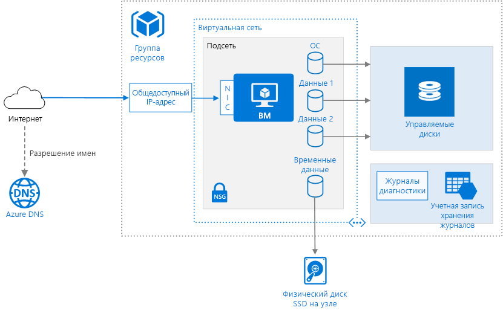

# <a name="run-a-windows-virtual-machine-on-azure"></a><span data-ttu-id="be3fb-103">Запуск виртуальной машины Windows в Azure</span><span class="sxs-lookup"><span data-stu-id="be3fb-103">Run a Windows virtual machine on Azure</span></span>

<span data-ttu-id="be3fb-104">Для подготовки к работе виртуальной машины в Azure, помимо самой виртуальной машины, требуются некоторые дополнительные компоненты, такие как сеть и хранилище ресурсов.</span><span class="sxs-lookup"><span data-stu-id="be3fb-104">Provisioning a virtual machine (VM) in Azure requires some additional components besides the VM itself, including networking and storage resources.</span></span> <span data-ttu-id="be3fb-105">Рекомендации по запуску виртуальных машин Windows в Azure.</span><span class="sxs-lookup"><span data-stu-id="be3fb-105">This article shows best practices for running a Windows VM on Azure.</span></span>



## <a name="resource-group"></a><span data-ttu-id="be3fb-107">Группа ресурсов</span><span class="sxs-lookup"><span data-stu-id="be3fb-107">Resource group</span></span>

<span data-ttu-id="be3fb-108">[Группа ресурсов][resource-manager-overview] представляет собой логический контейнер, содержащий связанные ресурсы Azure.</span><span class="sxs-lookup"><span data-stu-id="be3fb-108">A [resource group][resource-manager-overview] is a logical container that holds related Azure resources.</span></span> <span data-ttu-id="be3fb-109">Как правило, группы ресурсов создаются в зависимости от времени существования ресурсов и пользователя, который ими управляет.</span><span class="sxs-lookup"><span data-stu-id="be3fb-109">In general, group resources based on their lifetime and who will manage them.</span></span>

<span data-ttu-id="be3fb-110">Поместите тесно связанные ресурсы с одинаковым жизненным циклом в одну [группу ресурсов][resource-manager-overview].</span><span class="sxs-lookup"><span data-stu-id="be3fb-110">Put closely associated resources that share the same lifecycle into the same [resource group][resource-manager-overview].</span></span> <span data-ttu-id="be3fb-111">Группы ресурсов позволяют развертывать и отслеживать несколько ресурсов как одну группу, для которой, помимо прочего, можно отслеживать выставляемые счета.</span><span class="sxs-lookup"><span data-stu-id="be3fb-111">Resource groups allow you to deploy and monitor resources as a group and track billing costs by resource group.</span></span> <span data-ttu-id="be3fb-112">Можно также удалить ресурсы в виде набора, что очень удобно для тестирования развернутых служб.</span><span class="sxs-lookup"><span data-stu-id="be3fb-112">You can also delete resources as a set, which is very useful for test deployments.</span></span> <span data-ttu-id="be3fb-113">Присвойте понятные имена ресурсам, чтобы упростить поиск определенного ресурса и получить сведения о его роли.</span><span class="sxs-lookup"><span data-stu-id="be3fb-113">Assign meaningful resource names to simplify locating a specific resource and understanding its role.</span></span> <span data-ttu-id="be3fb-114">Дополнительные сведения см. в руководстве по [рекомендуемым соглашениям об именовании ресурсов Azure][naming-conventions].</span><span class="sxs-lookup"><span data-stu-id="be3fb-114">For more information, see [Recommended Naming Conventions for Azure Resources][naming-conventions].</span></span>

## <a name="virtual-machine"></a><span data-ttu-id="be3fb-115">Виртуальная машина.</span><span class="sxs-lookup"><span data-stu-id="be3fb-115">Virtual machine</span></span>

<span data-ttu-id="be3fb-116">Виртуальную машину можно подготовить на основе списка опубликованных образов, пользовательского управляемого образа или файла виртуального жесткого диска (VHD), передав его в хранилище BLOB-объектов Azure.</span><span class="sxs-lookup"><span data-stu-id="be3fb-116">You can provision a VM from a list of published images, or from a custom managed image or virtual hard disk (VHD) file uploaded to Azure Blob storage.</span></span>

<span data-ttu-id="be3fb-117">В Azure доступны виртуальные машины разных размеров.</span><span class="sxs-lookup"><span data-stu-id="be3fb-117">Azure offers many different virtual machine sizes.</span></span> <span data-ttu-id="be3fb-118">Дополнительные сведения см. в статье [Размеры виртуальных машин Windows в Azure][virtual-machine-sizes].</span><span class="sxs-lookup"><span data-stu-id="be3fb-118">For more information, see [Sizes for virtual machines in Azure][virtual-machine-sizes].</span></span> <span data-ttu-id="be3fb-119">При перемещении имеющейся рабочей нагрузки в Azure выберите начальный размер виртуальной машины, который точнее всего соответствует характеристикам локальных серверов.</span><span class="sxs-lookup"><span data-stu-id="be3fb-119">If you are moving an existing workload to Azure, start with the VM size that's the closest match to your on-premises servers.</span></span> <span data-ttu-id="be3fb-120">Затем измерьте производительность фактической рабочей нагрузки по таким показателям, как потребление ЦП, памяти и дисковых операций ввода-вывода в секунду, и при необходимости измените размер.</span><span class="sxs-lookup"><span data-stu-id="be3fb-120">Then measure the performance of your actual workload in terms of CPU, memory, and disk input/output operations per second (IOPS), and adjust the size as needed.</span></span>

<span data-ttu-id="be3fb-121">Обычно следует выбирать регион Azure, расположенный как можно ближе к внутренним пользователям или клиентам.</span><span class="sxs-lookup"><span data-stu-id="be3fb-121">Generally, choose an Azure region that is closest to your internal users or customers.</span></span> <span data-ttu-id="be3fb-122">Не во всех регионах доступны виртуальные машины всех размеров.</span><span class="sxs-lookup"><span data-stu-id="be3fb-122">Not all VM sizes are available in all regions.</span></span> <span data-ttu-id="be3fb-123">См. дополнительные сведения о [доступности служб в разных регионах][services-by-region].</span><span class="sxs-lookup"><span data-stu-id="be3fb-123">For more information, see [Services by region][services-by-region].</span></span> <span data-ttu-id="be3fb-124">Чтобы получить список размеров виртуальных машин, доступных в определенном регионе, выполните следующую команду в интерфейсе командной строки Azure:</span><span class="sxs-lookup"><span data-stu-id="be3fb-124">For a list of the VM sizes available in a specific region, run the following command from the Azure command-line interface (CLI):</span></span>

```azurecli
az vm list-sizes --location <location>
```

<span data-ttu-id="be3fb-125">Дополнительные сведения о том, как выбрать опубликованный образ виртуальной машины, см. в руководстве по [поиску образов виртуальных машин Windows][select-vm-image].</span><span class="sxs-lookup"><span data-stu-id="be3fb-125">For information about choosing a published VM image, see [Find Windows VM images][select-vm-image].</span></span>

## <a name="disks"></a><span data-ttu-id="be3fb-126">диски;</span><span class="sxs-lookup"><span data-stu-id="be3fb-126">Disks</span></span>

<span data-ttu-id="be3fb-127">Чтобы обеспечить оптимальную производительность дисковых операций ввода-вывода, рекомендуем использовать [хранилище класса Premium][premium-storage], в котором данные хранятся на твердотельных накопителях (SSD).</span><span class="sxs-lookup"><span data-stu-id="be3fb-127">For best disk I/O performance, we recommend [Premium Storage][premium-storage], which stores data on solid-state drives (SSDs).</span></span> <span data-ttu-id="be3fb-128">Цена зависит от производительности подготовленного диска.</span><span class="sxs-lookup"><span data-stu-id="be3fb-128">Cost is based on the capacity of the provisioned disk.</span></span> <span data-ttu-id="be3fb-129">Скорость выполнения операций ввода-вывода и пропускная способность также зависят от размера диска. Поэтому во время подготовки диска следует учитывать все эти факторы.</span><span class="sxs-lookup"><span data-stu-id="be3fb-129">IOPS and throughput also depend on disk size, so when you provision a disk, consider all three factors (capacity, IOPS, and throughput).</span></span>

<span data-ttu-id="be3fb-130">Мы также рекомендуем использовать [Управляемые диски][managed-disks].</span><span class="sxs-lookup"><span data-stu-id="be3fb-130">We also recommend using [Managed Disks][managed-disks].</span></span> <span data-ttu-id="be3fb-131">Благодаря автоматической обработке хранилища управляемые диски упрощают процесс управления дисками.</span><span class="sxs-lookup"><span data-stu-id="be3fb-131">Managed disks simplify disk management by handling the storage for you.</span></span> <span data-ttu-id="be3fb-132">Управляемым дискам не требуется учетная запись хранения.</span><span class="sxs-lookup"><span data-stu-id="be3fb-132">Managed disks do not require a storage account.</span></span> <span data-ttu-id="be3fb-133">Просто укажите размер и тип диска, и он будет развернут как высокодоступный ресурс.</span><span class="sxs-lookup"><span data-stu-id="be3fb-133">You simply specify the size and type of disk and it is deployed as a highly available resource</span></span>

<span data-ttu-id="be3fb-134">Диск операционной системы — это диск VHD, расположенный в [службе хранилища Azure][azure-storage], поэтому он работает, даже если хост-компьютер отключен.</span><span class="sxs-lookup"><span data-stu-id="be3fb-134">The OS disk is a VHD stored in [Azure Storage][azure-storage], so it persists even when the host machine is down.</span></span> <span data-ttu-id="be3fb-135">Кроме того, рекомендуем создать один или несколько [дисков данных][data-disk] на постоянных виртуальных жестких дисках, которые используются для данных приложений.</span><span class="sxs-lookup"><span data-stu-id="be3fb-135">We also recommend creating one or more [data disks][data-disk], which are persistent VHDs used for application data.</span></span> <span data-ttu-id="be3fb-136">Если это возможно, устанавливайте приложения на диск данных, а не на диск операционной системы.</span><span class="sxs-lookup"><span data-stu-id="be3fb-136">When possible, install applications on a data disk, not the OS disk.</span></span> <span data-ttu-id="be3fb-137">Для работы некоторых устаревших приложений может потребоваться установить компоненты на диске С. В этом случае вы можете [изменить размер диска ОС][resize-os-disk], используя PowerShell.</span><span class="sxs-lookup"><span data-stu-id="be3fb-137">Some legacy applications might need to install components on the C: drive; in that case, you can [resize the OS disk][resize-os-disk] using PowerShell.</span></span>

<span data-ttu-id="be3fb-138">Виртуальная машина создается с временным диском (в Windows это диск `D:`).</span><span class="sxs-lookup"><span data-stu-id="be3fb-138">The VM is also created with a temporary disk (the `D:` drive on Windows).</span></span> <span data-ttu-id="be3fb-139">Временный диск хранится на физическом диске хост-компьютера.</span><span class="sxs-lookup"><span data-stu-id="be3fb-139">This disk is stored on a physical drive on the host machine.</span></span> <span data-ttu-id="be3fb-140">Он *не* хранится в службе хранилища Azure и может быть удален во время перезагрузки и других событий жизненного цикла виртуальной машины.</span><span class="sxs-lookup"><span data-stu-id="be3fb-140">It is *not* saved in Azure Storage and may be deleted during reboots and other VM lifecycle events.</span></span> <span data-ttu-id="be3fb-141">Используйте этот диск только для временных данных, таких как данные страниц или файлы подкачки.</span><span class="sxs-lookup"><span data-stu-id="be3fb-141">Use this disk only for temporary data, such as page or swap files.</span></span>

## <a name="network"></a><span data-ttu-id="be3fb-142">Сеть</span><span class="sxs-lookup"><span data-stu-id="be3fb-142">Network</span></span>

<span data-ttu-id="be3fb-143">Сетевые компоненты включают приведенные ниже ресурсы.</span><span class="sxs-lookup"><span data-stu-id="be3fb-143">The networking components include the following resources:</span></span>

- <span data-ttu-id="be3fb-144">**Виртуальная сеть**.</span><span class="sxs-lookup"><span data-stu-id="be3fb-144">**Virtual network**.</span></span> <span data-ttu-id="be3fb-145">Каждая виртуальная машина развертывается в виртуальной сети, которую можно разделить на несколько подсетей.</span><span class="sxs-lookup"><span data-stu-id="be3fb-145">Every VM is deployed into a virtual network that can be segmented into multiple subnets.</span></span>

- <span data-ttu-id="be3fb-146">**Сетевой интерфейс (сетевой адаптер)**.</span><span class="sxs-lookup"><span data-stu-id="be3fb-146">**Network interface (NIC)**.</span></span> <span data-ttu-id="be3fb-147">Сетевой адаптер обеспечивает взаимодействие виртуальной машины и виртуальной сети.</span><span class="sxs-lookup"><span data-stu-id="be3fb-147">The NIC enables the VM to communicate with the virtual network.</span></span> <span data-ttu-id="be3fb-148">Если для виртуальной машины требуется несколько сетевых адаптеров, помните, что их максимально возможное число зависит от [размера каждой виртуальной машины][vm-size-tables].</span><span class="sxs-lookup"><span data-stu-id="be3fb-148">If you need multiple NICs for your VM, be aware that a maximum number of NICs is defined for each [VM size][vm-size-tables].</span></span>

- <span data-ttu-id="be3fb-149">**Общедоступный IP-адрес.**</span><span class="sxs-lookup"><span data-stu-id="be3fb-149">**Public IP address**.</span></span> <span data-ttu-id="be3fb-150">Общедоступный IP-адрес используется для обмена данными с виртуальной машиной&mdash;. Например, через удаленный рабочий стол.</span><span class="sxs-lookup"><span data-stu-id="be3fb-150">A public IP address is needed to communicate with the VM &mdash; for example, via remote desktop (RDP).</span></span> <span data-ttu-id="be3fb-151">Общедоступный IP-адрес может быть динамическим или статическим.</span><span class="sxs-lookup"><span data-stu-id="be3fb-151">The public IP address can be dynamic or static.</span></span> <span data-ttu-id="be3fb-152">По умолчанию используется динамический IP-адрес.</span><span class="sxs-lookup"><span data-stu-id="be3fb-152">The default is dynamic.</span></span>

- <span data-ttu-id="be3fb-153">Зарезервируйте [статический IP-адрес][static-ip], если вам нужен постоянный IP-адрес, например, для создания записи типа А в DNS или добавления IP-адреса в список надежных адресов.</span><span class="sxs-lookup"><span data-stu-id="be3fb-153">Reserve a [static IP address][static-ip] if you need a fixed IP address that won't change &mdash; for example, if you need to create a DNS 'A' record or add the IP address to a safe list.</span></span>
- <span data-ttu-id="be3fb-154">Можно также создать полное доменное имя для IP-адреса.</span><span class="sxs-lookup"><span data-stu-id="be3fb-154">You can also create a fully qualified domain name (FQDN) for the IP address.</span></span> <span data-ttu-id="be3fb-155">Затем вы сможете зарегистрировать в DNS [запись CNAME][cname-record], которая указывает на полное доменное имя.</span><span class="sxs-lookup"><span data-stu-id="be3fb-155">You can then register a [CNAME record][cname-record] in DNS that points to the FQDN.</span></span> <span data-ttu-id="be3fb-156">Дополнительные сведения см. в руководстве по [созданию полного доменного имени на портале Azure][fqdn].</span><span class="sxs-lookup"><span data-stu-id="be3fb-156">For more information, see [Create a fully qualified domain name in the Azure portal][fqdn].</span></span>

- <span data-ttu-id="be3fb-157">**Группа безопасности сети**.</span><span class="sxs-lookup"><span data-stu-id="be3fb-157">**Network security group (NSG)**.</span></span> <span data-ttu-id="be3fb-158">[Группы безопасности сети][nsg] позволяют разрешать или запрещать сетевой трафик к виртуальным машинам.</span><span class="sxs-lookup"><span data-stu-id="be3fb-158">[Network security groups][nsg] are used to allow or deny network traffic to VMs.</span></span> <span data-ttu-id="be3fb-159">Группы безопасности сети могут быть связаны с подсетями или отдельными экземплярами виртуальных машин.</span><span class="sxs-lookup"><span data-stu-id="be3fb-159">NSGs can be associated either with subnets or with individual VM instances.</span></span>

<span data-ttu-id="be3fb-160">Все группы безопасности сети содержат набор [правил по умолчанию][nsg-default-rules], включая правило, которое блокирует весь входящий интернет-трафик.</span><span class="sxs-lookup"><span data-stu-id="be3fb-160">All NSGs contain a set of [default rules][nsg-default-rules], including a rule that blocks all inbound Internet traffic.</span></span> <span data-ttu-id="be3fb-161">Правила по умолчанию нельзя удалить, но их можно переопределить другими правилами.</span><span class="sxs-lookup"><span data-stu-id="be3fb-161">The default rules cannot be deleted, but other rules can override them.</span></span> <span data-ttu-id="be3fb-162">Чтобы разрешить интернет-трафик, создайте правила, разрешающие входящий трафик для определенных портов &mdash; например, это может быть порт 80 для протокола HTTP.</span><span class="sxs-lookup"><span data-stu-id="be3fb-162">To enable Internet traffic, create rules that allow inbound traffic to specific ports &mdash; for example, port 80 for HTTP.</span></span> <span data-ttu-id="be3fb-163">Чтобы включить доступ по протоколу RDP, добавьте правило группы безопасности сети, которое разрешает входящий трафик через TCP-порт 3389.</span><span class="sxs-lookup"><span data-stu-id="be3fb-163">To enable RDP, add an NSG rule that allows inbound traffic to TCP port 3389.</span></span>

## <a name="operations"></a><span data-ttu-id="be3fb-164">Операции</span><span class="sxs-lookup"><span data-stu-id="be3fb-164">Operations</span></span>

<span data-ttu-id="be3fb-165">**Диагностика.**</span><span class="sxs-lookup"><span data-stu-id="be3fb-165">**Diagnostics**.</span></span> <span data-ttu-id="be3fb-166">Включите мониторинг и диагностику, в том числе базовые метрики работоспособности, а также ведение журналов инфраструктуры диагностики и [диагностику загрузки][boot-diagnostics].</span><span class="sxs-lookup"><span data-stu-id="be3fb-166">Enable monitoring and diagnostics, including basic health metrics, diagnostics infrastructure logs, and [boot diagnostics][boot-diagnostics].</span></span> <span data-ttu-id="be3fb-167">Если виртуальную машину невозможно загрузить, для обнаружения неисправностей можно использовать диагностику загрузки.</span><span class="sxs-lookup"><span data-stu-id="be3fb-167">Boot diagnostics can help you diagnose boot failure if your VM gets into a non-bootable state.</span></span> <span data-ttu-id="be3fb-168">Создайте учетную запись службы хранилища Azure для хранения журналов.</span><span class="sxs-lookup"><span data-stu-id="be3fb-168">Create an Azure Storage account to store the logs.</span></span> <span data-ttu-id="be3fb-169">Учетной записи локально избыточного хранилища достаточно для хранения журналов диагностики.</span><span class="sxs-lookup"><span data-stu-id="be3fb-169">A standard locally redundant storage (LRS) account is sufficient for diagnostic logs.</span></span> <span data-ttu-id="be3fb-170">Дополнительные сведения см. в статье [Включение мониторинга и диагностики][enable-monitoring].</span><span class="sxs-lookup"><span data-stu-id="be3fb-170">For more information, see [Enable monitoring and diagnostics][enable-monitoring].</span></span>

<span data-ttu-id="be3fb-171">**Доступность**</span><span class="sxs-lookup"><span data-stu-id="be3fb-171">**Availability**.</span></span> <span data-ttu-id="be3fb-172">На виртуальную машину могут влиять действия [планового обслуживания][planned-maintenance] и [внепланового простоя][manage-vm-availability].</span><span class="sxs-lookup"><span data-stu-id="be3fb-172">Your VM may be affected by [planned maintenance][planned-maintenance] or [unplanned downtime][manage-vm-availability].</span></span> <span data-ttu-id="be3fb-173">Чтобы определить, вызвана ли перезагрузка плановым техническим обслуживанием, изучите [журналы перезагрузки виртуальной машины][reboot-logs].</span><span class="sxs-lookup"><span data-stu-id="be3fb-173">You can use [VM reboot logs][reboot-logs] to determine whether a VM reboot was caused by planned maintenance.</span></span> <span data-ttu-id="be3fb-174">Для повышения уровня доступности разверните несколько виртуальных машин в [группе доступности](/azure/virtual-machines/windows/manage-availability#configure-multiple-virtual-machines-in-an-availability-set-for-redundancy).</span><span class="sxs-lookup"><span data-stu-id="be3fb-174">For higher availability, deploy multiple VMs in an [availability set](/azure/virtual-machines/windows/manage-availability#configure-multiple-virtual-machines-in-an-availability-set-for-redundancy).</span></span> <span data-ttu-id="be3fb-175">Эта конфигурация также позволяет использовать лучшее [Соглашение об уровне обслуживания][vm-sla].</span><span class="sxs-lookup"><span data-stu-id="be3fb-175">This configuration provides a higher [service level agreement (SLA)][vm-sla].</span></span>

<span data-ttu-id="be3fb-176">**Резервные копии** Для защиты от случайной потери данных используйте службу [Azure Backup](/azure/backup/), чтобы архивировать виртуальные машины в геоизбыточное хранилище.</span><span class="sxs-lookup"><span data-stu-id="be3fb-176">**Backups** To protect against accidental data loss, use the [Azure Backup](/azure/backup/) service to back up your VMs to geo-redundant storage.</span></span> <span data-ttu-id="be3fb-177">Azure Backup предоставляет резервные копии, согласованные с приложениями.</span><span class="sxs-lookup"><span data-stu-id="be3fb-177">Azure Backup provides application-consistent backups.</span></span>

<span data-ttu-id="be3fb-178">**Остановка виртуальной машины.**</span><span class="sxs-lookup"><span data-stu-id="be3fb-178">**Stopping a VM**.</span></span> <span data-ttu-id="be3fb-179">Azure различает состояния "Остановлена" и "Освобождена".</span><span class="sxs-lookup"><span data-stu-id="be3fb-179">Azure makes a distinction between "stopped" and "deallocated" states.</span></span> <span data-ttu-id="be3fb-180">Вы оплачиваете использование остановленных виртуальных машин, но не оплачиваете освобожденные виртуальные машины.</span><span class="sxs-lookup"><span data-stu-id="be3fb-180">You are charged when the VM status is stopped, but not when the VM is deallocated.</span></span> <span data-ttu-id="be3fb-181">Также это можно сделать с помощью кнопки **Прервать** на портале Azure.</span><span class="sxs-lookup"><span data-stu-id="be3fb-181">In the Azure portal, the **Stop** button deallocates the VM.</span></span> <span data-ttu-id="be3fb-182">Если вы войдете в виртуальную машину и завершите работу операционной системы, виртуальная машина будет остановлена, а **не** освобождена, поэтому с вас по-прежнему будет взиматься плата.</span><span class="sxs-lookup"><span data-stu-id="be3fb-182">If you shut down through the OS while logged in, the VM is stopped but **not** deallocated, so you will still be charged.</span></span>

<span data-ttu-id="be3fb-183">**Удаление виртуальной машины**.</span><span class="sxs-lookup"><span data-stu-id="be3fb-183">**Deleting a VM**.</span></span> <span data-ttu-id="be3fb-184">Если вы удалите виртуальную машину, виртуальные жесткие диски останутся.</span><span class="sxs-lookup"><span data-stu-id="be3fb-184">If you delete a VM, the VHDs are not deleted.</span></span> <span data-ttu-id="be3fb-185">Это означает, что вы можете удалить виртуальную машину без потери данных.</span><span class="sxs-lookup"><span data-stu-id="be3fb-185">That means you can safely delete the VM without losing data.</span></span> <span data-ttu-id="be3fb-186">Тем не менее плата за хранение по-прежнему будет взиматься.</span><span class="sxs-lookup"><span data-stu-id="be3fb-186">However, you will still be charged for storage.</span></span> <span data-ttu-id="be3fb-187">Чтобы удалить виртуальный жесткий диск, удалите соответствующий файл из [хранилища BLOB-объектов][blob-storage].</span><span class="sxs-lookup"><span data-stu-id="be3fb-187">To delete the VHD, delete the file from [Blob storage][blob-storage].</span></span> <span data-ttu-id="be3fb-188">Чтобы предотвратить случайное удаление, используйте [блокировку ресурсов][resource-lock]. Так вы сможете заблокировать всю группу или отдельные ресурсы (например, виртуальную машину).</span><span class="sxs-lookup"><span data-stu-id="be3fb-188">To prevent accidental deletion, use a [resource lock][resource-lock] to lock the entire resource group or lock individual resources, such as a VM.</span></span>

## <a name="security-considerations"></a><span data-ttu-id="be3fb-189">Вопросы безопасности</span><span class="sxs-lookup"><span data-stu-id="be3fb-189">Security considerations</span></span>

<span data-ttu-id="be3fb-190">Благодаря [центру безопасности Azure][security-center] можно получить полное представление о состоянии безопасности ваших ресурсов Azure.</span><span class="sxs-lookup"><span data-stu-id="be3fb-190">Use [Azure Security Center][security-center] to get a central view of the security state of your Azure resources.</span></span> <span data-ttu-id="be3fb-191">Центр безопасности отслеживает потенциальные проблемы безопасности, а также обеспечивает полное представление о состоянии системы безопасности развертывания.</span><span class="sxs-lookup"><span data-stu-id="be3fb-191">Security Center monitors potential security issues and provides a comprehensive picture of the security health of your deployment.</span></span> <span data-ttu-id="be3fb-192">Центр безопасности настраивается на уровне подписки Azure.</span><span class="sxs-lookup"><span data-stu-id="be3fb-192">Security Center is configured per Azure subscription.</span></span> <span data-ttu-id="be3fb-193">Включите сбор данных безопасности, как описано в кратком руководстве [Переход подписки Azure на ценовую категорию центра безопасности "Стандартный"][security-center-get-started].</span><span class="sxs-lookup"><span data-stu-id="be3fb-193">Enable security data collection as described in [Onboard your Azure subscription to Security Center Standard][security-center-get-started].</span></span> <span data-ttu-id="be3fb-194">Когда сбор данных включен, центр безопасности автоматически проверяет все виртуальные машины, созданные для этой подписки.</span><span class="sxs-lookup"><span data-stu-id="be3fb-194">When data collection is enabled, Security Center automatically scans any VMs created under that subscription.</span></span>

<span data-ttu-id="be3fb-195">**Управление исправлениями**.</span><span class="sxs-lookup"><span data-stu-id="be3fb-195">**Patch management**.</span></span> <span data-ttu-id="be3fb-196">Если эта функция включена, центр безопасности проверяет наличие необходимых обновлений для системы безопасности и критических обновлений.</span><span class="sxs-lookup"><span data-stu-id="be3fb-196">If enabled, Security Center checks whether any security and critical updates are missing.</span></span> <span data-ttu-id="be3fb-197">Установите для виртуальной машины [параметры групповой политики][group-policy], разрешающие автоматическое обновление системы.</span><span class="sxs-lookup"><span data-stu-id="be3fb-197">Use [Group Policy settings][group-policy] on the VM to enable automatic system updates.</span></span>

<span data-ttu-id="be3fb-198">**Антивредоносная программа**.</span><span class="sxs-lookup"><span data-stu-id="be3fb-198">**Antimalware**.</span></span> <span data-ttu-id="be3fb-199">Если эта функция включена, то Центр безопасности проверяет, установлена ли антивредоносное ПО.</span><span class="sxs-lookup"><span data-stu-id="be3fb-199">If enabled, Security Center checks whether antimalware software is installed.</span></span> <span data-ttu-id="be3fb-200">Центр безопасности позволяет также установить антивредоносное ПО с помощью портала Azure.</span><span class="sxs-lookup"><span data-stu-id="be3fb-200">You can also use Security Center to install antimalware software from inside the Azure portal.</span></span>

<span data-ttu-id="be3fb-201">**Контроль доступа**.</span><span class="sxs-lookup"><span data-stu-id="be3fb-201">**Access control**.</span></span> <span data-ttu-id="be3fb-202">Используйте [управление доступом на основе ролей (RBAC)][rbac] для управления доступом к ресурсам Azure.</span><span class="sxs-lookup"><span data-stu-id="be3fb-202">Use [role-based access control (RBAC)][rbac] to control access to Azure resources.</span></span> <span data-ttu-id="be3fb-203">RBAC позволяет назначить роли авторизации участникам команды DevOps.</span><span class="sxs-lookup"><span data-stu-id="be3fb-203">RBAC lets you assign authorization roles to members of your DevOps team.</span></span> <span data-ttu-id="be3fb-204">Например, роль "Читатель" позволяет просматривать ресурсы Azure, но не позволяет создавать и удалять их или управлять ими.</span><span class="sxs-lookup"><span data-stu-id="be3fb-204">For example, the Reader role can view Azure resources but not create, manage, or delete them.</span></span> <span data-ttu-id="be3fb-205">Некоторые разрешения относятся к типу ресурса Azure.</span><span class="sxs-lookup"><span data-stu-id="be3fb-205">Some permissions are specific to an Azure resource type.</span></span> <span data-ttu-id="be3fb-206">Например, роль "Участник виртуальных машин" позволяет перезапустить виртуальную машину или отменить ее выделение, сбросить пароль администратора, создать новую виртуальную машину и т. д.</span><span class="sxs-lookup"><span data-stu-id="be3fb-206">For example, the Virtual Machine Contributor role can restart or deallocate a VM, reset the administrator password, create a new VM, and so on.</span></span> <span data-ttu-id="be3fb-207">Для этой архитектуры могут оказаться полезными и другие [встроенные роли RBAC][rbac-roles], например [Пользователь DevTest Labs][rbac-devtest] и [Участник сетей][rbac-network].</span><span class="sxs-lookup"><span data-stu-id="be3fb-207">Other [built-in RBAC roles][rbac-roles] that may be useful for this architecture include [DevTest Labs User][rbac-devtest] and [Network Contributor][rbac-network].</span></span> 

> [!NOTE]
> <span data-ttu-id="be3fb-208">RBAC не ограничивает действия, которые может выполнять пользователь, вошедший в виртуальную машину.</span><span class="sxs-lookup"><span data-stu-id="be3fb-208">RBAC does not limit the actions that a user logged into a VM can perform.</span></span> <span data-ttu-id="be3fb-209">Эти разрешения определяются типом учетной записи в гостевой ОС.</span><span class="sxs-lookup"><span data-stu-id="be3fb-209">Those permissions are determined by the account type on the guest OS.</span></span>

<span data-ttu-id="be3fb-210">**Журналы аудита**.</span><span class="sxs-lookup"><span data-stu-id="be3fb-210">**Audit logs**.</span></span> <span data-ttu-id="be3fb-211">Просматривать действия по подготовке и другие события для виртуальной машины можно с помощью [журналов аудита][audit-logs].</span><span class="sxs-lookup"><span data-stu-id="be3fb-211">Use [audit logs][audit-logs] to see provisioning actions and other VM events.</span></span>

<span data-ttu-id="be3fb-212">**Шифрование данных**.</span><span class="sxs-lookup"><span data-stu-id="be3fb-212">**Data encryption**.</span></span> <span data-ttu-id="be3fb-213">При необходимости шифровать диски ОС и диски данных используйте [шифрование дисков Azure][disk-encryption].</span><span class="sxs-lookup"><span data-stu-id="be3fb-213">Use [Azure Disk Encryption][disk-encryption] if you need to encrypt the OS and data disks.</span></span>

## <a name="next-steps"></a><span data-ttu-id="be3fb-214">Дополнительная информация</span><span class="sxs-lookup"><span data-stu-id="be3fb-214">Next steps</span></span>

- <span data-ttu-id="be3fb-215">Сведения о том, как подготовить виртуальную машину Windows, см. в статье [Руководство. Создание и администрирование виртуальных машин Windows с помощью Azure PowerShell](/azure/virtual-machines/windows/tutorial-manage-vm).</span><span class="sxs-lookup"><span data-stu-id="be3fb-215">To provision a Windows VM, see [Create and Manage Windows VMs with Azure PowerShell](/azure/virtual-machines/windows/tutorial-manage-vm)</span></span>
- <span data-ttu-id="be3fb-216">Описание полной n-уровневой архитектуры на виртуальных машинах Windows см. в статье [Использование n-уровневого приложения с SQL Server в Azure](./n-tier-sql-server.md).</span><span class="sxs-lookup"><span data-stu-id="be3fb-216">For a complete N-tier architecture on Windows VMs, see [Windows N-tier application on Azure with SQL Server](./n-tier-sql-server.md).</span></span>

<!-- links -->
[audit-logs]: https://azure.microsoft.com/blog/analyze-azure-audit-logs-in-powerbi-more/
[azure-storage]: /azure/storage/storage-introduction
[blob-storage]: /azure/storage/storage-introduction
[boot-diagnostics]: https://azure.microsoft.com/blog/boot-diagnostics-for-virtual-machines-v2/
[cname-record]: https://en.wikipedia.org/wiki/CNAME_record
[data-disk]: /azure/virtual-machines/virtual-machines-windows-about-disks-vhds
[disk-encryption]: /azure/security/azure-security-disk-encryption
[enable-monitoring]: /azure/monitoring-and-diagnostics/insights-how-to-use-diagnostics
[fqdn]: /azure/virtual-machines/virtual-machines-windows-portal-create-fqdn
[group-policy]: /windows-server/administration/windows-server-update-services/deploy/4-configure-group-policy-settings-for-automatic-updates
[manage-vm-availability]: /azure/virtual-machines/virtual-machines-windows-manage-availability
[managed-disks]: /azure/storage/storage-managed-disks-overview
[naming-conventions]: ../../best-practices/naming-conventions.md
[nsg]: /azure/virtual-network/virtual-networks-nsg
[nsg-default-rules]: /azure/virtual-network/virtual-networks-nsg#default-rules
[planned-maintenance]: /azure/virtual-machines/virtual-machines-windows-planned-maintenance
[premium-storage]: /azure/virtual-machines/windows/premium-storage
[rbac]: /azure/active-directory/role-based-access-control-what-is
[rbac-roles]: /azure/active-directory/role-based-access-built-in-roles
[rbac-devtest]: /azure/active-directory/role-based-access-built-in-roles#devtest-labs-user
[rbac-network]: /azure/active-directory/role-based-access-built-in-roles#network-contributor
[reboot-logs]: https://azure.microsoft.com/blog/viewing-vm-reboot-logs/
[resize-os-disk]: /azure/virtual-machines/virtual-machines-windows-expand-os-disk
[resource-lock]: /azure/resource-group-lock-resources
[resource-manager-overview]: /azure/azure-resource-manager/resource-group-overview
[security-center]: /azure/security-center/security-center-intro
[security-center-get-started]: /azure/security-center/security-center-get-started
[select-vm-image]: /azure/virtual-machines/virtual-machines-windows-cli-ps-findimage
[services-by-region]: https://azure.microsoft.com/regions/#services
[static-ip]: /azure/virtual-network/virtual-networks-reserved-public-ip
[virtual-machine-sizes]: /azure/virtual-machines/virtual-machines-windows-sizes
[visio-download]: https://archcenter.blob.core.windows.net/cdn/vm-reference-architectures.vsdx
[vm-size-tables]: /azure/virtual-machines/virtual-machines-windows-sizes
[vm-sla]: https://azure.microsoft.com/support/legal/sla/virtual-machines
