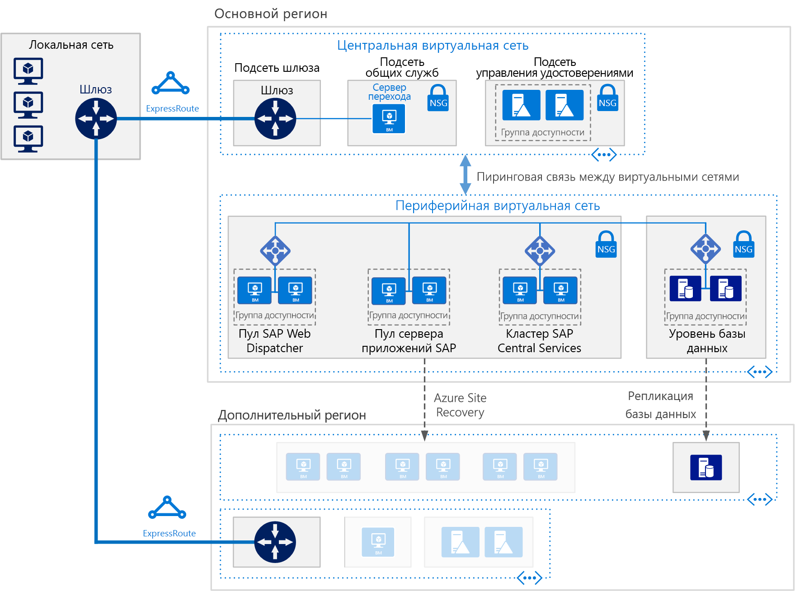

# Развертывание SAP NetWeaver (Windows) для баз сторонних поставщиков на виртуальных машинах AzureDeploy SAP NetWeaver (Windows) for AnyDB on Azure Virtual Machines

В этой эталонной архитектуре показан набор методик по запуску SAP NetWeaver в высокодоступной среде Windows в Azure.This reference architecture shows a set of proven practices for running SAP NetWeaver in a Windows environment on Azure with high availability. База данных сторонних поставщиков, или так называемая база данных AnyDB, — это термин SAP, который применяется к любой поддерживаемой СУБД, кроме SAP HANA.The database is AnyDB, the SAP term for any supported DBMS besides SAP HANA. Эта архитектура развертывается с конкретными размерами виртуальных машин, которые можно изменить в соответствии с потребностями вашей организации.This architecture is deployed with specific virtual machine (VM) sizes that can be changed to accommodate your organization's needs.

*Скачайте [файл Visio][visio-download] этой архитектуры.**Download a [Visio file][visio-download] of this architecture.*

> [!NOTE] 
> Для развертывания этой эталонной архитектуры требуется соответствующее лицензирование продуктов SAP и другие технологии сторонних производителей.Deploying this reference architecture requires appropriate licensing of SAP products and other non-Microsoft technologies.

## АрхитектураArchitecture
Архитектура состоит из следующих компонентов инфраструктуры и основных программных компонентов.The architecture consists of the following infrastructure and key software components.

**Виртуальная сеть**.**Virtual network**. Служба виртуальной сети Azure обеспечивает безопасное подключение ресурсов Azure друг к другу.The Azure Virtual Network service securely connects Azure resources to each other. В этой архитектуре виртуальная сеть подключается к локальной среде через VPN-шлюз, развернутый в концентраторе в рамках [звездообразной топологии](../hybrid-networking/hub-spoke.md).In this architecture, the virtual network connects to an on-premises environment through a VPN gateway deployed in the hub of a [hub-spoke](../hybrid-networking/hub-spoke.md). Периферией выступает виртуальная сеть, используемая для уровня приложений SAP и уровня базы данных.The spoke is the virtual network used for the SAP applications and database tier.

**Подсети.****Subnets**. Виртуальная сеть подразделяется на отдельные подсети для каждого уровня: приложение (SAP NetWeaver), база данных, общие службы (jumpbox) и Active Directory.The virtual network is subdivided into separate subnets for each tier: application (SAP NetWeaver), database, shared services (the jumpbox), and Active Directory.
    
**Виртуальные машины**.**Virtual machines**. Эта архитектура использует виртуальные машины для уровня приложения и уровня базы данных. Они сгруппированы следующим образом:This architecture uses virtual machines for the application tier and database tier, grouped as follows:

- **SAP NetWeaver**.**SAP NetWeaver**. На уровне приложений используются виртуальные машины Windows и выполняются центральные службы и серверы приложений SAP.The application tier uses Windows virtual machines and runs SAP Central Services and SAP application servers. Виртуальные машины, на которых выполняются центральные службы, настроены как отказоустойчивый кластер Windows Server для обеспечения высокого уровня доступности, поддерживаемого SIOS DataKeeper Cluster Edition.The VMs that run Central Services are configured as a Windows Server Failover Cluster for high availability, supported by SIOS DataKeeper Cluster Edition.
- **AnyDB**.**AnyDB**. На уровне базы данных AnyDB выполняется как база данных-источник, например Microsoft SQL Server, Oracle или IBM DB2.The database tier runs AnyDB as the source database, such as Microsoft SQL Server, Oracle, or IBM DB2.
- **Jumpbox**.**Jumpbox**. Он также называется узлом-бастионом.Also called a bastion host. Это безопасная виртуальная машина в сети, которую администраторы используют для подключения к другим виртуальным машинам.This is a secure virtual machine on the network that administrators use to connect to the other virtual machines.
- **Контроллеры домена Windows Server Active Directory**.**Windows Server Active Directory domain controllers**. Контроллеры домена используются для всех виртуальных машин и пользователей в домене.The domain controllers are used on all VMs and users in the domain.

**Подсистемы балансировки нагрузки.****Load balancers**. Экземпляры [Azure Load Balancer](/azure/load-balancer/load-balancer-overview) распределяют трафик на виртуальные машины в подсети уровня приложений.[Azure Load Balancer](/azure/load-balancer/load-balancer-overview) instances are used to distribute traffic to virtual machines in the application tier subnet. На уровне данных высокий уровень доступности можно реализовать с помощью встроенной подсистемы балансировки нагрузки SAP, Azure Load Balancer или других механизмов в зависимости от СУБД.At the data tier, high availability may be achieved using built-in SAP load balancers, Azure Load Balancer, or other mechanisms, depending on the DBMS. См. дополнительные сведения о [развертывании СУБД на виртуальных машинах Windows для SAP NetWeaver](/azure/virtual-machines/workloads/sap/dbms-guide).For more information, see [Azure Virtual Machines DBMS deployment for SAP NetWeaver](/azure/virtual-machines/workloads/sap/dbms-guide). 

**Группы доступности**.**Availability sets**. Виртуальные машины для веб-диспетчера SAP, сервера приложений SAP и ролей (A)SCS объединяются в отдельные [группы доступности](/azure/virtual-machines/windows/tutorial-availability-sets). На роль выделяется по меньшей мере две виртуальные машины.Virtual machines for the SAP Web Dispatcher, SAP application server, and (A)SCS, roles are grouped into separate [availability sets](/azure/virtual-machines/windows/tutorial-availability-sets), and at least two virtual machines are provisioned per role. Таким образом виртуальные машины станут подходящими для [соглашения об уровне обслуживания (SLA)](https://azure.microsoft.com/support/legal/sla/virtual-machines) более высокого уровня.This makes the virtual machines eligible for a higher [service level agreement](https://azure.microsoft.com/support/legal/sla/virtual-machines) (SLA).

**Сетевые карты**.**NICs**. [Сетевые карты](/azure/virtual-network/virtual-network-network-interface) (NIC) позволяют осуществлять связь между всеми виртуальными машинами в виртуальной сети.[Network interface cards](/azure/virtual-network/virtual-network-network-interface) (NICs) enable all communication of virtual machines on a virtual network.

**Группы безопасности сети**.**Network security groups**. [Они](/azure/virtual-network/virtual-networks-nsg) (NSG) позволяют ограничить входящий, исходящий трафик и трафик внутри подсети в виртуальной сети.To restrict incoming, outgoing, and intra-subnet traffic in the virtual network, you can create [network security groups](/azure/virtual-network/virtual-networks-nsg) (NSGs).

**Шлюз.****Gateway**. Шлюз расширяет локальную сеть до виртуальной сети Azure.A gateway extends your on-premises network to the Azure virtual network. [ExpressRoute](/azure/architecture/reference-architectures/hybrid-networking/expressroute) — рекомендуемая служба Azure для создания частных подключений, которые не проходят через общедоступный Интернет, но также можно использовать [подключение типа "сеть — сеть"](/azure/vpn-gateway/vpn-gateway-howto-site-to-site-resource-manager-portal).[ExpressRoute](/azure/architecture/reference-architectures/hybrid-networking/expressroute) is the recommended Azure service for creating private connections that do not go over the public Internet, but a [Site-to-Site](/azure/vpn-gateway/vpn-gateway-howto-site-to-site-resource-manager-portal) connection can also be used.

**Хранилище Azure.****Azure Storage**. Для предоставления постоянного хранилища виртуального жесткого диска (VHD) виртуальной машины требуется [хранилище Azure](/azure/storage/storage-standard-storage).To provide persistent storage of a virtual machine's virtual hard disk (VHD), [Azure Storage](/azure/storage/storage-standard-storage) is required. Ее также использует [облако-свидетель](/windows-server/failover-clustering/deploy-cloud-witness) для работы отказоустойчивого кластера.It is also used by [Cloud Witness](/windows-server/failover-clustering/deploy-cloud-witness) to implement a failover cluster operation. 

## РекомендацииRecommendations
Описанная здесь архитектура может не соответствовать вашим требованиям.Your requirements might differ from the architecture described here. Воспользуйтесь этими рекомендациями в качестве отправной точки.Use these recommendations as a starting point.

### Пул веб-диспетчера SAPSAP Web Dispatcher pool

Компонент "веб-диспетчер" используется как подсистема балансировки нагрузки для трафика SAP между серверами приложений SAP.The Web Dispatcher component is used as a load balancer for SAP traffic among the SAP application servers. Чтобы обеспечить высокий уровень доступности для компонента "веб-диспетчер", Azure Load Balancer реализует параллельную установку веб-диспетчера.To achieve high availability for the Web Dispatcher component, Azure Load Balancer is used to implement the parallel Web Dispatcher setup. Веб-диспетчер использует циклическую конфигурацию для распределения трафика HTTP (S) среди доступных веб-диспетчеров в пуле балансировщиков.Web Dispatcher uses in a round-robin configuration for HTTP(S) traffic distribution among the available Web Dispatchers in the balancers pool.

Дополнительные сведения см. в статье [SAP NetWeaver на виртуальных машинах Windows. Руководство по планированию и внедрению](/azure/virtual-machines/workloads/sap/planning-guide).For details about running SAP NetWeaver in Azure VMs, see [Azure Virtual Machines planning and implementation for SAP NetWeaver](/azure/virtual-machines/workloads/sap/planning-guide).

### Пул серверов приложенийApplication servers pool

Для управления группами входа для серверов приложений ABAP используется транзакция SMLG.To manage logon groups for ABAP application servers, the SMLG transaction is used. Она использует функцию балансировки нагрузки на сервере сообщений центральных служб для распределения рабочей нагрузки между пулом серверов приложений SAP для трафика SAPGUI и RFC.It uses the load balancing function within the message server of the Central Services to distribute workload among SAP application servers pool for SAPGUIs and RFC traffic. Подключение сервера приложений к высокодоступным центральным службам осуществляется по имени виртуальной сети кластера.The application server connection to the highly available Central Services is through the cluster virtual network name.

### Кластер центральных служб SAPSAP Central Services cluster

Эта эталонная архитектура запускает центральные службы на виртуальных машинах на уровне приложений.This reference architecture runs Central Services on VMs in the application tier. Центральные службы представляют собой потенциальную единую точку отказа (SPOF) при развертывании в одну виртуальную машину. Это обычное развертывание, при котором высокий уровень доступности не требуется.The Central Services is a potential single point of failure (SPOF) when deployed to a single VM—typical deployment when high availability is not a requirement. Реализовать решение высокого уровня доступности можно с помощью кластера общих дисков или кластера общих файлов.To implement a high availability solution, either a shared disk cluster or a file share cluster can be used.

Чтобы настроить виртуальные машины для кластера общих дисков, используйте [отказоустойчивый кластер Windows Server](https://blogs.sap.com/2018/01/25/how-to-create-sap-resources-in-windows-failover-cluster/).To configure VMs for a shared disk cluster, use [Windows Server Failover Cluster](https://blogs.sap.com/2018/01/25/how-to-create-sap-resources-in-windows-failover-cluster/). Рекомендуем использовать [облако-свидетель](/windows-server/failover-clustering/deploy-cloud-witness) в качестве свидетеля кворума.[Cloud Witness](/windows-server/failover-clustering/deploy-cloud-witness) is recommended as a quorum witness. Чтобы поддержать среду отказоустойчивого кластера, [SIOS DataKeeper Cluster Edition](https://azuremarketplace.microsoft.com/marketplace/apps/sios_datakeeper.sios-datakeeper-8) выполняет функции общего тома кластера, реплицируя независимые диски, принадлежащие узлам кластера.To support the failover cluster environment, [SIOS DataKeeper Cluster Edition](https://azuremarketplace.microsoft.com/marketplace/apps/sios_datakeeper.sios-datakeeper-8) performs the cluster shared volume function by replicating independent disks owned by the cluster nodes. Azure изначально не поддерживает общие диски и поэтому необходимы решения, предоставленные SIOS.Azure does not natively support shared disks and therefore requires solutions provided by SIOS.

Дополнительные сведения см. в разделе 3For details, see "3. о важном обновлении для клиентов SAP, использующих ASCS на SIOS в Azure, в записи блога [Running SAP applications on the Microsoft platform](https://blogs.msdn.microsoft.com/saponsqlserver/2017/05/04/sap-on-azure-general-update-for-customers-partners-april-2017/) (Запуск приложений SAP на платформе Майкрософт).Important Update for SAP Customers Running ASCS on SIOS on Azure” at [Running SAP applications on the Microsoft platform](https://blogs.msdn.microsoft.com/saponsqlserver/2017/05/04/sap-on-azure-general-update-for-customers-partners-april-2017/).

Еще один способ обработки кластеризации — реализовать кластер общих файлов с помощью отказоустойчивого кластера Windows Server.Another way to handle clustering is to implement a file share cluster using Windows Server Failover Cluster. В [SAP](https://blogs.sap.com/2018/03/19/migration-from-a-shared-disk-cluster-to-a-file-share-cluster/) недавно изменили шаблон развертывания центральных служб для доступа к глобальным каталогам /sapmnt через UNC-путь.[SAP](https://blogs.sap.com/2018/03/19/migration-from-a-shared-disk-cluster-to-a-file-share-cluster/) recently modified the Central Services deployment pattern to access the /sapmnt global directories via a UNC path. Это изменение [устраняет требование](https://blogs.msdn.microsoft.com/saponsqlserver/2017/08/10/high-available-ascs-for-windows-on-file-share-shared-disk-no-longer-required/) для SIOS или других решений общих дисков на виртуальных машинах центральных служб.This change [removes the requirement](https://blogs.msdn.microsoft.com/saponsqlserver/2017/08/10/high-available-ascs-for-windows-on-file-share-shared-disk-no-longer-required/) for SIOS or other shared disk solutions on the Central Services VMs. Мы по-прежнему рекомендуем убедиться, что общий ресурс UNC /sapmnt имеет [высокий уровень доступности](https://blogs.sap.com/2017/07/21/how-to-create-a-high-available-sapmnt-share/).It is still recommended to ensure that the /sapmnt UNC share is [highly available](https://blogs.sap.com/2017/07/21/how-to-create-a-high-available-sapmnt-share/). Это можно сделать в экземпляре центральных служб с помощью отказоустойчивого кластера Windows Server с функцией [масштабируемого файлового сервера](https://blogs.msdn.microsoft.com/saponsqlserver/2017/11/14/file-server-with-sofs-and-s2d-as-an-alternative-to-cluster-shared-disk-for-clustering-of-an-sap-ascs-instance-in-azure-is-generally-available/) (SOFS) и [локальных дисковых пространств](https://blogs.sap.com/2018/03/07/your-sap-on-azure-part-5-ascs-high-availability-with-storage-spaces-direct/) (S2D) в Windows Server 2016.This can be done on the Central Services instance by using Windows Server Failover Cluster with [Scale Out File Server](https://blogs.msdn.microsoft.com/saponsqlserver/2017/11/14/file-server-with-sofs-and-s2d-as-an-alternative-to-cluster-shared-disk-for-clustering-of-an-sap-ascs-instance-in-azure-is-generally-available/) (SOFS) and the [Storage Spaces Direct](https://blogs.sap.com/2018/03/07/your-sap-on-azure-part-5-ascs-high-availability-with-storage-spaces-direct/) (S2D) feature in Windows Server 2016. 

### Группы доступностиAvailability sets

Группы доступности распределяют серверы между разными физическими инфраструктурами и группами обновлений для повышения доступности служб.Availability sets distribute servers to different physical infrastructure and update groups to improve service availability. Поместите виртуальные машины, которые выполняют одинаковую роль, в группы доступности во избежание простоя, вызванного обслуживанием инфраструктуры Azure, и для соответствия [Соглашениям об уровне обслуживания](https://azure.microsoft.com/support/legal/sla/virtual-machines) (SLA).Put virtual machines that perform the same role into an availability sets to help guard against downtime caused by Azure infrastructure maintenance and to meet [SLAs](https://azure.microsoft.com/support/legal/sla/virtual-machines) (SLAs). Рекомендуется использовать две или более виртуальных машин на группу доступности.Two or more virtual machines per availability set is recommended.

Все виртуальные машины в группе должны выполнять ту же роль.All virtual machines in a set must perform the same role. Не смешивайте серверы разных ролей в одной группе доступности.Do not mix servers of different roles in the same availability set. Например, не размещайте узел центральных служб в одной группе доступности с сервером приложений.For example, don't place a Central Services node in the same availability set with the application server.

### сетевые карты;NICs

Обычные локальные развертывания SAP реализуют несколько сетевых карт (NIC) на один компьютер для отделения административного трафика от бизнес-трафика.Traditional on-premises SAP deployments implement multiple network interface cards (NICs) per machine to segregate administrative traffic from business traffic. В Azure виртуальная сеть представляет собой программно-определяемую сеть, которая отправляет весь трафик через одну и ту же сетевую структуру.On Azure, the virtual network is a software-defined network that sends all traffic through the same network fabric. Поэтому использование нескольких сетевых адаптеров не требуется.Therefore, the use of multiple NICs is unnecessary. Однако, если вашей организации необходимо разделить трафик, вы можете развернуть несколько сетевых карт на одну виртуальную машину, подключить каждую карту к другой подсети, а затем использовать NSG для применения различных политик управления доступом.However, if your organization needs to segregate traffic, you can deploy multiple NICs per VM, connect each NIC to a different subnet, and then use NSGs to enforce different access control policies.

### Подсети и группы безопасности сетиSubnets and NSGs

Эта архитектура подразделяет адресное пространство виртуальной сети на подсети.This architecture subdivides the virtual network address space into subnets. В основном она фокусируется на подсети уровня приложения.This reference architecture focuses primarily on the application tier subnet. Каждая подсеть может быть связана с NSG, которая определяет политики доступа для подсети.Each subnet can be associated with a NSG that defines the access policies for the subnet. Разместите серверы приложений в отдельной подсети, чтобы упростить их защиту за счет управления политиками безопасности подсети, а не отдельными серверами.Place application servers on a separate subnet so you can secure them more easily by managing the subnet security policies, not the individual servers.

Если NSG связана с подсетью, она применяется ко всем серверам в подсети.When a NSG is associated with a subnet, it applies to all the servers within the subnet. Дополнительные сведения об использовании NSG для точного управления серверами в подсети см. в [этой статье](https://azure.microsoft.com/en-us/blog/multiple-vm-nics-and-network-virtual-appliances-in-azure/).For more information about using NSGs for fine-grained control over the servers in a subnet, see [Filter network traffic with network security groups](https://azure.microsoft.com/en-us/blog/multiple-vm-nics-and-network-virtual-appliances-in-azure/).

### Балансировщики нагрузкиLoad balancers

[Веб-диспетчер SAP](https://help.sap.com/doc/saphelp_nw73ehp1/7.31.19/en-US/48/8fe37933114e6fe10000000a421937/frameset.htm) обрабатывает балансировку нагрузки трафика HTTP(S) к пулу серверов приложений SAP.[SAP Web Dispatcher](https://help.sap.com/doc/saphelp_nw73ehp1/7.31.19/en-US/48/8fe37933114e6fe10000000a421937/frameset.htm) handles load balancing of HTTP(S) traffic to a pool of SAP application servers.

Для трафика от клиентов SAP GUI, подключающихся к серверу SAP по протоколу DIAG или с помощью удаленных вызовов функций (RFC), сервер обмена сообщениями центральных служб распределяет нагрузку через [группы входа](https://wiki.scn.sap.com/wiki/display/SI/ABAP+Logon+Group+based+Load+Balancing) сервера приложений SAP, поэтому дополнительная подсистема балансировки нагрузки не требуется.For traffic from SAP GUI clients connecting a SAP server via DIAG protocol or Remote Function Calls (RFC), the Central Services message server balances the load through SAP application server [logon groups](https://wiki.scn.sap.com/wiki/display/SI/ABAP+Logon+Group+based+Load+Balancing), so no additional load balancer is needed.

### Хранилище AzureAzure Storage

Для виртуальных машин сервера базы данных рекомендуем использовать хранилище Azure класса Premium для согласованных задержек чтения и записи.For all database server virtual machines, we recommend using Azure Premium Storage for consistent read/write latency. Дополнительные сведения об использовании хранилища Azure класса Premium для всех дисков ОС и дисков данных для одноэкземплярной виртуальной машины см. в статье [Соглашение об уровне обслуживания для виртуальных машин](https://azure.microsoft.com/support/legal/sla/virtual-machines).For any single instance virtual machine using Premium Storage for all operating system disks and data disks, see [SLA for Virtual Machines](https://azure.microsoft.com/support/legal/sla/virtual-machines). Кроме того, для производственных систем SAP мы рекомендуем во всех случаях использовать [управляемые диски Azure](/azure/storage/storage-managed-disks-overview) уровня "Премиум".Also, for production SAP systems, we recommend using Premium [Azure Managed Disks](/azure/storage/storage-managed-disks-overview) in all cases. Управляемые диски используются для управления VHD-файлами для дисков.For reliability, Managed Disks are used to manage the VHD files for the disks. Они также обеспечивают изоляцию дисков для виртуальных машин в группе доступности, что помогает избежать единых точек отказа.Managed disks ensure that the disks for virtual machines within an availability set are isolated to avoid single points of failure.

Для серверов приложений SAP, включая виртуальные машины центральных служб, можно использовать службу хранилища Azure класса Standard, чтобы уменьшить затраты, так как выполнение приложений происходит в памяти и диски используются только для ведения журнала.For SAP application servers, including the Central Services virtual machines, you can use Azure Standard Storage to reduce cost, because application execution takes place in memory and disks are used for logging only. Однако в настоящее время хранилище класса Standard сертифицировано только для неуправляемого хранилища.However, at this time, Standard Storage is only certified for unmanaged storage. Так как серверы приложений не содержат никаких данных, вы также можете использовать меньшие диски хранилища класса Premium P4 и P6 для сокращения затрат.Since application servers do not host any data, you can also use the smaller P4 and P6 Premium Storage disks to help minimize cost.

Кроме того, с помощью службы хранилища Azure [облако-свидетель](/windows-server/failover-clustering/deploy-cloud-witness) поддерживает кворум с устройством в регионе Azure, удаленном от основного региона, где находится кластер.Azure Storage is also used by [Cloud Witness](/windows-server/failover-clustering/deploy-cloud-witness) to maintain quorum with a device in a remote Azure region away from the primary region where the cluster resides.

Для хранилища резервных копий рекомендуем использовать хранилище [холодного уровня доступа](/azure/storage/storage-blob-storage-tiers) и [архивного уровня доступа](/azure/storage/storage-blob-storage-tiers) Azure.For the backup data store, we recommend using Azure [coolaccess tier](/azure/storage/storage-blob-storage-tiers) and [archive access tier storage](/azure/storage/storage-blob-storage-tiers). Эти уровни хранилища являются эффективными методами хранения данных, которые редко используются и имеют большой срок хранения.These storage tiers are cost-effective ways to store long-lived data that is infrequently accessed.

## Рекомендации по производительностиPerformance considerations

Серверы приложений SAP поддерживают постоянную связь с серверами баз данных.SAP application servers carry on constant communications with the database servers. Для снижения задержки записи в журнал рассмотрите возможность включения [ускорителя записи](/azure/virtual-machines/linux/how-to-enable-write-accelerator) в приложениях с обязательным высоким уровнем производительности, выполняющихся на любых платформах баз данных, включая SAP HANA.For performance-critical applications running on any database platforms, including SAP HANA, consider enabling [Write Accelerator](/azure/virtual-machines/linux/how-to-enable-write-accelerator) to improve log write latency. Чтобы оптимизировать межсерверную связь, используйте [ускоренную сеть](https://azure.microsoft.com/blog/linux-and-windows-networking-performance-enhancements-accelerated-networking/).To optimize inter-server communications, use the [Accelerated Network](https://azure.microsoft.com/blog/linux-and-windows-networking-performance-enhancements-accelerated-networking/). Обратите внимание, что эти ускорители доступны только для определенных серий виртуальных машин.Note that these accelerators are available only for certain VM series.

Чтобы добиться высокой скорости операции ввода-вывода и лучшей пропускной способности диска, к структуре хранилища Azure применяются распространенные методы [оптимизации производительности](/azure/virtual-machines/windows/premium-storage-performance) тома хранилища.To achieve high IOPS and disk bandwidth throughput, the common practices in storage volume [performance optimization](/azure/virtual-machines/windows/premium-storage-performance) apply to Azure storage layout. Например, объединение нескольких дисков вместе для создания чередующегося дискового тома повышает производительность операций ввода-вывода.For example, combining multiple disks together to create a striped disk volume improves IO performance. Включение кэша чтения в содержимом хранилища, которое редко изменяется, повышает скорость извлечения данных.Enabling the read cache on storage content that changes infrequently enhances the speed of data retrieval.

Рекомендации по оптимизации хранилища Azure для рабочих нагрузок SAP на SQL Server см. в записи блога [Top 10 Key Considerations for Deploying SAP Applications on Azure](https://blogs.msdn.microsoft.com/saponsqlserver/2015/05/25/top-10-key-considerations-for-deploying-sap-applications-on-azure/) (10 основных рекомендаций для развертывания приложений SAP в Azure).For SAP on SQL, the [Top 10 Key Considerations for Deploying SAP Applications on Azure](https://blogs.msdn.microsoft.com/saponsqlserver/2015/05/25/top-10-key-considerations-for-deploying-sap-applications-on-azure/) blog offers excellent advice on optimizing Azure storage for SAP workloads on SQL Server.

## Вопросы масштабируемостиScalability considerations

На уровне приложений SAP Azure предлагает широкий диапазон размеров виртуальных машин для вертикального и горизонтального масштабирования. Полный список см. в [примечании SAP № 1928533 о поддерживаемых продуктах и типах виртуальных машин Azure для приложений SAP в Azure](https://launchpad.support.sap.com/#/notes/1928533).At the SAP application layer, Azure offers a wide range of virtual machine sizes for scaling up and scaling out. For an inclusive list, see [SAP note 1928533](https://launchpad.support.sap.com/#/notes/1928533) - SAP Applications on Azure: Supported Products and Azure VM Types. (Для доступа необходима учетная запись SAP Service Marketplace.)(SAP Service Marketplace account required for access). Вы можете увеличивать и уменьшать масштаб кластеров серверов приложений SAP и центральных служб путем добавления или удаления экземпляров.SAP application servers and the Central Services clusters can scale up/down or scale out by adding more instances. Базу данных AnyDB невозможно развернуть — можно только увеличить или уменьшить ее масштаб. Контейнер базы данных SAP для AnyDB не поддерживает сегментирование.The AnyDB database can scale up/down but does not scale out. The SAP database container for AnyDB does not support sharding.

## Вопросы доступностиAvailability considerations

Обеспечение избыточности ресурсов является общей процедурой в высокодоступных инфраструктурных решениях.Resource redundancy is the general theme in highly available infrastructure solutions. Для предприятий с менее строгим SLA одноэкземплярные виртуальные машины Azure предлагают SLA с гарантией времени непрерывной работы.For enterprises that have a less stringent SLA, single-instance Azure VMs offer an uptime SLA. Дополнительные сведения см. в статье [Соглашения об уровне обслуживания](https://azure.microsoft.com/support/legal/sla/).For more information, see [Azure Service Level Agreement](https://azure.microsoft.com/support/legal/sla/).

В этой распределенной установке приложения SAP базовая установка реплицируется для обеспечения высокой доступности.In this distributed installation of the SAP application, the base installation is replicated to achieve high availability. Для каждого слоя архитектуры способ обеспечения высокого уровня доступности варьируется.For each layer of the architecture, the high availability design varies.

### Уровень приложенияApplication tier

Высокая доступность для веб-диспетчера SAP достигается с помощью избыточных экземпляров.High availability for SAP Web Dispatcher is achieved with redundant instances. Дополнительные сведения см. в документации по [веб-диспетчеру SAP](https://help.sap.com/doc/saphelp_nw70ehp2/7.02.16/en-us/48/8fe37933114e6fe10000000a421937/frameset.htm).See [SAP Web Dispatcher](https://help.sap.com/doc/saphelp_nw70ehp2/7.02.16/en-us/48/8fe37933114e6fe10000000a421937/frameset.htm) in the SAP Documentation.

Высокая доступность центральных служб реализуется с помощью отказоустойчивого кластера Windows Server.High availability of the Central Services is implemented with Windows Server Failover Cluster. При развертывании в Azure система хранения данных кластера для отказоустойчивого кластера может быть настроена с помощью двух подходов: кластеризованного общего тома или общего файлового ресурса.When deployed on Azure, the cluster storage for the failover cluster can be configured using two approaches: either a clustered shared volume or a file share.

Так как общие диски недоступны для Azure, SIOS Datakeeper используется для репликации содержимого независимых дисков, прикрепленных к узлам кластера, и для абстрактного представления дисков в качестве общего тома кластера для диспетчера кластера.Since shared disks are not possible on Azure, SIOS Datakeeper is used to replicate the content of independent disks attached to the cluster nodes and to abstract the drives as a cluster shared volume for the cluster manager. Дополнительные сведения о реализации см. в [этой статье](https://blogs.msdn.microsoft.com/saponsqlserver/2015/05/20/clustering-sap-ascs-instance-using-windows-server-failover-cluster-on-microsoft-azure-with-sios-datakeeper-and-azure-internal-load-balancer/).For implementation details, see [Clustering SAP ASCS on Azure](https://blogs.msdn.microsoft.com/saponsqlserver/2015/05/20/clustering-sap-ascs-instance-using-windows-server-failover-cluster-on-microsoft-azure-with-sios-datakeeper-and-azure-internal-load-balancer/).

Другим вариантом является использование общего файлового ресурса, обслуживаемого [масштабируемым файловым сервером](https://blogs.msdn.microsoft.com/saponsqlserver/2017/11/14/file-server-with-sofs-and-s2d-as-an-alternative-to-cluster-shared-disk-for-clustering-of-an-sap-ascs-instance-in-azure-is-generally-available/) (SOFS).Another option is to use a file share served up by the [Scale Out Fileserver](https://blogs.msdn.microsoft.com/saponsqlserver/2017/11/14/file-server-with-sofs-and-s2d-as-an-alternative-to-cluster-shared-disk-for-clustering-of-an-sap-ascs-instance-in-azure-is-generally-available/) (SOFS). SOFS предлагает отказоустойчивые общие файловые ресурсы, которые можно использовать в качестве общего тома кластера для кластера Windows.SOFS offers resilient file shares you can use as a cluster shared volume for the Windows cluster. Кластер SOFS могут совместно использовать несколько узлов центральных служб.A SOFS cluster can be shared among multiple Central Services nodes. На момент написания этой статьи SOFS использовался только для разработки с высоким уровнем доступности, так как кластер SOFS не распространяется по регионам, чтобы обеспечить поддержку аварийного восстановления.As of this writing, SOFS is used only for high availability design, because the SOFS cluster does not extend across regions to provide disaster recovery support.

Высокий уровень доступности для серверов приложений SAP достигается путем балансировки нагрузки трафика в пуле серверов приложений.High availability for the SAP application servers is achieved by load balancing traffic within a pool of application servers.
См. статью [Сертификаты и конфигурации SAP на платформе Microsoft Azure](/azure/virtual-machines/workloads/sap/sap-certifications).See [SAP certifications and configurations running on Microsoft Azure](/azure/virtual-machines/workloads/sap/sap-certifications).

### Уровень базы данныхDatabase tier

Эта эталонная архитектура предполагает, что база данных-источник работает в базе данных AnyDB, то есть СУБД, например SQL Server, SAP ASE, IBM DB2 или Oracle.This reference architecture assumes the source database is running on AnyDB—that is, a DBMS such as SQL Server, SAP ASE, IBM DB2, or Oracle. Встроенная функция репликации уровня базы данных обеспечивает либо ручной, либо автоматический переход на другой ресурс между реплицируемыми узлами.The database tier's native replication feature provides either manual or automatic failover between replicated nodes.

Сведения о реализации конкретных систем баз данных см. в статье [SAP NetWeaver на виртуальных машинах Windows. Руководство по развертыванию СУБД](/azure/virtual-machines/workloads/sap/dbms-guide).For implementation details about specific database systems, see [Azure Virtual Machines DBMS deployment for SAP NetWeaver](/azure/virtual-machines/workloads/sap/dbms-guide).

## Рекомендации по аварийному восстановлениюDisaster recovery considerations

Для аварийного восстановления необходимо выполнить отработку отказа в дополнительный регион.For disaster recovery (DR), you must be able to fail over to a secondary region. Каждый уровень использует разную стратегию обеспечения защиты посредством аварийного восстановления.Each tier uses a different strategy to provide disaster recovery (DR) protection.

- **Уровень серверов приложений**.**Application servers tier**. Серверы приложений SAP не содержат бизнес-данных.SAP application servers do not contain business data. В Azure простой стратегией аварийного восстановления является создание серверов приложений SAP в дополнительном регионе, а затем завершение их работы.On Azure, a simple DR strategy is to create SAP application servers in the secondary region, then shut them down. При любых изменениях конфигурации или обновлениях ядра на основном сервере приложений те же изменения должны быть скопированы в виртуальные машины в дополнительном регионе.Upon any configuration changes or kernel updates on the primary application server, the same changes must be copied to the virtual machines in the secondary region. Например, исполняемые файлы ядра копируются на виртуальные машины аварийного восстановления.For example, the kernel executables copied to the DR virtual machines. Для автоматической репликации серверов приложений в дополнительный регион рекомендуется использовать [Azure Site Recovery](/azure/site-recovery/site-recovery-overview).For automatic replication of application servers to a secondary region, [Azure Site Recovery](/azure/site-recovery/site-recovery-overview) is the recommended solution.

- **Центральные службы**.**Central Services**. Этот компонент стека приложений SAP не сохраняет бизнес-данные.This component of the SAP application stack also does not persist business data. Вы можете создать виртуальную машину в регионе аварийного восстановления, чтобы запустить роль центральных служб.You can build a VM in the disaster recovery region to run the Central Services role. Единственное содержимое основного узла центральных служб, которое синхронизируется, — это общее содержимое /sapmnt.The only content from the primary Central Services node to synchronize is the /sapmnt share content. Кроме того, если изменения конфигурации или обновления ядра происходят на основных серверах центральных служб, их необходимо повторить на виртуальной машине в регионе аварийного восстановления, где запущены центральные службы.Also, if configuration changes or kernel updates take place on the primary Central Services servers, they must be repeated on the VM in the disaster recovery region running Central Services. Синхронизировать два сервера можно либо с помощью Azure Site Recovery, выполнив репликацию узлов кластера, либо просто с помощью запланированного задания копирования, при котором /sapmnt копируется в регион аварийного восстановления.To synchronize the two servers, you can use either Azure Site Recovery to replicate the cluster nodes or simply use a regularly scheduled copy job to copy /sapmnt to the disaster recovery region. Сведения о простом процессе репликации, создания, копирования и тестирования отработки отказа см. в документе [SAP NetWeaver: Building a Hyper-V & Microsoft Azure–based Disaster Recovery Solution](https://download.microsoft.com/download/9/5/6/956FEDC3-702D-4EFB-A7D3-2DB7505566B6/SAP%20NetWeaver%20-%20Building%20an%20Azure%20based%20Disaster%20Recovery%20Solution%20V1_5%20.docx) (Создание решения аварийного восстановления на основе Microsoft Azure и Hyper-V в SAP NetWeaver) в разделе 4.3For details about this simple replication method's build, copy, and test failover process, download [SAP NetWeaver: Building a Hyper-V and Microsoft Azure–based Disaster Recovery Solution](https://download.microsoft.com/download/9/5/6/956FEDC3-702D-4EFB-A7D3-2DB7505566B6/SAP%20NetWeaver%20-%20Building%20an%20Azure%20based%20Disaster%20Recovery%20Solution%20V1_5%20.docx), and refer to "4.3. о слое единой точки отказа SAP (ASCS).SAP SPOF layer (ASCS)."

- **Уровень базы данных.****Database tier**. Аварийное восстановление лучше всего реализовать с помощью собственной интегрированной технологии репликации базы данных.DR is best implemented with the database's own integrated replication technology. Например, в случае с SQL Server мы рекомендуем создать реплики в удаленном регионе с помощью группы доступности AlwaysOn, асинхронно реплицируя транзакции с помощью перехода на другой ресурс вручную.In the case of SQL Server, for example, we recommend using AlwaysOn Availability Group to establish a replica in a remote region, replicating transactions asynchronously with manual failover. Асинхронная репликация позволяет избежать влияния на производительность интерактивных рабочих нагрузок на основном сайте.Asynchronous replication avoids an impact to the performance of interactive workloads at the primary site. Переход на другой ресурс вручную дает возможность оценить влияние аварийного восстановления и решить, продолжить ли использование сайта аварийного восстановления.Manual failover offers the opportunity for a person to evaluate the DR impact and decide if operating from the DR site is justified.

Чтобы использовать Azure Site Recovery для автоматического создания полностью реплицированного производственного исходного сайта, запустите настроенные [скрипты развертывания](/azure/site-recovery/site-recovery-runbook-automation).To use Azure Site Recovery to automatically build out a fully replicated production site of your original, you must run customized [deployment scripts](/azure/site-recovery/site-recovery-runbook-automation). Сначала Site Recovery развертывает виртуальные машины в группах доступности, а затем запускает скрипты для добавления ресурсов, таких как подсистемы балансировки нагрузки.Site Recovery first deploys the VMs in availability sets, then runs scripts to add resources such as load balancers.

## Вопросы управляемостиManageability considerations

Azure предоставляет несколько функций для [мониторинга и диагностики](/azure/architecture/best-practices/monitoring) во всей инфраструктуре.Azure provides several functions for [monitoring and diagnostics](/azure/architecture/best-practices/monitoring) of the overall infrastructure. Кроме того, расширенный мониторинг виртуальных машин Azure обрабатывается с помощью Azure Operations Management Suite (OMS).Also, enhanced monitoring of Azure virtual machines is handled by Azure Operations Management Suite (OMS).

Чтобы обеспечить мониторинг ресурсов на основе SAP и производительности служб инфраструктуры SAP, используйте расширение [улучшенного мониторинга Azure для SAP](/azure/virtual-machines/workloads/sap/deployment-guide#detailed-tasks-for-sap-software-deployment).To provide SAP-based monitoring of resources and service performance of the SAP infrastructure, the [Azure SAP Enhanced Monitoring](/azure/virtual-machines/workloads/sap/deployment-guide#detailed-tasks-for-sap-software-deployment) extension is used. Это расширение передает статистику мониторинга Azure в приложение SAP для мониторинга операционной системы и функций DBACockpit.This extension feeds Azure monitoring statistics into the SAP application for operating system monitoring and DBA Cockpit functions.

## Вопросы безопасностиSecurity considerations

SAP имеет свой собственный механизм управления пользователями для управления доступом на основе ролей и авторизации в приложении SAP.SAP has its own Users Management Engine (UME) to control role-based access and authorization within the SAP application. Дополнительные сведения см. в [руководстве по безопасности сервера приложений SAP NetWeaver для ABAP](https://help.sap.com/doc/7b932ef4728810148a4b1a83b0e91070/1610 001/en-US/frameset.htm?4dde53b3e9142e51e10000000a42189c.html) и [руководстве по безопасности сервера приложений SAP NetWeaver для Java](https://help.sap.com/doc/saphelp_snc_uiaddon_10/1.0/en-US/57/d8bfcf38f66f48b95ce1f52b3f5184/frameset.htm).For details, see [SAP NetWeaver Application Server for ABAP Security Guide](https://help.sap.com/doc/7b932ef4728810148a4b1a83b0e91070/1610 001/en-US/frameset.htm?4dde53b3e9142e51e10000000a42189c.html) and [SAP NetWeaver Application Server Java Security Guide](https://help.sap.com/doc/saphelp_snc_uiaddon_10/1.0/en-US/57/d8bfcf38f66f48b95ce1f52b3f5184/frameset.htm).

Чтобы обеспечить дополнительную сетевую безопасность, рассмотрите возможность внедрения [сети периметра](../dmz/secure-vnet-hybrid.md), которая создает брандмауэр перед подсетью для веб-диспетчера с помощью сетевого виртуального модуля.For additional network security, consider implementing a [network DMZ](../dmz/secure-vnet-hybrid.md), which uses a network virtual appliance to create a firewall in front of the subnet for Web Dispatcher.

Для обеспечения безопасности инфраструктуры данные шифруются при передаче и во время хранения.For infrastructure security, data is encrypted in transit and at rest. С помощью указаний в разделе "Вопросы безопасности" в статье [SAP NetWeaver на виртуальных машинах Windows. Руководство по планированию и внедрению](/azure/virtual-machines/workloads/sap/planning-guide) начните реализовать защиту сети.The "Security considerations” section of the [SAP NetWeaver on Azure Virtual Machines (VMs) – Planning and Implementation Guide](/azure/virtual-machines/workloads/sap/planning-guide) begins to address network security. В руководстве также указаны порты сети, которые необходимо открыть на брандмауэрах, чтобы разрешить взаимодействие с приложением.The guide also specifies the network ports you must open on the firewalls to allow application communication.

Выполнить шифрование дисков виртуальной машины Windows можно с помощью [шифрования дисков Azure](/azure/security/azure-security-disk-encryption).To encrypt Windows virtual machine disks, you can use [Azure Disk Encryption](/azure/security/azure-security-disk-encryption). Эта технология использует возможность BitLocker Windows, чтобы обеспечить шифрование тома для дисков ОС и дисков данных.It uses the BitLocker feature of Windows to provide volume encryption for the operating system and the data disks. Шифрование дисков Azure также работает в Azure Key Vault, что позволяет управлять секретами и ключами шифрования дисков в подписке Key Vault и контролировать их.The solution also works with Azure Key Vault to help you control and manage the disk-encryption keys and secrets in your key vault subscription. Данные на дисках виртуальной машины шифруются в хранилище Azure, когда они неактивны.Data on the virtual machine disks are encrypted at rest in your Azure storage.

## СообществаCommunities

Участники сообществ отвечают на вопросы и помогают настроить успешное развертывание.Communities can answer questions and help you set up a successful deployment. Рассмотрим следующее:Consider the following:

- [Запись блога по запуску приложений SAP на платформе МайкрософтRunning SAP Applications on the Microsoft Platform Blog](https://blogs.msdn.microsoft.com/saponsqlserver/2017/05/04/sap-on-azure-general-update-for-customers-partners-april-2017/)
- [Поддержка сообщества AzureAzure Community Support](https://azure.microsoft.com/support/community/)
- [Сообщество SAPSAP Community](https://www.sap.com/community.html)
- [Stack OverflowStack Overflow](https://stackoverflow.com/tags/sap/)

[visio-download]: https://archcenter.blob.core.windows.net/cdn/sap-reference-architectures.vsdx
