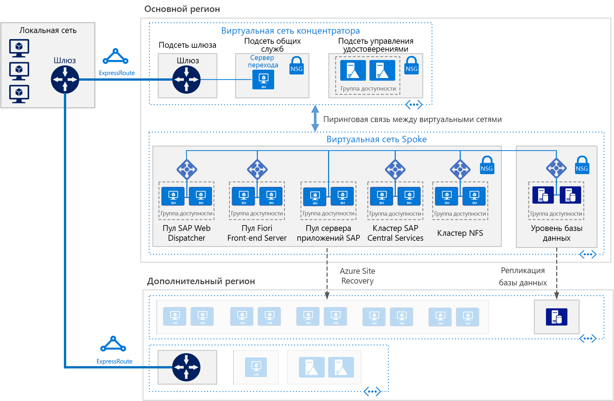

# SAP S/4HANA для виртуальных машин Linux в Azure

Эта эталонная архитектура демонстрирует набор проверенных методик для запуска S/4HANA в среде высокой доступности, которая поддерживает аварийное восстановление в Azure. Эта архитектура развертывается с конкретными размерами виртуальных машин, которые можно изменить в соответствии с потребностями вашей организации. 

*Скачайте [файл Visio][visio-download] этой архитектуры.*

> [!NOTE] 
> Для развертывания этой эталонной архитектуры требуется соответствующее лицензирование продуктов SAP и другие технологии сторонних производителей.

## Архитектура
 
Эта эталонная архитектура описывает корпоративные системы производственного уровня. Эта конфигурация может быть сведена к одной виртуальной машине в соответствии с вашими бизнес-требованиями. Ниже приведены обязательные компоненты.

**Виртуальная сеть**. Служба [виртуальной сети Azure](/azure/virtual-network/virtual-networks-overview) обеспечивает безопасное подключение ресурсов Azure друг к другу. В этой архитектуре виртуальная сеть подключается к локальной среде через шлюз, развернутый в концентраторе в рамках [звездообразной топологии](../hybrid-networking/hub-spoke.md). Периферией выступает виртуальная сеть, используемая для приложений SAP.

**Подсети.** Виртуальная сеть подразделяется на отдельные [подсети](/azure/virtual-network/virtual-network-manage-subnet) для каждого уровня: шлюз, приложение, база данных и общие службы. 

**Виртуальные машины**. В этой архитектуре используются виртуальные машины под управлением Linux для уровня приложения и уровня базы данных, сгруппированные следующим образом:

- **Уровень приложения**. Включает пул серверов переднего плана Fiori, пул веб-диспетчера SAP, пул серверов приложений и кластер центральных служб SAP. Для обеспечения высокой доступности центральных служб на виртуальных машинах Azure Linux требуется высокодоступная служба сетевой файловой системы (NFS).
- **Кластер NFS**. Эта архитектура использует сервер [NFS](/azure/virtual-machines/workloads/sap/high-availability-guide-suse-nfs), запущенный в кластере Linux, для хранения данных, совместно используемых системами SAP. Этот централизованный кластер можно использовать в нескольких системах SAP. Для обеспечения высокой доступности службы NFS используется соответствующее расширение высокой доступности для выбранного дистрибутива Linux.
- **SAP HANA**. Уровень базы данных использует две или более виртуальные машины Linux в кластере для достижения высокой доступности. Репликация системы HANA (HSR) используется для репликации содержимого между первичной и вторичной системами HANA. Кластеризация Linux применяется для обнаружения сбоев системы и упрощения автоматического перехода на другой ресурс. Механизм ограждения на основе хранилища или облака обеспечивает изоляцию или завершение работы неисправной системы во избежание состояния разделения вычислительных мощностей кластера.
- **Jumpbox**. Он также называется узлом-бастионом. Это безопасная виртуальная машина в сети, которую администраторы используют для подключения к другим виртуальным машинам. Она может работать под управлением Windows или Linux. Windows Jumpbox упрощает работу в Интернете при использовании инструментов управления HANA Cockpit или HANA Studio.

**Подсистемы балансировки нагрузки.** Для достижения высокого уровня доступности используются как встроенные подсистемы балансировки нагрузки SAP, так и [Azure Load Balancer](/azure/load-balancer/load-balancer-overview). Экземпляры Azure Load Balancer распределяют трафик на виртуальные машины в подсети уровня приложения.

**Группы доступности**. Виртуальные машины для всех пулов и кластеров (веб-диспетчер, серверы приложений SAP, центральные службы, NFS и HANA) объединяются в отдельные [группы доступности](/azure/virtual-machines/windows/tutorial-availability-sets) и по крайней мере две виртуальные машины подготавливаются в каждой роли. Таким образом виртуальные машины станут подходящими для [соглашения об уровне обслуживания (SLA)](https://azure.microsoft.com/support/legal/sla/virtual-machines) более высокого уровня. 

**Сетевые карты**. [Сетевые карты](/azure/virtual-network/virtual-network-network-interface) (NIC) позволяют осуществлять связь между всеми виртуальными машинами в виртуальной сети.

**Группы безопасности сети**. [Они](/azure/virtual-network/virtual-networks-nsg) позволяют ограничить входящий, исходящий трафик и трафик внутри подсети в виртуальной сети.

**Шлюз.** Шлюз расширяет локальную сеть до виртуальной сети Azure. [ExpressRoute](/azure/architecture/reference-architectures/hybrid-networking/expressroute) — рекомендуемая служба Azure для создания частных подключений, которые не проходят через общедоступный Интернет, но также можно использовать [подключение типа "сеть — сеть"](/azure/vpn-gateway/vpn-gateway-howto-site-to-site-resource-manager-portal). 

**Хранилище Azure.** Для предоставления постоянного хранилища виртуального жесткого диска (VHD) виртуальной машины требуется [хранилище Azure](/azure/storage/). 

## Рекомендации

Эта архитектура описывает небольшое корпоративное развертывание производственного уровня. Ваше развертывание будет отличаться в зависимости от ваших бизнес-требований. Воспользуйтесь этими рекомендациями в качестве отправной точки.

### Виртуальные машины

В пулах и кластерах серверов приложений настройте количество виртуальных машин на основе ваших требований. В статье [SAP NetWeaver на виртуальных машинах Windows. Руководство по планированию и внедрению](/azure/virtual-machines/workloads/sap/planning-guide) содержатся сведения о запуске SAP NetWeaver на виртуальных машинах, но эта информация также относится к SAP S/4HANA.

Подробнее о поддержке SAP для типов виртуальных машин Azure и о показателях пропускной способности (SAPS) см. в [примечании к SAP № 1928533](https://launchpad.support.sap.com/#/notes/1928533). 

### Пул веб-диспетчера SAP

Компонент "веб-диспетчер" используется как подсистема балансировки нагрузки для трафика SAP между серверами приложений SAP. Чтобы обеспечить высокую доступность компонента веб-диспетчера, Azure Load Balancer реализует параллельную настройку веб-диспетчера в циклической конфигурации для распределения трафика HTTP(S) среди доступных веб-диспетчеров в серверном пуле балансировщиков. 

### Сервер переднего плана Fiori

Сервер переднего плана Fiori использует [шлюз NetWeaver](https://help.sap.com/doc/saphelp_gateway20sp12/2.0/en-US/76/08828d832e4aa78748e9f82204a864/content.htm?no_cache=true). Для небольших развертываний его можно загрузить на сервер Fiori. Для крупных развертываний можно развернуть отдельный сервер для шлюза NetWeaver перед пулом серверов переднего плана Fiori.

### Пул серверов приложений

Для управления группами входа для серверов приложений ABAP используется транзакция SMLG. Она использует функцию балансировки нагрузки на сервере сообщений центральных служб для распределения рабочей нагрузки между пулом серверов приложений SAP для трафика SAPGUI и RFC. Подключение сервера приложений к высокодоступным центральным службам осуществляется по имени виртуальной сети кластера. Это позволяет избежать необходимости изменять профиль сервера приложений для подключения к центральным службам после локального перехода на другой ресурс. 

### Кластер центральных служб SAP

Центральные службы могут быть развернуты на одной виртуальной машине, если высокая доступность не является обязательной. Однако единственная виртуальная машина становится потенциальной единой точкой отказа (SPOF) для среды SAP. Для высокодоступного развертывания центральных служб используется высокодоступный кластер NFS и высокодоступный кластер центральных служб.

### Кластер NFS

DRBD (распределенное реплицированное блочное устройство) используется для репликации между узлами кластера NFS.

### Группы доступности

Группы доступности распределяют серверы между разными физическими инфраструктурами и группами обновлений для повышения доступности служб. Поместите виртуальные машины, которые выполняют одинаковую роль, в группы доступности во избежание простоя, вызванного обслуживанием инфраструктуры Azure, и для соответствия [SLA](https://azure.microsoft.com/support/legal/sla/virtual-machines). Рекомендуется использовать две или более виртуальных машин на группу доступности.

Все виртуальные машины в группе должны выполнять ту же роль. Не смешивайте серверы разных ролей в одной группе доступности. Например, не размещайте узел ASCS в одной группе доступности с сервером приложений.

### сетевые карты;

Традиционные локальные ландшафты SAP реализуют несколько сетевых карт (NIC) на компьютер для отделения административного трафика от бизнес-трафика. В Azure виртуальная сеть представляет собой программно-определяемую сеть, которая отправляет весь трафик через одну и ту же сетевую структуру. Поэтому использование нескольких сетевых адаптеров не требуется. Однако, если вашей организации необходимо разделить трафик, вы можете развернуть несколько сетевых карт на одну виртуальную машину, подключить каждую карту к другой подсети, а затем использовать NSG для применения различных политик управления доступом.

### Подсети и группы безопасности сети

Эта архитектура подразделяет адресное пространство виртуальной сети на подсети. Каждая подсеть может быть связана с NSG, которая определяет политики доступа для подсети. Разместите серверы приложений в отдельной подсети, чтобы упростить их защиту за счет управления политиками безопасности подсети, а не отдельными серверами.

Когда NSG связывается с подсетью, она применяется ко всем серверам в подсети. Дополнительные сведения об использовании NSG для точного управления серверами в подсети см. в [этой статье](https://azure.microsoft.com/blog/multiple-vm-nics-and-network-virtual-appliances-in-azure/).

См. также сведения в статье [Планирование и проектирование VPN-шлюза](/azure/vpn-gateway/vpn-gateway-plan-design).

### Балансировщики нагрузки

[Веб диспетчер SAP](https://help.sap.com/doc/saphelp_nw73ehp1/7.31.19/en-US/48/8fe37933114e6fe10000000a421937/frameset.htm) управляет балансировкой нагрузки трафика HTTP(S), включая приложения типа Fiori, поступающего в пул серверов приложений SAP. 

Для трафика клиентов SAP GUI, подключающихся к серверу SAP через DIAG или удаленные вызовы функций (RFC), сервер обмена сообщениями центральных служб балансирует нагрузку через [группы входа](https://wiki.scn.sap.com/wiki/display/SI/ABAP+Logon+Group+based+Load+Balancing) сервера приложений SAP, поэтому дополнительный балансировщик нагрузки не требуется. 

### Хранилище Azure

Мы рекомендуем использовать хранилище Azure класса Premium для виртуальных машин сервера баз данных. Хранилище класса Premium обеспечивает постоянно низкую задержку чтения и записи. Подробнее об использовании хранилища класса Premium для дисков операционной системы и дисков данных для одноэкземплярной виртуальной машины см. в статье [Соглашение об уровне обслуживания для виртуальных машин](https://azure.microsoft.com/support/legal/sla/virtual-machines/). 

Для всех производственных систем SAP мы рекомендуем использовать [управляемые диски Azure уровня "Премиум"](/azure/storage/storage-managed-disks-overview). Управляемые диски используются для управления VHD-файлами для дисков, что повышает надежность. Они также обеспечивают изоляцию дисков для виртуальных машин в группе доступности, что помогает избежать единых точек отказа.

Для серверов приложений SAP, включая виртуальные машины центральных служб, можно использовать службу хранилища Azure класса Standard для снижения расходов, так как выполнение приложений происходит в памяти и диски используются только для ведения журнала. Однако в настоящее время хранилище класса Standard сертифицировано только для неуправляемого хранилища. Так как серверы приложений не содержат никаких данных, вы также можете использовать меньшие диски хранилища класса Premium P4 и P6 для сокращения затрат.

Для хранения резервных копий данных рекомендуется использовать [хранилище холодного уровня доступа или архивного уровня доступа](/azure/storage/storage-blob-storage-tiers) Azure. Эти уровни хранилища являются эффективными методами хранения данных, которые редко используются и имеют большой срок хранения.

## Рекомендации по производительности

Серверы приложений SAP поддерживают постоянную связь с серверами баз данных. Для виртуальных машин базы данных HANA рассмотрите возможность включения [ускорителя записи](/azure/virtual-machines/linux/how-to-enable-write-accelerator), позволяющего снизить задержку записи в журнал. Чтобы оптимизировать межсерверную связь, используйте [ускоренную сеть](https://azure.microsoft.com/blog/linux-and-windows-networking-performance-enhancements-accelerated-networking/). Обратите внимание, что эти ускорители доступны только для определенных серий виртуальных машин.

Чтобы добиться высокой скорости операции ввода-вывода и лучшей пропускной способности диска, к структуре хранилища Azure применяются распространенные методы [оптимизации производительности](/azure/virtual-machines/linux/premium-storage-performance) тома хранилища. Например, объединение нескольких дисков вместе для создания чередующегося дискового тома повышает производительность операций ввода-вывода. Включение кэша чтения в содержимом хранилища, которое редко изменяется, повышает скорость извлечения данных. Дополнительные сведения о требованиях к производительности см. в [примечании SAP 1943937 о средстве проверки конфигурации оборудования](https://launchpad.support.sap.com/#/notes/1943937) (для доступа требуется учетная запись SAP Service Marketplace).

## Вопросы масштабируемости

На уровне приложений SAP Azure предлагает широкий диапазон размеров виртуальных машин для вертикального и горизонтального масштабирования. Полный список см. в [примечании SAP № 1928533 о поддерживаемых продуктах и типах виртуальных машин Azure для приложений SAP в Azure](https://launchpad.support.sap.com/#/notes/1928533) (для доступа требуется учетная запись SAP Service Marketplace). По мере того, как мы продолжаем сертифицировать больше типов виртуальных машин, вы можете масштабировать ресурсы с помощью одного и того же облачного развертывания. 

На уровне базы данных эта архитектура запускает HANA на виртуальных машинах. Если ваша рабочая нагрузка превышает максимальный размер виртуальной машины, корпорация Майкрософт также предлагает [крупные экземпляры Azure](/azure/virtual-machines/workloads/sap/hana-overview-architecture) для SAP HANA. Эти физические серверы расположены совместно в сертифицированном центре обработки данных Майкрософт Azure и на момент написания этой статьи обеспечивают до 20 ТБ объема памяти для одного экземпляра. Также возможны конфигурации с несколькими узлами и общей емкостью памяти до 60 ТБ.

## Вопросы доступности

Обеспечение избыточности ресурсов является общей процедурой в высокодоступных инфраструктурных решениях. Для предприятий с менее строгим SLA одноэкземплярные виртуальные машины Azure предлагают SLA с гарантией времени непрерывной работы. Дополнительные сведения см. в статье [Соглашения об уровне обслуживания](https://azure.microsoft.com/support/legal/sla/).

В этой распределенной установке приложения SAP базовая установка реплицируется для обеспечения высокой доступности. Для каждого слоя архитектуры способ обеспечения высокого уровня доступности варьируется. 

### Уровень приложения

- Веб-диспетчер. Высокий уровень доступности достигается с помощью избыточного количества экземпляров веб-диспетчера. Дополнительные сведения см. в документации по [веб-диспетчеру SAP](https://help.sap.com/doc/saphelp_nw70ehp2/7.02.16/en-us/48/8fe37933114e6fe10000000a421937/frameset.htm).
- Серверы Fiori. Высокий уровень доступности достигается путем балансировки нагрузки трафика в пуле серверов.
- Центральные службы. Для высокой доступности центральных служб на виртуальных машинах Linux в Azure используется соответствующее расширение высокой доступности для выбранного дистрибутива Linux, а на высокодоступном кластере NFS размещено хранилище DRBD.
- Серверы приложений. Высокий уровень доступности достигается путем балансировки нагрузки трафика в пуле серверов приложений.

### Уровень базы данных

Эта эталонная архитектура представляет собой высокодоступную систему баз данных SAP HANA, состоящую из двух виртуальных машин Azure. Встроенная функция репликации системы базы данных обеспечивает либо ручной, либо автоматический переход на другой ресурс между реплицируемыми узлами:

- Для перехода на другой ресурс вручную разверните несколько экземпляров и используйте систему репликации HANA (HSR).
- Для автоматического перехода на другой ресурс используйте как HSR, так и расширение Linux High Availability Extension (HAE) для вашего дистрибутива Linux. Linux HAE предоставляет кластерные службы для ресурсов HANA, обнаруживает события сбоя и оркеструет отработку отказа неисправных служб с переносом на работоспособный узел. 

См. статью [Сертификаты и конфигурации SAP на платформе Microsoft Azure](/azure/virtual-machines/workloads/sap/sap-certifications).

### Рекомендации по аварийному восстановлению
Каждый уровень использует разную стратегию обеспечения защиты посредством аварийного восстановления.

- **Уровень серверов приложений**. Серверы приложений SAP не содержат бизнес-данных. В Azure простой стратегией аварийного восстановления является создание серверов приложений SAP в дополнительном регионе, а затем завершение их работы. При любых изменениях конфигурации или обновлениях ядра на основном сервере приложений те же изменения должны быть применены к виртуальным машинам в дополнительном регионе. Например, скопируйте исполняемые файлы ядра SAP на виртуальные машины аварийного восстановления. Для автоматической репликации серверов приложений в дополнительный регион рекомендуется использовать [Azure Site Recovery](/azure/site-recovery/site-recovery-overview). На момент написания этой статьи ASR пока не поддерживает репликацию настройки конфигурации ускоренной сети на виртуальных машинах Azure.

- **Центральные службы**. Этот компонент стека приложений SAP не сохраняет бизнес-данные. Вы можете создать виртуальную машину в дополнительном регионе для запуска роли централизованных служб. Единственное содержимое основного узла центральных служб, которое синхронизируется, — это общее содержимое /sapmnt. Кроме того, если изменения конфигурации или обновления ядра происходят на основных серверах центральных служб, их необходимо повторить на виртуальной машине в дополнительном регионе, где запущены центральные службы. Синхронизировать два сервера можно либо с помощью Azure Site Recovery, выполнив репликацию узлов кластера, либо просто с помощью запланированного задания копирования, при котором /sapmnt копируется в регион аварийного восстановления. Сведения о процессе создания, копирования и тестирования отработки отказа можно получить, скачав документ [SAP NetWeaver: Building a Hyper-V & Microsoft Azure–based Disaster Recovery Solution](http://download.microsoft.com/download/9/5/6/956FEDC3-702D-4EFB-A7D3-2DB7505566B6/SAP%20NetWeaver%20-%20Building%20an%20Azure%20based%20Disaster%20Recovery%20Solution%20V1_5%20.docx) (Создание решения аварийного восстановления на основе Microsoft Azure и Hyper-V в SAP NetWeaver) и просмотрев сведения в разделе 4.3 "Уровень SAP SPOF (ASCS)." Этот документ относится к NetWeaver, работающему в Windows, но вы можете создать эквивалентную конфигурацию для Linux. Для центральных служб используйте [Azure Site Recovery](/en-us/azure/site-recovery/site-recovery-overview) для репликации узлов кластера и хранилища. Для Linux создайте геокластер с тремя узлами, используя расширение высокой доступности. 

- **Уровень базы данных SAP**. Используйте HSR для репликации, поддерживаемой HANA. В дополнение к локальной настройке высокого уровня доступности с двумя узлами HSR поддерживает многоуровневую репликацию, при которой третий узел в отдельном регионе Azure действует как чужой объект, а не часть кластера и регистрирует вторичную реплику кластеризованной пары HSR в качестве своей цели репликации. Таким образом создается цепочка репликации. Отработка отказа на узел аварийного восстановления выполняется вручную.

Чтобы использовать Azure Site Recovery для автоматического создания полностью реплицированного исходного рабочего сайта, нужно запустить индивидуальные [скрипты развертывания](/azure/site-recovery/site-recovery-runbook-automation). Сначала Site Recovery развертывает виртуальные машины в группах доступности, а затем запускает скрипты для добавления ресурсов, таких как балансировщики нагрузки. 

## Вопросы управляемости

SAP HANA имеет функцию резервного копирования, которая использует базовую инфраструктуру Azure. Чтобы создать резервную копию базы данных SAP HANA, выполняющейся на виртуальных машинах Azure, для обеспечения согласованности файлов резервных копий используются моментальный снимок SAP HANA и моментальный снимок хранилища Azure. Дополнительные сведения см. в статьях [Руководство по резервному копированию SAP HANA на виртуальных машинах Azure](/azure/virtual-machines/workloads/sap/sap-hana-backup-guide) и [Вопросы о службе архивации Azure](/azure/backup/backup-azure-backup-faq). Моментальный снимок хранилища Azure поддерживается только в одноконтейнерных развертываниях HANA.

### Управление удостоверениями

Контролируйте доступ к ресурсам с помощью централизованной системы управления идентификацией на всех уровнях:

- Предоставляйте доступ к ресурсам Azure через [управление доступом на основе ролей](/azure/active-directory/role-based-access-control-what-is) (RBAC). 
- Предоставляйте доступ к виртуальным машинам Azure через LDAP, Azure Active Directory, Kerberos или другую систему. 
- Поддерживайте доступ в самих приложениях через службы, предоставляемые SAP, или используйте [OAuth 2.0 и Azure Active Directory](/azure/active-directory/develop/active-directory-protocols-oauth-code). 

### Мониторинг

Azure предоставляет несколько функций для [мониторинга и диагностики](/azure/architecture/best-practices/monitoring) во всей инфраструктуре. Кроме того, расширенный мониторинг виртуальных машин Azure (Windows или Linux) обрабатывается с помощью Azure Operations Management Suite (OMS). 

Чтобы обеспечить мониторинг ресурсов на основе SAP и производительности служб инфраструктуры SAP, используйте расширение [улучшенного мониторинга Azure для SAP](/azure/virtual-machines/workloads/sap/deployment-guide#d98edcd3-f2a1-49f7-b26a-07448ceb60ca). Это расширение передает статистику мониторинга Azure в приложение SAP для мониторинга операционной системы и функций DBACockpit. "Расширенный мониторинг" SAP является обязательным компонентом для запуска SAP в Azure. Ознакомьтесь с информацией в примечании [SAP 2191498](https://launchpad.support.sap.com/#/notes/2191498) "SAP on Linux with Azure: Enhanced Monitoring" (SAP на платформе Linux в Azure: расширенный мониторинг).

## Вопросы безопасности

SAP имеет свой собственный механизм управления пользователями для управления доступом на основе ролей и авторизации в приложении SAP. Дополнительные сведения см. в статье [SAP HANA Security - An Overview](https://archive.sap.com/documents/docs/DOC-62943) (Общие сведения о безопасности SAP HANA). (Для доступа необходима учетная запись SAP Service Marketplace.)

Для дополнительной сетевой безопасности рассмотрите возможность внедрения [сети периметра](/azure/architecture/reference-architectures/dmz/secure-vnet-hybrid), которая использует сетевое виртуальное устройство для создания брандмауэра перед подсетями для пулов веб-диспетчера и пулов серверов переднего плана Fiori.

Для обеспечения безопасности инфраструктуры данные шифруются при передаче и во время хранения. С помощью указаний в разделе "Рекомендации по безопасности" в статье [SAP NetWeaver на виртуальных машинах Windows. Руководство по планированию и внедрению](/azure/virtual-machines/workloads/sap/planning-guide) начните реализовать защиту сети. Эта статья также применяется к S/4HANA. В руководстве также указаны порты сети, которые необходимо открыть на брандмауэрах, чтобы разрешить взаимодействие с приложением. 

Чтобы выполнить шифрование дисков виртуальной машины Linux IaaS, можно использовать [шифрование дисков Azure](/azure/security/azure-security-disk-encryption). Эта технология использует функции DM-Crypt в Linux, которые обеспечивают шифрование томов для дисков ОС и дисков данных. Шифрование дисков Azure также работает в Azure Key Vault, что позволяет управлять секретами и ключами шифрования дисков в подписке Key Vault и контролировать их. Данные на дисках виртуальной машины шифруются в хранилище Azure, когда они неактивны.

Для шифрования неактивных данных SAP HANA рекомендуется использовать собственную технологию шифрования SAP HANA. 

> [!NOTE]
> Не применяйте шифрование неактивных данных HANA и шифрование дисков Azure на том же сервере. Для HANA используйте только шифрование данных HANA.

## Сообщества

Участники сообществ отвечают на вопросы и помогают настроить успешное развертывание. Рассмотрим следующее:

- [Запись блога по запуску приложений SAP на платформе Майкрософт](https://blogs.msdn.microsoft.com/saponsqlserver/2017/05/04/sap-on-azure-general-update-for-customers-partners-april-2017/)
- [Поддержка сообщества Azure](https://azure.microsoft.com/support/community/)
- [Сообщество SAP](https://www.sap.com/community.html)
- [Stack Overflow](https://stackoverflow.com/tags/sap/)

[visio-download]: https://archcenter.blob.core.windows.net/cdn/sap-reference-architectures.vsdx
