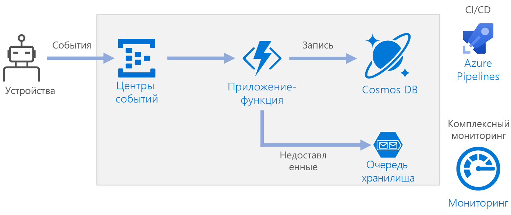

# <a name="serverless-event-processing-using-azure-functions"></a><span data-ttu-id="e007c-103">Обработка событий без использования сервера с помощью Функций Azure</span><span class="sxs-lookup"><span data-stu-id="e007c-103">Serverless event processing using Azure Functions</span></span>

<span data-ttu-id="e007c-104">Эта эталонная архитектура демонстрирует [бессерверную](https://azure.microsoft.com/solutions/serverless/) и управляемую событиями архитектуру, которая принимает поток данных, обрабатывает его и записывает результаты в серверную базу данных.</span><span class="sxs-lookup"><span data-stu-id="e007c-104">This reference architecture shows a [serverless](https://azure.microsoft.com/solutions/serverless/), event-driven architecture that ingests a stream of data, processes the data, and writes the results to a back-end database.</span></span> <span data-ttu-id="e007c-105">Эталонную реализацию для этой архитектуры можно найти на сайте [GitHub][github].</span><span class="sxs-lookup"><span data-stu-id="e007c-105">A reference implementation for this architecture is available on [GitHub][github].</span></span>



## <a name="architecture"></a><span data-ttu-id="e007c-107">Архитектура</span><span class="sxs-lookup"><span data-stu-id="e007c-107">Architecture</span></span>

<span data-ttu-id="e007c-108">**Центры событий** принимают поток данных.</span><span class="sxs-lookup"><span data-stu-id="e007c-108">**Event Hubs** ingests the data stream.</span></span> <span data-ttu-id="e007c-109">Служба [Центры событий][eh] предназначена для сценариев потоковой передачи данных с высокой пропускной способностью.</span><span class="sxs-lookup"><span data-stu-id="e007c-109">[Event Hubs][eh] is designed for high-throughput data streaming scenarios.</span></span>

> [!NOTE]
> <span data-ttu-id="e007c-110">Для сценариев Интернета вещей мы рекомендуем использовать Центр Интернета вещей.</span><span class="sxs-lookup"><span data-stu-id="e007c-110">For IoT scenarios, we recommend IoT Hub.</span></span> <span data-ttu-id="e007c-111">Центр Интернета вещей содержит встроенную конечную точку, которая совместима с API Центров событий Azure, поэтому вы можете использовать любую службу в этой архитектуре без существенных изменений внутренней обработки.</span><span class="sxs-lookup"><span data-stu-id="e007c-111">IoT Hub has a built-in endpoint that’s compatible with the Azure Event Hubs API, so you can use either service in this architecture with no major changes in the backend processing.</span></span> <span data-ttu-id="e007c-112">Дополнительные сведения см. в статье [Подключение устройств Интернета вещей в Azure. Центр Интернета вещей и Центры событий][iot].</span><span class="sxs-lookup"><span data-stu-id="e007c-112">For more information, see [Connecting IoT Devices to Azure: IoT Hub and Event Hubs][iot].</span></span>

<span data-ttu-id="e007c-113">**Приложение-функция**.</span><span class="sxs-lookup"><span data-stu-id="e007c-113">**Function App**.</span></span> <span data-ttu-id="e007c-114">[Функции Azure][functions] — это независимая от сервера служба вычислений.</span><span class="sxs-lookup"><span data-stu-id="e007c-114">[Azure Functions][functions] is a serverless compute option.</span></span> <span data-ttu-id="e007c-115">Она использует управляемую событиями модель, где часть кода ("функция") вызывается триггером.</span><span class="sxs-lookup"><span data-stu-id="e007c-115">It uses an event-driven model, where a piece of code (a “function”) is invoked by a trigger.</span></span> <span data-ttu-id="e007c-116">В этой архитектуре, когда события поступают в Центры событий, они инициируют функцию, которая обрабатывает события и записывает результаты в хранилище.</span><span class="sxs-lookup"><span data-stu-id="e007c-116">In this architecture, when events arrive at Event Hubs, they trigger a function that processes the events and writes the results to storage.</span></span>

<span data-ttu-id="e007c-117">Приложения-функции подходят для обработки отдельных записей из Центров событий.</span><span class="sxs-lookup"><span data-stu-id="e007c-117">Function Apps are suitable for processing individual records from Event Hubs.</span></span> <span data-ttu-id="e007c-118">Для более сложных сценариев обработки потока рассмотрите Apache Spark с использованием Azure Databricks или Azure Stream Analytics.</span><span class="sxs-lookup"><span data-stu-id="e007c-118">For more complex stream processing scenarios, consider Apache Spark using Azure Databricks, or Azure Stream Analytics.</span></span>

<span data-ttu-id="e007c-119">**Cosmos DB**.</span><span class="sxs-lookup"><span data-stu-id="e007c-119">**Cosmos DB**.</span></span> <span data-ttu-id="e007c-120">[Azure Cosmos DB][cosmosdb] — это служба многомодельной базы данных.</span><span class="sxs-lookup"><span data-stu-id="e007c-120">[Cosmos DB][cosmosdb] is a multi-model database service.</span></span> <span data-ttu-id="e007c-121">В этом сценарии функция обработки событий сохраняет записи JSON с помощью [SQL API][cosmosdb-sql] Cosmos DB.</span><span class="sxs-lookup"><span data-stu-id="e007c-121">For this scenario, the event-processing function stores JSON records, using the Cosmos DB [SQL API][cosmosdb-sql].</span></span>

<span data-ttu-id="e007c-122">**Хранилище очередей**.</span><span class="sxs-lookup"><span data-stu-id="e007c-122">**Queue storage**.</span></span> <span data-ttu-id="e007c-123">[Хранилище очередей][queue] используется для недоставленных сообщений.</span><span class="sxs-lookup"><span data-stu-id="e007c-123">[Queue storage][queue] is used for dead letter messages.</span></span> <span data-ttu-id="e007c-124">Если при обработке события возникает ошибка, функция сохраняет данные события в очереди недоставленных сообщений для последующей обработки.</span><span class="sxs-lookup"><span data-stu-id="e007c-124">If an error occurs while processing an event, the function stores the event data in a dead letter queue for later processing.</span></span> <span data-ttu-id="e007c-125">Дополнительные сведения см. в разделе [Рекомендации по обеспечению устойчивости](#resiliency-considerations).</span><span class="sxs-lookup"><span data-stu-id="e007c-125">For more information, see [Resiliency Considerations](#resiliency-considerations).</span></span>

<span data-ttu-id="e007c-126">**Azure Monitor**.</span><span class="sxs-lookup"><span data-stu-id="e007c-126">**Azure Monitor**.</span></span> <span data-ttu-id="e007c-127">[Monitor][monitor] собирает метрики производительности о службах Azure, развернутых в решении.</span><span class="sxs-lookup"><span data-stu-id="e007c-127">[Monitor][monitor] collects performance metrics about the Azure services deployed in the solution.</span></span> <span data-ttu-id="e007c-128">Отобразив эти данные в визуализации на панели мониторинга, можно получить сведения о работоспособности решения.</span><span class="sxs-lookup"><span data-stu-id="e007c-128">By visualizing these in a dashboard, you can get visibility into the health of the solution.</span></span>

<span data-ttu-id="e007c-129">**Azure Pipelines**.</span><span class="sxs-lookup"><span data-stu-id="e007c-129">**Azure Pipelines**.</span></span> <span data-ttu-id="e007c-130">[Pipelines][pipelines] — это служба непрерывной интеграции (CI) и непрерывной поставки (CD), которая выполняет сборку, тестирование и развертывание приложений.</span><span class="sxs-lookup"><span data-stu-id="e007c-130">[Pipelines][pipelines] is a continuous integration (CI) and continuous delivery (CD) service that builds, tests, and deploys the application.</span></span>

## <a name="scalability-considerations"></a><span data-ttu-id="e007c-131">Вопросы масштабируемости</span><span class="sxs-lookup"><span data-stu-id="e007c-131">Scalability considerations</span></span>

### <a name="event-hubs"></a><span data-ttu-id="e007c-132">Центры событий;</span><span class="sxs-lookup"><span data-stu-id="e007c-132">Event Hubs</span></span>

<span data-ttu-id="e007c-133">Пропускная способность Центров событий вычисляется в [единицах пропускной способности][eh-throughput].</span><span class="sxs-lookup"><span data-stu-id="e007c-133">The throughput capacity of Event Hubs is measured in [throughput units][eh-throughput].</span></span> <span data-ttu-id="e007c-134">Вы можете автоматически масштабировать концентратор событий, включив [автоматическое расширение][eh-autoscale]. Это позволит автоматически масштабировать единицы пропускной способности в зависимости от трафика вплоть до заданного максимума.</span><span class="sxs-lookup"><span data-stu-id="e007c-134">You can autoscale an event hub by enabling [auto-inflate][eh-autoscale], which automatically scales the throughput units based on traffic, up to a configured maximum.</span></span>

<span data-ttu-id="e007c-135">[Триггер концентратора событий][eh-trigger] в приложении-функции масштабируется в соответствии с числом секций в концентраторе событий.</span><span class="sxs-lookup"><span data-stu-id="e007c-135">The [Event Hub trigger][eh-trigger] in the function app scales according to the number of partitions in the event hub.</span></span> <span data-ttu-id="e007c-136">Каждой секции назначается один экземпляр функции за раз.</span><span class="sxs-lookup"><span data-stu-id="e007c-136">Each partition is assigned one function instance at a time.</span></span> <span data-ttu-id="e007c-137">Для увеличения пропускной способности получайте события в пакете, а не по одному за раз.</span><span class="sxs-lookup"><span data-stu-id="e007c-137">To maximize throughput, receive the events in a batch, instead of one at a time.</span></span>

### <a name="cosmos-db"></a><span data-ttu-id="e007c-138">База данных Cosmos</span><span class="sxs-lookup"><span data-stu-id="e007c-138">Cosmos DB</span></span>

<span data-ttu-id="e007c-139">Пропускная способность для Cosmos DB измеряется в [единицах запроса][ru] (ЕЗ).</span><span class="sxs-lookup"><span data-stu-id="e007c-139">Throughput capacity for Cosmos DB is measured in [Request Units][ru] (RU).</span></span> <span data-ttu-id="e007c-140">Чтобы масштабировать контейнер Cosmos DB на более чем 10 000 единиц запросов, необходимо указать [ключ секции][partition-key] при создании контейнера и добавить этот ключ в каждый создаваемый документ.</span><span class="sxs-lookup"><span data-stu-id="e007c-140">In order to scale a Cosmos DB container past 10,000 RU, you must specify a [partition key][partition-key] when you create the container, and include the partition key in every document that you create.</span></span>

<span data-ttu-id="e007c-141">Вот некоторые характеристики хорошего ключа секции:</span><span class="sxs-lookup"><span data-stu-id="e007c-141">Here are some characteristics of a good partition key:</span></span>

- <span data-ttu-id="e007c-142">Значение пространства ключа велико.</span><span class="sxs-lookup"><span data-stu-id="e007c-142">The key value space is large.</span></span>
- <span data-ttu-id="e007c-143">Будет существовать равномерное распределение операций чтения и записи на значение ключа, что позволит избежать горячих ключей.</span><span class="sxs-lookup"><span data-stu-id="e007c-143">There will be an even distribution of reads/writes per key value, avoiding hot keys.</span></span>
- <span data-ttu-id="e007c-144">Максимальный объем данных, хранимых для любого отдельного значения ключа, не может превышать максимальный физический размер секции (10 ГБ).</span><span class="sxs-lookup"><span data-stu-id="e007c-144">The maximum data stored for any single key value will not exceed the maximum physical partition size (10 GB).</span></span>
- <span data-ttu-id="e007c-145">Ключ секции для документа не изменится.</span><span class="sxs-lookup"><span data-stu-id="e007c-145">The partition key for a document won't change.</span></span> <span data-ttu-id="e007c-146">Обновить ключ секции для существующего документа невозможно.</span><span class="sxs-lookup"><span data-stu-id="e007c-146">You can't update the partition key on an existing document.</span></span>

<span data-ttu-id="e007c-147">В сценарии для этой эталонной архитектуры функция хранит только один документ для устройства, отправляющего данные.</span><span class="sxs-lookup"><span data-stu-id="e007c-147">In the scenario for this reference architecture, the function stores exactly one document per device that is sending data.</span></span> <span data-ttu-id="e007c-148">Функция постоянно обновляет в документах последнее состояние устройства, используя операцию Upsert.</span><span class="sxs-lookup"><span data-stu-id="e007c-148">The function continually updates the documents with latest device status, using an upsert operation.</span></span> <span data-ttu-id="e007c-149">Идентификатор устройства является подходящим ключом секции для этого сценария, так как записи будут равномерно распределены по ключам, а размер каждой секции будет строго ограничен, потому что для каждого значения ключа существует отдельный документ.</span><span class="sxs-lookup"><span data-stu-id="e007c-149">Device ID is a good partition key for this scenario, because writes will be evenly distributed across the keys, and the size of each partition will be strictly bounded, because there is a single document for each key value.</span></span> <span data-ttu-id="e007c-150">Дополнительные сведения о ключах секций см. в статье [Секционирование и масштабирование в Azure Cosmos DB][cosmosdb-scale].</span><span class="sxs-lookup"><span data-stu-id="e007c-150">For more information about partition keys, see [Partition and scale in Azure Cosmos DB][cosmosdb-scale].</span></span>

## <a name="resiliency-considerations"></a><span data-ttu-id="e007c-151">Рекомендации по обеспечению устойчивости</span><span class="sxs-lookup"><span data-stu-id="e007c-151">Resiliency considerations</span></span>

<span data-ttu-id="e007c-152">При использовании триггера Центров событий с Функциями перехват исключений происходит в цикле обработки.</span><span class="sxs-lookup"><span data-stu-id="e007c-152">When using the Event Hubs trigger with Functions, catch exceptions within your processing loop.</span></span> <span data-ttu-id="e007c-153">Если возникает необработанное исключение, среда выполнения Функций не выполняет повторную попытку отправки сообщения.</span><span class="sxs-lookup"><span data-stu-id="e007c-153">If an unhandled exception occurs, the Functions runtime does not retry the messages.</span></span> <span data-ttu-id="e007c-154">Если сообщение не может быть обработано, поместите его в очередь недоставленных сообщений.</span><span class="sxs-lookup"><span data-stu-id="e007c-154">If a message cannot be processed, put the message into a dead letter queue.</span></span> <span data-ttu-id="e007c-155">Используйте внешний процесс, чтобы изучить сообщения и определить корректирующее действие.</span><span class="sxs-lookup"><span data-stu-id="e007c-155">Use an out-of-band process to examine the messages and determine corrective action.</span></span>

<span data-ttu-id="e007c-156">В следующем коде показано, как функция приема перехватывает исключения и помещает необработанные сообщения в очередь недоставленных сообщений.</span><span class="sxs-lookup"><span data-stu-id="e007c-156">The following code shows how the ingestion function catches exceptions and puts unprocessed messages onto a dead letter queue.</span></span>

```csharp
[FunctionName("RawTelemetryFunction")]
[StorageAccount("DeadLetterStorage")]
public static async Task RunAsync(
    [EventHubTrigger("%EventHubName%", Connection = "EventHubConnection", ConsumerGroup ="%EventHubConsumerGroup%")]EventData[] messages,
    [Queue("deadletterqueue")] IAsyncCollector<DeadLetterMessage> deadLetterMessages,
    ILogger logger)
{
    foreach (var message in messages)
    {
        DeviceState deviceState = null;

        try
        {
            deviceState = telemetryProcessor.Deserialize(message.Body.Array, logger);
        }
        catch (Exception ex)
        {
            logger.LogError(ex, "Error deserializing message", message.SystemProperties.PartitionKey, message.SystemProperties.SequenceNumber);
            await deadLetterMessages.AddAsync(new DeadLetterMessage { Issue = ex.Message, EventData = message });
        }

        try
        {
            await stateChangeProcessor.UpdateState(deviceState, logger);
        }
        catch (Exception ex)
        {
            logger.LogError(ex, "Error updating status document", deviceState);
            await deadLetterMessages.AddAsync(new DeadLetterMessage { Issue = ex.Message, EventData = message, DeviceState = deviceState });
        }
    }
}
```

<span data-ttu-id="e007c-157">Обратите внимание, что функция использует [выходную привязку хранилища очередей][queue-binding], чтобы поместить элементы в очередь.</span><span class="sxs-lookup"><span data-stu-id="e007c-157">Notice that the function uses the [Queue storage output binding][queue-binding] to put items in the queue.</span></span>

<span data-ttu-id="e007c-158">Приведенный выше код также регистрирует исключения в Application Insights.</span><span class="sxs-lookup"><span data-stu-id="e007c-158">The code shown above also logs exceptions to Application Insights.</span></span> <span data-ttu-id="e007c-159">Ключ секции и порядковый номер можно использовать для корреляции сообщений в очереди недоставленных сообщений с исключениями в журналах.</span><span class="sxs-lookup"><span data-stu-id="e007c-159">You can use the partition key and sequence number to correlate dead letter messages with the exceptions in the logs.</span></span>

<span data-ttu-id="e007c-160">Сообщения в очереди недоставленных сообщений должны содержать достаточно информации, чтобы можно было понять контекст ошибки.</span><span class="sxs-lookup"><span data-stu-id="e007c-160">Messages in the dead letter queue should have enough information so that you can understand the context of error.</span></span> <span data-ttu-id="e007c-161">В этом примере класс `DeadLetterMessage` содержит сообщение об исключении, исходные данные события и десериализованное сообщение о событии (если доступно).</span><span class="sxs-lookup"><span data-stu-id="e007c-161">In this example, the `DeadLetterMessage` class contains the exception message, the original event data, and the deserialized event message (if available).</span></span>

```csharp
public class DeadLetterMessage
{
    public string Issue { get; set; }
    public EventData EventData { get; set; }
    public DeviceState DeviceState { get; set; }
}
```

<span data-ttu-id="e007c-162">Используйте [Azure Monitor][monitor] для мониторинга концентратора событий.</span><span class="sxs-lookup"><span data-stu-id="e007c-162">Use [Azure Monitor][monitor] to monitor the event hub.</span></span> <span data-ttu-id="e007c-163">Если вы видите, что есть входные данные, но нет выходных, это означает, что сообщения не обрабатываются.</span><span class="sxs-lookup"><span data-stu-id="e007c-163">If you see there is input but no output, it means that messages are not being processed.</span></span> <span data-ttu-id="e007c-164">В таком случае перейдите в [Log Analytics][log-analytics] и поищите исключения или другие ошибки.</span><span class="sxs-lookup"><span data-stu-id="e007c-164">In that case, go into [Log Analytics][log-analytics] and look for exceptions or other errors.</span></span>

## <a name="disaster-recovery-considerations"></a><span data-ttu-id="e007c-165">Рекомендации по аварийному восстановлению</span><span class="sxs-lookup"><span data-stu-id="e007c-165">Disaster recovery considerations</span></span>

<span data-ttu-id="e007c-166">Представленное здесь развертывание расположено в одном регионе Azure.</span><span class="sxs-lookup"><span data-stu-id="e007c-166">The deployment shown here resides in a single Azure region.</span></span> <span data-ttu-id="e007c-167">Для более гибкого подхода к аварийному восстановлению воспользуйтесь функциями геораспределения в различных службах:</span><span class="sxs-lookup"><span data-stu-id="e007c-167">For a more resilient approach to disaster-recovery, take advantage of geo-distribution features in the various services:</span></span>

- <span data-ttu-id="e007c-168">**Центры событий**.</span><span class="sxs-lookup"><span data-stu-id="e007c-168">**Event Hubs**.</span></span> <span data-ttu-id="e007c-169">Создайте два пространства имен Центров событий: основное (активное) и дополнительное (пассивное).</span><span class="sxs-lookup"><span data-stu-id="e007c-169">Create two Event Hubs namespaces, a primary (active) namespace and a secondary (passive) namespace.</span></span> <span data-ttu-id="e007c-170">Сообщения автоматически перенаправляются в активное пространство имен, если вы не выполните отработку отказа в дополнительное пространство имен.</span><span class="sxs-lookup"><span data-stu-id="e007c-170">Messages are automatically routed to the active namespace unless you fail over to the secondary namespace.</span></span> <span data-ttu-id="e007c-171">Дополнительные сведения см. в статье [Географическое аварийное восстановление в Центрах событий Azure][eh-dr].</span><span class="sxs-lookup"><span data-stu-id="e007c-171">For more information, see [Azure Event Hubs Geo-disaster recovery][eh-dr].</span></span>

- <span data-ttu-id="e007c-172">**Приложение-функция**.</span><span class="sxs-lookup"><span data-stu-id="e007c-172">**Function App**.</span></span> <span data-ttu-id="e007c-173">Разверните второе приложение-функцию, которое ожидает считывания из дополнительного пространства имен Центров событий.</span><span class="sxs-lookup"><span data-stu-id="e007c-173">Deploy a second function app that is waiting to read from the secondary Event Hubs namespace.</span></span> <span data-ttu-id="e007c-174">Эта функция выполняет запись в дополнительную учетную запись хранения для очереди недоставленных сообщений.</span><span class="sxs-lookup"><span data-stu-id="e007c-174">This function writes to a secondary storage account for dead letter queue.</span></span>

- <span data-ttu-id="e007c-175">**Cosmos DB**.</span><span class="sxs-lookup"><span data-stu-id="e007c-175">**Cosmos DB**.</span></span> <span data-ttu-id="e007c-176">Cosmos DB поддерживает [несколько основных регионов][cosmosdb-geo], что позволяет записывать данные в любой регион, добавляемый в учетную запись Cosmos DB.</span><span class="sxs-lookup"><span data-stu-id="e007c-176">Cosmos DB supports [multiple master regions][cosmosdb-geo], which enables writes to any region that you add to your Cosmos DB account.</span></span> <span data-ttu-id="e007c-177">Если не включить несколько источников, можно по-прежнему выполнить отработку отказа в основной регион записи.</span><span class="sxs-lookup"><span data-stu-id="e007c-177">If you don’t enable multi-master, you can still fail over the primary write region.</span></span> <span data-ttu-id="e007c-178">Клиентские пакеты SDK Cosmos DB и привязки функций Azure автоматически выполняют отработку отказа, поэтому нет необходимости обновлять параметры конфигурации приложения.</span><span class="sxs-lookup"><span data-stu-id="e007c-178">The Cosmos DB client SDKs and the Azure Function bindings automatically handle the failover, so you don’t need to update any application configuration settings.</span></span>

- <span data-ttu-id="e007c-179">**Хранилище Azure.**</span><span class="sxs-lookup"><span data-stu-id="e007c-179">**Azure Storage**.</span></span> <span data-ttu-id="e007c-180">Используйте хранилище [RA-GRS][ra-grs] для очереди недоставленных сообщений.</span><span class="sxs-lookup"><span data-stu-id="e007c-180">Use [RA-GRS][ra-grs] storage for the dead letter queue.</span></span> <span data-ttu-id="e007c-181">В таком случае создается реплика только для чтения в другом регионе.</span><span class="sxs-lookup"><span data-stu-id="e007c-181">This creates a read-only replica in another region.</span></span> <span data-ttu-id="e007c-182">Если основной регион становится недоступным, вы можете считывать элементы, находящиеся в очереди.</span><span class="sxs-lookup"><span data-stu-id="e007c-182">If the primary region becomes unavailable, you can read the items currently in the queue.</span></span> <span data-ttu-id="e007c-183">Кроме того, можно подготовить другую учетную запись хранения в дополнительном регионе, в которую функция сможет записывать данные после отработки отказа.</span><span class="sxs-lookup"><span data-stu-id="e007c-183">In addition, provision another storage account in the secondary region that the function can write to after a fail-over.</span></span>

## <a name="deploy-the-solution"></a><span data-ttu-id="e007c-184">Развертывание решения</span><span class="sxs-lookup"><span data-stu-id="e007c-184">Deploy the solution</span></span>

<span data-ttu-id="e007c-185">Чтобы развернуть эту эталонную архитектуру, просмотрите [файл сведений на GitHub][readme].</span><span class="sxs-lookup"><span data-stu-id="e007c-185">To deploy this reference architecture, view the [GitHub readme][readme].</span></span>

<!-- links -->

[cosmosdb]: /azure/cosmos-db/introduction
[cosmosdb-geo]: /azure/cosmos-db/distribute-data-globally
[cosmosdb-scale]: /azure/cosmos-db/partition-data
[cosmosdb-sql]: /azure/cosmos-db/sql-api-introduction
[eh]: /azure/event-hubs/
[eh-autoscale]: /azure/event-hubs/event-hubs-auto-inflate
[eh-dr]: /azure/event-hubs/event-hubs-geo-dr
[eh-throughput]: /azure/event-hubs/event-hubs-features#throughput-units
[eh-trigger]: /azure/azure-functions/functions-bindings-event-hubs
[functions]: /azure/azure-functions/functions-overview
[iot]: /azure/iot-hub/iot-hub-compare-event-hubs
[log-analytics]: /azure/log-analytics/log-analytics-queries
[monitor]: /azure/azure-monitor/overview
[partition-key]: /azure/cosmos-db/partition-data
[pipelines]: /azure/devops/pipelines/index
[queue]: /azure/storage/queues/storage-queues-introduction
[queue-binding]: /azure/azure-functions/functions-bindings-storage-queue#output
[ra-grs]: /azure/storage/common/storage-redundancy-grs
[ru]: /azure/cosmos-db/request-units

[github]: https://github.com/mspnp/serverless-reference-implementation
[readme]: https://github.com/mspnp/serverless-reference-implementation/blob/master/README.md
