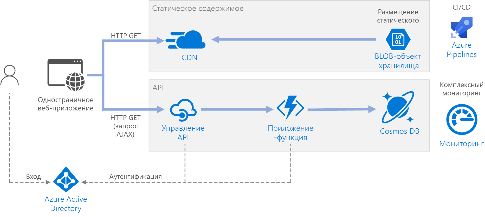

# <a name="serverless-web-application-on-azure"></a><span data-ttu-id="862d2-103">Бессерверное веб-приложение в Azure</span><span class="sxs-lookup"><span data-stu-id="862d2-103">Serverless web application on Azure</span></span>

<span data-ttu-id="862d2-104">Эталонная архитектура, которая демонстрирует [бессерверное](https://azure.microsoft.com/solutions/serverless/) веб-приложение.</span><span class="sxs-lookup"><span data-stu-id="862d2-104">This reference architecture shows a [serverless](https://azure.microsoft.com/solutions/serverless/) web application.</span></span> <span data-ttu-id="862d2-105">Приложение передает статическое содержимое из хранилища BLOB-объектов Azure, а также реализует программный интерфейс с помощью Функций Azure.</span><span class="sxs-lookup"><span data-stu-id="862d2-105">The application serves static content from Azure Blob Storage, and implements an API using Azure Functions.</span></span> <span data-ttu-id="862d2-106">API считывает данные из Cosmos DB и возвращает результаты в веб-приложение.</span><span class="sxs-lookup"><span data-stu-id="862d2-106">The API reads data from Cosmos DB and returns the results to the web app.</span></span> <span data-ttu-id="862d2-107">Эталонную реализацию для этой архитектуры можно найти на сайте [GitHub][github].</span><span class="sxs-lookup"><span data-stu-id="862d2-107">A reference implementation for this architecture is available on [GitHub][github].</span></span>



<span data-ttu-id="862d2-109">Термин "бессерверный" может иметь два различных значения, которые тем не менее связаны между собой:</span><span class="sxs-lookup"><span data-stu-id="862d2-109">The term serverless has two distinct but related meanings:</span></span>

- <span data-ttu-id="862d2-110">**Серверная часть как услуга** (BaaS).</span><span class="sxs-lookup"><span data-stu-id="862d2-110">**Backend as a service** (BaaS).</span></span> <span data-ttu-id="862d2-111">Серверные облачные службы, такие как базы данных и хранилища, предоставляют программные интерфейсы, которые позволяют клиентским приложениям напрямую подключаться к этим службам.</span><span class="sxs-lookup"><span data-stu-id="862d2-111">Backend cloud services, such as databases and storage, provide APIs that enable client applications to connect directly to these services.</span></span>
- <span data-ttu-id="862d2-112">**Функции как услуга** (FaaS).</span><span class="sxs-lookup"><span data-stu-id="862d2-112">**Functions as a service** (FaaS).</span></span> <span data-ttu-id="862d2-113">В этой модели "функция" представляет собой фрагмент кода, который развертывается в облаке и выполняется в среде узла, которая полностью абстрагирует серверы, на которых запускается код.</span><span class="sxs-lookup"><span data-stu-id="862d2-113">In this model, a "function" is a piece of code that is deployed to the cloud and runs inside a hosting environment that completely abstracts the servers that run the code.</span></span>

<span data-ttu-id="862d2-114">Оба определения подразумевают общую идею о том, что разработчикам и персоналу DevOps не нужно развертывать, настраивать или администрировать серверы.</span><span class="sxs-lookup"><span data-stu-id="862d2-114">Both definitions have in common the idea that developers and DevOps personnel don't need to deploy, configure, or manage servers.</span></span> <span data-ttu-id="862d2-115">Эта эталонная архитектура фокусируется на FaaS с использованием Функций Azure, хотя обслуживание веб-содержимого из хранилища BLOB-объектов Azure является примером BaaS.</span><span class="sxs-lookup"><span data-stu-id="862d2-115">This reference architecture focuses on FaaS using Azure Functions, although serving web content from Azure Blob Storage is an example of BaaS.</span></span> <span data-ttu-id="862d2-116">Ниже приведены некоторые важные характеристики FaaS:</span><span class="sxs-lookup"><span data-stu-id="862d2-116">Some important characteristics of FaaS are:</span></span>

1. <span data-ttu-id="862d2-117">Вычислительные ресурсы динамически распределяются платформой по мере необходимости.</span><span class="sxs-lookup"><span data-stu-id="862d2-117">Compute resources are allocated dynamically as needed by the platform.</span></span>
1. <span data-ttu-id="862d2-118">Тарификация на основе использования: вы платите только за вычислительные ресурсы, которые используются для выполнения кода.</span><span class="sxs-lookup"><span data-stu-id="862d2-118">Consumption-based pricing: You are charged only for the compute resources used to execute your code.</span></span>
1. <span data-ttu-id="862d2-119">Вычислительные ресурсы масштабируются по запросу на основе трафика, и разработчику при этом не нужно выполнять какую-либо конфигурацию.</span><span class="sxs-lookup"><span data-stu-id="862d2-119">The compute resources scale on demand based on traffic, without the developer needing to do any configuration.</span></span>

<span data-ttu-id="862d2-120">Функции выполняются при возникновении внешнего триггера, например HTTP-запроса или сообщения, поступающего в очередь.</span><span class="sxs-lookup"><span data-stu-id="862d2-120">Functions are executed when an external trigger occurs, such as an HTTP request or a message arriving on a queue.</span></span> <span data-ttu-id="862d2-121">Благодаря этому [тип управляемой событиями архитектуры][event-driven] является естественным для бессерверных архитектур.</span><span class="sxs-lookup"><span data-stu-id="862d2-121">This makes an [event-driven architecture style][event-driven] natural for serverless architectures.</span></span> <span data-ttu-id="862d2-122">Чтобы координировать работу между компонентами в архитектуре, рассмотрите возможность использования брокеров сообщений или шаблонов публикаций и подписок.</span><span class="sxs-lookup"><span data-stu-id="862d2-122">To coordinate work between components in the architecture, consider using message brokers or pub/sub patterns.</span></span> <span data-ttu-id="862d2-123">Дополнительные сведения о технологиях обмена сообщениями Azure см. в статье [Выбор между службами обмена сообщениями Azure][azure-messaging].</span><span class="sxs-lookup"><span data-stu-id="862d2-123">For help choosing between messaging technologies in Azure, see [Choose between Azure services that deliver messages][azure-messaging].</span></span>

## <a name="architecture"></a><span data-ttu-id="862d2-124">Архитектура</span><span class="sxs-lookup"><span data-stu-id="862d2-124">Architecture</span></span>

<span data-ttu-id="862d2-125">Она состоит из следующих компонентов:</span><span class="sxs-lookup"><span data-stu-id="862d2-125">The architecture consists of the following components:</span></span>

<span data-ttu-id="862d2-126">**Хранилище больших двоичных объектов**.</span><span class="sxs-lookup"><span data-stu-id="862d2-126">**Blob Storage**.</span></span> <span data-ttu-id="862d2-127">Статическое веб-содержимое, такое как файлы HTML, CSS и JavaScript, сохраняется в хранилище BLOB-объектов Azure и обслуживается клиентами с помощью [размещения статических веб-сайтов][static-hosting].</span><span class="sxs-lookup"><span data-stu-id="862d2-127">Static web content, such as HTML, CSS, and JavaScript files, are stored in Azure Blob Storage and served to clients by using [static website hosting][static-hosting].</span></span> <span data-ttu-id="862d2-128">Все динамическое взаимодействие происходит с помощью кода JavaScript, который вызывает API серверной части.</span><span class="sxs-lookup"><span data-stu-id="862d2-128">All dynamic interaction happens through JavaScript code making calls to the backend APIs.</span></span> <span data-ttu-id="862d2-129">Для отображения веб-страницы не используется серверный код.</span><span class="sxs-lookup"><span data-stu-id="862d2-129">There is no server-side code to render the web page.</span></span> <span data-ttu-id="862d2-130">Размещение статических веб-сайтов поддерживает индексированные документы и настраиваемые страницы ошибок 404.</span><span class="sxs-lookup"><span data-stu-id="862d2-130">Static website hosting supports index documents and custom 404 error pages.</span></span>

> [!NOTE]
> <span data-ttu-id="862d2-131">Размещение статических веб-сайтов в данный момент предоставляется в [предварительной версии][static-hosting-preview].</span><span class="sxs-lookup"><span data-stu-id="862d2-131">Static website hosting is currently in [preview][static-hosting-preview].</span></span>

<span data-ttu-id="862d2-132">**CDN.**</span><span class="sxs-lookup"><span data-stu-id="862d2-132">**CDN**.</span></span> <span data-ttu-id="862d2-133">Используйте [сеть доставки содержимого Azure][cdn] (CDN), чтобы выполнять кэширование содержимого с меньшей задержкой и более быстрой доставкой, а также предоставлением конечной точки HTTPS.</span><span class="sxs-lookup"><span data-stu-id="862d2-133">Use [Azure Content Delivery Network][cdn] (CDN) to cache content for lower latency and faster delivery of content, as well as providing an HTTPS endpoint.</span></span>

<span data-ttu-id="862d2-134">**Приложения-функции**.</span><span class="sxs-lookup"><span data-stu-id="862d2-134">**Function Apps**.</span></span> <span data-ttu-id="862d2-135">[Функции Azure][functions] — это независимая от сервера служба вычислений.</span><span class="sxs-lookup"><span data-stu-id="862d2-135">[Azure Functions][functions] is a serverless compute option.</span></span> <span data-ttu-id="862d2-136">Она использует управляемую событиями модель, где часть кода ("функция") вызывается триггером.</span><span class="sxs-lookup"><span data-stu-id="862d2-136">It uses an event-driven model, where a piece of code (a "function") is invoked by a trigger.</span></span> <span data-ttu-id="862d2-137">В этой архитектуре функция вызывается, когда клиент делает HTTP-запрос.</span><span class="sxs-lookup"><span data-stu-id="862d2-137">In this architecture, the function is invoked when a client makes an HTTP request.</span></span> <span data-ttu-id="862d2-138">Запрос всегда маршрутизируется через шлюз API, описанный ниже.</span><span class="sxs-lookup"><span data-stu-id="862d2-138">The request is always routed through an API gateway, described below.</span></span>

<span data-ttu-id="862d2-139">**Служба управления API**.</span><span class="sxs-lookup"><span data-stu-id="862d2-139">**API Management**.</span></span> <span data-ttu-id="862d2-140">[Управление API][apim] предоставляет шлюз API, который находится перед функцией HTTP.</span><span class="sxs-lookup"><span data-stu-id="862d2-140">[API Management][apim] provides a API gateway that sits in front of the HTTP function.</span></span> <span data-ttu-id="862d2-141">Службу управления API можно использовать для публикации программных интерфейсов, используемых клиентскими приложениями, а также для управления ими.</span><span class="sxs-lookup"><span data-stu-id="862d2-141">You can use API Management to publish and manage APIs used by client applications.</span></span> <span data-ttu-id="862d2-142">Использование шлюза помогает отделить внешнее приложение от серверных API.</span><span class="sxs-lookup"><span data-stu-id="862d2-142">Using a gateway helps to decouple the front-end application from the back-end APIs.</span></span> <span data-ttu-id="862d2-143">Например, служба управления API может переписывать URL-адреса, преобразовывать запросы до того, как они попадут на сервер, задавать заголовки запросов или ответов и так далее.</span><span class="sxs-lookup"><span data-stu-id="862d2-143">For example, API Management can rewrite URLs, transform requests before they reach the backend, set request or response headers, and so forth.</span></span>

<span data-ttu-id="862d2-144">Управление API также может использоваться для реализации сквозных задач, таких как:</span><span class="sxs-lookup"><span data-stu-id="862d2-144">API Management can also be used to implement cross-cutting concerns such as:</span></span>

- <span data-ttu-id="862d2-145">Принудительное применение квот потребления и ограничений скорости.</span><span class="sxs-lookup"><span data-stu-id="862d2-145">Enforcing usage quotas and rate limits</span></span>
- <span data-ttu-id="862d2-146">Проверка токенов OAuth для аутентификации.</span><span class="sxs-lookup"><span data-stu-id="862d2-146">Validating OAuth tokens for authentication</span></span>
- <span data-ttu-id="862d2-147">Включение запросов независимо от источника (CORS).</span><span class="sxs-lookup"><span data-stu-id="862d2-147">Enabling cross-origin requests (CORS)</span></span>
- <span data-ttu-id="862d2-148">Кэширование ответов.</span><span class="sxs-lookup"><span data-stu-id="862d2-148">Caching responses</span></span>
- <span data-ttu-id="862d2-149">Мониторинг и ведение журнала запросов.</span><span class="sxs-lookup"><span data-stu-id="862d2-149">Monitoring and logging requests</span></span>

<span data-ttu-id="862d2-150">Если вам не нужны все функциональные возможности, предоставляемые службой управления API, можно использовать [прокси-серверы Функций][functions-proxy].</span><span class="sxs-lookup"><span data-stu-id="862d2-150">If you don't need all of the functionality provided by API Management, another option is to use [Functions Proxies][functions-proxy].</span></span> <span data-ttu-id="862d2-151">Эта возможность Функций Azure позволяет вам определять единую поверхность API для нескольких приложений-функций, создавая маршруты к серверным функциям.</span><span class="sxs-lookup"><span data-stu-id="862d2-151">This feature of Azure Functions lets you define a single API surface for multiple function apps, by creating routes to back-end functions.</span></span> <span data-ttu-id="862d2-152">Прокси-серверы Функций также могут выполнять ограниченные преобразования запросов и ответов HTTP.</span><span class="sxs-lookup"><span data-stu-id="862d2-152">Function proxies can also perform limited transformations on the HTTP request and response.</span></span> <span data-ttu-id="862d2-153">Тем не менее они не обеспечивают те же расширенные функциональные возможности управления API на основе политик.</span><span class="sxs-lookup"><span data-stu-id="862d2-153">However, they don't provide the same rich policy-based capabilities of API Management.</span></span>

<span data-ttu-id="862d2-154">**Cosmos DB**.</span><span class="sxs-lookup"><span data-stu-id="862d2-154">**Cosmos DB**.</span></span> <span data-ttu-id="862d2-155">[Azure Cosmos DB][cosmosdb] — это служба многомодельной базы данных.</span><span class="sxs-lookup"><span data-stu-id="862d2-155">[Cosmos DB][cosmosdb] is a multi-model database service.</span></span> <span data-ttu-id="862d2-156">Для этого сценария приложение-функция извлекает документы из Cosmos DB в ответ на запросы HTTP GET от клиента.</span><span class="sxs-lookup"><span data-stu-id="862d2-156">For this scenario, the function application fetches documents from Cosmos DB in response to HTTP GET requests from the client.</span></span>

<span data-ttu-id="862d2-157">**Azure Active Directory** (Azure AD).</span><span class="sxs-lookup"><span data-stu-id="862d2-157">**Azure Active Directory** (Azure AD).</span></span> <span data-ttu-id="862d2-158">Пользователи входят в веб-приложение, используя свои учетные данные Azure AD.</span><span class="sxs-lookup"><span data-stu-id="862d2-158">Users sign into the web application by using their Azure AD credentials.</span></span> <span data-ttu-id="862d2-159">Azure AD возвращает маркер доступа для API, используемый веб-приложением для проверки подлинности запросов API (см. раздел [Проверка подлинности](#authentication)).</span><span class="sxs-lookup"><span data-stu-id="862d2-159">Azure AD returns an access token for the API, which the web application uses to authenticate API requests (see [Authentication](#authentication)).</span></span>

<span data-ttu-id="862d2-160">**Azure Monitor**.</span><span class="sxs-lookup"><span data-stu-id="862d2-160">**Azure Monitor**.</span></span> <span data-ttu-id="862d2-161">[Monitor][monitor] собирает метрики производительности о службах Azure, развернутых в решении.</span><span class="sxs-lookup"><span data-stu-id="862d2-161">[Monitor][monitor] collects performance metrics about the Azure services deployed in the solution.</span></span> <span data-ttu-id="862d2-162">Отобразив эти данные в визуализации на панели мониторинга, можно получить сведения о работоспособности решения.</span><span class="sxs-lookup"><span data-stu-id="862d2-162">By visualizing these in a dashboard, you can get visibility into the health of the solution.</span></span> <span data-ttu-id="862d2-163">Monitor также собирает журналы приложений.</span><span class="sxs-lookup"><span data-stu-id="862d2-163">It also collected application logs.</span></span>

<span data-ttu-id="862d2-164">**Azure Pipelines**.</span><span class="sxs-lookup"><span data-stu-id="862d2-164">**Azure Pipelines**.</span></span> <span data-ttu-id="862d2-165">[Pipelines][pipelines] — это служба непрерывной интеграции (CI) и непрерывной поставки (CD), которая выполняет сборку, тестирование и развертывание приложений.</span><span class="sxs-lookup"><span data-stu-id="862d2-165">[Pipelines][pipelines] is a continuous integration (CI) and continuous delivery (CD) service that builds, tests, and deploys the application.</span></span>

## <a name="recommendations"></a><span data-ttu-id="862d2-166">Рекомендации</span><span class="sxs-lookup"><span data-stu-id="862d2-166">Recommendations</span></span>

### <a name="function-app-plans"></a><span data-ttu-id="862d2-167">Планы приложения-функции</span><span class="sxs-lookup"><span data-stu-id="862d2-167">Function App plans</span></span>

<span data-ttu-id="862d2-168">Функции Azure поддерживают две модели размещения.</span><span class="sxs-lookup"><span data-stu-id="862d2-168">Azure Functions supports two hosting models.</span></span> <span data-ttu-id="862d2-169">**План потребления** автоматически выделяет вычислительную мощность при выполнении кода.</span><span class="sxs-lookup"><span data-stu-id="862d2-169">With the **consumption plan**, compute power is automatically allocated when your code is running.</span></span>  <span data-ttu-id="862d2-170">В плане **службы приложений** для кода выделяется набор виртуальных машин.</span><span class="sxs-lookup"><span data-stu-id="862d2-170">With the **App Service** plan, a set of VMs are allocated for your code.</span></span> <span data-ttu-id="862d2-171">План службы приложений определяет число и размер виртуальных машин.</span><span class="sxs-lookup"><span data-stu-id="862d2-171">The App Service plan defines the number of VMs and the VM size.</span></span>

<span data-ttu-id="862d2-172">Обратите внимание, что план службы приложений не является *бессерверным* в соответствии с определением, указанным выше.</span><span class="sxs-lookup"><span data-stu-id="862d2-172">Note that the App Service plan is not strictly *serverless*, according to the definition given above.</span></span> <span data-ttu-id="862d2-173">Модель программирования одна и та же, однако тот же код функции может выполняться как в плане потребления, так и в плане службы приложений.</span><span class="sxs-lookup"><span data-stu-id="862d2-173">The programming model is the same, however &mdash; the same function code can run in both a consumption plan and an App Service plan.</span></span>

<span data-ttu-id="862d2-174">Ниже приведены некоторые факторы, которые следует учитывать при выборе подходящего плана для использования.</span><span class="sxs-lookup"><span data-stu-id="862d2-174">Here are some factors to consider when choosing which type of plan to use:</span></span>

- <span data-ttu-id="862d2-175">**Холодный запуск**.</span><span class="sxs-lookup"><span data-stu-id="862d2-175">**Cold start**.</span></span> <span data-ttu-id="862d2-176">В плане потребления функция, которая не вызывалась недавно, в следующий раз будет вызвана с дополнительной задержкой.</span><span class="sxs-lookup"><span data-stu-id="862d2-176">With the consumption plan, a function that hasn't been invoked recently will incur some additional latency the next time it runs.</span></span> <span data-ttu-id="862d2-177">Эта дополнительная задержка обусловлена ​​распределением и подготовкой среды выполнения.</span><span class="sxs-lookup"><span data-stu-id="862d2-177">This additional latency is due to allocating and preparing the runtime environment.</span></span> <span data-ttu-id="862d2-178">Обычно это занимает несколько секунд, но зависит от нескольких факторов, в том числе от количества зависимостей, которые необходимо загрузить.</span><span class="sxs-lookup"><span data-stu-id="862d2-178">It is usually on the order of seconds but depends on several factors, including the number of dependencies that need to be loaded.</span></span> <span data-ttu-id="862d2-179">Дополнительные сведения см. в статье о [холодном запуске в бессерверной архитектуре][functions-cold-start].</span><span class="sxs-lookup"><span data-stu-id="862d2-179">For more information, see [Understanding Serverless Cold Start][functions-cold-start].</span></span> <span data-ttu-id="862d2-180">Холодный запуск обычно больше относится к интерактивным (HTTP-триггеры), чем к асинхронным рабочим нагрузкам, связанным с сообщениями (триггеры очереди или концентраторов событий), потому что дополнительная задержка наблюдается непосредственно пользователями.</span><span class="sxs-lookup"><span data-stu-id="862d2-180">Cold start is usually more of a concern for interactive workloads (HTTP triggers) than asynchronous message-driven workloads (queue or event hubs triggers), because the additional latency is directly observed by users.</span></span>
- <span data-ttu-id="862d2-181">**Период времени ожидания**.</span><span class="sxs-lookup"><span data-stu-id="862d2-181">**Timeout period**.</span></span>  <span data-ttu-id="862d2-182">В плане потребления функция должна выполняться в течение [настроенного][functions-timeout] времени ожидания (максимум до 10 минут).</span><span class="sxs-lookup"><span data-stu-id="862d2-182">In the consumption plan, a function execution times out after a [configurable][functions-timeout] period of time (to a maximum of 10 minutes)</span></span>
- <span data-ttu-id="862d2-183">**Изоляция виртуальной сети**.</span><span class="sxs-lookup"><span data-stu-id="862d2-183">**Virtual network isolation**.</span></span> <span data-ttu-id="862d2-184">Использование плана службы приложений позволяет выполнять функции внутри [среды службы приложений][ase], которая представляет собой выделенную и изолированную среду размещения.</span><span class="sxs-lookup"><span data-stu-id="862d2-184">Using an App Service plan allows functions to run inside of an [App Service Environment][ase], which is a dedicated and isolated hosting environment.</span></span>
- <span data-ttu-id="862d2-185">**Модель ценообразования**.</span><span class="sxs-lookup"><span data-stu-id="862d2-185">**Pricing model**.</span></span> <span data-ttu-id="862d2-186">В плане потребления счета выставляются по количеству выполнений и потреблению ресурсов (память &times; время выполнения).</span><span class="sxs-lookup"><span data-stu-id="862d2-186">The consumption plan is billed by the number of executions and resource consumption (memory &times; execution time).</span></span> <span data-ttu-id="862d2-187">В плане службы приложений счета выставляются ежечасно на основе номера SKU экземпляра виртуальной машины.</span><span class="sxs-lookup"><span data-stu-id="862d2-187">The App Service plan is billed hourly based on VM instance SKU.</span></span> <span data-ttu-id="862d2-188">Часто план потребления может быть дешевле, чем план службы приложений, так как вы платите только за те ресурсы вычислений, которые используете.</span><span class="sxs-lookup"><span data-stu-id="862d2-188">Often, the consumption plan can be cheaper than an App Service plan, because you pay only for the compute resources that you use.</span></span> <span data-ttu-id="862d2-189">Это особенно верно в случаях, если в трафике наблюдаются пики и спады.</span><span class="sxs-lookup"><span data-stu-id="862d2-189">This is especially true if your traffic experiences peaks and troughs.</span></span> <span data-ttu-id="862d2-190">Однако если в приложении наблюдается постоянная высокая пропускная способность, план службы приложений может стоить меньше, чем план потребления.</span><span class="sxs-lookup"><span data-stu-id="862d2-190">However, if an application experiences constant high-volume throughput, an App Service plan may cost less than the consumption plan.</span></span>
- <span data-ttu-id="862d2-191">**Масштабирование**.</span><span class="sxs-lookup"><span data-stu-id="862d2-191">**Scaling**.</span></span> <span data-ttu-id="862d2-192">Большим преимуществом модели потребления является то, что она масштабируется динамически по мере необходимости в зависимости от входящего трафика.</span><span class="sxs-lookup"><span data-stu-id="862d2-192">A big advantage of the consumption model is that it scales dynamically as needed, based on the incoming traffic.</span></span> <span data-ttu-id="862d2-193">Хотя это масштабирование происходит быстро, есть еще период постепенного повышения производительности.</span><span class="sxs-lookup"><span data-stu-id="862d2-193">While this scaling occurs quickly, there is still a ramp-up period.</span></span> <span data-ttu-id="862d2-194">Для некоторых рабочих нагрузок может потребоваться намеренная избыточная подготовка виртуальных машин, чтобы можно было обрабатывать всплески трафика без периода нарастания.</span><span class="sxs-lookup"><span data-stu-id="862d2-194">For some workloads, you might want to deliberately overprovision the VMs, so that you can handle bursts of traffic with zero ramp-up time.</span></span> <span data-ttu-id="862d2-195">В этом случае используйте план службы приложений.</span><span class="sxs-lookup"><span data-stu-id="862d2-195">In that case, consider an App Service plan.</span></span>

### <a name="function-app-boundaries"></a><span data-ttu-id="862d2-196">Границы приложения-функции</span><span class="sxs-lookup"><span data-stu-id="862d2-196">Function App boundaries</span></span>

<span data-ttu-id="862d2-197">*Приложение-функция* выполняет одну или несколько *функций*.</span><span class="sxs-lookup"><span data-stu-id="862d2-197">A *function app* hosts the execution of one or more *functions*.</span></span> <span data-ttu-id="862d2-198">Приложение-функцию можно использовать для группирования нескольких функций в виде логической единицы.</span><span class="sxs-lookup"><span data-stu-id="862d2-198">You can use a function app to group several functions together as a logical unit.</span></span> <span data-ttu-id="862d2-199">Эти функции совместно используют одни и те же параметры приложения, план размещения и жизненный цикл развертывания.</span><span class="sxs-lookup"><span data-stu-id="862d2-199">Within a function app, the functions share the same application settings, hosting plan, and deployment lifecycle.</span></span> <span data-ttu-id="862d2-200">Каждое приложение-функция имеет собственное имя узла.</span><span class="sxs-lookup"><span data-stu-id="862d2-200">Each function app has its own hostname.</span></span>

<span data-ttu-id="862d2-201">Используйте приложения-функции для группирования функций с одинаковыми жизненным циклом и параметрами.</span><span class="sxs-lookup"><span data-stu-id="862d2-201">Use function apps to group functions that share the same lifecycle and settings.</span></span> <span data-ttu-id="862d2-202">Функции с разным жизненным циклом должны размещаться в различных приложениях-функциях.</span><span class="sxs-lookup"><span data-stu-id="862d2-202">Functions that don't share the same lifecycle should be hosted in different function apps.</span></span>

<span data-ttu-id="862d2-203">Рассмотрите подход с микрослужбами, где каждое приложение-функция представляет одну микрослужбу, которая может состоять из нескольких связанных функций.</span><span class="sxs-lookup"><span data-stu-id="862d2-203">Consider taking a microservices approach, where each function app represents one microservice, possibly consisting of several related functions.</span></span> <span data-ttu-id="862d2-204">В архитектуре микрослужб службы должны иметь слабую взаимозависимость и высокую функциональную слаженность.</span><span class="sxs-lookup"><span data-stu-id="862d2-204">In a microservices architecture, services should have loose coupling and high functional cohesion.</span></span> <span data-ttu-id="862d2-205">*Слабая взаимозависимость* означает, что вы можете изменить одну службу без необходимости одновременного обновления других служб.</span><span class="sxs-lookup"><span data-stu-id="862d2-205">*Loosely* coupled means you can change one service without requiring other services to be updated at the same time.</span></span> <span data-ttu-id="862d2-206">*Слаженность* означает, что служба имеет единую четко определенную цель.</span><span class="sxs-lookup"><span data-stu-id="862d2-206">*Cohesive* means a service has a single, well-defined purpose.</span></span> <span data-ttu-id="862d2-207">Более подробное описание этих идей см. в статье [Проектирование микрослужб: анализ предметной области][microservices-domain-analysis].</span><span class="sxs-lookup"><span data-stu-id="862d2-207">For more discussion of these ideas, see [Designing microservices: Domain analysis][microservices-domain-analysis].</span></span>

### <a name="function-bindings"></a><span data-ttu-id="862d2-208">Привязки функций</span><span class="sxs-lookup"><span data-stu-id="862d2-208">Function bindings</span></span>

<span data-ttu-id="862d2-209">Используйте [привязки][functions-bindings] функций, когда это возможно.</span><span class="sxs-lookup"><span data-stu-id="862d2-209">Use Functions [bindings][functions-bindings] when possible.</span></span> <span data-ttu-id="862d2-210">Привязки предоставляют декларативный способ подключения кода к данным и интеграцию с другими службами Azure.</span><span class="sxs-lookup"><span data-stu-id="862d2-210">Bindings provide a declarative way to connect your code to data and integrate with other Azure services.</span></span> <span data-ttu-id="862d2-211">Входная привязка заполняет входной параметр из внешнего источника данных.</span><span class="sxs-lookup"><span data-stu-id="862d2-211">An input binding populates an input parameter from an external data source.</span></span> <span data-ttu-id="862d2-212">Выходная привязка отправляет возвращаемое значение функции в приемник данных, например в очередь или базу данных.</span><span class="sxs-lookup"><span data-stu-id="862d2-212">An output binding sends the function's return value to a data sink, such as a queue or database.</span></span>

<span data-ttu-id="862d2-213">Предположим, что функция `GetStatus` в эталонной реализации использует [входную привязку][cosmosdb-input-binding] Cosmos DB.</span><span class="sxs-lookup"><span data-stu-id="862d2-213">For example, the `GetStatus` function in the reference implementation uses the Cosmos DB [input binding][cosmosdb-input-binding].</span></span> <span data-ttu-id="862d2-214">Эта привязка настроена для поиска документов в Cosmos DB с помощью параметров запроса, которые берутся из строки в HTTP-запросе.</span><span class="sxs-lookup"><span data-stu-id="862d2-214">This binding is configured to look up a document in Cosmos DB, using query parameters that are taken from the query string in the HTTP request.</span></span> <span data-ttu-id="862d2-215">Если документ найден, он передается в функцию как параметр.</span><span class="sxs-lookup"><span data-stu-id="862d2-215">If the document is found, it is passed to the function as a parameter.</span></span>

```csharp
[FunctionName("GetStatusFunction")]
public static Task<IActionResult> Run(
    [HttpTrigger(AuthorizationLevel.Function, "get", Route = null)] HttpRequest req,
    [CosmosDB(
        databaseName: "%COSMOSDB_DATABASE_NAME%",
        collectionName: "%COSMOSDB_DATABASE_COL%",
        ConnectionStringSetting = "COSMOSDB_CONNECTION_STRING",
        Id = "{Query.deviceId}",
        PartitionKey = "{Query.deviceId}")] dynamic deviceStatus,
    ILogger log)
{
    ...
}
```

<span data-ttu-id="862d2-216">При использовании привязок не требуется писать код, который напрямую обращается к службе. Таким образом, код функции упрощается, а сведения об источнике или приемнике данных абстрагируются.</span><span class="sxs-lookup"><span data-stu-id="862d2-216">By using bindings, you don't need to write code that talks directly to the service, which makes the function code simpler and also abstracts the details of the data source or sink.</span></span> <span data-ttu-id="862d2-217">Однако в некоторых случаях может потребоваться более сложная логика, чем та, которую обеспечивает привязка.</span><span class="sxs-lookup"><span data-stu-id="862d2-217">In some cases, however, you may need more complex logic than the binding provides.</span></span> <span data-ttu-id="862d2-218">В этом случае используйте клиентские пакеты SDK Azure напрямую.</span><span class="sxs-lookup"><span data-stu-id="862d2-218">In that case, use the Azure client SDKs directly.</span></span>

## <a name="scalability-considerations"></a><span data-ttu-id="862d2-219">Вопросы масштабируемости</span><span class="sxs-lookup"><span data-stu-id="862d2-219">Scalability considerations</span></span>

<span data-ttu-id="862d2-220">**Функции**.</span><span class="sxs-lookup"><span data-stu-id="862d2-220">**Functions**.</span></span> <span data-ttu-id="862d2-221">Для плана потребления HTTP-триггер масштабируется на основе трафика.</span><span class="sxs-lookup"><span data-stu-id="862d2-221">For the consumption plan, the HTTP trigger scales based on the traffic.</span></span> <span data-ttu-id="862d2-222">Существует ограничение на количество параллельных экземпляров функций, но каждый экземпляр может обрабатывать несколько запросов одновременно.</span><span class="sxs-lookup"><span data-stu-id="862d2-222">There is a limit to the number of concurrent function instances, but each instance can process more than one request at a time.</span></span> <span data-ttu-id="862d2-223">Для плана службы приложений HTTP-триггер масштабируется в соответствии с количеством экземпляров виртуальных машин, которое может быть фиксированным значением или автоматически изменяться на основе набора правил автомасштабирования.</span><span class="sxs-lookup"><span data-stu-id="862d2-223">For an App Service plan, the HTTP trigger scales according to the number of VM instances, which can be a fixed value or can autoscale based on a set of autoscaling rules.</span></span> <span data-ttu-id="862d2-224">Дополнительные сведения см. в статье [Масштабирование и размещение Функций Azure][functions-scale].</span><span class="sxs-lookup"><span data-stu-id="862d2-224">For information, see [Azure Functions scale and hosting][functions-scale].</span></span>

<span data-ttu-id="862d2-225">**Cosmos DB**.</span><span class="sxs-lookup"><span data-stu-id="862d2-225">**Cosmos DB**.</span></span> <span data-ttu-id="862d2-226">Пропускная способность для Cosmos DB измеряется в [единицах запроса][ru] (ЕЗ).</span><span class="sxs-lookup"><span data-stu-id="862d2-226">Throughput capacity for Cosmos DB is measured in [Request Units][ru] (RU).</span></span> <span data-ttu-id="862d2-227">Одна единица запроса соответствует пропускной способности операций GET, выполняемых для документа объемом 1 КБ.</span><span class="sxs-lookup"><span data-stu-id="862d2-227">A 1-RU throughput corresponds to the throughput need to GET a 1KB document.</span></span> <span data-ttu-id="862d2-228">Чтобы масштабировать контейнер Cosmos DB на более чем 10 000 единиц запросов, необходимо указать [ключ секции][partition-key] при создании контейнера и добавить этот ключ в каждый создаваемый документ.</span><span class="sxs-lookup"><span data-stu-id="862d2-228">In order to scale a Cosmos DB container past 10,000 RU, you must specify a [partition key][partition-key] when you create the container and include the partition key in every document that you create.</span></span> <span data-ttu-id="862d2-229">Дополнительные сведения о ключах секций см. в статье [Секционирование и масштабирование в Azure Cosmos DB][cosmosdb-scale].</span><span class="sxs-lookup"><span data-stu-id="862d2-229">For more information about partition keys, see [Partition and scale in Azure Cosmos DB][cosmosdb-scale].</span></span>

<span data-ttu-id="862d2-230">**Служба управления API**.</span><span class="sxs-lookup"><span data-stu-id="862d2-230">**API Management**.</span></span> <span data-ttu-id="862d2-231">Управление API может масштабироваться и поддерживает автоматическое масштабирование на основе правил.</span><span class="sxs-lookup"><span data-stu-id="862d2-231">API Management can scale out and supports rule-based autoscaling.</span></span> <span data-ttu-id="862d2-232">Обратите внимание, что процесс масштабирования занимает не менее 20 минут.</span><span class="sxs-lookup"><span data-stu-id="862d2-232">Note that the scaling process takes at least 20 minutes.</span></span> <span data-ttu-id="862d2-233">Если ваш трафик прерывистый, следует подготовиться к максимальному всплеску трафика, который вы ожидаете.</span><span class="sxs-lookup"><span data-stu-id="862d2-233">If your traffic is bursty, you should provision for the maximum burst traffic that you expect.</span></span> <span data-ttu-id="862d2-234">Однако автоматическое масштабирование полезно для обработки почасовых или ежедневных колебаний трафика.</span><span class="sxs-lookup"><span data-stu-id="862d2-234">However, autoscaling is useful for handling hourly or daily variations in traffic.</span></span> <span data-ttu-id="862d2-235">Дополнительные сведения см. в статье [Автоматическое масштабирование экземпляра службы управления API Azure][apim-scale].</span><span class="sxs-lookup"><span data-stu-id="862d2-235">For more information, see [Automatically scale an Azure API Management instance][apim-scale].</span></span>

## <a name="disaster-recovery-considerations"></a><span data-ttu-id="862d2-236">Рекомендации по аварийному восстановлению</span><span class="sxs-lookup"><span data-stu-id="862d2-236">Disaster recovery considerations</span></span>

<span data-ttu-id="862d2-237">Представленное здесь развертывание расположено в одном регионе Azure.</span><span class="sxs-lookup"><span data-stu-id="862d2-237">The deployment shown here resides in a single Azure region.</span></span> <span data-ttu-id="862d2-238">Для более гибкого подхода к аварийному восстановлению воспользуйтесь функциями геораспределения в различных службах:</span><span class="sxs-lookup"><span data-stu-id="862d2-238">For a more resilient approach to disaster-recovery, take advantage of the geo-distribution features in the various services:</span></span>

- <span data-ttu-id="862d2-239">Служба управления API поддерживает развертывание в нескольких регионах, что позволяет распространять единый экземпляр службы управления API в любом количестве регионов Azure.</span><span class="sxs-lookup"><span data-stu-id="862d2-239">API Management supports multi-region deployment, which can be used to distribute a single API Management instance across any number of Azure regions.</span></span> <span data-ttu-id="862d2-240">Дополнительные сведения см. в статье [Развертывание экземпляра службы управления Azure API в различных регионах Azure][api-geo].</span><span class="sxs-lookup"><span data-stu-id="862d2-240">For more information, see [How to deploy an Azure API Management service instance to multiple Azure regions][api-geo].</span></span>

- <span data-ttu-id="862d2-241">Используйте [диспетчер трафика][tm], чтобы направлять HTTP-запросы в основной регион.</span><span class="sxs-lookup"><span data-stu-id="862d2-241">Use [Traffic Manager][tm] to route HTTP requests to the primary region.</span></span> <span data-ttu-id="862d2-242">Если приложение-функция, работающее в этом регионе, становится недоступным, диспетчер трафика выполняет отработку отказа в дополнительный регион.</span><span class="sxs-lookup"><span data-stu-id="862d2-242">If the Function App running in that region becomes unavailable, Traffic Manager can fail over to a secondary region.</span></span>

- <span data-ttu-id="862d2-243">Cosmos DB поддерживает [несколько основных регионов][cosmosdb-geo], что позволяет записывать данные в любой регион, добавляемый в учетную запись Cosmos DB.</span><span class="sxs-lookup"><span data-stu-id="862d2-243">Cosmos DB supports [multiple master regions][cosmosdb-geo], which enables writes to any region that you add to your Cosmos DB account.</span></span> <span data-ttu-id="862d2-244">Если не включить несколько источников, можно по-прежнему выполнить отработку отказа в основной регион записи.</span><span class="sxs-lookup"><span data-stu-id="862d2-244">If you don't enable multi-master, you can still fail over the primary write region.</span></span> <span data-ttu-id="862d2-245">Клиентские пакеты SDK для Cosmos DB и привязки Функций Azure автоматически выполняют отработку отказа, поэтому нет необходимости обновлять параметры конфигурации приложения.</span><span class="sxs-lookup"><span data-stu-id="862d2-245">The Cosmos DB client SDKs and the Azure Function bindings automatically handle the failover, so you don't need to update any application configuration settings.</span></span>

## <a name="security-considerations"></a><span data-ttu-id="862d2-246">Вопросы безопасности</span><span class="sxs-lookup"><span data-stu-id="862d2-246">Security considerations</span></span>

### <a name="authentication"></a><span data-ttu-id="862d2-247">Authentication</span><span class="sxs-lookup"><span data-stu-id="862d2-247">Authentication</span></span>

<span data-ttu-id="862d2-248">API `GetStatus` в эталонной реализации использует Azure AD для аутентификации запросов.</span><span class="sxs-lookup"><span data-stu-id="862d2-248">The `GetStatus` API in the reference implementation uses Azure AD to authenticate requests.</span></span> <span data-ttu-id="862d2-249">Azure AD поддерживает Open ID Connect, который является протоколом аутентификации на основе протокола OAuth 2.</span><span class="sxs-lookup"><span data-stu-id="862d2-249">Azure AD supports the Open ID Connect protocol, which is an authentication protocol built on top of the OAuth 2 protocol.</span></span>

<span data-ttu-id="862d2-250">В этой архитектуре клиентское приложение представляет собой одностраничное приложение (SPA), которое запускается в браузере.</span><span class="sxs-lookup"><span data-stu-id="862d2-250">In this architecture, the client application is a single-page application (SPA) that runs in the browser.</span></span> <span data-ttu-id="862d2-251">Этот тип клиентского приложения не может хранить секрет клиента или код авторизации скрытым, поэтому следует использовать поток неявного предоставления разрешений.</span><span class="sxs-lookup"><span data-stu-id="862d2-251">This type of client application cannot keep a client secret or an authorization code hidden, so the implicit grant flow is appropriate.</span></span> <span data-ttu-id="862d2-252">(См. сведения об [использовании потока OAuth 2.0][oauth-flow]).</span><span class="sxs-lookup"><span data-stu-id="862d2-252">(See [Which OAuth 2.0 flow should I use?][oauth-flow]).</span></span> <span data-ttu-id="862d2-253">Вот общая последовательность действий:</span><span class="sxs-lookup"><span data-stu-id="862d2-253">Here's the overall flow:</span></span>

1. <span data-ttu-id="862d2-254">Пользователь щелкает ссылку "Войти" в веб-приложении.</span><span class="sxs-lookup"><span data-stu-id="862d2-254">The user clicks the "Sign in" link in the web application.</span></span>
1. <span data-ttu-id="862d2-255">Браузер перенаправляется на страницу входа Azure AD.</span><span class="sxs-lookup"><span data-stu-id="862d2-255">The browser is redirected the Azure AD sign in page.</span></span>
1. <span data-ttu-id="862d2-256">Пользователь входит в систему.</span><span class="sxs-lookup"><span data-stu-id="862d2-256">The user signs in.</span></span>
1. <span data-ttu-id="862d2-257">Azure AD выполняет перенаправление обратно в клиентское приложение, добавляя маркер доступа во фрагменте URL-адреса.</span><span class="sxs-lookup"><span data-stu-id="862d2-257">Azure AD redirects back to the client application, including an access token in the URL fragment.</span></span>
1. <span data-ttu-id="862d2-258">Когда веб-приложение вызывает API, оно добавляет маркер доступа в заголовок аутентификации.</span><span class="sxs-lookup"><span data-stu-id="862d2-258">When the web application calls the API, it includes the access token in the Authentication header.</span></span> <span data-ttu-id="862d2-259">Идентификатор приложения отправляется в качестве утверждения целевой аудитории (aud) в маркере доступа.</span><span class="sxs-lookup"><span data-stu-id="862d2-259">The application ID is sent as the audience ('aud') claim in the access token.</span></span>
1. <span data-ttu-id="862d2-260">API серверной части проверяет маркер доступа.</span><span class="sxs-lookup"><span data-stu-id="862d2-260">The backend API validates the access token.</span></span>

<span data-ttu-id="862d2-261">Чтобы настроить аутентификацию:</span><span class="sxs-lookup"><span data-stu-id="862d2-261">To configure authentication:</span></span>

- <span data-ttu-id="862d2-262">Зарегистрируйте приложение в клиенте Azure AD.</span><span class="sxs-lookup"><span data-stu-id="862d2-262">Register an application in your Azure AD tenant.</span></span> <span data-ttu-id="862d2-263">При этом создается идентификатор приложения, который клиент добавляет в URL-адрес входа.</span><span class="sxs-lookup"><span data-stu-id="862d2-263">This generates an application ID, which the client includes with the login URL.</span></span>

- <span data-ttu-id="862d2-264">Включите проверку подлинности Azure AD в приложении-функции.</span><span class="sxs-lookup"><span data-stu-id="862d2-264">Enable Azure AD authentication inside the Function App.</span></span> <span data-ttu-id="862d2-265">Дополнительные сведения см. в статье [Проверка подлинности и авторизация в Службе приложений Azure][app-service-auth].</span><span class="sxs-lookup"><span data-stu-id="862d2-265">For more information, see [Authentication and authorization in Azure App Service][app-service-auth].</span></span>

- <span data-ttu-id="862d2-266">Добавьте [политику validate-jw][apim-validate-jwt] в службу управления API, чтобы предварительно авторизовать запрос, проверив маркер доступа.</span><span class="sxs-lookup"><span data-stu-id="862d2-266">Add the [validate-jwt policy][apim-validate-jwt] to API Management to pre-authorize the request by validating the access token.</span></span>

<span data-ttu-id="862d2-267">Дополнительные сведения см. в [файле сведений на сайте GitHub][readme].</span><span class="sxs-lookup"><span data-stu-id="862d2-267">For more details, see the [GitHub readme][readme].</span></span>

<span data-ttu-id="862d2-268">Рекомендуется создать отдельные регистрации приложений в Azure AD для клиентского приложения и API серверной части.</span><span class="sxs-lookup"><span data-stu-id="862d2-268">It's recommended to create separate app registrations in Azure AD for the client application and the backend API.</span></span> <span data-ttu-id="862d2-269">Предоставьте клиентскому приложению разрешение вызывать веб-API.</span><span class="sxs-lookup"><span data-stu-id="862d2-269">Grant the client application permission to call the API.</span></span> <span data-ttu-id="862d2-270">Этот подход позволяет определить несколько API и клиентов, а также управлять разрешениями для каждого из них.</span><span class="sxs-lookup"><span data-stu-id="862d2-270">This approach gives you the flexibility to define multiple APIs and clients and control the permissions for each.</span></span>

<span data-ttu-id="862d2-271">В API используйте [области][scopes], чтобы приложение могло управлять разрешениями, которые оно запрашивает у пользователя.</span><span class="sxs-lookup"><span data-stu-id="862d2-271">Within an API, use [scopes][scopes] to give applications fine-grained control over what permissions they request from a user.</span></span> <span data-ttu-id="862d2-272">Например, API может использовать области `Read` и `Write`, а определенное клиентское приложение может запросить у пользователя авторизовать только разрешения `Read`.</span><span class="sxs-lookup"><span data-stu-id="862d2-272">For example, an API might have `Read` and `Write` scopes, and a particular client app might ask the user to authorize `Read` permissions only.</span></span>

### <a name="authorization"></a><span data-ttu-id="862d2-273">Авторизация</span><span class="sxs-lookup"><span data-stu-id="862d2-273">Authorization</span></span>

<span data-ttu-id="862d2-274">Во многих приложениях API серверной части должен проверять, имеет ли пользователь разрешение на выполнение заданного действия.</span><span class="sxs-lookup"><span data-stu-id="862d2-274">In many applications, the backend API must check whether a user has permission to perform a given action.</span></span> <span data-ttu-id="862d2-275">Рекомендуется использовать [авторизацию на основе утверждений][claims], где информация о пользователе передается поставщиком удостоверений (в данном случае Azure AD) и используется для принятия решений об авторизации.</span><span class="sxs-lookup"><span data-stu-id="862d2-275">It's recommended to use [claims-based authorization][claims], where information about the user is conveyed by the identity provider (in this case, Azure AD) and used to make authorization decisions.</span></span>

<span data-ttu-id="862d2-276">Некоторые утверждения предоставляются внутри маркера идентификатора, который Azure AD возвращает клиенту.</span><span class="sxs-lookup"><span data-stu-id="862d2-276">Some claims are provided inside the ID token that Azure AD returns to the client.</span></span> <span data-ttu-id="862d2-277">Эти утверждения можно получить из приложения-функции, изучив заголовок X-MS-CLIENT-PRINCIPAL в запросе.</span><span class="sxs-lookup"><span data-stu-id="862d2-277">You can get these claims from within the function app by examining the X-MS-CLIENT-PRINCIPAL header in the request.</span></span> <span data-ttu-id="862d2-278">Для других утверждений используйте [Microsoft Graph][graph], чтобы отправить запрос в Azure AD (требуется согласие пользователя во время входа).</span><span class="sxs-lookup"><span data-stu-id="862d2-278">For other claims, use [Microsoft Graph][graph] to query Azure AD (requires user consent during sign-in).</span></span>

<span data-ttu-id="862d2-279">Например, при регистрации приложения в Azure AD можно определить набор ролей приложения в манифесте регистрации приложения.</span><span class="sxs-lookup"><span data-stu-id="862d2-279">For example, when you register an application in Azure AD, you can define a set of application roles in the application's registration manifest.</span></span> <span data-ttu-id="862d2-280">Когда пользователь входит в приложение, Azure AD добавляет утверждение roles для каждой роли, предоставленной пользователю (включая роли, унаследованные через членство в группах).</span><span class="sxs-lookup"><span data-stu-id="862d2-280">When a user signs into the application, Azure AD includes a "roles" claim for each role that the user has been granted (including roles that are inherited through group membership).</span></span>

<span data-ttu-id="862d2-281">В эталонной реализации функция проверяет, является ли аутентифицированный пользователь членом роли приложения `GetStatus`.</span><span class="sxs-lookup"><span data-stu-id="862d2-281">In the reference implementation, the function checks whether the authenticated user is a member of the `GetStatus` application role.</span></span> <span data-ttu-id="862d2-282">В противном случае функция возвращает неавторизованный ответ (401) HTTP.</span><span class="sxs-lookup"><span data-stu-id="862d2-282">If not, the function returns an HTTP Unauthorized (401) response.</span></span>

```csharp
[FunctionName("GetStatusFunction")]
public static Task<IActionResult> Run(
    [HttpTrigger(AuthorizationLevel.Function, "get", "post", Route = null)] HttpRequest req,
    [CosmosDB(
        databaseName: "%COSMOSDB_DATABASE_NAME%",
        collectionName: "%COSMOSDB_DATABASE_COL%",
        ConnectionStringSetting = "COSMOSDB_CONNECTION_STRING",
        Id = "{Query.deviceId}",
        PartitionKey = "{Query.deviceId}")] dynamic deviceStatus,
    ILogger log)
{
    log.LogInformation("Processing GetStatus request.");

    return req.HandleIfAuthorizedForRoles(new[] { GetDeviceStatusRoleName },
        async () =>
        {
            string deviceId = req.Query["deviceId"];
            if (deviceId == null)
            {
                return new BadRequestObjectResult("Missing DeviceId");
            }

            return await Task.FromResult<IActionResult>(deviceStatus != null
                    ? (ActionResult)new OkObjectResult(deviceStatus)
                    : new NotFoundResult());
        },
        log);
}
```

<span data-ttu-id="862d2-283">В этом примере кода `HandleIfAuthorizedForRoles` является методом расширения, который проверяет наличие утверждения роли и возвращает ответ HTTP 401, если утверждение не найдено.</span><span class="sxs-lookup"><span data-stu-id="862d2-283">In this code example, `HandleIfAuthorizedForRoles` is an extension method that checks for the role claim and returns HTTP 401 if the claim isn't found.</span></span> <span data-ttu-id="862d2-284">Исходный код можно найти [здесь][HttpRequestAuthorizationExtensions].</span><span class="sxs-lookup"><span data-stu-id="862d2-284">You can find the source code [here][HttpRequestAuthorizationExtensions].</span></span> <span data-ttu-id="862d2-285">Обратите внимание, что `HandleIfAuthorizedForRoles` принимает параметр `ILogger`.</span><span class="sxs-lookup"><span data-stu-id="862d2-285">Notice that `HandleIfAuthorizedForRoles` takes an `ILogger` parameter.</span></span> <span data-ttu-id="862d2-286">Необходимо регистрировать неавторизованные запросы, чтобы иметь аудиторский след и при необходимости диагностировать проблемы.</span><span class="sxs-lookup"><span data-stu-id="862d2-286">You should log unauthorized requests so that you have an audit trail and can diagnose issues if needed.</span></span> <span data-ttu-id="862d2-287">В то же время избегайте утечки подробной информации в ответе HTTP 401.</span><span class="sxs-lookup"><span data-stu-id="862d2-287">At the same time, avoid leaking any detailed information inside the HTTP 401 response.</span></span>

### <a name="cors"></a><span data-ttu-id="862d2-288">CORS</span><span class="sxs-lookup"><span data-stu-id="862d2-288">CORS</span></span>

<span data-ttu-id="862d2-289">В этой эталонной архитектуре веб-приложение и API не имеют общего источника.</span><span class="sxs-lookup"><span data-stu-id="862d2-289">In this reference architecture, the web application and the API do not share the same origin.</span></span> <span data-ttu-id="862d2-290">Это означает, что когда приложение вызывает API, это запрос CORS.</span><span class="sxs-lookup"><span data-stu-id="862d2-290">That means when the application calls the API, it is a cross-origin request.</span></span> <span data-ttu-id="862d2-291">Параметры безопасности веб-браузера предотвращают отправку запросов AJAX с веб-страницы к другому домену.</span><span class="sxs-lookup"><span data-stu-id="862d2-291">Browser security prevents a web page from making AJAX requests to another domain.</span></span> <span data-ttu-id="862d2-292">Такое ограничение называется *политикой одного источника*. Эта политика предотвращает чтение вредоносным сайтом конфиденциальных данных с другого сайта.</span><span class="sxs-lookup"><span data-stu-id="862d2-292">This restriction is called the *same-origin policy* and prevents a malicious site from reading sensitive data from another site.</span></span> <span data-ttu-id="862d2-293">Чтобы включить запрос общего доступа к ресурсам независимо от источника, добавьте [политику][cors-policy] CORS в шлюз службы управления API:</span><span class="sxs-lookup"><span data-stu-id="862d2-293">To enable a cross-origin request, add a Cross-Origin Resource Sharing (CORS) [policy][cors-policy] to the API Management gateway:</span></span>

```xml
<cors allow-credentials="true">
    <allowed-origins>
        <origin>[Website URL]</origin>
    </allowed-origins>
    <allowed-methods>
        <method>GET</method>
    </allowed-methods>
    <allowed-headers>
        <header>*</header>
    </allowed-headers>
</cors>
```

<span data-ttu-id="862d2-294">В этом примере атрибут **allow-credentials** имеет значение **true**.</span><span class="sxs-lookup"><span data-stu-id="862d2-294">In this example, the **allow-credentials** attribute is **true**.</span></span> <span data-ttu-id="862d2-295">Это позволяет браузеру отправлять учетные данные (включая файлы cookie) с запросом.</span><span class="sxs-lookup"><span data-stu-id="862d2-295">This authorizes the browser to send credentials (including cookies) with the request.</span></span> <span data-ttu-id="862d2-296">По умолчанию браузер не отправляет учетные данные с запросом CORS.</span><span class="sxs-lookup"><span data-stu-id="862d2-296">Otherwise, by default the browser does not send credentials with a cross-origin request.</span></span>

> [!NOTE]
> <span data-ttu-id="862d2-297">Будьте очень осторожны, устанавливая для **allow-credentials** значение **true**. Это означает, что веб-сайт может отправлять учетные данные пользователя в ваш API от имени пользователя без его ведома.</span><span class="sxs-lookup"><span data-stu-id="862d2-297">Be very careful about setting **allow-credentials** to **true**, because it means a website can send the user's credentials to your API on the user's behalf, without the user being aware.</span></span> <span data-ttu-id="862d2-298">Вы должны доверять разрешенному источнику.</span><span class="sxs-lookup"><span data-stu-id="862d2-298">You must trust the allowed origin.</span></span>

### <a name="enforce-https"></a><span data-ttu-id="862d2-299">Принудительное использование HTTPS</span><span class="sxs-lookup"><span data-stu-id="862d2-299">Enforce HTTPS</span></span>

<span data-ttu-id="862d2-300">Для обеспечения максимальной безопасности требуйте использования HTTPS в конвейере запросов:</span><span class="sxs-lookup"><span data-stu-id="862d2-300">For maximum security, require HTTPS throughout the request pipeline:</span></span>

- <span data-ttu-id="862d2-301">**CDN.**</span><span class="sxs-lookup"><span data-stu-id="862d2-301">**CDN**.</span></span> <span data-ttu-id="862d2-302">По умолчанию Azure CDN поддерживает HTTPS в поддомене `*.azureedge.net`.</span><span class="sxs-lookup"><span data-stu-id="862d2-302">Azure CDN supports HTTPS on the `*.azureedge.net` subdomain by default.</span></span> <span data-ttu-id="862d2-303">Чтобы включить HTTPS в CDN для имен личных доменов, см. [руководство по настройке протокола HTTPS для личного домена в сети доставки содержимого Azure][cdn-https].</span><span class="sxs-lookup"><span data-stu-id="862d2-303">To enable HTTPS in the CDN for custom domain names, see [Tutorial: Configure HTTPS on an Azure CDN custom domain][cdn-https].</span></span>

- <span data-ttu-id="862d2-304">**Размещение статического веб-сайта**.</span><span class="sxs-lookup"><span data-stu-id="862d2-304">**Static website hosting**.</span></span> <span data-ttu-id="862d2-305">Включите параметр [Требуется безопасное перемещение][storage-https] в учетной записи хранения.</span><span class="sxs-lookup"><span data-stu-id="862d2-305">Enable the "[Secure transfer required][storage-https]" option on the Storage account.</span></span> <span data-ttu-id="862d2-306">Если этот параметр включен, учетная запись хранения разрешает запросы только с защищенных подключений HTTPS.</span><span class="sxs-lookup"><span data-stu-id="862d2-306">When this option is enabled, the storage account only allows requests from secure HTTPS connections.</span></span>

- <span data-ttu-id="862d2-307">**Служба управления API**.</span><span class="sxs-lookup"><span data-stu-id="862d2-307">**API Management**.</span></span> <span data-ttu-id="862d2-308">Настройте программные интерфейсы для использования только протокола HTTPS.</span><span class="sxs-lookup"><span data-stu-id="862d2-308">Configure the APIs to use HTTPS protocol only.</span></span> <span data-ttu-id="862d2-309">Это можно настроить на портале Azure или с помощью шаблона Resource Manager.</span><span class="sxs-lookup"><span data-stu-id="862d2-309">You can configure this in the Azure portal or through a Resource Manager template:</span></span>

    ```json
    {
        "apiVersion": "2018-01-01",
        "type": "apis",
        "name": "dronedeliveryapi",
        "dependsOn": [
            "[concat('Microsoft.ApiManagement/service/', variables('apiManagementServiceName'))]"
        ],
        "properties": {
            "displayName": "Drone Delivery API",
            "description": "Drone Delivery API",
            "path": "api",
            "protocols": [ "HTTPS" ]
        },
        ...
    }
    ```

- <span data-ttu-id="862d2-310">**Функции Azure**.</span><span class="sxs-lookup"><span data-stu-id="862d2-310">**Azure Functions**.</span></span> <span data-ttu-id="862d2-311">Включите параметр [Только HTTPS][functions-https].</span><span class="sxs-lookup"><span data-stu-id="862d2-311">Enable the "[HTTPS Only][functions-https]" setting.</span></span>

### <a name="lock-down-the-function-app"></a><span data-ttu-id="862d2-312">Блокировка приложения-функции</span><span class="sxs-lookup"><span data-stu-id="862d2-312">Lock down the function app</span></span>

<span data-ttu-id="862d2-313">Все вызовы функции должны проходить через шлюз API.</span><span class="sxs-lookup"><span data-stu-id="862d2-313">All calls to the function should go through the API gateway.</span></span> <span data-ttu-id="862d2-314">Этого можно достичь следующим образом:</span><span class="sxs-lookup"><span data-stu-id="862d2-314">You can achieve this as follows:</span></span>

- <span data-ttu-id="862d2-315">Настройте в приложении-функции требование ключа функции.</span><span class="sxs-lookup"><span data-stu-id="862d2-315">Configure the function app to require a function key.</span></span> <span data-ttu-id="862d2-316">Шлюз службы управления API будет включать ключ функции при вызове приложения-функции.</span><span class="sxs-lookup"><span data-stu-id="862d2-316">The API Management gateway will include the function key when it calls the function app.</span></span> <span data-ttu-id="862d2-317">Это не позволяет клиентам вызывать функцию напрямую, минуя шлюз.</span><span class="sxs-lookup"><span data-stu-id="862d2-317">This prevents clients from calling the function directly, bypassing the gateway.</span></span>

- <span data-ttu-id="862d2-318">Шлюз службы управления API имеет [статический IP-адрес][apim-ip].</span><span class="sxs-lookup"><span data-stu-id="862d2-318">The API Management gateway has a [static IP address][apim-ip].</span></span> <span data-ttu-id="862d2-319">Ограничьте функцию Azure, чтобы разрешить вызовы только с этого статического IP-адреса.</span><span class="sxs-lookup"><span data-stu-id="862d2-319">Restrict the Azure Function to allow only calls from that static IP address.</span></span> <span data-ttu-id="862d2-320">Дополнительные сведения см. в статье [Ограничения статических IP-адресов в Службе приложений Azure][app-service-ip-restrictions].</span><span class="sxs-lookup"><span data-stu-id="862d2-320">For more information, see [Azure App Service Static IP Restrictions][app-service-ip-restrictions].</span></span> <span data-ttu-id="862d2-321">(Эта функция доступна только для служб ценовой категории "Стандартный".)</span><span class="sxs-lookup"><span data-stu-id="862d2-321">(This feature is available for Standard tier services only.)</span></span>

### <a name="protect-application-secrets"></a><span data-ttu-id="862d2-322">Защита секретов приложения</span><span class="sxs-lookup"><span data-stu-id="862d2-322">Protect application secrets</span></span>

<span data-ttu-id="862d2-323">Не храните секреты приложений, такие как учетные данные базы данных, в файлах кода или конфигурации.</span><span class="sxs-lookup"><span data-stu-id="862d2-323">Don't store application secrets, such as database credentials, in your code or configuration files.</span></span> <span data-ttu-id="862d2-324">Вместо этого используйте параметры приложения, которые хранятся в зашифрованном виде в Azure.</span><span class="sxs-lookup"><span data-stu-id="862d2-324">Instead, use App settings, which are stored encrypted in Azure.</span></span> <span data-ttu-id="862d2-325">Дополнительные сведения см. в статье [Безопасность в Службе приложений Azure и службе "Функции Azure"][app-service-security].</span><span class="sxs-lookup"><span data-stu-id="862d2-325">For more information, see [Security in Azure App Service and Azure Functions][app-service-security].</span></span>

<span data-ttu-id="862d2-326">Кроме того, можно хранить секреты приложения в хранилище Key Vault.</span><span class="sxs-lookup"><span data-stu-id="862d2-326">Alternatively, you can store application secrets in Key Vault.</span></span> <span data-ttu-id="862d2-327">Это позволяет централизовать хранение секретов, контролировать их распределение и отслеживать, как и когда осуществляется доступ к ним.</span><span class="sxs-lookup"><span data-stu-id="862d2-327">This allows you to centralize the storage of secrets, control their distribution, and monitor how and when secrets are being accessed.</span></span> <span data-ttu-id="862d2-328">Дополнительные сведения см. в статье [Руководство по настройке веб-приложения Azure для считывания секрета из Key Vault][key-vault-web-app].</span><span class="sxs-lookup"><span data-stu-id="862d2-328">For more information, see [Configure an Azure web application to read a secret from Key Vault][key-vault-web-app].</span></span> <span data-ttu-id="862d2-329">Однако обратите внимание, что триггеры и привязки функций загружают параметры конфигурации из параметров приложения.</span><span class="sxs-lookup"><span data-stu-id="862d2-329">However, note that Functions triggers and bindings load their configuration settings from app settings.</span></span> <span data-ttu-id="862d2-330">Не существует встроенного способа настройки триггеров и привязок для использования секретов Key Vault.</span><span class="sxs-lookup"><span data-stu-id="862d2-330">There is no built-in way to configure the triggers and bindings to use Key Vault secrets.</span></span>

## <a name="devops-considerations"></a><span data-ttu-id="862d2-331">Рекомендации для DevOps</span><span class="sxs-lookup"><span data-stu-id="862d2-331">DevOps considerations</span></span>

### <a name="deployment"></a><span data-ttu-id="862d2-332">Развертывание</span><span class="sxs-lookup"><span data-stu-id="862d2-332">Deployment</span></span>

<span data-ttu-id="862d2-333">Чтобы развернуть приложение-функцию, мы рекомендуем использовать [файлы пакетов][functions-run-from-package] (команда "Запуск из пакета").</span><span class="sxs-lookup"><span data-stu-id="862d2-333">To deploy the function app, we recommend using [package files][functions-run-from-package] ("Run from package").</span></span> <span data-ttu-id="862d2-334">В рамках этого подхода вы загружаете ZIP-файл в контейнер хранилища BLOB-объектов, а среда выполнения Функций подключает ZIP-файл как файловую систему только для чтения.</span><span class="sxs-lookup"><span data-stu-id="862d2-334">Using this approach, you upload a zip file to a Blob Storage container and the Functions runtime mounts the zip file as a read-only file system.</span></span> <span data-ttu-id="862d2-335">Так как это атомарная операция, вероятность того, что в случае сбоя при развертывании приложение останется в несогласованном состоянии, является низкой.</span><span class="sxs-lookup"><span data-stu-id="862d2-335">This is an atomic operation, which reduces the chance that a failed deployment will leave the application in an inconsistent state.</span></span> <span data-ttu-id="862d2-336">Это также позволяет ускорить холодный запуск, особенно для приложений Node.js, так как все файлы меняются одновременно.</span><span class="sxs-lookup"><span data-stu-id="862d2-336">It can also improve cold start times, especially for Node.js apps, because all of the files are swapped at once.</span></span>

### <a name="api-versioning"></a><span data-ttu-id="862d2-337">Управление версиями API</span><span class="sxs-lookup"><span data-stu-id="862d2-337">API versioning</span></span>

<span data-ttu-id="862d2-338">API — это контракт между службой и клиентами.</span><span class="sxs-lookup"><span data-stu-id="862d2-338">An API is a contract between a service and clients.</span></span> <span data-ttu-id="862d2-339">В этой архитектуре контракт API определяется на уровне службы управления API.</span><span class="sxs-lookup"><span data-stu-id="862d2-339">In this architecture, the API contract is defined at the API Management layer.</span></span> <span data-ttu-id="862d2-340">Служба управления API поддерживает две разные, но взаимодополняющие [концепции присвоения версий][apim-versioning]:</span><span class="sxs-lookup"><span data-stu-id="862d2-340">API Management supports two distinct but complementary [versioning concepts][apim-versioning]:</span></span>

- <span data-ttu-id="862d2-341">*Версии* позволяют объектам-получателям выбрать версию API в зависимости от потребностей, например версию 1 или 2.</span><span class="sxs-lookup"><span data-stu-id="862d2-341">*Versions* allow API consumers to choose an API version based on their needs, such as v1 versus v2.</span></span>

- <span data-ttu-id="862d2-342">*Редакции* позволяют администраторам API вносить в API обратно совместимые изменения и развертывать их вместе с журналом изменений, который содержит сведения об изменениях для объектов-получателей.</span><span class="sxs-lookup"><span data-stu-id="862d2-342">*Revisions* allow API administrators to make non-breaking changes in an API and deploy those changes, along with a change log to inform API consumers about the changes.</span></span>

<span data-ttu-id="862d2-343">Если вы вносите критические изменения в API, опубликуйте новую версию в службе управления API.</span><span class="sxs-lookup"><span data-stu-id="862d2-343">If you make a breaking change in an API, publish a new version in API Management.</span></span> <span data-ttu-id="862d2-344">Разверните новую версию параллельно с исходной версией в отдельном приложении-функции.</span><span class="sxs-lookup"><span data-stu-id="862d2-344">Deploy the new version side-by-side with the original version, in a separate Function App.</span></span> <span data-ttu-id="862d2-345">Это позволяет перенести существующих клиентов в новый API без нарушения клиентских приложений.</span><span class="sxs-lookup"><span data-stu-id="862d2-345">This lets you migrate existing clients to the new API without breaking client applications.</span></span> <span data-ttu-id="862d2-346">В конце концов, вы сможете прекратить поддержку предыдущей версии.</span><span class="sxs-lookup"><span data-stu-id="862d2-346">Eventually, you can deprecate the previous version.</span></span> <span data-ttu-id="862d2-347">Служба "Управление API" поддерживает несколько [схем управления версиями][apim-versioning-schemes]: URL-путь, заголовок HTTP и строка запроса.</span><span class="sxs-lookup"><span data-stu-id="862d2-347">API Management supports several [versioning schemes][apim-versioning-schemes]: URL path, HTTP header, or query string.</span></span> <span data-ttu-id="862d2-348">См. дополнительные сведения об [управлении версиями веб-API RESTful][api-versioning].</span><span class="sxs-lookup"><span data-stu-id="862d2-348">For more information about API versioning in general, see [Versioning a RESTful web API][api-versioning].</span></span>

<span data-ttu-id="862d2-349">Для обновлений, не нарушающих изменения API, разверните новую версию в промежуточном слоте в том же приложении-функции.</span><span class="sxs-lookup"><span data-stu-id="862d2-349">For updates that are not breaking API changes, deploy the new version to a staging slot in the same Function App.</span></span> <span data-ttu-id="862d2-350">Убедитесь, что развертывание выполнено успешно, а затем замените промежуточную версию рабочей.</span><span class="sxs-lookup"><span data-stu-id="862d2-350">Verify the deployment succeeded and then swap the staged version with the production version.</span></span> <span data-ttu-id="862d2-351">Опубликуйте версию в службе управления API.</span><span class="sxs-lookup"><span data-stu-id="862d2-351">Publish a revision in API Management.</span></span>

## <a name="deploy-the-solution"></a><span data-ttu-id="862d2-352">Развертывание решения</span><span class="sxs-lookup"><span data-stu-id="862d2-352">Deploy the solution</span></span>

<span data-ttu-id="862d2-353">Чтобы развернуть эту эталонную архитектуру, просмотрите [файл сведений на GitHub][readme].</span><span class="sxs-lookup"><span data-stu-id="862d2-353">To deploy this reference architecture, view the [GitHub readme][readme].</span></span>

<!-- links -->

[api-versioning]: ../../best-practices/api-design.md#versioning-a-restful-web-api
[apim]: /azure/api-management/api-management-key-concepts
[apim-ip]: /azure/api-management/api-management-faq#is-the-api-management-gateway-ip-address-constant-can-i-use-it-in-firewall-rules
[api-geo]: /azure/api-management/api-management-howto-deploy-multi-region
[apim-scale]: /azure/api-management/api-management-howto-autoscale
[apim-validate-jwt]: /azure/api-management/api-management-access-restriction-policies#ValidateJWT
[apim-versioning]: /azure/api-management/api-management-get-started-publish-versions
[apim-versioning-schemes]: /azure/api-management/api-management-get-started-publish-versions#choose-a-versioning-scheme
[app-service-auth]: /azure/app-service/app-service-authentication-overview
[app-service-ip-restrictions]: /azure/app-service/app-service-ip-restrictions
[app-service-security]: /azure/app-service/app-service-security
[ase]: /azure/app-service/environment/intro
[azure-messaging]: /azure/event-grid/compare-messaging-services
[claims]: https://en.wikipedia.org/wiki/Claims-based_identity
[cdn]: https://azure.microsoft.com/services/cdn/
[cdn-https]: /azure/cdn/cdn-custom-ssl
[cors-policy]: /azure/api-management/api-management-cross-domain-policies
[cosmosdb]: /azure/cosmos-db/introduction
[cosmosdb-geo]: /azure/cosmos-db/distribute-data-globally
[cosmosdb-input-binding]: /azure/azure-functions/functions-bindings-cosmosdb-v2#input
[cosmosdb-scale]: /azure/cosmos-db/partition-data
[event-driven]: ../../guide/architecture-styles/event-driven.md
[functions]: /azure/azure-functions/functions-overview
[functions-bindings]: /azure/azure-functions/functions-triggers-bindings
[functions-cold-start]: https://blogs.msdn.microsoft.com/appserviceteam/2018/02/07/understanding-serverless-cold-start/
[functions-https]: /azure/app-service/app-service-web-tutorial-custom-ssl#enforce-https
[functions-proxy]: /azure/azure-functions/functions-proxies
[functions-run-from-package]: /azure/azure-functions/run-functions-from-deployment-package
[functions-scale]: /azure/azure-functions/functions-scale
[functions-timeout]: /azure/azure-functions/functions-scale#consumption-plan
[functions-zip-deploy]: /azure/azure-functions/deployment-zip-push
[graph]: https://developer.microsoft.com/graph/docs/concepts/overview
[key-vault-web-app]: /azure/key-vault/tutorial-web-application-keyvault
[microservices-domain-analysis]: ../../microservices/domain-analysis.md
[monitor]: /azure/azure-monitor/overview
[oauth-flow]: https://auth0.com/docs/api-auth/which-oauth-flow-to-use
[partition-key]: /azure/cosmos-db/partition-data
[pipelines]: /azure/devops/pipelines/index
[ru]: /azure/cosmos-db/request-units
[scopes]: /azure/active-directory/develop/v2-permissions-and-consent
[static-hosting]: /azure/storage/blobs/storage-blob-static-website
[static-hosting-preview]: https://azure.microsoft.com/blog/azure-storage-static-web-hosting-public-preview/
[storage-https]: /azure/storage/common/storage-require-secure-transfer
[tm]: /azure/traffic-manager/traffic-manager-overview

[github]: https://github.com/mspnp/serverless-reference-implementation
[HttpRequestAuthorizationExtensions]: https://github.com/mspnp/serverless-reference-implementation/blob/master/src/DroneStatus/dotnet/DroneStatusFunctionApp/HttpRequestAuthorizationExtensions.cs
[readme]: https://github.com/mspnp/serverless-reference-implementation/blob/master/README.md
