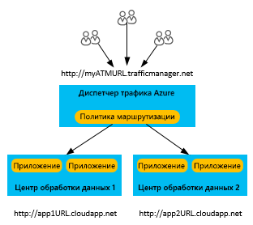
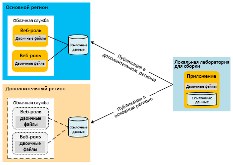
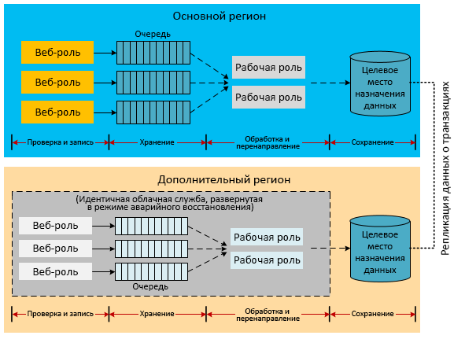
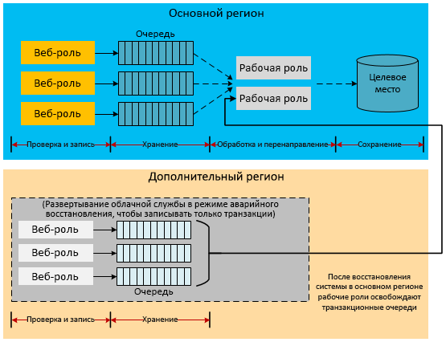
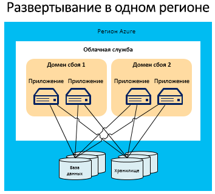
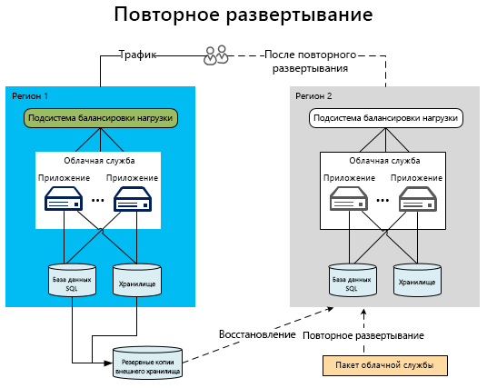
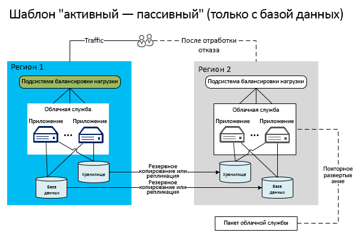
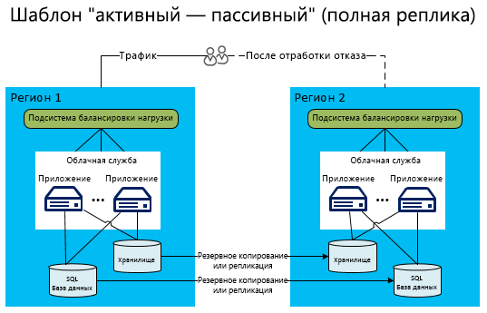
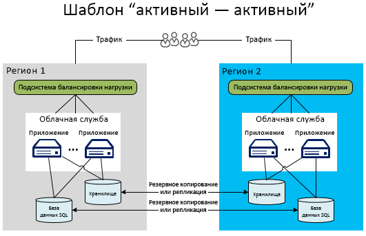

# Аварийное восстановление для приложений Azure

Аварийное восстановление подразумевает восстановление работоспособности после существенной потери функциональности приложения. Например, вы можете подготовить план для запуска приложения или получения доступа к данным в другом регионе на случай сбоя в том регионе, где размещается это приложение. 

Владельцам организаций и технологических решений необходимо знать доступный объем возможностей, требуемых во время сбоя. В общем случае различают следующие уровни функциональности: полная недоступность, частичная доступность (с ограниченной функциональностью или отложенной обработкой), полная доступность.

Стратегии повышения устойчивости и доступности направлены на обработку временных сбоев.  Для реализации такого плана требуются определенные ресурсы для поддержания функциональности системы: специалисты, процессы и вспомогательные приложения. Для проверки надежности этого плана следует выполнять моделирование сбоев и восстановление баз данных. 

## Функции аварийного восстановления Azure

Наряду с рекомендациями по обеспечению доступности Azure предоставляет [техническое руководство по обеспечению устойчивости](./index.md), которое поможет вам организовать аварийное восстановление. Функции доступности и аварийного восстановления Azure тесно связаны. Например, управление ролями в доменах сбоя повышает доступность приложения. Без такого вида управления необработанный сбой оборудования стал бы аварийным сценарием. Использование функций и стратегий обеспечения доступности является важным элементом стратегии защиты приложения от аварий. Однако в этой статье описываются не общие проблемы с доступностью, а более серьезные (и редкие) ситуации.

## Несколько регионов центра обработки данных
Azure обслуживает центры обработки данных во множестве регионов по всему миру. В этой инфраструктуре поддерживается несколько сценариев аварийного восстановления, например системная георепликация службы хранилища Azure в дополнительные регионы. Также вы можете легко и без лишних расходов развернуть облачную службу в нескольких расположениях по всему миру. Это намного проще и дешевле, чем развертывать и поддерживать собственные центры обработки данных в нескольких регионах. Развертывая данные и службы в нескольких регионах, вы защитите свое приложение от последствий серьезных сбоев в одном регионе. Создавая план аварийного восстановления, учитывайте концепцию пар регионов. Дополнительные сведения см. в статье [Непрерывность бизнес-процессов и аварийное восстановление в службах BizTalk: пары регионов Azure](/azure/best-practices-availability-paired-regions).

## Azure Site Recovery

Служба [Azure Site Recovery](/azure/site-recovery/) предоставляет простой способ репликации виртуальных машин Azure между регионами. При этом затраты на управление сводятся к минимуму, так как вам не нужно подготавливать дополнительные ресурсы в дополнительном регионе. Когда вы включаете репликацию, служба Site Recovery автоматически создает требуемые ресурсы в целевом регионе на основе параметров исходной виртуальной машины. Она обеспечивает непрерывную автоматическую репликацию и простую отработку отказа приложений. Вы можете выполнять аварийное восстановление с тестовой отработкой отказа, не затрагивая производственные рабочие нагрузки или текущую репликацию. 

## Azure Traffic Manager
При сбое в одном регионе следует перенаправить трафик в службы или развертывания в другом регионе. Для этого лучше всего использовать специальные службы, например диспетчер трафика Azure, который автоматически выполняет отработку отказа, переключая трафик пользователя на другой регион при сбое в основном регионе. Чтобы создать эффективную стратегию аварийного восстановления, важно понимать принципы работы диспетчера трафика.

Диспетчер трафика использует службу доменных имен (DNS) для направления клиентских запросов к наиболее подходящей конечной точке в зависимости от метода маршрутизации трафика и работоспособности конечных точек. На следующей схеме показано, как пользователи подключаются к URL-адресу диспетчера трафика (`http://myATMURL.trafficmanager.net`), за которым спрятаны фактические URL-адреса сайта (`http://app1URL.cloudapp.net` и `http://app2URL.cloudapp.net`). Запросы пользователей направляются на нужный базовый URL-адрес в соответствии с выбранным [методом маршрутизации диспетчера трафика](/azure/traffic-manager/traffic-manager-routing-methods). Согласно целям этой статьи мы уделим основное внимание отработке отказа.

Настраивая диспетчер трафика, вы указываете для него новый префикс DNS, через который пользователи будут обращаться к службе. Теперь диспетчер трафика абстрагирует балансировку нагрузки не на уровне региона, а на один уровень выше. Служба DNS диспетчера трафика выполняет сопоставление с записью CNAME для всех развертываний, которыми она управляет.

Вы можете указать в диспетчере трафика список с приоритетными развертываниями, на которые будут направляться пользователи при сбое. Диспетчер трафика отслеживает конечные точки развертывания. Если основное развертывание становится недоступным, диспетчер трафика направляет пользователей к следующему в списке приоритетных.

При отработке отказа диспетчер трафика самостоятельно выбирает расположение для перехода. Но вы можете самостоятельно и независимо от диспетчера трафика определять, будет ли домен, назначенный для отработки отказа, использоваться в обычном режиме работы. Когда диспетчер трафика обнаруживает сбой на основном сайте, он переключается на сайт для отработки отказа, независимо от наличия подключенных к нему пользователей.

Дополнительные сведения о том, как работает диспетчер трафика Azure, можно найти в следующих статьях:

* [Обзор диспетчера трафика](/azure/traffic-manager/traffic-manager-overview/)
* [Методы маршрутизации диспетчера трафика](/azure/traffic-manager/traffic-manager-routing-methods)
* [Настройка метода маршрутизации с отработкой отказа](/azure/traffic-manager/traffic-manager-configure-failover-routing-method/)

## Сценарии сбоев в Azure
В следующих разделах описаны различные типы аварийных сценариев. Нарушения работы служб на уровне региона — не единственная причина сбоев на уровне приложения. Сбои могут происходить из-за неудачной архитектуры или ошибок в администрировании. Важно учитывать возможные причины сбоя во время разработки и тестирования плана восстановления. План можно считать хорошим, если в нем задействуются возможности Azure, которые дополняются стратегиями для конкретных приложений. Ответные действия определяются с учетом важности приложения, целевой точки восстановления (RPO) и целевого времени восстановления (RTO).

### Сбой приложения
Диспетчер трафика Azure автоматически обрабатывает сбои, возникающие в базовом оборудовании или программном обеспечении операционной системы на виртуальной машине узла. Azure создает новый экземпляр роли и добавляет его в пул. Если уже выполняется несколько экземпляров этой роли, Azure перераспределяет обработку между другими работающими экземплярами роли и заменяет узел, на котором произошел сбой.

Серьезные ошибки в приложении могут происходить даже без отказа базового оборудования или операционной системы. Например, критические исключения в приложении могут быть вызваны ошибками в логике или нарушением целостности данных. Следует добавить в код приложения поддержку телеметрии, чтобы система мониторинга отслеживала ошибки и уведомляла о них администратора. Имея полные сведения о процессах аварийного восстановления, администратор сможет решить, следует ли запускать процесс отработки отказа или допустить некоторое нарушение доступности на период устранения критических ошибок.

### Повреждение данных
Для обеспечения избыточности Azure автоматически создает три копии данных из базы данных SQL Azure и службы хранилища Azure в разных доменах сбоя в том же регионе. При использовании георепликации создаются еще три экземпляра данных в другом регионе. Но если пользователи или приложение повреждают данные в основной копии, происходит быстрая репликация с использованием других копий. К сожалению, в этом случае вы получите три копии поврежденных данных.

Существует два варианта управления возможным повреждением данных. Во-первых, можно использовать управление пользовательской стратегией архивации. В зависимости от бизнес-требований или нормативных требований резервные копии можно хранить в Azure или локально. Также можно использовать альтернативную возможность восстановления базы данных SQL до точки во времени. Дополнительные сведения см. в разделе о [стратегиях аварийного восстановления данных](#data-strategies-for-disaster-recovery) ниже.

### Сбой сети
Если сеть Azure частично недоступна, вы можете потерять доступ к данным или приложениям. Если один или несколько экземпляров роли недоступны из-за проблем с сетью, Azure использует остальные доступные экземпляры приложения. Если приложение не может получить доступ к своим данным из-за сбоя сети Azure, можно работать локально с ограниченной функциональностью, используя кэшированные данные. Чтобы использовать режим ограниченной функциональности приложения, нужно заранее разработать стратегию аварийного восстановления. Для некоторых приложений это может оказаться непрактично.

Кроме того, можно хранить данные в другом расположении до восстановления подключения. Если работа с ограниченной функциональностью невозможна, остаются два варианта: допустить простой приложения или переключиться на резервный регион. Разработка режима ограниченной функциональности предусматривает принятие не только технических, но и коммерческих решений. Этот вопрос обсуждается далее в разделе о [работе приложения с ограниченной функциональностью](#reduced-application-functionality).

### Сбой зависимой службы
В Azure доступно множество служб, каждая из которых периодически может становиться недоступной. Например [кэш Redis для Azure](https://azure.microsoft.com/services/cache/) — это мультитенантная служба, которая предоставляет приложению возможности кэширования. Важно учитывать, что происходит в приложении, если зависимая служба недоступна. Во многом этот сценарий похож на сценарий сбоя сети. Тем не менее, оценивая каждую службу по отдельности, можно добиться улучшений в общем.

Кэш Redis для Azure обеспечивает кэширование для приложения в развертывании облачной службы, предоставляя преимущества аварийного восстановления. Во-первых, теперь служба использует локальные роли развертывания. Это позволяет более эффективно контролировать состояние кэша и проводить его мониторинг в рамках общего управления облачной службой. Этот тип кэширования включает новые функции, такие как высокая доступность кэшированных данных. Копии данных хранятся на нескольких узлах и сохраняются даже в случае сбоя на одном из них.

Обратите внимание, что повышение доступности приводит к снижению пропускной способности и увеличению задержки, так как при любых операциях записи нужно обновлять все дополнительные копии. Требования к объему хранилища для кэшированных данных фактически удваиваются, и это нужно принимать во внимание при планировании емкости.  В этом примере показано, что каждая зависимая служба может предоставлять возможности, которые позволяют повысить общий уровень доступности и устойчивости к критическим сбоям.

Необходимо осознавать последствия сбоя каждой зависимой службы. В этом примере кэширования доступ к данным можно получить прямо из базы данных до восстановления кэша. Это несколько снизит производительность, но зато сохранит полный доступ к данным приложения.

### Нарушение работы служб на уровне региона
С предыдущими сбоями можно справиться в одном регионе Azure. Тем не менее следует также подготовиться к прерыванию работы службы во всем регионе. В таком случае локальные избыточные копии данных недоступны. Если георепликация включена, в другом регионе есть три дополнительные копии больших двоичных объектов и таблиц. Если Майкрософт объявит, что связь с регионом утеряна, Azure повторно сопоставит все записи DNS в регионе с георепликацией.

> [!NOTE]
> Учтите, что этот процесс нельзя контролировать и он выполняется только при нарушении работы службы на уровне региона. Рекомендуем использовать [Azure Site Recovery](/azure/site-recovery/) для улучшения показателей RPO и RTO. Служба Site Recovery позволяет приложению решить, какой сбой является допустимым и когда нужно выполнять отработку отказа на реплицированные виртуальные машины.

### Нарушение работы служб на уровне среды Azure
При планировании аварийного восстановления необходимо учитывать весь диапазон возможных аварий. Самым серьезным нарушением работы служб считается ситуация, когда это произошло во всех регионах Azure одновременно. Как и в других сценариях с нарушениями работы служб, вы можете допустить риск временного простоя. Крупномасштабные нарушения работы служб, затрагивающие несколько регионов, случаются гораздо реже, чем локальные нарушения отдельных служб или регионов.

Но может сложиться и такая ситуация, когда для определенных важных приложений вам потребуется резервный план даже на случай прерывания работы служб в нескольких регионах. Такой план может предусматривать переключение на службы, размещенные на [других облачных платформах](#alternative-cloud) или в [гибридных решениях](#hybrid-on-premises-and-cloud-solution).

### Снижение функциональных возможностей приложения
В хорошо спроектированных приложениях обычно используется несколько служб, для взаимодействия между которыми используются модели обмена информацией со слабой связанностью. Чтобы приложение поддерживало аварийное восстановление, необходимо разделить задачи на уровне служб. Это предотвратит нарушение работы всего приложения при отказе одной зависимой службы. Например, рассмотрим приложение электронной торговли для компании Y. Оно может состоять из следующих модулей:

* **Каталог продуктов**. Здесь пользователи могут просматривать продукты.
* **Корзина**. Пользователи могут добавлять в корзину продукты и удалять их из нее.
* **Состояние заказа**. Состояние доставки заказов пользователей.
* **Отправка заказа**. Завершение сеанса покупок путем отправки заказа с оплатой.
* **Обработка заказа**. На этом этапе проверяется целостность данных заказа и выполняется проверка наличия товаров.

Когда в приложении зависимость службы нарушена, как будет функционировать служба, пока эта зависимость не будет исправлена? В хорошо спланированной системе существуют границы изоляции, созданные за счет разделения задач при ее проектировании и эксплуатации. Каждую ошибку можно классифицировать как устранимую или неустранимую. Неустранимые ошибки всегда приводят к сбою службы, а устранимые позволяют сохранить работоспособность, применяя альтернативные варианты. Некоторые проблемы будут даже незаметны для пользователя, если для них автоматически выполняется обработка ошибок и использование альтернативных действий. При серьезных нарушениях в работе службы приложение может быть полностью недоступно. Третий вариант — продолжить обработку запросов в режиме ограниченной функциональности.

Например, служба обработки заказов не может выполнять операции по продажам, когда недоступна соответствующая база данных. В зависимости от архитектуры работа служб приема и обработки заказов в такой ситуации существенно затруднится или станет невозможной. Если в приложении не предусмотрен такой сценарий, оно может перейти в автономный режим работы. Но если хранить данные о товарах в дополнительном расположении, модуль каталога можно будет и дальше использовать для просмотра списков и характеристик товаров. При этом другие операции в приложении, например прием заказов и проверка наличия товара, будут недоступны.

Решения о том, какая часть функциональности будет поддерживаться, принимаются с учетом бизнес-целей и технических возможностей. Важно определить, как приложение будет информировать пользователей о временных проблемах. Приложение из примера выше может сохранить функции просмотра и добавления товаров в корзину. Но если пользователь попытается совершить покупку, приложение сообщит ему, что обработка заказов временно недоступна. Это не лучший вариант для клиентов, но он позволяет избежать перерывов в работе службы на уровне приложения.

## Стратегии аварийного восстановления для данных
Правильная обработка данных — это очень сложный элемент плана аварийного восстановления. Обычно именно восстановление данных занимает больше всего времени при восстановлении после аварии. Использование разных режимов поддержки ограниченной функциональности сопряжено с разными трудностями при восстановлении данных и поддержке согласованности.

Например, важно обеспечить восстановление или сохранение копии всех данных приложения. Эти данные будут использоваться для ссылок и транзакций на дополнительном сайте. Чтобы применить для локального развертывания стратегию защиты от сбоя, затрагивающего несколько регионов, потребуется долгий и сложный процесс планирования. К счастью, большинство поставщиков облачных услуг, в том числе Azure, позволяют развертывать приложения в различных регионах. Эти регионы так географически распределены, чтобы нарушение работы службы в нескольких регионах случалось крайне редко. Стратегия обработки данных в разных регионах является одним из ключевых факторов успешного выполнения любого плана аварийного восстановления.

В следующих разделах рассматриваются методы аварийного восстановления, связанные с архивированием данных, а также ссылочными данными и данными о транзакциях.

### Архивация и восстановление
При регулярной архивации данных приложения могут поддерживаться некоторые сценарии аварийного восстановления. Для различных ресурсов хранения требуются разные методы.

#### База данных SQL
Для восстановления уровней базы данных SQL (цен. категория "Базовый", "Стандартный" и "Премиум") преимущества предоставляет восстановление до точки во времени. Дополнительные сведения см. в статье [Обзор обеспечения непрерывности бизнес-процессов с помощью базы данных SQL Azure](/azure/sql-database/sql-database-business-continuity/). Кроме того, можно использовать активную георепликацию для базы данных SQL. При этом изменения базы данных автоматически реплицируются в базы данных-получатели в том же или даже в другом регионе Azure. Такой вариант представляет собой потенциальную альтернативу некоторым методам синхронизации данных вручную, представленных в этой статье. Дополнительные сведения см. в статье [Обзор: активная георепликация для базы данных SQL](/azure/sql-database/sql-database-geo-replication-overview/).

При архивации и восстановлении также можно использовать подход, предусматривающий больше ручных действий. Используйте команду копирования базы данных, чтобы создать резервную копию базы данных с согласованностью на уровне транзакций. Также вы можете использовать службу импорта и экспорта базы данных SQL Azure, которая поддерживает экспорт базы данных в BACPAC-файлы (содержат схему базы данных и соответствующие данные в сжатом виде), которые расположены в хранилище больших двоичных объектов Azure.

Благодаря встроенной избыточности службы хранилища Azure в одном регионе создается две реплики файла резервной копии. Тем не менее от частоты архивации зависит RPO, т. е. объем данных, которые можно потерять при сбое. Предположим, что вы выполняете резервное копирование в начале каждого часа, а сбой происходит за две минуты до конца очередного часа. В этом случае вы теряете все данные, созданные за 58 минут с момента последнего резервного копирования. Кроме того, чтобы обеспечить защиту на случай нарушения работы службы на уровне региона, необходимо скопировать файлы BACPAC в другой регион. Затем вы сможете восстановить эти резервные копии в другом регионе. Дополнительные сведения см. в статье [Обзор обеспечения непрерывности бизнес-процессов с помощью базы данных SQL Azure](/azure/sql-database/sql-database-business-continuity/).

#### Хранилище Azure
Для службы хранилища Azure можно разработать пользовательский процесс резервного копирования или применить одно из множества средств резервного копирования, созданных сторонними поставщиками. Обратите внимание, что в большинстве приложений возникают дополнительные сложности, если ресурсы хранения ссылаются друг на друга. Например, рассмотрим базу данных SQL, в которой есть столбец, ссылающийся на большой двоичный объект в службе хранилища Azure. Если резервное копирование не выполняется для всех элементов одновременно, в базе данных может сохраниться указатель на большой двоичный объект, для которого не существует резервной копии. Приложение или план аварийного восстановления должны реализовать процессы для обработки этой несогласованности после восстановления.

#### Другие платформы данных
Для других платформ размещения IaaS (инфраструктура как услуга), например Elasticsearch или MongoDB, доступны другие возможности и особенности, которые нужно учитывать при разработке интегрированного процесса резервного копирования и восстановления. Обычно мы рекомендуем использовать для этих платформ встроенные или специально разработанные средства репликации и создания моментальных снимков. Если такие возможности не существуют или не подходят для ваших задач, попробуйте применить службу архивации Azure или моментальные снимки для управляемых и неуправляемых дисков, чтобы создавать копии данных приложения на определенный момент времени. Во всех случаях важно определить, как обеспечить согласованность резервных копий, особенно если данные приложения распределены между несколькими файловыми системами или одна файловая система размещена на нескольких дисках, объединенных с помощью диспетчеров томов или программных RAID-массивов.

### Шаблон ссылочных данных для аварийного восстановления
Ссылочные данные — это данные только для чтения, которые поддерживают функциональные возможности приложения. Обычно они редко изменяются. Хотя архивация и восстановление представляют один из методов устранения нарушений в работе служб на уровне региона, целевое время восстановления при этом относительно велико. При развертывании приложения в дополнительном регионе можно применить несколько стратегий, которые позволяют добиться малого целевого времени восстановления для ссылочных данных.

Так как ссылочные данные изменяются редко, целевое время восстановления можно уменьшить, создав постоянную копию ссылочных данных в дополнительном регионе. Это уменьшает количество времени, необходимое на восстановление из резервных копий в случае сбоя. В соответствии с требованиями к аварийному восстановлению после сбоев в нескольких регионах необходимо развернуть приложение и ссылочные данные одновременно во всех них. Как указано в разделе [Шаблон ссылочных данных для обеспечения высокой доступности](high-availability-azure-applications.md#reference-data-pattern-for-high-availability), ссылочные данные можно развернуть в роли, во внешнем хранилище или и там, и там.

Модель развертывания ссылочных данных на вычислительных узлах неявно удовлетворяет требованиям аварийного восстановления. При развертывании ссылочных данных в базе данных SQL необходимо развернуть их копию в каждом регионе. Та же стратегия применяется к службе хранилища Azure. Необходимо развернуть копию всех ссылочных данных в службе хранилища Azure в основном и дополнительном регионах.

Для всех данных, в том числе ссылочных, необходимо реализовать свои процессы архивации в зависимости от приложения. Геореплицированные копии в регионах используются только при нарушении работы служб на уровне региона. Чтобы предотвратить длительные простои, разверните критически важные компоненты данных приложения в дополнительном регионе. Пример этой топологии см. в разделе о [модели "активный — пассивный"](#active-passive).

### Шаблон данных о транзакциях для аварийного восстановления
Реализация полнофункциональной стратегии режима аварийного восстановления требует асинхронной репликации данных о транзакциях в дополнительный регион. Фактический период репликации будет служить для определения характеристик RPO приложения. В течение этого периода все еще можно восстановить данные, утерянные из основного региона. Кроме того, позже можно будет объединить эти данные с данными дополнительного региона.

В следующих примерах архитектуры представлены идеи в отношении различных способов обработки данных о транзакциях при отработке отказа. Важно отметить, что они не являются исчерпывающими. Например, промежуточные места хранения, такие как очереди, можно заменить Базой данных SQL Azure. Это могут быть очереди службы хранилища Azure или служебной шины Azure (см. статью [Очереди Azure и очереди служебной шины: сходства и различия](/azure/service-bus-messaging/service-bus-azure-and-service-bus-queues-compared-contrasted/)). Кроме того, можно использовать разные хранилища серверов, например таблицы Azure вместо базы данных SQL. Помимо этого на различных этапах в качестве посредников могут добавляться рабочие роли. Не нужно слепо копировать эти архитектуры. Важно оценить разные варианты действий по восстановлению данных о транзакциях и связанных модулей.

#### Репликация данных о транзакциях при подготовке к аварийному восстановлению
Рассмотрим приложение, в котором данные о транзакциях хранятся в очередях службы хранилища Azure. В этом сценарии рабочие роли могут обрабатывать данные о транзакциях в базе данных сервера в несвязанной архитектуре. Если внутренним ролям необходимо немедленно запрашивать эти данные, транзакции должны использовать временное кэширование. В зависимости от допустимого уровня потери данных можно реплицировать очереди, базу данных или все ресурсы хранения. Если реплицируется только база данных, при сбое основного региона данные в очередях можно по-прежнему восстановить после восстановлении работы основного региона.

На следующей схеме показана архитектура, где базы данных сервера синхронизируются в разных регионах.

Самой большой сложностью при реализации этой архитектуры является разработка стратегии репликации между регионами. [Служба синхронизации данных SQL Azure](/azure/sql-database/sql-database-get-started-sql-data-sync/) позволяет выполнить такую репликацию. На момент написания статьи эта служба доступна в режиме предварительной версии. Мы не рекомендуем использовать ее в рабочей среде. Дополнительные сведения см. в статье [Обзор обеспечения непрерывности бизнес-процессов с помощью базы данных SQL Azure](/azure/sql-database/sql-database-business-continuity/). Для рабочих приложений необходимо приобрести решение стороннего поставщика или создать собственную логику репликации в коде. В зависимости от архитектуры может потребоваться более сложная двусторонняя репликация.

В одном из возможных способов реализации можно использовать промежуточную очередь из предыдущего примера. Рабочая роль, обрабатывающая данные в конечном хранилище, может вносить изменения в основном и дополнительном регионе. Это непростые задачи. Полное руководство по написанию кода репликации выходит за рамки этой статьи. Уделяйте достаточно времени и проводите тестирование, чтобы разработать правильный подход к репликации данных в дополнительный регион. Чтобы убедиться, что при отработке отказа и восстановлении все возможные несоответствия данных или повторяющиеся транзакции обрабатываются правильно, можно провести дополнительную обработку и тестирование.

> [!NOTE]
> Основная часть этого документа посвящена модели "платформа как услуга" (PaaS). Однако существуют дополнительные варианты репликации и обеспечения доступности для гибридных приложений, использующих виртуальные машины Azure. В этих гибридных приложениях для размещения SQL Server на виртуальных машинах в Azure используется модель "инфраструктура как услуга" (IaaS). Это позволяет использовать традиционные подходы к обеспечению доступности в SQL Server, например группы доступности AlwaysOn и доставку журналов. Некоторые методы, например AlwaysOn, работают только между локальными экземплярами SQL Server и виртуальными машинами Azure. Дополнительные сведения см. в статье [Высокий уровень доступности и аварийное восстановление для SQL Server на виртуальных машинах Azure](/azure/virtual-machines/windows/sql/virtual-machines-windows-sql-high-availability-dr/).
> 
> 

#### Снижение функциональных возможностей приложения для записи транзакций
Рассмотрим вторую архитектуру, которая работает в режиме снижения функциональности. Когда приложение выполняется в дополнительном регионе, отключаются все дополнительные возможности, такие как отчетность, бизнес-аналитика и обработка очередей. Оно принимает только самые важные типы транзакционных рабочих процессов в соответствии с бизнес-требованиями. Система фиксирует транзакции и записывает их в очереди. На начальной стадии нарушения работы службы система может отложить обработку данных. Если система в основном регионе восстанавливается в течение ожидаемого времени, рабочие роли в этом регионе могут освободить очереди. В результате не нужно объединять базы данных. Если нарушение работы службы основного региона выходит за рамки допустимого периода, приложение может начать обработку очередей.

В этом сценарии база данных в дополнительном регионе содержит дополнительные данные о транзакциях, которые необходимо объединить после восстановления основного региона. На следующей схеме показана эта стратегия для временного хранения данных о транзакциях до восстановления основного региона.

Дополнительные сведения о методах управления данными для устойчивых приложений Azure см. на странице [FailSafe: Building Scalable, Resilient Cloud Services](https://channel9.msdn.com/Series/FailSafe) (Отказоустойчивость. Создание устойчивых облачных служб).

## Топологии развертывания для аварийного восстановления
Критически важные приложения нужно подготовить к обработке сбоев служб на уровне региона. Включите в план действий стратегию развертывания в нескольких регионах.

При развертывании в нескольких регионах могут потребоваться отдельные ИТ-процессы, которые позволяют в случае сбоя опубликовать приложения и ссылочные данные, размещенные в дополнительном регионе. Если приложение требует мгновенной отработки отказа, развертывание может включать настройку "активный — пассивный" или "активный — активный". Этот тип развертывания предусматривает существующие экземпляры приложения, работающие в другом регионе. Служба маршрутизации, например диспетчер трафика Azure, предоставляет службы балансировки нагрузки на уровне DNS. Оно может определить нарушения в работе службы и при необходимости перенаправить пользователей в другие регионы.

Чтобы успешно выполнять аварийное восстановление в Azure, эта возможность должна учитываться в архитектуре решения с самого начала. В облаке предусмотрены дополнительные варианты аварийного восстановления после сбоев, недоступные у традиционных поставщиков услуг размещения. В частности, вы можете динамически и быстро выделять ресурсы в другом регионе, чтобы платить за них в период простоя, то есть до сбоя.

В следующих разделах рассматриваются различные топологии развертывания для аварийного восстановления. Как правило, при повышении уровня доступности необходимо идти на компромисс между увеличением затрат или сложности.

### Развертывание в одном регионе
На самом деле развертывание в одном регионе не является топологией аварийного восстановления. Оно рассматривается в качестве противопоставления другим архитектурам. Развертывание в одном регионе — распространенная практика для приложений в Azure, но она не соответствует требованиям к топологии для аварийного восстановления.

На следующей схеме показано приложение, работающее в одном регионе Azure. Диспетчер трафика Azure, а также использование доменов сбоя и обновления повышают уровень доступности приложения в пределах региона.

В этом сценарии база данных является единой точкой отказа. Хотя Azure реплицирует данные нескольких доменов сбоя во внутренние реплики, все это происходит в одном регионе. Приложение не может выдержать разрушительный сбой. Недоступность всего региона затронет все домены сбоя, в том числе все экземпляры служб и ресурсы хранилищ.

Для всех приложений, кроме наименее важных, необходимо создать план развертывания в нескольких регионах. При выборе используемой топологии необходимо также учитывать целевое время восстановления и ограничения бюджета.

Теперь давайте рассмотрим некоторые подходы к отработке отказа между регионами. В этих примерах для описания процесса используются два региона.

### Отработка отказа с помощью Azure Site Recovery

При включении репликации виртуальных машин Azure с помощью Azure Site Recovery создается несколько ресурсов в дополнительном регионе:

- группа ресурсов;
- виртуальная сеть;
- учетная запись хранения; 
- группы доступности для поддержки виртуальных машин после отработки отказа.

Операции записи данных на дисках виртуальной машины в основном регионе постоянно передаются в учетную запись хранения в дополнительном регионе. Каждые несколько минут в целевой учетной записи хранения создаются точки восстановления. При запуске отработки отказа восстановленные виртуальные машины создаются в целевой группе ресурсов, виртуальной сети и наборе доступности. Во время отработки отказа можно использовать любую доступную точку восстановления.

### Повторное развертывание в дополнительном регионе Azure
Если используется метод повторного развертывания в дополнительном регионе, все приложения и базы данных будут выполняться только в основном регионе. Дополнительный регион не настроен для автоматической отработки отказа. Поэтому при сбое все компоненты службы необходимо развернуть в новом регионе. При этом нужно добавить облачную службу в Azure, развернуть облачную службу, восстановить данные и изменить DNS для перенаправления трафика.

Хотя это и самый доступный вариант для нескольких регионов, он предполагает максимальное целевое время восстановления. В этой модели резервные копии пакета службы и базы данных сохраняются локально или в экземпляре хранилища BLOB-объектов Azure в дополнительном регионе. Тем не менее до возобновления работы нужно развернуть новую службу и восстановить данные. Даже если передача данных из хранилища резервных копий полностью автоматизирована, развертывание новой среды для базы данных занимает много времени. Перенос данных из дискового хранилища резервных копий в пустую базу данных в дополнительном регионе — самый дорогостоящий этап восстановления. Тем не менее его нужно выполнить, чтобы запустить новую базу данных, так как она не реплицируется.

Лучше всего хранить пакеты службы в хранилище BLOB-объектов в дополнительном регионе. Это устраняет необходимость передавать пакет в Azure, что происходит при развертывании из локального компьютера разработки. Вы можете быстро развернуть пакеты службы в новой облачной службе из хранилища BLOB-объектов, используя сценарии PowerShell.

Этот вариант применим только для некритических приложений, которые допускают высокое значение целевого времени восстановления. Например, если для приложения допускается простой длительностью в несколько часов, но не более суток.

### Шаблон "активный — пассивный"
Многие компании предпочитают топологию "активный — пассивный". Такая топология позволяет улучшить показатели целевого времени восстановления, незначительно увеличивая затраты по сравнению с повторным развертыванием. В этом сценарии также используются основной и дополнительный регион Azure. Весь трафик передается в активное развертывание в основном регионе. Дополнительный регион лучше подготовлен к аварийному восстановлению, так как база данных работает в обоих регионах. Кроме того, между ними настроен механизм синхронизации. Существует два варианта такого резервного подхода: только с использованием базы данных или полное развертывание в дополнительном регионе.

#### Только база данных
В первом варианте топологии "активный — пассивный" облачная служба приложения развернута только в основном регионе. Но в отличие от метода повторного развертывания, здесь содержимое базы данных синхронизируется между регионами. Дополнительные сведения см. в разделе о [шаблоне данных о транзакциях для аварийного восстановления](#transactional-data-pattern-for-disaster-recovery). При сбое требований к активации меньше. Необходимо запустить приложение в дополнительном регионе, изменить строки подключения к новой базе данных, а также записи DNS, чтобы перенаправить трафик.

Как и в методе повторного развертывания, пакеты служб нужно заранее разместить в хранилище BLOB-объектов Azure в дополнительном регионе, чтобы ускорить развертывание. Но так вы заметно сократите расходы на восстановление базы данных, так как база данных уже подготовлена и запущена. Это существенно ускоряет процесс аварийного восстановления, поэтому такой подход очень доступен и широко распространен.

#### Полная реплика
Во втором варианте топологии "активный — пассивный" полное развертывание содержится и в основном, и в дополнительном регионе. Это развертывание включает в себя облачные службы и синхронизированную базу данных. Однако только основной регион активно обрабатывает сетевые запросы от пользователей. Дополнительный регион становится активным, только если в основном регионе происходит нарушение работы службы. В этом случае все новые сетевые запросы перенаправляются в дополнительный регион. Диспетчер трафика Azure может автоматически управлять такой отработкой отказа.

Отработка отказа выполняется быстрее, чем в варианте, когда используется только база данных, так как службы уже развернуты. Эта топология гарантирует очень низкое значение RTO. Дополнительный регион для отработки отказа должен быть готов к работе сразу после сбоя основного региона.

Помимо ускорения отклика, эта топология избавляет и от риска нехватки пространства для размещения экземпляров и служб, копируемых в случае сбоя, выделяя и размещая все ресурсы заранее. Это следует учитывать, если дополнительный регион Azure близок к заполнению. Соглашения об уровне обслуживания не гарантируют мгновенное развертывание одной или нескольких облачных служб в любом регионе.

Чтобы добиться минимального времени отклика в этой модели, необходимо использовать один и тот же масштаб (количество экземпляров ролей) в основном и дополнительном регионах. Несмотря на преимущества, есть неиспользуемые вычислительные операции, которые дорого обходятся, поэтому это не самый выгодный вариант с финансовой точки зрения. По этой причине чаще всего используется версия облачных служб меньшего масштаба в дополнительном регионе. Затем при необходимости можно быстро выполнить отработку отказа и дополнительное развертывание. Следует автоматизировать отработку отказа, чтобы в случае недоступности основного региона можно было активировать дополнительные экземпляры в зависимости от нагрузки. При этом может использоваться механизм автоматического масштабирования, например [наборы для масштабирования виртуальных машин](/azure/virtual-machine-scale-sets/virtual-machine-scale-sets-overview/).

На следующей схеме показана модель топологии "активный — пассивный", в которой основной и дополнительный регионы содержат полностью развернутую облачную службу.

### Шаблон "активный — активный"
В топологии "активный — активный" облачные службы и база данных полностью развернуты в обоих регионах. В отличие от трафика в модели "активный-пассивный" трафик от пользователей передается в оба региона. Этот вариант обеспечивает минимальное время восстановления. Службы уже масштабированы для обработки части нагрузки в каждом регионе. DNS уже настроена для использования в дополнительном регионе. Но при определении способа маршрутизации пользователей в соответствующий регион возникают дополнительные сложности. В этом случае возможно планирование циклического перебора. Скорее всего, некоторые пользователи будут использовать определенный регион, где хранится основная копия их данных.

В случае отработки отказа просто отключите DNS в основном регионе. Таким образом весь трафик будет направлен в дополнительный регион.

Даже для этой модели доступны некоторые варианты. Например, на следующей схеме представлен основной регион, который содержит мастер-копию базы данных. Облачные службы в обоих регионах записывают данные в эту базу данных-источник. Дополнительное развертывание может считывать данные из базы данных-источника или реплицированной базы данных. В этом примере репликация происходит в одном направлении.

В архитектуре на основе шаблона "активный — активный" на предыдущей схеме есть недостаток. Во втором регионе должен быть доступ к базе данных первого региона, так как там содержится мастер-копия. Производительность значительно уменьшается при доступе к данным за пределами региона. Чтобы повысить производительность вызовов базы данных в различных регионах, следует разработать определенную стратегию пакетной обработки. Дополнительные сведения см. в статье [Как повысить производительность приложений базы данных SQL с помощью пакетной обработки](/azure/sql-database/sql-database-use-batching-to-improve-performance/).

В альтернативной архитектуре каждый регион может получать прямой доступ к своей базе данных. В этой модели для синхронизации баз данных в каждом регионе требуется двунаправленная репликация.

Описанные выше топологии позволяют снизить RTO за счет увеличения стоимости и сложности развертывания. Но топология "активный — активный" имеет другие характеристики. В рамках этой топологии можно использовать в основном регионе меньше экземпляров по сравнению с топологией "активный — пассивный". Если в архитектуре на основе шаблона "активный — пассивный" в основном регионе есть 10 экземпляров, в архитектуре на основе шаблона "активный — активный" в каждом регионе может потребоваться всего 5 экземпляров. Теперь нагрузка распределяется между обоими регионами. Если вы разместите в пассивном регионе "горячий резерв" из 10 экземпляров, постоянно готовых к отработке отказа, вы можете даже снизить затраты по сравнению с топологией "активный — пассивный".

Учтите, что до восстановления основного региона в дополнительном регионе может случиться неожиданный наплыв новых пользователей. Если при нарушении работы службы в основном регионе на каждом сервере было 10 000 пользователей, дополнительному региону внезапно потребуется обрабатывать 20 000 пользователей. Правила мониторинга в дополнительном регионе должны обнаружить такое увеличение и удвоить число экземпляров в этом регионе. Дополнительные сведения см. в разделе об [обнаружении сбоев](#failure-detection).

## гибридных локальных и облачных решениях
Дополнительная стратегия аварийного восстановления предусматривает создание гибридного приложения, которое работает локально и в облаке. В зависимости от приложения основной регион может находиться как в локальной среде, так и в облаке. Рассмотрим предыдущие архитектуры и представим, что основной или дополнительный регион располагается в локальной среде.

В таких гибридных архитектурах возникают некоторые сложности. В большей части этой статьи основное внимание уделяется шаблонам архитектуры PaaS. Типичные приложения PaaS в Azure используют конструкции Azure, например роли, облачные службы и диспетчер трафика. Чтобы создать локальное решение для приложения PaaS такого типа, нужна совсем другая архитектура. Это может не подойти с точки зрения управления или затрат.

Но гибридное решение для аварийного восстановления создает меньше трудностей при использовании традиционных архитектур, перенесенных в облачную среду, например на платформы IaaS (инфраструктура как услуга). Приложения IaaS используют виртуальные машины в облаке, для которых могут существовать прямые эквиваленты в локальной среде. Кроме того, подключать компьютеры в облаке к локальным сетевым ресурсам можно с помощью виртуальных сетей. Это открывает целый ряд возможностей, недоступных для "чистых" приложений PaaS. Например, SQL Server может использовать решения аварийного восстановления, например группы доступности AlwaysOn и зеркальное отображение базы данных. Дополнительные сведения см. в статье [Высокий уровень доступности и аварийное восстановление для SQL Server на виртуальных машинах Azure](/azure/virtual-machines/windows/sql/virtual-machines-windows-sql-high-availability-dr/).

Решения IaaS также предоставляют простой способ использования Azure в качестве варианта для отработки отказа для локальных приложений. В существующем локальном регионе может быть развернуто полнофункциональное приложение. Но что делать, если не хватает ресурсов для поддержки географически отделенного региона для отработки отказа? Чтобы запустить приложение в Azure, можно использовать виртуальные машины и виртуальные сети. В этом случае определите процессы синхронизации данных в облаке. После этого развертывание Azure станет дополнительным регионом для отработки отказа. Основным регионом останется локальное приложение. Дополнительные сведения об архитектурах и возможностях IaaS см. в [документации по виртуальным машинам](https://azure.microsoft.com/documentation/services/virtual-machines/).

## Альтернативное облако
В некоторых ситуациях даже богатые возможности Microsoft Azure не гарантируют соблюдение всех корпоративных правил или политик соответствия. Самые лучшие стратегия обработки сбоев и архитектура резервных систем не гарантируют работоспособность при глобальном нарушении работы служб поставщика облачных служб.

Необходимо сопоставить требования к доступности с затратами и сложностью ее достижения. Проанализируйте риски и определите целевое время восстановления и RPO для своего решения. Если простои в работе приложения недопустимы, попробуйте добавить еще одно облачное решение. Если вся среда Azure станет недоступной, другое облачное решение все еще может быть доступно (если не утерян доступ к Интернету).

Как и в гибридном сценарии, развертывания для отработки отказа в предыдущих архитектурах аварийного восстановления могут также содержаться в другом облачном решении. Альтернативные облачные сайты аварийного восстановления следует использовать только для решений с целевым временем восстановления, которое допускает очень малый простой или не допускает его вовсе. Обратите внимание, что для настройки, разработки, развертывания и обслуживания решения, использующего сайт аварийного восстановления вне Azure, требуется намного больше усилий. Кроме того, в архитектуре с несколькими облаками будет сложнее применить традиционные подходы. Хотя к облачным платформам применяются схожие общие принципы, API и архитектуры у них разные.

Если ваша стратегия аварийного восстановления включает несколько облачных платформ, будет полезным добавить в решение дополнительные уровни абстракции. Так вам не понадобится разрабатывать и обслуживать две версии одного приложения для разных облачных платформ в случае сбоя. Как и в гибридном сценарии, в этих случаях может оказаться удобнее использовать виртуальные машины Azure или службу контейнеров Azure, чем решения PaaS в зависимости от облачных платформ.

## Служба автоматизации
Некоторые рассмотренные шаблоны требуют быстрой активации автономных развертываний, а также восстановления определенных компонентов системы. Скрипты автоматизации позволят добавлять ресурсы при увеличении нагрузки и быстро развертывать решения. Ниже приводятся примеры автоматизации аварийного восстановления на основе [Azure PowerShell](https://msdn.microsoft.com/library/azure/jj156055.aspx), но аналогичный результат можно получить и с помощью [Azure CLI](https://docs.microsoft.com/cli/azure/get-started-with-azure-cli) или [REST API управления службами](https://msdn.microsoft.com/library/azure/ee460799.aspx).

Скрипты автоматизации берут на себя задачи аварийного восстановления, которые Azure не может выполнять прозрачным образом. Они позволяют получить согласованный и воспроизводимой результат, сводя пользовательские ошибки к минимуму. Заранее создавая скрипты аварийного восстановления, вы ускорите восстановление системы и ее составных частей во время сбоя. Нецелесообразно пытаться вручную определить, как восстановить сайт при сбое, когда с каждой минутой убытки становятся все больше.

Несколько раз протестируйте скрипты от начала до конца. Проверив основные возможности, протестируйте их в режиме [моделирования сбоя](#disaster-simulation). Это позволит обнаружить недостатки в скриптах или процессах.

Чтобы автоматизировать эту задачу, рекомендуется создать репозиторий сценариев PowerShell или сценариев интерфейса командной строки по аварийному восстановлению Azure. Четко обозначьте и классифицируйте их, чтобы ускорить использование. Назначьте ответственного за управление репозиторием и версиями скриптов. Задокументируйте их, предоставив четкое описание параметров и примеры использования сценариев. Кроме того, обеспечьте синхронизацию этой документации с развертываниями Azure. Чтобы правильно выполнять эту задачу, за все компоненты репозитория должен отвечать один специалист.

## Обнаружение сбоев
Чтобы устранять проблемы доступности и выполнять аварийное восстановление должным образом, необходимо иметь возможность выявления и диагностики сбоев. Ведите расширенный мониторинг сервера и развертывания, чтобы быстро распознавать недоступность системы или ее отдельных компонентов. Часть этой работы можно поручить средствам мониторинга, которые отслеживают общую работоспособность облачной службы и ее зависимостей. Компания Майкрософт предоставляет такое средство: [System Center 2016](https://www.microsoft.com/cloud-platform/system-center). Возможности мониторинга могут также предоставлять сторонние средства. Большинство решений мониторинга отслеживают основные счетчики производительности, а также доступность службы.

Хотя эти средства очень важны, вы сами несете ответственность за обнаружение сбоев и ведение отчетности в облачной службе. Кроме того, необходимо подготовиться к надлежащему использованию системы диагностики Azure. Настраиваемые счетчики производительности или записи журнала событий также могут быть частью общей стратегии. С их помощью во время сбоев вы будете получать дополнительные данные, которые позволяют быстро определить проблему и восстановить все возможности. Вы также получаете дополнительные метрики, по которым средства мониторинга могут определить работоспособность приложения. Дополнительные сведения см. в статье [Включение системы диагностики Azure в облачных службах Azure](/azure/cloud-services/cloud-services-dotnet-diagnostics/). Обсуждение планирования общей модели работоспособности см. на странице [FailSafe: Building Scalable, Resilient Cloud Services](https://channel9.msdn.com/Series/FailSafe) (Отказоустойчивость. Создание устойчивых облачных служб).

## моделирование сбоя
Проверка методом моделирования подразумевает создание небольших реалистичных ситуаций в рабочей среде, чтобы проверить, какие действия предпримут участники группы. Моделирование также позволяет оценить эффективность решений в плане восстановления. Моделируйте проблемные ситуации так, чтобы они были близки к реальным событиям, но при этом не нарушали основную деятельность компании.

Рассмотрим создание коммутационной панели в приложении, чтобы смоделировать проблемы с доступностью вручную. Например, с помощью программного коммутатора инициируйте исключения доступа к базе данных для модуля заказов, вызвав сбой в его работе. Подобные упрощенные подходы можно использовать для других модулей на уровне сетевого интерфейса.

Во время моделирования выделяются все проблемы, не решенные должным образом. Моделируемые сценарии должны быть полностью управляемыми. Это значит, что даже если кажется, что план восстановления не срабатывает, можно восстановить нормальный режим работы без значительного ущерба. Кроме того, важно сообщить руководителям более высокого уровня о времени и способе проведения моделирования. В плане нужно указать время проверки и затрагиваемые ресурсы. Обязательно определите критерии, по которым определяется успешность плана аварийного восстановления.

При использовании Azure Site Recovery тестовая отработка отказа выполняется для проверки стратегии репликации или анализа работы системы аварийного восстановления без потери данных или простоя. Тестовая отработка отказа не влияет на текущую репликацию виртуальных машин или рабочую среду.

Для проверки планов аварийного восстановления можно применить еще несколько методик. Большинство из них основаны на этих базовых методах с незначительными вариациями. Цель тестирования — оценка выполнимости созданного плана восстановления. При проверке аварийного восстановления внимание уделяется поиску недостатков в базовом плане восстановления.

## Рекомендации по отдельным службам

В следующих разделах описывается аварийное восстановление для некоторых служб Azure.

| Service | Раздел |
|---------|-------|
| База данных Azure для MySQL | [Общие сведения об обеспечении непрерывности бизнес-процессов с помощью службы "База данных Azure для MySQL"](/azure/mysql/concepts-business-continuity) |
| База данных Azure для PostgreSQL | [Общие сведения об обеспечении непрерывности бизнес-процессов с помощью службы "База данных Azure для PostgreSQL"](/azure/postgresql/concepts-business-continuity)
| Облачные службы | [Что делать, если прерывание работы службы Azure влияет на облачные службы Azure](/azure/cloud-services/cloud-services-disaster-recovery-guidance) |
| База данных Cosmos | [Автоматическая отработка отказа между регионами для обеспечения непрерывности бизнес-процессов в Azure Cosmos DB](/azure/cosmos-db/regional-failover)
| Key Vault | [Доступность и избыточность хранилища ключей Azure](/azure/key-vault/key-vault-disaster-recovery-guidance) |
|служба хранилища. | [Что делать в случае простоя службы хранилища Azure](/azure/storage/storage-disaster-recovery-guidance) |
| База данных SQL | [Восстановление базы данных SQL Azure или переход на базу данных-получатель при отказе](/azure/sql-database/sql-database-disaster-recovery) |
| Виртуальные машины | [Что делать, если прерывание работы службы Azure влияет на виртуальные машины Azure](/azure/virtual-machines/virtual-machines-disaster-recovery-guidance) |
| виртуальные сети; | [Виртуальная сеть: непрерывность бизнес-процессов](/azure/virtual-network/virtual-network-disaster-recovery-guidance) |

