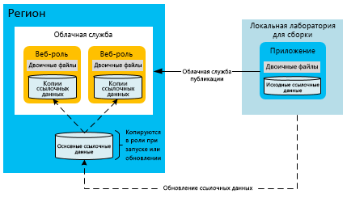
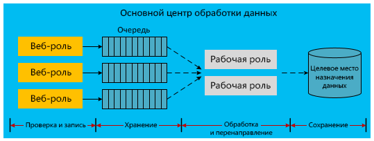

[!INCLUDE [header](../_includes/header.md)]
# Обеспечение высокой доступности для приложений на платформе Microsoft AzureHigh availability for applications built on Microsoft Azure
Приложения с высоким уровнем доступности выдерживают колебания доступности, нагрузки и временных сбоев в зависимых службах и оборудовании.A highly available application absorbs fluctuations in availability, load, and temporary failures in dependent services and hardware. Приложение продолжает работать в правильном режиме, соответствующем бизнес-требованиям или положениям соглашений об уровне обслуживания.The application continues to perform acceptably, as defined by business requirements or application service-level agreements (SLAs).

## Возможности обеспечения высокой доступности AzureAzure high-availability features
Платформа Azure предусматривает множество встроенных возможностей для поддержки приложений с высоким уровнем доступности.Azure has many built-in platform features that support highly available applications. В этом разделе описаны некоторые из этих основных возможностей.This section describes some of those key features.

### Контроллер структурыFabric controller
Контроллер структуры Azure подготавливает ресурсы и осуществляет мониторинг состояния вычислительных операций Azure.The Azure fabric controller provisions and monitors the condition of Azure compute instances. Он отслеживает состояние оборудования и программного обеспечения экземпляров гостевого и хост-компьютера.The fabric controller monitors the status of the hardware and software of the host and guest machine instances. При обнаружении сбоя контроллер структуры применяет соглашения об уровне обслуживания, автоматически перемещая экземпляры виртуальной машины.When it detects a failure, it maintains SLAs by automatically relocating the VM instances. Домены обновления и сбоя обеспечивают дальнейшую поддержку соглашения об уровне обслуживания в отношении вычислений.The concept of fault and upgrade domains further supports the compute SLA.

При развертывании нескольких экземпляров роли облачной службы Azure развертывает их в разных доменах сбоя.When multiple Cloud Service role instances are deployed, Azure deploys these instances to different fault domains. По факту граница домена сбоя расположена в аппаратной стойке в том же регионе.A fault domain boundary is essentially a different hardware rack in the same region. Домены сбоя снижают вероятность прерывания работы приложения после локализованного сбоя оборудования.Fault domains reduce the probability that a localized hardware failure interrupts the service of an application. Вы не можете управлять количеством доменов сбоя рабочих или веб-ролей.You cannot manage the number of fault domains of your worker roles or web roles. Контроллер структуры использует выделенные ресурсы, независимые от размещенных в Azure приложений.The fabric controller uses dedicated resources that are separate from Azure-hosted applications. Он всегда должен находиться в работоспособном состоянии, так как от него зависит работа системы Azure.It requires 100 percent uptime because it serves as the nucleus of the Azure system. Контроллер структуры отслеживает и управляет экземплярами ролей в доменах сбоя.It monitors and manages role instances across fault domains.

На схеме ниже показаны общие ресурсы Azure, развернутые контроллером структуры на разных доменах сбоя и управляемые им.The following diagram shows Azure shared resources that the fabric controller deploys and manages across different fault domains.

В то время как домены сбоя являются физическими единицами разделения для устранения неполадки, домены обновления — это логические единицы разделения экземпляров, которые определяют, какие экземпляры службы будут обновлены в определенный момент времени.While fault domains are physical separations to mitigate failure, upgrade domains are logical units of instance separation that determine which instances of a service will be upgraded at a specific time. По умолчанию для развертывания размещенной службы определено пять доменов обновления.By default, five upgrade domains are defined for your hosted service deployment. Но это количество можно изменить в файле определения службы.However, you can change that value in the service definition file. Например, если у вас есть восемь экземпляров веб-роли, два экземпляра будут находиться в трех доменах обновления и два экземпляра — в одном домене обновления.For example, if you have eight instances of your web role, there are two instances in three upgrade domains and two instances in one upgrade domain. Azure определяет последовательность обновления на основе количества доменов обновления.Azure defines the update sequence based on the number of upgrade domains. Дополнительные сведения см. в статье [Обновление облачной службы](/azure/cloud-services/cloud-services-update-azure-service/).For more information, see [Update a cloud service](/azure/cloud-services/cloud-services-update-azure-service/).

### Возможности в других службахFeatures in other services
Помимо этих возможностей платформы, обеспечивающих поддержку высокого уровня доступности вычислительных ресурсов, Azure внедряет возможности обеспечения доступности в другие службы.In addition to the platform features that support high availability of compute resources, Azure embeds high-availability features in its other services. Например, служба хранилища Azure поддерживает по крайне мере три реплики для всех данных в учетной записи хранения Azure.For example, Azure Storage maintains at least three replicas of all data in your Azure storage account. Она также предоставляет возможность георепликации для хранения копий данных в дополнительном регионе.It also enables geo-replication to store copies of your data in a secondary region. Сеть доставки содержимого (CDN) Azure позволяет кэшировать большие двоичные объекты в регионах по всему миру для обеспечения избыточности, масштабируемости и низкой задержки.The Azure Content Delivery Network allows blobs to be cached around the world for redundancy, scalability, and lower latency. База данных SQL Azure также поддерживает несколько реплик.Azure SQL Database maintains multiple replicas as well.

Более подробные сведения о возможностях обеспечения доступности платформы Azure см. в статье [Проектирование устойчивых приложений для Azure](index.md).For a deeper discussion of Azure platform availability features, see [Resiliency technical guidance](index.md). Ознакомьтесь также со статьей [Best Practices for Designing Large-Scale Services on Windows Azure](https://azure.microsoft.com/blog/best-practices-for-designing-large-scale-services-on-windows-azure/) (Рекомендации по разработке крупномасштабных служб в Windows Azure).Also see [Best practices for designing large-scale services on Windows Azure](https://azure.microsoft.com/blog/best-practices-for-designing-large-scale-services-on-windows-azure/).

Хотя Azure и предоставляет много возможностей, обеспечивающих поддержку высокой доступности, важно знать их ограничения.Although Azure provides multiple features that support high availability, it's important to understand their limitations:

* Azure гарантирует постоянную доступность и работу ролей для вычислительных операций, но не отслеживает работу приложений или наличие перегрузки.For compute, Azure guarantees that your roles are available and running, but it cannot detect whether your application is running or overloaded.
* Данные Базы данных SQL Azure синхронно реплицируются в регионе.For Azure SQL Database, data is replicated synchronously within the region. Можно выбрать активную георепликацию, при которой в одном или в разных регионах может храниться четыре дополнительных копии базы данных.You can choose active geo-replication, which allows up to four additional database copies in the same region (or different regions). Хотя эти реплики базы данных не являются резервными копиями на определенный момент времени, база данных SQL обеспечивает возможность резервного копирования на определенный момент времени.While these database replicas are not point-in-time backups, SQL Database does provide point-in-time backup capabilities. Дополнительные сведения см. в разделе [Восстановление до точки во времени](/azure/sql-database/sql-database-recovery-using-backups#point-in-time-restore).For more information, see [Recover an Azure SQL Database using automated data backups: Point-in-time restore](/azure/sql-database/sql-database-recovery-using-backups#point-in-time-restore).
* Данные таблиц и больших двоичных объектов службы хранилища Azure по умолчанию реплицируются в другой регион.For Azure Storage, table data and blob data are replicated by default to an alternate region. Несмотря на это доступ к репликам можно получить только после того, как Майкрософт выполнит обработку отказа на другом сайте.However, you cannot access the replicas until Microsoft chooses to fail over to the alternate site. Отработка отказа региона выполняется во время длительных нарушений в работе служб на уровне региона и отсутствия соглашения об уровне обслуживания на время географической отработки отказа.A region failover occurs only during a prolonged region-wide service disruption, and there is no SLA for geo-failover time. Кроме того, важно помнить, что любое повреждение данных быстро распространяется на реплики.It's also important to note that any data corruption quickly spreads to the replicas. Поэтому рекомендуется тщательно изучить возможности обеспечения доступности платформ, в том числе зависящие от приложений, включая возможности создания моментальных снимков больших двоичных объектов, что позволяет создавать резервные копии данных соответствующих объектов на определенный момент времени.For these reasons, you must supplement platform availability features with application-specific availability features, including the blob snapshot feature to create point-in-time backups of blob data.

### Группы доступности для виртуальных машин AzureAvailability sets for Azure Virtual Machines
В этом документе основное внимание уделяется облачным службам, которые используют модель PaaS (платформа как услуга).This document primarily focuses on cloud services, which use a platform-as-a-service (PaaS) model. Есть также определенные возможности обеспечения доступности для виртуальных машин Azure, которые используют модель IaaS (инфраструктура как услуга).There are also specific availability features for Azure Virtual Machines, which use an infrastructure-as-a-service (IaaS) model. Чтобы обеспечить высокий уровень доступности для виртуальных машин, необходимо использовать группы доступности, которые выполняют ту же функцию, что и домены сбоя и обновления.To achieve high availability with Virtual Machines, you must use availability sets, which serve a similar function to fault and upgrade domains. Azure помещает виртуальные машины в группы доступности, предотвращая нарушение работы всех машин в группе и ограничивая влияние локализованных сбоев оборудования, а также действий по обслуживанию.Within an availability set, Azure positions the virtual machines in a way that prevents localized hardware faults and maintenance activities from bringing down all the machines in that group. Группы доступности требуются в рамках соглашения об уровне обслуживания Azure для обеспечения доступности виртуальных машин.Availability sets are required to achieve the Azure SLA for the availability of Virtual Machines.

На схеме ниже показаны две группы доступности для виртуальных машины в сети и SQL Server соответственно.The following diagram shows two availability sets for web and SQL Server virtual machines, respectively.

> [!NOTE]
> На схеме выше предполагается, что на виртуальных машинах установлен и запущен SQL Server.In the preceding diagram, SQL Server is installed and running on virtual machines. В этом состоит отличие от базы данных SQL Azure, которая предоставляет возможность управления базой данных.This is different from Azure SQL Database, which provides a database as a managed service.
> 
> 

## Стратегии по обеспечению высокой доступности приложенийApplication strategies for high availability
Большинство стратегий по обеспечению высокой доступности приложений основаны либо на избыточности, либо на удалении строгих зависимостей между компонентами приложений.Most application strategies for high availability involve either redundancy or the removal of hard dependencies between application components. Архитектура приложения должна предусматривать отказоустойчивость на случай разового простоя Azure или поддержку сторонних служб.Application design should support fault tolerance during sporadic downtime of Azure or third-party services. В следующих разделах рассматриваются шаблоны приложений, которые позволяют повысить уровень доступности облачных служб.The following sections describe application patterns for improving the availability of your cloud services.

### Асинхронная передача данных и долгосрочные очередиAsynchronous communication and durable queues
Для увеличения доступности приложений Azure рекомендуется использовать асинхронную передачу данных между слабосвязанными службами.To increase availability in Azure applications, consider asynchronous communication between loosely coupled services. В этом шаблоне сообщения записываются для последующей обработки либо в очереди хранилища, либо в очереди служебной шины Azure.In this pattern, messages are written to either storage queues or Azure Service Bus queues for later processing. После записи сообщения в очередь управление получает его отправитель.When a message is written to the queue, control immediately returns to the sender. За обработку сообщения отвечает другая служба приложения (как правило, реализуется в виде рабочей роли).Another service of the application (typically implemented as a worker role) processes the message. Если служба обработки перестает работать, сообщения накапливаются в очередь до ее восстановления.If the processing service stops working, the messages accumulate in the queue until the processing service is restored. Между внешним отправителем и обработчиком сообщений нет прямой зависимости.There is no direct dependency between the front-end sender and the message processor. Эта позволяет избежать выполнения синхронных вызовов службы, которые могут стать причиной возникновения узких мест в распределенных приложениях.This eliminates synchronous service calls that can cause bottlenecks in distributed applications.

Как вариант, шаблон может хранить сведения о неудачных вызовах базы данных в очереди службы хранилища Azure (большие двоичные объекты, таблицы, очереди) или служебной шины.A variation of this pattern stores information about failed database calls in Azure Storage (blobs, tables, or queues) or Service Bus queues. Например, синхронные вызовы другой службы (такой как База данных SQL Azure) из приложения постоянно завершаются сбоем.For example, a synchronous call within an application to another service (such as Azure SQL Database) fails repeatedly. Вы можете сериализовать этот запрос в долговременном хранилище.You might be able to serialize that request into durable storage. На более позднем этапе после восстановления работоспособности службы или базы данных приложение может повторно отправить запрос из хранилища.At some later point when the service or database is back online, the application can resubmit the request from storage. Эта модель отличается тем, что промежуточное расположение не используется постоянно в рабочем процессе приложения, а только во время сбоев.The difference in this model is that the intermediate location is used only during failures, not as a regular part of the application workflow.

В обоих сценариях асинхронная передача данных и использование промежуточного хранилища предотвращают прерывание работы всего приложения после сбоя серверной службы.In both scenarios, asynchronous communication and intermediate storage prevent a downed back-end service from bringing down the entire application. Очереди используются в качестве логического посредника.Queues serve as a logical intermediary. Дополнительные сведения о выборе служб очередей см. в статье [Очереди службы хранилища и очереди служебной шины: сходства и различия](/azure/service-bus-messaging/service-bus-azure-and-service-bus-queues-compared-contrasted/).For more information on choosing between queuing services, see [Azure queues and Azure Service Bus queues &mdash; compared and contrasted](/azure/service-bus-messaging/service-bus-azure-and-service-bus-queues-compared-contrasted/).

### Логика обнаружения сбоев и логический алгоритм повтораFault detection and retry logic
Важным фактором в создании высокодоступных приложений является использование в коде логики повтора, которая позволяет соответствующим образом управлять временно недоступной службой.A key aspect of the design of highly available applications is the use of retry logic within code to gracefully handle a service that is temporarily unavailable. Последние версии пакетов SDK для службы хранилища Azure и служебной шины Azure имеют встроенный механизм повторных попыток.Recent versions of SDKs for both Azure Storage and Azure Service Bus natively support retries. Дополнительные сведения о предоставлении пользовательской логики повторных попыток для приложения см. в статье о [шаблоне повторов](../patterns/retry.md).For more information on providing custom retry logic for your application, see the [Retry pattern](../patterns/retry.md).

### Шаблон ссылочных данных для обеспечения высокого уровня доступностиReference data pattern for high availability
Ссылочные данные — это данные приложения только для чтения.Reference data is the read-only data of an application. Они содержат бизнес-контекст, на основе которого приложение создает данные о транзакциях во время бизнес-операции.This data provides the business context within which the application generates transactional data during a business operation. Целостность данных о транзакциях зависит от моментального снимка эталонных данных в момент выполнения транзакции.The integrity of transactional data depends on a snapshot of the reference data at the time the transaction was completed.

Эталонные данные необходимы для корректной работы приложения.Reference data is necessary for the proper operation of the application. В разных приложениях создание и обслуживание ссылочных данных зачастую выполняют системы управления основными данными.Various applications create and maintain reference data; master data management (MDM) systems often perform this function. Эти системы отвечают за жизненный цикл ссылочных данных.These systems are responsible for the life cycle of the reference data. К ссылочным данным относятся каталоги продукции, данные о сотрудниках, деталях и оборудовании.Examples of reference data include product catalog, employee master, parts master, and equipment master. Эти данные (например, почтовые индексы или налоговые ставки) также могут поступать из внешних источников.Reference data can also originate from outside the organization, for example, postal codes or tax rates. Обычно стратегии по увеличению доступности ссылочных данных не такие сложные, как стратегии данных о транзакциях.Strategies for increasing the availability of reference data are typically less difficult than those for transactional data. Преимущество ссылочных данных состоит в том, что в основном они неизменяемые.Reference data has the advantage of being mostly immutable.

Веб-роли и рабочие роли Azure, которые используют эталонные данные, можно создать в автономном режиме во время выполнения, развернув эти данные вместе с приложением.Azure web and worker roles that consume reference data can be made autonomous at runtime by deploying the reference data along with the application. Этот подход идеально подходит, если размера локального хранилища достаточно для выполнения этого развертывания.This approach is ideal if the size of the local storage allows such a deployment. Встроенные базы данных SQL и NoSQL, а также XML-файлы, развернутые локально, позволяют обеспечить автономию единиц масштабирования вычислительных ресурсов Azure.Embedded SQL databases, NoSQL databases, or XML files deployed locally help with the autonomy of Azure compute scale units. Но для каждой роли вам понадобится механизм обновления данных, для которого не нужно будет повторное развертывание.However, you should have a mechanism to update the data in each role without requiring redeployment. Для этого разместите обновления ссылочных данных в конечной точке облачного хранилища (например, в хранилище BLOB-объектов Azure или базе данных SQL).To do this, place any updates to the reference data at a cloud storage endpoint (for example, Azure Blob storage or SQL Database). Добавьте код для каждой роли, которая при запуске загружает обновления данных в вычислительные узлы.Add code to each role that downloads the data updates into the compute nodes at role startup. Кроме того, можно добавить код, который позволит администратору выполнять принудительную загрузку в экземпляры ролей.Alternatively, add code that allows an administrator to perform a forced download into the role instances.

Чтобы увеличить доступность, в роли следует включить набор ссылочных данных на случай прерывания работы хранилища.To increase availability, the roles should also contain a set of reference data in case storage is down. Роли можно запускать с основным набором ссылочных данных, пока ресурсы хранилища не станут доступными для обновления.Roles can start with a basic set of reference data until the storage resource becomes available for the updates.

С использованием этого шаблона время запуска новых развертываний или экземпляров ролей может увеличиться, если вы развертываете или скачиваете большой объем эталонных данных.With this pattern, new deployments or role instances may take longer to start if you are deploying or downloading large amounts of reference data. Это может быть приемлемо, если необходимо автономно использовать ссылочные данные для каждой роли и не зависеть от внешних служб хранилищ.This tradeoff might be acceptable for the autonomy of having the reference data immediately available on each role, rather than depending on external storage services.

### Шаблон данных о транзакциях для обеспечения высокого уровня доступностиTransactional data pattern for high availability
Данные о транзакциях — это данные, созданные приложением в бизнес-контексте.Transactional data is the data that the application generates in a business context. Они представляют собой сочетание реализованных приложением бизнес-процессов и ссылочных данных, необходимых для выполнения этих процессов.Transactional data is a combination of the set of business processes that the application implements and the reference data that supports these processes. К ним могут относиться заказы, предварительные уведомления о доставке, счета-фактуры и возможности по управлению отношениями с клиентами.Examples of transactional data can include orders, advanced shipping notices, invoices, and customer relationship management (CRM) opportunities. Данные о транзакциях передаются во внешние системы для ведения учета или последующей обработки.Transactional data is supplied to external systems for record keeping or for further processing.

Эталонные данные могут изменяться в системах, которые отвечают за них.Reference data can change within the systems that are responsible for that data. Поэтому в данных о транзакциях должен быть контекст эталонных данных в определенный момент времени, чтобы свести к минимуму внешние зависимости и обеспечить семантическую согласованность.Therefore, transactional data must save the point-in-time reference data context to minimize external dependencies for its semantic consistency. Например, продукт может быть удален из каталога через несколько месяцев после выполнения заказа.For example, a product may be removed from the catalog several months after an order is fulfilled. Рекомендуется хранить как можно больше контекста эталонных данных в транзакциях.Storing as much reference data context as possible with the transaction is recommended. Это позволит сохранить связанную с транзакцией семантику даже при изменении эталонных данных после записи транзакции.This approach preserves the semantics associated with the transaction, even if the reference data changes after the transaction is captured.

Как упоминалось ранее, архитектуры, использующие слабые связи и асинхронную передачу данных, предоставляют более высокий уровень доступности.As mentioned previously, architectures that use loose coupling and asynchronous communication can provide higher levels of availability. Это касается также данных о транзакциях, но их реализация носит более сложный характер.This is true for transactional data as well, but the implementation is more complex. Обычно для традиционных шаблонов транзакций используется база данных. Это позволяет обеспечить выполнение транзакции.Traditional transactional patterns usually rely on the database for guaranteeing the transaction. Чтобы обеспечить достаточный уровень согласованности и устойчивости, при внедрении промежуточных уровней код приложения должен соответствующим образом обрабатывать данные разных уровней.When you introduce intermediate layers, the application code must correctly handle the data at various layers to ensure sufficient consistency and durability.

Следующий список — это описание рабочего процесса, который разделяет сбор данных о транзакциях и их обработку.The following sequence describes a workflow that separates the capture of transactional data from its processing:

1. Вычислительный веб-узел предоставляет ссылочные данные.Web compute node: Present reference data.
2. Внешнее хранилище сохраняет промежуточные данные о транзакциях.External storage: Save intermediate transactional data.
3. Вычислительный веб-узел завершает пользовательскую транзакцию.Web compute node: Complete the end-user transaction.
4. Вычислительный веб-узел отправляет полные данные о транзакциях и контекст эталонных данных во временное надежное хранилище с гарантией отправки прогнозируемого ответа.Web compute node: Send the completed transactional data with its reference data context to temporary durable storage that is guaranteed to give a predictable response.
5. Вычислительный веб-узел сигнализирует о завершении транзакции.Web compute node: Signal the end-user completion of the transaction.
6. Фоновый вычислительный узел извлекает данные о транзакциях, при необходимости выполняет последующую обработку, а затем отправляет данные в окончательное место хранения в текущей системе.Background compute node: Extract the transactional data, process it further if necessary, and send it to its final storage location in the current system.

На следующей схеме показан один из возможных вариантов реализации этой архитектуры в размещенной облачной службе Azure.The following diagram shows one possible implementation of this design in an Azure-hosted cloud service.

Пунктирными линиями на схеме выше обозначена асинхронная обработка.The dashed arrows in the preceding diagram indicate asynchronous processing. Внутренняя веб-роль не учитывает асинхронную обработку.The front-end web role is not aware of this asynchronous processing. Эти пунктирные линии указывают на окончательное место хранения транзакции со ссылкой на текущую систему.This leads to the storage of the transaction at its final destination with reference to the current system. Из-за задержки, созданной асинхронной моделью, данные о транзакциях не сразу становятся доступными для запроса.Due to the latency that this asynchronous model introduces, the transactional data is not immediately available for query. Поэтому каждую единицу данных о транзакциях необходимо сохранить в кэше или пользовательском сеансе, чтобы сразу же обеспечивать соответствие требованиям пользовательского интерфейса.Therefore, each unit of the transactional data needs to be saved in a cache or a user session to meet the immediate UI needs.

Веб-роль становится автономной и не зависит от остальной инфраструктуры.The web role is autonomous from the rest of the infrastructure. Ее доступность зависит от веб-роли и очереди Azure, а не от всей инфраструктуры.Its availability profile is a combination of the web role and the Azure queue and not the entire infrastructure. Помимо высокого уровня доступности такой подход позволяет веб-роли выполнять горизонтальное масштабирование независимо от серверного хранилища.In addition to high availability, this approach allows the web role to scale horizontally, independent of the back-end storage. Эта модель обеспечения высокого уровня доступности может влиять на затраты, связанные с операциями.This high-availability model can have an impact on the economics of operations. Использование дополнительных компонентов, таких как очереди и рабочие роли Azure, может повлиять на ежемесячные затраты.Additional components like Azure queues and worker roles can affect monthly usage costs.

На предыдущей схеме показан метод обеспечения высокой доступности за счет слабых связей.The previous diagram shows one implementation of this decoupled approach to transactional data. Но существуют и другие способы реализации.There are many other possible implementations. Ниже приведены некоторые альтернативы:The following list provides some alternatives:

* Рабочую роль можно разместить между веб-ролью и очередью хранилища.A worker role might be placed between the web role and the storage queue.
* Вместо очереди службы хранилища Azure можно использовать очередь служебной шины.A Service Bus queue can be used instead of an Azure Storage queue.
* В качестве окончательного места хранения можно использовать службу хранилища Azure или другой поставщик базы данных.The final destination might be Azure Storage or a different database provider.
* Кэш Azure можно использовать на веб-уровне, чтобы указать безотлагательные требования к кэшированию после выполнения транзакции.Azure Cache can be used at the web layer to provide the immediate caching requirements after the transaction.

### Шаблоны масштабируемостиScalability patterns
Важно отметить, что масштабируемость облачной службы напрямую влияет на доступность.It's important to note that the scalability of a cloud service directly affects availability. Если из-за увеличения нагрузки служба перестанет отвечать, может сложиться впечатление, что приложение не работает.If increased load causes your service to be unresponsive, the user perception is that the application is down. Следуйте проверенным рекомендациям по масштабированию в зависимости от необходимой нагрузки и ожидаемых возможностей приложения.Follow proven practices for scalability based on your expected application load and future expectations. При максимальном масштабировании необходимо учесть множество факторов, таких как количество используемых учетных записей хранения, общий доступ между несколькими базами данных и стратегии кэширования.Maximizing scale involves many considerations, such as single versus multiple storage accounts, sharing across multiple databases, and caching strategies. Подробные сведения об этих шаблонах см. в статье [Best Practices for Designing Large-Scale Services on Windows Azure](https://azure.microsoft.com/blog/best-practices-for-designing-large-scale-services-on-windows-azure/) (Рекомендации по разработке крупномасштабных служб в Windows Azure).For in-depth information about these patterns, see [Best practices for designing large-scale services on Microsoft Azure](https://azure.microsoft.com/blog/best-practices-for-designing-large-scale-services-on-windows-azure/).

## Дальнейшие действияNext steps
В этой серии статей рассматривается аварийное восстановление и высокая доступность для приложений на платформе Microsoft Azure.This series of documents covers disaster recovery and high availability for applications built on Microsoft Azure. Следующая статья в этой серии — [Disaster recovery for Azure applications](disaster-recovery-azure-applications.md) (Аварийное восстановление для приложений на платформе Azure).The next article in the series is [Disaster recovery for applications built on Microsoft Azure](disaster-recovery-azure-applications.md).

