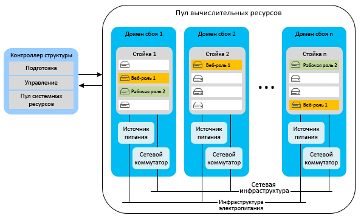
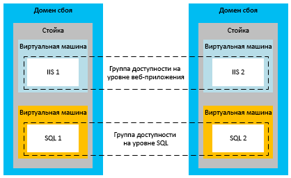
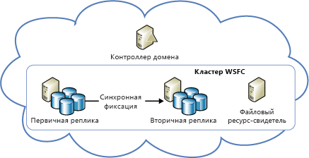
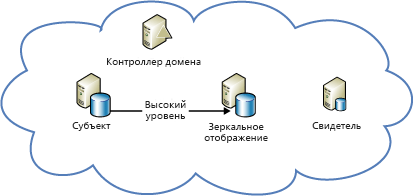

[!INCLUDE [header](../_includes/header.md)]
# Техническое руководство по обеспечению устойчивости в Azure. Восстановление после локальных сбоев в AzureAzure resiliency technical guidance: Recovery from local failures in Azure

На доступность приложения могут повлиять два основных фактора:There are two primary threats to application availability:

* сбой устройств, таких как диски и серверы;The failure of devices, such as drives and servers
* нехватка критически важных ресурсов, например вычислительных ресурсов при пиковой нагрузке.The exhaustion of critical resources, such as compute under peak load conditions

Azure позволяет сохранить высокий уровень доступности в этих условиях благодаря сочетанию управления ресурсами, обеспечения эластичности, балансировки нагрузки и секционирования.Azure provides a combination of resource management, elasticity, load balancing, and partitioning to enable high availability under these circumstances. Некоторые из этих функций выполняются автоматически для всех облачных служб.Some of these features are performed automatically for all Azure services. Но иногда разработчику приложения необходимо выполнить дополнительные действия, чтобы обеспечить применение этих функций.However, in some cases, the application developer must do some additional work to benefit from them.

## Облачные службыCloud Services
Все облачные службы представляют собой коллекции экземпляров одной или нескольких веб- либо рабочих ролей.Azure Cloud Services consists of collections of one or more web or worker roles. Несколько экземпляров одной роли могут выполняться одновременно.One or more instances of a role can run concurrently. Количество экземпляров зависит от заданной конфигурации.The configuration determines the number of instances. Отслеживание экземпляров роли и управление ими осуществляется с помощью контроллера структуры.Role instances are monitored and managed through a component called the fabric controller. Этот компонент автоматически обнаруживает сбои программного обеспечения и оборудования и реагирует на них.The fabric controller detects and responds to both software and hardware failures automatically.

Каждый экземпляр роли выполняется в отдельной виртуальной машине и взаимодействует с контроллером структуры через гостевого агента.Every role instance runs in its own virtual machine (VM) and communicates with its fabric controller through a guest agent. Гостевой агент собирает метрики ресурсов и узлов, в том числе показатели использования виртуальных машин и ресурсов, данные журналов, а также сведения о состоянии, исключениях и сбоях.The guest agent collects resource and node metrics, including VM usage, status, logs, resource usage, exceptions, and failure conditions. Контроллер структуры отправляет запросы к гостевому агенту через интервалы, заданные в настройках, и перезапускает виртуальную машину, если гостевой агент не отвечает.The fabric controller queries the guest agent at configurable intervals, and it restarts the VM if the guest agent fails to respond. В случае сбоя оборудования связанный контроллер структуры перемещает все затронутые экземпляры роли на новый аппаратный узел и соответствующим образом изменяет параметры маршрутизации трафика в настройках сети.In the event of hardware failure, the associated fabric controller moves all affected role instances to a new hardware node and reconfigures the network to route traffic there.

Для использования этих возможностей разработчикам необходимо настроить все роли служб таким образом, чтобы они не сохраняли сведения о состоянии в экземплярах роли.To benefit from these features, developers should ensure that all service roles avoid storing state on the role instances. Вместо этого все постоянные данные должны храниться в долговременном хранилище, например в службе хранилища Azure или Базе данных SQL Azure.Instead, all persistent data should be accessed from durable storage, such as Azure Storage or Azure SQL Database. В этом случае запросы могут обрабатываться с помощью любых ролей.This allows any roles to handle requests. Кроме того, если экземпляры роли в любое время выйдут из строя, это не вызовет несоответствия между временным и постоянным состояниями службы.It also means that role instances can go down at any time without creating inconsistencies in the transient or persistent state of the service.

Необходимость хранить сведения о состоянии вне экземпляров роли сопровождается некоторыми требованиями.The requirement to store state externally to the roles has several implications. К примеру, все связанные изменения в таблице службы хранилища Azure по возможности должны осуществляться в одной транзакции группы сущностей.It implies, for example, that all related changes to an Azure Storage table should be changed in a single entity-group transaction, if possible. Конечно, внести все изменения в рамках одной транзакции возможно не всегда.Of course, it isn't always possible to make all changes in a single transaction. Необходимо также принять специальные меры, чтобы сбои экземпляров роли не вызывали проблем в случае прерывания длительных операций, охватывающих два и более обновлений постоянного состояния службы.You must take special care to ensure that role instance failures do not cause problems when they interrupt long-running operations that span two or more updates to the persistent state of the service. Другая роль, которая попытается повторить эту операцию, должна быть готова обрабатывать случаи, когда операция была частично завершена.If another role attempts to retry such an operation, it should anticipate and handle the case where the work was partially completed.

Например, если в службе, которая распределяет секции данных между несколькими хранилищами,For example, consider a service that partitions data across multiple stores. рабочая роль выйдет из строя при перемещении сегмента, эта операция может не завершитьсяIf a worker role goes down while it's relocating a shard, the relocation of the shard might not finish. либо ее может заново начать другая рабочая роль, что может привести к потере или повреждению данных.Or the relocation might be repeated from its inception by a different worker role, potentially causing orphaned data or data corruption. Чтобы предотвратить возникновение таких проблем, длительные операции должны иметь следующие характеристики.To prevent problems, long-running operations must be one or both of the following:

* *Идемпотентность*. Повторяемые операции без побочных эффектов.*Idempotent*: Repeatable without side effects. Идемпотентная длительная операция должна действовать одинаково, независимо от того, сколько раз она выполняется, даже в случае прерывания во время выполнения.To be idempotent, a long-running operation should have the same effect no matter how many times it's executed, even when it's interrupted during execution.
* *Добавочная возобновляемость*. Операции, способные продолжаться с момента сбоя.*Incrementally restartable*: Able to continue from the most recent point of failure. Добавочно возобновляемая длительная операция должна состоять из последовательности небольших атомарных операций.To be incrementally restartable, a long-running operation should consist of a sequence of smaller atomic operations. Кроме того, во время этой операции в долговременное хранилище должны записываться сведения о ходе ее выполнения, чтобы при каждом последующем вызове ее выполнение продолжалось с момента остановки.It should also record its progress in durable storage, so that each subsequent invocation picks up where its predecessor stopped.

И наконец, все длительные операции должны вызываться несколько раз, пока они не будут полностью завершены.Finally, all long-running operations should be invoked repeatedly until they succeed. Например, операция подготовки, помещенная в очередь Azure, будет удалена из нее экземпляром рабочей роли только после успешного завершения.For example, a provisioning operation might be placed in an Azure queue, and then removed from the queue by a worker role only when it succeeds. Для очистки данных, созданных в результате прерванных операций, может потребоваться сборка мусора.Garbage collection might be necessary to clean up data that interrupted operations create.

### ЭластичностьElasticity
Начальное количество выполняющихся экземпляров для каждой роли определено в конфигурации соответствующей роли.The initial number of instances running for each role is determined in each role’s configuration. Администраторы должны изначально настроить для каждой роли выполнение двух или более экземпляров с учетом ожидаемой нагрузки.Administrators should initially configure each role to run with two or more instances based on expected load. Тем не менее число экземпляров роли можно с легкостью увеличить или уменьшить по мере изменения шаблонов использования.But you can easily scale role instances up or down as usage patterns change. Эту операцию можно выполнить вручную на портале Azure или автоматизировать с помощью Windows PowerShell, API управления службами или сторонних инструментов.You can do this manually in the Azure portal, or you can automate the process by using Windows PowerShell, the Service Management API, or third-party tools. Дополнительные сведения см. в статье [Автомасштабирование облачной службы](/azure/cloud-services/cloud-services-how-to-scale/).For more information, see [How to autoscale an application](/azure/cloud-services/cloud-services-how-to-scale/).

### СекционированиеPartitioning
Контроллер структуры Azure использует два компонента для секционирования:The Azure fabric controller uses two types of partitions:

* *Домен обновления* используется для обновления экземпляров роли службы в группах.An *update domain* is used to upgrade a service’s role instances in groups. Служба Azure развертывает экземпляры службы в нескольких доменах обновления.Azure deploys service instances into multiple update domains. При обновлении на месте контроллер структуры завершает работу всех экземпляров в одном домене обновления, обновляет их и перезапускает, а затем переходит к следующему домену обновления.For an in-place update, the fabric controller brings down all the instances in one update domain, updates them, and then restarts them before moving to the next update domain. Этот подход позволяет предотвратить недоступность всей службы во время процесса обновления.This approach prevents the entire service from being unavailable during the update process.
* *Домен сбоя* используется для изоляции компонентов оборудования или сети, которые являются потенциальными точками отказа.A *fault domain* defines potential points of hardware or network failure. Контроллер структуры распределяет экземпляры ролей с несколькими экземплярами между несколькими доменами сбоя, чтобы избежать прерывания работы службы из-за сбоев отдельного оборудования.For any role that has more than one instance, the fabric controller ensures that the instances are distributed across multiple fault domains, to prevent isolated hardware failures from disrupting service. С помощью доменов сбоя в Azure регулируются все риски, связанные со сбоями серверных и кластерных компонентов.Fault domains govern all exposure to server and cluster failures.

В соответствии с [соглашением об уровне обслуживания Azure](https://azure.microsoft.com/support/legal/sla/) корпорация Майкрософт гарантирует, что два или несколько экземпляров веб-роли, развернутых в разных доменах сбоя и обновления, будут иметь возможность внешнего подключения по крайней мере 99,95 % времени.The [Azure service-level agreement (SLA)](https://azure.microsoft.com/support/legal/sla/) guarantees that when two or more web role instances are deployed to different fault and upgrade domains, they'll have external connectivity at least 99.95 percent of the time. В отличие от доменов обновления количеством доменов сбоя управлять невозможно.Unlike update domains, there's no way to control the number of fault domains. Служба Azure автоматически выделяет домены сбоя и распределяет между ними экземпляры роли.Azure automatically allocates fault domains and distributes role instances across them. По крайней мере два первых экземпляра каждой роли размещаются в разных доменах сбоя и обновления, чтобы гарантировать, что каждая роль с минимум двумя экземплярами будет удовлетворять условиям соглашения об уровне обслуживания.At least the first two instances of every role are placed in different fault and upgrade domains to ensure that any role with at least two instances will satisfy the SLA. Это показано на схеме ниже.This is represented in the following diagram.

### Балансировка нагрузки.Load balancing
Весь входящий трафик веб-роли проходит через балансировщик нагрузки без отслеживания состояния, который распределяет запросы клиентов между экземплярами роли.All inbound traffic to a web role passes through a stateless load balancer, which distributes client requests among the role instances. У отдельных экземпляров роли нет общедоступных IP-адресов, и они недоступны напрямую через Интернет.Individual role instances do not have public IP addresses, and they are not directly addressable from the Internet. Веб-роли не отслеживают состояние, поэтому любой запрос клиента может быть направлен в любой экземпляр роли.Web roles are stateless so that any client request can be routed to any role instance. Каждые 15 секунд возникает событие [StatusCheck](https://msdn.microsoft.com/library/microsoft.windowsazure.serviceruntime.roleenvironment.statuscheck.aspx).A [StatusCheck](https://msdn.microsoft.com/library/microsoft.windowsazure.serviceruntime.roleenvironment.statuscheck.aspx) event is raised every 15 seconds. Оно позволяет узнать, готова ли роль к приему трафика. Если роль занята, она перестанет использоваться в балансировщике нагрузки.You can use this to indicate whether the role is ready to receive traffic, or whether it's busy and should be taken out of the load-balancer rotation.

## Виртуальные машиныVirtual Machines
С точки зрения высокой доступности виртуальные машины Azure отличаются от вычислительных ролей модели "платформа как услуга" (PaaS) в нескольких аспектах.Azure Virtual Machines differs from platform as a service (PaaS) compute roles in several respects in relation to high availability. В некоторых случаях для обеспечения высокой доступности требуются дополнительные действия.In some instances, you must do additional work to ensure high availability.

### Устойчивость дискаDisk durability
В отличие от экземпляров роли PaaS данные, хранящиеся на дисках виртуальной машины, остаются постоянными даже при перемещении виртуальной машины.Unlike PaaS role instances, data stored on virtual machine drives is persistent even when the virtual machine is relocated. Виртуальные машины Azure используют диски виртуальной машины, которые представлены в качестве больших двоичных объектов в службе хранилища Azure.Azure virtual machines use VM disks that exist as blobs in Azure Storage. Благодаря возможностям доступности службы хранилища Azure данные, хранящиеся на дисках виртуальной машины, также имеют высокий уровень доступности.Because of the availability characteristics of Azure Storage, the data stored on a virtual machine’s drives is also highly available.

Однако это не относится к диску D (в виртуальных машинах Windows).Note that drive D (in Windows VMs) is the exception to this rule. Диск D представляет собой физическое хранилище на стоечном сервере, где размещена виртуальная машина. При перезапуске этого диска хранящиеся на нем данные будут потеряны.Drive D is actually physical storage on the rack server that hosts the VM, and its data will be lost if the VM is recycled. Таким образом, диск D предназначен только для временного хранения.Drive D is intended for temporary storage only. В Linux Azure обычно (но не всегда) предоставляет в качестве локального временного диска блочное устройство /dev/sdb.In Linux, Azure “usually” (but not always) exposes the local temporary disk as /dev/sdb block device. Зачастую он подключается агентом Linux для Azure. Точками подключения выступают /mnt/resource и /mnt (настраиваемые в файле конфигурации /etc/waagent.conf).It is often mounted by the Azure Linux Agent as /mnt/resource or /mnt mount points (configurable via /etc/waagent.conf).

### СекционированиеPartitioning
Служба Azure изначально распознает уровни приложения PaaS (веб-роль и рабочая роль) и, соответственно, может должным образом распределить их по доменам сбоя и обновления.Azure natively understands the tiers in a PaaS application (web role and worker role) and thus can properly distribute them across fault and update domains. Уровни в приложениях IaaS, напротив, следует определить вручную с помощью групп доступности.In contrast, the tiers in an infrastructure as a service (IaaS) application must be manually defined through availability sets. Группы доступности требуются в рамках соглашения об уровне обслуживания для систем IaaS.Availability sets are required for an SLA under IaaS.

На схеме выше уровень Internet Information Server (IIS), который выступает в качестве уровня веб-приложения, и уровень SQL, который выступает в качестве уровня данных, назначены разным группам доступности.In the preceding diagram, the Internet Information Services (IIS) tier (which works as a web app tier) and the SQL tier (which works as a data tier) are assigned to different availability sets. Это позволяет гарантировать аппаратную избыточность всех экземпляров каждого уровня за счет распределения виртуальных машин по доменам сбоя и поддержания уровней работы во время обновления.This ensures that all instances of each tier have hardware redundancy by distributing virtual machines across fault domains, and that entire tiers are not taken down during an update.

### Балансировка нагрузки.Load balancing
Если требуется распределять трафик между виртуальными машинами, необходимо сгруппировать их в приложении и распределить нагрузку в определенной конечной точке TCP или UDP.If the VMs should have traffic distributed across them, you must group the VMs in an application and load balance across a specific TCP or UDP endpoint. Дополнительные сведения см. в статье [Балансировка нагрузки для служб инфраструктуры Azure](/azure/virtual-machines/virtual-machines-linux-load-balance/?toc=%2fazure%2fvirtual-machines%2flinux%2ftoc.json).For more information, see [Load balancing virtual machines](/azure/virtual-machines/virtual-machines-linux-load-balance/?toc=%2fazure%2fvirtual-machines%2flinux%2ftoc.json). Если виртуальные машины получают входящие данные из другого источника (например, механизма очередей), то балансировщик нагрузки не требуется.If the VMs receive input from another source (for example, a queuing mechanism), a load balancer is not required. Балансировщик нагрузки использует обычную проверку работоспособности, чтобы определить, следует ли отправлять трафик на узел.The load balancer uses a basic health check to determine whether traffic should be sent to the node. Можно также настроить собственные зонды, которые помогут определить, следует ли отправлять трафик в виртуальную машину, на основе метрик работоспособности приложения.It's also possible to create your own probes to implement application-specific health metrics that determine whether the VM should receive traffic.

## ХранилищеStorage
Служба хранилища Azure — это базовая служба долговременного хранения данных Azure,Azure Storage is the baseline durable data service for Azure. которая предоставляет хранилища BLOB-объектов, таблиц, очередей и дисков виртуальных машин.It provides blob, table, queue, and VM disk storage. Она обеспечивает высокую доступность в пределах одного центра обработки данных благодаря сочетанию репликации и управления ресурсами.It uses a combination of replication and resource management to provide high availability within a single datacenter. Соглашение об уровне обслуживания по доступности службы хранилища Azure гарантирует, что по крайней мере в 99,9 % случаев:The Azure Storage availability SLA guarantees that at least 99.9 percent of the time:

* правильно отформатированные запросы на добавление, обновление, чтение и удаление данных будут должным образом обработаны;Correctly formatted requests to add, update, read, and delete data will be successfully and correctly processed.
* учетные записи хранения будут иметь возможность подключения к шлюзу Интернета.Storage accounts will have connectivity to the Internet gateway.

### РепликацияReplication
Надежность данных в службе хранилища Azure обеспечивается за счет хранения нескольких копий всех данных на разных дисках, расположенных в полностью независимых физических подсистемах хранения в регионе.Azure Storage facilitates data durability by maintaining multiple copies of all data on different drives across fully independent physical storage subsystems within the region. Данные реплицируются синхронно, и перед подтверждением записи все копии фиксируются.Data is replicated synchronously, and all copies are committed before the write is acknowledged. Служба хранилища Azure строго согласованная. Это означает, что операции чтения гарантировано отражают последние записанные данные.Azure Storage is strongly consistent, meaning that reads are guaranteed to reflect the most recent writes. Кроме того, копии данных постоянно сканируются на наличие ухудшения производительности и нарушения целостности (чему часто не уделяют должного внимания). В случае обнаружения эти проблемы устраняются.In addition, copies of data are continually scanned to detect and repair bit rot, an often overlooked threat to the integrity of stored data.

Служба хранилища Azure обеспечивает репликацию служб.Services benefit from replication just by using Azure Storage. Разработчику службы не нужно предпринимать какие-либо дополнительные действия для восстановления после локального сбоя.The service developer doesn't need to do additional work to recover from a local failure.

### Управление ресурсамиResource management
Учетные записи хранения, созданные после мая 2014 года, могут предоставлять до 500 ТБ емкости (предыдущее ограничение — 200 ТБ).Storage accounts created after May 2014, can grow to up to 500 TB (the previous maximum was 200 TB). Если этого пространства недостаточно, приложения необходимо спроектировать таким образом, чтобы они поддерживали использование нескольких учетных записей хранения.If additional space is required, applications must be designed to use multiple storage accounts.

### Диски виртуальной машиныVirtual machine disks
Диск виртуальной машины хранится в качестве страничного BLOB-объекта в службе хранилища Azure, благодаря чему он получает те же свойства надежности и масштабируемости, что и хранилище BLOB-объектов.A virtual machine’s disk is stored as a page blob in Azure Storage, giving it all the same durability and scalability properties as Blob storage. Таким образом, данные на диске виртуальной машины не могут быть утеряны, даже если на сервере, где запущена виртуальная машина, происходит сбой и ее необходимо перезапустить на другом сервере.This design makes the data on a virtual machine’s disk persistent, even if the server running the VM fails and the VM must be restarted on another server.

## База данныхDatabase
### База данных SQLSQL Database
База данных SQL Azure предоставляется как услуга.Azure SQL Database provides database as a service. Благодаря этому приложения могут быстро подготавливать реляционные базы данных, вставлять в них данные и отправлять к ним запросы.It allows applications to quickly provision, insert data into, and query relational databases. Эта база данных содержит много привычных возможностей и функций SQL Server, а все, что касается оборудования, конфигурации, исправлений и устойчивости, представлено в ней на абстрактном уровне.It provides many of the familiar SQL Server features and functionality, while abstracting the burden of hardware, configuration, patching, and resiliency.

> [!NOTE]
> База данных SQL Azure не предоставляет все точно такие же функции, как SQL Server.Azure SQL Database does not provide one-to-one feature parity with SQL Server. Она предназначена для выполнения других требований, соответствующих облачным приложениям (эластичное масштабирование, предоставление модели "база данных как услуга" для уменьшения расходов на обслуживание и т. д.).It's intended to fulfill a different set of requirements--one that's uniquely suited to cloud applications (elastic scale, database as a service to reduce maintenance costs, and so on). Дополнительные сведения см. в [этой статье](/azure/sql-database/sql-database-paas-vs-sql-server-iaas/).For more information, see [Choose a cloud SQL Server option: Azure SQL (PaaS) Database or SQL Server on Azure VMs (IaaS)](/azure/sql-database/sql-database-paas-vs-sql-server-iaas/).
> 
> 

#### РепликацияReplication
База данных SQL Azure обеспечивает высокий уровень устойчивости к сбоям на уровне узла.Azure SQL Database provides built-in resiliency to node-level failure. Все операции записи в базу данных автоматически реплицируются на два или более фоновых узла с помощью метода фиксации кворума.All writes into a database are automatically replicated to two or more background nodes through a quorum commit technique. При этом транзакция будет считаться завершенной и вернется, только если первичная реплика и по крайней мере одна вторичная реплика подтвердят, что действие записано в журнал транзакций. В случае сбоя узла база данных автоматически переносится на одну из вторичных реплик.(The primary and at least one secondary must confirm that the activity is written to the transaction log before the transaction is deemed successful and returns.) In the case of node failure, the database automatically fails over to one of the secondary replicas. При этом временное подключение для клиентских приложений прерывается.This causes a transient connection interruption for client applications. По этой причине все клиенты Базы данных SQL Azure должны выполнять определенный вид обработки временных подключений.For this reason, all Azure SQL Database clients must implement some form of transient connection handling. Дополнительные сведения см. в статье [Конкретные рекомендации по использованию механизма повторов](/azure/best-practices-retry-service-specific/).For more information, see [Retry service specific guidance](/azure/best-practices-retry-service-specific/).

#### Управление ресурсамиResource management
Во время создания для каждой базы данных задается предельное значение размера.Each database, when created, is configured with an upper size limit. В настоящее время максимальный размер составляет 1 ТБ. Ограничения размера зависят от уровня службы. См. сведения об [уровнях служб и производительности баз данных SQL Azure](/azure/sql-database/sql-database-resource-limits/#service-tiers-and-performance-levels).The currently available maximum size is 1 TB (size limits vary based on your service tier, see [service tiers and performance levels of Azure SQL Databases](/azure/sql-database/sql-database-resource-limits/#service-tiers-and-performance-levels). Если база данных достигает максимального размера, последующие команды вставки и обновления отклоняютсяWhen a database hits its upper size limit, it rejects additional INSERT or UPDATE commands. (запрос и удаление данных по-прежнему возможны).(Querying and deleting data is still possible.)

Для управления ресурсами в Базе данных SQL Azure используется структура.Within a database, Azure SQL Database uses a fabric to manage resources. Однако вместо контроллера структуры для обнаружения сбоев применяется кольцевая топология.However, instead of a fabric controller, it uses a ring topology to detect failures. Каждая реплика в кластере имеет два соседних экземпляра и отвечает за обнаружение, когда они выходят из строя.Every replica in a cluster has two neighbors and is responsible for detecting when they go down. Если реплика выходит из строя, ее соседи активируют агент перенастройки, чтобы повторно создать эту реплику на другом компьютере.When a replica goes down, its neighbors trigger a reconfiguration agent to re-create it on another machine. Чтобы логический сервер не использовал слишком много ресурсов на виртуальной машине и не превышал физические ограничения, осуществляется регулирование ресурсов ядра.Engine throttling is provided to ensure that a logical server doesn't use too many resources on a machine or exceed the machine’s physical limits.

### ЭластичностьElasticity
Если приложению требуется более 1 ТБ емкости для базы данных, необходимо применить масштабирование.If the application requires more than the 1 TB database limit, it must implement a scale-out approach. Масштабирование при использовании Базы данных SQL Azure можно выполнить путем секционирования данных по нескольким базам данных SQL вручную (также известно как сегментирование).You scale out with Azure SQL Database by manually partitioning, also known as sharding, data across multiple SQL databases. Такой подход гарантирует практически линейный рост затрат в соответствии с масштабом.This scale-out approach provides the opportunity to achieve nearly linear cost growth with scale. Гибкий рост или предоставление емкости по запросу могут сопровождаться добавочными затратами, так как счета за базы данных выставляются на основе средней фактической используемой емкости за день, а не максимально возможного размера.Elastic growth or capacity on demand can grow with incremental costs as needed because databases are billed based on the average actual size used per day, not based on maximum possible size.

## SQL Server на виртуальных машинахSQL Server on Virtual Machines
Установив SQL Server (версии 2014 или более поздней) на виртуальных машинах Azure, вы получаете стандартные функции обеспечения доступности SQL Server,By installing SQL Server (version 2014 or later) on Azure Virtual Machines, you can take advantage of the traditional availability features of SQL Server. такие как группы доступности AlwaysOn и зеркальное отображение базы данных.These features include AlwaysOn Availability Groups and database mirroring. Обратите внимание, что виртуальные машины, хранилища и сети Azure имеют рабочие характеристики, отличные от характеристик локальной, невиртуализированной ИТ-инфраструктуры.Note that Azure VMs, storage, and networking have different operational characteristics than an on-premises, non-virtualized IT infrastructure. Чтобы успешно реализовать решение по обеспечению высокой доступности и аварийному восстановлению для SQL Server в Azure, вы должны понимать эти различия и учитывать их при разработке решения.A successful implementation of a high availability/disaster recovery (HA/DR) SQL Server solution in Azure requires that you understand these differences and design your solution to accommodate them.

### Узлы с высоким уровнем доступности в группе доступностиHigh-availability nodes in an availability set
При реализации решения для обеспечения высокой доступности в Azure группа доступности позволяет помещать узлы с высоким уровнем доступности в отдельные домены сбоя и обновления.When you implement a high-availability solution in Azure, you can use the availability set in Azure to place the high-availability nodes into separate fault domains and upgrade domains. Следует уточнить, что группа доступности — это понятие Azure.To be clear, the availability set is an Azure concept. Это рекомендуемый подход, которому необходимо следовать, чтобы обеспечить высокую доступность баз данных при использовании групп доступности AlwaysOn, зеркального отображения базы данных или других методов.It's a best practice that you should follow to make sure that your databases are indeed highly available, whether you're using AlwaysOn Availability Groups, database mirroring, or something else. В противном случае вы можете думать, что в вашей системе обеспечена высокая доступность,If you don't follow this best practice, you might be under the false assumption that your system is highly available. но на самом деле все узлы могут одновременно выйти из строя, так как они размещены в одном домене сбоя в регионе Azure.But in reality, your nodes can all fail simultaneously because they happen to be placed in the same fault domain in the Azure region.

Этот подход неприменим при использовании доставки журналов,This recommendation is not as applicable with log shipping. так как это решение предназначено для обеспечения аварийного восстановления, и, следовательно, серверы должны находиться в разных регионах Azure.As a disaster recovery feature, you should ensure that the servers are running in separate Azure regions. По определению эти регионы представляют собой отдельные домены сбоя.By definition, these regions are separate fault domains.

Чтобы развертываемые на классическом портале виртуальные машины облачных служб Azure находились в одной группе доступности, их необходимо развернуть в одной облачной службе.For Azure Cloud Services VMs deployed through the classic portal to be in the same availability set, you must deploy them in the same Cloud Service. Что же касается виртуальных машин, развертываемых с помощью Azure Resource Manager (на текущем портале), такого ограничения нет.VMs deployed through Azure Resource Manager (the current portal) do not have this limitation. При развертывании виртуальных машин в облачной службе Azure через классический портал в одной группе доступности можно разместить только узлы одной облачной службы.For classic portal deployed VMs in Azure Cloud Service, only nodes in the same Cloud Service can participate in the same availability set. Кроме того, виртуальные машины облачных служб должны находиться в одной и той же виртуальной сети, чтобы их IP-адреса не менялись даже после восстановления службы.In addition, the Cloud Services VMs should be in the same virtual network to ensure that they maintain their IPs even after service healing. Это позволяет избежать сбоев при обновлении DNS.This avoids DNS update disruptions.

### Только в Azure: решения для обеспечения высокой доступностиAzure-only: High-availability solutions
У вас может быть решение высокого уровня доступности для баз данных SQL Server в Azure, использующее группы доступности AlwaysOn или зеркальное отображение базы данных.You can have a high-availability solution for your SQL Server databases in Azure by using AlwaysOn Availability Groups or database mirroring.

На схеме ниже показана архитектура групп доступности AlwaysOn в виртуальных машинах Azure.The following diagram demonstrates the architecture of AlwaysOn Availability Groups running on Azure Virtual Machines. Эта схема взята из подробной статьи на эту тему: [Высокий уровень доступности и аварийное восстановление для SQL Server на виртуальных машинах Azure](/azure/virtual-machines/windows/sql/virtual-machines-windows-sql-high-availability-dr/).This diagram was taken from the in-depth article on this subject, [High availability and disaster recovery for SQL Server on Azure Virtual Machines](/azure/virtual-machines/windows/sql/virtual-machines-windows-sql-high-availability-dr/).

С помощью шаблона AlwaysOn на портале Azure можно автоматически подготовить готовое развертывание групп доступности AlwaysOn в виртуальных машинах Azure.You can also automatically provision an AlwaysOn Availability Groups deployment end-to-end on Azure VMs by using the AlwaysOn template in the Azure portal. Дополнительные сведения см. в записи блога [SQL Server AlwaysOn Offering in Microsoft Azure Portal Gallery](https://blogs.technet.microsoft.com/dataplatforminsider/2014/08/25/sql-server-alwayson-offering-in-microsoft-azure-portal-gallery/) (Предложения AlwaysOn SQL Server в коллекции портала Microsoft Azure).For more information, see [SQL Server AlwaysOn Offering in Microsoft Azure Portal Gallery](https://blogs.technet.microsoft.com/dataplatforminsider/2014/08/25/sql-server-alwayson-offering-in-microsoft-azure-portal-gallery/).

На схеме ниже показано использование зеркального отображения базы данных в виртуальных машинах Azure.The following diagram demonstrates the use of database mirroring on Azure Virtual Machines. Эта схема взята из той же подробной статьи: [Высокий уровень доступности и аварийное восстановление для SQL Server на виртуальных машинах Azure](/azure/virtual-machines/windows/sql/virtual-machines-windows-sql-high-availability-dr/).It was also taken from the in-depth topic [High availability and disaster recovery for SQL Server on Azure Virtual Machines](/azure/virtual-machines/windows/sql/virtual-machines-windows-sql-high-availability-dr/).

> [!NOTE]
> В обеих архитектурах требуется контроллер домена.Both architectures require a domain controller. Однако при применении зеркального отображения базы данных можно использовать сертификаты сервера, и тогда необходимость в контроллере домена отпадет.However, with database mirroring, it's possible to use server certificates to eliminate the need for a domain controller.
> 
> 

## Другие службы платформы AzureOther Azure platform services
Приложения, созданные на основе Azure, поддерживают возможности платформы для восстановления после локальных сбоев.Applications that are built on Azure benefit from platform capabilities to recover from local failures. В некоторых случаях можно предпринять определенные действия, чтобы повысить доступность для конкретного сценария.In some cases, you can take specific actions to increase availability for your specific scenario.

### Service BusService Bus
Чтобы снизить риск временного сбоя служебной шины Azure, можно создать долгосрочную очередь на стороне клиента.To mitigate against a temporary outage of Azure Service Bus, consider creating a durable client-side queue. Это временный альтернативный метод, позволяющий локально хранить сообщения, которые не могут быть добавлены в очередь служебной шины.This temporarily uses an alternate, local storage mechanism to store messages that cannot be added to the Service Bus queue. Эти временно хранимые сообщения будут обработаны в приложении после восстановления работы службы.The application can decide how to handle the temporarily stored messages after the service is restored. Дополнительные сведения см. в статье [Рекомендации по повышению производительности с помощью обмена сообщениями через брокер в служебной шине](/azure/service-bus-messaging/service-bus-performance-improvements/) и в разделе о [служебной шине в рамках решения по аварийному восстановлению](recovery-loss-azure-region.md#other-azure-platform-services).For more information, see [Best practices for performance improvements using Service Bus brokered messaging](/azure/service-bus-messaging/service-bus-performance-improvements/) and [Service Bus (disaster recovery)](recovery-loss-azure-region.md#other-azure-platform-services).

### HDInsightHDInsight
Данные, связанные с Azure HDInsight, по умолчанию сохраняются в хранилище BLOB-объектов Azure.The data that's associated with Azure HDInsight is stored by default in Azure Blob storage. Свойства высокой доступности и устойчивости для хранилища BLOB-объектов задаются в службе хранилища Azure.Azure Storage specifies high-availability and durability properties for Blob storage. Во временной распределенной файловой системе Hadoop (HDFS), которую при необходимости подготавливает служба HDInsight, выполняется многоузловая обработка в рамках заданий Hadoop MapReduce.The multiple-node processing that's associated with Hadoop MapReduce jobs occurs on a transient Hadoop Distributed File System (HDFS) that is provisioned when HDInsight needs it. Результаты задания MapReduce также по умолчанию сохраняются в хранилище BLOB-объектов Azure. Таким образом, обработанные данные устойчивы и имеют высокий уровень доступности после отзыва кластера Hadoop.Results from a MapReduce job are also stored by default in Azure Blob storage, so that the processed data is durable and remains highly available after the Hadoop cluster is deprovisioned. Дополнительные сведения см. в разделе об [HDInsight в рамках решения по аварийному восстановлению](recovery-loss-azure-region.md#other-azure-platform-services).For more information, see [HDInsight (disaster recovery)](recovery-loss-azure-region.md#other-azure-platform-services).

## Контрольные списки для локальных сбоевChecklists for local failures
### Облачные службыCloud Services
1. Просмотрите раздел "Облачные службы" этого документа.Review the Cloud Services section of this document.
2. Настройте по крайней мере два экземпляра для каждой роли.Configure at least two instances for each role.
3. Сохраняйте сведения о состоянии в долговременном хранилище, а не в экземплярах роли.Persist state in durable storage, not on role instances.
4. Настройте правильную обработку события StatusCheck.Correctly handle the StatusCheck event.
5. По возможности объединяйте связанные изменения в транзакциях.Wrap related changes in transactions when possible.
6. Убедитесь, что задачи рабочей роли идемпотентные и перезапускаемые.Verify that worker role tasks are idempotent and restartable.
7. Настройте выполнение вызова неудачных операций до тех пор, пока они не будут завершены.Continue to invoke operations until they succeed.
8. Рассмотрите возможность применения стратегий автоматического масштабирования.Consider autoscaling strategies.

### Виртуальные машиныVirtual Machines
1. Просмотрите раздел "Виртуальные машины" этого документа.Review the Virtual Machines section of this document.
2. Не используйте диск D для постоянного хранения.Do not use drive D for persistent storage.
3. Объединяйте виртуальные машины на уровне службы в группу доступности.Group machines in a service tier into an availability set.
4. Настройте балансировку нагрузки и при необходимости зонды.Configure load balancing and optional probes.

### ХранилищеStorage
1. Просмотрите раздел "Хранилище" этого документа.Review the Storage section of this document.
2. Используйте несколько учетных записей хранения, если объем данных или пропускной способности превышает квоту.Use multiple storage accounts when data or bandwidth exceeds quotas.

### База данных SQLSQL Database
1. Просмотрите раздел "База данных SQL" этого документа.Review the SQL Database section of this document.
2. Реализуйте политику повтора для обработки временных ошибок.Implement a retry policy to handle transient errors.
3. Используйте секционирование или сегментирование в качестве стратегии масштабирования.Use partitioning/sharding as a scale-out strategy.

### SQL Server на виртуальных машинахSQL Server on Virtual Machines
1. Просмотрите раздел "SQL Server на виртуальных машинах" этого документа.Review the SQL Server on Virtual Machines section of this document.
2. Следуйте приведенным выше рекомендациям для виртуальных машин.Follow the previous recommendations for Virtual Machines.
3. Используйте функции для обеспечения высокой доступности SQL Server, например AlwaysOn.Use SQL Server high availability features, such as AlwaysOn.

### Service BusService Bus
1. Просмотрите раздел "Служебная шина" этого документа.Review the Service Bus section of this document.
2. Рассмотрите возможность создания долгосрочной очереди на стороне клиента для хранения избыточных сообщений.Consider creating a durable client-side queue as a backup.

### HDInsightHDInsight
1. Просмотрите раздел "HDInsight" этого документа.Review the HDInsight section of this document.
2. Дополнительные действия, касающиеся обеспечения высокой доступности, в случае локальных сбоев для этого компонента отсутствуют.No additional availability steps are required for local failures.

