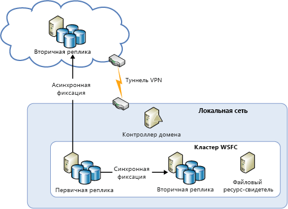
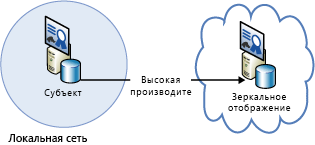
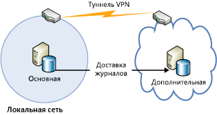
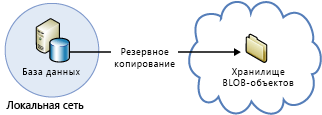

[!INCLUDE [header](../_includes/header.md)]
# Техническое руководство по обеспечению устойчивости в Azure. Восстановление из локальной среды в AzureAzure resiliency technical guidance: Recovery from on-premises to Azure
Azure предоставляет широкий набор служб для расширения локального центра обработки данных в Azure. Это позволяет повысить доступность и использовать аварийное восстановление.Azure provides a comprehensive set of services for enabling the extension of an on-premises datacenter to Azure for high availability and disaster recovery purposes:

* **Сеть**. Виртуальная частная сеть безопасно расширяет локальную сеть до облака.**Networking**: With a virtual private network, you securely extend your on-premises network to the cloud.
* **Среда выполнения**. Клиенты, использующие в локальной сети технологию Hyper-V, могут легко перенести существующие виртуальные машины в Azure.**Compute**: Customers using Hyper-V on-premises can “lift and shift” existing virtual machines (VMs) to Azure.
* **Хранилище**. StorSimple расширяет файловую систему до службы хранилища Azure.**Storage**: StorSimple extends your file system to Azure Storage. Служба архивации Azure позволяет архивировать файлы и базы данных SQL в службу хранилища Azure.The Azure Backup service provides backup for files and SQL databases to Azure Storage.
* **Репликация базы данных**. Группы доступности для SQL Server 2014 или более поздней версии обеспечивают высокую доступность и аварийное восстановление локальных данных.**Database replication**: With SQL Server 2014 (or later) Availability Groups, you can implement high availability and disaster recovery for your on-premises data.

## СетьNetworking
Виртуальная сеть Azure позволяет создавать логически изолированный раздел в среде Azure и безопасно подключать его к вашему локальному центру обработки данных или отдельному клиентскому компьютеру с помощью подключения IPsec.You can use Azure Virtual Network to create a logically isolated section in Azure and securely connect it to your on-premises datacenter or a single client machine by using an IPsec connection. Виртуальная сеть упрощает использование масштабируемой и доступной по запросу инфраструктуры Azure, обеспечивая при этом подключение к локальным данным и приложениям, в том числе к системам под управлением Windows Server или UNIX и мейнфреймам.With Virtual Network, you can take advantage of the scalable, on-demand infrastructure in Azure while providing connectivity to data and applications on-premises, including systems running on Windows Server, mainframes, and UNIX. Дополнительные сведения см. в документации по [сетям Azure](/azure/virtual-network/virtual-networks-overview/).See [Azure networking documentation](/azure/virtual-network/virtual-networks-overview/) for more information.

## Среда выполнения приложенийCompute
Если в локальной среде используется технология Hyper-V, вы можете перенести существующие виртуальные машины в среду Azure или других поставщиков услуг под управлением Windows Server 2012 или более поздней версии. Для этого не нужно вносить изменения в виртуальную машину или преобразовывать используемые ею форматы.If you're using Hyper-V on-premises, you can “lift and shift” existing virtual machines to Azure and service providers running Windows Server 2012 (or later), without making changes to the VM or converting VM formats. Дополнительные сведения см. в статье [О дисках и виртуальных жестких дисках для виртуальных машин](/azure/virtual-machines/virtual-machines-linux-about-disks-vhds/?toc=%2fazure%2fvirtual-machines%2flinux%2ftoc.json).For more information, see [About disks and VHDs for Azure virtual machines](/azure/virtual-machines/virtual-machines-linux-about-disks-vhds/?toc=%2fazure%2fvirtual-machines%2flinux%2ftoc.json).

## Azure Site RecoveryAzure Site Recovery
Azure предоставляет службу [Azure Site Recovery](https://azure.microsoft.com/services/site-recovery/) в формате DRaaS ("аварийное восстановление как услуга").If you want disaster recovery as a service (DRaaS), Azure provides [Azure Site Recovery](https://azure.microsoft.com/services/site-recovery/). Azure Site Recovery обеспечивает комплексную защиту для VMware, Hyper-V и физических серверов.Azure Site Recovery offers comprehensive protection for VMware, Hyper-V, and physical servers. Azure Site Recovery позволяет использовать для аварийного восстановления другой локальный сервер или платформу Azure.With Azure Site Recovery, you can use another on-premises server or Azure as your recovery site. Дополнительные сведения об Azure Site Recovery см. [здесь](https://azure.microsoft.com/documentation/services/site-recovery/).For more information on Azure Site Recovery, see the [Azure Site Recovery documentation](https://azure.microsoft.com/documentation/services/site-recovery/).

## ХранилищеStorage
Есть несколько вариантов использования Azure для резервного копирования локальных данных.There are several options for using Azure as a backup site for on-premises data.

### StorSimpleStorSimple
StorSimple безопасно и прозрачно интегрирует облачное хранилище и локальные приложения.StorSimple securely and transparently integrates cloud storage for on-premises applications. Это единое устройство, объединяющее высокопроизводительное многоуровневое локальное и облачное хранилище, динамическую архивацию, функции защиты данных на основе облака и аварийное восстановление.It also offers a single appliance that delivers high-performance tiered local and cloud storage, live archiving, cloud-based data protection, and disaster recovery. Дополнительные сведения см. на [странице продукта StorSimple](https://azure.microsoft.com/services/storsimple/).For more information, see the [StorSimple product page](https://azure.microsoft.com/services/storsimple/).

### Служба архивации AzureAzure Backup
Служба архивации Azure позволяет создавать резервные копии с помощью знакомых инструментов резервного копирования, доступных в Windows Server 2012 (или более поздней версии), Windows Server 2012 Essentials (или более поздней версии) и System Center 2012 Data Protection Manager (или более поздней версии).Azure Backup enables cloud backups by using the familiar backup tools in Windows Server 2012 (or later), Windows Server 2012 Essentials (or later), and System Center 2012 Data Protection Manager (or later). Эти средства позволяют управлять резервным копированием, как рабочим процессом, не зависящим от расположения хранилища резервных копий. При этом можно использовать как локальный диск, так и службу хранилища Azure.These tools provide a workflow for backup management that is independent of the storage location of the backups, whether a local disk or Azure Storage. После резервного копирования данных в облако авторизованные пользователи могут легко восстанавливать резервные копии на любом сервере.After data is backed up to the cloud, authorized users can easily recover backups to any server.

Если использовать добавочное резервное копирование, в облако передаются только изменения в файлах.With incremental backups, only changes to files are transferred to the cloud. Это позволяет эффективнее использовать место в хранилище и снижает потребности в пропускной способности. При этом поддерживается восстановление до точки во времени для нескольких версий данных.This helps to efficiently use storage space, reduce bandwidth consumption, and support point-in-time recovery of multiple versions of the data. Вы также можете использовать дополнительные функции, например политики хранения данных, сжатие данных и регулирование передачи данных.You can also choose to use additional features, such as data retention policies, data compression, and data transfer throttling. Использование Azure для размещения резервной копии имеет еще одно очевидное преимущество — резервные копии автоматически создаются во внешнем хранилище.Using Azure as the backup location has the obvious advantage that the backups are automatically “offsite”. Это снимает ряд вопросов по защите локальных носителей резервных копий.This eliminates the extra requirements to secure and protect on-site backup media.

Дополнительные сведения см. в статье [Что такое служба архивации Azure?](/azure/backup/backup-introduction-to-azure-backup/) и в разделе [Настройка резервного копирования Azure для данных DPM](https://technet.microsoft.com/library/jj728752.aspx).For more information, see [What is Azure Backup?](/azure/backup/backup-introduction-to-azure-backup/) and [Configure Azure Backup for DPM data](https://technet.microsoft.com/library/jj728752.aspx).

## База данныхDatabase
У вас может быть решение аварийного восстановления для баз данных SQL Server в гибридной ИТ-среде, использующее группы доступности AlwaysOn, зеркальное отображение базы данных и доставку журналов, а также резервное копирование и восстановление с помощью хранилища BLOB-объектов Azure.You can have a disaster recovery solution for your SQL Server databases in a hybrid-IT environment by using AlwaysOn Availability Groups, database mirroring, log shipping, and backup and restore with Azure Blob storage. Все эти решения используют SQL Server, работающий на виртуальных машинах Azure.All of these solutions use SQL Server running on Azure Virtual Machines.

Группы доступности AlwaysOn можно применять в гибридной ИТ-среде, где реплики баз данных существуют как локально, так и в облаке.AlwaysOn Availability Groups can be used in a hybrid-IT environment where database replicas exist both on-premises and in the cloud. Это показано на схеме ниже.This is shown in the following diagram.

Зеркальное отображение базы данных также может выполняться на локальных серверах и в облаке с управлением на основе сертификатов.Database mirroring can also span on-premises servers and the cloud in a certificate-based setup. Эта концепция представлена на схеме ниже.The following diagram illustrates this concept.

Доставка журналов может использоваться для синхронизации локальной базы данных с базой данных SQL Server на виртуальной машине Azure.Log shipping can be used to synchronize an on-premises database with a SQL Server database in an Azure virtual machine.

И наконец, вы можете создать резервную копию локальной базы данных прямо в хранилище BLOB-объектов Azure.Finally, you can back up an on-premises database directly to Azure Blob storage.

Дополнительные сведения см. в статьях [Высокий уровень доступности и аварийное восстановление для SQL Server на виртуальных машинах Azure](/azure/virtual-machines/windows/sql/virtual-machines-windows-sql-high-availability-dr/) и [Резервное копирование и восстановление SQL Server в виртуальных машинах Azure](/azure/virtual-machines/windows/sql/virtual-machines-windows-sql-backup-recovery/).For more information, see [High availability and disaster recovery for SQL Server in Azure virtual machines](/azure/virtual-machines/windows/sql/virtual-machines-windows-sql-high-availability-dr/) and [Backup and restore for SQL Server in Azure virtual machines](/azure/virtual-machines/windows/sql/virtual-machines-windows-sql-backup-recovery/).

## Контрольные списки для локального восстановления в Microsoft AzureChecklists for on-premises recovery in Microsoft Azure
### СетьNetworking
1. Просмотрите раздел "Сеть" этого документа.Review the Networking section of this document.
2. Используйте виртуальную сеть для безопасного подключения локальных ресурсов к облаку.Use Virtual Network to securely connect on-premises to the cloud.

### Среда выполнения приложенийCompute
1. Просмотрите раздел "Среда выполнения приложений" этого документа.Review the Compute section of this document.
2. Переместите виртуальные машины из среды Hyper-V в Azure.Relocate VMs between Hyper-V and Azure.

### ХранениеStorage
1. Просмотрите раздел "Хранилище" этого документа.Review the Storage section of this document.
2. Используйте службы StorSimple для реализации преимуществ облачного хранилища.Take advantage of StorSimple services for using cloud storage.
3. Используйте службу архивации Azure.Use the Azure Backup service.

### База данныхDatabase
1. Просмотрите раздел "База данных" этого документа.Review the Database section of this document.
2. Попробуйте использовать SQL Server в виртуальных машинах Azure для резервного копирования.Consider using SQL Server on Azure VMs as the backup.
3. Настройте группы доступности AlwaysOn.Set up AlwaysOn Availability Groups.
4. Настройте зеркальное отображение базы данных на основе сертификатов.Configure certificate-based database mirroring.
5. Используйте доставку журналов.Use log shipping.
6. Создайте резервную копию локальной базы данных в хранилище BLOB-объектов Azure.Back up on-premises databases to Azure Blob storage.

