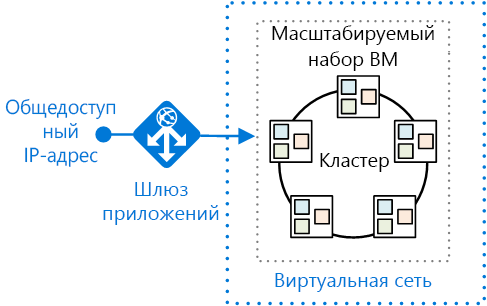
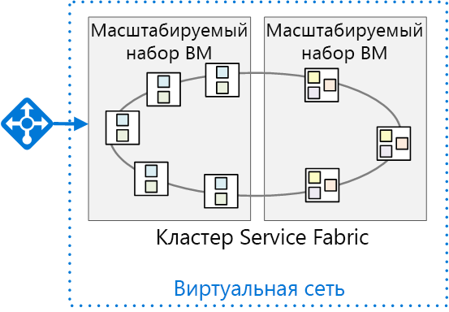

# <a name="migrate-an-azure-cloud-services-application-to-azure-service-fabric"></a><span data-ttu-id="c4fa7-103">Перенос приложения облачных служб Azure в Azure Service Fabric</span><span class="sxs-lookup"><span data-stu-id="c4fa7-103">Migrate an Azure Cloud Services application to Azure Service Fabric</span></span> 

<span data-ttu-id="c4fa7-104">[ Пример кода][sample-code]</span><span class="sxs-lookup"><span data-stu-id="c4fa7-104">[ Sample code][sample-code]</span></span>

<span data-ttu-id="c4fa7-105">В этой статье описывается перенос приложения из облачных служб Azure в Azure Service Fabric.</span><span class="sxs-lookup"><span data-stu-id="c4fa7-105">This article describes migrating an application from Azure Cloud Services to Azure Service Fabric.</span></span> <span data-ttu-id="c4fa7-106">Основное внимание уделяется архитектурным решениям и рекомендациям по работе.</span><span class="sxs-lookup"><span data-stu-id="c4fa7-106">It focuses on architectural decisions and recommended practices.</span></span> 

<span data-ttu-id="c4fa7-107">Для этого проекта мы начали работу с приложением облачных служб Surveys и перенесли его в Service Fabric.</span><span class="sxs-lookup"><span data-stu-id="c4fa7-107">For this project, we started with a Cloud Services application called Surveys and ported it to Service Fabric.</span></span> <span data-ttu-id="c4fa7-108">Нам нужно было перенести приложение, сделав при этом как можно меньше изменений.</span><span class="sxs-lookup"><span data-stu-id="c4fa7-108">The goal was to migrate the application with as few changes as possible.</span></span> <span data-ttu-id="c4fa7-109">В последующих статьях мы оптимизируем приложение Service Fabric, внедрив архитектуру микрослужб.</span><span class="sxs-lookup"><span data-stu-id="c4fa7-109">In a later article, we will optimize the application for Service Fabric by adopting a microservices architecture.</span></span>

<span data-ttu-id="c4fa7-110">Прежде чем ознакомиться с этой статьей, будет полезно понять базовые принципы Service Fabric и архитектуры микрослужб в целом.</span><span class="sxs-lookup"><span data-stu-id="c4fa7-110">Before reading this article, it will be useful to understand the basics of Service Fabric and microservices architectures in general.</span></span> <span data-ttu-id="c4fa7-111">Ознакомьтесь со следующими статьями:</span><span class="sxs-lookup"><span data-stu-id="c4fa7-111">See the following articles:</span></span>

- <span data-ttu-id="c4fa7-112">[Общие сведения о Service Fabric][sf-overview]</span><span class="sxs-lookup"><span data-stu-id="c4fa7-112">[Overview of Azure Service Fabric][sf-overview]</span></span>
- <span data-ttu-id="c4fa7-113">[Разработка приложений с использованием микрослужб][sf-why-microservices]</span><span class="sxs-lookup"><span data-stu-id="c4fa7-113">[Why a microservices approach to building applications?][sf-why-microservices]</span></span>


## <a name="about-the-surveys-application"></a><span data-ttu-id="c4fa7-114">О приложении Surveys</span><span class="sxs-lookup"><span data-stu-id="c4fa7-114">About the Surveys application</span></span>

<span data-ttu-id="c4fa7-115">В 2012 г. группа по разработке шаблонов и рекомендаций создала приложение Surveys для книги о [разработке многопользовательских приложений для облака][tailspin-book].</span><span class="sxs-lookup"><span data-stu-id="c4fa7-115">In 2012, the patterns & practices group created an application called Surveys, for a book called [Developing Multi-tenant Applications for the Cloud][tailspin-book].</span></span> <span data-ttu-id="c4fa7-116">В книге описана вымышленная компания Tailspin, проектирующая и внедряющая приложения Surveys.</span><span class="sxs-lookup"><span data-stu-id="c4fa7-116">The book describes a fictitious company named Tailspin that designs and implements the Surveys application.</span></span>

<span data-ttu-id="c4fa7-117">Surveys является многопользовательским приложением, позволяющим заказчикам создавать опросы.</span><span class="sxs-lookup"><span data-stu-id="c4fa7-117">Surveys is a multitenant application that allows customers to create surveys.</span></span> <span data-ttu-id="c4fa7-118">После регистрации в приложении члены организации клиента могут создавать и публиковать опросы, а также собирать результаты для анализа.</span><span class="sxs-lookup"><span data-stu-id="c4fa7-118">After a customer signs up for the application,  members of the customer's organization can create and publish surveys, and collect the results for analysis.</span></span> <span data-ttu-id="c4fa7-119">Приложение включает общедоступный веб-сайт, где пользователи могут принять участие в опросе.</span><span class="sxs-lookup"><span data-stu-id="c4fa7-119">The application includes a public website where people can take a survey.</span></span> <span data-ttu-id="c4fa7-120">Дополнительные сведения об исходном сценарии Tailspin см. [здесь][tailspin-scenario].</span><span class="sxs-lookup"><span data-stu-id="c4fa7-120">Read more about the original Tailspin scenario [here][tailspin-scenario].</span></span>

<span data-ttu-id="c4fa7-121">Теперь Tailspin хочет переместить приложение Surveys в архитектуру микрослужб с помощью Service Fabric под управлением Azure.</span><span class="sxs-lookup"><span data-stu-id="c4fa7-121">Now Tailspin wants to move the Surveys application to a microservices architecture, using Service Fabric running on Azure.</span></span> <span data-ttu-id="c4fa7-122">Так как приложение уже развернуто в качестве приложения облачных служб, Tailspin реализует многоэтапный подход:</span><span class="sxs-lookup"><span data-stu-id="c4fa7-122">Because the application is already deployed as a Cloud Services application, Tailspin adopts a multi-phase approach:</span></span>

1.  <span data-ttu-id="c4fa7-123">Перенос облачных служб в Service Fabric с минимальными изменениями в приложении.</span><span class="sxs-lookup"><span data-stu-id="c4fa7-123">Port the cloud services to Service Fabric, while minimizing changes to the application.</span></span>
2.  <span data-ttu-id="c4fa7-124">Оптимизация приложения для Service Fabric путем переноса архитектуры микрослужб.</span><span class="sxs-lookup"><span data-stu-id="c4fa7-124">Optimize the application for Service Fabric, by moving to a microservices architecture.</span></span>

<span data-ttu-id="c4fa7-125">В этой статье описан первый этап.</span><span class="sxs-lookup"><span data-stu-id="c4fa7-125">This article describes the first phase.</span></span> <span data-ttu-id="c4fa7-126">Второй этап описан в последующих статьях.</span><span class="sxs-lookup"><span data-stu-id="c4fa7-126">A later article will describe the second phase.</span></span> <span data-ttu-id="c4fa7-127">В реальном проекте вполне вероятно, что оба этапа будут перекрываться.</span><span class="sxs-lookup"><span data-stu-id="c4fa7-127">In a real-world project, it's likely that both stages would overlap.</span></span> <span data-ttu-id="c4fa7-128">При переносе в Service Fabric приложение перестроится в микрослужбы.</span><span class="sxs-lookup"><span data-stu-id="c4fa7-128">While porting to Service Fabric, you would also start to re-architect the application into micro-services.</span></span> <span data-ttu-id="c4fa7-129">Позже вы можете улучшить архитектуру, разделив недетализированные службы на более мелкие.</span><span class="sxs-lookup"><span data-stu-id="c4fa7-129">Later you might refine the architecture further, perhaps dividing coarse-grained services into smaller services.</span></span>  

<span data-ttu-id="c4fa7-130">Код приложения доступен на [GitHub][sample-code].</span><span class="sxs-lookup"><span data-stu-id="c4fa7-130">The application code is available on [GitHub][sample-code].</span></span> <span data-ttu-id="c4fa7-131">Этот репозиторий содержит приложение облачных служб и версию Service Fabric.</span><span class="sxs-lookup"><span data-stu-id="c4fa7-131">This repo contains both the Cloud Services application and the Service Fabric version.</span></span> 

> <span data-ttu-id="c4fa7-132">Облачная служба представляет собой обновленную версию исходного приложения из книги о *разработке многопользовательских приложений*.</span><span class="sxs-lookup"><span data-stu-id="c4fa7-132">The cloud service is an updated version of the original application from the *Developing Multi-tenant Applications* book.</span></span>

## <a name="why-microservices"></a><span data-ttu-id="c4fa7-133">Зачем нужны микрослужбы</span><span class="sxs-lookup"><span data-stu-id="c4fa7-133">Why Microservices?</span></span>

<span data-ttu-id="c4fa7-134">В этой статье нет подробного описания микрослужб. Ниже представлены некоторые из преимуществ, которые компания Tailspin надеется получить, переместив архитектуру микрослужб:</span><span class="sxs-lookup"><span data-stu-id="c4fa7-134">An in-depth discussion of microservices is beyond scope of this article, but here are some of the benefits that Tailspin hopes to get by moving to a microservices architecture:</span></span>

- <span data-ttu-id="c4fa7-135">**Обновление приложений.**</span><span class="sxs-lookup"><span data-stu-id="c4fa7-135">**Application upgrades**.</span></span> <span data-ttu-id="c4fa7-136">Службы можно развернуть независимо друг от друга для поэтапного обновления приложения.</span><span class="sxs-lookup"><span data-stu-id="c4fa7-136">Services can be deployed independently, so you can take an incremental approach to upgrading an application.</span></span>
- <span data-ttu-id="c4fa7-137">**Устойчивость и изоляция сбоев.**</span><span class="sxs-lookup"><span data-stu-id="c4fa7-137">**Resiliency and fault isolation**.</span></span> <span data-ttu-id="c4fa7-138">При сбое в работе службы другие службы продолжают работу.</span><span class="sxs-lookup"><span data-stu-id="c4fa7-138">If a service fails, other services continue to run.</span></span>
- <span data-ttu-id="c4fa7-139">**Масштабируемость**.</span><span class="sxs-lookup"><span data-stu-id="c4fa7-139">**Scalability**.</span></span> <span data-ttu-id="c4fa7-140">Службы можно масштабировать независимо друг от друга.</span><span class="sxs-lookup"><span data-stu-id="c4fa7-140">Services can be scaled independently.</span></span>
- <span data-ttu-id="c4fa7-141">**Гибкость.**</span><span class="sxs-lookup"><span data-stu-id="c4fa7-141">**Flexibility**.</span></span> <span data-ttu-id="c4fa7-142">Службы разрабатываются на основе бизнес-сценариев, а не стеков технологий, что упрощает перенос служб для использования новых хранилищ данных, платформ или технологий.</span><span class="sxs-lookup"><span data-stu-id="c4fa7-142">Services are designed around business scenarios, not technology stacks, making it easier to migrate services to new technologies, frameworks, or data stores.</span></span>
- <span data-ttu-id="c4fa7-143">**Гибкая разработка.**</span><span class="sxs-lookup"><span data-stu-id="c4fa7-143">**Agile development**.</span></span> <span data-ttu-id="c4fa7-144">В отдельных службах меньше кода, чем в монолитных приложениях. Благодаря этому база кода проще для понимания, анализа и тестирования.</span><span class="sxs-lookup"><span data-stu-id="c4fa7-144">Individual services have less code than a monolithic application, making the code base easier to understand, reason about, and test.</span></span>
- <span data-ttu-id="c4fa7-145">**Небольшие специализированные команды.**</span><span class="sxs-lookup"><span data-stu-id="c4fa7-145">**Small, focused teams**.</span></span> <span data-ttu-id="c4fa7-146">Так как приложение разбито на много небольших служб, разработкой каждой из них может заниматься небольшая специализированная команда.</span><span class="sxs-lookup"><span data-stu-id="c4fa7-146">Because the application is broken down into many small services, each service can be built by a small focused team.</span></span>

## <a name="why-service-fabric"></a><span data-ttu-id="c4fa7-147">Выбор Service Fabric</span><span class="sxs-lookup"><span data-stu-id="c4fa7-147">Why Service Fabric?</span></span>
      
<span data-ttu-id="c4fa7-148">Service Fabric является удачным выбором для архитектуры микрослужб, так как большая часть функций, необходимых в распределенной системе, встроены в Service Fabric, включая следующие:</span><span class="sxs-lookup"><span data-stu-id="c4fa7-148">Service Fabric is a good fit for a microservices architecture, because most of the features needed in a distributed system are built into Service Fabric, including:</span></span>

- <span data-ttu-id="c4fa7-149">**Управление кластерами.**</span><span class="sxs-lookup"><span data-stu-id="c4fa7-149">**Cluster management**.</span></span> <span data-ttu-id="c4fa7-150">Service Fabric автоматически выполняет отработку отказа узла, мониторинг работоспособности и другие функции управления кластером.</span><span class="sxs-lookup"><span data-stu-id="c4fa7-150">Service Fabric automatically handles node failover, health monitoring, and other cluster management functions.</span></span>
- <span data-ttu-id="c4fa7-151">**Горизонтальное масштабирование.**</span><span class="sxs-lookup"><span data-stu-id="c4fa7-151">**Horizontal scaling**.</span></span> <span data-ttu-id="c4fa7-152">При добавлении узлов в кластер Service Fabric приложение автоматически масштабируется по мере распределения служб на новых узлах.</span><span class="sxs-lookup"><span data-stu-id="c4fa7-152">When you add nodes to a Service Fabric cluster, the application automatically scales, as services are distributed across the new nodes.</span></span>
- <span data-ttu-id="c4fa7-153">**Обнаружение служб.**</span><span class="sxs-lookup"><span data-stu-id="c4fa7-153">**Service discovery**.</span></span> <span data-ttu-id="c4fa7-154">Service Fabric предоставляет службу обнаружения, которая может разрешать конечную точку для конкретной службы.</span><span class="sxs-lookup"><span data-stu-id="c4fa7-154">Service Fabric provides a discovery service that can resolve the endpoint for a named service.</span></span>
- <span data-ttu-id="c4fa7-155">**Службы без отслеживания состояния и с отслеживанием состояния.**</span><span class="sxs-lookup"><span data-stu-id="c4fa7-155">**Stateless and stateful services**.</span></span> <span data-ttu-id="c4fa7-156">Службы с отслеживанием состояния используют [надежные коллекции][sf-reliable-collections], которые можно использовать вместо кэша или очереди, а также разделить.</span><span class="sxs-lookup"><span data-stu-id="c4fa7-156">Stateful services use [reliable collections][sf-reliable-collections], which can take the place of a cache or queue, and can be partitioned.</span></span>
- <span data-ttu-id="c4fa7-157">**Управление жизненным циклом приложений.**</span><span class="sxs-lookup"><span data-stu-id="c4fa7-157">**Application lifecycle management**.</span></span> <span data-ttu-id="c4fa7-158">Службы могут обновляться независимо друг от друга без простоя приложений.</span><span class="sxs-lookup"><span data-stu-id="c4fa7-158">Services can be upgraded independently and without application downtime.</span></span>
- <span data-ttu-id="c4fa7-159">**Оркестрация служб** в кластере компьютеров.</span><span class="sxs-lookup"><span data-stu-id="c4fa7-159">**Service orchestration** across a cluster of machines.</span></span>
- <span data-ttu-id="c4fa7-160">**Более высокая плотность** для оптимизации потребления ресурсов.</span><span class="sxs-lookup"><span data-stu-id="c4fa7-160">**Higher density** for optimizing resource consumption.</span></span> <span data-ttu-id="c4fa7-161">Несколько служб могут размещаться на одном узле.</span><span class="sxs-lookup"><span data-stu-id="c4fa7-161">A single node can host multiple services.</span></span>

<span data-ttu-id="c4fa7-162">Service Fabric используется различными службами Майкрософт, включая базу данных SQL Azure, Cosmos DB, концентраторы событий Azure и т. д., благодаря чему это проверенная платформа для создания распределенных облачных приложений.</span><span class="sxs-lookup"><span data-stu-id="c4fa7-162">Service Fabric is used by various Microsoft services, including Azure SQL Database, Cosmos DB, Azure Event Hubs, and others, making it a proven platform for building distributed cloud applications.</span></span> 

## <a name="comparing-cloud-services-with-service-fabric"></a><span data-ttu-id="c4fa7-163">Сравнение облачных служб и Service Fabric</span><span class="sxs-lookup"><span data-stu-id="c4fa7-163">Comparing Cloud Services with Service Fabric</span></span>

<span data-ttu-id="c4fa7-164">В следующей таблице перечислены некоторые важные различия между приложениями облачных служб и Service Fabric.</span><span class="sxs-lookup"><span data-stu-id="c4fa7-164">The following table summarizes some of the important differences between Cloud Services and Service Fabric applications.</span></span> <span data-ttu-id="c4fa7-165">Более подробные сведения см. в статье [о различиях между облачными службами и Service Fabric][sf-compare-cloud-services].</span><span class="sxs-lookup"><span data-stu-id="c4fa7-165">For a more in-depth discussion, see [Learn about the differences between Cloud Services and Service Fabric before migrating applications][sf-compare-cloud-services].</span></span>

|        | <span data-ttu-id="c4fa7-166">Облачные службы</span><span class="sxs-lookup"><span data-stu-id="c4fa7-166">Cloud Services</span></span> | <span data-ttu-id="c4fa7-167">Service Fabric</span><span class="sxs-lookup"><span data-stu-id="c4fa7-167">Service Fabric</span></span> |
|--------|---------------|----------------|
| <span data-ttu-id="c4fa7-168">Структура приложения</span><span class="sxs-lookup"><span data-stu-id="c4fa7-168">Application composition</span></span> | <span data-ttu-id="c4fa7-169">Роли</span><span class="sxs-lookup"><span data-stu-id="c4fa7-169">Roles</span></span>| <span data-ttu-id="c4fa7-170">Службы</span><span class="sxs-lookup"><span data-stu-id="c4fa7-170">Services</span></span> |
| <span data-ttu-id="c4fa7-171">Плотность</span><span class="sxs-lookup"><span data-stu-id="c4fa7-171">Density</span></span> |<span data-ttu-id="c4fa7-172">Один экземпляр роли на каждой виртуальной машине</span><span class="sxs-lookup"><span data-stu-id="c4fa7-172">One role instance per VM</span></span> | <span data-ttu-id="c4fa7-173">Несколько служб на одном узле</span><span class="sxs-lookup"><span data-stu-id="c4fa7-173">Multiple services in a single node</span></span> |
| <span data-ttu-id="c4fa7-174">Минимальное количество узлов</span><span class="sxs-lookup"><span data-stu-id="c4fa7-174">Minimum number of nodes</span></span> | <span data-ttu-id="c4fa7-175">2 на роль</span><span class="sxs-lookup"><span data-stu-id="c4fa7-175">2 per role</span></span> | <span data-ttu-id="c4fa7-176">5 на кластер, в рабочей среде</span><span class="sxs-lookup"><span data-stu-id="c4fa7-176">5 per cluster, for production deployments</span></span> |
| <span data-ttu-id="c4fa7-177">Управление данными о состоянии</span><span class="sxs-lookup"><span data-stu-id="c4fa7-177">State management</span></span> | <span data-ttu-id="c4fa7-178">Без отслеживания состояния</span><span class="sxs-lookup"><span data-stu-id="c4fa7-178">Stateless</span></span> | <span data-ttu-id="c4fa7-179">Без отслеживания или с отслеживанием состояния\*</span><span class="sxs-lookup"><span data-stu-id="c4fa7-179">Stateless or stateful\*</span></span> |
| <span data-ttu-id="c4fa7-180">Hosting</span><span class="sxs-lookup"><span data-stu-id="c4fa7-180">Hosting</span></span> | <span data-ttu-id="c4fa7-181">Таблицы Azure</span><span class="sxs-lookup"><span data-stu-id="c4fa7-181">Azure</span></span> | <span data-ttu-id="c4fa7-182">Облачные или локальные системы.</span><span class="sxs-lookup"><span data-stu-id="c4fa7-182">Cloud or on-premises</span></span> |
| <span data-ttu-id="c4fa7-183">Размещение веб-сайта</span><span class="sxs-lookup"><span data-stu-id="c4fa7-183">Web hosting</span></span> | <span data-ttu-id="c4fa7-184">IIS\*</span><span class="sxs-lookup"><span data-stu-id="c4fa7-184">IIS**</span></span> | <span data-ttu-id="c4fa7-185">Автономное размещение</span><span class="sxs-lookup"><span data-stu-id="c4fa7-185">Self-hosting</span></span> |
| <span data-ttu-id="c4fa7-186">Модель развертывания</span><span class="sxs-lookup"><span data-stu-id="c4fa7-186">Deployment model</span></span> | <span data-ttu-id="c4fa7-187">[Классическая модель развертывания][azure-deployment-models]</span><span class="sxs-lookup"><span data-stu-id="c4fa7-187">[Classic deployment model][azure-deployment-models]</span></span> | <span data-ttu-id="c4fa7-188">[Resource Manager][azure-deployment-models]</span><span class="sxs-lookup"><span data-stu-id="c4fa7-188">[Resource Manager][azure-deployment-models]</span></span>  |
| <span data-ttu-id="c4fa7-189">Упаковка</span><span class="sxs-lookup"><span data-stu-id="c4fa7-189">Packaging</span></span> | <span data-ttu-id="c4fa7-190">Файлы пакета облачной службы (CSPKG)</span><span class="sxs-lookup"><span data-stu-id="c4fa7-190">Cloud service package files (.cspkg)</span></span> | <span data-ttu-id="c4fa7-191">Пакеты приложения и служб</span><span class="sxs-lookup"><span data-stu-id="c4fa7-191">Application and service packages</span></span> |
| <span data-ttu-id="c4fa7-192">Обновление приложения</span><span class="sxs-lookup"><span data-stu-id="c4fa7-192">Application update</span></span> | <span data-ttu-id="c4fa7-193">Переключение виртуальных IP-адресов или последовательное обновление</span><span class="sxs-lookup"><span data-stu-id="c4fa7-193">VIP swap or rolling update</span></span> | <span data-ttu-id="c4fa7-194">Последовательное обновление</span><span class="sxs-lookup"><span data-stu-id="c4fa7-194">Rolling update</span></span> |
| <span data-ttu-id="c4fa7-195">Автомасштабирование</span><span class="sxs-lookup"><span data-stu-id="c4fa7-195">Auto-scaling</span></span> | <span data-ttu-id="c4fa7-196">[Встроенная служба][cloud-service-autoscale]</span><span class="sxs-lookup"><span data-stu-id="c4fa7-196">[Built-in service][cloud-service-autoscale]</span></span> | <span data-ttu-id="c4fa7-197">Масштабируемые наборы виртуальных машин для автоматического развертывания</span><span class="sxs-lookup"><span data-stu-id="c4fa7-197">VM Scale Sets for auto scale out</span></span> |
| <span data-ttu-id="c4fa7-198">Отладка</span><span class="sxs-lookup"><span data-stu-id="c4fa7-198">Debugging</span></span> | <span data-ttu-id="c4fa7-199">Локальный эмулятор</span><span class="sxs-lookup"><span data-stu-id="c4fa7-199">Local emulator</span></span> | <span data-ttu-id="c4fa7-200">Локальный кластер</span><span class="sxs-lookup"><span data-stu-id="c4fa7-200">Local cluster</span></span> |


<span data-ttu-id="c4fa7-201">\*Службы с отслеживанием состояния используют [надежные коллекции][sf-reliable-collections] для сохранения состояния между репликами, чтобы все операции выполнялись локально на узлах в кластере.</span><span class="sxs-lookup"><span data-stu-id="c4fa7-201">\* Stateful services use [reliable collections][sf-reliable-collections] to store state across replicas, so that all reads are local to the nodes in the cluster.</span></span> <span data-ttu-id="c4fa7-202">Операции записи реплицируются по узлам для обеспечения надежности.</span><span class="sxs-lookup"><span data-stu-id="c4fa7-202">Writes are replicated across nodes for reliability.</span></span> <span data-ttu-id="c4fa7-203">Для служб без отслеживания состояния может быть предусмотрено внешнее состояние с использованием базы данных или других внешних хранилищ.</span><span class="sxs-lookup"><span data-stu-id="c4fa7-203">Stateless services can have external state, using a database or other external storage.</span></span>

<span data-ttu-id="c4fa7-204">** Рабочие роли также могут самостоятельно размещать веб-API ASP.NET с помощью OWIN.</span><span class="sxs-lookup"><span data-stu-id="c4fa7-204">** Worker roles can also self-host ASP.NET Web API using OWIN.</span></span>

## <a name="the-surveys-application-on-cloud-services"></a><span data-ttu-id="c4fa7-205">Приложение Surveys в облачных службах</span><span class="sxs-lookup"><span data-stu-id="c4fa7-205">The Surveys application on Cloud Services</span></span>

<span data-ttu-id="c4fa7-206">На следующей схеме показана архитектура приложения Surveys в облачных службах.</span><span class="sxs-lookup"><span data-stu-id="c4fa7-206">The following diagram shows the architecture of the Surveys application running on Cloud Services.</span></span> 


<span data-ttu-id="c4fa7-207">Приложение состоит из двух веб-ролей и рабочей роли.</span><span class="sxs-lookup"><span data-stu-id="c4fa7-207">The application consists of two web roles and a worker role.</span></span>

- <span data-ttu-id="c4fa7-208">Веб-роль **Tailspin.Web** размещает веб-узел ASP.NET, который клиенты Tailspin используют для создания опросов и управления ими.</span><span class="sxs-lookup"><span data-stu-id="c4fa7-208">The **Tailspin.Web** web role hosts an ASP.NET website that Tailspin customers use to create and manage surveys.</span></span> <span data-ttu-id="c4fa7-209">Клиенты также используют этот веб-сайт для регистрации в приложении и управления своими подписками.</span><span class="sxs-lookup"><span data-stu-id="c4fa7-209">Customers also use this website to sign up for the application and manage their subscriptions.</span></span> <span data-ttu-id="c4fa7-210">Администраторы Tailspin могут использовать его для просмотра списка клиентов и управления их данными.</span><span class="sxs-lookup"><span data-stu-id="c4fa7-210">Finally, Tailspin administrators can use it to see the list of tenants and manage tenant data.</span></span> 

- <span data-ttu-id="c4fa7-211">Веб-роль **Tailspin.Web.Survey.Public** размещает веб-сайт ASP.NET, где пользователи могут участвовать в опросах, опубликованных клиентами Tailspin.</span><span class="sxs-lookup"><span data-stu-id="c4fa7-211">The **Tailspin.Web.Survey.Public** web role hosts an ASP.NET website where people can take the surveys that Tailspin customers publish.</span></span> 

- <span data-ttu-id="c4fa7-212">Рабочая роль **Tailspin.Workers.Survey** выполняет фоновую обработку.</span><span class="sxs-lookup"><span data-stu-id="c4fa7-212">The **Tailspin.Workers.Survey** worker role does background processing.</span></span> <span data-ttu-id="c4fa7-213">Веб-роли помещают рабочие элементы в очередь, а рабочая роль обрабатывает их.</span><span class="sxs-lookup"><span data-stu-id="c4fa7-213">The web roles put work items onto a queue, and the worker role processes the items.</span></span> <span data-ttu-id="c4fa7-214">Определяются две фоновые задачи: экспорт ответов на опрос в базу данных SQL Azure и расчет статистики для них.</span><span class="sxs-lookup"><span data-stu-id="c4fa7-214">Two background tasks are defined: Exporting survey answers to Azure SQL Database, and calculating statistics for survey answers.</span></span>

<span data-ttu-id="c4fa7-215">Помимо облачных служб приложение Surveys использует и другие службы Azure:</span><span class="sxs-lookup"><span data-stu-id="c4fa7-215">In addition to Cloud Services, the Surveys application uses some other Azure services:</span></span>

- <span data-ttu-id="c4fa7-216">**Службу хранилища Azure** для хранения опросов, ответов на опросы и информации о клиенте.</span><span class="sxs-lookup"><span data-stu-id="c4fa7-216">**Azure Storage** to store surveys, surveys answers, and tenant information.</span></span>

- <span data-ttu-id="c4fa7-217">**Кэш Redis для Azure** для кэширования данных, хранящихся в службе хранилища Azure, чтобы обеспечить быстрый доступ на чтение.</span><span class="sxs-lookup"><span data-stu-id="c4fa7-217">**Azure Redis Cache** to cache some of the data that is stored in Azure Storage, for faster read access.</span></span> 

- <span data-ttu-id="c4fa7-218">**Azure Active Directory** (Azure AD) для проверки подлинности клиентов и администраторов Tailspin.</span><span class="sxs-lookup"><span data-stu-id="c4fa7-218">**Azure Active Directory** (Azure AD) to authenticate customers and Tailspin administrators.</span></span>

- <span data-ttu-id="c4fa7-219">**Базу данных SQL Azure** для хранения ответов на опросы для анализа.</span><span class="sxs-lookup"><span data-stu-id="c4fa7-219">**Azure SQL Database** to store the survey answers for analysis.</span></span> 

## <a name="moving-to-service-fabric"></a><span data-ttu-id="c4fa7-220">Переход к использованию Service Fabric</span><span class="sxs-lookup"><span data-stu-id="c4fa7-220">Moving to Service Fabric</span></span>

<span data-ttu-id="c4fa7-221">Как уже упоминалось, на этом этапе нужно перейти к Service Fabric с минимальными необходимыми изменениями.</span><span class="sxs-lookup"><span data-stu-id="c4fa7-221">As mentioned, the goal of this phase was migrating to Service Fabric with the minimum necessary changes.</span></span> <span data-ttu-id="c4fa7-222">Для этого мы создали службы без отслеживания состояния, соответствующие каждой роли облачной службы в исходном приложении:</span><span class="sxs-lookup"><span data-stu-id="c4fa7-222">To that end, we created stateless services corresponding to each cloud service role in the original application:</span></span>


<span data-ttu-id="c4fa7-223">Эта архитектура очень похожа на исходное приложение.</span><span class="sxs-lookup"><span data-stu-id="c4fa7-223">Intentionally, this architecture is very similar to the original application.</span></span> <span data-ttu-id="c4fa7-224">Однако на схеме не указаны некоторые важные различия.</span><span class="sxs-lookup"><span data-stu-id="c4fa7-224">However, the diagram hides some important differences.</span></span> <span data-ttu-id="c4fa7-225">В оставшейся части этой статьи мы изучим их.</span><span class="sxs-lookup"><span data-stu-id="c4fa7-225">In the rest of this article, we'll explore those differences.</span></span> 


## <a name="converting-the-cloud-service-roles-to-services"></a><span data-ttu-id="c4fa7-226">Преобразование ролей облачных служб в службы</span><span class="sxs-lookup"><span data-stu-id="c4fa7-226">Converting the cloud service roles to services</span></span>

<span data-ttu-id="c4fa7-227">Как уже упоминалось, мы перенесли каждую роль облачных служб в службу Service Fabric.</span><span class="sxs-lookup"><span data-stu-id="c4fa7-227">As mentioned, we migrated each cloud service role to a Service Fabric service.</span></span> <span data-ttu-id="c4fa7-228">Так как в ролях облачных служб не отслеживается состояние, на этом этапе было разумно создать службы без отслеживания состояния в Service Fabric.</span><span class="sxs-lookup"><span data-stu-id="c4fa7-228">Because cloud service roles are stateless, for this phase it made sense to create stateless services in Service Fabric.</span></span> 

<span data-ttu-id="c4fa7-229">Для миграции мы выполнили действия, описанные в статье [Руководство по преобразованию рабочих ролей и веб-ролей в службы без отслеживания состояния Service Fabric][sf-migration].</span><span class="sxs-lookup"><span data-stu-id="c4fa7-229">For the migration, we followed the steps outlined in [Guide to converting Web and Worker Roles to Service Fabric stateless services][sf-migration].</span></span> 

### <a name="creating-the-web-front-end-services"></a><span data-ttu-id="c4fa7-230">Создание службы веб-интерфейса</span><span class="sxs-lookup"><span data-stu-id="c4fa7-230">Creating the web front-end services</span></span>

<span data-ttu-id="c4fa7-231">В Service Fabric служба выполняется внутри процесса, созданного средой выполнения Service Fabric.</span><span class="sxs-lookup"><span data-stu-id="c4fa7-231">In Service Fabric, a service runs inside a process created by the Service Fabric runtime.</span></span> <span data-ttu-id="c4fa7-232">Для веб-интерфейса это означает, что служба не выполняется в IIS.</span><span class="sxs-lookup"><span data-stu-id="c4fa7-232">For a web front end, that means the service is not running inside IIS.</span></span> <span data-ttu-id="c4fa7-233">Вместо этого в службе должен размещаться веб-сервер.</span><span class="sxs-lookup"><span data-stu-id="c4fa7-233">Instead, the service must host a web server.</span></span> <span data-ttu-id="c4fa7-234">Такой подход называется *автономным размещением*, так как код, который выполняется внутри процесса, выступает в качестве хоста веб-сервера.</span><span class="sxs-lookup"><span data-stu-id="c4fa7-234">This approach is called *self-hosting*, because the code that runs inside the process acts as the web server host.</span></span> 

<span data-ttu-id="c4fa7-235">Требования к автономному размещению означает, что служба Service Fabric не может использовать ASP.NET MVC или веб-формы ASP.NET, так как этим платформам требуются службы IIS и они не поддерживают автономное размещение.</span><span class="sxs-lookup"><span data-stu-id="c4fa7-235">The requirement to self-host means that a Service Fabric service can't use ASP.NET MVC or ASP.NET Web Forms, because those frameworks require IIS and do not support self-hosting.</span></span> <span data-ttu-id="c4fa7-236">Далее представлены варианты автономного размещения.</span><span class="sxs-lookup"><span data-stu-id="c4fa7-236">Options for self-hosting include:</span></span>

- <span data-ttu-id="c4fa7-237">[ASP.NET Core][aspnet-core] — автономное размещение с помощью веб-сервера [Kestrel][kestrel].</span><span class="sxs-lookup"><span data-stu-id="c4fa7-237">[ASP.NET Core][aspnet-core], self-hosted using the [Kestrel][kestrel] web server.</span></span> 
- <span data-ttu-id="c4fa7-238">[Веб-API ASP.NET][aspnet-webapi] — автономное размещение с помощью [OWIN][owin].</span><span class="sxs-lookup"><span data-stu-id="c4fa7-238">[ASP.NET Web API][aspnet-webapi], self-hosted using [OWIN][owin].</span></span>
- <span data-ttu-id="c4fa7-239">Сторонние платформы, такие как [Nancy](http://nancyfx.org/).</span><span class="sxs-lookup"><span data-stu-id="c4fa7-239">Third-party frameworks such as [Nancy](http://nancyfx.org/).</span></span>

<span data-ttu-id="c4fa7-240">В исходном приложении Surveys используется ASP.NET MVC.</span><span class="sxs-lookup"><span data-stu-id="c4fa7-240">The original Surveys application uses ASP.NET MVC.</span></span> <span data-ttu-id="c4fa7-241">Так как ASP.NET MVC не может автономно размещаться в Service Fabric, мы рассматриваем следующие варианты миграции:</span><span class="sxs-lookup"><span data-stu-id="c4fa7-241">Because ASP.NET MVC cannot be self-hosted in Service Fabric, we considered the following migration options:</span></span>

- <span data-ttu-id="c4fa7-242">Перенос веб-роли в ASP.NET Core, которая может быть размещена автономно.</span><span class="sxs-lookup"><span data-stu-id="c4fa7-242">Port the web roles to ASP.NET Core, which can be self-hosted.</span></span>
- <span data-ttu-id="c4fa7-243">Преобразование веб-сайта в приложение с одной страницей (SPA), которое вызывает веб-API, реализованный с помощью веб-API ASP.NET.</span><span class="sxs-lookup"><span data-stu-id="c4fa7-243">Convert the web site into a single-page application (SPA) that calls a web API implemented using ASP.NET Web API.</span></span> <span data-ttu-id="c4fa7-244">Это потребовало бы полной переработки веб-интерфейса.</span><span class="sxs-lookup"><span data-stu-id="c4fa7-244">This would have required a complete redesign of the web front end.</span></span>
- <span data-ttu-id="c4fa7-245">Сохранение имеющегося кода ASP.NET MVC и развертывание служб IIS в контейнере Windows Server в Service Fabric.</span><span class="sxs-lookup"><span data-stu-id="c4fa7-245">Keep the existing ASP.NET MVC code and deploy IIS in a Windows Server container to Service Fabric.</span></span> <span data-ttu-id="c4fa7-246">Такой подход потребует минимум изменений кода или не потребует их вовсе.</span><span class="sxs-lookup"><span data-stu-id="c4fa7-246">This approach would require little or no code change.</span></span> 

<span data-ttu-id="c4fa7-247">Первый вариант — перенос ASP.NET Core, что позволит использовать преимущества новейших функций в ASP.NET Core.</span><span class="sxs-lookup"><span data-stu-id="c4fa7-247">The first option, porting to ASP.NET Core, allowed us to take advantage of the latest features in ASP.NET Core.</span></span> <span data-ttu-id="c4fa7-248">Для преобразования мы выполнили инструкции из статьи [Migrating From ASP.NET MVC to ASP.NET Core MVC][aspnet-migration] (Миграция из ASP.NET MVC в ASP.NET Core MVC).</span><span class="sxs-lookup"><span data-stu-id="c4fa7-248">To do the conversion, we followed the steps described in [Migrating From ASP.NET MVC to ASP.NET Core MVC][aspnet-migration].</span></span> 

> [!NOTE]
> <span data-ttu-id="c4fa7-249">По соображениям безопасности при использовании ASP.NET Core с Kestrel необходимо поместить перед Kestrel обратный прокси-сервер для обработки трафика из Интернета.</span><span class="sxs-lookup"><span data-stu-id="c4fa7-249">When using ASP.NET Core with Kestrel, you should place a reverse proxy in front of Kestrel to handle traffic from the Internet, for security reasons.</span></span> <span data-ttu-id="c4fa7-250">Дополнительные сведения см. в статье [Kestrel web server implementation in ASP.NET Core][kestrel] (Реализация веб-сервера Kestrel в ASP.NET Core).</span><span class="sxs-lookup"><span data-stu-id="c4fa7-250">For more information, see [Kestrel web server implementation in ASP.NET Core][kestrel].</span></span> <span data-ttu-id="c4fa7-251">В разделе [Развертывание приложения](#deploying-the-application) описывается рекомендуемое развертывание Azure.</span><span class="sxs-lookup"><span data-stu-id="c4fa7-251">The section [Deploying the application](#deploying-the-application) describes a recommended Azure deployment.</span></span>

### <a name="http-listeners"></a><span data-ttu-id="c4fa7-252">HTTP-прослушиватели</span><span class="sxs-lookup"><span data-stu-id="c4fa7-252">HTTP listeners</span></span>

<span data-ttu-id="c4fa7-253">В облачных службах рабочие и веб-роли предоставляют конечную точку HTTP, объявив ее в [файле определения службы][cloud-service-endpoints].</span><span class="sxs-lookup"><span data-stu-id="c4fa7-253">In Cloud Services, a web or worker role exposes an HTTP endpoint by declaring it in the [service definition file][cloud-service-endpoints].</span></span> <span data-ttu-id="c4fa7-254">Веб-роль должна иметь по крайней мере одну конечную точку.</span><span class="sxs-lookup"><span data-stu-id="c4fa7-254">A web role must have at least one endpoint.</span></span>

```xml
<!-- Cloud service endpoint -->
<Endpoints>
    <InputEndpoint name="HttpIn" protocol="http" port="80" />
</Endpoints>
```

<span data-ttu-id="c4fa7-255">Аналогично конечные точки службы Service Fabric объявляются в манифесте службы:</span><span class="sxs-lookup"><span data-stu-id="c4fa7-255">Similarly, Service Fabric endpoints are declared in a service manifest:</span></span> 

```xml
<!-- Service Fabric endpoint -->
<Endpoints>
    <Endpoint Protocol="http" Name="ServiceEndpoint" Type="Input" Port="8002" />
</Endpoints>
```

<span data-ttu-id="c4fa7-256">В отличие от роли облачной службы Service Fabric могут располагаться на одном узле.</span><span class="sxs-lookup"><span data-stu-id="c4fa7-256">Unlike a cloud service role, however, Service Fabric services can be co-located within the same node.</span></span> <span data-ttu-id="c4fa7-257">Таким образом, каждая служба должна ожидать передачи данных на отдельном порте.</span><span class="sxs-lookup"><span data-stu-id="c4fa7-257">Therefore, every service must listen on a distinct port.</span></span> <span data-ttu-id="c4fa7-258">Далее в этой статье мы обсудим, как клиентские запросы на порт 80 или 443 перенаправляются на правильный порт для службы.</span><span class="sxs-lookup"><span data-stu-id="c4fa7-258">Later in this article, we'll discuss how client requests on port 80 or port 443 get routed to the correct port for the service.</span></span>

<span data-ttu-id="c4fa7-259">Службе необходимо явно создать прослушиватели для каждой конечной точки.</span><span class="sxs-lookup"><span data-stu-id="c4fa7-259">A service must explicitly create listeners for each endpoint.</span></span> <span data-ttu-id="c4fa7-260">Это нужно сделать, так как Service Fabric не зависит от стеков связи.</span><span class="sxs-lookup"><span data-stu-id="c4fa7-260">The reason is that Service Fabric is agnostic about communication stacks.</span></span> <span data-ttu-id="c4fa7-261">Дополнительные сведения см. в статье [Создание внешнего интерфейса веб-службы для приложения с помощью ASP.NET Core][sf-aspnet-core].</span><span class="sxs-lookup"><span data-stu-id="c4fa7-261">For more information, see [Build a web service front end for your application using ASP.NET Core][sf-aspnet-core].</span></span>

## <a name="packaging-and-configuration"></a><span data-ttu-id="c4fa7-262">Упаковка и конфигурация</span><span class="sxs-lookup"><span data-stu-id="c4fa7-262">Packaging and configuration</span></span>

 <span data-ttu-id="c4fa7-263">Облачная служба содержит следующие файлы конфигурации и пакета:</span><span class="sxs-lookup"><span data-stu-id="c4fa7-263">A cloud service contains the following configuration and package files:</span></span>

| <span data-ttu-id="c4fa7-264">Файл</span><span class="sxs-lookup"><span data-stu-id="c4fa7-264">File</span></span> | <span data-ttu-id="c4fa7-265">ОПИСАНИЕ</span><span class="sxs-lookup"><span data-stu-id="c4fa7-265">Description</span></span> |
|------|-------------|
| <span data-ttu-id="c4fa7-266">Определение службы (CSDEF)</span><span class="sxs-lookup"><span data-stu-id="c4fa7-266">Service definition (.csdef)</span></span> | <span data-ttu-id="c4fa7-267">Параметры, используемые Azure для настройки облачной службы.</span><span class="sxs-lookup"><span data-stu-id="c4fa7-267">Settings used by Azure to configure the cloud service.</span></span> <span data-ttu-id="c4fa7-268">Определяет роли, конечные точки, задачи запуска и имена параметров конфигурации.</span><span class="sxs-lookup"><span data-stu-id="c4fa7-268">Defines the roles, endpoints, startup tasks, and the names of configuration settings.</span></span> |
| <span data-ttu-id="c4fa7-269">Конфигурация службы (CSCFG)</span><span class="sxs-lookup"><span data-stu-id="c4fa7-269">Service configuration (.cscfg)</span></span> | <span data-ttu-id="c4fa7-270">Параметры развертывания, включающие число экземпляров роли, номера портов конечной точки и значения параметров конфигурации.</span><span class="sxs-lookup"><span data-stu-id="c4fa7-270">Per-deployment settings, including the number of role instances, endpoint port numbers, and the values of configuration settings.</span></span> 
| <span data-ttu-id="c4fa7-271">Пакет службы (CSPKG)</span><span class="sxs-lookup"><span data-stu-id="c4fa7-271">Service package (.cspkg)</span></span> | <span data-ttu-id="c4fa7-272">Содержит код и конфигурации приложений, а также файл определения службы.</span><span class="sxs-lookup"><span data-stu-id="c4fa7-272">Contains the application code and configurations, and the service definition file.</span></span>  |

<span data-ttu-id="c4fa7-273">Имеется один CSDEF-файл для всего приложения.</span><span class="sxs-lookup"><span data-stu-id="c4fa7-273">There is one .csdef file for the entire application.</span></span> <span data-ttu-id="c4fa7-274">У вас может быть несколько CSCFG-файлов для разных сред, таких как локальная, рабочая или тестовая.</span><span class="sxs-lookup"><span data-stu-id="c4fa7-274">You can have multiple .cscfg files for different environments, such as local, test, or production.</span></span> <span data-ttu-id="c4fa7-275">Если служба запущена, можно обновить CSCFG-файл, но не CSDEF-файл.</span><span class="sxs-lookup"><span data-stu-id="c4fa7-275">When the service is running, you can update the .cscfg but not the .csdef.</span></span> <span data-ttu-id="c4fa7-276">Дополнительные сведения см. в статье [Что такое модель облачных служб и как создать ее пакет?][cloud-service-config]</span><span class="sxs-lookup"><span data-stu-id="c4fa7-276">For more information, see [What is the Cloud Service model and how do I package it?][cloud-service-config]</span></span>

<span data-ttu-id="c4fa7-277">Service Fabric имеет аналогичное разделение между *определением* и *параметрами* службы, но структура более детальна.</span><span class="sxs-lookup"><span data-stu-id="c4fa7-277">Service Fabric has a similar division between a service *definition* and service *settings*, but the structure is more granular.</span></span> <span data-ttu-id="c4fa7-278">Чтобы понять модель конфигурации Service Fabric, важно знать, как упаковано приложение Service Fabric.</span><span class="sxs-lookup"><span data-stu-id="c4fa7-278">To understand Service Fabric's configuration model, it helps to understand how a Service Fabric application is packaged.</span></span> <span data-ttu-id="c4fa7-279">Ниже приведена структура:</span><span class="sxs-lookup"><span data-stu-id="c4fa7-279">Here is the structure:</span></span>

```
Application package
  - Service packages
    - Code package
    - Configuration package
    - Data package (optional)
```

<span data-ttu-id="c4fa7-280">Пакет приложения — это то, что развертывается.</span><span class="sxs-lookup"><span data-stu-id="c4fa7-280">The application package is what you deploy.</span></span> <span data-ttu-id="c4fa7-281">Он содержит один или несколько пакетов службы.</span><span class="sxs-lookup"><span data-stu-id="c4fa7-281">It contains one or more service packages.</span></span> <span data-ttu-id="c4fa7-282">Пакет службы содержит пакеты кода, конфигурации и данных.</span><span class="sxs-lookup"><span data-stu-id="c4fa7-282">A service package contains code, configuration, and data packages.</span></span> <span data-ttu-id="c4fa7-283">Пакет кода содержит двоичные файлы для служб, а пакет конфигурации — параметры конфигурации.</span><span class="sxs-lookup"><span data-stu-id="c4fa7-283">The code package contains the binaries for the services, and the configuration package contains configuration settings.</span></span> <span data-ttu-id="c4fa7-284">Эта модель позволяет обновить отдельные службы без повторного развертывания всего приложения,</span><span class="sxs-lookup"><span data-stu-id="c4fa7-284">This model allows you to upgrade individual services without redeploying the entire application.</span></span> <span data-ttu-id="c4fa7-285">а также только параметры конфигурации без повторного развертывания кода или перезапуска службы.</span><span class="sxs-lookup"><span data-stu-id="c4fa7-285">It also lets you update just the configuration settings, without redeploying the code or restarting the service.</span></span>

<span data-ttu-id="c4fa7-286">Приложение Service Fabric содержит следующие файлы конфигурации:</span><span class="sxs-lookup"><span data-stu-id="c4fa7-286">A Service Fabric application contains the following configuration files:</span></span>

| <span data-ttu-id="c4fa7-287">Файл</span><span class="sxs-lookup"><span data-stu-id="c4fa7-287">File</span></span> | <span data-ttu-id="c4fa7-288">Расположение</span><span class="sxs-lookup"><span data-stu-id="c4fa7-288">Location</span></span> | <span data-ttu-id="c4fa7-289">ОПИСАНИЕ</span><span class="sxs-lookup"><span data-stu-id="c4fa7-289">Description</span></span> |
|------|----------|-------------|
| <span data-ttu-id="c4fa7-290">ApplicationManifest.xml</span><span class="sxs-lookup"><span data-stu-id="c4fa7-290">ApplicationManifest.xml</span></span> | <span data-ttu-id="c4fa7-291">Пакет приложения</span><span class="sxs-lookup"><span data-stu-id="c4fa7-291">Application package</span></span> | <span data-ttu-id="c4fa7-292">Определяет службы, входящие в состав приложения.</span><span class="sxs-lookup"><span data-stu-id="c4fa7-292">Defines the services that compose the application.</span></span> |
| <span data-ttu-id="c4fa7-293">ServiceManifest.xml</span><span class="sxs-lookup"><span data-stu-id="c4fa7-293">ServiceManifest.xml</span></span> | <span data-ttu-id="c4fa7-294">Пакет службы</span><span class="sxs-lookup"><span data-stu-id="c4fa7-294">Service package</span></span>| <span data-ttu-id="c4fa7-295">Описывает одну или несколько служб.</span><span class="sxs-lookup"><span data-stu-id="c4fa7-295">Describes one or more services.</span></span> |
| <span data-ttu-id="c4fa7-296">Settings.xml</span><span class="sxs-lookup"><span data-stu-id="c4fa7-296">Settings.xml</span></span> | <span data-ttu-id="c4fa7-297">Пакет конфигурации</span><span class="sxs-lookup"><span data-stu-id="c4fa7-297">Configuration package</span></span> | <span data-ttu-id="c4fa7-298">Содержит параметры конфигурации для службы, определенной в пакете службы.</span><span class="sxs-lookup"><span data-stu-id="c4fa7-298">Contains configuration settings for the services defined in the service package.</span></span> |

<span data-ttu-id="c4fa7-299">Дополнительные сведения см. в статье [Моделирование приложения в структуре службы][sf-application-model].</span><span class="sxs-lookup"><span data-stu-id="c4fa7-299">For more information, see [Model an application in Service Fabric][sf-application-model].</span></span>

<span data-ttu-id="c4fa7-300">Для поддержки разных параметров конфигурации для нескольких сред используйте следующий подход, описанный в статье [Управление параметрами приложения для нескольких сред][sf-multiple-environments]:</span><span class="sxs-lookup"><span data-stu-id="c4fa7-300">To support different configuration settings for multiple environments, use the following approach, described in [Manage application parameters for multiple environments][sf-multiple-environments]:</span></span>

1. <span data-ttu-id="c4fa7-301">Задайте параметры в файле Setting.xml для службы.</span><span class="sxs-lookup"><span data-stu-id="c4fa7-301">Define the setting in the Setting.xml file for the service.</span></span>
2. <span data-ttu-id="c4fa7-302">В манифесте приложения определите переопределение для параметра.</span><span class="sxs-lookup"><span data-stu-id="c4fa7-302">In the application manifest, define an override for the setting.</span></span>
3. <span data-ttu-id="c4fa7-303">Поместите параметры, относящиеся к среде, в файлы параметров приложения.</span><span class="sxs-lookup"><span data-stu-id="c4fa7-303">Put environment-specific settings into application parameter files.</span></span>


## <a name="deploying-the-application"></a><span data-ttu-id="c4fa7-304">Развертывание приложения</span><span class="sxs-lookup"><span data-stu-id="c4fa7-304">Deploying the application</span></span>

<span data-ttu-id="c4fa7-305">Облачные службы Azure — это управляемая служба, а Service Fabric — среда выполнения.</span><span class="sxs-lookup"><span data-stu-id="c4fa7-305">Whereas Azure Cloud Services is a managed service, Service Fabric is a runtime.</span></span> <span data-ttu-id="c4fa7-306">Кластеры Service Fabric можно создавать во многих средах, включая Azure и локальную среду.</span><span class="sxs-lookup"><span data-stu-id="c4fa7-306">You can create Service Fabric clusters in many environments, including Azure and on premises.</span></span> <span data-ttu-id="c4fa7-307">В этой статье рассматривается развертывание в Azure.</span><span class="sxs-lookup"><span data-stu-id="c4fa7-307">In this article, we focus on deploying to Azure.</span></span> 

<span data-ttu-id="c4fa7-308">На следующей схеме показан рекомендуемый тип развертывания:</span><span class="sxs-lookup"><span data-stu-id="c4fa7-308">The following diagram shows a recommended deployment:</span></span>



<span data-ttu-id="c4fa7-309">Кластер Service Fabric развертывается в [масштабируемом наборе виртуальных машин][vm-scale-sets].</span><span class="sxs-lookup"><span data-stu-id="c4fa7-309">The Service Fabric cluster is deployed to a [VM scale set][vm-scale-sets].</span></span> <span data-ttu-id="c4fa7-310">Масштабируемые наборы относятся к вычислительным ресурсам Azure, которые можно использовать для развертывания набора идентичных виртуальных машин и управления им.</span><span class="sxs-lookup"><span data-stu-id="c4fa7-310">Scale sets are an Azure Compute resource that can be used to deploy and manage a set of identical VMs.</span></span> 

<span data-ttu-id="c4fa7-311">Как уже упоминалось, по соображениям безопасности веб-серверу Kestrel требуется обратный прокси-сервер.</span><span class="sxs-lookup"><span data-stu-id="c4fa7-311">As mentioned, the Kestrel web server requires a reverse proxy for security reasons.</span></span> <span data-ttu-id="c4fa7-312">На этой схеме показан [шлюз приложений Azure][application-gateway], который является службой Azure с различными функциями балансировки нагрузки уровня 7.</span><span class="sxs-lookup"><span data-stu-id="c4fa7-312">This diagram shows [Azure Application Gateway][application-gateway], which is an Azure service that offers various layer 7 load balancing capabilities.</span></span> <span data-ttu-id="c4fa7-313">Он выступает в качестве службы обратного прокси-сервера, завершая подключение клиента и перенаправляя запросы к конечным точкам серверной части.</span><span class="sxs-lookup"><span data-stu-id="c4fa7-313">It acts as a reverse-proxy service, terminating the client connection and forwarding requests to back-end endpoints.</span></span> <span data-ttu-id="c4fa7-314">Вы можете использовать другое решение обратного прокси-сервера, например nginx.</span><span class="sxs-lookup"><span data-stu-id="c4fa7-314">You might use a different reverse proxy solution, such as nginx.</span></span>  

### <a name="layer-7-routing"></a><span data-ttu-id="c4fa7-315">Маршрутизация уровня 7</span><span class="sxs-lookup"><span data-stu-id="c4fa7-315">Layer 7 routing</span></span>

<span data-ttu-id="c4fa7-316">В [исходном приложении Surveys](https://msdn.microsoft.com/library/hh534477.aspx#sec21) одна веб-роль ожидала передачи данных на порте 80, а другая — на порте 443.</span><span class="sxs-lookup"><span data-stu-id="c4fa7-316">In the [original Surveys application](https://msdn.microsoft.com/library/hh534477.aspx#sec21), one web role listened on port 80, and the other web role listened on port 443.</span></span> 

| <span data-ttu-id="c4fa7-317">Общий сайт</span><span class="sxs-lookup"><span data-stu-id="c4fa7-317">Public site</span></span> | <span data-ttu-id="c4fa7-318">Сайт управления опросом</span><span class="sxs-lookup"><span data-stu-id="c4fa7-318">Survey management site</span></span> |
|-------------|------------------------|
| `http://tailspin.cloudapp.net` | `https://tailspin.cloudapp.net` |

<span data-ttu-id="c4fa7-319">Кроме того, можно использовать маршрутизацию уровня 7.</span><span class="sxs-lookup"><span data-stu-id="c4fa7-319">Another option is to use layer 7 routing.</span></span> <span data-ttu-id="c4fa7-320">При таком подходе различные пути URL-адресов будут направляться к разным номерам портов на серверной части.</span><span class="sxs-lookup"><span data-stu-id="c4fa7-320">In this approach, different URL paths get routed to different port numbers on the back end.</span></span> <span data-ttu-id="c4fa7-321">Например, общедоступный сайт может использовать путь URL-адреса, начинающийся с `/public/`.</span><span class="sxs-lookup"><span data-stu-id="c4fa7-321">For example, the public site might use URL paths starting with `/public/`.</span></span> 

<span data-ttu-id="c4fa7-322">Далее представлены варианты для маршрутизации уровня 7.</span><span class="sxs-lookup"><span data-stu-id="c4fa7-322">Options for layer 7 routing include:</span></span>

- <span data-ttu-id="c4fa7-323">Использование шлюза приложений.</span><span class="sxs-lookup"><span data-stu-id="c4fa7-323">Use Application Gateway.</span></span> 

- <span data-ttu-id="c4fa7-324">Используйте сетевое виртуальное устройство, например nginx.</span><span class="sxs-lookup"><span data-stu-id="c4fa7-324">Use a network virtual appliance (NVA), such as nginx.</span></span>

- <span data-ttu-id="c4fa7-325">Запись пользовательского шлюза в качестве службы без отслеживания состояния.</span><span class="sxs-lookup"><span data-stu-id="c4fa7-325">Write a custom gateway as a stateless service.</span></span>

<span data-ttu-id="c4fa7-326">Рассмотрите этот подход, если имеется две или больше служб с общедоступными конечными точками HTTP, но они должны отображаться как один сайт с одним доменным именем.</span><span class="sxs-lookup"><span data-stu-id="c4fa7-326">Consider this approach if you have two or more services with public HTTP endpoints, but want them to appear as one site with a single domain name.</span></span>

> <span data-ttu-id="c4fa7-327">Мы *не* рекомендуем разрешать внешним клиентам отправлять запросы через [обратный прокси-сервер][sf-reverse-proxy] Service Fabric.</span><span class="sxs-lookup"><span data-stu-id="c4fa7-327">One approach that we *don't* recommend is allowing external clients to send requests through the Service Fabric [reverse proxy][sf-reverse-proxy].</span></span> <span data-ttu-id="c4fa7-328">Несмотря на то что это можно сделать, обратный прокси-сервер предназначен для обмена данными между службами.</span><span class="sxs-lookup"><span data-stu-id="c4fa7-328">Although this is possible, the reverse proxy is intended for service-to-service communication.</span></span> <span data-ttu-id="c4fa7-329">Открыв его для внешних клиентов, вы предоставляете доступ к *любой* службе в кластере с конечной точкой HTTP.</span><span class="sxs-lookup"><span data-stu-id="c4fa7-329">Opening it to external clients exposes *any* service running in the cluster that has an HTTP endpoint.</span></span>

### <a name="node-types-and-placement-constraints"></a><span data-ttu-id="c4fa7-330">Типы узлов и ограничения по размещению</span><span class="sxs-lookup"><span data-stu-id="c4fa7-330">Node types and placement constraints</span></span>

<span data-ttu-id="c4fa7-331">В развертывании выше все службы работают на всех узлах.</span><span class="sxs-lookup"><span data-stu-id="c4fa7-331">In the deployment shown above, all the services run on all the nodes.</span></span> <span data-ttu-id="c4fa7-332">Тем не менее службы можно также сгруппировать для запуска определенных служб только на отдельных узлах кластера.</span><span class="sxs-lookup"><span data-stu-id="c4fa7-332">However, you can also group services, so that certain services run only on particular nodes within the cluster.</span></span> <span data-ttu-id="c4fa7-333">Причины применения этого подхода:</span><span class="sxs-lookup"><span data-stu-id="c4fa7-333">Reasons to use this approach include:</span></span>

- <span data-ttu-id="c4fa7-334">Выполнение некоторых служб на виртуальных машинах разных типов.</span><span class="sxs-lookup"><span data-stu-id="c4fa7-334">Run some services on different VM types.</span></span> <span data-ttu-id="c4fa7-335">Например, некоторые службы могут интенсивно использовать вычислительные ресурсы или требовать GPU.</span><span class="sxs-lookup"><span data-stu-id="c4fa7-335">For example, some services might be compute-intensive or require GPUs.</span></span> <span data-ttu-id="c4fa7-336">В кластере Service Fabric можно использовать виртуальные машины разных типов.</span><span class="sxs-lookup"><span data-stu-id="c4fa7-336">You can have a mix of VM types in your Service Fabric cluster.</span></span>
- <span data-ttu-id="c4fa7-337">Изоляция интерфейсных и серверных служб по соображениям безопасности.</span><span class="sxs-lookup"><span data-stu-id="c4fa7-337">Isolate front-end services from back-end services, for security reasons.</span></span> <span data-ttu-id="c4fa7-338">Все интерфейсные службы будут выполняться в одном наборе узлов, а серверные — в другом в одном кластере.</span><span class="sxs-lookup"><span data-stu-id="c4fa7-338">All the front-end services will run on one set of nodes, and the back-end services will run on different nodes in the same cluster.</span></span>
- <span data-ttu-id="c4fa7-339">Различные требования к масштабированию.</span><span class="sxs-lookup"><span data-stu-id="c4fa7-339">Different scale requirements.</span></span> <span data-ttu-id="c4fa7-340">Некоторые службы может потребоваться запустить на большем числе узлов, чем другие.</span><span class="sxs-lookup"><span data-stu-id="c4fa7-340">Some services might need to run on more nodes than other services.</span></span> <span data-ttu-id="c4fa7-341">Например, при определении интерфейсных и серверных узлов каждый набор может масштабироваться автономно.</span><span class="sxs-lookup"><span data-stu-id="c4fa7-341">For example, if you define front-end nodes and back-end nodes, each set can be scaled independently.</span></span>

<span data-ttu-id="c4fa7-342">На следующей схеме показан кластер, в котором разделены интерфейсные и серверные службы:</span><span class="sxs-lookup"><span data-stu-id="c4fa7-342">The following diagram shows a cluster that separates front-end and back-end services:</span></span>



<span data-ttu-id="c4fa7-343">Для реализации такого подхода сделайте следующее:</span><span class="sxs-lookup"><span data-stu-id="c4fa7-343">To implement this approach:</span></span>

1.  <span data-ttu-id="c4fa7-344">Во время создания кластера определите два или больше типов узлов.</span><span class="sxs-lookup"><span data-stu-id="c4fa7-344">When you create the cluster, define two or more node types.</span></span> 
2.  <span data-ttu-id="c4fa7-345">Для каждой службы используйте [ограничения на размещение][sf-placement-constraints], чтобы присвоить службу для типа узла.</span><span class="sxs-lookup"><span data-stu-id="c4fa7-345">For each service, use [placement constraints][sf-placement-constraints] to assign the service to a node type.</span></span>

<span data-ttu-id="c4fa7-346">При развертывании в Azure каждый тип узла развертывается в отдельном масштабируемом наборе виртуальных машин.</span><span class="sxs-lookup"><span data-stu-id="c4fa7-346">When you deploy to Azure, each node type is deployed to a separate VM scale set.</span></span> <span data-ttu-id="c4fa7-347">Кластер Service Fabric обслуживает все типы узлов.</span><span class="sxs-lookup"><span data-stu-id="c4fa7-347">The Service Fabric cluster spans all node types.</span></span> <span data-ttu-id="c4fa7-348">Дополнительные сведения см. в статье [Типы узлов Azure Service Fabric и масштабируемые наборы виртуальных машин][sf-node-types].</span><span class="sxs-lookup"><span data-stu-id="c4fa7-348">For more information, see [The relationship between Service Fabric node types and Virtual Machine Scale Sets][sf-node-types].</span></span>

> <span data-ttu-id="c4fa7-349">Если в кластере имеется несколько типов узлов, один из них используется в качестве *основного*.</span><span class="sxs-lookup"><span data-stu-id="c4fa7-349">If a cluster has multiple node types, one node type is designated as the *primary* node type.</span></span> <span data-ttu-id="c4fa7-350">Службы среды выполнения Service Fabric, например Cluster Management Service, выполняются на основном узле.</span><span class="sxs-lookup"><span data-stu-id="c4fa7-350">Service Fabric runtime services, such as the Cluster Management Service, run on the primary node type.</span></span> <span data-ttu-id="c4fa7-351">Подготовьте по крайней мере 5 узлов для основного узла в рабочей среде.</span><span class="sxs-lookup"><span data-stu-id="c4fa7-351">Provision at least 5 nodes for the primary node type in a production environment.</span></span> <span data-ttu-id="c4fa7-352">Для остальных типов нужно подготовить не менее двух узлов.</span><span class="sxs-lookup"><span data-stu-id="c4fa7-352">The other node type should have at least 2 nodes.</span></span>

## <a name="configuring-and-managing-the-cluster"></a><span data-ttu-id="c4fa7-353">Настройка кластера и управление им</span><span class="sxs-lookup"><span data-stu-id="c4fa7-353">Configuring and managing the cluster</span></span>

<span data-ttu-id="c4fa7-354">Кластеры должны быть защищены для предотвращения несанкционированного подключения к ним.</span><span class="sxs-lookup"><span data-stu-id="c4fa7-354">Clusters must be secured to prevent unauthorized users from connecting to your cluster.</span></span> <span data-ttu-id="c4fa7-355">Мы рекомендуем использовать Azure AD для проверки подлинности клиентов и сертификаты X.509 для защиты обмена данными между узлами.</span><span class="sxs-lookup"><span data-stu-id="c4fa7-355">It is recommended to use Azure AD to authenticate clients, and X.509 certificates for node-to-node security.</span></span> <span data-ttu-id="c4fa7-356">Дополнительные сведения см. в статье [Сценарии защиты кластера Service Fabric][sf-security].</span><span class="sxs-lookup"><span data-stu-id="c4fa7-356">For more information, see [Service Fabric cluster security scenarios][sf-security].</span></span>

<span data-ttu-id="c4fa7-357">Сведения о настройке общедоступной конечной точки HTTPS см. в статье [Указание ресурсов в манифесте службы][sf-manifest-resources].</span><span class="sxs-lookup"><span data-stu-id="c4fa7-357">To configure a public HTTPS endpoint, see [Specify resources in a service manifest][sf-manifest-resources].</span></span>

<span data-ttu-id="c4fa7-358">Приложение можно развернуть, добавив виртуальные машины в кластер.</span><span class="sxs-lookup"><span data-stu-id="c4fa7-358">You can scale out the application by adding VMs to the cluster.</span></span> <span data-ttu-id="c4fa7-359">Масштабируемые наборы виртуальных машин поддерживают автомасштабирование с помощью правил автомасштабирования на основе счетчиков производительности.</span><span class="sxs-lookup"><span data-stu-id="c4fa7-359">VM scale sets support auto-scaling using auto-scale rules based on performance counters.</span></span> <span data-ttu-id="c4fa7-360">Дополнительные сведения см. в статье [Масштабирование кластера Service Fabric с помощью правил автомасштабирования][sf-auto-scale].</span><span class="sxs-lookup"><span data-stu-id="c4fa7-360">For more information, see [Scale a Service Fabric cluster in or out using auto-scale rules][sf-auto-scale].</span></span>

<span data-ttu-id="c4fa7-361">Во время работы кластера следует собирать журналы со всех узлов в центральном расположении.</span><span class="sxs-lookup"><span data-stu-id="c4fa7-361">While the cluster is running, you should collect logs from all the nodes in a central location.</span></span> <span data-ttu-id="c4fa7-362">Дополнительные сведения см. в статье [Агрегирование и сбор событий с помощью системы диагностики Microsoft Azure][sf-logs].</span><span class="sxs-lookup"><span data-stu-id="c4fa7-362">For more information, see [Collect logs by using Azure Diagnostics][sf-logs].</span></span>   


## <a name="conclusion"></a><span data-ttu-id="c4fa7-363">Заключение</span><span class="sxs-lookup"><span data-stu-id="c4fa7-363">Conclusion</span></span>

<span data-ttu-id="c4fa7-364">Перенести приложение Surveys в Service Fabric было довольно просто.</span><span class="sxs-lookup"><span data-stu-id="c4fa7-364">Porting the Surveys application to Service Fabric was fairly straightforward.</span></span> <span data-ttu-id="c4fa7-365">Итак, мы сделали следующее:</span><span class="sxs-lookup"><span data-stu-id="c4fa7-365">To summarize, we did the following:</span></span>

- <span data-ttu-id="c4fa7-366">Преобразовали роли в службы без отслеживания состояния.</span><span class="sxs-lookup"><span data-stu-id="c4fa7-366">Converted the roles to stateless services.</span></span>
- <span data-ttu-id="c4fa7-367">Преобразовали веб-интерфейсы в ASP.NET Core.</span><span class="sxs-lookup"><span data-stu-id="c4fa7-367">Converted the web front ends to ASP.NET Core.</span></span>
- <span data-ttu-id="c4fa7-368">Изменили файлы пакетов и конфигурации на модель Service Fabric.</span><span class="sxs-lookup"><span data-stu-id="c4fa7-368">Changed the packaging and configuration files to the Service Fabric model.</span></span>

<span data-ttu-id="c4fa7-369">Кроме того, развертывание изменено с облачных служб на кластер Service Fabric, работающий в масштабируемом наборе виртуальных машин.</span><span class="sxs-lookup"><span data-stu-id="c4fa7-369">In addition, the deployment changed from Cloud Services to a Service Fabric cluster running in a VM Scale Set.</span></span>

## <a name="next-steps"></a><span data-ttu-id="c4fa7-370">Дополнительная информация</span><span class="sxs-lookup"><span data-stu-id="c4fa7-370">Next steps</span></span>

<span data-ttu-id="c4fa7-371">Теперь, когда приложение Surveys успешно перенесено, компания Tailspin хочет воспользоваться такими преимуществами функций Service Fabric, как независимые функции развертывания служб и управления их версиями.</span><span class="sxs-lookup"><span data-stu-id="c4fa7-371">Now that the Surveys application has been successfully ported, Tailspin wants to take advantage of Service Fabric features such as independent service deployment and versioning.</span></span> <span data-ttu-id="c4fa7-372">Дополнительные сведения о том, как компании Tailspin удалось преобразовать эти службы для детализированной настройки архитектуры, чтобы воспользоваться преимуществами этих функций Service Fabric, см. в руководстве по [выполнению рефакторинга приложения Azure Service Fabric, перенесенного из облачных служб Azure][refactor-surveys].</span><span class="sxs-lookup"><span data-stu-id="c4fa7-372">Learn how Tailspin decomposed these services to a more granular architecture to take advantage of these Service Fabric features in [Refactor an Azure Service Fabric Application migrated from Azure Cloud Services][refactor-surveys]</span></span>

<!-- links -->

[application-gateway]: /azure/application-gateway/
[aspnet-core]: /aspnet/core/
[aspnet-webapi]: https://www.asp.net/web-api
[aspnet-migration]: /aspnet/core/migration/mvc
[aspnet-hosting]: /aspnet/core/fundamentals/hosting
[aspnet-webapi]: https://www.asp.net/web-api
[azure-deployment-models]: /azure/azure-resource-manager/resource-manager-deployment-model
[cloud-service-autoscale]: /azure/cloud-services/cloud-services-how-to-scale-portal
[cloud-service-config]: /azure/cloud-services/cloud-services-model-and-package
[cloud-service-endpoints]: /azure/cloud-services/cloud-services-enable-communication-role-instances#worker-roles-vs-web-roles
[kestrel]: https://docs.microsoft.com/aspnet/core/fundamentals/servers/kestrel
[lb-probes]: /azure/load-balancer/load-balancer-custom-probe-overview
[owin]: https://www.asp.net/aspnet/overview/owin-and-katana
[refactor-surveys]: refactor-migrated-app.md
[sample-code]: https://github.com/mspnp/cloud-services-to-service-fabric
[sf-application-model]: /azure/service-fabric/service-fabric-application-model
[sf-aspnet-core]: /azure/service-fabric/service-fabric-add-a-web-frontend
[sf-auto-scale]: /azure/service-fabric/service-fabric-cluster-scale-up-down
[sf-compare-cloud-services]: /azure/service-fabric/service-fabric-cloud-services-migration-differences
[sf-connect-and-communicate]: /azure/service-fabric/service-fabric-connect-and-communicate-with-services
[sf-containers]: /azure/service-fabric/service-fabric-containers-overview
[sf-logs]: /azure/service-fabric/service-fabric-diagnostics-how-to-setup-wad
[sf-manifest-resources]: /azure/service-fabric/service-fabric-service-manifest-resources
[sf-migration]: /azure/service-fabric/service-fabric-cloud-services-migration-worker-role-stateless-service
[sf-multiple-environments]: /azure/service-fabric/service-fabric-manage-multiple-environment-app-configuration
[sf-node-types]: /azure/service-fabric/service-fabric-cluster-nodetypes
[sf-overview]: /azure/service-fabric/service-fabric-overview
[sf-placement-constraints]: /azure/service-fabric/service-fabric-cluster-resource-manager-cluster-description
[sf-reliable-collections]: /azure/service-fabric/service-fabric-reliable-services-reliable-collections
[sf-reliable-services]: /azure/service-fabric/service-fabric-reliable-services-introduction
[sf-reverse-proxy]: /azure/service-fabric/service-fabric-reverseproxy
[sf-security]: /azure/service-fabric/service-fabric-cluster-security
[sf-why-microservices]: /azure/service-fabric/service-fabric-overview-microservices
[tailspin-book]: https://msdn.microsoft.com/library/ff966499.aspx
[tailspin-scenario]: https://msdn.microsoft.com/library/hh534482.aspx
[unity]: https://msdn.microsoft.com/library/ff647202.aspx
[vm-scale-sets]: /azure/virtual-machine-scale-sets/virtual-machine-scale-sets-overview
