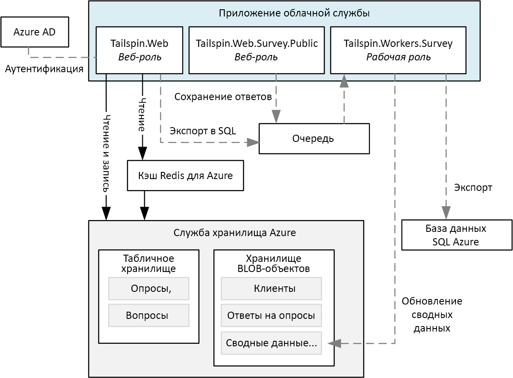
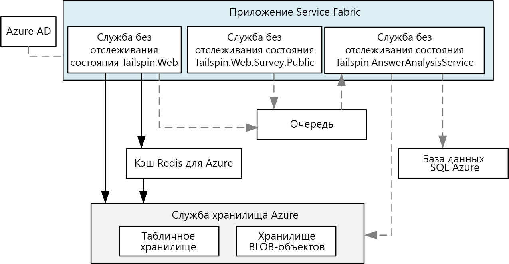
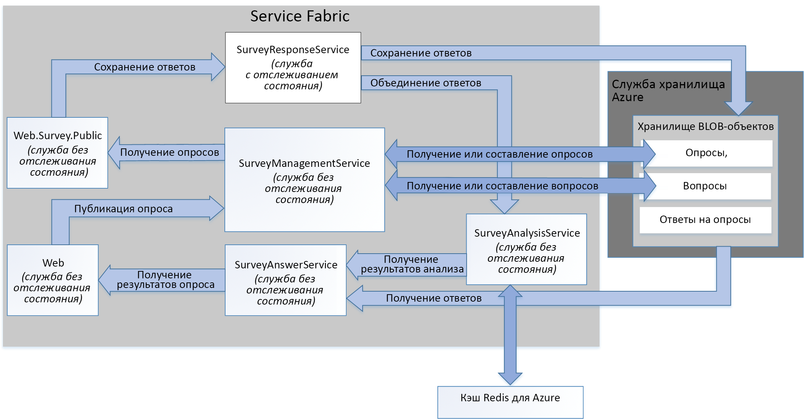

# <a name="refactor-an-azure-service-fabric-application-migrated-from-azure-cloud-services"></a><span data-ttu-id="1a34c-103">Рефакторинг приложения, перенесенного из облачных служб Azure в Azure Service Fabric</span><span class="sxs-lookup"><span data-stu-id="1a34c-103">Refactor an Azure Service Fabric Application migrated from Azure Cloud Services</span></span>

<span data-ttu-id="1a34c-104">[ Пример кода][sample-code]</span><span class="sxs-lookup"><span data-stu-id="1a34c-104">[ Sample code][sample-code]</span></span>

<span data-ttu-id="1a34c-105">В этой статье описывается выполнение рефакторинга существующего приложения Azure Service Fabric для детализированной настройки архитектуры.</span><span class="sxs-lookup"><span data-stu-id="1a34c-105">This article describes refactoring an existing Azure Service Fabric application to a more granular architecture.</span></span> <span data-ttu-id="1a34c-106">Статья содержит рекомендации по проектированию, упаковке, обеспечению производительности и развертыванию оптимизированного приложения Service Fabric.</span><span class="sxs-lookup"><span data-stu-id="1a34c-106">This article focuses on the design, packaging, performance, and deployment considerations of the refactored Service Fabric application.</span></span>

## <a name="scenario"></a><span data-ttu-id="1a34c-107">Сценарий</span><span class="sxs-lookup"><span data-stu-id="1a34c-107">Scenario</span></span>

<span data-ttu-id="1a34c-108">Как описано в предыдущей статье о [переносе приложения облачных служб Azure в Azure Service Fabric][migrate-from-cloud-services], команда, занимающаяся разработкой шаблонов и рекомендаций, выпустила в 2012 г. книгу, в которой описан процесс проектирования и реализации приложения облачных служб в Azure вымышленной компанией Tailspin.</span><span class="sxs-lookup"><span data-stu-id="1a34c-108">As discussed in the previous article, [Migrating an Azure Cloud Services application to Azure Service Fabric][migrate-from-cloud-services], the patterns & practices team authored a book in 2012 that documented the process for designing and implementing a Cloud Services application in Azure.</span></span> <span data-ttu-id="1a34c-109">Эта компания проектирует и внедряет приложение облачных служб, которое называется **Surveys**.</span><span class="sxs-lookup"><span data-stu-id="1a34c-109">The book describes a fictitious company named Tailspin that wants to create a Cloud Services application named **Surveys**.</span></span> <span data-ttu-id="1a34c-110">Приложение Surveys позволяет пользователям создавать и публиковать опросы, на которые можно отвечать в Интернете.</span><span class="sxs-lookup"><span data-stu-id="1a34c-110">The Surveys application allows users to create and publish surveys that can be answered by the public.</span></span> <span data-ttu-id="1a34c-111">На следующей схеме показана архитектура этой версии приложения Surveys:</span><span class="sxs-lookup"><span data-stu-id="1a34c-111">The following diagram shows the architecture of this version of the Surveys application:</span></span>



<span data-ttu-id="1a34c-112">Веб-роль **Tailspin.Web** размещает сайт MVC ASP.NET, который клиенты Tailspin используют следующим образом:</span><span class="sxs-lookup"><span data-stu-id="1a34c-112">The **Tailspin.Web** web role hosts an ASP.NET MVC site that Tailspin customers use to:</span></span>
* <span data-ttu-id="1a34c-113">для регистрации в приложении Surveys;</span><span class="sxs-lookup"><span data-stu-id="1a34c-113">sign up for the Surveys application,</span></span>
* <span data-ttu-id="1a34c-114">для создания или удаления отдельных запросов;</span><span class="sxs-lookup"><span data-stu-id="1a34c-114">create or delete a single survey,</span></span>
* <span data-ttu-id="1a34c-115">для просмотра результатов отдельных опросов;</span><span class="sxs-lookup"><span data-stu-id="1a34c-115">view results for a single survey,</span></span>
* <span data-ttu-id="1a34c-116">для экспорта результатов опроса в SQL;</span><span class="sxs-lookup"><span data-stu-id="1a34c-116">request that survey results be exported to SQL, and</span></span>
* <span data-ttu-id="1a34c-117">для просмотра и анализа агрегированных результатов опроса.</span><span class="sxs-lookup"><span data-stu-id="1a34c-117">view aggregated survey results and analysis.</span></span>

<span data-ttu-id="1a34c-118">Веб-роль **Tailspin.Web.Survey.Public** также размещает сайт MVC ASP.NET, на который пользователи заходят для заполнения опросов.</span><span class="sxs-lookup"><span data-stu-id="1a34c-118">The **Tailspin.Web.Survey.Public** web role also hosts an ASP.NET MVC site that the public visits to fill out the surveys.</span></span> <span data-ttu-id="1a34c-119">Эти ответы помещаются в очередь для сохранения.</span><span class="sxs-lookup"><span data-stu-id="1a34c-119">These responses are put in a queue to be saved.</span></span>

<span data-ttu-id="1a34c-120">Рабочая роль **Tailspin.Workers.Survey** выполняет фоновую обработку, собирая запросы из нескольких очередей.</span><span class="sxs-lookup"><span data-stu-id="1a34c-120">The **Tailspin.Workers.Survey** worker role performs background processing by picking up requests from multiple queues.</span></span>

<span data-ttu-id="1a34c-121">Группа, разрабатывающая шаблоны и практические рекомендации, затем создала новый проект, чтобы перенести это приложение в Azure Service Fabric.</span><span class="sxs-lookup"><span data-stu-id="1a34c-121">The patterns & practices team then created a new project to port this application to Azure Service Fabric.</span></span> <span data-ttu-id="1a34c-122">Задачей этого проекта было изменение кода, необходимое только для запуска приложения в кластере Azure Service Fabric.</span><span class="sxs-lookup"><span data-stu-id="1a34c-122">The goal of this project was to make only the necessary code changes to get the application running in an Azure Service Fabric cluster.</span></span> <span data-ttu-id="1a34c-123">В результате архитектура исходных рабочих ролей и веб-ролей осталась неизменной.</span><span class="sxs-lookup"><span data-stu-id="1a34c-123">As a result, the original web and worker roles were not decomposed into a more granular architecture.</span></span> <span data-ttu-id="1a34c-124">Эта архитектура очень похожа на версию приложения облачной службы:</span><span class="sxs-lookup"><span data-stu-id="1a34c-124">The resulting architecture is very similar to the Cloud Service version of the application:</span></span>



<span data-ttu-id="1a34c-125">Служба **Tailspin.Web** переносится из исходной веб-роли *Tailspin.Web*.</span><span class="sxs-lookup"><span data-stu-id="1a34c-125">The **Tailspin.Web** service is ported from the original *Tailspin.Web* web role.</span></span>

<span data-ttu-id="1a34c-126">Служба **Tailspin.Web.Survey.Public** переносится из исходной веб-роли *Tailspin.Web.Survey.Public*.</span><span class="sxs-lookup"><span data-stu-id="1a34c-126">The **Tailspin.Web.Survey.Public** service is ported from the original *Tailspin.Web.Survey.Public* web role.</span></span>

<span data-ttu-id="1a34c-127">Служба **Tailspin.AnswerAnalysisService** переносится из исходной рабочей роли *Tailspin.Workers.Survey*.</span><span class="sxs-lookup"><span data-stu-id="1a34c-127">The **Tailspin.AnswerAnalysisService** service is ported from the original *Tailspin.Workers.Survey* worker role.</span></span>

> [!NOTE] 
> <span data-ttu-id="1a34c-128">Хотя в каждую из рабочих ролей и веб-ролей были внесены минимальные изменения кода, **Tailspin.Web** и **Tailspin.Web.Survey.Public** были изменены для резидентного размещения веб-сервера [Kestrel].</span><span class="sxs-lookup"><span data-stu-id="1a34c-128">While minimal code changes were made to each of the web and worker roles, **Tailspin.Web** and **Tailspin.Web.Survey.Public** were modified to self-host a [Kestrel] web server.</span></span> <span data-ttu-id="1a34c-129">Предыдущая версия приложения Surveys представляла собой приложение ASP.Net, которое было размещено с использованием Interet Information Services (IIS), но без возможности запуска IIS в качестве службы в Service Fabric.</span><span class="sxs-lookup"><span data-stu-id="1a34c-129">The earlier Surveys application is an ASP.Net application that was hosted using Interet Information Services (IIS), but it is not possible to run IIS as a service in Service Fabric.</span></span> <span data-ttu-id="1a34c-130">Следовательно, любой веб-сервер должен иметь возможность резидентного размещения, как например [Kestrel].</span><span class="sxs-lookup"><span data-stu-id="1a34c-130">Therefore, any web server must be capable of being self-hosted, such as [Kestrel].</span></span> <span data-ttu-id="1a34c-131">В некоторых ситуациях возможно запускать службы IIS в контейнере в Service Fabric.</span><span class="sxs-lookup"><span data-stu-id="1a34c-131">It is possible to run IIS in a container in Service Fabric in some situations.</span></span> <span data-ttu-id="1a34c-132">См. [сценарии использования контейнеров][container-scenarios].</span><span class="sxs-lookup"><span data-stu-id="1a34c-132">See [scenarios for using containers][container-scenarios] for more information.</span></span>  

<span data-ttu-id="1a34c-133">Теперь компания Tailspin выполняет рефакторинг приложения для обеспечения более детализированной архитектуры.</span><span class="sxs-lookup"><span data-stu-id="1a34c-133">Now, Tailspin is refactoring the Surveys application to a more granular architecture.</span></span> <span data-ttu-id="1a34c-134">Это делается для того, чтобы упростить разработку, сборку и развертывание приложения Surveys.</span><span class="sxs-lookup"><span data-stu-id="1a34c-134">Tailspin's motivation for refactoring is to make it easier to develop, build, and deploy the Surveys application.</span></span> <span data-ttu-id="1a34c-135">Разбивая существующие рабочие роли и веб-роли для получения более детализированной архитектуры, компания Tailspin хочет удалить тесно связанные зависимости данных и передачи данных между этими ролями.</span><span class="sxs-lookup"><span data-stu-id="1a34c-135">By decomposing the existing web and worker roles to a more granular architecture, Tailspin wants to remove the existing tightly coupled communication and data dependencies between these roles.</span></span>

<span data-ttu-id="1a34c-136">Компания Tailspin ожидает от рефакторинга приложения и другие преимущества.</span><span class="sxs-lookup"><span data-stu-id="1a34c-136">Tailspin sees other benefits in moving the Surveys application to a more granular architecture:</span></span>
* <span data-ttu-id="1a34c-137">Каждая служба может быть упакована в независимые проекты с достаточно небольшой областью, чтобы ими могла управлять небольшая команда.</span><span class="sxs-lookup"><span data-stu-id="1a34c-137">Each service can be packaged into independent projects with a scope small enough to be managed by a small team.</span></span>
* <span data-ttu-id="1a34c-138">Каждая из этих служб может быть отдельно развернута и обновлена до определенной версии.</span><span class="sxs-lookup"><span data-stu-id="1a34c-138">Each service can be independently versioned and deployed.</span></span>
* <span data-ttu-id="1a34c-139">Каждая служба может быть реализована с использованием самой оптимальной технологии для этой службы.</span><span class="sxs-lookup"><span data-stu-id="1a34c-139">Each service can be implemented using the best technology for that service.</span></span> <span data-ttu-id="1a34c-140">Например, кластер Service Fabric может включать службы, созданные с помощью разных версий платформы .Net, Java или других языков, например C или C++.</span><span class="sxs-lookup"><span data-stu-id="1a34c-140">For example, a service fabric cluster can include services built using different versions of the .Net Frameworks, Java, or other languages such as C or C++.</span></span>
* <span data-ttu-id="1a34c-141">Каждая служба может масштабироваться независимо друг от друга в ответ на увеличение и уменьшение нагрузки.</span><span class="sxs-lookup"><span data-stu-id="1a34c-141">Each service can be independently scaled to respond to increases and decreases in load.</span></span>

> [!NOTE] 
> <span data-ttu-id="1a34c-142">Мультитенантность не входит в задачи, решаемые с помощью рефакторинга этого приложения.</span><span class="sxs-lookup"><span data-stu-id="1a34c-142">Multitenancy is out of scope for the refactoring of this application.</span></span> <span data-ttu-id="1a34c-143">У компании Tailspin есть несколько вариантов для обеспечения мультитенантности. Эти решения можно реализовать позже без необходимости изменять исходный проект.</span><span class="sxs-lookup"><span data-stu-id="1a34c-143">Tailspin has several options to support multitenancy and can make these design decisions later without affecting the initial design.</span></span> <span data-ttu-id="1a34c-144">Например, Tailspin может создать отдельные экземпляры служб для каждого клиента в кластере или отдельный кластер для каждого клиента.</span><span class="sxs-lookup"><span data-stu-id="1a34c-144">For example, Tailspin can create separate instances of the services for each tenant within a cluster or create a separate cluster for each tenant.</span></span>

## <a name="design-considerations"></a><span data-ttu-id="1a34c-145">Рекомендации по проектированию</span><span class="sxs-lookup"><span data-stu-id="1a34c-145">Design considerations</span></span>
 
<span data-ttu-id="1a34c-146">На следующей схеме показана оптимизированная архитектура приложения Surveys:</span><span class="sxs-lookup"><span data-stu-id="1a34c-146">The following diagram shows the architecture of the Surveys application refactored to a more granular architecture:</span></span>



<span data-ttu-id="1a34c-147">**Tailspin.Web** — это размещенное резидентно приложение MVC ASP.NET службы без отслеживания состояния, которое клиенты Tailspin посещают для создания опросов и просмотра результатов.</span><span class="sxs-lookup"><span data-stu-id="1a34c-147">**Tailspin.Web** is a stateless service self-hosting an ASP.NET MVC application that Tailspin customers visit to create surveys and view survey results.</span></span> <span data-ttu-id="1a34c-148">Большая часть кода используется службой совместно с *Tailspin.Web* из перенесенного приложения Service Fabric.</span><span class="sxs-lookup"><span data-stu-id="1a34c-148">This service shares most of its code with the *Tailspin.Web* service from the ported Service Fabric application.</span></span> <span data-ttu-id="1a34c-149">Как упоминалось ранее, эта служба использует ASP.NET Core, переключаясь с использования Kestrel в качестве веб-интерфейса к реализации WebListener.</span><span class="sxs-lookup"><span data-stu-id="1a34c-149">As mentioned earlier, this service uses ASP.NET core and switches from using Kestrel as web frontend to implementing a WebListener.</span></span>

<span data-ttu-id="1a34c-150">**Tailspin.Web.Surveys.Public** — это служба без сохранения состояния, которая также резидентно размещает сайт MVC ASP.NET.</span><span class="sxs-lookup"><span data-stu-id="1a34c-150">**Tailspin.Web.Surveys.Public** is a stateless service also self-hosting an ASP.NET MVC site.</span></span> <span data-ttu-id="1a34c-151">Пользователи посещают этот сайт для выбора опросов из списка и их последующего заполнения. Эта служба совместно использует большую часть своего кода со службой *Tailspin.Web.Survey.Public* из перенесенного приложения Service Fabric.</span><span class="sxs-lookup"><span data-stu-id="1a34c-151">Users visit this site to select surveys from a list and then fill them out. This service shares most of its code with the *Tailspin.Web.Survey.Public* service from the ported Service Fabric application.</span></span> <span data-ttu-id="1a34c-152">Эта служба также использует ASP.NET Core, переключаясь с использования Kestrel в качестве веб-интерфейса к реализации WebListener.</span><span class="sxs-lookup"><span data-stu-id="1a34c-152">This service also uses ASP.NET Core and also switches from using Kestrel as web frontend to implementing a WebListener.</span></span>

<span data-ttu-id="1a34c-153">**Tailspin.SurveyResponseService** — это служба с отслеживанием состояния, которая хранит ответы на опросы в хранилище BLOB-объектов Azure.</span><span class="sxs-lookup"><span data-stu-id="1a34c-153">**Tailspin.SurveyResponseService** is a stateful service that stores survey answers in Azure Blob Storage.</span></span> <span data-ttu-id="1a34c-154">Она также объединяет ответы в данные для анализа опросов.</span><span class="sxs-lookup"><span data-stu-id="1a34c-154">It also merges answers into the survey analysis data.</span></span> <span data-ttu-id="1a34c-155">Служба реализована как служба с отслеживанием состояния, так как она использует [ReliableConcurrentQueue][reliable-concurrent-queue] для пакетной обработки ответов.</span><span class="sxs-lookup"><span data-stu-id="1a34c-155">The service is implemented as a stateful service because it uses a [ReliableConcurrentQueue][reliable-concurrent-queue] to process survey answers in batches.</span></span> <span data-ttu-id="1a34c-156">Эта возможность была изначально реализована в службе *Tailspin.Web.Survey.Public* из перенесенного приложения Service Fabric.</span><span class="sxs-lookup"><span data-stu-id="1a34c-156">This functionality was originally implemented in the *Tailspin.Web.Survey.Public* service in the ported Service Fabric application.</span></span> <span data-ttu-id="1a34c-157">Компания Tailspin выполнила рефакторинг исходных функций этой службы, чтобы ее можно было независимо масштабировать.</span><span class="sxs-lookup"><span data-stu-id="1a34c-157">Tailspin refactored the original functionality into this service to allow it to scale independently.</span></span>

<span data-ttu-id="1a34c-158">**Tailspin.SurveyManagementService** — это служба без отслеживания состояния, которая сохраняет и извлекает опросы, а также вопросы из опросов.</span><span class="sxs-lookup"><span data-stu-id="1a34c-158">**Tailspin.SurveyManagementService** is a stateless service that stores and retrieves surveys and survey questions.</span></span> <span data-ttu-id="1a34c-159">Эта служба использует хранилище BLOB-объектов Azure.</span><span class="sxs-lookup"><span data-stu-id="1a34c-159">The service uses Azure Blob storage.</span></span> <span data-ttu-id="1a34c-160">Эта функция была также изначально реализована в службе *Tailspin.AnswerAnalysisService* в перенесенном приложении Service Fabric.</span><span class="sxs-lookup"><span data-stu-id="1a34c-160">This functionality was also originally implemented in the *Tailspin.AnswerAnalysisService* service in the ported Service Fabric application.</span></span> <span data-ttu-id="1a34c-161">Компания Tailspin выполнила рефакторинг исходных функций этой службы, чтобы ее также можно было независимо масштабировать.</span><span class="sxs-lookup"><span data-stu-id="1a34c-161">Tailspin refactored the original functionality into this service to also allow it to scale independently.</span></span>

<span data-ttu-id="1a34c-162">**Tailspin.SurveyAnswerService** — это служба без сохранения состояния, которая извлекает ответы на опросы и выполняет анализ опросов.</span><span class="sxs-lookup"><span data-stu-id="1a34c-162">**Tailspin.SurveyAnswerService** is a stateless service that retrieves survey answers and survey analysis.</span></span> <span data-ttu-id="1a34c-163">Эта служба также использует хранилище BLOB-объектов Azure.</span><span class="sxs-lookup"><span data-stu-id="1a34c-163">The service also uses Azure Blob storage.</span></span> <span data-ttu-id="1a34c-164">Эта функция была также изначально реализована в службе *Tailspin.AnswerAnalysisService* в перенесенном приложении Service Fabric.</span><span class="sxs-lookup"><span data-stu-id="1a34c-164">This functionality was also originally implemented in the *Tailspin.AnswerAnalysisService* service in the ported Service Fabric application.</span></span> <span data-ttu-id="1a34c-165">Компания Tailspin выполнила рефакторинг исходных функций этой службы, чтобы обеспечить меньшую нагрузку и использовать меньшее число экземпляров для экономии ресурсов.</span><span class="sxs-lookup"><span data-stu-id="1a34c-165">Tailspin refactored the original functionality into this service because it expects less load and wants to use fewer instances to conserve resources.</span></span>

<span data-ttu-id="1a34c-166">**Tailspin.SurveyAnalysisService** — это служба без сохранения состояния, которая сохраняет сводные данные с ответами на опросы в кэше Redis для быстрого извлечения.</span><span class="sxs-lookup"><span data-stu-id="1a34c-166">**Tailspin.SurveyAnalysisService** is a stateless service that persists survey answer summary data in a Redis cache for quick retrieval.</span></span> <span data-ttu-id="1a34c-167">Эта служба вызывается службой *Tailspin.SurveyResponseService* при получении каждого ответа на опрос. Затем новые данные с ответами на опросы добавляются в сводные данные.</span><span class="sxs-lookup"><span data-stu-id="1a34c-167">This service is called by the *Tailspin.SurveyResponseService* each time a survey is answered and the new survey answer data is merged in the summary data.</span></span> <span data-ttu-id="1a34c-168">Эта служба включает функцию, используемую в службе *Tailspin.AnswerAnalysisService* в перенесенном приложении Service Fabric.</span><span class="sxs-lookup"><span data-stu-id="1a34c-168">This service includes the functionality remaining in the *Tailspin.SurveyAnalysisService* service from the ported Service Fabric application.</span></span>

## <a name="stateless-versus-stateful-services"></a><span data-ttu-id="1a34c-169">Службы без отслеживания состояния и с отслеживанием состояния</span><span class="sxs-lookup"><span data-stu-id="1a34c-169">Stateless versus stateful services</span></span>

<span data-ttu-id="1a34c-170">Azure Service Fabric поддерживает следующие модели программирования:</span><span class="sxs-lookup"><span data-stu-id="1a34c-170">Azure Service Fabric supports the following programming models:</span></span>
* <span data-ttu-id="1a34c-171">Гостевая исполняемая модель позволяет упаковывать любые исполняемые файлы в качестве службы с последующим развертыванием в кластере Service Fabric.</span><span class="sxs-lookup"><span data-stu-id="1a34c-171">The guest executable model allows any executable to be packaged as a service and deployed to a Service Fabric cluster.</span></span> <span data-ttu-id="1a34c-172">Service Fabric организует и администрирует выполнение гостевого исполняемого файла.</span><span class="sxs-lookup"><span data-stu-id="1a34c-172">Service Fabric orchestrates and manages execution of the guest executable.</span></span>
* <span data-ttu-id="1a34c-173">Модель контейнера обеспечивает развертывание служб в образы контейнеров.</span><span class="sxs-lookup"><span data-stu-id="1a34c-173">The container model allows for deployment of services in container images.</span></span> <span data-ttu-id="1a34c-174">Service Fabric поддерживает создание и администрирование контейнеров на основе ядра Linux, а также контейнеры Windows Server.</span><span class="sxs-lookup"><span data-stu-id="1a34c-174">Service Fabric supports creation and and management of containers on top of Linux kernel contains as well as Windows Server containers.</span></span> 
* <span data-ttu-id="1a34c-175">Модель программирования на основе надежных служб позволяет создавать службы без отслеживания состояния или с отслеживанием состояния, интегрируемые со всеми функциями платформы Service Fabric.</span><span class="sxs-lookup"><span data-stu-id="1a34c-175">The reliable services programming model allows for the creation of stateless or stateful services that integrate with all Service Fabric platform features.</span></span> <span data-ttu-id="1a34c-176">Службы с отслеживанием состояния предусматривают сохранение реплицированного состояния в кластере Service Fabric.</span><span class="sxs-lookup"><span data-stu-id="1a34c-176">Stateful services allow for replicated state to be stored in the Service Fabric cluster.</span></span> <span data-ttu-id="1a34c-177">А службы без отслеживания состояния — нет.</span><span class="sxs-lookup"><span data-stu-id="1a34c-177">Stateless services do not.</span></span>
* <span data-ttu-id="1a34c-178">Модель программирования на основе надежных субъектов позволяет создавать службы, реализующие шаблон виртуального субъекта.</span><span class="sxs-lookup"><span data-stu-id="1a34c-178">The reliable actors programming model allows for the creation of services that implement the virtual actor pattern.</span></span>

<span data-ttu-id="1a34c-179">Все службы в приложении Surveys являются надежными службами без сохранения состояния, за исключением службы *Tailspin.SurveyResponseService*.</span><span class="sxs-lookup"><span data-stu-id="1a34c-179">All the services in the Surveys application are stateless reliable services, except for the *Tailspin.SurveyResponseService* service.</span></span> <span data-ttu-id="1a34c-180">Эта служба реализует очередь [ReliableConcurrentQueue][reliable-concurrent-queue] для обработки ответов на опросы при их получении.</span><span class="sxs-lookup"><span data-stu-id="1a34c-180">This service implements a [ReliableConcurrentQueue][reliable-concurrent-queue] to process survey answers when they are received.</span></span> <span data-ttu-id="1a34c-181">Ответы в ReliableConcurrentQueue сохраняются в хранилище BLOB-объектов Azure, а затем передаются в *Tailspin.SurveyAnalysisService* для анализа.</span><span class="sxs-lookup"><span data-stu-id="1a34c-181">Responses in the ReliableConcurrentQueue are saved into Azure Blob Storage and passed to the *Tailspin.SurveyAnalysisService* for analysis.</span></span> <span data-ttu-id="1a34c-182">Компания Tailspin использует ReliableConcurrentQueue, так как ответы не требуют строго последовательного порядка, обеспечиваемого такими решениями, как служебная шина Azure.</span><span class="sxs-lookup"><span data-stu-id="1a34c-182">Tailspin chooses a ReliableConcurrentQueue based because responses do not require strict first-in-first-out (FIFO) ordering provided by a queue such as Azure Service Bus.</span></span> <span data-ttu-id="1a34c-183">ReliableConcurrentQueue также используется для обеспечения высокой пропускной способности и низкой задержки для операций включения данных в очередь и исключения из нее.</span><span class="sxs-lookup"><span data-stu-id="1a34c-183">A ReliableConcurrentQueue is also designed to deliver high throughput and low latency for queue and dequeue operations.</span></span>

<span data-ttu-id="1a34c-184">Обратите внимание, что операции для сохранения элементов, исключенных из очереди ReliableConcurrentQueue, в идеале должны быть идемпотентными.</span><span class="sxs-lookup"><span data-stu-id="1a34c-184">Note that operations to persist dequeued items from a ReliableConcurrentQueue should ideally be idempotent.</span></span> <span data-ttu-id="1a34c-185">Если во время обработки элемента в очереди создается исключение, один и тот же элемент может обрабатываться несколько раз.</span><span class="sxs-lookup"><span data-stu-id="1a34c-185">If an exception is thrown during the processing of an item from the queue, the same item may be processed more than once.</span></span> <span data-ttu-id="1a34c-186">В приложении Surveys операции слияния ответов на опросы в *Tailspin.SurveyAnalysisService* не являются идемпотентными, так как компания Tailspin решила, что данные анализа опроса представляют только текущий моментальный снимок данных, которые могут не быть согласованными.</span><span class="sxs-lookup"><span data-stu-id="1a34c-186">In the Surveys application, the operation to merge survey answers to the *Tailspin.SurveyAnalysisService* is not idempotent because Tailspin decided that the survey analysis data is only a current snapshot of the analysis data and does not need to be consistent.</span></span> <span data-ttu-id="1a34c-187">Ответы на опросы, сохраненные в хранилище BLOB-объектов Azure, характеризуются конечной согласованностью, так что итоговый анализ опроса всегда можно выполнить повторно на основе этих данных.</span><span class="sxs-lookup"><span data-stu-id="1a34c-187">The survey answers saved to Azure Blob Storage are eventually consistent, so the survey final analysis can always be recalculated correctly from this data.</span></span>

## <a name="communication-framework"></a><span data-ttu-id="1a34c-188">Платформа взаимодействия</span><span class="sxs-lookup"><span data-stu-id="1a34c-188">Communication framework</span></span>

<span data-ttu-id="1a34c-189">Каждая служба в приложении Surveys взаимодействует с помощью веб-API RESTful.</span><span class="sxs-lookup"><span data-stu-id="1a34c-189">Each service in the Surveys application communicates using a RESTful web API.</span></span> <span data-ttu-id="1a34c-190">API RESTful предлагают следующие преимущества:</span><span class="sxs-lookup"><span data-stu-id="1a34c-190">RESTful APIs offer the following benefits:</span></span>
* <span data-ttu-id="1a34c-191">Простота использования. Каждая служба создана с использованием MVC ASP.Net Core с изначальной поддержкой создания веб-API.</span><span class="sxs-lookup"><span data-stu-id="1a34c-191">Ease of use: each service is built using ASP.Net Core MVC, which natively supports the creation of Web APIs.</span></span>
* <span data-ttu-id="1a34c-192">Безопасность. Хотя всем службам не требуется SSL, компания Tailspin может настроить использование этого протокола.</span><span class="sxs-lookup"><span data-stu-id="1a34c-192">Security: While each service does not require SSL, Tailspin could require each service to do so.</span></span> 
* <span data-ttu-id="1a34c-193">Управление версиями. Клиенты могут создаваться и тестироваться для конкретной версии веб-API.</span><span class="sxs-lookup"><span data-stu-id="1a34c-193">Versioning: clients can be written and tested against a specific version of a web API.</span></span>

<span data-ttu-id="1a34c-194">Службы в приложении Survey используют [обратный прокси-сервер][reverse-proxy], реализуемый Service Fabric.</span><span class="sxs-lookup"><span data-stu-id="1a34c-194">Services in the Survey application make use of the [reverse proxy][reverse-proxy] implemented by Service Fabric.</span></span> <span data-ttu-id="1a34c-195">Обратный прокси-сервер — это служба, которая работает на каждом узле в кластере Service Fabric, обеспечивая разрешение конечных точек и автоматический повтор операций, а также обработку других типов сбоев подключения.</span><span class="sxs-lookup"><span data-stu-id="1a34c-195">Reverse proxy is a service that runs on each node in the Service Fabric cluster and provides endpoint resolution, automatic retry, and handles other types of connection failures.</span></span> <span data-ttu-id="1a34c-196">Чтобы использовать обратный прокси-сервер, каждый вызов API RESTful к определенной службе выполняется с помощью предопределенного порта обратного прокси-сервера.</span><span class="sxs-lookup"><span data-stu-id="1a34c-196">To use the reverse proxy, each RESTful API call to a specific service is made using a predefined reverse proxy port.</span></span>  <span data-ttu-id="1a34c-197">Например, если задан порт **19081** обратного прокси-сервера, вызов *Tailspin.SurveyAnswerService* можно выполнить следующим образом:</span><span class="sxs-lookup"><span data-stu-id="1a34c-197">For example, if the reverse proxy port has been set to **19081**, a call to the *Tailspin.SurveyAnswerService* can be made as follows:</span></span>

```csharp
static SurveyAnswerService()
{
    httpClient = new HttpClient
    {
        BaseAddress = new Uri("http://localhost:19081/Tailspin/SurveyAnswerService/")
    };
}
```
<span data-ttu-id="1a34c-198">Чтобы включить обратный прокси-сервер, укажите порт обратного прокси-сервера во время создания кластера Service Fabric.</span><span class="sxs-lookup"><span data-stu-id="1a34c-198">To enable reverse proxy, specify a reverse proxy port during creation of the Service Fabric cluster.</span></span> <span data-ttu-id="1a34c-199">См. дополнительные сведения об [обратном прокси-сервере][reverse-proxy] в Azure Service Fabric.</span><span class="sxs-lookup"><span data-stu-id="1a34c-199">For more information, see [reverse proxy][reverse-proxy] in Azure Service Fabric.</span></span>

## <a name="performance-considerations"></a><span data-ttu-id="1a34c-200">Рекомендации по производительности</span><span class="sxs-lookup"><span data-stu-id="1a34c-200">Performance considerations</span></span>

<span data-ttu-id="1a34c-201">Компания Tailspin создала службы ASP.NET Core *Tailspin.Web* и *Tailspin.Web.Surveys.Public* с помощью шаблонов Visual Studio.</span><span class="sxs-lookup"><span data-stu-id="1a34c-201">Tailspin created the ASP.NET Core services for *Tailspin.Web* and *Tailspin.Web.Surveys.Public* using Visual Studio templates.</span></span> <span data-ttu-id="1a34c-202">По умолчанию эти шаблоны включают ведение журнала в консоли.</span><span class="sxs-lookup"><span data-stu-id="1a34c-202">By default, these templates include logging to the console.</span></span> <span data-ttu-id="1a34c-203">Ведение журнала в консоли может выполняться во время разработки и отладки, но при развертывании приложения в рабочей среде следует удалить все операции ведения журнала.</span><span class="sxs-lookup"><span data-stu-id="1a34c-203">Logging to the console may be done during development and debugging, but all logging to the console should be removed when the application is deployed to production.</span></span>

> [!NOTE]
> <span data-ttu-id="1a34c-204">Дополнительные сведения о настройке мониторинга и диагностике приложений Service Fabric, выполняющихся в рабочей среде, см. в руководстве по [мониторингу и диагностике][monitoring-diagnostics] для Azure Service Fabric.</span><span class="sxs-lookup"><span data-stu-id="1a34c-204">For more information about setting up monitoring and diagnostics for Service Fabric applications running in production, see [monitoring and diagnostics][monitoring-diagnostics] for Azure Service Fabric.</span></span>

<span data-ttu-id="1a34c-205">Например, следует закомментировать следующие строки в файле *startup.cs* для каждой службы веб-интерфейса:</span><span class="sxs-lookup"><span data-stu-id="1a34c-205">For example, the following lines in *startup.cs* for each of the web front end services should be commented out:</span></span>

```csharp
// This method gets called by the runtime. Use this method to configure the HTTP request pipeline.
public void Configure(IApplicationBuilder app, IHostingEnvironment env, ILoggerFactory loggerFactory)
{
    //loggerFactory.AddConsole(Configuration.GetSection("Logging"));
    //loggerFactory.AddDebug();

    app.UseMvc();
}
```

> [!NOTE]
> <span data-ttu-id="1a34c-206">Эти строки могут условно исключаться, когда Visual Studio настраивается на режим выпуска при публикации.</span><span class="sxs-lookup"><span data-stu-id="1a34c-206">These lines may be conditionally excluded when Visual Studio is set to “release” when publishing.</span></span>

<span data-ttu-id="1a34c-207">Наконец, когда компания Tailspin развертывает приложения Tailspin в рабочей среде, она переключает Visual Studio в режим **выпуска**.</span><span class="sxs-lookup"><span data-stu-id="1a34c-207">Finally, when Tailspin deploys the Tailspin application to production, they switch Visual Studio to **release** mode.</span></span>

## <a name="deployment-considerations"></a><span data-ttu-id="1a34c-208">Рекомендации по развертыванию</span><span class="sxs-lookup"><span data-stu-id="1a34c-208">Deployment considerations</span></span>

<span data-ttu-id="1a34c-209">Оптимизированное приложение Surveys состоит из пяти служб без сохранения состояния и одной службы с отслеживанием состояния, поэтому планирование кластера ограничивается определением правильного размера виртуальной машины и числа узлов.</span><span class="sxs-lookup"><span data-stu-id="1a34c-209">The refactored Surveys application is composed of five stateless services and one stateful service, so cluster planning is limited to determining the correct VM size and number of nodes.</span></span> <span data-ttu-id="1a34c-210">В файле *applicationmanifest.xml*, который описывает кластер, компания Tailspin настраивает для атрибута *InstanceCount* тега *StatelessService* значение -1 для каждой из служб.</span><span class="sxs-lookup"><span data-stu-id="1a34c-210">In the *applicationmanifest.xml* file that describes the cluster, Tailspin sets the *InstanceCount* attribute of the *StatelessService* tag to -1 for each of the services.</span></span> <span data-ttu-id="1a34c-211">Значение -1 указывает Service Fabric создавать экземпляр службы на каждом узле в кластере.</span><span class="sxs-lookup"><span data-stu-id="1a34c-211">A value of -1 directs Service Fabric to create an instance of the service on each node in the cluster.</span></span>

> [!NOTE]
> <span data-ttu-id="1a34c-212">Службы с отслеживанием состояния требуют выполнения дополнительного шага — планирования правильного числа разделов и реплик для своих данных.</span><span class="sxs-lookup"><span data-stu-id="1a34c-212">Stateful services require the additional step of planning the correct number of partitions and replicas for their data.</span></span>

<span data-ttu-id="1a34c-213">Компания Tailspin развертывает кластер с помощью портала Azure.</span><span class="sxs-lookup"><span data-stu-id="1a34c-213">Tailspin deploys the cluster using the Azure Portal.</span></span> <span data-ttu-id="1a34c-214">Тип ресурса кластера Service Fabric развертывает всю необходимую инфраструктуру, включая масштабируемый набор виртуальных машин и подсистему балансировки нагрузки.</span><span class="sxs-lookup"><span data-stu-id="1a34c-214">The Service Fabric Cluster resource type deploys all of the necessary infrastructure, including VM scale sets and a load balancer.</span></span> <span data-ttu-id="1a34c-215">Рекомендуемые размеры виртуальных машин отображаются на портале Azure во время процесса подготовки кластера Service Fabric.</span><span class="sxs-lookup"><span data-stu-id="1a34c-215">The recommended VM sizes are displayed in the Azure portal during the provisioning process for the Service Fabric cluster.</span></span> <span data-ttu-id="1a34c-216">Обратите внимание: так как виртуальные машины развертываются в масштабируемом наборе виртуальных машин, они могут масштабироваться в соответствии с изменением пользовательской нагрузки.</span><span class="sxs-lookup"><span data-stu-id="1a34c-216">Note that because the VMs are deployed in a VM scale set, they can be both scaled up and out as user load increases.</span></span>

> [!NOTE]
> <span data-ttu-id="1a34c-217">Как было сказано ранее, в перенесенной версии приложения Surveys два веб-интерфейса были резидентно размещены с помощью ASP.Net Core и Kestrel в качестве веб-сервера.</span><span class="sxs-lookup"><span data-stu-id="1a34c-217">As discussed earlier, in the migrated version of the Surveys application the two web front ends were self-hosted using ASP.Net Core and Kestrel as a web server.</span></span> <span data-ttu-id="1a34c-218">Хотя перенесенная версия приложения Surveys не использует обратный прокси-сервер, настоятельно рекомендуется использовать обратный прокси-сервер, например IIS, Nginx или Apache.</span><span class="sxs-lookup"><span data-stu-id="1a34c-218">While the migrated version of the Survey application does not use a reverse proxy, it is strongly recommended to use a reverse proxy such as IIS, Nginx, or Apache.</span></span> <span data-ttu-id="1a34c-219">Дополнительные сведения см. в руководстве по [реализации веб-сервера Kestrel в ASP.NET Core][kestrel-intro].</span><span class="sxs-lookup"><span data-stu-id="1a34c-219">For more information see [introduction to Kestrel web server implementation in ASP.NET core][kestrel-intro].</span></span>
> <span data-ttu-id="1a34c-220">В перенесенной версии приложения Surveys два веб-интерфейса резидентно размещаются с помощью [WebListener][weblistener] в качестве веб-сервера, следовательно, обратный веб-сервер не требуется.</span><span class="sxs-lookup"><span data-stu-id="1a34c-220">In the refactored Surveys application, the two web front ends are self-hosted using ASP.Net Core with [WebListener][weblistener] as a web server so a reverse proxy is not necessary.</span></span>

## <a name="next-steps"></a><span data-ttu-id="1a34c-221">Дополнительная информация</span><span class="sxs-lookup"><span data-stu-id="1a34c-221">Next steps</span></span>

<span data-ttu-id="1a34c-222">Код приложения Surveys доступен на [GitHub][sample-code].</span><span class="sxs-lookup"><span data-stu-id="1a34c-222">The Surveys application code is available on [GitHub][sample-code].</span></span>

<span data-ttu-id="1a34c-223">Если вы только начинаете работу с [Azure Service Fabric][service-fabric], сначала установите среду разработки, а затем скачайте последнюю версию [пакета SDK для Azure ][azure-sdk] и [пакета SDK для Azure Service Fabric][service-fabric-sdk].</span><span class="sxs-lookup"><span data-stu-id="1a34c-223">If you are just getting started with [Azure Service Fabric][service-fabric], first set up your development environment then download the latest [Azure SDK][azure-sdk] and the [Azure Service Fabric SDK][service-fabric-sdk].</span></span> <span data-ttu-id="1a34c-224">Пакет SDK включает диспетчер кластеров OneBox, так что вы можете развертывать и тестировать приложение Surveys локально с возможностью полной отладки с помощью клавиши F5.</span><span class="sxs-lookup"><span data-stu-id="1a34c-224">The SDK includes the OneBox cluster manager so you can deploy and test the Surveys application locally with full F5 debugging.</span></span>

<!-- links -->
[azure-sdk]: https://azure.microsoft.com/en-us/downloads/archive-net-downloads/
[container-scenarios]: /azure/service-fabric/service-fabric-containers-overview
[kestrel]: https://docs.microsoft.com/aspnet/core/fundamentals/servers/kestrel?tabs=aspnetcore2x
[kestrel-intro]: https://docs.microsoft.com/aspnet/core/fundamentals/servers/kestrel?tabs=aspnetcore1x
[migrate-from-cloud-services]: migrate-from-cloud-services.md
[monitoring-diagnostics]: /azure/service-fabric/service-fabric-diagnostics-overview
[reliable-concurrent-queue]: /azure/service-fabric/service-fabric-reliable-services-reliable-concurrent-queue
[reverse-proxy]: /azure/service-fabric/service-fabric-reverseproxy
[sample-code]: https://github.com/mspnp/cloud-services-to-service-fabric/tree/master/servicefabric-phase-2
[service-fabric]: /azure/service-fabric/service-fabric-get-started
[service-fabric-sdk]: /azure/service-fabric/service-fabric-get-started
[weblistener]: https://docs.microsoft.com/aspnet/core/fundamentals/servers/weblistener