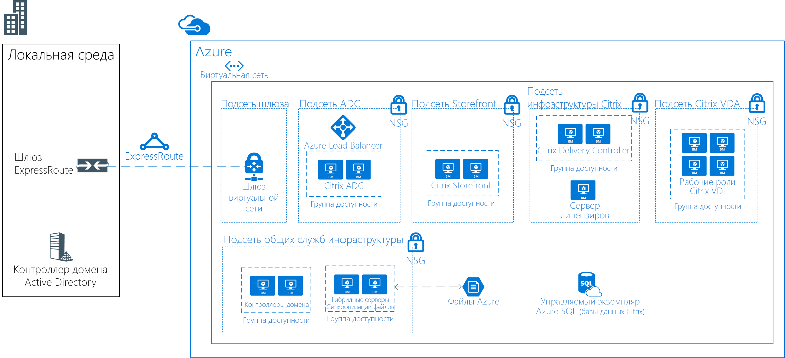

<!-- markdownlint-disable MD033 -->
<!-- markdownlint-disable MD026 -->

# Высокопроизводительные вычисления (HPC) в Azure

## Общие сведения об HPC

<!-- markdownlint-disable MD034 -->

> [!VIDEO https://www.youtube.com/embed/rKURT32faJk]

<!-- markdownlint-enable MD034 -->

Высокопроизводительные вычисления (HPC) (т. н. большие вычисления) используют большое количество ЦП или компьютеров на основе GPU для решения сложных математических задач.

Во многих отраслях HPC используются для решения самых сложных проблем.  Сюда входят следующие рабочие нагрузки:

- Genomics
- модели для нефтяной и газовой промышленности;
- Finance.
- разработка полупроводников;
- Engineering
- моделирование погоды.

### Чем отличается HPC в облаке?

Одним из основных различий между локальной и облачной системами HPC является возможность динамического добавления и удаления ресурсов по мере необходимости.  Динамическое масштабирование исключает избыточную вычислительную емкость, предоставляя клиентам инфраструктуру требуемого в соответствии с поставленными задачами размера.

Следующие материалы содержат дополнительные сведения об этой возможности динамического масштабирования.

- [Стиль архитектуры для больших вычислений](/azure/architecture/guide/architecture-styles/big-compute?context=/azure/architecture/topics/high-performance-computing/context/hpc-context)
- [Рекомендации по автомасштабированию](/azure/architecture/best-practices/auto-scaling?context=/azure/architecture/topics/high-performance-computing/context/hpc-context)

## Контрольный список для реализации

Если вам нужно реализовать собственное решение HPC в Azure, см. следующие материалы:

<!-- markdownlint-disable MD032 -->

> [!div class="checklist"]
> - Выбор соответствующей [архитектуры](#infrastructure) на основе требований.
> - Выбор [вычислительных ресурсов](#compute) для рабочей нагрузки.
> - Определение правильного решения для [хранения](#storage) в соответствии с потребностями.
> - Выбор вариантов [управления](#management) всеми ресурсами.
> - Оптимизация [приложений](#hpc-applications) для использования в облаке.
> - [Защита](#security) инфраструктуры.

<!-- markdownlint-enable MD032 -->

## Инфраструктура

Для создания системы HPC используется ряд компонентов инфраструктуры.  Вычислительные ресурсы, а также ресурсы хранилища и сети предоставляют базовые компоненты независимо от выбранного способа управления рабочими нагрузками HPC.

### Примеры архитектуры HPC

Есть разные подходы к проектированию и реализации архитектуры HPC в Azure.  Приложения HPC позволяют масштабировать тысячи вычислительных ядер, расширять локальные кластеры и выполнять полностью облачные решения.

Приведенные ниже сценарии описывают некоторые распространенные способы создания решений HPC.

<ul class="columns is-multiline has-margin-left-none has-margin-bottom-none has-padding-top-medium">
    <li class="column is-one-third has-padding-top-small-mobile has-padding-bottom-small">
        <a class="is-undecorated is-full-height is-block"
            href="/azure/architecture/example-scenario/apps/hpc-saas?context=/azure/architecture/topics/high-performance-computing/context/hpc-context">
            <article class="card has-outline-hover is-relative is-fullheight">
                    <figure class="image has-margin-right-none has-margin-left-none has-margin-top-none has-margin-bottom-none">
                        
                    </figure>
                

                    

                        <h3 class="is-size-4 has-margin-top-none has-margin-bottom-none has-text-primary">Службы автоматизированного проектирования в Azure</h3>
                    

                    

                        
Предоставление платформы SaaS (программное обеспечение как услуга) для автоматизированного проектирования (CAE) в Azure.

                    

                

            </article>
        </a>
    </li>
    <li class="column is-one-third has-padding-top-small-mobile has-padding-bottom-small">
        <a class="is-undecorated is-full-height is-block"
            href="/azure/architecture/example-scenario/infrastructure/hpc-cfd?context=/azure/architecture/topics/high-performance-computing/context/hpc-context">
            <article class="card has-outline-hover is-relative is-fullheight">
                    <figure class="image has-margin-right-none has-margin-left-none has-margin-top-none has-margin-bottom-none">
                        
                    </figure>
                

                    

                        <h3 class="is-size-4 has-margin-top-none has-margin-bottom-none has-text-primary">Моделирование сценариев вычислительной гидродинамики (CFD) в Azure.</h3>
                    

                    

                        
Моделирование сценариев CFD в Azure.

                    

                

            </article>
        </a>
    </li>
    <li class="column is-one-third has-padding-top-small-mobile has-padding-bottom-small">
        <a class="is-undecorated is-full-height is-block"
            href="/azure/architecture/example-scenario/infrastructure/video-rendering?context=/azure/architecture/topics/high-performance-computing/context/hpc-context">
            <article class="card has-outline-hover is-relative is-fullheight">
                    <figure class="image has-margin-right-none has-margin-left-none has-margin-top-none has-margin-bottom-none">
                        
                    </figure>
                

                    

                        <h3 class="is-size-4 has-margin-top-none has-margin-bottom-none has-text-primary">Отрисовка трехмерного видео на портале Azure</h3>
                    

                    

                        
Выполнение собственных рабочих нагрузок HPC в Azure с использованием пакетной службы Azure.

                    

                

            </article>
        </a>
    </li>
</ul>

### Службы вычислений

Azure предлагает решения разных размеров. Все они оптимизированы для рабочих нагрузок, которые потребляют много ресурсов ЦП и GPU.

#### Виртуальные машины на основе ЦП

- [Виртуальные машины Linux](/azure/virtual-machines/linux/sizes-hpc?context=/azure/architecture/topics/high-performance-computing/context/hpc-context)
- [Виртуальные машины Windows](/azure/virtual-machines/windows/sizes-hpc?context=/azure/architecture/topics/high-performance-computing/context/hpc-context)
  
#### Виртуальные машины с поддержкой GPU

Виртуальные машины серии N оснащены графическими процессорами NVIDIA и предназначены для приложений с ресурсоемкими вычислениями или графикой, в том числе для обучения искусственного интеллекта (AI) и визуализации.

- [Виртуальные машины Linux](/azure/virtual-machines/linux/sizes-gpu?context=/azure/architecture/topics/high-performance-computing/context/hpc-context)
- [Виртуальные машины Windows](/azure/virtual-machines/windows/sizes-gpu?context=/azure/architecture/topics/high-performance-computing/context/hpc-context)

### Хранилище

Масштабные рабочие нагрузки пакетной службы и HPC требуют ресурсов для хранения данных и доступа, которые превышают возможности традиционных файловых систем в облаке.  Управлять скоростью и емкостью приложений HPC в Azure можно разными способами.

- [Avere vFXT](https://azure.microsoft.com/services/storage/avere-vfxt/) — быстрое и доступное хранилище данных для высокопроизводительных вычислений на пограничном устройстве.
- [BeeGFS](https://azure.microsoft.com/resources/implement-glusterfs-on-azure/).
- [Виртуальные машины, оптимизированные для операций в хранилище](/azure/virtual-machines/windows/sizes-storage?context=/azure/architecture/topics/high-performance-computing/context/hpc-context).
- [Хранилище BLOB-объектов, таблиц и очередей](/azure/storage/storage-introduction?context=/azure/architecture/topics/high-performance-computing/context/hpc-context)
- [Хранилище файлов SMB Azure](/azure/storage/files/storage-files-introduction?context=/azure/architecture/topics/high-performance-computing/context/hpc-context).
- [Intel Cloud Edition Lustre](https://azuremarketplace.microsoft.com/marketplace/apps/intel.intel-cloud-edition-gs).

Дополнительные сведения об использовании Lustre, GlusterFS, и BeeGFS в Azure см. в [электронной книге о параллельных файловых системах в Azure](https://blogs.msdn.microsoft.com/azurecat/2018/06/11/azurecat-ebook-parallel-virtual-file-systems-on-microsoft-azure/).

### Сеть

Виртуальные машины H16r, H16mr, A8 и A9 могут подключаться к сети RDMA серверной части с высокой пропускной способностью. Эта сеть может улучшить производительность тесно связанных параллельных приложений, выполняемых на базе Microsoft MPI или Intel MPI.

- [Экземпляры с поддержкой RDMA](/azure/virtual-machines/windows/sizes-hpc?context=/azure/architecture/topics/high-performance-computing/context/hpc-context#rdma-capable-instances)
- [Виртуальная сеть](/azure/virtual-network/virtual-networks-overview?context=/azure/architecture/topics/high-performance-computing/context/hpc-context)
- [ExpressRoute](/azure/expressroute/expressroute-introduction?context=/azure/architecture/topics/high-performance-computing/context/hpc-context)

## управления

### Модель "Сделай сам"

Создание системы HPC в Azure с нуля обеспечивает значительную гибкость, но зачастую при этом требуется интенсивное обслуживание.  

1. Настройка собственной кластерной среды на виртуальных машинах Azure или в [масштабируемых наборах виртуальных машин](/azure/virtual-machine-scale-sets/overview?context=/azure/architecture/topics/high-performance-computing/context/hpc-context).
2. Использование шаблонов Azure Resource Manager для развертывания лучших [диспетчеров рабочих нагрузок](#workload-managers), инфраструктуры и [приложений](#hpc-applications).
3. Выбор [размеров виртуальной машины](#compute) с поддержкой графического процессора и HPC, которые включают специальное оборудование и сетевые подключения для рабочих нагрузок графического процессора или MPI.
4. Добавление [высокопроизводительного хранилища](#storage) для рабочих нагрузок с большим количеством операций ввода-вывода.

### Переход в гибридную и облачную среды

Если у вас есть локальная система HPC, которую вы хотите подключить к Azure, вы можете воспользоваться доступными ресурсами, чтобы приступить к работе.

Для начала ознакомьтесь с [вариантами подключения к локальной сети в Azure](/azure/architecture/reference-architectures/hybrid-networking/?context=/azure/architecture/topics/high-performance-computing/context/hpc-context).  После этого вы можете перейти к изучению сведений о доступных возможностях подключения:

<ul class="columns is-multiline has-margin-left-none has-margin-bottom-none has-padding-top-medium">
    <li class="column is-one-third has-padding-top-small-mobile has-padding-bottom-small">
        <a class="is-undecorated is-full-height is-block"
            href="/azure/architecture/reference-architectures/hybrid-networking/vpn?context=/azure/architecture/topics/high-performance-computing/context/hpc-context">
            <article class="card has-outline-hover is-relative is-fullheight">
                    <figure class="image has-margin-right-none has-margin-left-none has-margin-top-none has-margin-bottom-none">
                        
                    </figure>
                

                    

                        <h3 class="is-size-4 has-margin-top-none has-margin-bottom-none has-text-primary">Подключение локальной сети к Azure с помощью VPN-шлюза</h3>
                    

                    

                        
На схеме этой эталонной архитектуры представлены сведения о том, как расширить локальную сеть в Azure с помощью подключения VPN "сеть — сеть".

                    

                

            </article>
        </a>
    </li>
    <li class="column is-one-third has-padding-top-small-mobile has-padding-bottom-small">
        <a class="is-undecorated is-full-height is-block"
            href="/azure/architecture/reference-architectures/hybrid-networking/expressroute?context=/azure/architecture/topics/high-performance-computing/context/hpc-context">
            <article class="card has-outline-hover is-relative is-fullheight">
                    <figure class="image has-margin-right-none has-margin-left-none has-margin-top-none has-margin-bottom-none">
                        
                    </figure>
                

                    

                        <h3 class="is-size-4 has-margin-top-none has-margin-bottom-none has-text-primary">Подключение локальной сети к Azure с помощью ExpressRoute</h3>
                    

                    

                        
Подключения ExpressRoute создают закрытые выделенные подключения через сети сторонних поставщиков услуг подключения. Такое частное подключение расширяет вашу локальную сеть в Azure.

                    

                

            </article>
        </a>
    </li>
    <li class="column is-one-third has-padding-top-small-mobile has-padding-bottom-small">
        <a class="is-undecorated is-full-height is-block"
            href="/azure/architecture/reference-architectures/hybrid-networking/expressroute-vpn-failover?context=/azure/architecture/topics/high-performance-computing/context/hpc-context">
            <article class="card has-outline-hover is-relative is-fullheight">
                    <figure class="image has-margin-right-none has-margin-left-none has-margin-top-none has-margin-bottom-none">
                        
                    </figure>
                

                    

                        <h3 class="is-size-4 has-margin-top-none has-margin-bottom-none has-text-primary">Подключение локальной сети к Azure с помощью ExpressRoute с отработкой отказа VPN</h3>
                    

                    

                        
Реализуйте архитектуру высокодоступной защищенной сети типа "сеть — сеть", которая охватывает виртуальную сеть Azure и локальную сеть, подключенные с помощью ExpressRoute с отработкой отказа VPN-шлюза.

                    

                

            </article>
        </a>
    </li>
</ul>

Установив безопасное подключение к сети, вы можете начать работу, используя облачные вычислительные ресурсы по требованию и возможности расширения, предоставляемые доступным [диспетчером рабочих нагрузок](#workload-managers).

### Решения Marketplace

В [Azure Marketplace](https://azuremarketplace.microsoft.com/marketplace/) предлагаются разные диспетчеры рабочих нагрузок.

- [HPC RogueWave на основе CentOS](https://azuremarketplace.microsoft.com/marketplace/apps/RogueWave.CentOSbased73HPC?tab=Overview)
- [SUSE Linux Enterprise Server для HPC](https://azure.microsoft.com/marketplace/partners/suse/suselinuxenterpriseserver12optimizedforhighperformancecompute/)
- [TIBCO Grid Server Engine](https://azuremarketplace.microsoft.com/marketplace/apps/tibco-software.gridserverlinuxengine?tab=Overview);
- [Виртуальные машины для анализа и обработки данных для Windows и Linux](/azure/machine-learning/data-science-virtual-machine/overview?context=/azure/architecture/topics/high-performance-computing/context/hpc-context)
- [d3View](https://azuremarketplace.microsoft.com/marketplace/apps/xfinityinc.d3view-v5?tab=Overview);
- [UberCloud](https://azure.microsoft.com/search/marketplace/?q=ubercloud)

### Пакетная служба Azure

[Пакетная служба Azure](/azure/batch/batch-technical-overview?context=/azure/architecture/topics/high-performance-computing/context/hpc-context) — это служба платформы, которая позволяет эффективно работать с приложениями для крупномасштабных параллельных и высокопроизводительных вычислений (HPC) в облаке. Пакетная служба Azure планирует запуск ресурсоемких вычислительных задач в управляемом пуле виртуальных машин и автоматически масштабирует вычислительные ресурсы, учитывая требования заданий.

Разработчики или поставщики SaaS могут использовать пакеты SDK для пакетной службы и средства для интеграции приложений HPC или контейнерных рабочих нагрузок с Azure, промежуточного хранения данных в Azure и создания конвейеров выполнения заданий.

### Azure CycleCloud

[Azure CycleCloud](/azure/cyclecloud/?context=/azure/architecture/topics/high-performance-computing/context/hpc-context) — самый простой способ управлять рабочими нагрузками HPC в Azure с помощью любого планировщика, например Slurm, Grid Engine, HPC Pack, HTCondor, LSF, PBS Pro или Symphony.

CycleCloud позволяет:

- развертывать полные кластеры и другие ресурсы, например планировщики, вычислительные виртуальные машины, хранилища, сети и кэш;
- координировать рабочие процессы, связанные с заданиями, данными и облаком;
- предоставлять администраторам полный контроль над тем, какие пользователи могут запускать задания, а также где они могут это делать и с какими затратами;
- настраивать и оптимизировать кластеры с помощью расширенных политик и системы управления, включая интеграцию с Active Directory, средства контроля затрат, а также инструменты для мониторинга и отчетности;
- использовать доступные планировщики и приложения, не внося в них какие-либо изменения;
- использовать встроенные возможности автомасштабирования, а также проверенные на практике эталонные архитектуры для целого ряда отраслей и рабочих нагрузок HPC.

### Диспетчеры рабочих нагрузок

Ниже приведены примеры диспетчеров рабочих нагрузок и кластеров, которые могут выполняться в инфраструктуре Azure. Создавайте автономные кластеры на виртуальных машинах Azure или переносите нагрузки из локального кластера на виртуальные машины Azure.

- [Alces Flight Compute](https://azuremarketplace.microsoft.com/marketplace/apps/alces-flight-limited.alces-flight-compute-solo?tab=Overview)
- [TIBCO DataSynapse GridServer](https://azure.microsoft.com/blog/tibco-datasynapse-comes-to-the-azure-marketplace/)
- [Bright Cluster Manager](http://www.brightcomputing.com/technology-partners/microsoft)
- [IBM Spectrum Symphony и Symphony LSF](https://azure.microsoft.com/blog/ibm-and-microsoft-azure-support-spectrum-symphony-and-spectrum-lsf/)
- [PBS Pro](http://pbspro.org);
- [Altair](http://www.altair.com/)
- [Rescale](https://www.rescale.com/azure/)
- [Пакет высокопроизводительных вычислений Microsoft](https://technet.microsoft.com/library/mt744885.aspx)
  - [Пакет HPC для Windows](/azure/virtual-machines/windows/hpcpack-cluster-options?context=/azure/architecture/topics/high-performance-computing/context/hpc-context)
  - [Пакет HPC для Linux](/azure/virtual-machines/linux/hpcpack-cluster-options?context=/azure/architecture/topics/high-performance-computing/context/hpc-context)

#### Контейнеры

Для управления некоторыми рабочими нагрузками HPC также можно использовать контейнеры.  Такие решения, как Служба Azure Kubernetes (AKS), упрощают развертывание управляемого кластера Kubernetes в Azure.

- [Служба Azure Kubernetes (AKS)](/azure/aks/intro-kubernetes?context=/azure/architecture/topics/high-performance-computing/context/hpc-context)
- [Реестр контейнеров](/azure/container-registry/container-registry-intro?context=/azure/architecture/topics/high-performance-computing/context/hpc-context)

## управления затратами;

Управление затратами HPC в Azure может осуществляться разными способами.  Чтобы определить наиболее подходящий для вас способ, ознакомьтесь с [вариантами приобретения Azure](https://azure.microsoft.com/pricing/purchase-options/).

[Низкоприоритетные виртуальные машины](/azure/virtual-machine-scale-sets/virtual-machine-scale-sets-use-low-priority?context=/azure/architecture/topics/high-performance-computing/context/hpc-context) позволяют работать с нашей неиспользуемой емкостью при значительной экономии затрат.

## Безопасность

Общие сведения об обеспечении безопасности в Azure см. в [документации по системе безопасности Azure](/azure/security/azure-security?context=/azure/architecture/topics/high-performance-computing/context/hpc-context).  

В дополнение к сетевым конфигурациям, описанным в разделе о [выходе в облако](#hybrid-and-cloud-bursting), вам может потребоваться реализовать звездообразную топологию для изоляции вычислительных ресурсов:

<ul class="columns is-multiline has-margin-left-none has-margin-bottom-none has-padding-top-medium">
    <li class="column is-one-third has-padding-top-small-mobile has-padding-bottom-small">
        <a class="is-undecorated is-full-height is-block"
            href="/azure/architecture/reference-architectures/hybrid-networking/hub-spoke?context=/azure/architecture/topics/high-performance-computing/context/hpc-context">
            <article class="card has-outline-hover is-relative is-fullheight">
                    <figure class="image has-margin-right-none has-margin-left-none has-margin-top-none has-margin-bottom-none">
                        
                    </figure>
                

                    

                        <h3 class="is-size-4 has-margin-top-none has-margin-bottom-none has-text-primary">Реализация звездообразной топологии сети в Azure</h3>
                    

                    

                        
Концентратор (центр топологии) — это виртуальная сеть в Azure, которая выступает в качестве центральной точки подключения к локальной сети. Периферийные зоны — это виртуальные сети, которые устанавливают пиринг с концентратором и могут использоваться для изоляции рабочих нагрузок.

                    

                

            </article>
        </a>
    </li>
    <li class="column is-one-third has-padding-top-small-mobile has-padding-bottom-small">
        <a class="is-undecorated is-full-height is-block"
            href="/azure/architecture/reference-architectures/hybrid-networking/shared-services?context=/azure/architecture/topics/high-performance-computing/context/hpc-context">
            <article class="card has-outline-hover is-relative is-fullheight">
                    <figure class="image has-margin-right-none has-margin-left-none has-margin-top-none has-margin-bottom-none">
                        
                    </figure>
                

                    

                        <h3 class="is-size-4 has-margin-top-none has-margin-bottom-none has-text-primary">Реализация звездообразной топологии сети с помощью общих служб в Azure</h3>
                    

                    

                        
Эта эталонная архитектура создана на основе типовой звездообразной топологии. Она позволяет настроить в концентраторе общие службы, которые можно использовать во всех периферийных зонах.

                    

                

            </article>
        </a>
    </li>
</ul>

## Приложения HPC

Запустите пользовательские или коммерческие приложения HPC в Azure. Некоторые приложения из этого раздела могут эффективно масштабироваться с помощью дополнительных виртуальных машин или вычислительных ядер. Чтобы получить готовые к развертыванию решения, посетите [Azure Marketplace](https://azuremarketplace.microsoft.com/marketplace).

> [!NOTE]
> Проконсультируйтесь с поставщиками всех коммерческих приложений насчет лицензирования или иных ограничений на запуск приложений в облаке. Не все поставщики предлагают лицензирование с оплатой по мере использования. Для вашего решения может потребоваться сервер лицензий в облаке или локальный сервер лицензий.

### Проектирование приложений

- [Altair RADIOSS](https://azure.microsoft.com/blog/availability-of-altair-radioss-rdma-on-microsoft-azure/)
- [ANSYS CFD](https://azure.microsoft.com/blog/ansys-cfd-and-microsoft-azure-perform-the-best-hpc-scalability-in-the-cloud/)
- [MATLAB Distributed Computing Server](/azure/virtual-machines/windows/matlab-mdcs-cluster?context=/azure/architecture/topics/high-performance-computing/context/hpc-context)
- [StarCCM+](https://blogs.msdn.microsoft.com/azurecat/2017/07/07/run-star-ccm-in-an-azure-hpc-cluster/)
- [OpenFOAM](https://simulation.azure.com/casestudies/Team-182-ABB-UC-Final.pdf)

### Графика и отрисовка

- [Autodesk Maya, 3ds Max и Arnold](/azure/batch/batch-rendering-service?context=/azure/architecture/topics/high-performance-computing/context/hpc-context) в пакетной службе Azure

### Искусственный интеллект и глубокое обучение

- [Microsoft Cognitive Toolkit](/cognitive-toolkit/cntk-on-azure)
- [Виртуальная машина для глубокого обучения](https://azuremarketplace.microsoft.com/marketplace/apps/microsoft-ads.dsvm-deep-learning)
- [Инструкции Batch Shipyard для глубокого обучения](https://github.com/Azure/batch-shipyard/tree/master/recipes#deeplearning)

### Поставщики MPI

- [Microsoft MPI](/message-passing-interface/microsoft-mpi)

## Удаленная визуализация

<ul class="columns is-multiline has-margin-left-none has-margin-bottom-none has-padding-top-medium">
    <li class="column is-one-third has-padding-top-small-mobile has-padding-bottom-small">
        <a class="is-undecorated is-full-height is-block"
            href="/azure/architecture/example-scenario/infrastructure/linux-vdi-citrix?context=/azure/architecture/topics/high-performance-computing/context/hpc-context">
            <article class="card has-outline-hover is-relative is-fullheight">
                    <figure class="image has-margin-right-none has-margin-left-none has-margin-top-none has-margin-bottom-none">
                        
                    </figure>
                

                    

                        <h3 class="is-size-4 has-margin-top-none has-margin-bottom-none has-text-primary">Виртуальный рабочий стол Linux с использованием Citrix</h3>
                    

                    

                        
Создание среды VDI для настольных компьютеров Linux с помощью Citrix в Azure.

                    

                

            </article>
        </a>
    </li>
</ul>

## Тесты производительности

- [Тесты вычислительных ресурсов](/azure/virtual-machines/windows/compute-benchmark-scores?context=/azure/architecture/topics/high-performance-computing/context/hpc-context)

## Истории клиентов

Многие клиенты достигли значительного успеха при использовании Azure для рабочих нагрузок HPC.  Некоторые примеры представлены ниже.

- [ANEO](https://customers.microsoft.com/story/it-provider-finds-highly-scalable-cloud-based-hpc-redu)
- [AXA Global P&C](https://customers.microsoft.com/story/axa-global-p-and-c)
- [Axioma](https://customers.microsoft.com/story/axioma-delivers-fintechs-first-born-in-the-cloud-multi-asset-class-enterprise-risk-solution)
- [d3View](https://customers.microsoft.com/story/big-data-solution-provider-adopts-new-cloud-gains-thou)
- [EFS](https://customers.microsoft.com/story/efs-professionalservices-azure)
- [Hymans Robertson](https://customers.microsoft.com/story/hymans-robertson)
- [MetLife](https://enterprise.microsoft.com/customer-story/industries/insurance/metlife/)
- [Microsoft Research](https://customers.microsoft.com/doclink/fast-lmm-and-windows-azure-put-genetics-research-on-fa)
- [Milliman](https://customers.microsoft.com/story/actuarial-firm-works-to-transform-insurance-industry-w)
- [Mitsubishi UFJ Securities International](https://customers.microsoft.com/story/powering-risk-compute-grids-in-the-cloud)
- [NeuroInitiative](https://customers.microsoft.com/story/neuroinitiative-health-provider-azure)
- [Schlumberger](https://azure.microsoft.com/blog/big-compute-for-large-engineering-simulations)
- [Towers Watson](https://customers.microsoft.com/story/insurance-tech-provider-delivers-disruptive-solutions)

## Другие важные сведения

- Убедитесь, что ваша [квота на виртуальные ЦП](/azure/virtual-machines/linux/quotas?context=/azure/architecture/topics/high-performance-computing/context/hpc-context) увеличена, прежде чем выполнять крупномасштабные рабочие нагрузки.

## Дополнительная информация

См. последние объявления:

- [Блог группы Microsoft HPC и пакетной службы](http://blogs.technet.com/b/windowshpc/)
- Ознакомьтесь с [блогом, посвященным Azure](https://azure.microsoft.com/blog/tag/hpc/).

### Примеры заданий пакетной службы Microsoft

Эти руководства содержат сведения о выполняющихся приложениях в пакетной службе Microsoft

- [Сведения о начале разработки с помощью пакетной службы](/azure/batch/quick-run-dotnet?context=/azure/architecture/topics/high-performance-computing/context/hpc-context)
- [Примеры использования кода пакетной службы](https://github.com/Azure/azure-batch-samples)
- [Использование низкоприоритетных виртуальных машин в пакетной службе](/azure/batch/batch-low-pri-vms?context=/azure/architecture/topics/high-performance-computing/context/hpc-context)
- [Сведения о запуске контейнерных рабочих нагрузок HPC с помощью Batch Shipyard](https://github.com/Azure/batch-shipyard)
- [Выполнение параллельных рабочих нагрузок R в пакетной службе](https://github.com/Azure/doAzureParallel)
- [Запуск заданий Spark по требованию в пакетной службе](https://github.com/Azure/aztk)
- [Использование экземпляров с поддержкой RDMA или графического процессора (GPU) в пулах пакетной службы](/azure/batch/batch-pool-compute-intensive-sizes?context=/azure/architecture/topics/high-performance-computing/context/hpc-context)